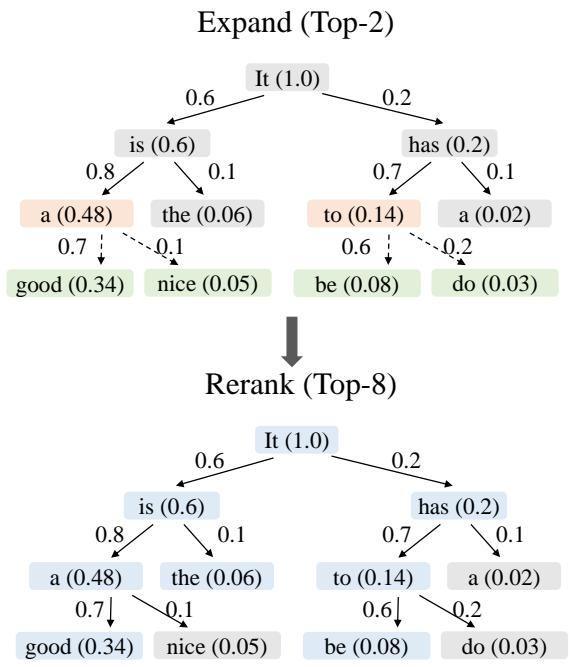
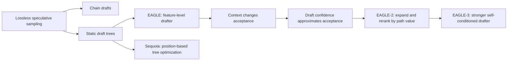
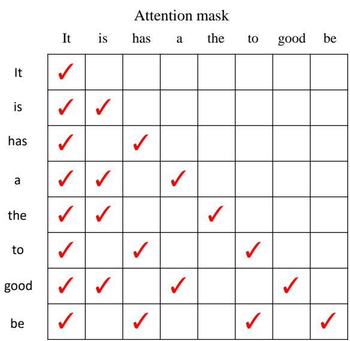
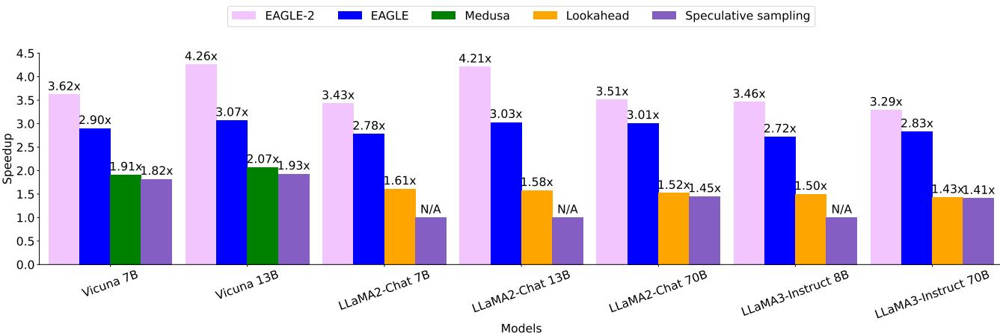

# EAGLE-2: Context-Aware Dynamic Draft Trees

**Paper:** EAGLE-2: Faster Inference of Language Models with Dynamic Draft Trees  
**Authors:** Yuhui Li, Fangyun Wei, Chao Zhang, Hongyang Zhang  
**arXiv:** [2406.16858v2](https://arxiv.org/abs/2406.16858v2) - 2 Jul 2024

**Related pages:** [EAGLE: Feature-Level Speculative Sampling](../eagle/index.md) · [EAGLE-3: Training-Time Test](../eagle-3/index.md) · [DFlash: Block Diffusion](../dflash/index.md)

> **Evidence:** This page uses the complete 12-page precise MinerU extraction at `derived/pdf-markdown/frameworks/eagle-2-dynamic-draft-trees/eagle-2-dynamic-draft-trees.md`. One extracted heading is split by page layout, but the algorithm, tables, and figures are complete enough for high-confidence synthesis.

## TL;DR

**What:** EAGLE-2 is a lossless [speculative decoding](../../terms/speculative-decoding.md) policy that replaces EAGLE's fixed candidate tree with a context-specific tree.  
**How:** It approximates each node's probability of surviving verification by multiplying draft confidences along its root-to-node path, expands the best current leaves, then reranks all generated nodes before target verification.  
**The number:** The paper reports 3.05x-4.26x MT-bench speedup in its headline non-greedy comparison, 20%-40% over EAGLE, and about 4-5.5 committed tokens per draft/verify cycle across the full evaluation.

## The Big Picture

*Source: [EAGLE-2, Figure 7](https://arxiv.org/abs/2406.16858v2). ① Edge labels are draft-model confidences. ② Each node value multiplies confidence along its full prefix. ③ Expansion sends the best current leaves back through the drafter. ④ Reranking selects the globally best connected set, including useful shallow nodes that expansion skipped.*

The figure answers how a fixed token budget becomes context-aware: **EAGLE-2 allocates nodes to the branches most likely to survive all earlier verification decisions**. Expansion finds depth; reranking recovers breadth.

## Why This Exists

Consider two prompts: `10 + 2` and `10 + 2 =`. After the first, several next tokens may be plausible, so branching is valuable. After the second, `1` is highly likely and a deep chain toward `12` is more useful than spending nodes on unlikely siblings. EAGLE uses the same fixed tree for both prompts.

The waste is structural. A fixed tree assumes acceptance depends mostly on position, yet the paper observes large variation at the same position across queries. **A useful draft budget must follow the current context's probability mass, not a template chosen before seeing the context.**

## The Landscape

*Editable source: [eagle-2-landscape.mmd](./assets/eagle-2-landscape.mmd).* EAGLE-2 does not replace the EAGLE drafter or the strict verifier. It adds a policy layer between them: observed calibration turns draft probabilities into a cheap signal for context-dependent tree construction.

## The Core Idea

Speculative verification accepts prefixes, so a node is valuable only if every ancestor also survives. EAGLE-2 approximates that joint survival probability with the product of draft confidences along the path, spends draft calls on the best leaves, and then selects the best connected subset of all generated nodes. **The tree's shape becomes an inference-time decision derived from the prompt.**

## Symbol Map

The paper uses $p_j$ for the true acceptance probability of node $j$, $c_j$ for its draft confidence, and $V_i$ for the approximate probability that the entire prefix ending at node $i$ survives. The integers $k$ and $m$ control expansion width and final verification size.

| Symbol | Human name | Scope | Plain meaning |
|---|---|---|---|
| $p_j$ | conditional acceptance rate | One tree node | Probability the target accepts node $j$ after its ancestors survive. |
| $c_j$ | draft confidence | One tree node | Draft probability used as a low-cost approximation to $p_j$. |
| $V_i$ | path value | Root-to-node path | Product of confidences along the prefix ending at node $i$. |
| $k$ | expansion width | One draft round | Number of current leaves expanded in parallel. |
| $m$ | verification budget | One cycle | Number of draft nodes retained after global reranking. |
| $\tau$ | average acceptance length | One cycle | Average number of tokens committed per target verification. |

## Deep Dive

### Calibration Makes Acceptance Estimation Cheap

**What it does:** EAGLE-2 uses the EAGLE drafter's token probability as an estimate of target acceptance.

**Why it matters:** Measuring acceptance directly would require the target-model pass that speculative drafting is trying to avoid.

**How it works:** The paper bins draft confidence and measures actual acceptance on Alpaca with Vicuna 7B. Tokens below 0.05 confidence are accepted about 0.04 of the time, while tokens above 0.95 confidence are accepted about 0.98 of the time. The relationship is sufficiently close to use $c_j\approx p_j$ for ranking, without training another policy model.

**The intuition:** The drafter already emits a rough honesty score; EAGLE-2 uses it before paying the target model.

**A concrete example:** For `10 + 2 =`, high confidence on `1` directs the next expansion below `1` instead of reserving equal space for an unlikely sibling such as `3`.

**Remember:** EAGLE-2 adds no new learned model; it reuses confidence already produced by EAGLE.

### Path Value Ranks Prefixes, Not Isolated Tokens

**What it does:** A node's score multiplies the confidences of every token from the root to that node.

**Why it matters:** A high-confidence deep token is worthless when an earlier low-confidence ancestor is rejected.

**How it works:** EAGLE-2 estimates

$$
V_i = \prod_{t_j\in\operatorname{Path}(root,t_i)} p_j
\approx \prod_{t_j\in\operatorname{Path}(root,t_i)} c_j.
$$

At each draft round, it chooses the top-$k$ leaves by $V_i$ and expands them together with tree attention.

**The intuition:** Score the probability of reaching a node, not merely the probability printed on its final edge.

**A concrete example:** A token with confidence 0.7 below a 0.6 ancestor has value 0.42; it outranks a 0.9 token below a 0.2 ancestor, whose path value is only 0.18.

**Remember:** Multiplication encodes the verifier's all-ancestors-must-survive contract.

### Global Reranking Separates Exploration from Verification

**What it does:** After expansion, EAGLE-2 reranks every generated node and keeps the top $m$ values, not just the branches expanded most recently.

**Why it matters:** Expansion must follow leaves to discover deeper tokens, but some unexpanded shallow siblings can still have more value than the discovered descendants.

**How it works:** Because child value never exceeds parent value, sorting by $V_i$ and preferring shallower nodes on ties preserves a connected tree. The selected tree is flattened for the target pass.

**The intuition:** Draft broadly enough to discover good paths, then pay verification only for the best connected evidence found anywhere.

**A concrete example:** The `is → a → good` path is expanded, yet an unexpanded shallow `has` node can remain in the final top eight if its value exceeds a deep weak descendant.

**Remember:** Expansion chooses what to explore; reranking chooses what the target model should verify.

### The Mask Preserves Tree Semantics in One Target Pass

*Source: [EAGLE-2, Figure 7](https://arxiv.org/abs/2406.16858v2). Each flattened token attends to the root and its own ancestors, never to tokens on sibling branches.*

**What it does:** [Tree attention](../../terms/tree-attention.md) lets one transformer pass score a flattened tree without leaking information across branches.

**Why it matters:** Ordinary causal attention would let a candidate such as `to` see unrelated sibling tokens and would no longer represent any valid autoregressive path.

**How it works:** EAGLE-2 constructs an ancestry mask after reranking. Each row exposes the root, the node itself, and only its ancestors. Strict speculative sampling then selects and corrects a branch exactly as required by the target distribution.

**The intuition:** Flatten the storage, not the family relationships.

**A concrete example:** `be` may attend to `It`, `has`, and `to`, but not to `is`, `a`, or `good` on the other branch.

**Remember:** Dynamic tree shape changes candidate allocation, not the lossless verification rule.

## Putting It Together

| Step | Actor | Input state | Action | Output state |
|---:|---|---|---|---|
| 1 | EAGLE drafter | Verified prompt `10 + 2 =` | Produces candidates and confidence scores. | Root children with local confidences. |
| 2 | EAGLE-2 expander | Current leaves and their ancestor paths | Computes each $V_i$ and expands the top $k$ leaves. | A deeper provisional tree. |
| 3 | EAGLE-2 reranker | Every generated node | Sorts by path value and retains top $m$, preferring shallow nodes on ties. | A connected context-specific tree. |
| 4 | Mask builder | Selected tree | Flattens nodes and records ancestry visibility. | Token sequence plus tree attention mask. |
| 5 | Target and verifier | Flattened draft tree | Scores candidates once, accepts a valid prefix, and corrects the first rejection. | Lossless committed tokens and the next verified state. |

## What This Buys You

### The headline claim

**Dynamic allocation raises both accepted tokens and wall-time speed without changing EAGLE's weights or the target distribution.**

*Source: [EAGLE-2, Figure 2](https://arxiv.org/abs/2406.16858v2). Reported wall-time speedup at temperature 0 under the paper's device-matched comparison.*

### How we know: selected reported results

| Question | Condition | EAGLE | EAGLE-2 |
|---|---|---:|---:|
| Does dynamic shape help on MT-bench? | Vicuna 13B, temperature 0 | 3.07x, $\tau=3.98$ | 4.26x, $\tau=4.83$ |
| Does it help on code? | LLaMA2-Chat 13B, HumanEval, temperature 0 | 3.76x, $\tau=4.52$ | 5.00x, $\tau=5.52$ |
| Does it help at 70B? | LLaMA2-Chat 70B, MT-bench, temperature 0 | 3.01x, $\tau=3.81$ | 3.51x, $\tau=4.48$ |
| Are both policy stages useful? | Vicuna 7B, MT-bench ablation | 2.81x without both | 3.62x with value and reranking |

### The mechanism behind the numbers

Easy contexts receive depth because their high-confidence path remains valuable after multiplication; ambiguous contexts receive breadth because several branches retain comparable value. Reranking prevents the expansion heuristic from forcing weak deep tokens into the target batch. The gain is largest where draft confidence is calibrated and the workload resembles the drafter's supervised fine-tuning data.

### ⚠️ How to read these numbers

The 20%-40% improvement is relative to EAGLE under the paper's matched implementation, not a universal reduction in end-to-end serving cost. Wall-time speedup changes with hardware, batch size, kernels, draft budget, temperature, and prompt distribution.

## Where It Breaks

| Failure mode | When it happens | Impact |
|---|---|---|
| Confidence miscalibration | Draft probabilities no longer track target acceptance in a shifted domain or model. | Expansion spends nodes on the wrong branches. |
| Prefix-product underflow or over-penalization | Trees become very deep or probabilities are accumulated naïvely. | Deep paths can be numerically or structurally suppressed; implementations should rank in log space. |
| Fixed $k$ and $m$ mismatch runtime capacity | Draft/verification budgets are poorly tuned for the active batch or device. | Better candidate quality may not become higher throughput. |
| Training-domain gap | Knowledge QA or summarization differs from SFT-heavy draft training. | The paper observes lower acceptance length on Natural Questions and CNN/Daily Mail. |
| Tree-management overhead | Sorting, flattening, and mask construction are not efficient. | Dynamic selection can erase part of the target-pass savings. |

> **Inference:** The paper validates confidence calibration empirically on its models and tasks; it does not establish a calibration guarantee under arbitrary distribution shift.

## One Thing to Remember

EAGLE-2's memorable rule is **rank a draft token by the survival probability of its whole path**: local confidence guides the search, path multiplication respects prefix verification, and global reranking turns the explored candidates into the best connected tree for this specific context.

## Go Deeper

- **Read:** [EAGLE-2 on arXiv](https://arxiv.org/abs/2406.16858v2) or the local [source PDF](../../../raw/frameworks/eagle-2-dynamic-draft-trees--arxiv-2406.16858v2.pdf).
- **Build on:** [EAGLE-3](../eagle-3/index.md) retains dynamic trees while strengthening the drafter through direct token prediction and training-time self-conditioning.
- **Understand the context:** [EAGLE](../eagle/index.md) explains the feature-level drafter whose confidence EAGLE-2 reuses.
- **Reproduce:** [SafeAILab/EAGLE](https://github.com/SafeAILab/EAGLE), the implementation linked by the paper.
