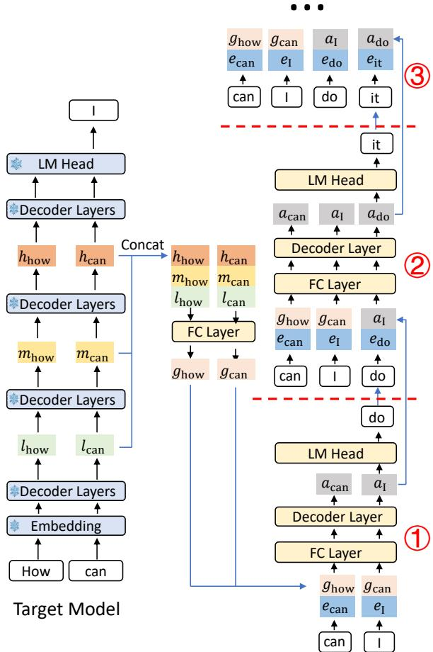
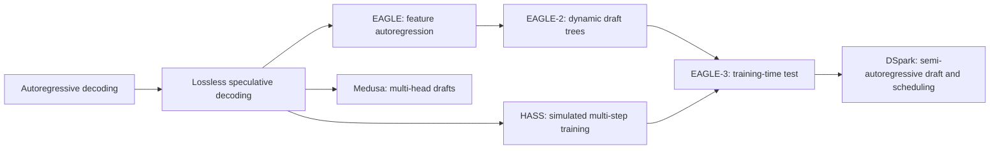
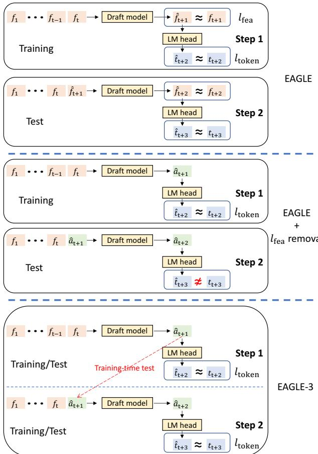
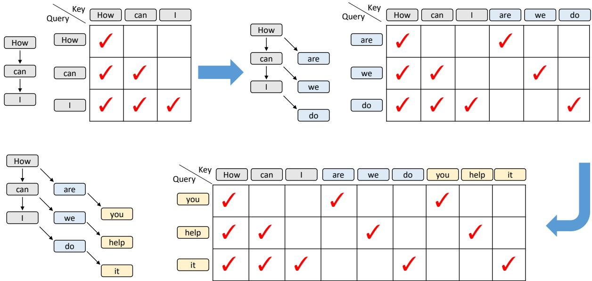
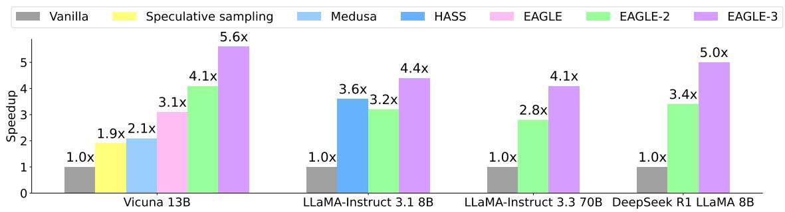
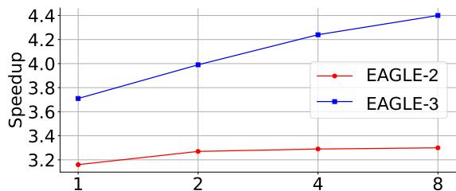
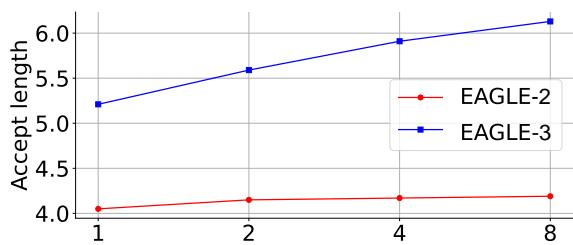
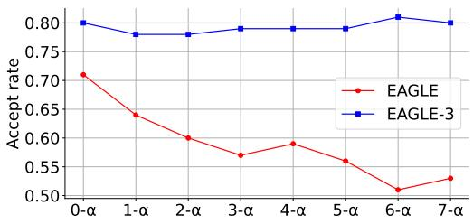

# EAGLE-3: Training-Time Test for Speculative Decoding

**Paper:** EAGLE-3: Scaling up Inference Acceleration of Large Language Models via Training-Time Test  
**Authors:** Yuhui Li, Fangyun Wei, Chao Zhang, Hongyang Zhang  
**arXiv:** [2503.01840v3](https://arxiv.org/abs/2503.01840v3) - 23 Apr 2025

**Related pages:** [EAGLE: Feature-Level Speculative Sampling](../eagle/index.md) · [EAGLE-2: Context-Aware Dynamic Draft Trees](../eagle-2/index.md) · [DSpark: Confidence-Scheduled Speculative Decoding](../dspark/index.md) · [SGLang: Structured Language Model Programs](../sglang/index.md) · [vLLM Architecture and Code Organization Overview](../vllm/vllm-overview.md)

> **Evidence:** This page uses the complete 12-page precise MinerU extraction at `derived/pdf-markdown/frameworks/eagle-3-scaling-inference-acceleration/eagle-3-scaling-inference-acceleration.md`. A few PDF layout artifacts in equations and token examples were normalized against the local source figures and the v3 paper rendering; reported results retain the paper's conditions.

## TL;DR

**What:** EAGLE-3 is a lossless [speculative decoding](../../terms/speculative-decoding.md) drafter that targets tokens directly instead of forcing its hidden states to imitate the target model's top-layer features.  
**How:** It fuses low-, middle-, and high-level target features, then uses a training-time test to feed its own unverified outputs back into later draft steps during training.  
**The number:** It reports 3.0x-6.5x speedup over vanilla autoregressive decoding, roughly 1.4x over EAGLE-2 at batch size 1, and 1.38x SGLang throughput at batch size 64.

## The Big Picture

*Source: [EAGLE-3, Figure 5](https://arxiv.org/abs/2503.01840v3). 1. The target model exposes low-, middle-, and high-level features. 2. A fully connected layer fuses them into a shared feature. 3. The draft model combines verified fused features or its own predicted states with sampled-token embeddings, then repeats the draft step.*

The figure's central lesson is **EAGLE-3 separates what the target model knows from what the drafter must predict**. Verified target positions contribute rich fused features; unverified positions are represented by the drafter's own state, so later draft steps see the same kind of imperfect input they will see at inference time.

## Why This Exists

Imagine the target model has just seen the prefix `How can` and sampled `I`. The target can provide real features for `How` and `can`, but the next draft token, say `do`, has not been verified yet. EAGLE's feature-level drafter predicts a feature for that unverified position and feeds it into the next step. That predicted feature can be far from the target feature that would have been produced by the real token, so the second draft step sees an input outside its training distribution and its acceptance probability falls.

This is the failure mode to keep in mind: **a drafter trained on clean target features is asked at runtime to consume its own noisy features**. EAGLE-3 removes the unnecessary feature-regression constraint, trains on its own intermediate predictions, and uses multiple target layers so the draft state is not tied to the information content of only the next-token top layer.

## The Landscape

*Editable source: [eagle-3-landscape.mmd](./assets/eagle-3-landscape.mmd).* This synthesis positions EAGLE-3 as the point where the EAGLE feature-drafting line adopts HASS-like runtime simulation while retaining EAGLE-2's context-aware draft-tree path. DSpark later builds on EAGLE-3 as a drafter and adds system-aware verification scheduling.

## The Core Idea

EAGLE-3 treats the draft model's own prediction as a normal input condition rather than an exceptional failure. It therefore trains the model to predict the next token directly under both target-produced and self-produced states, while using a compact fusion of target features from several depths to initialize the draft. **The result is a drafter whose training distribution resembles its inference distribution without constraining its hidden state to reproduce the target model's feature space.**

## Symbol Map

The paper uses $f$ for EAGLE-style target features, $l$, $m$, and $h$ for low-, middle-, and high-level target features, $g$ for their fused representation, and $a$ for an unconstrained EAGLE-3 draft state. A hat marks a predicted quantity, while $e$ denotes a token embedding.

| Symbol | Human name | Scope | Plain meaning |
|---|---|---|---|
| $f_t$ | target feature | Verified target position | The feature used by earlier EAGLE-style feature prediction. |
| $l_t$, $m_t$, $h_t$ | multi-layer features | One target position | Low-, middle-, and high-level features collected from the target forward pass. |
| $g_t$ | fused target feature | One position | The $k$-dimensional result of concatenating $l_t$, $m_t$, and $h_t$ and reducing them with an FC layer. |
| $a_t$ | draft state | Unverified draft position | An unconstrained vector produced by the EAGLE-3 draft model and reused at the next draft step. |
| $e_t$ | token embedding | One sampled token | The embedding of a token sampled by the draft model or target model. |
| $\hat{t}_i$ | draft token | One draft position | A token proposed by the drafter and later checked by the target. |
| $\tau$ | average acceptance length | Per draft/verify cycle | The average number of draft tokens accepted in one cycle. |
| $n$-$\alpha$ | depth-conditioned acceptance rate | A draft depth | Acceptance for a token whose input contains $n$ earlier self-predicted values, assuming earlier tokens survived. |

## Deep Dive

### Lossless Verification Makes Prefix Survival the Contract

**What it does:** Speculative decoding drafts several tokens cheaply, asks the target model to score them in parallel, and accepts the longest valid prefix.

**Why it matters:** A rejected token invalidates every later draft token in the same chain, so the drafter must preserve the target distribution at the prefix boundary rather than merely produce locally plausible tokens.

**How it works:** Let $p_i$ be the target distribution and $\hat{p}_i$ the draft distribution at a draft position. The proposed token $\hat{t}_i$ is accepted with probability

$$
P(\mathrm{accept}\ \hat{t}_i) = \min\left(1, \frac{p_i(\hat{t}_i)}{\hat{p}_i(\hat{t}_i)}\right).
$$

If the token is rejected, the sampler draws a replacement from the normalized positive difference between the target and draft distributions, then discards the remaining suffix. This is why the target model still defines the exact output distribution even though the drafter proposed several tokens.

**The intuition:** Speculative decoding is a chain: an early weak link throws away more future work than a late weak link.

**A concrete example:** In the `How can I do it` scenario, a rejected `do` means the later `it` proposal cannot be kept, even if `it` would have matched the target on its own.

**Remember:** EAGLE-3 changes the drafter, not the target-model distribution or the strict verification contract.

### Training-Time Test Removes the Wrong Constraint

*Source: [EAGLE-3, Figure 3](https://arxiv.org/abs/2503.01840v3). 1. EAGLE predicts a target-like feature and pays both feature and token losses. 2. Removing feature regression improves the first draft step but leaves later steps off-distribution. 3. Training-time test feeds the first draft prediction into the next training step, matching deployment.*

**What it does:** EAGLE-3 removes the feature-prediction loss $l_{\mathrm{fea}}$ and trains the draft model around direct token prediction while simulating successive draft steps.

**Why it matters:** The original feature constraint limits the drafter to a representation it does not need to reproduce. Removing it alone helps the first predicted token, but the next step still receives the drafter's own imperfect output and can fail.

**How it works:** A native training step starts from target-produced context. The draft model predicts a token, converts that result into the next draft input, and performs another simulated step. The later loss therefore sees the same mixture of target-derived and self-derived states that appears at inference. The paper keeps the token-prediction loss $l_{\mathrm{token}}$ as the objective aligned with the actual draft output.

**The intuition:** Practice the handoff from a clean target state to a self-generated state before deployment makes that handoff routine.

**A concrete example:** After `How can` produces draft `do`, the next training step consumes the state produced from `do` instead of pretending that the target's exact hidden state for `do` is available.

**Remember:** Training-time test is a distribution-matching device for the drafter's own mistakes.

### Multi-Layer Fusion Gives the Drafter More Than Next-Token Information

**What it does:** It concatenates low-, middle-, and high-level target features and compresses them into the fused feature $g$ used to initialize draft positions.

**Why it matters:** The top-layer feature is tightly aligned with the next-token logits, but that alignment makes it a narrow signal for predicting further tokens. Intermediate layers retain different levels of syntactic and semantic context.

**How it works:** For a target hidden size $k$, EAGLE-3 concatenates three $k$-dimensional vectors into a $3k$ vector and applies an FC layer to return to $k$ dimensions. For a verified position, the draft input is the fused $g$ plus the embedding of the sampled token. For an unverified position, the draft reuses its own state $a$ in place of a target-produced $g$, then combines it with the next sampled-token embedding and runs one decoder layer before the LM head.

**The intuition:** The target's shallow, middle, and deep layers are different views of the same prefix; fusion gives the drafter a wider starting map.

**A concrete example:** `g_how` and `g_can` come from real target computation, while the state for unverified `I` is represented by the drafter's $a_I$ when it predicts `do` and then `it`.

**Remember:** EAGLE-3's draft state is allowed to be useful without being a reconstruction of $f$.

### Causal Masks Make Simulated Draft Steps Efficient

*Source: [EAGLE-3, Figure 6](https://arxiv.org/abs/2503.01840v3). 1. Native training uses the ordinary lower-triangular context. 2. The first simulated draft step adds a branch from each training token. 3. The next simulated step attends to the corresponding branch states instead of constructing a dense all-pairs relationship.*

**What it does:** It changes the draft decoder's self-attention mask so one training forward pass can represent the original sequence followed by self-conditioned draft steps.

**Why it matters:** Naively materializing every query-key pair for simulated branches wastes compute and can expose relationships that do not exist during inference.

**How it works:** The original training sequence uses a standard lower-triangular mask. Simulated positions form a tree-like dependency: most new queries only need their corresponding parent branch and the original training context. The paper therefore describes diagonal or position-specific attention for simulated parts, using vector dot products for matching positions instead of a dense matrix multiply.

**The intuition:** The mask is a compact record of which draft branch owns which predicted state.

**A concrete example:** The state generated from `are` should influence its own next branch, not every other branch generated from `How`, `can`, or `I`.

**Remember:** The training mask is what lets EAGLE-3 rehearse inference branching without paying for irrelevant dense attention.

### Dynamic Draft Trees Spend Verification Where It Can Pay Off

**What it does:** EAGLE-3 remains compatible with EAGLE-2's context-aware dynamic draft tree instead of requiring one fixed tree for every prompt.

**Why it matters:** Easy code completions and difficult open-ended reasoning do not have the same draft confidence. A static tree can allocate nodes to branches that are unlikely to survive.

**How it works:** EAGLE-2 estimates acceptance from draft confidence, expands candidate nodes, and prunes the tree after drafting. EAGLE-3 uses the same dynamic-tree idea but its stronger acceptance lets the implementation increase tree depth from 6 to 8 while keeping the number of nodes the same in the reported setup.

**The intuition:** The tree is a verification budget, so its shape should follow the context rather than a universal template.

**A concrete example:** A predictable code suffix can justify a deeper tree, while an ambiguous reasoning step should avoid spending all nodes on low-confidence continuations.

**Remember:** EAGLE-3 improves the quality of the proposals; EAGLE-2's dynamic tree decides how many proposals are worth verifying.

## Putting It Together

Follow the paper's `How can` example through one draft/verify cycle. The target has just sampled `I`, and the drafter is trying to extend the sequence.

| Step | Actor | Input state | Action | Output state |
|---:|---|---|---|---|
| 1 | Target model | `How can` | Run the forward pass, sample `I`, and retain low-, middle-, and high-level features. | Verified fused states `g_how`, `g_can`; token `I`. |
| 2 | EAGLE-3 draft step 1 | `g_how`, `g_can`, and `e_I` | Compress the inputs, run one decoder layer, and apply the LM head. | Draft state `a_I`; proposed token `do`. |
| 3 | EAGLE-3 draft step 2 | `g_how`, `g_can`, `a_I`, and `e_do` | Replace unavailable target state `g_I` with `a_I`, then repeat the draft computation. | Draft state `a_do`; proposed token `it`. |
| 4 | Target verification | Target prefix plus draft `do`, `it` | Score the proposals in parallel and apply sequential lossless acceptance. | Accepted prefix, or a target replacement token with the unused suffix discarded. |

The important ownership boundary is between steps 1 and 3: only the target can produce verified fused features, while the drafter must carry its own state for positions that have not yet been checked.

## What This Buys You

*Source: [EAGLE-3, Figure 2](https://arxiv.org/abs/2503.01840v3). EAGLE-3 is the highest bar among the methods shown for Vicuna 13B, LLaMA-Instruct 3.1 8B, LLaMA-Instruct 3.3 70B, and DeepSeek-R1-Distill-LLaMA 8B at temperature 0.*

*Source: [EAGLE-3, Figure 1](https://arxiv.org/abs/2503.01840v3). The reported speedup curve rises as the draft training data scale grows from 1x to 8x relative to ShareGPT.*

*Source: [EAGLE-3, Figure 1](https://arxiv.org/abs/2503.01840v3). Average accepted length rises with the same data scaling, unlike the flat EAGLE-2 comparison shown in the source figure.*

*Source: [EAGLE-3, Figure 7](https://arxiv.org/abs/2503.01840v3). EAGLE-3 stays near 0.8 acceptance across the shown depth-conditioned inputs, while EAGLE declines from about 0.71 to about 0.51.*

### The headline claim

EAGLE-3's architectural changes turn more draft computation into accepted target tokens: across the paper's five tasks and four target-model settings it reports about 3.0x-6.5x speedup over vanilla autoregressive decoding, with roughly 20%-40% improvement over EAGLE-2.

### How we know: ablation and serving

| Evidence slice | Reported result | What it isolates |
|---|---:|---|
| LLaMA-Instruct 3.1 8B, MT-bench, EAGLE-2 | 3.16x speedup, $\tau=4.05$ | Baseline draft and tree configuration. |
| Add direct token prediction | 3.82x speedup, $\tau=5.37$ | Removing the feature-regression constraint. |
| Add multi-layer fusion | 4.40x speedup, $\tau=6.13$ | The incremental value of fused target features. |
| SGLang, H100, batch size 64 | 1.38x throughput versus 1.00x baseline | EAGLE-3 can still help at a large batch when the framework integrates the path efficiently. |
| SGLang, H100, batch size 1 | 373.25 tokens/s versus 158.34 baseline | The low-batch serving result behind the latency claim. |

### The mechanism behind the numbers

The ablation is the cleanest causal evidence. Removing feature regression raises the first draft's freedom and improves acceptance, but fused low-, middle-, and high-level features provide the additional information needed for later positions. Training-time test keeps the acceptance curve nearly flat as more input positions are self-predicted, so deeper drafts remain useful instead of becoming a chain of increasingly off-distribution guesses.

The serving results matter because speculative methods can lose their advantage as batch size grows and the target model has less redundant compute. In the reported SGLang experiment, EAGLE falls below the no-speculation baseline at batch size 24, while EAGLE-3 remains at 1.39x there and 1.38x at batch size 64. The gain is therefore a joint property of drafter quality and runtime integration, not just a standalone draft-model score.

### How to read these numbers

> **Warning:** Speedup ratios are relative to vanilla decoding under each experiment's model, hardware, batch size, chain/tree, and dataset settings. Average acceptance length is not a quality score, and the paper does not run a separate quality benchmark because strict target verification preserves the target distribution.

## Where It Breaks

| Failure mode | When it happens | Impact |
|---|---|---|
| Context-dependent draft difficulty | The prompt has ambiguous or rapidly changing continuations rather than predictable code or templated text. | Acceptance length falls, so the extra draft work may not amortize target-model execution. |
| Batch redundancy disappears | The target model is already close to saturated at a high batch size or the runtime lacks an efficient speculative path. | Speculative decoding can reduce throughput; EAGLE does so in the reported SGLang curve around batch size 24. |
| Target model changes | The target architecture, tokenizer, sampling regime, or layer checkpoints differ from the draft's training setup. | The fused-feature interface and learned draft distribution may need a new target-specific draft model. |
| Strict verification is replaced | A deployment uses relaxed acceptance rules or compares against a different target distribution. | The paper's lossless-distribution guarantee no longer follows from its verification procedure. |
| Hardware evidence is not portable | The vLLM section describes an RTX3090 setup in prose while its table caption says A100, and the large-batch tests disable tree drafting. | The reported batch frontier should not be treated as a hardware-independent guarantee. |
| Model scale exceeds the evaluation budget | The paper could not evaluate the 405B and 671B target models. | Performance and draft-training cost at those scales remain open. |

## One Thing to Remember

EAGLE-3's memorable move is **teaching the drafter to live with its own mistakes**: remove the feature imitation objective, fuse several target layers for a strong starting state, and rehearse self-conditioned draft steps during training so the inference distribution is no longer a surprise.

## Go Deeper

- **Read:** [EAGLE-3 on arXiv](https://arxiv.org/abs/2503.01840v3) or the local [source PDF](../../../raw/frameworks/eagle-3-scaling-inference-acceleration--arxiv-2503.01840v3.pdf).
- **Build on:** [DSpark: Confidence-Scheduled Speculative Decoding](../dspark/index.md), which treats EAGLE-3 as a drafter and adds confidence-calibrated verification scheduling.
- **Understand the runtime context:** [SGLang: Structured Language Model Programs](../sglang/index.md) and [vLLM Architecture and Code Organization Overview](../vllm/vllm-overview.md).
- **Reuse the synthesis:** [eagle-3-landscape.mmd](./assets/eagle-3-landscape.mmd) is the editable evolutionary map used by this page.
- **Reproduce:** [SafeAILab/EAGLE](https://github.com/SafeAILab/EAGLE) is the paper's announced implementation; no pinned local code checkout is registered here.
