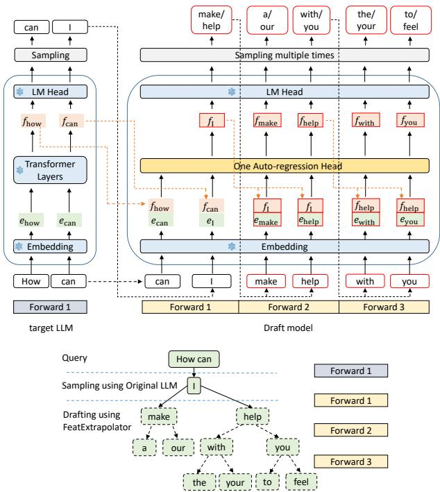
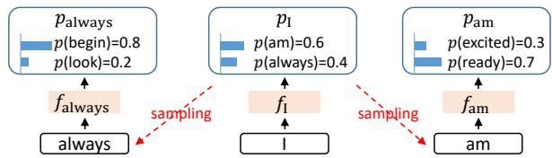
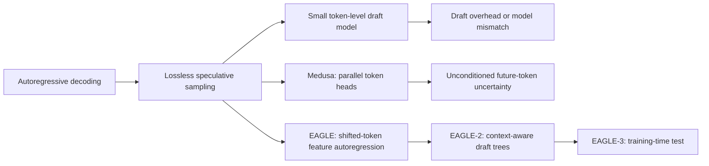
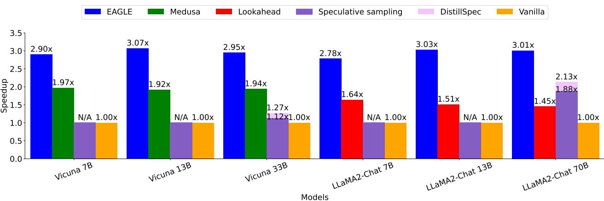

# EAGLE: Feature-Level Speculative Sampling

**Paper:** EAGLE: Speculative Sampling Requires Rethinking Feature Uncertainty  
**Authors:** Yuhui Li, Fangyun Wei, Chao Zhang, Hongyang Zhang  
**arXiv:** [2401.15077v3](https://arxiv.org/abs/2401.15077v3) - 5 Mar 2025

**Related pages:** [EAGLE-2: Context-Aware Dynamic Draft Trees](../eagle-2/index.md) · [EAGLE-3: Training-Time Test](../eagle-3/index.md) · [DSpark: Confidence-Scheduled Speculative Decoding](../dspark/index.md)

> **Evidence:** This page uses the complete precise MinerU extraction at `derived/pdf-markdown/frameworks/eagle-speculative-sampling-feature-uncertainty/eagle-speculative-sampling-feature-uncertainty.md`. The extraction contains a few layout artifacts in equations and headings; the mechanism and reported values below were checked against the paper's local figures and surrounding text.

## TL;DR

**What:** EAGLE is a lossless [speculative decoding](../../terms/speculative-decoding.md) method whose small draft module predicts the target model's second-to-top-layer features instead of directly predicting a token sequence.  
**How:** It feeds each sampled token one position ahead alongside the preceding target feature, removing the ambiguity that otherwise makes the next continuous feature impossible to determine.  
**The number:** The paper reports 2.7x-3.5x latency speedup for LLaMA2-Chat 70B, about 2x maximum throughput, and 3.2-4.5 accepted tokens per target-model pass across its main dense-model tests.

## The Big Picture

*Source: [EAGLE, Figure 6](https://arxiv.org/abs/2401.15077v3). ① The target model produces verified tokens and second-to-top-layer features. ② EAGLE combines each feature with the next sampled token embedding. ③ One lightweight autoregression head predicts the next feature and reuses the frozen target LM head to sample candidates. ④ Repeated draft passes form a tree for parallel target verification.*

The figure answers how EAGLE gets a cheap but target-aligned drafter: **it reuses the target model's embedding and LM head, and trains only the feature autoregression head**. A three-pass draft can produce a tree containing more candidates than a three-token chain.

## Why This Exists

Suppose the verified prefix is `How can` and the target samples `I`. The feature for `I` alone does not determine what comes next: sampling may choose `am`, `always`, or another token, and each outcome leads to a different next hidden feature. A feature-only drafter asked to predict one continuation must average incompatible futures.

*Source: [EAGLE, Figure 3](https://arxiv.org/abs/2401.15077v3). The same feature for `I` can branch into `am` or `always`; the sampled token identifies which next feature should be predicted.*

EAGLE resolves the ambiguity by supplying the actual sampled token one step ahead. In the example, it predicts the feature for `always` from the feature for `I` plus the token embedding for `always`. **The discrete sampling outcome becomes the missing branch label for continuous feature prediction.**

## The Landscape

*Editable source: [eagle-landscape.mmd](./assets/eagle-landscape.mmd).* EAGLE changes the object being drafted from tokens to target-aligned features, while the shifted token removes sampling ambiguity. EAGLE-2 later keeps the drafter and improves candidate allocation; EAGLE-3 changes the training objective and self-conditioning behavior.

## The Core Idea

A language model's feature sequence is smoother than its token sequence, but sampling makes the next feature branch-dependent. EAGLE makes feature prediction tractable by pairing the previous feature with the token that selected the branch, then uses the frozen target LM head to turn the predicted feature back into a token distribution. **It drafts in a representation that is easier to extrapolate without forgetting which discrete future was sampled.**

## Symbol Map

Lowercase $t$, $e$, $f$, and $p$ denote a token, its embedding, a second-to-top-layer feature, and a token distribution. A hat marks a draft prediction; $\gamma$ is the drafted chain length, while $\tau$ measures how many tokens the target accepts per verification cycle.

| Symbol | Human name | Scope | Plain meaning |
|---|---|---|---|
| $t_i$ | sampled token | Position $i$ | The discrete outcome that resolves which feature branch follows. |
| $e_i$ | token embedding | Position $i$ | Frozen target embedding supplied to the draft model. |
| $f_i$ | target feature | Position $i$ | Verified hidden state immediately before the target LM head. |
| $\hat{f}_i$ | predicted feature | Draft position $i$ | EAGLE's approximation of the target feature. |
| $p_i$, $\hat{p}_i$ | target and draft distributions | One draft position | Distributions used by strict speculative acceptance. |
| $\tau$ | average acceptance length | One draft/verify cycle | Average tokens committed per target-model forward pass. |

## Deep Dive

### Shifted Tokens Turn an Ambiguous Regression into a Conditioned One

**What it does:** EAGLE predicts $f_{i+1}$ from earlier features and a token sequence shifted one position forward.

**Why it matters:** Without the sampled $t_{i+1}$, one input feature can legitimately lead to several incompatible next features.

**How it works:** The target embedding maps $t_{i+1}$ to its token embedding. EAGLE concatenates the preceding feature and that embedding, reduces the $2d$ vector to the target hidden width $d$, and runs one decoder layer to predict the next feature. The frozen target LM head converts that prediction into a draft distribution and samples the next token.

**The intuition:** The feature says what the prefix means; the shifted token says which stochastic branch was actually taken.

**A concrete example:** Given `How can I`, the pair of $f_{I}$ and $e_{always}$ asks for the feature on the `always` branch instead of an average of `always` and `am`.

**Remember:** Advancing the token input by one position is the paper's highest-leverage architectural choice.

### Feature and Token Losses Keep the Draft Useful to Verification

**What it does:** Training combines Smooth L1 feature regression with cross-entropy on the frozen LM head's resulting token distribution.

**Why it matters:** A feature can be numerically close to the target yet still move across a decision boundary that changes the next token.

**How it works:** EAGLE minimizes $L$ with a Smooth L1 regression term plus a classification term weighted by 0.1. The regression term aligns the predicted and target next features; the classification term aligns the token distributions produced by the target LM head. Uniform noise in $[-0.1,0.1]$ is added to training features so the autoregressive head learns to tolerate its own prediction errors.

**The intuition:** Regression teaches the right neighborhood; classification teaches which side of the token boundary matters.

**A concrete example:** If the draft feature after `How can I` drifts slightly, the classification loss still rewards preserving the distribution that proposes `help` rather than an unrelated token.

**Remember:** Feature imitation is an intermediate objective; accepted target tokens are the real objective.

### Tree Drafting Converts Three Draft Steps into More Than Three Candidates

**What it does:** EAGLE uses [tree attention](../../terms/tree-attention.md) to branch high-probability continuations and verify them together.

**Why it matters:** A chain spends every draft step on one future, even when an uncertain token has several plausible alternatives.

**How it works:** Each autoregression-head pass expands selected branches. An ancestry-aware attention mask prevents tokens on sibling branches from seeing one another. The target model then scores the flattened tree in one pass, and strict speculative sampling recursively commits a valid path while retaining accepted target features for the next cycle.

**The intuition:** Spend cheap draft capacity on several plausible roads, then let one expensive target pass choose the legal road.

**A concrete example:** After `How can I`, branches beginning `make` and `help` can coexist; the target accepts only the branch consistent with its own distribution.

**Remember:** The tree increases candidate coverage without increasing the number of target forward passes.

## Putting It Together

| Step | Actor | Input state | Action | Output state |
|---:|---|---|---|---|
| 1 | Target model | Verified prefix `How can` | Produces target features and samples `I`. | Verified $f_{how}$, $f_{can}$ and token `I`. |
| 2 | EAGLE | $f_{can}$ plus embedding for `I` | Predicts the next feature and samples candidate tokens. | First draft branches such as `make` and `help`. |
| 3 | EAGLE | Predicted branch feature plus each sampled token | Repeats feature autoregression under the branch mask. | A multi-depth candidate tree. |
| 4 | Target model | Flattened tree and ancestry mask | Scores all tree nodes in one forward pass. | Target probabilities for every valid branch position. |
| 5 | Verifier | Draft and target probabilities | Accepts a path prefix with strict rejection sampling and corrects the first mismatch. | Lossless committed tokens plus verified features for the next cycle. |

## What This Buys You

### The headline claim

**EAGLE turns one target-model pass into roughly four committed tokens on the main dense-model workloads**, producing materially larger latency gains than the compared draft approaches.

*Source: [EAGLE, Figure 1](https://arxiv.org/abs/2401.15077v3). Reported wall-time speedup at temperature 0; unavailable standard-speculation pairings are marked N/A in the source.*

### How we know: selected reported results

| Question | Condition | Reported result |
|---|---|---:|
| How fast is LLaMA2-Chat 70B on MT-bench? | Temperature 0, batch 1 | 3.01x vs. vanilla |
| How fast is its best reported task result? | LLaMA2-Chat 13B, HumanEval, temperature 0 | 3.76x; $\tau=4.52$ |
| Does the gain survive larger batches? | LLaMA2-Chat 70B, maximum tested throughput | 1.99x throughput |
| Can it compose with kernel/model optimizations? | LLaMA2-Chat 7B, RTX 3090, INT4 gpt-fast | 160.4 tokens/s |

### The mechanism behind the numbers

Feature prediction raises draft acceptance, shifted tokens remove the dominant uncertainty, and tree drafting increases candidate coverage. Code generation benefits most because repeated syntax and templates are easier to draft. The Mixtral result is lower at 1.50x because verifying several tokens can activate more experts, weakening the dense-model assumption that extra token positions reuse already-loaded weights.

### ⚠️ How to read these numbers

Speedup is hardware-, runtime-, batch-, temperature-, and workload-dependent. The paper's strongest latency results mostly use batch size 1; average acceptance length is more portable than wall time but omits draft and tree-processing overhead.

## Where It Breaks

| Failure mode | When it happens | Impact |
|---|---|---|
| Target saturation | Large batches already consume the GPU's parallel capacity. | Verification costs rise and the latency speedup shrinks; EAGLE also uses slightly more memory. |
| Weak draft-domain coverage | Prompts differ sharply from the ShareGPT-style training distribution. | Acceptance length can fall even though verification remains lossless. |
| MoE expert expansion | Parallel verification touches more experts than one-token decoding. | Weight traffic grows; the paper reports only 1.50x on Mixtral 8x7B. |
| Feature error accumulation | Later draft steps repeatedly consume predicted rather than verified features. | Acceptance degrades with depth; noise augmentation mitigates but does not remove the issue. |
| Runtime lacks efficient tree kernels | Packing, masks, or variable branches are implemented inefficiently. | Theoretical token savings may not translate to wall-time speedup. |

## One Thing to Remember

EAGLE's durable insight is **a sampled token is the branch label for the next hidden feature**: feature sequences are easier to extrapolate than tokens, but only after the drafter is told which stochastic token outcome occurred.

## Go Deeper

- **Read:** [EAGLE on arXiv](https://arxiv.org/abs/2401.15077v3) or the local [source PDF](../../../raw/frameworks/eagle-speculative-sampling-feature-uncertainty--arxiv-2401.15077v3.pdf).
- **Build on:** [EAGLE-2](../eagle-2/index.md) replaces the fixed candidate tree with confidence-guided expansion and reranking; [EAGLE-3](../eagle-3/index.md) removes feature regression and rehearses self-produced states during training.
- **Understand the context:** [Speculative Decoding](../../terms/speculative-decoding.md) explains the lossless acceptance contract.
- **Reproduce:** [SafeAILab/EAGLE](https://github.com/SafeAILab/EAGLE), the implementation linked by the paper.
