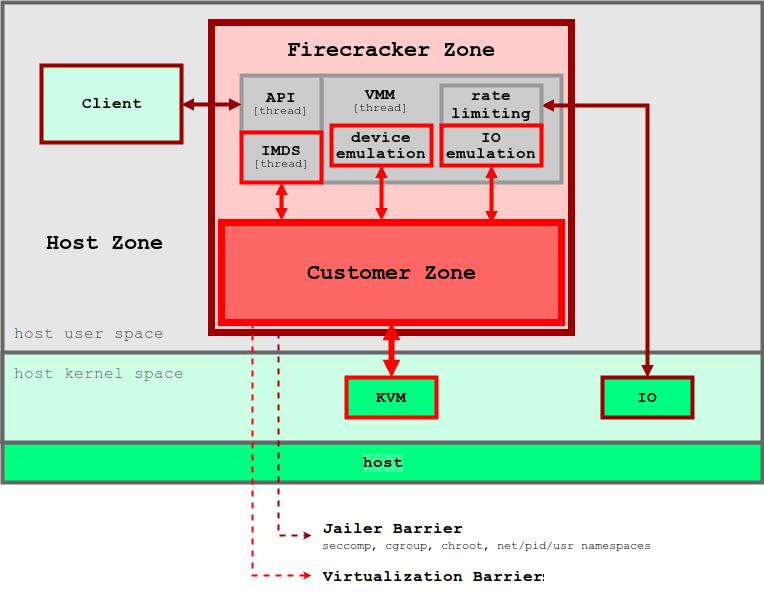
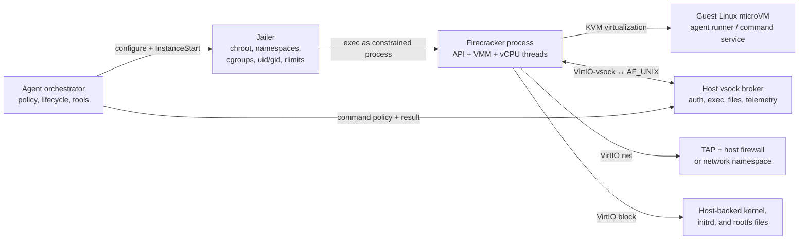

# Firecracker: MicroVM Sandboxes for AI Agents

**Repository:** [firecracker-microvm/firecracker](https://github.com/firecracker-microvm/firecracker)  
**Inspected revision:** `f3f65a3425f62bc9cf5f1c81f2963f230ed89f9a` (`main`, 2026-08-28; clean checkout)

**Related pages:** [Frameworks](../index.md), [Harbor: Agent Evaluation Framework](../harbor/index.md), [Pier: Coding-Agent Evaluation Harness](../../benchmarks/agent-eval/pier/index.md)

## TL;DR

**What:** Firecracker is a small virtual machine monitor (VMM): one Firecracker process encapsulates one Linux microVM, with KVM-backed vCPUs and a minimal VirtIO device model.

**How:** A privileged `jailer` prepares a chroot, namespaces, cgroups, resource limits, and device files; Firecracker then runs as an unprivileged process with per-thread seccomp filters. A host API configures the guest, while VirtIO block, network, and vsock devices carry data across the boundary.

**The important boundary:** Firecracker is an isolation substrate, not a complete AI-agent sandbox. It does not decide whether a shell command is safe, provide an agent loop, authenticate a tool caller, filter network destinations, manage secrets, or verify the agent's work. An outer runner and a guest-side command service must supply those semantics.

## The Mental Model

A container isolates a process inside the host kernel. A Firecracker sandbox puts the agent workload in a separate Linux guest kernel, then constrains the host-side VMM process that emulates the guest's devices. The result is a stack of barriers rather than one magic “sandbox” switch:

1. **Virtualization barrier:** KVM separates guest CPU and memory execution from host user space.
2. **Process barrier:** the Jailer narrows what the Firecracker process can see and do with a chroot, mount/PID/network namespaces, cgroups, file-descriptor cleanup, resource limits, and dropped privileges.
3. **Syscall barrier:** seccomp-BPF restricts the host syscalls available to the API, VMM, and vCPU threads.
4. **I/O barriers:** VirtIO device emulation is the controlled handoff for host files, TAP networking, and host Unix sockets used by vsock.
5. **Agent-policy layer:** an outer service decides which files, commands, tools, credentials, and network destinations the guest may use.

> **Evidence:** Firecracker's design treats vCPU threads as potentially malicious after they start and places the virtualization and Jailer barriers between those threads and the host. The same design document explicitly says that guest egress must be filtered at the host level.
>
> **Inference:** For an AI agent, the useful unit is not “Firecracker alone.” It is `outer policy runner → Jailer → Firecracker → guest command service`, with separate channels for control, commands, files, network, and evidence.

*Original source figure from the [pinned Firecracker design document](https://github.com/firecracker-microvm/firecracker/blob/f3f65a3425f62bc9cf5f1c81f2963f230ed89f9a/docs/design.md#threat-containment), preserved locally for this page.*

The following synthesized flow answers a different question: which layer owns the operational job around the VM?

*Synthesized explanation; editable source: [agent-sandbox-flow.mmd](assets/agent-sandbox-flow.mmd). The arrows show ownership, not a claim that Firecracker itself implements the orchestrator or broker.*

## Firecracker versus a Complete Agent Sandbox

The fastest way to place Firecracker in an AI-agent stack is to ask who owns each guarantee.

| Concern | Firecracker supplies | Agent platform still supplies |
|---|---|---|
| Guest isolation | KVM-backed guest CPU/memory and a minimal device model | A patched, trusted guest kernel and image lifecycle |
| VMM containment | Jailer setup, namespaces/chroot, cgroups, dropped privileges, and resource limits | Correct privileged launch, per-VM identity, cleanup, and host configuration |
| Host syscall exposure | Separate seccomp policies for `api`, `vmm`, and `vcpu` threads | Filter selection/testing and a policy for handling unsupported syscalls |
| Command execution | No generic “run this shell command” API | A guest agent or host/guest broker with authentication, timeouts, cancellation, and output limits |
| Network safety | TAP-backed VirtIO networking and optional rate limiting | Host firewall rules, network namespaces, DNS policy, proxying, and egress allowlists |
| Files and secrets | Explicit host-backed block files, kernel/initrd descriptors, and optional metadata | Image construction, read-only policy, secret brokerage, redaction, and artifact transfer |
| Evaluation semantics | Logs, metrics, VM state, and lifecycle primitives | Tool traces, task verifiers, snapshots, evidence storage, and reward/scoring policy |

This is why Firecracker fits below a framework such as [Harbor](../harbor/index.md): Harbor models agents, environments, verification, artifacts, and retries; Firecracker can be the lower-level environment substrate, but it does not provide those contracts by itself.

## The Security Stack in Code

### 1. The VMM builds one guest, then starts its vCPUs

The Firecracker entry point parses startup arguments, constructs the seccomp filter map, and selects the API or no-API execution path through <a class="code-link" href="../../../external-repos/firecracker/src/firecracker/src/main.rs#L121" data-code-repo="firecracker-f3f65a3425f6" data-code-path="src/firecracker/src/main.rs" data-code-line="121"><code>main_exec()</code></a>. The boot builder's <a class="code-link" href="../../../external-repos/firecracker/src/vmm/src/builder.rs#L143" data-code-repo="firecracker-f3f65a3425f6" data-code-path="src/vmm/src/builder.rs" data-code-line="143"><code>build_microvm_for_boot()</code></a> allocates guest memory, creates KVM state and vCPUs, loads the kernel/initrd, and attaches the configured devices. <a class="code-link" href="../../../external-repos/firecracker/src/vmm/src/builder.rs#L373" data-code-repo="firecracker-f3f65a3425f6" data-code-path="src/vmm/src/builder.rs" data-code-line="373" data-code-end-line="386"><code>build_and_boot_microvm()</code></a> then resumes the initially paused vCPUs.

The important security intuition is that the guest is not a child process that the VMM can safely “trust.” It is a separate operating-system instance whose CPU execution and device requests must repeatedly cross KVM and Firecracker's emulation code.

### 2. The Jailer hardens the host-side process before `exec()`

The Jailer is the privileged setup phase. <a class="code-link" href="../../../external-repos/firecracker/src/jailer/src/env.rs#L646" data-code-repo="firecracker-f3f65a3425f6" data-code-path="src/jailer/src/env.rs" data-code-line="646"><code>Env::run()</code></a> copies the Firecracker executable into the per-VM jail, joins an optional network namespace, installs resource limits and cgroups before chrooting, creates only the required device nodes, and finally `exec()`s the constrained Firecracker binary. The actual <a class="code-link" href="../../../external-repos/firecracker/src/jailer/src/chroot.rs#L19" data-code-repo="firecracker-f3f65a3425f6" data-code-path="src/jailer/src/chroot.rs" data-code-line="19"><code>chroot()</code></a> first unshares a mount namespace, changes mount propagation, uses `pivot_root()`, detaches the old root, and removes its old-root directory.

The resource controls are real host controls, not metadata attached to the VM. <a class="code-link" href="../../../external-repos/firecracker/src/jailer/src/cgroup.rs#L234" data-code-repo="firecracker-f3f65a3425f6" data-code-path="src/jailer/src/cgroup.rs" data-code-line="234" data-code-end-line="240"><code>CgroupConfiguration::setup()</code></a> writes controller values and attaches the process; <a class="code-link" href="../../../external-repos/firecracker/src/jailer/src/resource_limits.rs#L92" data-code-repo="firecracker-f3f65a3425f6" data-code-path="src/jailer/src/resource_limits.rs" data-code-line="92" data-code-end-line="102"><code>ResourceLimits::install()</code></a> applies file-size and file-descriptor limits. The Jailer documentation recommends a statically linked Firecracker binary built for the same release as the Jailer.

### 3. Seccomp is per thread, and it is not network policy

The Firecracker-side filter loader recognizes three thread categories: `api`, `vmm`, and `vcpu`. The VMM applies each thread's BPF program through <a class="code-link" href="../../../external-repos/firecracker/src/vmm/src/seccomp.rs#L93" data-code-repo="firecracker-f3f65a3425f6" data-code-path="src/vmm/src/seccomp.rs" data-code-line="93" data-code-end-line="137"><code>apply_filter()</code></a>, which first sets `PR_SET_NO_NEW_PRIVS` and then installs `SECCOMP_SET_MODE_FILTER`. The vCPU thread's <a class="code-link" href="../../../external-repos/firecracker/src/vmm/src/vstate/vcpu.rs#L180" data-code-repo="firecracker-f3f65a3425f6" data-code-path="src/vmm/src/vstate/vcpu.rs" data-code-line="180" data-code-end-line="210"><code>start_threaded()</code></a> passes the vCPU-specific filter into the thread, and <a class="code-link" href="../../../external-repos/firecracker/src/vmm/src/vstate/vcpu.rs#L217" data-code-repo="firecracker-f3f65a3425f6" data-code-path="src/vmm/src/vstate/vcpu.rs" data-code-line="217" data-code-end-line="236"><code>run()</code></a> installs it before the vCPU state machine runs.

This limits the host attack surface of the VMM. It does not say “the agent may call only `git` and `pytest`,” and it does not prevent a guest from opening an allowed network path. Disabling seccomp with `--no-seccomp` is explicitly documented as a development aid, not a production setting.

### 4. KVM exits become device-emulation work

Once a vCPU is running, <a class="code-link" href="../../../external-repos/firecracker/src/vmm/src/vstate/vcpu.rs#L404" data-code-repo="firecracker-f3f65a3425f6" data-code-path="src/vmm/src/vstate/vcpu.rs" data-code-line="404" data-code-end-line="431"><code>run_emulation()</code></a> calls `KVM_RUN` and hands exits such as MMIO reads and writes to the emulated device buses. This is the fast path in which guest instructions can cause host-side device code to run, so the VMM's narrow device model, seccomp policy, and privilege drop work together.

## A Start Request Round Trip

The following trace follows one concrete control request: a host runner configures a microVM and asks Firecracker to start it. It is the part of the lifecycle Firecracker actually owns.

1. **Parse the boundary request.** `ParsedRequest::try_from()` splits the Unix-socket HTTP path and dispatches `/boot-source`, `/drives`, `/network-interfaces`, `/vsock`, and `/actions` to typed parsers. The `InstanceStart` body becomes `VmmAction::StartMicroVm` in <a class="code-link" href="../../../external-repos/firecracker/src/firecracker/src/api_server/request/actions.rs#L31" data-code-repo="firecracker-f3f65a3425f6" data-code-path="src/firecracker/src/api_server/request/actions.rs" data-code-line="31" data-code-end-line="51"><code>parse_put_actions()</code></a>; the path parser is <a class="code-link" href="../../../external-repos/firecracker/src/firecracker/src/api_server/parsed_request.rs#L67" data-code-repo="firecracker-f3f65a3425f6" data-code-path="src/firecracker/src/api_server/parsed_request.rs" data-code-line="67" data-code-end-line="145"><code>ParsedRequest::try_from()</code></a>.
2. **Move from API thread to VMM thread.** <a class="code-link" href="../../../external-repos/firecracker/src/firecracker/src/api_server/mod.rs#L121" data-code-repo="firecracker-f3f65a3425f6" data-code-path="src/firecracker/src/api_server/mod.rs" data-code-line="121" data-code-end-line="145"><code>ApiServer::handle_request()</code></a> calls <a class="code-link" href="../../../external-repos/firecracker/src/firecracker/src/api_server/mod.rs#L147" data-code-repo="firecracker-f3f65a3425f6" data-code-path="src/firecracker/src/api_server/mod.rs" data-code-line="147" data-code-end-line="185"><code>serve_vmm_action_request()</code></a>, which sends the typed action over a channel, signals an `eventfd`, waits for the VMM response, and converts the result into an HTTP response.
3. **Accumulate preboot state.** <a class="code-link" href="../../../external-repos/firecracker/src/vmm/src/rpc_interface.rs#L365" data-code-repo="firecracker-f3f65a3425f6" data-code-path="src/vmm/src/rpc_interface.rs" data-code-line="365" data-code-end-line="429"><code>PrebootApiController::build_microvm_from_requests()</code></a> receives successive actions and returns a response after each one. Configuration is kept in `VmResources` until the start action; metadata, boot source, rootfs, network, vsock, and machine configuration are inputs to this phase.
4. **Cross the boot transition.** `PrebootApiController::start_microvm()` calls <a class="code-link" href="../../../external-repos/firecracker/src/vmm/src/rpc_interface.rs#L627" data-code-repo="firecracker-f3f65a3425f6" data-code-path="src/vmm/src/rpc_interface.rs" data-code-line="627" data-code-end-line="638"><code>start_microvm()</code></a>, which invokes the builder and records the resulting running `Vmm`. The builder's <a class="code-link" href="../../../external-repos/firecracker/src/vmm/src/builder.rs#L373" data-code-repo="firecracker-f3f65a3425f6" data-code-path="src/vmm/src/builder.rs" data-code-line="373" data-code-end-line="386"><code>build_and_boot_microvm()</code></a> resumes the vCPUs only after the machine and devices are constructed.
5. **Execute guest work.** A vCPU thread installs seccomp, enters its running state, and <a class="code-link" href="../../../external-repos/firecracker/src/vmm/src/vstate/vcpu.rs#L404" data-code-repo="firecracker-f3f65a3425f6" data-code-path="src/vmm/src/vstate/vcpu.rs" data-code-line="404" data-code-end-line="431"><code>run_emulation()</code></a> returns to device emulation on KVM exits. This is where the guest's agent process can cause VirtIO block, network, or vsock traffic, but Firecracker still sees device operations rather than “agent intent.”
6. **Return the result.** The response channel carries `VmmData` or a typed `VmmActionError` back to the API thread. <a class="code-link" href="../../../external-repos/firecracker/src/firecracker/src/api_server/parsed_request.rs#L186" data-code-repo="firecracker-f3f65a3425f6" data-code-path="src/firecracker/src/api_server/parsed_request.rs" data-code-line="186" data-code-end-line="237"><code>ParsedRequest::convert_to_response()</code></a> maps empty success to `204 No Content`, serializes data, or returns a JSON fault.
7. **Release resources.** On shutdown, <a class="code-link" href="../../../external-repos/firecracker/src/firecracker/src/api_server_adapter.rs#L250" data-code-repo="firecracker-f3f65a3425f6" data-code-path="src/firecracker/src/api_server_adapter.rs" data-code-line="250" data-code-end-line="273"><code>run_with_api()</code></a> signals the API kill switch and joins the API thread. Dropping the `Vmm` invokes <a class="code-link" href="../../../external-repos/firecracker/src/vmm/src/lib.rs#L765" data-code-repo="firecracker-f3f65a3425f6" data-code-path="src/vmm/src/lib.rs" data-code-line="765" data-code-end-line="775"><code>Drop for Vmm</code></a>, which shuts down vCPU threads.

## How an Agent Command Crosses the Boundary

Firecracker's vsock device is a useful control/data channel for an agent sandbox, but it is not an `exec` API.

1. The runner configures a guest context identifier (CID) and a host Unix socket through <a class="code-link" href="../../../external-repos/firecracker/src/vmm/src/vmm_config/vsock.rs#L108" data-code-repo="firecracker-f3f65a3425f6" data-code-path="src/vmm/src/vmm_config/vsock.rs" data-code-line="108" data-code-end-line="115"><code>VsockBuilder::create_unixsock_vsock()</code></a>.
2. <a class="code-link" href="../../../external-repos/firecracker/src/vmm/src/devices/virtio/vsock/unix/muxer.rs#L330" data-code-repo="firecracker-f3f65a3425f6" data-code-path="src/vmm/src/devices/virtio/vsock/unix/muxer.rs" data-code-line="330" data-code-end-line="352"><code>VsockMuxer::new()</code></a> binds the host Unix listener. When the host connects, <a class="code-link" href="../../../external-repos/firecracker/src/vmm/src/devices/virtio/vsock/unix/muxer.rs#L360" data-code-repo="firecracker-f3f65a3425f6" data-code-path="src/vmm/src/devices/virtio/vsock/unix/muxer.rs" data-code-line="360" data-code-end-line="435"><code>VsockMuxer::handle_event()</code></a> accepts the stream, reads the destination port, and creates a connection to the guest's AF_VSOCK listener.
3. Guest-generated packets are routed by <a class="code-link" href="../../../external-repos/firecracker/src/vmm/src/devices/virtio/vsock/unix/muxer.rs#L191" data-code-repo="firecracker-f3f65a3425f6" data-code-path="src/vmm/src/devices/virtio/vsock/unix/muxer.rs" data-code-line="191" data-code-end-line="253"><code>VsockMuxer::send_pkt()</code></a>; the reverse path is queued by the muxer's receive logic and delivered through the VirtIO vsock queues.

The missing component is the guest-side service: it might expose a narrow `run`, `upload`, `download`, or telemetry protocol and then spawn commands under its own policy. That service must authenticate callers, cap output and duration, avoid leaking secrets, and make cancellation reliable. The Firecracker repository proves the transport plumbing, not those agent semantics. This is the most important distinction between a microVM and a production AI-agent sandbox.

## Network, Files, and Metadata

### Network egress is a host policy

The VirtIO network device opens a host TAP file descriptor through <a class="code-link" href="../../../external-repos/firecracker/src/vmm/src/devices/virtio/net/tap.rs#L115" data-code-repo="firecracker-f3f65a3425f6" data-code-path="src/vmm/src/devices/virtio/net/tap.rs" data-code-line="115" data-code-end-line="151"><code>Tap::open_named()</code></a>. Firecracker can mediate the device and apply I/O rate limiting, but its design document says it does not filter network traffic. Therefore an agent platform needs host nftables/iptables policy, a dedicated network namespace, an egress proxy, or some combination of them.

Rate limiting answers “how much traffic or I/O may this VM consume?” It does not answer “which domains, IP ranges, package registries, or metadata endpoints may it reach?” Keep those controls conceptually separate.

### Rootfs access is explicit host exposure

The block-device configuration accepts a host path, read-only setting, root-device flag, and optional rate limiter in <a class="code-link" href="../../../external-repos/firecracker/src/vmm/src/vmm_config/drive.rs#L32" data-code-repo="firecracker-f3f65a3425f6" data-code-path="src/vmm/src/vmm_config/drive.rs" data-code-line="32" data-code-end-line="68"><code>BlockDeviceConfig</code></a>. The agent can only see what the guest image and attached devices expose, but the host runner must still choose those files carefully. Do not treat a host-backed drive as an implicit safe mount: it is the storage boundary you intentionally grant to the guest.

### MMDS and vsock are capabilities, not secret management

Firecracker's MicroVM Metadata Service (MMDS) is guest-facing metadata configured by the host. A secret placed there is readable according to the guest-visible metadata policy; MMDS is not automatically an identity-aware secret broker. For high-value credentials, prefer short-lived, audience-bound retrieval through an authenticated service and make the guest's network/vsock path part of that policy.

## Operational Checklist for an Agent Platform

- Launch production VMs through the matching Jailer/Firecracker release, with unique IDs, a minimal guest image, and a deliberate UID/GID.
- Keep seccomp enabled; treat a custom filter as a tested release artifact, not a way to make a prototype start by allowing everything.
- Set cgroup CPU/memory policy and file-descriptor/file-size limits before guest work begins; also enforce outer scheduler quotas.
- Put every guest network interface behind an explicit host policy. TAP plus a working route is connectivity, not isolation.
- Use a narrow, authenticated guest command protocol over vsock or a similarly controlled channel. Separate command, file, secret, and telemetry permissions.
- Set hard timeouts and output limits, record logs/metrics, and tear down the VM, vCPU threads, vsock socket, TAP device, firewall rules, cgroup membership, and temporary storage together.
- Test failure paths: missing `/dev/kvm`, missing TAP/cgroup capabilities, invalid image paths, stale Unix sockets, filter incompatibility, guest crashes, and host-side cleanup after a forceful stop.

## Static versus Runtime Evidence

This page is a static reading of clean Firecracker revision `f3f65a3425f62bc9cf5f1c81f2963f230ed89f9a`; no KVM-backed VM, Jailer process, guest kernel, network namespace, or vsock command was run here. The request trace, security layers, and device handoffs are directly visible in code and project documentation, but runtime performance, host-kernel behavior, filter completeness, and guest-agent semantics remain unverified. Firecracker also supports Linux hosts and Linux guests, so deployment assumptions around KVM, cgroups, namespaces, TAP, and guest kernel configuration must be checked on the target host.

## Key Takeaways

- Firecracker's core unit is a Linux microVM, not a containerized process.
- Security comes from composition: KVM, a constrained VMM process, per-thread seccomp, and explicit I/O barriers.
- The Jailer is part of the production security story; starting the VMM directly leaves out important host-process controls.
- Firecracker provides transport and isolation primitives, while the agent platform owns command authorization, egress policy, secrets, evidence, and lifecycle.
- A good design treats every guest-facing channel—block device, network, MMDS, and vsock—as an explicit capability grant.

## Go Deeper

- [Harbor: Agent Evaluation Framework](../harbor/index.md) — the outer agent/environment/verifier orchestration layer that Firecracker does not implement.
- [Pier: Coding-Agent Evaluation Harness](../../benchmarks/agent-eval/pier/index.md) — a narrower coding-agent runner with sandbox and trajectory concerns.
- [agent-sandbox-flow.mmd](assets/agent-sandbox-flow.mmd) — editable synthesized ownership flow used on this page.
- [Firecracker's pinned upstream source](https://github.com/firecracker-microvm/firecracker/tree/f3f65a3425f62bc9cf5f1c81f2963f230ed89f9a) — browse the exact revision summarized here.
