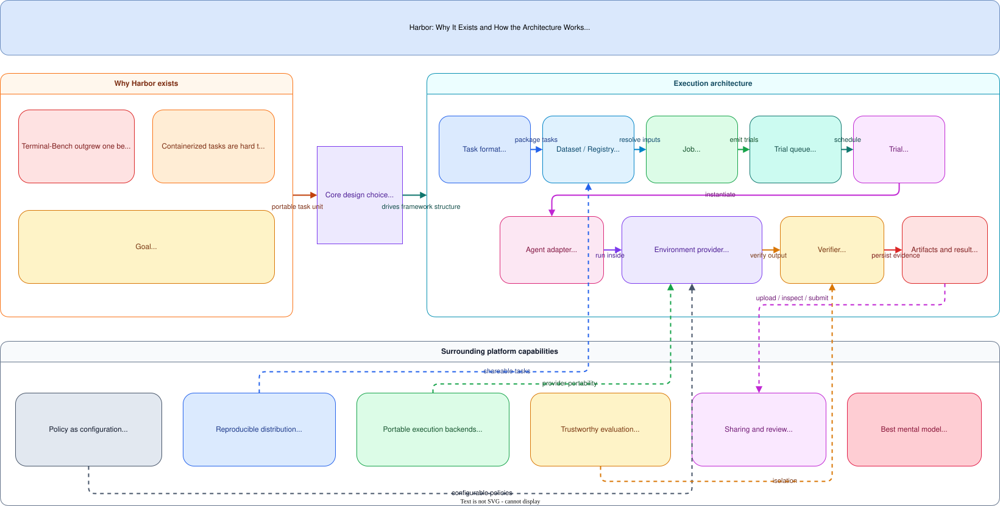
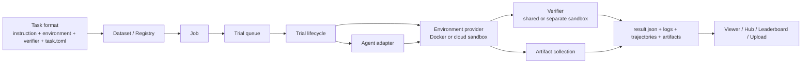
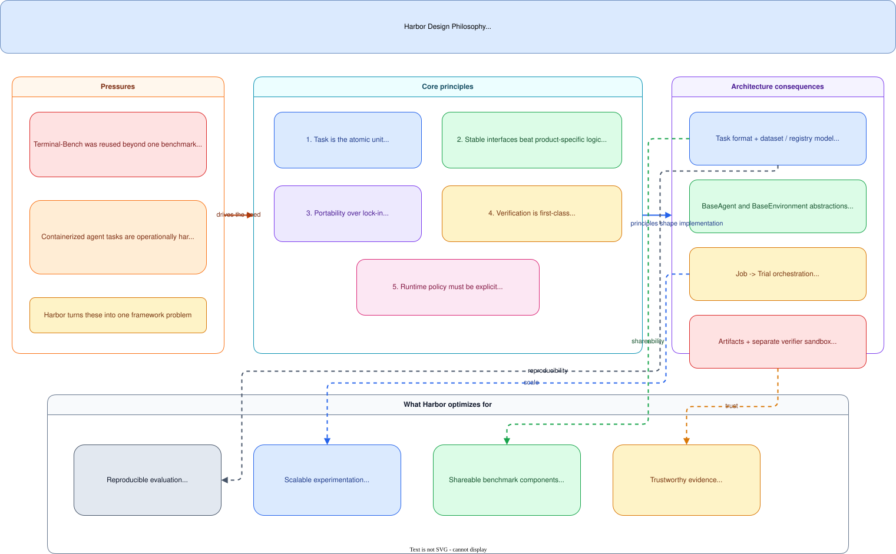
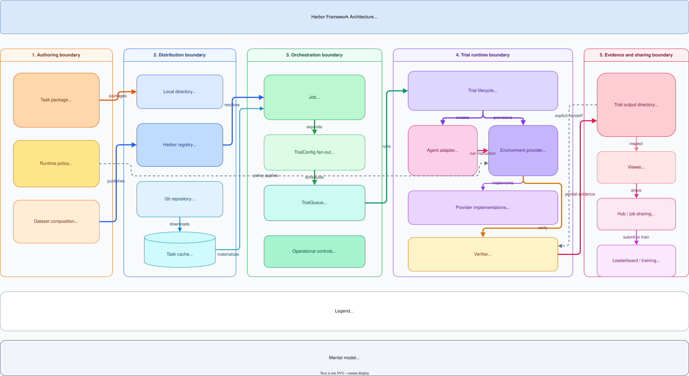

# Harbor: Agent Evaluation Framework Design

**Codebase inspected:** local `harbor` repository
**Official framing:** Harbor is a framework for evaluating and optimizing agents and models in container environments.
**Related pages:** [Frameworks](../index.md), [Pier: Coding-Agent Evaluation Harness](../../benchmarks/pier/index.md)

## TL;DR

**What:** Harbor is a framework for evaluating and optimizing agents in container environments, treating the task as the atomic portable unit.
**How:** Each task bundles instruction, container environment, verifier, and runtime policy in `task.toml`; everything else — jobs, trials, sandboxes — is built around executing that task format consistently.
**The number:** Supports local Docker runs through thousands of cloud sandboxes with the same task format.

## The Core Idea

Modern agent evaluation is not just "call a model and score the text." It requires reproducible task packaging, isolated runtimes, agent adapters, verifiers, artifact collection, and scaling — Harbor provides all of these as a framework rather than a benchmark.

## Why This Exists

The core design choice is to treat the **task** as the atomic portable unit. A Harbor task bundles:

- the instruction,
- the container environment,
- the verifier or tests,
- the runtime policy in `task.toml`.

Everything else in Harbor is built around executing that task format repeatedly and consistently.

## Visual Explainer

The diagram below summarizes Harbor's design philosophy and runtime architecture.

The Mermaid diagram below shows the same runtime flow in a more compressed form:

## Why Harbor Exists

Harbor's own motivation page gives two direct reasons.

First, Terminal-Bench was being reused for much more than one benchmark: custom evals, prompt optimization, RL rollouts, SFT trace generation, and CI-style agent testing. Second, the Harbor authors concluded that defining and managing containerized tasks at scale is hard.

So Harbor is trying to solve a broader systems problem:

1. **make agent tasks portable,**
2. **make agent trials reproducible,**
3. **make evaluation infrastructure reusable across agents and providers,**
4. **make large-scale execution practical.**

That is why Harbor is a framework, not just a benchmark.

## Design Philosophy

### Philosophy Map

This second diagram is complementary to the runtime architecture visual above. It focuses on Harbor's design logic: the pressures that led to the framework, the principles Harbor adopts, the architectural consequences of those principles, and the outcomes the framework is trying to optimize for.

### 1. The task is the atomic unit

Harbor repeatedly emphasizes that a task is one instruction, one environment, and one test script or verifier. This is the most important design decision in the system.

Why this matters:

- it makes the benchmark format portable across agents;
- it keeps evaluation attached to the environment rather than to one product integration;
- it allows the same task to be run locally, from a registry, or from a Git repository;
- it gives Harbor a clean publishing model because datasets are just collections of versioned tasks.

In practice, this means Harbor is closer to a **containerized eval operating system** than to a benchmark leaderboard script.

### 2. Interfaces before implementations

At the architecture level, Harbor is built around a small set of stable abstractions:

- `BaseAgent`
- `BaseEnvironment`
- `Task`
- `Trial`
- `Job`

That separation is deliberate. Harbor wants new agents and new sandbox providers to plug into the same runtime without changing the task format.

The design consequence is strong decoupling:

- task authors define tasks;
- agent adapters know how to run one agent;
- environment adapters know how to provision and control one sandbox backend;
- job and trial orchestration do not need to know product-specific details.

### 3. Portability over platform lock-in

Harbor's docs and code both show that it supports local Docker and multiple cloud sandbox providers behind one environment abstraction. The goal is not to make Docker special; it is to make the **task portable across providers**.

This is also why the registry is task-centric. Harbor wants tasks and datasets to move between teams and systems the way Docker images or Python packages do.

### 4. Verification is a first-class concern

Harbor is opinionated that agent output is not enough. A trial is only complete after verification. The framework supports:

- verifier config inside the task,
- artifact collection,
- sidecar evidence collection,
- separate verifier sandboxes for stronger isolation.

This is a significant design choice. It means Harbor is built for **trustworthy evaluation**, not just convenient execution.

### 5. Explicit runtime policy

Harbor encodes network policy, resource policy, MCP servers, OS, and verifier mode in task config. This makes task behavior more inspectable and more reproducible than implicit shell scripts.

The framework therefore treats runtime policy as part of the benchmark definition itself.

## Architecture

The diagram below shows Harbor as layered architecture: task authoring and policy define the portable unit, distribution sources materialize tasks, orchestration fans jobs into trials, the trial runtime combines agent and environment adapters, and evidence flows into review and sharing surfaces.

### Layer 1: Authoring and packaging

The authoring layer is centered on the Harbor task format. A task directory typically contains:

- `instruction.md`
- `task.toml`
- `environment/`
- `tests/`
- optionally `solution/`

This is Harbor's packaging boundary. It separates:

- task content,
- runtime configuration,
- verifier logic.

Datasets are then only collections of tasks. That keeps dataset composition simple and lets a single task appear in multiple datasets.

### Layer 2: Distribution

Harbor supports three main ways to source datasets:

1. local directories,
2. Harbor registry datasets,
3. Git repository datasets.

The registry design extends the same philosophy: tasks are versioned snapshots for distribution, not a live development environment. The registry announcement explicitly frames published tasks and datasets as immutable-style artifacts identified by digest, revision, and tags.

So the distribution layer is built for:

- sharing,
- versioning,
- reproducibility,
- reuse across organizations.

### Layer 3: Orchestration

The execution entrypoint is `Job`.

From the inspected code, the orchestration flow is:

1. resolve task configs from explicit tasks and datasets,
2. build one `TrialConfig` per task/agent/attempt combination,
3. cache or download remote tasks,
4. submit trials into `TrialQueue`,
5. run trials concurrently with retry policy and optional per-agent concurrency limits.

This layer is where Harbor becomes a scaling framework rather than a single-run CLI wrapper.

### Layer 4: Trial runtime

The `Trial` class is the real execution center.

At a high level, one trial does the following:

1. load the task,
2. create the agent,
3. create the environment,
4. validate network-policy requirements,
5. start the environment,
6. run the agent,
7. collect logs and artifacts,
8. run the verifier,
9. persist `result.json` and trial outputs,
10. tear everything down.

This separation is important because Harbor wants a trial to be a reproducible unit of evidence, not just a temporary shell session.

### Layer 5: Environment abstraction

`BaseEnvironment` provides the common interface for Harbor's sandbox providers. The abstraction covers more than "run command in container." It includes:

- build and startup behavior,
- mounts,
- resource policy,
- network policy,
- healthchecks,
- artifact transfer,
- optional compose and sidecar support.

That is how Harbor can support local Docker and cloud backends with one trial lifecycle.

The key architectural idea is that the **trial decides policy**, while the **environment implementation enforces it**.

### Layer 6: Agent abstraction

`BaseAgent` is Harbor's contract for agent integrations.

Each agent adapter must implement:

- `setup(environment)`
- `run(instruction, environment, context)`

This makes agents interchangeable at the framework level. Harbor does not assume every agent is an API call or every agent is a CLI. It only assumes the agent can be prepared inside a sandbox and then asked to solve the task.

That is a strong design decision because it keeps evaluation logic independent from vendor-specific execution details.

### Layer 7: Verification and evidence

Harbor's artifact system is one of its most distinctive architectural features.

The framework automatically collects:

- files from `/logs/artifacts/`,
- configured extra artifact paths,
- optional sidecar-service artifacts,
- manifest metadata about what was collected.

The newer separate-verifier design adds another layer: the verifier can run in a fresh sandbox and receive only explicitly copied artifacts. That gives Harbor:

- stronger isolation,
- better verifier reproducibility,
- support for different dependencies between agent and verifier,
- less trust in mutable live container state.

This is one of the clearest examples of Harbor optimizing for evaluation correctness instead of minimum implementation effort.

## How Harbor Achieves Its Goals

Harbor achieves its goals through a combination of format standardization, runtime abstraction, and explicit evidence handling.

### 1. It standardizes the task contract

By forcing tasks into a predictable package, Harbor makes different benchmarks look similar at the runtime boundary. That is what lets one runner execute many benchmarks.

### 2. It abstracts agents and environments separately

Because agents and sandbox providers are independent plugins, Harbor can combine:

- many agents,
- many models,
- many datasets,
- many environment backends

without rewriting the core orchestration path.

### 3. It models execution as jobs and trials

This lets Harbor scale horizontally. A job fans out into many trials, and each trial is isolated enough to run concurrently or remotely.

### 4. It treats policy as configuration

Network controls, resources, user identity, verifier mode, and MCP server setup live in config rather than ad hoc scripts. That makes the runtime more inspectable and easier to reproduce.

### 5. It treats artifacts and verification as part of the architecture

Harbor does not bolt on logging after the fact. The result directory, artifact manifest, verifier flow, and upload/share pipeline are all built into the framework.

### 6. It separates local development from distribution

Tasks are authored in version control, then published to a registry as snapshots. That mirrors Docker or PyPI and keeps development workflows cleaner than editing tasks inside a central platform.

## A Good Mental Model

The cleanest way to think about Harbor is:

- **task format** is the packaging layer,
- **job/trial** is the orchestration layer,
- **agent/environment** is the execution layer,
- **verifier/artifacts** is the evidence layer,
- **registry/hub/leaderboard** is the distribution and sharing layer.

That layered structure is why Harbor can serve multiple use cases at once:

- benchmark execution,
- prompt optimization,
- RL rollout generation,
- SFT trace generation,
- large-scale agent experiments.

## Key Takeaways

- Harbor exists because containerized agent evaluation became a reusable systems problem, not just one benchmark's implementation detail.
- Its main design principle is that the **task** is the portable atomic unit.
- The core runtime architecture is `Job -> TrialQueue -> Trial -> Agent + Environment + Verifier`.
- Harbor achieves flexibility by separating task packaging, sandbox control, agent integration, verification, and distribution.
- Its strongest architectural feature is probably the combination of **portable task format + provider abstraction + explicit verification and artifact flow**.

## One Thing to Remember

Harbor's design philosophy is that **the task is the atomic portable unit** — everything else (jobs, trials, sandboxes, verifiers) is built around executing that task format in a reproducible, evidence-producing way.

## Go Deeper

- **Read:** Harbor documentation in `raw/harbor/`
- **Build on:** [Pier: Coding-Agent Evaluation Harness](../../benchmarks/pier/index.md)
- **Understand the context:** [DeepSWE: Long-Horizon Software Engineering Benchmark](../../benchmarks/deepswe/index.md)
- **Reproduce:** Harbor framework setup from its repository
