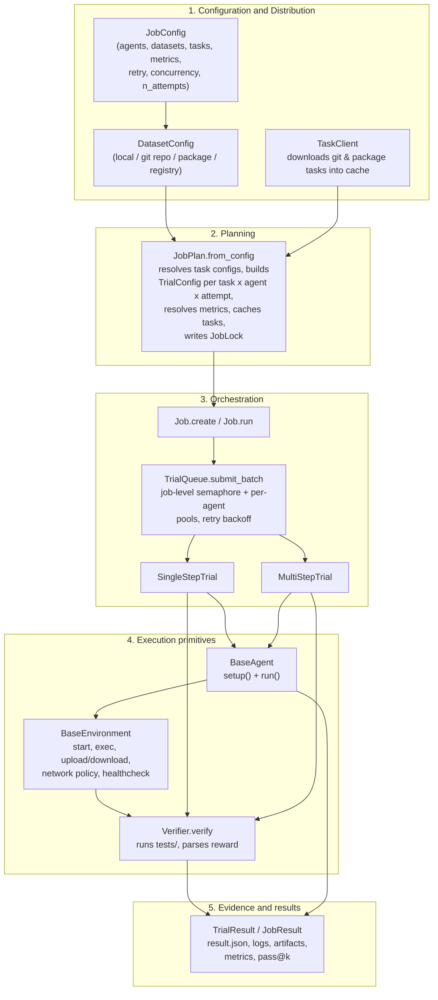
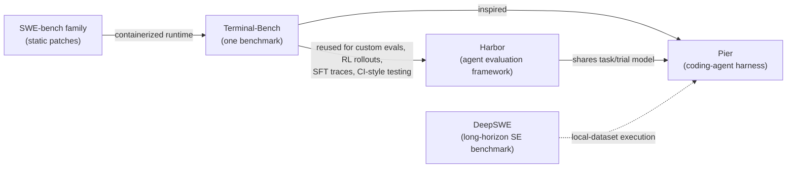

# Harbor: Agent Evaluation Framework (Code Reading)

**Repository:** [harbor-framework/harbor](https://github.com/harbor-framework/harbor)  
**Inspected revision:** `97e65926410ba6b9cef15cd5d9bf9a0c700cef26` (main, 2026-08-04)

**Related pages:** [Frameworks](../index.md), [Pier: Coding-Agent Evaluation Harness](../../benchmarks/agent-eval/pier/index.md), [DeepSWE: Long-Horizon Software Engineering Benchmark](../../benchmarks/agent-eval/deepswe/index.md)

## TL;DR

**What:** Harbor is a framework for evaluating and optimizing agents and models inside container environments; the task package is the atomic portable unit.
**How:** A `JobConfig` is planned into a `JobPlan`, fanned out through a `TrialQueue` into isolated `Trial` runs (single-step or multi-step), each combining a `BaseAgent`, a `BaseEnvironment` sandbox provider, and a `Verifier`, with every trial persisting its own evidence directory.
**The number:** One task format runs from local Docker development through dozens of cloud sandbox providers, while job-level and per-agent concurrency plus retry backoff keep large runs tractable.

## The Big Picture

The synthesized diagram below summarizes Harbor's design philosophy and runtime architecture: portable task packages flow through distribution, orchestration, trial execution, and evidence collection.


*Synthesized explanation (editable source: [harbor-architecture.drawio](../assets/harbor-architecture.drawio)). The current runtime flow — configuration → planning → orchestration → execution → evidence — is shown below.*



Editable source: [runtime-flow.mmd](assets/runtime-flow.mmd). The fuller layered view lives in the separate [runtime-architecture.drawio](../assets/harbor-runtime-architecture.drawio) and its render [harbor-runtime-architecture.drawio.svg](../assets/harbor-runtime-architecture.drawio.svg); the design rationale is in [design-philosophy.drawio](../assets/harbor-design-philosophy.drawio) and its render [harbor-design-philosophy.drawio.svg](../assets/harbor-design-philosophy.drawio.svg).

## Why This Exists

Terminal-Bench was being reused for far more than one benchmark: custom evals, prompt optimization, RL rollouts, SFT trace generation, and CI-style agent testing. Each of those uses needs the same hard plumbing — reproducible task packaging, isolated runtimes, agent adapters, verifiers, artifact collection, and scaling — and doing it ad hoc per benchmark does not scale. Harbor exists to solve that systems problem as a framework rather than as a single benchmark runner.

## The Landscape

Harbor's lineage runs through Terminal-Bench (which it generalizes) and sits beside smaller Harbor-compatible harnesses and other software-engineering agent benchmarks in the knowledge base.



Editable source: [landscape.mmd](assets/landscape.mmd).

## The Core Idea

Harbor treats the **task package** as the atomic portable unit: one instruction, one container environment, one verifier, and an explicit runtime policy travel together. Everything else — jobs, trials, sandboxes, verifiers, distribution, compilation — is built around executing that unit repeatedly, reproducibly, and at scale.

## Task Packaging: The Atomic Unit

The task directory is the contract every other layer consumes. Its canonical layout is defined by the <a class="code-link" href="../../../external-repos/harbor/src/harbor/models/task/task.py#L35" data-code-repo="harbor-97e65926410b" data-code-path="src/harbor/models/task/task.py" data-code-line="35"><code>Task</code></a> class:

```text
task/
├── instruction.md          # the prompt (canary markers stripped)
├── task.toml               # parsed into TaskConfig
├── environment/            # Dockerfile / docker-compose.yaml / etc.
├── solution/               # copied to /solution (optional)
└── tests/                  # test.{sh,ps1,cmd,bat} per target OS
```

Loading a task parses task.toml through the <a class="code-link" href="../../../external-repos/harbor/src/harbor/models/task/config.py#L795" data-code-repo="harbor-97e65926410b" data-code-path="src/harbor/models/task/config.py" data-code-line="795"><code>TaskConfig</code></a> model, strips leading canary comment lines from the instruction, and validates that an OS-compatible test script exists. `TaskConfig` is the schema for everything declarative: `[environment]` (OS, Docker image, workdir, resource policy), `[verifier]` (mode, env, user), `[agent]` (user, concurrency, MCP servers), artifact collection rules, and — in newer tasks — `[[steps]]` for multi-step workloads with per-step verifiers and a `multi_step_reward_strategy`.

## Distribution: Where Tasks Come From

A job's task inputs are declared as <a class="code-link" href="../../../external-repos/harbor/src/harbor/models/job/config.py#L344" data-code-repo="harbor-97e65926410b" data-code-path="src/harbor/models/job/config.py" data-code-line="344"><code>JobConfig</code></a> (plus `DatasetConfig`). <a class="code-link" href="../../../external-repos/harbor/src/harbor/models/job/config.py#L154" data-code-repo="harbor-97e65926410b" data-code-path="src/harbor/models/job/config.py" data-code-line="154" data-code-end-line="216"><code>DatasetConfig.get_task_configs()</code></a> supports four source kinds:

1. **local** — a directory of task folders, used directly.
2. **git repo** — a git repository dataset resolved through the registry client.
3. **package** — named `org/name` package tasks with content-hash refs.
4. **registry** — a Harbor registry dataset identified by name/version.

Git and package tasks are materialized before trials run: <a class="code-link" href="../../../external-repos/harbor/src/harbor/tasks/client.py#L474" data-code-repo="harbor-97e65926410b" data-code-path="src/harbor/tasks/client.py" data-code-line="474" data-code-end-line="552"><code>TaskClient.download_tasks()</code></a> groups by task-id type and downloads into a cache layout (`<org>/<name>/<digest>/`), or a flat layout in export mode, so every trial sees an immutable local snapshot.

## Planning and Orchestration

### JobPlan: resolve before you run

<a class="code-link" href="../../../external-repos/harbor/src/harbor/job_plan.py#L41" data-code-repo="harbor-97e65926410b" data-code-path="src/harbor/job_plan.py" data-code-line="41" data-code-end-line="76"><code>JobPlan.from_config()</code></a> is the planning step: it resolves agent skills, expands task configs from explicit tasks and datasets, validates environment resource policies, resolves metrics per dataset, and caches remote tasks. <a class="code-link" href="../../../external-repos/harbor/src/harbor/job_plan.py#L111" data-code-repo="harbor-97e65926410b" data-code-path="src/harbor/job_plan.py" data-code-line="111" data-code-end-line="140"><code>JobPlan.build_trial_configs()</code></a> then fans out one <a class="code-link" href="../../../external-repos/harbor/src/harbor/models/trial/config.py#L440" data-code-repo="harbor-97e65926410b" data-code-path="src/harbor/models/trial/config.py" data-code-line="440"><code>TrialConfig</code></a> per task × agent × attempt. The plan also builds a `JobLock` that records the resolved run input, so retries and resumed jobs replay the same configuration.

### Job: run and aggregate

<a class="code-link" href="../../../external-repos/harbor/src/harbor/job.py#L137" data-code-repo="harbor-97e65926410b" data-code-path="src/harbor/job.py" data-code-line="137" data-code-end-line="165"><code>Job.create()</code></a> initializes a job directory, trial configs, and a `TrialQueue`; <a class="code-link" href="../../../external-repos/harbor/src/harbor/job.py#L961" data-code-repo="harbor-97e65926410b" data-code-path="src/harbor/job.py" data-code-line="961" data-code-end-line="1103"><code>Job.run()</code></a> writes the resolved config and job lock, runs the trial batch, then aggregates per-eval metrics and pass@k into a `JobResult`. The job surface is hook-driven (`TrialEvent` callbacks) so progress UIs and metric display plug in without touching trial internals.

### TrialQueue: concurrency and retries

<a class="code-link" href="../../../external-repos/harbor/src/harbor/trial/queue.py#L253" data-code-repo="harbor-97e65926410b" data-code-path="src/harbor/trial/queue.py" data-code-line="253" data-code-end-line="259"><code>TrialQueue.submit_batch()</code></a> returns one coroutine per trial. Execution is bounded by a job-level semaphore (`n_concurrent_trials`, default 4) plus optional per-agent pools, and `_execute_trial_with_retries` retries with exponential backoff on retryable exception types.

## Trial Runtime

### The base lifecycle

<a class="code-link" href="../../../external-repos/harbor/src/harbor/trial/trial.py#L370" data-code-repo="harbor-97e65926410b" data-code-path="src/harbor/trial/trial.py" data-code-line="370" data-code-end-line="403"><code>Trial.run()</code></a> owns setup, hooks, result persistence, and teardown: `_prepare()` starts the agent environment, runs its healthcheck, injects skills, and runs agent setup; `_finalize()` stops the environment and writes result.json. Concrete subclasses own the workload shape. The agent phase in <a class="code-link" href="../../../external-repos/harbor/src/harbor/trial/trial.py#L445" data-code-repo="harbor-97e65926410b" data-code-path="src/harbor/trial/trial.py" data-code-line="445" data-code-end-line="488"><code>Trial._run_agent_phase()</code></a> wraps the agent's `run()` with a per-phase network policy, extra env, log context, and a timeout.

### Single-step vs multi-step

<a class="code-link" href="../../../external-repos/harbor/src/harbor/trial/single_step.py#L37" data-code-repo="harbor-97e65926410b" data-code-path="src/harbor/trial/single_step.py" data-code-line="37" data-code-end-line="60"><code>SingleStepTrial._run()</code></a> is the classic shape: one instruction, one agent run, artifact collection, then a shared or separate verifier. <a class="code-link" href="../../../external-repos/harbor/src/harbor/trial/multi_step.py#L57" data-code-repo="harbor-97e65926410b" data-code-path="src/harbor/trial/multi_step.py" data-code-line="57" data-code-end-line="83"><code>MultiStepTrial._run()</code></a> executes sequential named steps, each with its own agent run and verifier, and combines per-step rewards into one trial-level reward (mean or last-step).

## Execution Primitives

### Agents

<a class="code-link" href="../../../external-repos/harbor/src/harbor/agents/base.py#L20" data-code-repo="harbor-97e65926410b" data-code-path="src/harbor/agents/base.py" data-code-line="20"><code>BaseAgent</code></a> is the agent contract: `setup(environment)` prepares the agent and its tools inside the sandbox, and `run(instruction, environment, context)` executes it and populates an `AgentContext`. Class flags declare capabilities (`SUPPORTS_ATIF` for the trajectory format, `SUPPORTS_RESUME`, `SUPPORTS_CONFIG`, `SUPPORTS_WINDOWS`) so the trial runner can fail fast on mismatches. Agents receive MCP server configs and a skills directory from the task.

### Environments

<a class="code-link" href="../../../external-repos/harbor/src/harbor/environments/base.py#L84" data-code-repo="harbor-97e65926410b" data-code-path="src/harbor/environments/base.py" data-code-line="84"><code>BaseEnvironment</code></a> is the sandbox contract: start/stop, `exec` (<a class="code-link" href="../../../external-repos/harbor/src/harbor/environments/base.py#L1128" data-code-repo="harbor-97e65926410b" data-code-path="src/harbor/environments/base.py" data-code-line="1128"><code>BaseEnvironment.exec</code></a>), upload/download (including tar-based filtered transfers), mounts, resource policy, healthchecks, and optional compose/sidecar services. Providers must advertise capabilities and enforce the task's network policy exactly or reject the task before start. <a class="code-link" href="../../../external-repos/harbor/src/harbor/environments/base.py#L838" data-code-repo="harbor-97e65926410b" data-code-path="src/harbor/environments/base.py" data-code-line="838" data-code-end-line="851"><code>BaseEnvironment.set_network_policy()</code></a> supports runtime policy switching when the provider advertises `dynamic_network_policy`. Concrete providers cover Docker, Daytona, Singularity, E2B, Modal, GKE, OpenShift, SkyPilot, EC2, Runloop, and more — one trial lifecycle across all of them.

### Verifier

The default <a class="code-link" href="../../../external-repos/harbor/src/harbor/verifier/verifier.py#L138" data-code-repo="harbor-97e65926410b" data-code-path="src/harbor/verifier/verifier.py" data-code-line="138" data-code-end-line="237"><code>Verifier.verify()</code></a> uploads the task's test scripts into the environment, runs the OS-appropriate test command as the effective verifier user, downloads the verifier directory, and parses the reward from a JSON or text reward file. Verification can run in the shared agent sandbox or in a fresh separate verifier sandbox that receives only explicitly collected artifacts.

## Derived Workflows: Compile and Exec

Two higher-level workflows build on the core runtime:

- <a class="code-link" href="../../../external-repos/harbor/src/harbor/compile/compiler.py#L66" data-code-repo="harbor-97e65926410b" data-code-path="src/harbor/compile/compiler.py" data-code-line="66" data-code-end-line="92"><code>Compiler.compile()</code></a> turns a `CompileConfig` (instructions × environments × verifiers) into concrete task directories, including generating auto-verifier test scripts that check required artifacts and JSON schemas.
- <a class="code-link" href="../../../external-repos/harbor/src/harbor/exec/executor.py#L56" data-code-repo="harbor-97e65926410b" data-code-path="src/harbor/exec/executor.py" data-code-line="56" data-code-end-line="74"><code>Executor.execute()</code></a> chains a map phase (compile + run a job) and an optional reduce phase (compile a reduce task from the map job's artifacts + run it) for workflows like RL rollout generation.

## Static vs Runtime Evidence

All claims above come from static code reading of the pinned checkout (`97e65926410b`, clean); runtime behavior was not executed. The trial lifecycle, environment provider behavior, and network-policy enforcement in particular are inferred from code and docstrings, not verified by running a trial. Consume the local checkout under `external-repos/harbor/` for interactive navigation.

## Limitations

- Static reading only; no trial, environment, or verifier was executed at this revision.
- The environment provider matrix (Docker, Daytona, E2B, Modal, GKE, ...) was surveyed from source; provider-specific runtime quirks are not verified.
- This reading reflects the codebase at `97e65926410b` (2026-08-04); Harbor evolves quickly, so later revisions may differ.

## Key Takeaways

- The **task package** is the atomic portable unit: instruction + environment + verifier + policy travel together.
- Planning (`JobPlan`) and orchestration (`Job`, `TrialQueue`) are separate from execution (`Trial`, `BaseAgent`, `BaseEnvironment`, `Verifier`).
- Tasks can be local, git-repo, package, or registry sources, all materialized into an immutable cache before trials run.
- Trials come in single-step and multi-step shapes; every trial persists its own evidence directory.
- Compile and exec workflows generate tasks and map/reduce jobs on top of the same runtime.

## One Thing to Remember

Harbor's design philosophy is that **the task is the atomic portable unit** — jobs, trials, sandboxes, verifiers, and distribution all exist to execute that unit reproducibly and at scale.

## Go Deeper

- **Build on:** [Pier: Coding-Agent Evaluation Harness](../../benchmarks/agent-eval/pier/index.md) — a smaller Harbor-compatible harness.
- **Understand the context:** [DeepSWE: Long-Horizon Software Engineering Benchmark](../../benchmarks/agent-eval/deepswe/index.md).
- **Reproduce:** browse the pinned checkout at `external-repos/harbor/` (revision `97e65926410b`).
- **Editable diagrams:** [runtime-flow.mmd](assets/runtime-flow.mmd), [landscape.mmd](assets/landscape.mmd), [harbor-architecture.drawio](../assets/harbor-architecture.drawio), [harbor-runtime-architecture.drawio](../assets/harbor-runtime-architecture.drawio), [harbor-design-philosophy.drawio](../assets/harbor-design-philosophy.drawio).
