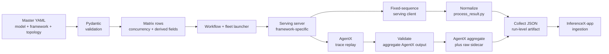
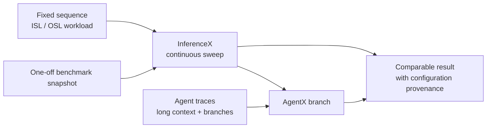

# InferenceX: Continuous Inference Benchmark Pipeline

**Repository:** [SemiAnalysisAI/InferenceX](https://github.com/SemiAnalysisAI/InferenceX)  
**Inspected revision:** `7fa1d14b6624d433bd4f72a540da739b8f3808d9` (`main`, inspected 2026-09-09)  
**Evidence boundary:** clean checkout, static source reading only. This insight did not run a GPU, container, Slurm, or multi-node benchmark.

**Related pages:** [Frameworks](../index.md), [AgentX / InferenceX v3](../agentx-inferencexv3-cuda-moat/index.md), [vLLM](../vllm/index.md), and [SGLang](../sglang/index.md)

## TL;DR

**What:** InferenceX is an open-source continuous inference benchmarking platform that compares serving stacks as their software and hardware configurations change.

**How:** Declarative model and runner configurations are validated, expanded into matrix rows, routed through fleet-specific launchers and shared benchmark helpers, then normalized into artifacts for collection and app ingestion.

**The number:** The repository has two principal measurement branches, `fixed-seq-len` and `agentic-coding`; they share configuration and artifact machinery but use different workload and validation paths.

## The Big Picture

The editable diagram is [runtime-flow.mmd](assets/runtime-flow.mmd).

*Synthesized explanation from the repository's architecture and runtime code. Configuration intent is separated from physical launch mechanics; the two workload branches converge only after producing their respective result artifacts.*

The repository README describes this goal at the <a class="code-link" href="../../../external-repos/InferenceX/README.md#L1" data-code-repo="inferencex-7fa1d14b6624" data-code-path="README.md" data-code-line="1"><code>README.md</code></a> entry point. The local architecture guide describes the same pipeline at <a class="code-link" href="../../../external-repos/InferenceX/docs/architecture.md#L1" data-code-repo="inferencex-7fa1d14b6624" data-code-path="docs/architecture.md" data-code-line="1"><code>docs/architecture.md</code></a>.

## Why This Exists

A serving result is easy to misread when the benchmark records only a model name and a throughput number. The same model can be run with a different framework, precision, tensor-parallel shape, cache policy, runner fleet, or client workload. A fixed prompt test can also hide the long-lived prefixes, tool delays, and branch concurrency that an agentic workload creates.

InferenceX addresses that comparability problem by making the configuration row, runtime environment, workload shape, and result artifact travel together. The design is deliberately a pipeline: a valid YAML entry is only intent, while a useful published result requires matrix generation, launcher behavior, benchmark output, aggregation, and downstream provenance to agree.

## The Landscape

The editable landscape diagram is [landscape.mmd](assets/landscape.mmd).

*Landscape synthesis. InferenceX keeps fixed-sequence tests for controlled comparisons and adds AgentX replay when the reader needs session state, trace timing, and branch behavior. The diagram is an explanatory model, not a claim that one workload supersedes the other.*

## The Core Idea

**InferenceX is a configuration-to-evidence compiler for inference experiments.** It does not replace vLLM, SGLang, TensorRT-LLM, or another serving engine. Instead, it supplies the surrounding contract that makes those engines comparable: validated experiment identity, hardware-aware scheduling, framework-local launch code, standardized client metrics, result normalization, and a path from uploaded artifacts to a published dashboard row.

## Symbol Map

The repository uses short configuration names for both workload and topology. `ISL` and `OSL` describe fixed-sequence input and output lengths; `conc` is the requested concurrency; `TP`, `PP`, `DCP`, and `PCP` describe tensor, pipeline, decode-context, and prefill-context parallelism. `AgentX` refers to the agentic trace-replay branch rather than to a serving engine.

| Term | Scope | Plain meaning |
|---|---|---|
| Master config | YAML source | Declares model, image, framework, runner, scenario, and search space. |
| Matrix row | One executable point | The validated configuration passed to a workflow and launcher. |
| `ISL` / `OSL` | Fixed-sequence request | Input and output sequence lengths. |
| `conc` | Load shape | Maximum concurrent requests or agentic users for a point. |
| `TP` / `PP` | Model topology | Tensor and pipeline parallelism. |
| `DCP` / `PCP` | Context topology | Decode and prefill context parallelism; DCP reuses TP GPUs while PCP changes the prefill footprint. |
| AgentX | Agentic scenario | Trace replay for long-context, multi-turn, and branching traffic. |
| Aggregate artifact | Result handoff | JSON normalized for collection and downstream ingestion. |

## Deep Dive

### 1. Configuration becomes a validated matrix

**What it does:** The configuration layer expands a human-readable search space into concrete rows that workflows can execute.

**Why it matters:** Without a single expansion and validation point, different workflows could silently disagree about topology, concurrency, or which hardware a row consumes.

**How it works:** The schema contract is documented in <a class="code-link" href="../../../external-repos/InferenceX/configs/CONFIGS.md#L1" data-code-repo="inferencex-7fa1d14b6624" data-code-path="configs/CONFIGS.md" data-code-line="1"><code>configs/CONFIGS.md</code></a>. The Pydantic models distinguish single-node rows at <a class="code-link" href="../../../external-repos/InferenceX/infx/matrix/validation.py#L155" data-code-repo="inferencex-7fa1d14b6624" data-code-path="infx/matrix/validation.py" data-code-line="155"><code>SingleNodeMatrixEntry</code></a>, multi-node rows at <a class="code-link" href="../../../external-repos/InferenceX/infx/matrix/validation.py#L254" data-code-repo="inferencex-7fa1d14b6624" data-code-path="infx/matrix/validation.py" data-code-line="254"><code>MultiNodeMatrixEntry</code></a>, and agentic variants at lines 311 and 365. <a class="code-link" href="../../../external-repos/InferenceX/infx/matrix/validation.py#L433" data-code-repo="inferencex-7fa1d14b6624" data-code-path="infx/matrix/validation.py" data-code-line="433"><code>validate_agentic_matrix_entry()</code></a> and <a class="code-link" href="../../../external-repos/InferenceX/infx/matrix/validation.py#L446" data-code-repo="inferencex-7fa1d14b6624" data-code-path="infx/matrix/validation.py" data-code-line="446"><code>validate_matrix_entry()</code></a> enforce the output contract. <a class="code-link" href="../../../external-repos/InferenceX/infx/matrix/generate.py#L962" data-code-repo="inferencex-7fa1d14b6624" data-code-path="infx/matrix/generate.py" data-code-line="962"><code>generate_full_sweep()</code></a> then expands search spaces and derives executable metadata such as concurrency, topology, names, and AgentX fields.

| Input intent | Derived execution state |
|---|---|
| Model, image, framework, precision | Serving identity and launcher selection |
| Runner label and hardware facts | Scheduling target and resource-derived fields |
| Fixed-sequence `ISL`/`OSL` search space | Concrete concurrency rows and result identity |
| Agentic trace source and KV settings | Replay rows, offload metadata, duration, and user concurrency |
| TP/PP/DCP/PCP/EP/DP-attention | Topology fields forwarded to the relevant workflow and script |

**The intuition:** YAML says what should be measured; the generated row says exactly what one job will attempt.

**A concrete example:** A fixed-sequence entry with a concurrency range becomes several rows, while an agentic entry also carries trace-source and KV-offload metadata so the runner can allocate the right memory budget.

**Remember:** Matrix generation is the boundary where benchmark intent becomes executable identity.

### 2. Launchers isolate fleet details from benchmark intent

**What it does:** The workflow and runner scripts translate one matrix row into a real serving process on a specific machine or cluster.

**Why it matters:** Model configuration should remain portable while ports, mounts, containers, Slurm allocations, and framework flags remain close to the fleet that needs them.

**How it works:** The architecture guide separates workflow dispatch, fleet launchers, and benchmark scripts. The shared <a class="code-link" href="../../../external-repos/InferenceX/benchmarks/benchmark_lib.sh#L464" data-code-repo="inferencex-7fa1d14b6624" data-code-path="benchmarks/benchmark_lib.sh" data-code-line="464"><code>wait_for_server_ready()</code></a> helper waits for a live endpoint and watches process health. Fixed-sequence jobs enter <a class="code-link" href="../../../external-repos/InferenceX/benchmarks/benchmark_lib.sh#L527" data-code-repo="inferencex-7fa1d14b6624" data-code-path="benchmarks/benchmark_lib.sh" data-code-line="527"><code>run_benchmark_serving()</code></a>, which constructs a standardized serving-client command, requests warmups, saves JSON, and records percentile metrics. Framework-specific scripts still own the server command; the helper owns the shared client contract.

**The intuition:** The matrix describes the experiment, while the launcher supplies the physical world in which the experiment can run.

**A concrete example:** Two rows can share the same model and sequence lengths but use different framework launchers or runner labels. Their result identity keeps those differences visible instead of treating the outputs as interchangeable.

**Remember:** A configuration field has no runtime effect until the workflow, launcher, and benchmark script all consume it.

### 3. Fixed-sequence and AgentX runs use different workload contracts

**What it does:** InferenceX keeps controlled random serving tests and stateful trace replay as separate workload paths.

**Why it matters:** A fixed request shape isolates serving behavior; an agentic trace exercises repeated prefixes, inter-turn delays, branches, and KV-cache policy.

**How it works:** The fixed path calls the shared serving client. Agentic scripts call <a class="code-link" href="../../../external-repos/InferenceX/benchmarks/benchmark_lib.sh#L3227" data-code-repo="inferencex-7fa1d14b6624" data-code-path="benchmarks/benchmark_lib.sh" data-code-line="3227"><code>run_agentic_replay_and_write_outputs()</code></a>, which stages AgentX/AIPerf replay outputs under a separate result directory. The source's AgentX aggregator reads the profile export; <a class="code-link" href="../../../external-repos/InferenceX/utils/agentic/aggregation/process_agentic_result.py#L194" data-code-repo="inferencex-7fa1d14b6624" data-code-path="utils/agentic/aggregation/process_agentic_result.py" data-code-line="194"><code>build_agg()</code></a> counts total and successful requests and retains request accounting. <a class="code-link" href="../../../external-repos/InferenceX/utils/agentic/validation/validate_agentic_result.py#L49" data-code-repo="inferencex-7fa1d14b6624" data-code-path="utils/agentic/validation/validate_agentic_result.py" data-code-line="49"><code>validate_result()</code></a> applies the pre-upload gate for aggregate shape, completed requests, and the configured error threshold.

| Branch | Input | Primary output | Important caveat |
|---|---|---|---|
| Fixed-sequence | Synthetic request lengths and concurrency | One serving-client JSON result | Controlled shape is useful for comparison but does not model session history. |
| AgentX | Trace replay with request lifecycle metadata | Aggregate metrics plus raw replay sidecar | Warmup and error records are accounted for but excluded from performance metrics. |

**The intuition:** The benchmark must preserve the workload state that the metric is supposed to describe.

**A concrete example:** A long-context agent session can produce a cache-heavy request after a tool delay. Replacing it with an isolated random prompt changes the question from session-serving behavior to single-request throughput.

**Remember:** AgentX is a workload branch layered on the same pipeline, not a synonym for the whole repository.

### 4. Result normalization preserves the experiment identity

**What it does:** Result processors turn framework output into a stable schema that carries both measurements and the configuration that produced them.

**Why it matters:** A throughput value without model, hardware, framework, topology, and sequence metadata cannot be compared or safely ingested.

**How it works:** <a class="code-link" href="../../../external-repos/InferenceX/utils/process_result.py#L113" data-code-repo="inferencex-7fa1d14b6624" data-code-path="utils/process_result.py" data-code-line="113"><code>process_result.py</code></a> requires identity environment variables, reads the serving-client JSON at line 130, and builds an output object at line 133. It branches at line 158 for multi-node topology and derives per-GPU throughput using the declared prefill and decode GPU counts. The run-level collector recursively loads JSON files into one aggregate array; collection is a transport step, not row-level schema validation or deduplication.

**The intuition:** Normalization turns a raw measurement into a measurement with an address.

**A concrete example:** The same output token rate from two jobs remains distinguishable because the normalized rows retain the framework, precision, runner, topology, and `RESULT_FILENAME` context.

**Remember:** Artifact naming and normalized fields are part of the benchmark's data contract.

## Putting It Together

Follow one benchmark point from declaration to a possible dashboard row:

| Step | Actor | Input state | Action | Output state |
|---:|---|---|---|---|
| 1 | Master config | Model, framework, runner, scenario, search space | Declare the experiment in the schema described by <a class="code-link" href="../../../external-repos/InferenceX/configs/CONFIGS.md#L1" data-code-repo="inferencex-7fa1d14b6624" data-code-path="configs/CONFIGS.md" data-code-line="1"><code>CONFIGS.md</code></a> | Human-readable benchmark intent |
| 2 | Matrix generator | YAML plus runner hardware facts | Validate and expand with <a class="code-link" href="../../../external-repos/InferenceX/infx/matrix/generate.py#L962" data-code-repo="inferencex-7fa1d14b6624" data-code-path="infx/matrix/generate.py" data-code-line="962"><code>generate_full_sweep()</code></a> | One executable matrix row |
| 3 | Workflow and launcher | Matrix row | Select a fleet, start the framework server, and export runtime identity | Live serving endpoint plus job environment |
| 4 | Shared benchmark helper | Endpoint, model, ISL, OSL, concurrency | Run <a class="code-link" href="../../../external-repos/InferenceX/benchmarks/benchmark_lib.sh#L527" data-code-repo="inferencex-7fa1d14b6624" data-code-path="benchmarks/benchmark_lib.sh" data-code-line="527"><code>run_benchmark_serving()</code></a>, or choose AgentX replay at line 3227 | Raw fixed-sequence or replay result files |
| 5 | Result processor | Raw result plus environment metadata | Normalize topology and throughput with <a class="code-link" href="../../../external-repos/InferenceX/utils/process_result.py#L130" data-code-repo="inferencex-7fa1d14b6624" data-code-path="utils/process_result.py" data-code-line="130"><code>process_result.py</code></a> | Per-config aggregate object |
| 6 | AgentX gate | AIPerf aggregate and profile records | Filter warmup/errors, preserve request accounting, and validate the error threshold | Accepted AgentX aggregate plus raw sibling, or a rejected upload |
| 7 | Collector | Per-job JSON artifacts | Recursively combine files with <a class="code-link" href="../../../external-repos/InferenceX/utils/collect_results.py#L9" data-code-repo="inferencex-7fa1d14b6624" data-code-path="utils/collect_results.py" data-code-line="9"><code>collect_results.py</code></a> | Run-level aggregate artifact |
| 8 | App handoff | Aggregated artifacts and run metadata | Follow the dispatch and ingestion boundary documented in <a class="code-link" href="../../../external-repos/InferenceX/docs/architecture.md#L1" data-code-repo="inferencex-7fa1d14b6624" data-code-path="docs/architecture.md" data-code-line="1"><code>docs/architecture.md</code></a> | Normalized dashboard data, subject to downstream verification |

The return path is not a live request-response loop: InferenceX measures the serving endpoint, writes files, and hands those files to collectors and a separate app. The first externally visible result is therefore an artifact, not a token stream.

## What This Buys You

### The headline claim

InferenceX makes continuous inference comparisons inspectable by carrying workload, topology, software identity, and result provenance through one repeatable pipeline.

### How we know: source-backed architecture

| Evidence | What it establishes | Boundary |
|---|---|---|
| Strict matrix models and one generator path | Rows are intended to have one validated shape before workflow execution. | A valid row does not prove that a framework launcher or runtime image will succeed. |
| Shared serving helper and separate AgentX replay helper | Fixed-sequence and trace workloads share operational plumbing but preserve different workload semantics. | The static reading does not measure the relative performance of the branches. |
| Normalized result and collection scripts | Per-job results can be carried into a run-level JSON artifact with configuration identity. | The collector itself does not deduplicate or semantically validate every row. |
| Architecture and ingestion documentation | The project treats artifacts, workflow identity, and app handoff as explicit contracts. | The downstream InferenceX-app repository was not checked out or executed here. |

### The mechanism behind the numbers

The benchmark number is meaningful only in its configuration context. Changing framework version, serving flags, hardware topology, cache/offload policy, runner fleet, or workload branch can change the result even when the model name remains constant. The repository's strength is not a single magic metric; it is the discipline of making those dimensions available for comparison.

> **Warning:** Do not treat a generated matrix row, a successfully uploaded artifact, or a parsed JSON file as proof of a valid published measurement. Runtime health, result validation, artifact collection, downstream ingestion, and database verification are separate boundaries.

## Where It Breaks

| Failure mode | When it happens | Impact |
|---|---|---|
| Configuration/runtime gap | A field is validated and forwarded but the selected launcher or benchmark script does not consume it | The row looks complete while the intended behavior is absent. |
| Fleet dependence | A launcher requires a particular GPU, container image, mount, network, or Slurm shape | Local reproduction cannot establish production behavior without the same environment. |
| Collector permissiveness | The run-level collector can parse JSON without deduplicating or semantically validating rows | A run-level aggregate can contain unusable or repeated records. |
| AgentX filtering | A replay record is warmup or has an error | It remains in request accounting but does not contribute to successful-request metrics. |
| Downstream boundary | InferenceX-app mapping, database verification, or cache invalidation fails after upload | A valid producer artifact may not become a visible dashboard result. |
| Moving revision | Framework scripts, images, models, and runner fleets change after this commit | Results from different revisions are not automatically apples-to-apples. |

## Static vs Runtime Evidence

Everything above is grounded in static reading of the clean checkout at `7fa1d14b6624d433bd4f72a540da739b8f3808d9`. The matrix schema, branching structure, environment contracts, and artifact transformations are code-backed. No serving engine was started, no AIPerf trace was replayed, and no GPU or multi-node metric was independently verified.

## One Thing to Remember

**InferenceX is the evidence pipeline around an inference engine.** It makes a benchmark point useful by preserving what ran, where it ran, which workload it saw, how its output was normalized, and whether the artifact crossed the ingestion boundary.

## Go Deeper

- **Read:** [InferenceX README](https://github.com/SemiAnalysisAI/InferenceX/blob/7fa1d14b6624d433bd4f72a540da739b8f3808d9/README.md) and [repository architecture guide](https://github.com/SemiAnalysisAI/InferenceX/blob/7fa1d14b6624d433bd4f72a540da739b8/docs/architecture.md)
- **Understand the workload:** [AgentX / InferenceX v3](../agentx-inferencexv3-cuda-moat/index.md)
- **Compare serving engines:** [vLLM](../vllm/index.md) and [SGLang](../sglang/index.md)
- **Inspect locally:** [runtime-flow.mmd](assets/runtime-flow.mmd) and [landscape.mmd](assets/landscape.mmd)
- **Reproduce:** the repository provides tests and workflows, but this page did not run a GPU or multi-node benchmark at the inspected revision.
