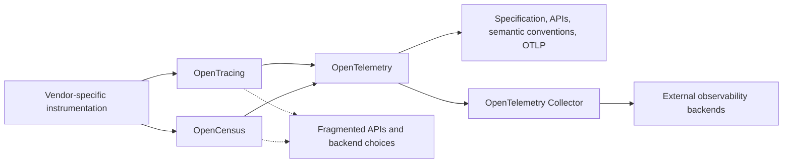

# OpenTelemetry: Vendor-Neutral Observability Framework

**Source:** [What is OpenTelemetry?](https://opentelemetry.io/docs/what-is-opentelemetry/) from the official OpenTelemetry documentation, captured on 2026-08-22.

**Related pages:** [Frameworks](../index.md), [vLLM Architecture and Code Organization Overview](../vllm/vllm-overview.md), [SGLang: Structured Language Model Programs](../sglang/index.md)

## TL;DR

**What:** OpenTelemetry is an open-source, vendor- and tool-agnostic framework and toolkit for generating, collecting, and exporting telemetry such as traces, metrics, and logs.

**How:** It combines specifications, APIs, language SDKs, semantic conventions, the OTLP protocol, instrumentation libraries, and the OpenTelemetry Collector into a portable telemetry path.

**The boundary:** OpenTelemetry is not the observability backend; storage and visualization are intentionally supplied by other tools such as Jaeger, Prometheus, or commercial platforms.

## The Big Picture

The reader question is: **where does OpenTelemetry sit between an application and the system used to inspect its behavior?**

| Stage | OpenTelemetry role | Result |
|---|---|---|
| Instrument | APIs, SDKs, libraries, and automatic instrumentation | Application code emits traces, metrics, or logs. |
| Standardize | Specification, semantic conventions, and OTLP | Telemetry has a shared vocabulary and transport shape. |
| Collect | OpenTelemetry Collector | A neutral proxy receives, processes, and exports telemetry. |
| Store and inspect | External backend | Another tool stores, queries, visualizes, and alerts on the data. |

OpenTelemetry owns the path up to export. That boundary is its central design choice: applications learn one instrumentation model, while teams retain freedom to choose or change the destination.

## Why This Exists

Imagine a request that travels through an API gateway, an order service, an inventory service, and a payment service. The request is slow, but each service currently emits a different log format, uses a different vendor agent, and names the same operation differently. Finding the delay means learning several instrumentation APIs before the team can even compare the evidence.

OpenTelemetry addresses the integration problem by giving those services a common set of APIs and conventions for generating telemetry. The services can send their data through a common collection layer, while the backend used for storage and visualization remains a separate choice. The operational pain is not merely "missing logs"; it is fragmented ownership of how software describes and transports its internal state.

## The Landscape

OpenTelemetry is the result of the merger of OpenTracing and OpenCensus, which were created to address the lack of a common way to instrument code and send telemetry to an observability backend. The local editable source for this synthesis is [landscape.mmd](assets/landscape.mmd).

*Synthesized landscape from the captured [OpenTelemetry overview](https://opentelemetry.io/docs/what-is-opentelemetry/): 1. vendor-specific approaches and separate predecessors created fragmented instrumentation; 2. OpenTracing and OpenCensus merged into OpenTelemetry; 3. OpenTelemetry carries the shared standards and collection path; 4. external backends remain downstream consumers.*

## The Core Idea

OpenTelemetry separates **how an application describes what it is doing** from **where someone later stores and examines that description**. Instrument an application with a common API and vocabulary, send the resulting telemetry through standard SDK and collection components, and choose the backend independently. The lasting idea is not a particular dashboard; it is a portable contract at the application-to-observability boundary.

## Concept Map

The source uses "telemetry" as the broad data produced while a system runs. The signal names are traces, metrics, and logs; the other terms describe the components and contracts that move those signals.

| Term | Scope | Plain meaning |
|---|---|---|
| Instrumentation | Application or library | Code or a library integration that causes telemetry to be generated. |
| API | Application-facing contract | The common way application code requests or creates telemetry. |
| SDK | Language implementation | A language-specific implementation of the specification, APIs, and telemetry export behavior. |
| Automatic instrumentation | Library or runtime integration | Instrumentation that can generate telemetry without application code changes. |
| Semantic conventions | Naming contract | Standard names for common telemetry data types and attributes. |
| OTLP | Transport protocol | OpenTelemetry's standard protocol for the shape of telemetry data. |
| Collector | Deployment component | A proxy that receives, processes, and exports telemetry. |
| Backend | External destination | A separate tool or service that stores and visualizes telemetry. |

## Deep Dive

### Instrumentation turns execution into telemetry

**What it does:** Instrumentation makes an application's activity observable by causing it to emit traces, metrics, or logs.

**Why it matters:** If the gateway, order service, or payment service emits no telemetry, a backend has nothing from which to infer the system's internal state.

**How it works:**

1. An application uses an OpenTelemetry API directly, or a library integration supplies instrumentation around common components.
2. Automatic instrumentation can generate telemetry without requiring source-code changes for the application path it covers.
3. A language SDK implements the OpenTelemetry specification and provides the runtime behavior for creating and exporting the signals.
4. The same goal applies across programming languages, infrastructure, and runtime environments, even though the concrete SDK implementation is language-specific.

**The intuition:** Instrumentation is the set of witnesses inside the running system; no witness means no evidence about what happened.

**A concrete example:** The order service in the slow request scenario can use an existing library integration for its HTTP client and add application instrumentation around its inventory call. Both contribute telemetry to the same OpenTelemetry path instead of requiring a vendor-specific agent for each component.

**Remember:** OpenTelemetry cannot make an uninstrumented operation observable after the fact.

### Standards make telemetry portable

**What it does:** The specification, APIs, semantic conventions, and OTLP define shared rules for producing and moving telemetry.

**Why it matters:** A team should not have to rewrite every service when it changes observability vendors or combines services written in different languages.

**How it works:**

1. The specification defines the common behavior expected from OpenTelemetry components.
2. APIs give application code a consistent surface for generating telemetry.
3. Semantic conventions provide standard names for common telemetry data types, reducing the chance that equivalent operations are described with incompatible names.
4. OTLP defines the shape of telemetry data as it moves between OpenTelemetry components and destinations that support the protocol.
5. Language SDKs implement these pieces for their target languages and provide export behavior.

**The intuition:** The standards are a shared grammar: services may speak different programming languages, but their observability data can follow the same vocabulary and shape.

**A concrete example:** If the order and payment services use different languages, each can use its language SDK while still producing telemetry under the same conventions and sending it through the same protocol boundary.

**Remember:** Vendor neutrality depends on the contract, not on pretending that every backend has identical features.

### The Collector separates applications from destinations

**What it does:** The OpenTelemetry Collector receives, processes, and exports telemetry as a neutral proxy between instrumented software and backends.

**Why it matters:** Applications stay less coupled to destination-specific export details, and the collection path has a place to adapt data or route it to more than one destination.

**How it works:**

1. Instrumented applications and SDKs produce telemetry and hand it to an export path.
2. The Collector receives that telemetry through supported receivers.
3. It processes the data according to the deployment's pipeline configuration.
4. It exports the resulting telemetry to one or more supported destinations.
5. When a source or destination is not covered, the project can be extended with a custom receiver or exporter.

**The intuition:** The Collector is a postal exchange: applications do not need to know every final address, and destinations do not need to understand every application.

**A concrete example:** The gateway and payment service can send their telemetry to one Collector deployment. The Collector can then export the data to the team's chosen tracing, metrics, or commercial observability systems without making each service speak to each backend directly.

**Remember:** The Collector is a processing and routing proxy, not the place where observability data is ultimately stored and visualized.

### The backend boundary preserves choice

**What it does:** Leaves telemetry storage and visualization to other tools instead of turning OpenTelemetry into a complete observability backend.

**Why it matters:** Instrumentation and destination selection have different lifecycles. A team may want to change dashboards or storage without changing every application that emits telemetry.

**How it works:**

- OpenTelemetry supplies the application-facing instrumentation and the collection/export path.
- External tools receive exported telemetry and provide storage, querying, visualization, and alerting.
- The official overview names open-source examples such as Jaeger and Prometheus alongside commercial offerings.
- The backend may be changed or combined as long as the export path and destination compatibility are handled.

**The intuition:** OpenTelemetry builds the road and the signs; it does not own the warehouse or the control room at the end of the road.

**A concrete example:** The slow checkout request can keep the same service instrumentation while the team evaluates a different backend. The migration work moves to the export or Collector configuration rather than rewriting every service's telemetry calls.

**Remember:** "OpenTelemetry-compatible" does not mean "OpenTelemetry is the database or dashboard."

### Extensibility keeps the contract useful

**What it does:** Allows the framework to adapt to custom sources, libraries, SDK distributions, backends, and context propagation formats.

**Why it matters:** A standard only remains useful when unusual infrastructure can join the standard path without forcing the whole organization back into a vendor-specific fork.

**How it works:** The official overview identifies several extension points:

- Add a Collector receiver for a custom telemetry source.
- Load a custom instrumentation library into an SDK.
- Create a distribution of an SDK or Collector for a specialized use case.
- Create an exporter for a backend that does not yet support OTLP.
- Create a custom propagator for a nonstandard context propagation format.

**The intuition:** Extensibility is the pressure valve: local adaptations can live at the boundary while the application-level contract remains recognizable.

**A concrete example:** If the payment system emits a proprietary event stream, a custom Collector receiver can bring that stream into the shared pipeline. The rest of the deployment can continue to use the same processing and export model.

**Remember:** Extensions fill integration gaps; they do not remove the need to define what the emitted telemetry means.

## Putting It Together

Follow the slow checkout request through a representative OpenTelemetry deployment. This is a runtime synthesis of the source's generation, collection, and export model rather than a trace captured from a specific application.

| Step | Actor | Input state | Action | Output state |
|---:|---|---|---|---|
| 1 | API gateway | Request arrives with no OpenTelemetry record yet | Instrumented request handling starts generating telemetry. | The request produces one or more telemetry signals. |
| 2 | Order and payment services | Signals are generated in different services and possibly different languages | Their APIs, library instrumentation, or automatic instrumentation add service-specific observations. | Each service contributes telemetry through its language SDK. |
| 3 | Language SDKs | Language-specific telemetry objects | SDKs implement the specification and prepare the signals for export. | Telemetry follows the OpenTelemetry component contract. |
| 4 | Export path | Prepared telemetry from the services | The telemetry is sent using the standard OTLP data shape where the destination supports it. | A transportable telemetry stream reaches the collection boundary. |
| 5 | OpenTelemetry Collector | Telemetry from the gateway, order service, and payment service | The Collector receives and processes the data. | A collection pipeline holds data ready for export. |
| 6 | Collector exporters | Processed telemetry and configured destinations | The Collector exports the data to selected observability backends. | External tools receive the signals. |
| 7 | External backend | Exported traces, metrics, and logs | The backend stores, queries, visualizes, or alerts on the data. | The team can investigate where the checkout request spent time. |

> **Important:** The exact backend, exporter set, and processing pipeline are deployment choices. The source establishes the roles and boundaries, not one mandatory production topology.

## What This Buys You

### The headline claim

OpenTelemetry gives an organization **one instrumentation and telemetry contract with freedom at the backend boundary**.

### How we know: architecture and governance

| Desired property | Source-backed mechanism | Operational meaning |
|---|---|---|
| Avoid vendor lock-in | Open-source, vendor- and tool-agnostic design | Application instrumentation is not defined by one observability vendor. |
| Support mixed systems | Language SDKs, library ecosystem, and cross-environment goal | Services can participate across languages, infrastructure, and runtimes. |
| Keep data ownership | Backend and frontend are intentionally left to other tools | Teams choose where telemetry is stored and how it is inspected. |
| Standardize meaning | Specification and semantic conventions | Common telemetry concepts can use common names. |
| Adapt to gaps | Collector, custom receivers/exporters, distributions, and propagators | Specialized systems can join the path without discarding the overall model. |

### The mechanism behind the value

The benefit comes from placing a stable contract at the most expensive coupling point: application code. If each service talks directly to a particular backend, changing destinations creates application migration work. If services emit through a common API and SDK model, the change can often be concentrated in the export and collection boundary. That is the design-level reason the source emphasizes a single set of APIs and conventions.

### How to read these claims

This overview page establishes OpenTelemetry's purpose, components, history, and boundaries; it does not report benchmark results, export overhead, storage cost, or feature parity across every language and backend. "Vendor- and tool-agnostic" should therefore be read as an architectural and ecosystem goal. A real deployment still needs a compatible SDK, exporter, Collector configuration, and backend-specific validation.

## Where It Breaks

| Failure mode | When it happens | Impact |
|---|---|---|
| No instrumentation | A service or important library path emits no traces, metrics, or logs. | The backend cannot reconstruct that part of the system's behavior. |
| Backend confusion | A team expects OpenTelemetry itself to store, query, or visualize telemetry. | Instrumentation may be present, but there is no destination system doing the inspection. |
| Convention drift | Services use local names instead of the shared semantic conventions. | Cross-service queries and comparisons become harder to interpret. |
| Export incompatibility | The selected backend does not support the available protocol or exporter path. | The team must add or configure a compatible exporter, or create one for a custom backend. |
| Collector gap | A custom source has no receiver, or the Collector pipeline is not configured to process and export it. | Signals stop at the collection boundary or never enter it. |
| Automatic-instrumentation overreach | The team assumes automatic instrumentation covers application-specific business events. | Library-level telemetry exists, but important domain behavior remains absent; manual instrumentation is still needed. |
| Propagation mismatch | A system uses a nonstandard context propagation format. | A custom propagator or an explicit integration is required at the boundary. |
| Portability overclaim | A deployment treats vendor neutrality as proof that all backends expose the same features or semantics. | Migration still requires destination-specific testing and configuration. |

## One Thing to Remember

**OpenTelemetry is the portable observability contract, not the observability product at the end of the wire.** It standardizes how applications generate and describe telemetry, provides SDKs and a Collector to move it, and leaves storage and visualization to external backends. Once that boundary is clear, the rest of the architecture follows: instrument the code, preserve shared semantics, collect and export the signals, then choose the system that helps humans inspect them.

## Go Deeper

- **Read:** [What is OpenTelemetry?](https://opentelemetry.io/docs/what-is-opentelemetry/), [OpenTelemetry concepts](https://opentelemetry.io/docs/concepts/), and the [observability primer](https://opentelemetry.io/docs/concepts/observability-primer/).
- **Understand the signals:** [Instrumentation](https://opentelemetry.io/docs/concepts/instrumentation/), [traces](https://opentelemetry.io/docs/concepts/signals/traces/), [metrics](https://opentelemetry.io/docs/concepts/signals/metrics/), and [logs](https://opentelemetry.io/docs/concepts/signals/logs/).
- **Understand the contracts:** [OTLP](https://opentelemetry.io/docs/specs/otlp/), [semantic conventions](https://opentelemetry.io/docs/specs/semconv/), and [language SDKs](https://opentelemetry.io/docs/languages/).
- **Build:** [OpenTelemetry Collector](https://opentelemetry.io/docs/collector/) and the [getting started guide](https://opentelemetry.io/docs/getting-started/).
- **Compare internal runtime context:** [vLLM Architecture and Code Organization Overview](../vllm/vllm-overview.md) identifies tracing and metrics as cross-cutting serving concerns, while [SGLang](../sglang/index.md) shows a different framework-level runtime optimization surface.
- **Reuse the editable visual:** [landscape.mmd](assets/landscape.mmd) contains the source for the evolutionary and boundary map used above.
