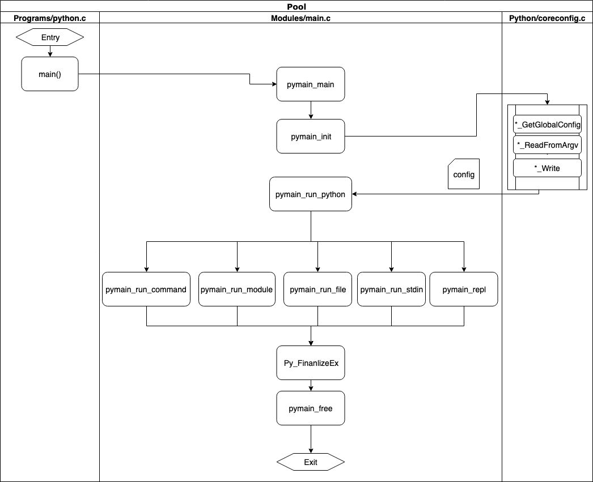
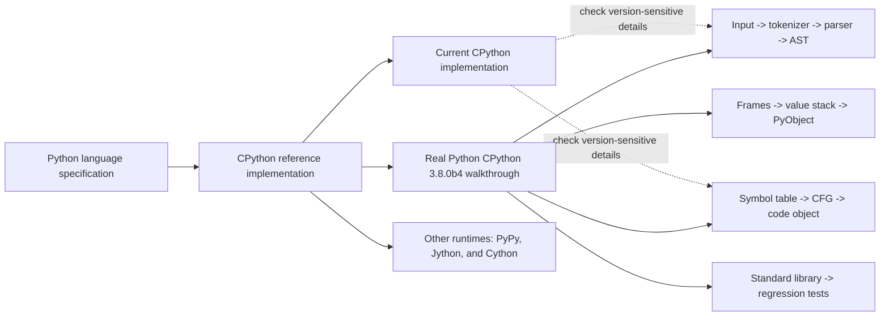

# Your Guide to the CPython Source Code

**Article:** [Your Guide to the CPython Source Code](https://realpython.com/cpython-source-code-guide/)

**Author:** Anthony Shaw

**Published:** August 21, 2019; the walkthrough targets CPython 3.8.0b4.

**Related pages:** [Python hub](./index.md) · [Python Execution Model](./execution-model.md) · [Python Import System](./import-system.md)

**Capture note:** The live article was rendered in the integrated browser on 2026-09-09. Its exported DOM was saved as the immutable HTML revision cited above and passed through the repository extractor. Direct HTTP and headless Chromium capture both returned access errors in this environment, so the metadata records `renderer: local-html` and does not claim an HTTP status.

> **Evidence:** This page summarizes the captured article and marks historical implementation details as version-scoped. The worked trace and Landscape are compact interpretations of the article's examples, not a current CPython code audit.

## TL;DR

**What:** The article is a guided map from the CPython source tree to the runtime path that turns Python text into executable behavior.

**How:** A command selects a runtime mode, the tokenizer and parser build syntax structures, the compiler turns the AST into a code object, and the evaluation loop runs that code in frames over Python objects.

**The boundary:** Its source links and file names describe CPython 3.8.0b4, so use it to learn the durable boundaries between stages and re-check implementation details against current CPython before modifying the interpreter.

## The Big Picture



*Source: the original runtime swim-lane figure in the [captured Real Python article](https://realpython.com/cpython-source-code-guide/). 1. The executable establishes `PyConfig` and chooses an input mode. 2. The selected command, module, file, standard input, or REPL text enters the parser. 3. Compilation produces a code object. 4. The evaluation loop executes it in a frame and returns or raises.*

The article's five parts are best remembered as one pipeline rather than five separate tutorials:

```text
source text -> tokens -> concrete syntax tree -> AST -> symbol table/CFG
            -> code object and wordcode -> frames/value stack -> PyObject results
```

## Why This Exists

At the Python level, this program looks like one small request:

```python
def doubled(values):
    for value in values:
        yield value * 2

print(next(doubled([10, 20])))
```

But changing or debugging CPython requires answering several different questions: which command-line path accepted the input, where `yield` became an AST node, how the compiler marked the function as a generator, which frame was suspended, and how the resulting integer became a printable object. Without those boundaries, it is easy to search the huge source tree by surface syntax and miss the component that actually decides the behavior.

The article exists as a guided route through those boundaries. It begins with a buildable source checkout, follows a command into configuration and parsing, then uses bytecode, frames, object layouts, and the test suite to connect the user-visible language back to C and Python implementation files.

## The Landscape

The editable source for this cross-version map is [cpython-source-landscape.mmd](assets/cpython-source-landscape.mmd).



The Python language specification is the parent contract; CPython is one reference implementation, not the only runtime. The article is a snapshot of one CPython generation, while current CPython is the sibling revision to consult when a file layout, parser, opcode, or frame structure matters.

## The Core Idea

CPython is a distribution assembled around a runtime, not just a compiler. Startup chooses an execution mode and establishes configuration; parsing turns text into structure; compilation turns structure into a code object; evaluation runs that object in a frame whose value stack holds `PyObject` references; and the surrounding standard library, platform modules, and regression tests make the result usable. The most useful source-reading habit is to follow one object, command, or frame across these ownership boundaries instead of treating `Python/`, `Parser/`, `Objects/`, and `Lib/` as unrelated directories.

## Symbol Map

The article uses CPython 3.8 names heavily. The table below translates those names into the role they play in the pipeline.

| Term | Role | Plain meaning |
|---|---|---|
| `PyConfig` | Startup state | Runtime flags, execution mode, environment-derived settings, and command-line options. |
| Token | Lexer output | A classified piece of source such as `NAME`, `NEWLINE`, or `NUMBER`. |
| CST | Parser output | A grammar-shaped concrete syntax tree that preserves parser details. |
| AST | Compiler input | A higher-level tree of statements and expressions that is easier to compile. |
| Symbol table | Scope analysis | The compiler's record of names, namespaces, locals, globals, cells, and free variables. |
| CFG | Control-flow plan | Basic blocks and jumps representing the possible execution paths. |
| Code object | Executable description | Compiled wordcode plus constants, names, variables, flags, and metadata. |
| Frame | Execution context | Arguments, locals, globals, the instruction position, and the value stack for one execution. |
| `PyObject` | Runtime value | The common C-level object representation from which built-in values are organized. |
| `PyTypeObject` | Behavior table | Type metadata and function slots used to implement operations such as representation and numeric behavior. |
| `PyArena` | Temporary allocation owner | A CPython 3.8 memory-management structure used while parsing and compiling. |
| Generator object | Suspended computation | An object that owns a code object and a resumable frame so `yield` can pause and continue later. |

## Deep Dive

### 1. Startup turns a command into a runtime mode

**What it does:** The executable gathers platform state, environment variables, and command-line flags before Python source is executed.

**Why it matters:** The same interpreter can run `-c`, `-m`, a filename, standard input, or an interactive REPL, and each entry route determines which source-reading function is called next.

**How it works:** In the article's CPython 3.8 map, `Programs/python.c` is a small entry point, `Modules/main.c` coordinates the run, and `Python/initconfig.c` builds the `PyConfig` state. The source tree also separates Python standard-library modules under `Lib/`, C extension modules under `Modules/`, core object types under `Objects/`, parser code under `Parser/`, and interpreter machinery under `Python/`. The build instructions then produce a debug interpreter that can be inspected and tested.

**The intuition:** `python` first decides what kind of request it received; it does not immediately execute the first line of source.

**A concrete example:** For the worked program, `python -c` selects command mode and routes the string toward `PyRun_SimpleStringFlags()` in the article's revision. The `doubled()` body has not yet become a frame.

**Remember:** Find the selected input mode before following parser or compiler code.

### 2. Source text becomes an AST

**What it does:** The tokenizer and parser turn characters into grammar-shaped structures, then the AST layer removes grammar detail that the compiler does not need.

**Why it matters:** Syntax errors, grammar changes, and the meaning of constructs such as `yield` are decided before bytecode execution begins.

**How it works:** The 3.8 walkthrough describes a C tokenizer producing tokens, parser tables generated from `Grammar/Grammar`, and a concrete syntax tree assembled by the parser-tokenizer. `Python/ast.c` then converts that tree into a `Module`, `Expression`, `Interactive`, `FunctionType`, or `Suite` AST. The article also shows the `ast` module and `instaviz` as ways to inspect the resulting structure.

**The intuition:** The parser turns spelling into structure; the AST turns that structure into a compiler-friendly model.

**A concrete example:** In the worked program, `for`, `yield`, multiplication, and the call to `next()` become distinct syntax nodes. The compiler can therefore reason about the generator without repeatedly interpreting raw characters.

**Remember:** The CST is grammar detail; the AST is the semantic handoff to compilation.

### 3. The compiler produces a code object

**What it does:** The compiler turns the AST into scope information, control-flow blocks, and executable wordcode stored in a code object.

**Why it matters:** The source-level function is not what the evaluation loop executes; it executes the compiled representation and its metadata.

**How it works:** `PyAST_CompileObject()` combines compiler flags and `__future__` features, builds a symbol table, visits the AST, creates a control-flow graph, resolves jumps, and assembles a `PyCodeObject`. The code object contains constants, names, local variables, cell and free variables, flags, and the instruction sequence. The article uses `compile()` and `dis` to expose this boundary. In the 3.8 storage model, the article notes that the instruction format is technically wordcode even though it is commonly called bytecode.

**The intuition:** Compilation compresses a tree of possibilities into a small instruction plan plus the tables needed to interpret it.

**A concrete example:** The presence of `yield` marks `doubled()` as a generator in the code object's flags. Its loop becomes jumps and iteration operations, while `value * 2` becomes a sequence of loads and a numeric operation.

**Remember:** Inspect `compile()` and `dis` when you need to connect Python syntax to executable operations.

### 4. Frames and the value stack execute the plan

**What it does:** The evaluation loop creates a frame, binds arguments and locals, and dispatches instructions over a value stack of object references.

**Why it matters:** Runtime behavior such as call stacks, local-variable errors, tracing, and suspension lives here rather than in the parser.

**How it works:** The article follows `run_eval_code_obj()` into `PyEval_EvalCode()` and then the default frame evaluator in `Python/ceval.c`. A frame carries code, globals, locals, argument values, instruction position, and stack state. Operations such as `LOAD_FAST` copy a local reference onto the value stack; list operations pop or peek references; a nested call creates another frame linked through `f_back`. The current thread state points at the active frame and carries exception state.

**The intuition:** A code object is a recipe; a frame is the running copy of that recipe with live values on its stack.

**A concrete example:** `doubled([10, 20])` creates a generator object with a ready frame instead of running the loop to completion. `next()` resumes that frame, loads `value`, computes `value * 2`, and pauses again at `yield`.

**Remember:** Read the frame and value-stack state when a bug appears to be about execution order or call nesting.

### 5. Objects carry behavior, memory, and suspension

**What it does:** CPython represents values as `PyObject` instances whose type metadata supplies operations, while reference counting and cyclic garbage collection manage their lifetime.

**Why it matters:** A Python integer, list, frame, and generator all cross the C boundary as objects, so object ownership explains both performance-sensitive code and memory behavior.

**How it works:** The article describes a common object header, a `PyTypeObject` with slots such as `tp_repr`, and specialized implementations such as booleans and variable-length integers. `Py_INCREF()` and `Py_DECREF()` update reference counts; the cyclic collector handles reference cycles periodically. A generator stores a code object and persistent frame, tracks whether it is running, and resumes through its `__next__()` path until it yields or raises `StopIteration`.

**The intuition:** Python values are not just data; each value carries a type-defined behavior table and a lifetime managed by the runtime.

**A concrete example:** The list `[10, 20]`, the integer `2`, the product `20`, the generator's suspended frame, and the `StopIteration` signal are all different runtime objects or states participating in one call. The generator preserves its local iteration state between `next()` calls instead of allocating a completed list of results.

**Remember:** A generator is a resumable frame wrapped in an object, not a function that secretly returns a list.

### 6. The standard library and tests complete the distribution

**What it does:** CPython combines pure-Python modules, C-backed modules, platform adapters, and a regression suite around the interpreter.

**Why it matters:** Understanding only `ceval.c` does not explain how `print`, imports, operating-system APIs, or interpreter changes become a usable Python distribution.

**How it works:** The article places pure-Python modules in `Lib/`, C-backed standard-library components in `Modules/` and selected files under `Python/`, and platform-specific branches behind conditional compilation. It presents `Lib/test` as the regression suite and shows the compiled interpreter running `python -m test -j2`, with platform-specific launch details.

**The intuition:** The interpreter is the engine, but the distribution is the engine plus its batteries, adapters, and tests.

**A concrete example:** After the generator yields `20`, the built-in `print()` path formats and writes the resulting object. A CPython change is not finished when this one example works; the relevant regression tests still need to pass.

**Remember:** Use the standard library and test suite as evidence that a source change works across the public distribution, not only in one REPL example.

## Putting It Together

The following trace keeps the worked program fixed and follows the article's CPython 3.8.0b4 boundaries.

| Step | Actor | Input state | Action | Output state |
|---:|---|---|---|---|
| 1 | `Programs/python.c` and `Modules/main.c` | Shell command containing `-c` and source text | Establish runtime configuration and select command mode. | The command is ready for the source execution path. |
| 2 | `Python/pythonrun.c` and parser/tokenizer | Source text defining `doubled()` and `print(next(...))` | Tokenize, parse, and build a concrete syntax tree, then an AST. | Structured nodes represent the loop, `yield`, multiplication, call, and print. |
| 3 | Compiler and symbol-table machinery | AST plus runtime and future flags | Resolve names, build control-flow blocks, and assemble code objects. | The module and generator function have executable instruction sequences and metadata. |
| 4 | Frame construction | Module code object and global/local dictionaries | Create the module frame and execute its top-level call to `doubled()`. | A generator object owns a suspended frame; the generator body has not completed. |
| 5 | Evaluation loop | Generator object plus its ready frame | `next()` resumes the frame, loads `value`, multiplies by `2`, and reaches `yield`. | The integer `20` returns to the caller while the frame keeps its position and locals. |
| 6 | Object and output machinery | Integer object `20` and the `print()` call | Dispatch type behavior, write the value, and maintain references as objects leave scope. | The program prints `20`; another `next()` would resume at the next iteration. |
| 7 | Regression suite | A changed interpreter or library component | Run the relevant tests, then the broader `Lib/test` suite using the compiled interpreter. | Confidence moves from one example to distribution-level behavior. |

This trace is a teaching synthesis. It preserves the source article's boundaries while avoiding the claim that every named C function or struct is unchanged in current CPython.

## What This Buys You

### The headline claim

The article turns CPython source reading from a directory hunt into a staged investigation: identify the entry mode, follow the data representation as it becomes more structured, then inspect the runtime object that carries execution.

### How we know: article coverage

| Article part | Reader question answered |
|---|---|
| Introduction to CPython | What is in the source tree, how is it built, and where do the language grammar and memory systems live? |
| Python interpreter process | How does `python` choose an input and turn text into a parse tree and AST? |
| Compiler and execution loop | How do scope analysis, control flow, code objects, frames, and opcodes connect? |
| Objects in CPython | How do types, reference counts, garbage collection, and generators implement Python values? |
| Standard library | How do Python modules, C modules, platform adapters, and tests complete the distribution? |

### The mechanism behind the value

There is no benchmark table or new performance result in this article. Its value is navigational: each source boundary gives a next file, API, or introspection tool to inspect. That makes it especially useful before a deeper code reading, but it also means the page should not be cited as evidence that a particular current opcode, parser, or allocator still has the same name.

> **Warning:** The article's implementation claims are anchored to CPython 3.8.0b4. Current CPython changed important parser, compiler, frame, and interpreter details after that release.

## Where It Breaks

| Failure mode | When it happens | Impact |
|---|---|---|
| Version drift | You apply the article's file paths or C signatures to a current checkout. | A useful conceptual map can lead you to stale symbols or the wrong ownership boundary. |
| Parser mismatch | You expect the 3.8 `pgen` and grammar-table path to describe newer CPython releases. | Parser implementation details and generated files no longer line up with the guide. |
| Opcode mismatch | You compare `dis` output or the article's wordcode examples across Python versions. | Instruction names, operands, and optimization behavior can differ. |
| Frame mismatch | You assume the 3.8 `PyFrameObject` layout is a stable public ABI. | Debugging or embedding code may depend on internals that have moved or changed. |
| Build recipe drift | You follow the article's package lists, Visual Studio steps, or `make` commands unchanged. | Dependencies, supported platforms, and build entry points may be different today. |
| Runtime overgeneralization | You treat CPython's reference-counting and C implementation as rules of the Python language. | Code that relies on implementation details may fail on PyPy, Jython, or a future CPython design. |
| Single-example confidence | The worked generator prints the expected value. | One successful trace does not replace the regression suite or platform-specific tests. |

## One Thing to Remember

**Follow the representation, not the filename.** In the article's CPython 3.8 map, a command becomes configured input, then tokens and an AST, then a code object, then a live frame executing over `PyObject` values; the standard library and tests are the surrounding evidence that this pipeline behaves like Python. The file names are a historical index into that story, not the story's permanent API.

## Go Deeper

- **Read:** [Your Guide to the CPython Source Code](https://realpython.com/cpython-source-code-guide/)
- **Understand current language behavior:** [Python Execution Model](./execution-model.md)
- **Understand module loading:** [Python Import System](./import-system.md)
- **Compare runtimes:** [CPython source repository](https://github.com/python/cpython) and the article's links to PyPy and Jython.
- **Reproduce the introspection:** Use `compile()`, `ast.parse()`, `symtable.symtable()`, `dis.dis()`, `sys._getframe()`, and `gc` on a local Python version; compare the output with the article only after recording that version.
