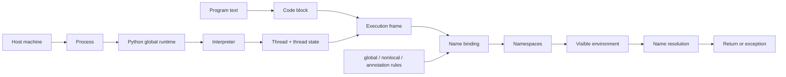

# Python Execution Model: Code Blocks, Scopes, and Runtime State

**Source:** [Python 3.14.7 documentation: Execution model](https://docs.python.org/3.14/reference/executionmodel.html), captured on 2026-09-09.

**Capture note:** The verified HTML response was supplied to the repository extractor through its local-input path because the environment's Chromium and HTTP capture paths were unavailable. The metadata sidecar therefore records no HTTP status or response headers.

**Scope:** This page turns the reference chapter into a runtime mental model. It focuses on code blocks, execution frames, name binding and resolution, annotation scopes, exception flow, and the host/process/interpreter/thread layers around Python execution.

**Related pages:** [Python hub](./index.md) · [Python Import System](./import-system.md) · [Frameworks](../index.md)

> **Evidence:** The source directly defines the language-level rules and the conceptual runtime layers. The debugging advice and the landscape below are compact interpretations of those rules.

## TL;DR

**What:** Python runs pieces of program text as code blocks inside execution frames, while names bind to objects in namespaces.

**How:** A block's binding operations determine local, global, free, and nonlocal names; lookup then follows the visible environment, with class and annotation scopes applying special rules.

**The boundary:** The language model describes blocks, frames, namespaces, and exceptions, while the runtime model adds process, interpreter, and thread state that controls what can be shared or must be coordinated.

## The Big Picture

The reader question is: **when Python runs one function or statement, what state decides its behavior?**

| Stage | Acting concept | Input | Result |
|---:|---|---|---|
| 1 | Code block | Module, function body, class body, interactive command, script, `-c`, `-m`, `eval()`, or `exec()` text | A unit of Python program text ready to run. |
| 2 | Execution frame | Code block plus the current runtime context | Administrative state and the point where execution continues. |
| 3 | Binding rules | Assignments, definitions, parameters, imports, `global`, and `nonlocal` | Names are classified as local, global, free, or redirected to an enclosing function. |
| 4 | Namespace environment | Current block and its visible enclosing scopes | A name resolves to an object, or Python raises `NameError` or `UnboundLocalError`. |
| 5 | Control flow | A returned value or raised exception | The block completes normally, transfers control to a handler, or terminates outward. |
| 6 | Runtime layers | Host, process, Python runtime, interpreter, thread, and thread state | Resources and execution state are shared or isolated according to their layer. |

The compact mental model is **block -> frame -> bind -> resolve -> continue or raise**. The surrounding runtime hierarchy explains who owns the state while that sequence is happening.

## Why This Exists

Python has no separate declaration pass that tells a function which names will be local. A binding anywhere in a block affects every use of that name in the block:

```python
total = 10

def report():
    print(total)
    total += 1
```

This raises `UnboundLocalError`, not because the module-level `total` is absent, but because the later augmented assignment makes `total` local throughout `report()`. The fix is a deliberate scope choice such as `global total`, a parameter, or a value passed through an enclosing function and declared `nonlocal` where mutation is intended.

Class bodies create another surprising boundary:

```python
class Report:
    limit = 3
    values = [limit + index for index in range(3)]
```

The class namespace becomes the class's attribute dictionary, but the class scope does not become the lexical enclosing scope of the comprehension. Annotation scopes introduced for type-related syntax are a deliberate exception and can access an immediately enclosing class namespace.

## The Landscape

The editable source for this conceptual map is [execution-model-landscape.mmd](assets/execution-model-landscape.mmd).



*Synthesized landscape from the captured Python reference. The upper path describes language execution; the lower path describes the runtime layers that carry the state in which frames run.*

## The Core Idea

Python execution is two coupled stories. A code block runs in a frame that carries the current execution state, while its names are bound into namespaces and resolved through the block's environment. `global`, `nonlocal`, class blocks, and annotation scopes change the normal path deliberately. Around all of this, a process owns resources, an interpreter owns Python runtime state such as `sys.modules`, and thread states own call stacks and current exceptions. Most confusing behavior comes from mixing these stories: treating a class dictionary as a closure, treating a delayed annotation as eager code, or treating thread-shared process state as private.

## Concept Map

| Concept | Role | Plain meaning |
|---|---|---|
| Code block | Unit of execution | A module, function body, class body, interactive command, script, `-c` command, `-m` module, or string passed to `eval()` or `exec()`. |
| Execution frame | Control context | Administrative information plus the state that determines where execution continues. |
| Name | Reference to an object | A label introduced by a binding operation rather than a container that owns the object. |
| Namespace | Name-to-object mapping | The collection in which a block's names are stored, such as a module dictionary or class attribute dictionary. |
| Local variable | Block-owned binding | A name bound in the current function, class, or module block unless redirected by a declaration. |
| Free variable | Enclosing binding | A name used by a block but defined in an enclosing scope. |
| Environment | Visible scopes | The set of scopes a block can search when resolving a name. |
| Annotation scope | Type-related scope | A mostly function-like scope used by annotations, type parameters, and `type` statements, with special access to an enclosing class. |
| `global` | Module-level redirection | A declaration that makes listed names refer to the module's global namespace and then the builtins namespace for lookup. |
| `nonlocal` | Enclosing-function redirection | A declaration that targets a previously bound name in the nearest enclosing function scope. |
| Termination model | Exception behavior | An exception leaves the failing operation and can be handled outward, but the handler does not automatically repair and retry that operation. |
| Interpreter | Runtime boundary | An isolated Python runtime context that persists between uses and owns state such as `sys.modules`. |
| Thread state | Thread-specific runtime state | The current exception and Python call stack associated with one interpreter and one host thread. |

## Deep Dive

### 1. Code blocks become execution frames

**What it does:** Python treats several kinds of program text as independently executable code blocks and runs each block in an execution frame.

**Why it matters:** The phrase "this code runs" is incomplete until the block and its frame are identified; a module, class body, function body, and `exec()` string do not create the same names or scope boundaries.

**How it works:** A module, function body, class definition, interactive command, script file, `-c` command, module launched with `-m`, and string passed to `eval()` or `exec()` are all code blocks. The frame contains administrative information used for debugging and determines how execution continues after the block finishes.

**The intuition:** A code block is the script of a scene; an execution frame is the stage state that lets the interpreter resume, return, or report where the scene failed.

**A concrete example:** The file containing `def make_reader(): ...` runs first as a module block. Calling `make_reader()` then runs its function body in a new frame, and calling the returned function runs another function block in another frame.

**Remember:** A function definition creates a callable object, but its body becomes active only when a call creates a frame for it.

### 2. Binding operations decide local scope

**What it does:** Python classifies a name as local to a block when a binding operation for that name occurs anywhere in the block, unless a declaration redirects it.

**Why it matters:** The classification happens before the line that appears to use the name, which explains many `UnboundLocalError` reports that look like failed global lookups.

**How it works:** Parameters, function and class definitions, assignments, assignment expressions, loop targets, `with` and `except` aliases, pattern captures, imports, `type` statements, and type parameter lists bind names. A `del` target is also treated as bound for this scope analysis even though it unbinds the name at runtime. A name bound in a function is local unless `global` or `nonlocal` says otherwise; module names are both local to the module block and global to that module.

**The intuition:** Python reads the block's binding shape before it runs the block's individual lines.

**A concrete example:** In `report()`, `total += 1` contains a binding operation, so the earlier `print(total)` reads the function's local `total` before that local has a value.

**Remember:** Binding later in a block can change the meaning of an earlier read.

### 3. Declarations redirect name resolution

**What it does:** `global` and `nonlocal` make an intentional escape from the current block's default local binding rule.

**Why it matters:** They define whether an assignment changes module state or a closed-over function variable, and they impose ordering and existence constraints.

**How it works:** `global name` makes uses and bindings refer to the top-level namespace of the module containing the block; lookup then checks that global namespace and the builtins namespace. `nonlocal name` targets a previously bound name in the nearest enclosing function scope. Python raises `SyntaxError` when `nonlocal` cannot find such a binding, and the `global` or `nonlocal` declaration must precede the relevant uses in the block.

**The intuition:** `global` points outward to the module; `nonlocal` points outward only to the nearest function closure.

**A concrete example:** A counter factory can keep its state in `outer()` and let `inner()` update it with `nonlocal count`, without making `count` a module global.

**Remember:** Use `nonlocal` for an enclosing function binding and `global` for the containing module binding; neither means "search everywhere."

### 4. Name lookup follows the visible environment

**What it does:** Python resolves a name by searching the nearest enclosing scopes visible to the current block and raises a specific error when the search fails.

**Why it matters:** The distinction between a missing name and an uninitialized local tells you whether the problem is lookup reachability or the current block's binding classification.

**How it works:** A scope is the region where a local variable is visible. The environment is the set of scopes visible to a block. Free-variable resolution happens at runtime, so a function can observe a later reassignment in an enclosing scope before the function is called. If no binding is found, Python raises `NameError`; if a function-local name has been classified as local but has not yet been bound, it raises `UnboundLocalError`, a subclass of `NameError`.

**The intuition:** Lookup walks the environment that the current block can see, not the source file as one undifferentiated dictionary.

**A concrete example:**

```python
value = "module"

def outer():
    value = "outer"

    def inner():
        return value

    return inner()

assert outer() == "outer"
```

`inner()` finds `value` in the nearest enclosing function scope, before it would need to consider the module or builtins namespaces.

**Remember:** `NameError` means no visible binding was found; `UnboundLocalError` means the current function claimed the name but had not bound it yet.

### 5. Class namespaces do not become method closures

**What it does:** A class definition executes as a block whose namespace becomes the class's attribute dictionary, but that class scope does not lexically enclose method bodies or comprehensions in the usual way.

**Why it matters:** Reading `Class.attribute` or `self.attribute` is not equivalent to reading a free variable from a surrounding function.

**How it works:** The class body may use and define names, and the resulting namespace becomes the class's attributes. The scope of those names is limited to the class block; it does not extend to methods, comprehensions, or generator expressions in the same way an enclosing function scope does. A method therefore normally reaches class state through the class or instance object.

**The intuition:** A class body builds an attribute dictionary; it does not create a lexical backpack that every method carries.

**A concrete example:** In `Report`, the name `limit` is available while the class body runs, but a method should use `Report.limit` or `self.limit`, and a comprehension in the class body cannot rely on `limit` as an enclosing function variable.

**Remember:** Class attributes are object attributes first; they are not automatically closure variables for methods.

### 6. Annotation scopes are a deliberate exception

**What it does:** Annotations, type parameter lists, and `type` statements execute in mostly function-like annotation scopes with special access to an immediately enclosing class namespace.

**Why it matters:** Python 3.14's typing syntax can refer to class-local names in places where a normal method or comprehension cannot.

**How it works:** Annotation scopes were introduced in Python 3.12, expanded to type-parameter defaults in 3.13, and are used for annotations under PEP 649 and PEP 749 in 3.14. They can see names in an enclosing class, cannot contain `yield`, `yield from`, `await`, or assignment expressions, and do not expose their internal scope in the qualified name of objects defined within them.

**The intuition:** Annotation scopes are a narrow bridge from type syntax into class context, not a general change to how methods close over class variables.

**A concrete example:**

```python
class A:
    type Alias = Nested

    class Nested:
        pass

print(A.Alias.__value__)  # A.Nested
```

The type alias can refer to `Nested` through the enclosing class namespace.

**Remember:** The class-access rule belongs to annotation scopes, not to ordinary function scopes nested in a class.

### 7. Many annotation values are lazy

**What it does:** Python delays evaluation of most annotations, type-alias values, and type-variable bounds, constraints, and defaults until their values are needed.

**Why it matters:** Defining a type alias or annotated object can succeed even when evaluating its expression would later fail or refer to a type defined afterward.

**How it works:** The expression is stored in a lazily evaluated form. Accessing a value such as a type alias's `__value__` or a type variable's `__bound__` triggers evaluation in the surrounding scope. This supports mutually recursive type aliases, but it also moves errors from definition time to access time.

**The intuition:** Type syntax can leave a note for later instead of immediately running the expression that produces the note's value.

**A concrete example:**

```python
type Alias = 1 / 0

# Creating Alias succeeds.
Alias.__value__  # Raises ZeroDivisionError when evaluated.
```

**Remember:** A successful definition does not prove that a lazy annotation or type value can be evaluated successfully.

### 8. Dynamic execution gets an explicit environment

**What it does:** `eval()` and `exec()` can run code with caller-provided global and local namespaces, but they do not automatically receive every enclosing lexical binding.

**Why it matters:** Dynamic code can observe a different environment from ordinary nested Python code, especially when free variables are involved.

**How it works:** Without overrides, `eval()` and `exec()` may use the caller's local and global namespaces. If one namespace is supplied, it is used for both; if both are supplied, they are separate roles. Free variables are not resolved through the nearest enclosing namespace in the full closure sense, so dynamic code that depends on a particular environment should receive explicit mappings.

**The intuition:** `eval()` and `exec()` are guests that need a room key; lexical access is not automatically the same as handing them the caller's whole environment.

**A concrete example:** A configuration engine should pass a deliberately constructed `globals` and `locals` mapping to `eval()` instead of assuming that a nested function's closure is the dynamic expression's complete environment.

**Remember:** Dynamic code is governed by the namespaces you provide, not by an assumption that it can see every surrounding scope.

### 9. Exceptions use a termination model

**What it does:** An exception breaks normal control flow and transfers execution to a matching handler in the current or an outer code block.

**Why it matters:** A handler can inspect the failure and continue elsewhere, but it does not automatically rewind the failed operation to a clean pre-error state.

**How it works:** The interpreter or a program raises an exception at the point where an error is detected. `try` and `except` select a handler, while `finally` runs cleanup whether or not an exception occurred. If no handler catches the exception, the interpreter terminates the program or returns to the interactive loop and prints a traceback, except for `SystemExit`.

**The intuition:** An exception is an exit route from the current operation, not a transaction rollback button.

**A concrete example:** If a file-processing block mutates a list and then raises, an outer handler can catch the exception, but it must explicitly undo the list mutation or restart the operation from a known state.

**Remember:** `finally` guarantees cleanup code gets a chance to run; it does not make the failed block atomic.

### 10. Runtime layers determine what is shared

**What it does:** Python places language execution inside a hierarchy of host, process, global runtime, interpreter, thread, and thread-state layers.

**Why it matters:** Bugs involving concurrency, imports, signals, or mutable state often come from assigning data to the wrong ownership layer.

**How it works:** A process owns resources such as memory, file handles, sockets, signals, and environment variables. The Python runtime contains interpreters; each interpreter encapsulates persistent Python state such as `sys.modules` and may be isolated from other interpreters in the same process. Each interpreter manages thread states, which contain thread-specific data such as the current exception and Python call stack. A program begins with one thread from Python's point of view and can add threads, processes, interpreters, or coroutines later.

**The intuition:** Process resources are the building, interpreter state is one tenant's runtime, and thread state is the desk where one execution path is currently working.

**A concrete example:** Two threads in one interpreter can access the same interpreter-owned objects and therefore must coordinate shared mutable data. Two interpreters in one process have separate `sys.modules` mappings, so importing a module in one does not imply that the other has imported it.

**Remember:** Threads share process and interpreter resources; thread states and separate interpreters provide different kinds of isolation.

## Putting It Together

This trace follows one object, the string returned by `reader()`, from module execution through nested name resolution:

```python
label = "module"

def make_reader():
    label = "function"

    def reader():
        return label

    return reader

reader = make_reader()
result = reader()
```

| Step | Actor | Input state | Action | Output state |
|---:|---|---|---|---|
| 1 | Module block | Source text and the module namespace | Executes the top-level code block and binds `label` to `"module"` and `make_reader` to a function object. | The module namespace contains both names. |
| 2 | `make_reader()` frame | The function object and the module environment | Starts the function-body block in a new frame and binds a new local `label` to `"function"`. | The call frame has its own `label`, distinct from the module binding. |
| 3 | Nested function definition | The `make_reader()` frame | Creates `reader` while its body is not yet running; the nested body can resolve a free `label` through the enclosing function environment. | `make_reader()` returns a callable with access to the enclosing binding. |
| 4 | Assignment in the module block | Returned callable | Binds the callable to the module-level name `reader`. | The module can call `reader()` later. |
| 5 | `reader()` frame | Nested function body and its environment | Runs `return label`; lookup finds the enclosing function's `label` before the module's `label`. | The result is the string `"function"`. |
| 6 | Module block resumes | Returned string | Binds `result` to the returned object. | `result == "function"`; no class lookup or global declaration was needed. |

The host process, interpreter, and thread state surround every step. If `reader()` raised instead, the exception would move outward through these frames until a matching handler or the program boundary handled it.

## What This Buys You

### A debugging map

| Symptom | Controlling rule | First thing to inspect |
|---|---|---|
| `UnboundLocalError` before an assignment | Any binding in the function makes the name local | Search the whole block for assignments, imports, parameters, or aliases. |
| `NameError` in a method for a class attribute | Class scope is not the method's enclosing function scope | Use `self.attribute` or `Class.attribute`, and inspect the method's actual environment. |
| A type expression fails only when inspected | Most annotation values are lazy | Identify the access that triggers `__value__`, `__bound__`, or another deferred evaluation. |
| `eval()` cannot see an expected variable | Dynamic evaluation received a different namespace from ordinary lexical lookup | Pass explicit global and local mappings and audit free-variable assumptions. |
| A caught exception leaves changed state | Exception handling follows termination, not rollback | Put cleanup in `finally` and make mutation/retry behavior explicit. |
| Two threads interfere with one another | Threads share process and interpreter resources | Coordinate access to shared data and distinguish thread state from interpreter state. |
| An import is present in one interpreter but missing in another | Interpreter state is isolated, including `sys.modules` | Check which interpreter owns the code and module cache. |

### A design checklist

The model gives practical defaults: pass state as arguments when possible, declare `global` or `nonlocal` only when the ownership change is intentional, access class state through objects, treat annotation evaluation as potentially deferred, provide explicit environments to dynamic code, and synchronize mutable state shared by threads.

## Where It Breaks

| Failure mode | When it happens | Impact |
|---|---|---|
| Binding-order surprise | A name is read before a later binding in the same function block | The read raises `UnboundLocalError` instead of using an outer binding. |
| Class-scope assumption | A method or comprehension expects to close over a class-body name | The lookup misses the class namespace and can raise `NameError`. |
| Invalid `nonlocal` target | No enclosing function has already bound the declared name | Python raises `SyntaxError` while compiling the block. |
| Declaration-order error | A `global` or `nonlocal` declaration follows a relevant use | Python rejects the block instead of applying the declaration retroactively. |
| Deferred type failure | A lazy annotation, alias, or type-variable value is accessed | The error appears later than the definition site. |
| Dynamic-environment mismatch | `eval()` or `exec()` receives incomplete or unintended mappings | Code sees missing names, unexpected globals, or overly broad authority. |
| Shared-state race | Threads access shared process or interpreter resources without coordination | Results can be nondeterministic or data can become inconsistent. |
| Retry assumption | An outer handler catches an exception and assumes the failed operation rolled back | Partial mutations or external side effects remain unless cleanup is explicit. |

## One Thing to Remember

Remember **frames run blocks, namespaces bind names, environments resolve names, and runtime layers own state**. Once you identify the current block, its frame, the binding rule for each name, and the interpreter or thread that owns the surrounding state, Python's most confusing scope, annotation, exception, and concurrency behavior becomes a local rule instead of magic.

## Go Deeper

- **Read:** [Python 3.14.7 reference chapter: Execution model](https://docs.python.org/3.14/reference/executionmodel.html)
- **Understand imports:** [Python Import System: Cache, Finders, Loaders, and Module Specs](./import-system.md)
- **Understand declarations:** [The `global` statement](https://docs.python.org/3.14/reference/simple_stmts.html#the-global-statement), [the `nonlocal` statement](https://docs.python.org/3.14/reference/simple_stmts.html#the-nonlocal-statement), and [the `type` statement](https://docs.python.org/3.14/reference/simple_stmts.html#the-type-statement)
- **Understand the 3.14 changes:** [PEP 649](https://peps.python.org/pep-0649/) and [PEP 749](https://peps.python.org/pep-0749/)
- **Explore runtime boundaries:** [`threading`](https://docs.python.org/3.14/library/threading.html), [`concurrent.interpreters`](https://docs.python.org/3.14/library/concurrent.interpreters.html), and [`asyncio`](https://docs.python.org/3.14/library/asyncio.html)
