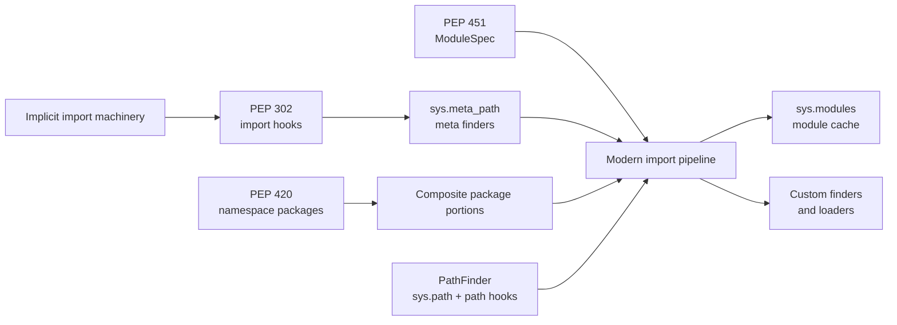

# Python Import System: Cache, Finders, Loaders, and Module Specs

**Source:** [Python 3.14.7 documentation: The import system](https://docs.python.org/3.14/reference/import.html), captured on 2026-09-09.

**Capture note:** The verified HTML response was supplied to the repository extractor through its local-input path because the environment's Node HTTP and Chromium capture paths were unavailable. The metadata sidecar therefore records no HTTP status or response headers.

**Scope:** This page turns the reference chapter into a runtime mental model. It focuses on the standard search, module creation, execution, caching, and name-binding path rather than cataloging every `importlib` API.

**Related pages:** [Python hub](./index.md) · [Frameworks](../index.md) · [vLLM-Ascend Architecture](../vllm-ascend/architecture.md) · [TileLang Design and Code Learning Path](../tilelang/index.md)

> **Evidence:** The source is the Python 3.14 reference chapter. The pipeline below is a compact synthesis of its stated protocols and pseudocode; the diagnostic guidance in "Where It Breaks" is an interpretation of those protocols.

## TL;DR

**What:** An import request searches for a fully qualified module name, creates and initializes a module object when needed, and then binds a name in the caller's scope.

**How:** Python checks `sys.modules`, asks ordered finders for a `ModuleSpec`, lets a loader create and execute the module, and publishes the module in the cache before executing its code.

**The boundary:** `import` combines search with name binding; `__import__()` and `importlib.import_module()` can invoke the machinery without performing the same caller-scope binding, while custom hooks can replace or extend discovery.

## The Big Picture

The reader question is: **what happens between `import acme.plugins.cpu` and a usable module object?**

| Stage | Acting component | Input | Result |
|---:|---|---|---|
| 1 | `import` statement | Fully qualified name `acme.plugins.cpu` | Calls the import machinery, normally through `__import__()`. |
| 2 | `sys.modules` | Requested name and parent entries | A cached module returns immediately; a cached `None` raises `ModuleNotFoundError`. |
| 3 | `sys.meta_path` | Name, parent path, optional reload target | Ordered meta path finders either return a spec, return `None`, or raise. |
| 4 | `PathFinder` when selected | `sys.path` or a package's `__path__` | Path entry hooks locate a filesystem, zip, URL, or other resource finder. |
| 5 | `ModuleSpec` | Loader, origin, package search locations, and name | Carries the import state from discovery into loading. |
| 6 | Import machinery and loader | The spec and a new or loader-created module | Sets import attributes, registers the module early, and runs `exec_module()`. |
| 7 | Parent package and caller scope | Loaded child module | Sets the child as an attribute on its parent; the import statement performs its own name binding. |

The important ordering is **cache -> find -> spec -> create -> register -> execute -> bind**. The early cache insertion is what prevents recursive imports from creating unbounded duplicate module objects. It also explains why a failed import removes the failing module entry but does not undo every side effect caused by code that already ran.

## Why This Exists

`import acme.plugins.cpu` looks like one filesystem lookup, but a real application may combine built-in modules, frozen modules, ordinary source files, zip archives, namespace packages, generated modules, and custom import hooks. When an import fails, the useful question is not only "does the file exist?" but also "which cache, finder, path, spec, loader, or binding phase decided the outcome?"

Consider an application with `/srv/app` and a plugin directory on `sys.path`. The first request for `acme.plugins.cpu` must resolve `acme`, then `acme.plugins`, then `acme.plugins.cpu`. A later request should use the three corresponding `sys.modules` entries instead of repeating discovery. If a plugin loader raises while executing `cpu.py`, Python removes `acme.plugins.cpu` from the cache, but keeps successfully imported parents and side-effect modules. That behavior supports retries without pretending that arbitrary application side effects are transactional.

## The Landscape

The editable source for this synthesis is [landscape.mmd](assets/landscape.mmd).

*Synthesized landscape from the captured Python reference: PEP 302 exposed import hooks, PEP 420 added native namespace packages, and PEP 451 moved per-module import state into `ModuleSpec` objects. The modern pipeline combines those ideas with the default path finder and remains open to custom finders and loaders.*

## The Core Idea

Python import is a protocol, not a filename lookup. A cache answers the cheap case first; finders decide whether a name is knowable; a spec records how it should be loaded; a loader creates or executes the module; and the import statement finally binds a name for the caller. Once those boundaries are clear, `sys.meta_path`, `sys.path_hooks`, namespace packages, and plugin systems become variations on one pipeline rather than unrelated tricks.

## Concept Map

| Concept | Role | Plain meaning |
|---|---|---|
| Module | Runtime object | The single kind of object Python uses for Python, built-in, frozen, and extension modules. |
| Package | Module with `__path__` | A module that provides locations where submodules can be found. |
| Regular package | Traditional package | Usually a directory with `__init__.py`, which executes when the package is imported. |
| Namespace package | Composite package | A package assembled from portions that may live in multiple locations and need no `__init__.py`. |
| `sys.modules` | Module cache | A writable mapping from fully qualified names to module objects or the sentinel `None`. |
| Finder | Discovery object | Decides whether it can locate a name and returns a `ModuleSpec` when it can. |
| Loader | Execution object | Creates a module optionally and executes its code through `exec_module()`. |
| `ModuleSpec` | Import-state record | Carries a module's name, loader, origin, and package search locations between discovery and loading. |
| `sys.meta_path` | Early hook chain | Ordered meta finders consulted after the cache and before normal path processing. |
| `sys.path` | Top-level search path | String locations searched for top-level modules, including directories and zip files. |
| `package.__path__` | Package search path | Locations searched for that package's submodules. |
| `sys.path_hooks` | Path-entry hook chain | Callables that turn a path entry into a path entry finder or raise `ImportError` when they cannot handle it. |
| `__main__.__spec__` | Entry-point metadata | The spec for `__main__` when launched with `-m` or from an importable directory/zip; it is `None` for several direct-launch modes. |

## Deep Dive

### 1. Import has two operations: search and binding

**What it does:** The import statement first obtains a module through the import machinery and then binds names according to the statement's syntax.

**Why it matters:** A direct call to `__import__()` performs module search and creation but does not perform the caller-scope name binding that the `import` statement performs.

**How it works:** `importlib.import_module()` is the recommended high-level API for importing a named module programmatically. The ordinary `import` statement normally calls `__import__()` and then applies its own binding rules. For a dotted import, Python resolves the parent chain one component at a time. `import acme.plugins.cpu` normally leaves `acme` bound in the local scope, while the loaded child is available through the parent attributes.

**The intuition:** Importing obtains an object; the statement decides which names your code can use to reach it.

**A concrete example:** A plugin manager can call `importlib.import_module("acme.plugins.cpu")` and retain the returned module object without asking Python to create a local variable named `acme`.

**Remember:** Search and name binding are related, but they are not the same operation.

### 2. `sys.modules` is the first decision point

**What it does:** It prevents repeated discovery and execution for a name that has already been imported.

**Why it matters:** The cache is both a performance mechanism and a correctness mechanism. Without it, repeated imports could re-execute module top-level code and create incompatible duplicate objects.

**How it works:** Python checks the fully qualified name in `sys.modules`. A module object satisfies the import immediately. A value of `None` forces `ModuleNotFoundError`. Deleting an entry causes the next import to search again, but a retained reference still points to the old module object. `importlib.reload()` is different: it reuses the same module object and reinitializes its contents.

**The intuition:** `sys.modules` is the import system's answer key for names it has already resolved.

**A concrete example:** If `acme.plugins.cpu` is cached, changing `sys.path` does not make the next ordinary import rediscover it. Delete that exact cache key before asking Python to search again, and expect the resulting module object to be distinct from any retained old reference.

**Remember:** A cache invalidation changes future lookup, not existing references.

### 3. Finders turn a name into a `ModuleSpec`

**What it does:** Finders decide whether a module name can be handled and describe the answer without executing the module yet.

**Why it matters:** Separating discovery from execution lets different sources, loaders, and tooling share one protocol.

**How it works:** After the cache misses, Python traverses `sys.meta_path` in order. Each meta path finder receives the fully qualified name, a parent path (`None` for a top-level import), and an optional target during reload. It returns a populated `ModuleSpec`, returns `None` to let the next finder try, or raises to abort the search. In Python 3.14, `find_spec()` is the current protocol; the older `find_module()` path was removed in Python 3.12.

**The intuition:** A finder answers "I know how" by handing the loader a recipe, not by running the module immediately.

**A concrete example:** For `acme.plugins.cpu`, the finder may return a spec whose loader reads `/srv/app/acme/plugins/cpu.py`, while `acme.plugins` receives a different spec describing its package search locations.

**Remember:** `None` means keep searching; an exception can terminate the import.

### 4. Loading registers early, then executes

**What it does:** The import machinery turns a spec into a module object, initializes import metadata, inserts it into the cache, and delegates execution to the loader.

**Why it matters:** Early registration makes circular imports bounded: a module can be observed while it is initializing instead of recursively created again.

**How it works:** A loader may implement `create_module(spec)`; if it returns `None`, Python creates a normal module object. The machinery sets attributes such as `__name__`, `__loader__`, `__package__`, `__spec__`, and, for packages, `__path__`. It then places the module in `sys.modules` before calling `exec_module(module)`. If execution raises, the failing module entry is removed, while already cached modules and successful side effects remain. `exec_module()` is the modern loader entry point; `load_module()` is retained only for compatibility and is deprecated.

**The intuition:** Python publishes a module's identity before asking its code to fill in the contents.

**A concrete example:** If `acme/plugins/cpu.py` imports `acme.plugins.gpu`, and `gpu.py` imports `cpu`, the second lookup can find the partially initialized `cpu` object instead of starting a second load. Code that reads a name before its definition may still fail, so early registration does not make circular imports safe by itself.

**Remember:** Cache insertion prevents duplicate loading; it does not guarantee that every attribute has been initialized.

### 5. The path finder composes `sys.path`, hooks, and caches

**What it does:** The default path-based finder maps string path entries to finders that understand those locations.

**Why it matters:** Python can search more than ordinary directories. The same protocol supports source files, bytecode, shared libraries, zip files, and custom location types.

**How it works:** `PathFinder` uses `sys.path` for top-level imports and a package's `__path__` for submodules. For each string entry it consults `sys.path_importer_cache`; on a miss it calls the functions in `sys.path_hooks`. A hook returns a path entry finder or raises `ImportError` to decline. The path finder caches the result, including `None`, so user code can remove an entry to force a new path-hook search. Namespace packages use `submodule_search_locations` to contribute portions from multiple locations.

**The intuition:** `sys.path` is a list of addresses, and `sys.path_hooks` decides how to speak to each kind of address.

**A concrete example:** One `sys.path` entry may be `/srv/app`, another may be a zip file, and a custom hook may interpret a third as a URL. `PathFinder` does not need to know each storage format; it asks the corresponding path entry finder for a spec.

**Remember:** Meta path finders are the early global decision layer; path entry finders are the path-based finder's per-location implementation detail.

### 6. Packages define the search space

**What it does:** Packages make dotted names and relative imports meaningful by exposing where child modules can be found.

**Why it matters:** A package is not merely a directory. It is a module with a `__path__`, and that path controls how its descendants are resolved.

**How it works:** A regular package typically executes `__init__.py` and receives a normal package path. A namespace package has no ordinary `__init__.py`; its `__path__` is a dynamic iterable assembled from portions found across search locations. For a dotted import, each successful parent import supplies the next finder call with that parent's `__path__`. Relative imports use leading dots and are resolved from the current package context.

**The intuition:** Every dotted component narrows the next search from the global path to the current package's locations.

**A concrete example:** If `acme.plugins` is a namespace package assembled from `/srv/app/acme/plugins` and `/opt/vendor/acme/plugins`, `acme.plugins.cpu` can be found in either portion without placing both directories beside one another.

**Remember:** All packages are modules, but only modules with `__path__` can own importable submodules.

### 7. `__main__` is an entry-point exception

**What it does:** It explains why module metadata and relative imports differ between `python -m package.tool` and direct script execution.

**Why it matters:** Code that assumes `__main__.__spec__` always identifies an importable module will misdiagnose direct-launch behavior.

**How it works:** With `-m`, Python sets `__main__.__spec__` to the spec of the selected module or package. It also populates the spec when executing a directory or zip entry. For an interactive prompt, `-c`, standard input, or a source/bytecode file run directly, `__main__.__spec__` is `None`. Even when the metadata is populated, the `__main__` module and its importable counterpart remain distinct module identities.

**The intuition:** `__main__` is the interpreter's execution namespace first, and an ordinary importable module only in some launch modes.

**A concrete example:** Running `python -m acme.cli` gives the entry point package context needed for explicit relative imports, while running `python acme/cli.py` creates a direct script context with `__main__.__spec__ is None`.

**Remember:** Choose `-m` when you want module-aware execution metadata.

## Putting It Together

This trace follows one request, `import acme.plugins.cpu`, through the standard path. Assume `acme` is a regular package, `acme.plugins` is a namespace package, and `cpu.py` is found in one namespace portion.

| Step | Actor | Input state | Action | Output state |
|---:|---|---|---|---|
| 1 | Import statement | Local scope and string `acme.plugins.cpu` | Calls the normal import machinery and requests the dotted name. | Python begins with `acme` because parents must be resolved before the child. |
| 2 | Cache lookup | `sys.modules` has no `acme` entry | Checks the top-level name first. | Discovery is required for `acme`. |
| 3 | Meta path | Name `acme`, path `None` | Ordered meta finders search; the path-based finder finds `acme/__init__.py`. | A spec identifies a regular-package loader and package path. |
| 4 | Loader | Spec for `acme` | Creates the module, sets import attributes, inserts `acme` in `sys.modules`, and executes `__init__.py`. | `acme.__path__` exists and parent initialization is complete. |
| 5 | Cache and meta path | Name `acme.plugins`, path `acme.__path__` | Checks the cache, then searches the namespace portions contributed by the parent path. | A namespace-package spec carries multiple search locations. |
| 6 | Namespace initialization | Namespace spec | Creates the namespace module, assigns its dynamic `__path__`, and caches it. | `acme.plugins` can search every discovered portion. |
| 7 | Path-based finder | Name `acme.plugins.cpu`, path `acme.plugins.__path__` | Iterates path entries and their cached or newly created path entry finders. | A source-file spec points to `cpu.py`. |
| 8 | Loader execution | Source-file spec and module object | Inserts `acme.plugins.cpu` in `sys.modules`, runs `exec_module()`, and removes only that entry if execution fails. | The child module's namespace is populated. |
| 9 | Parent binding | Loaded child and parent namespace | Sets `acme.plugins.cpu` as the `cpu` attribute of `acme.plugins`; the import statement binds the top-level `acme` name locally. | The caller can evaluate `acme.plugins.cpu`, and later imports hit the cache. |

The trace shows why a missing file, a missing namespace portion, a stale path cache, a loader exception, and a circular import are different failures even though they can all surface near one `import` line.

## What This Buys You

### A stable extension boundary

The import system lets a framework add a finder or loader without rewriting every caller. Meta hooks can override normal path processing, and path hooks can teach `PathFinder` about new kinds of locations. This is the same general shape used by plugin systems: keep application code asking for a name while moving source-specific discovery behind a protocol.

### A useful debugging map

| Symptom | First boundary to inspect | Likely explanation |
|---|---|---|
| `ModuleNotFoundError` immediately after a cache miss | `sys.meta_path` and its `find_spec()` results | No finder returned a spec, or a finder intentionally raised `ModuleNotFoundError`. |
| A module is found but cannot initialize | Loader `exec_module()` and module top-level code | The spec was valid, but execution raised `ImportError` or another exception. |
| A change to `sys.path` appears ignored | `sys.modules` and `sys.path_importer_cache` | The module or path entry is already cached. |
| A circular import exposes a missing attribute | Partially initialized module in `sys.modules` | The identity was published before execution completed. |
| Relative imports work under `-m` but fail as a file | `__package__` and `__main__.__spec__` | Direct script execution does not have the same module context. |
| Two references disagree after a reload or cache deletion | Object identity and retained references | Reload reuses an object; deleting and re-importing can create a different one. |

### A clear security and reliability boundary

Import hooks execute code during discovery or loading, and module top-level code executes as part of import. Treat custom finders, loaders, path entries, and imported packages as executable components, not passive metadata. The reference also makes clear that replacing all standard behavior requires replacing the default `sys.meta_path`, while selectively blocking a name early requires raising `ModuleNotFoundError` instead of returning `None`.

## Where It Breaks

| Failure mode | When it happens | Impact |
|---|---|---|
| Cache shadowing | A stale entry remains in `sys.modules` after code or paths change | Python returns the old object and never consults the new search path. |
| Partial initialization | Modules import each other while top-level code is still running | A child sees a module object whose expected attributes do not exist yet. |
| Path precedence surprise | Multiple `sys.path` entries or namespace portions provide the same name | The selected spec depends on ordered search and may differ across environments. |
| Import-time side effects | A module performs registration, I/O, or global setup at top level | Retrying after a failed import does not roll back arbitrary external effects. |
| Hook ambiguity | A custom hook returns `None` when it should raise, or raises when it should decline | Search continues or terminates at the wrong layer. |
| Direct-script context | A package file is run by path instead of with `-m` | `__main__.__spec__` is `None`, and explicit relative-import context can be missing. |
| Deprecated loader protocol | A custom loader still relies on `load_module()` | Compatibility behavior remains limited; modern loaders should implement `exec_module()`. |

## One Thing to Remember

Remember the phrase **cache -> find -> spec -> execute -> bind**. Python first asks whether the fully qualified name is already in `sys.modules`, then lets ordered finders produce a `ModuleSpec`, lets a loader create and execute the module, publishes its identity early to control recursion, and finally applies the caller's name-binding rules. Most import bugs become local once you identify which arrow failed.

## Go Deeper

- **Read:** [Python 3.14.7 reference chapter: The import system](https://docs.python.org/3.14/reference/import.html)
- **Build on:** [`importlib` library documentation](https://docs.python.org/3.14/library/importlib.html), especially `import_module()`, `ModuleSpec`, `MetaPathFinder`, and `Loader`.
- **Understand the context:** [PEP 302: New Import Hooks](https://peps.python.org/pep-0302/), [PEP 420: Implicit Namespace Packages](https://peps.python.org/pep-0420/), and [PEP 451: A ModuleSpec Type for the Import System](https://peps.python.org/pep-0451/).
- **Compare runtime integration:** [vLLM-Ascend Architecture](../vllm-ascend/architecture.md) uses Python entry-point discovery to register an out-of-tree platform, while [TileLang](../tilelang/index.md) uses Python as a compiler DSL front end.
