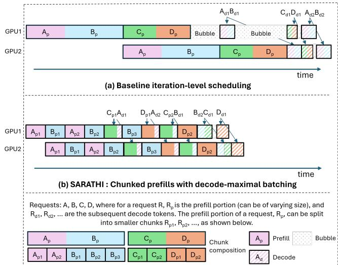
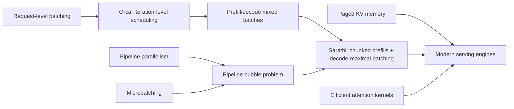
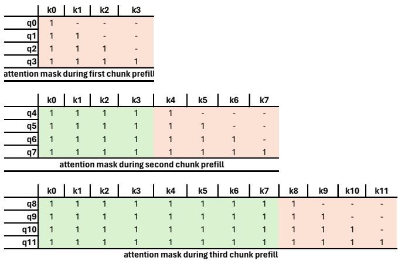

# Sarathi: Chunked Prefills for Efficient LLM Inference

**Paper:** SARATHI: Efficient LLM Inference by Piggybacking Decodes with Chunked Prefills  
**Authors:** Amey Agrawal, Ashish Panwar, Jayashree Mohan, Nipun Kwatra, Bhargav S. Gulavani, Ramachandran Ramjee  
**arXiv:** [2308.16369v1](https://arxiv.org/abs/2308.16369) - August 2023

**Related pages:** [vLLM Continuous Batching](../vllm/vllm-continuous-batching/index.md), [vLLM: PagedAttention](../vllm/vllm-framework.md), [SGLang](../sglang/index.md), [Continuous Batching](../../terms/continuous-batching.md), [Chunked Prefill](../../terms/chunked-prefill.md)

> The extracted Markdown and source figures are preserved under `derived/pdf-markdown/`; this page uses the extraction for figures, measurements, and implementation details.

## TL;DR

**What:** Sarathi combines chunked prefills with decode-maximal batching so inefficient decode tokens ride along with a compute-saturating prefill chunk.

**How:** Split a long prompt into equal chunks, fuse prefill and decode linear operations, and fill the remaining batch capacity with decode tokens while keeping attention computation phase-aware.

**The number:** The paper reports up to 10x decode-throughput improvement, 1.33x end-to-end throughput on LLaMA-13B/A6000, 1.25x on LLaMA-33B/A100, and 1.91x for simulated GPT-3 pipeline-parallel serving.

## The Big Picture

*Source: [SARATHI paper, Figure 1](https://arxiv.org/abs/2308.16369). ① Baseline mixed work leaves pipeline bubbles. ② Sarathi splits prefills into uniform chunks. ③ Decode tokens piggyback on those chunks.*

The figure makes the central contrast visible: baseline iterations have uneven work, while Sarathi creates repeated, similarly shaped hybrid units. The extracted source also supports the following decomposition:

| Batch component | Work contributed | Why it is present |
|---|---|---|
| One prefill chunk | Many prompt tokens processed together | Saturates matrix-multiplication compute |
| Remaining slots | One decode token per active request | Reuses weights already fetched for the prefill |
| Separate attention paths | Causal prefill attention and KV-cache decode attention | Preserves correct autoregressive semantics |
| Repeated chunks | Multiple slices from one long prompt | Creates several opportunities to piggyback decodes |

*The table is a compact reading aid synthesized from the paper's chunked-prefills and decode-maximal-batching design.*

## Why This Exists

Imagine a server with a long prompt and several active generations. A full prefill keeps the GPU busy, but the following decode steps process one token per request and repeatedly reload model weights for tiny matrix-vector operations. A decode-only batch of four requests can spend 12.49 ms per token in the paper's LLaMA-13B/A6000 example, while a hybrid batch with one 1021-token prefill and three decodes reduces the marginal decode cost to 1.2 ms per token.

[Pipeline parallelism](../../terms/pipeline-parallelism.md) adds a second problem. A microbatch containing many prompt tokens takes a different time from one containing only decodes; later stages wait for the slower work, creating bubbles. Different prompt lengths and different KV-cache lengths create still more variation. Sarathi makes each unit closer to the same compute shape before it enters the pipeline.

## The Landscape

*Landscape synthesis: request-level batching gives way to iteration-level scheduling; Sarathi adds deliberate workload shaping to mixed batches, while pipeline microbatching supplies the setting where uniform work removes bubbles. The relationship to paged KV memory and efficient attention is complementary, not a replacement.*

Editable source: [landscape.mmd](assets/landscape.mmd).

## The Core Idea

Prefill is good at using a GPU because it multiplies many token vectors by the model weights at once. Decode is bad at using a GPU because it multiplies only a few vectors at a time. **Sarathi manufactures a steady stream of batches where one suitably sized slice of a prompt supplies the large matrix work and active decodes share that same weight load.** Splitting the prompt creates enough such batches to cover its many decode steps, and the resulting batches have similar compute cost for pipeline scheduling.

## Symbol Map

The paper uses `P` for prefill tokens, `D` for decode tokens, `C` for prefill chunk size, `B` for the maximum batch size, and `L` for maximum sequence length. `H` is the hidden size, `M_G` is GPU memory, `M_S` is per-GPU model memory, and `m_KV` is KV-cache memory per token.

| Symbol | Human name | Scope | Plain meaning |
|---|---|---|---|
| $P$ | prefill-token count | Per request or batch | Tokens in the input prompt |
| $D$ | decode-token count | Per request or batch | Tokens generated autoregressively |
| $C$ | chunk size | Per prefill request | Prompt tokens processed in one chunk |
| $B$ | maximum batch size | Hardware/model configuration | Number of request slots that fit in memory |
| $P:D$ | prefill-to-decode ratio | Workload | Relative amount of prompt and generation work |
| $H$ | hidden size | Model architecture | Width of the token representation |
| $m_{KV}$ | KV memory per token | Model/cache configuration | Memory needed for one token's key/value state |

The main scheduling relationship is that all decodes can be covered when the number of prefill chunks matches the number of decode iterations:

$$
\frac{P}{C} = \frac{D}{B-1}
\quad\Longrightarrow\quad
P:D = C:(B-1).
$$

## Deep Dive

### 1. Chunked prefills preserve the original computation

**What it does:** Splits one long prompt into equal-sized prompt chunks processed over multiple iterations.

**Why it matters:** A full prompt may be larger than needed to saturate the GPU, while a decode-only batch is too small to use it efficiently.

**How it works:** If a 1K prompt is split into four 256-token chunks, the first chunk creates its KV entries; each later chunk attends causally to all prior prompt tokens and writes new KV entries. The attention mask lets query token $q_i$ see preceding keys and values but never future ones, so the result is mathematically equivalent to a full prefill.

*Source: [SARATHI paper, Figure 6](https://arxiv.org/abs/2308.16369). Each later chunk can attend to all earlier prompt tokens while preserving causal order.*

**The intuition:** Cut a long, efficient computation into several still-efficient slices without changing what each token is allowed to see.

**A concrete example:** The 1K prompt from the failure scenario becomes four 256-token opportunities. Each opportunity can carry three decodes in a four-slot batch.

**Remember:** Chunking changes when computation happens, not the causal result.

### 2. Decode-maximal batching piggybacks decodes

**What it does:** Places one prefill chunk in a batch and fills the remaining slots with decode tokens.

**Why it matters:** Decode linear layers are memory-bound because tiny matrix-vector operations repeatedly fetch weights; the prefill supplies a large matrix-matrix operation that fetches those weights once.

**How it works:** Sarathi fuses the prefill and decode linear operations, while processing prefill attention separately from batched decode attention. With model memory $M_S$, GPU memory $M_G$, maximum sequence length $L$, and KV memory $m_{KV}$, the paper estimates the maximum request slots as:

$$
B = \left\lfloor \frac{M_G - M_S}{L \cdot m_{KV}} \right\rfloor.
$$

Because one slot holds the prefill chunk and its KV state, at most $B-1$ decodes piggyback in that batch.

**The intuition:** Let the prefill pay the weight-loading bill, then add small decode work while the weights are already in motion.

**A concrete example:** The four-slot example uses one 1021-token prefill and three decodes. Decode cost falls from 12.49 ms/token to 1.2 ms/token in the reported measurement.

**Remember:** The main win comes from reusing linear-layer weight loads; attention cost is not eliminated.

### 3. Chunk size is a workload and hardware decision

**What it does:** Chooses $C$ to balance prefill efficiency against the number of decodes that can be covered.

**Why it matters:** Smaller chunks create more piggyback opportunities but reduce arithmetic intensity and reread earlier KV entries more often.

**How it works:** For a fixed batch size, smaller $C$ increases $P/C$, so more decode iterations can be attached to one prompt. But the paper measures substantial overhead for tiny chunks: chunk size 64 adds about 3x attention overhead and about 5x total prefill overhead, while sizes 256 and 512 keep end-to-end prefill loss within about 20% and 10% in the LLaMA-13B/A6000 study. Tile quantization also favors chunk dimensions aligned to the GPU tile size.

**The intuition:** Smaller slices buy scheduling opportunities with compute efficiency as the currency.

**A concrete example:** With $C=256$ and $B=18$, the best coverage occurs near $P:D = 256:17$, approximately 14:1. Moving far below or above that ratio leaves either decode or prefill work uncovered.

**Remember:** The smallest chunk that saturates prefill is not automatically the best end-to-end choice.

### 4. Uniform batches reduce pipeline bubbles

**What it does:** Makes successive microbatches have similar compute requirements before pipeline execution.

**Why it matters:** Iteration-level scheduling alone can still place a long prefill, a short prefill, and a decode-heavy batch next to each other, so pipeline stages wait on uneven runtimes.

**How it works:** Each Sarathi unit contains one approximately fixed-size prefill chunk plus a planned number of decodes. This reduces bubbles caused by varying prompt-token counts, prefill-versus-decode cost, and different decode context lengths. The paper evaluates an 8-way tensor-parallel plus 8-way pipeline-parallel GPT-3 deployment through a profiled simulator.

**The intuition:** Pipeline stages stay synchronized when each parcel has roughly the same weight.

**A concrete example:** In the paper's 64-A100 simulation, Sarathi reduces median bubble time per request by 6.29x and accelerates the TP+PP setup by 1.91x versus the Orca-style baseline.

**Remember:** Sarathi is workload shaping for pipeline parallelism, not just another batching policy.

## Putting It Together

1. Estimate the workload's prefill/decode mix and profile prefill throughput on the target model and GPU.
2. Choose a chunk size $C$ that keeps prefill matrix operations efficient while matching the expected $P:D$ ratio.
3. Split each long prompt into causal chunks; retain the [KV cache](../../terms/kv-cache.md) between chunks.
4. Construct each hybrid batch with one prefill chunk and up to $B-1$ decode requests.
5. Fuse the linear operations so prefill and decode tokens reuse the same model-weight loads; keep their attention computations semantically separate.
6. Feed similarly shaped hybrid batches through pipeline stages, reducing runtime variance and bubbles.
7. Fall back to ordinary prefill-only or decode-only execution when one phase runs out, the workload ratio changes, or the selected chunk size is no longer suitable.

## What This Buys You

### The headline claim

Sarathi improves the low-utilization decode phase substantially, but its end-to-end gain is bounded because prefill itself is not accelerated.

### How we know: physical deployment and simulation

| Setup | Decode gain | End-to-end or pipeline result |
|---|---:|---:|
| LLaMA-13B on A6000 | Up to 10x | Up to 1.33x throughput |
| LLaMA-33B on A100 | Up to 4.25x | 1.14x-1.25x throughput |
| GPT-3, 8-way TP + 8-way PP, simulated 64 A100s | 6.29x lower median bubble time | 1.91x faster TP+PP execution |

### The mechanism behind the numbers

Decode speedups are larger than end-to-end speedups because only the decode-side linear operations are made cheaper. Longer contexts also increase attention cost, which Sarathi leaves largely unchanged, narrowing the benefit. The best results occur when the prefill chunks and decode iterations cover one another rather than when the workload is entirely prefill- or decode-dominated.

### How to read these numbers

The 1.91x GPT-3 result is simulation-backed, not a direct 64-GPU deployment measurement. The paper reports that the simulator was calibrated against an 8-GPU A100 DGX setup and stayed within 5% of empirical runtimes there.

## Where It Breaks

| Failure mode | When it happens | Impact |
|---|---|---|
| Tiny chunks | $C$ is too small for the target GPU tiles | Lower arithmetic intensity and repeated KV-cache reads can erase the gain |
| Poor $P:D$ match | The workload has too few prefill chunks or too few decodes | One phase runs uncovered, so piggybacking opportunities disappear |
| Long-context attention | Contexts reach tens or hundreds of thousands of tokens | Attention and repeated KV reads grow, reducing the linear-layer benefit |
| Variable request shapes | Requests have widely different prompt/output lengths | Fixed chunk sizing and uniform-batch assumptions become less accurate |
| Unknown workload mix | $P:D$ changes over time | A statically chosen chunk size may be suboptimal; adaptive selection is future work |
| Latency or fairness constraints | The scheduler optimizes throughput alone | Queueing, tail latency, and fairness need additional policy mechanisms |
| Static KV allocation | The implementation preallocates KV cache to maximum length | Memory waste limits batch size compared with paged allocation systems |

## One Thing to Remember

**Sarathi turns prefill into a carrier wave for decode.** A carefully sized prompt chunk keeps the GPU busy with matrix-matrix work, and decode tokens ride on that same weight load; repeating this pattern makes decode more efficient and makes pipeline microbatches more alike, but the payoff depends on chunk size, workload mix, memory capacity, and attention cost.

## Go Deeper

- **Read:** [SARATHI paper](https://arxiv.org/abs/2308.16369)
- **Build on:** [vLLM Continuous Batching](../vllm/vllm-continuous-batching/index.md), [vLLM: PagedAttention](../vllm/vllm-framework.md)
- **Dig into the mechanism:** [PagedAttention](../../terms/pagedattention.md) for the paged KV-cache layout behind vLLM.
- **Understand the context:** [SGLang](../sglang/index.md), [Continuous Batching](../../terms/continuous-batching.md), [Microbatch](../../terms/microbatch.md)
- **Reproduce:** The paper reports a nanoGPT implementation; no local source checkout is recorded in this knowledge base.
