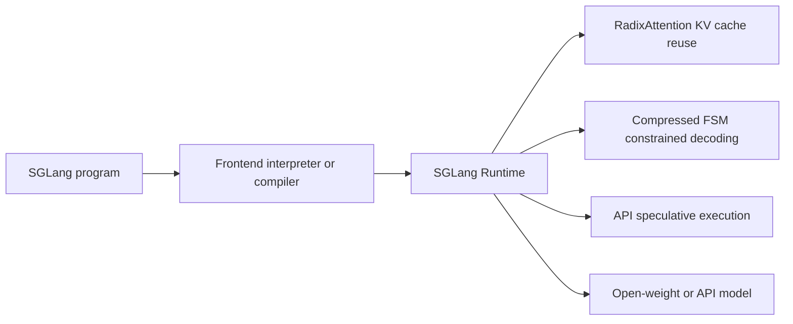
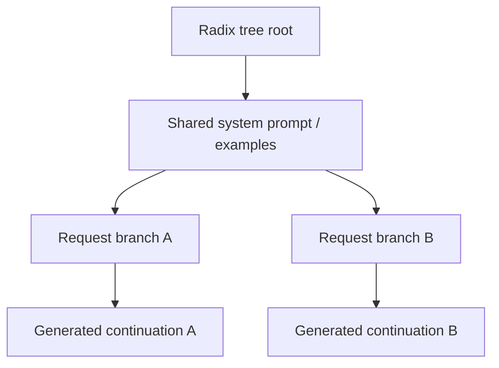

# SGLang: Structured Language Model Programs

**Paper:** SGLang: Efficient Execution of Structured Language Model Programs
**Authors:** Lianmin Zheng, Liangsheng Yin, Zhiqiang Xie, Chuyue Sun, Jeff Huang, Cody Hao Yu, Shiyi Cao, Christos Kozyrakis, Ion Stoica, Joseph E. Gonzalez, Clark Barrett, Ying Sheng
**arXiv:** 2312.07104v2 - 6 Jun 2024

## Summary

SGLang is a framework for programming and executing structured language model programs: workflows that involve multiple generation calls, control flow, parallel branches, multimodal inputs, and structured outputs. It has two co-designed parts:

- A Python-embedded frontend language with primitives for prompt state, generation, selection, multimodal inputs, and parallelism.
- A backend runtime that accelerates repeated and structured calls through KV cache reuse, constrained decoding optimizations, and API-call speculation.

The paper's central claim is that complex LLM applications expose structure that ordinary OpenAI-like completion APIs and general inference servers do not exploit. SGLang makes that structure explicit in the frontend and uses it in the runtime.

## Problem Framing

Modern LLM applications increasingly look like programs rather than single prompts. Agent control, tree-of-thought, skeleton-of-thought, self-consistency, LLM judges, retrieval-augmented generation, multimodal question answering, JSON generation, and multi-turn chat all require repeated model calls with dependencies between calls.

The paper identifies two main inefficiencies:

1. **Programming complexity:** developers must manually handle prompt string assembly, output parsing, parallel model calls, multimodal inputs, and synchronization.
2. **Execution waste:** existing inference engines usually lack workload-level knowledge, so they recompute shared prefixes and decode constrained outputs token by token even when the program structure permits reuse or batching.

SGLang addresses these together by giving the programmer low-level primitives and giving the runtime enough structure to optimize execution.

## Programming Model

SGLang is a domain-specific language embedded in Python. It does not replace Python control flow; instead, it provides prompt-state primitives that can be composed with ordinary Python code.

| Primitive | Purpose |
|---|---|
| `extend` / `+=` | Append strings or structured inputs to the prompt state |
| `gen` | Generate model output and store it under a variable name |
| `select` | Select the highest-probability option from a candidate list |
| `state["name"]` | Fetch a stored generation result, blocking if needed |
| `fork` | Create parallel prompt-state branches |
| `join` | Rejoin prompt branches |
| `image` | Add image input |
| `video` | Add video input |
| `regex` argument to `gen` | Constrain output to a regular-expression-defined format |

The paper's running example is a multi-dimensional essay judge over an image. It checks whether the essay is related to the image, forks into parallel judging dimensions such as clarity and originality, merges the judgments, then emits a JSON-formatted answer under a regex constraint.

## Execution Modes

SGLang supports two execution styles:

- **Interpreter mode:** prompt state is treated as an asynchronous stream. `extend`, `gen`, and `select` submit work without blocking; fetching generated variables synchronizes only when the value is needed. Each prompt stream is managed by a background executor, enabling intra-program parallelism.
- **Compiler mode:** SGLang programs can be traced into computational graphs for additional graph-level optimizations. The paper evaluates interpreter mode by default and discusses compiler optimizations in the appendix.

The frontend supports open-weight models through SGLang Runtime (SRT) and API-only models such as OpenAI and Anthropic endpoints.

## Runtime Optimization 1: RadixAttention

RadixAttention is SGLang's KV cache reuse mechanism. During autoregressive inference, a request first computes KV cache tensors for prompt tokens during prefill, then reuses those tensors while decoding. Because KV cache computation depends only on prefix tokens, calls with shared prefixes can reuse cache instead of recomputing it.

SGLang stores KV cache entries in a radix tree keyed by token sequences. This supports efficient prefix matching, insertion, splitting, and eviction for multi-level sharing patterns such as:

- shared few-shot examples across benchmark questions;
- repeated self-consistency samples from the same question;
- growing chat histories in multi-turn chat;
- branching search histories in tree-of-thought;
- common agent templates and previous tool-call context.

RadixAttention uses an LRU policy that evicts least-recently-used leaves first, preserving shared ancestors for as long as possible. Cached tokens and currently running requests share the same memory pool, so the runtime can evict cached tokens when active batches need more memory.

The runtime also uses cache-aware scheduling. It prioritizes requests with longer matched prefixes, approximating depth-first traversal of the request radix tree. The paper proves that, in an offline batch setting with cache size at least the maximum request length, depth-first traversal achieves the optimal cache hit rate.

The paper notes a limitation: greedy cache-aware scheduling can cause starvation, so integration with fair scheduling is left as future work.

## Runtime Optimization 2: Compressed FSM Decoding

Structured outputs often need constraints such as JSON schemas. SGLang exposes this through the `regex` argument to `gen`.

Existing constrained decoding systems typically convert a regex into a finite state machine and mask invalid next tokens at every step. This enforces correctness but still decodes one token at a time.

SGLang compresses adjacent single-transition FSM edges into longer transitions. When a fixed multi-token string is the only valid continuation, the runtime can process multiple tokens in one forward pass. In the JSON example, constant syntax such as `{"summary": "` can be advanced through the compressed FSM more efficiently than token-by-token masking.

The paper reports that compressed FSM decoding increases JSON-decoding throughput by 1.6x, and that preprocessing the FSM once per batch matters: redoing preprocessing for each request makes throughput 2.4x lower.

## Runtime Optimization 3: API Speculative Execution

For black-box API models, SGLang cannot modify inference internals. Instead, it uses API speculative execution for multi-call templates.

If a program will make several related API calls, the first call can intentionally continue past a stop condition for a few extra tokens. The interpreter stores those extra tokens and attempts to match them against later primitives. When the speculation matches the expected template, SGLang avoids later API calls and their repeated input-token costs.

In the paper's GPT-3.5 extraction example, a prompt extracts three fields from a Wikipedia page. With few-shot prompting, speculative execution has high accuracy and reduces input-token cost by about 3x.

## Evaluation Setup

The paper evaluates SGLang on:

- **Models:** Llama-2 7B/70B, Mixtral-8x7B, LLaVA-v1.5-7B image model, LLaVA-NeXT-34B video model, and OpenAI GPT-3.5.
- **Hardware:** mostly AWS EC2 G5 instances with NVIDIA A10G 24 GB GPUs; additional A100 80 GB experiments.
- **Baselines:** Guidance v0.1.8 with llama.cpp, vLLM v0.2.5 API server, LMQL v0.7.3 with Hugging Face Transformers, and original Hugging Face implementations for multimodal models where other baselines lacked support.
- **Workloads:** MMLU, HellaSwag, ReAct agents, generative agents, tree-of-thought, skeleton-of-thought, branch-solve-merge LLM judge, JSON decoding, multi-turn chat, DSPy RAG, image QA, and video QA.

## Results

The reported end-to-end results show:

| Area | Result |
|---|---|
| Open-weight Llama-7B workloads | Up to 6.4x higher throughput and up to 3.7x lower latency |
| Cache hit rates across benchmarks | 50% to 99% |
| Cache-aware scheduling quality | 96% of optimal cache hit rate on average |
| Multimodal LLaVA image benchmark | 1.15 image/s versus 0.18 image/s for the authors' original implementation |
| Multimodal LLaVA video benchmark | 0.10 frame/s versus 0.02 frame/s for the authors' original implementation |
| Production Chatbot Arena deployment | 52.4% RadixAttention hit rate for LLaVA-NeXT-34B and 74.1% for Vicuna-33B after one month |
| Vicuna-33B production latency | 1.7x average first-token latency reduction from cache hits |
| RadixAttention overhead with no reuse | Less than 0.3% management overhead |

The largest gains come from workloads with substantial shared prompt prefixes or structured decoding opportunities. Gains are smaller for long-output multi-turn chat because decoding dominates and there is less reusable work between sessions.

## Relationship to Other Systems

SGLang is positioned as a low-level LLM programming system, closer to Guidance and LMQL than to high-level orchestration frameworks such as LangChain, DSPy, and AutoGen.

| System | Syntax | Main primitives | Runtime backends |
|---|---|---|---|
| LMQL | Custom language | `extend`, `gen`, `select` | Hugging Face Transformers, llama.cpp, OpenAI |
| Guidance | Python | `extend`, `gen`, `select`, `image` | Hugging Face Transformers, llama.cpp, OpenAI |
| SGLang | Python | `extend`, `gen`, `select`, `image`, `video`, `fork`, `join` | SGLang Runtime, OpenAI |

The main distinction is runtime co-design. SGLang keeps low-level prompt control while adding a runtime designed for KV cache reuse, structured decoding, and parallel execution.

## Limitations and Future Directions

The paper lists several future directions:

- support additional output modalities;
- extend RadixAttention across more memory hierarchy levels such as DRAM and disk;
- support fuzzy semantic matching in RadixAttention;
- add higher-level primitives on top of SGLang;
- address starvation in cache-aware scheduling;
- improve the compiler with static scheduling and memory planning.

## Key Takeaways

- SGLang treats advanced prompting and agent workflows as structured programs, not independent prompt calls.
- The frontend primitives expose prompt-state branching, generation, selection, multimodal inputs, and constrained outputs in Python.
- The backend runtime exploits repeated prefixes through RadixAttention, accelerates structured generation with compressed FSMs, and reduces black-box API costs with speculative execution.
- The framework is most valuable when workloads have shared prefixes, branching or repeated calls, structured output constraints, or multimodal context reuse.
