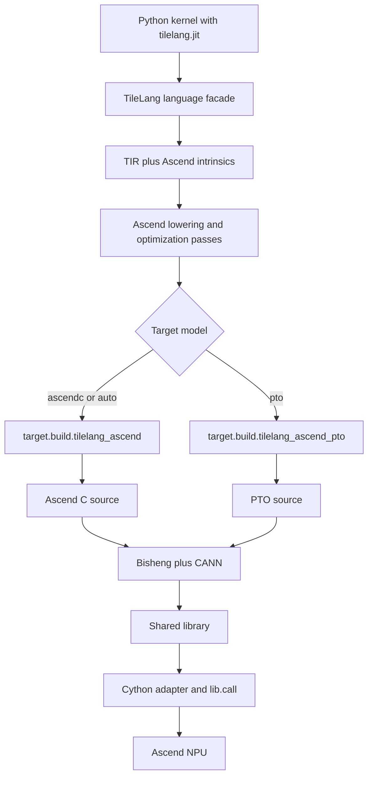
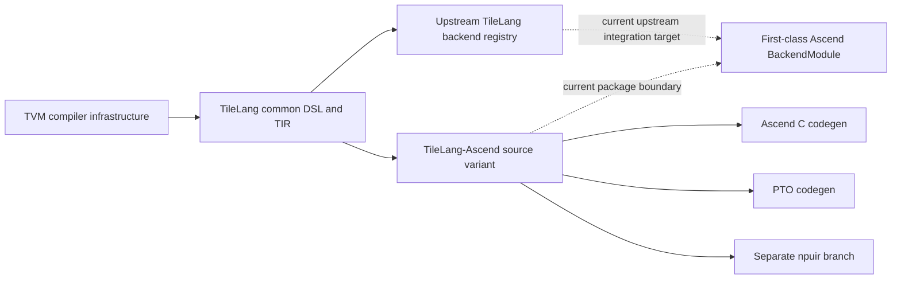

# TileLang-Ascend: Ascend Backend and TileLang Integration

**Repositories:** [tile-ai/tilelang-ascend](https://github.com/tile-ai/tilelang-ascend) at `34a048c19bd762381db0d0f2d5acfdf3527c459f` (`ascendc_pto`); [tile-ai/tilelang](https://github.com/tile-ai/tilelang) at `5a9b2a54b9a04831886d9b4dfd7a9ad758cd7ebd` (`main`).

**Evidence boundary:** clean, pinned checkouts and static source reading. No CANN compilation, Ascend NPU execution, numerical validation, or performance measurement was performed. The separate `npuir` branch was not inspected.

The source README describes the variant and its two active code-generation routes at <a class="code-link" href="../../../external-repos/tilelang-ascend/README.md#L12" data-code-repo="tilelang-ascend-34a048c19bd7" data-code-path="README.md" data-code-line="12"><code>README.md overview</code></a>.

**Related pages:** [TileLang Design and Code Learning Path](../tilelang/index.md), [Triton Ascend](../triton-ascend/index.md), [Triton in vLLM and vllm-ascend](../triton/triton-in-vllm.md), and [Frameworks](../index.md).

## TL;DR

**What:** TileLang-Ascend is a source-level TileLang variant for Huawei Ascend NPUs, not a runtime plugin imported by the current upstream TileLang wheel.

**How:** It keeps the TileLang/TVM programming shape, adds Ascend language intrinsics and lowering passes, emits Ascend C or PTO source through TVM global functions, then compiles that source with Bisheng and CANN before the Cython adapter launches it.

**The boundary:** Upstream TileLang now has a `BackendModule` registry, while this checkout still dispatches directly from `target.model`; upstream documents Ascend as an external ecosystem adapter rather than shipping the implementation.

## The Big Picture

[Editable integration flow](assets/tilelang-ascend-integration.mmd)

*Synthesized architecture from the pinned repositories. 1. Python builds a TileLang program. 2. Ascend passes preserve hardware-specific memory and synchronization intent. 3. One of two native code generators emits source. 4. Bisheng and CANN create a shared library. 5. The Cython adapter passes tensor pointers to the generated call entry.*

## Why This Exists

The common TileLang language makes a tiled [GEMM](../../terms/gemm.md) readable, but the generated program still has to respect Ascend's distinct cube/vector cores, L1/L0/UB memory scopes, cross-core synchronization, and CANN toolchain. A CUDA-oriented backend cannot simply rename `shared` to `L1`: it must decide where buffers live, how `T.Parallel` is lowered, which operations use cube or vector hardware, and when producer/consumer flags are inserted.

The practical example is a matrix multiply with `A_L1`, `B_L1`, and `C_L0C`. The same tile-level intent can be expressed in Python, but the Ascend path must preserve those scopes through lowering and turn them into Ascend C or PTO operations before Bisheng can compile the result.

The build is enabled by <a class="code-link" href="../../../external-repos/tilelang-ascend/setup.py#L39" data-code-repo="tilelang-ascend-34a048c19bd7" data-code-path="setup.py" data-code-line="39"><code>USE_ASCEND</code></a>; the native source list is selected in <a class="code-link" href="../../../external-repos/tilelang-ascend/CMakeLists.txt#L130" data-code-repo="tilelang-ascend-34a048c19bd7" data-code-path="CMakeLists.txt" data-code-line="130"><code>CMakeLists.txt</code></a>.

## The Landscape

[Editable landscape diagram](assets/tilelang-ascend-landscape.mmd)

*Landscape synthesis. TileLang-Ascend shares the TVM-based tile language idea but currently carries its own compiler vertical slice. The `npuir` route is a separate branch, while the checked-out `ascendc_pto` branch contains Ascend C and PTO codegen.*

## The Core Idea

**TileLang-Ascend owns the hardware half of the compiler.** The frontend still constructs TileLang/TVM IR, but the fork adds the Ascend passes, native source emitters, build switches, and CANN launch path needed to turn that IR into an executable NPU kernel. Upstream TileLang recognizes the ecosystem boundary and exposes a backend registry, but the current Ascend checkout has not been refactored into that registry.

## Shared and Ascend-Specific Layers

| Layer | Shared with TileLang | Ascend-specific in this checkout |
|---|---|---|
| Python DSL | Tile functions, `tilelang.jit`, buffers, loops, and TVM TIR concepts | Ascend exports from the language facade and `T.tile` operations |
| Intermediate representation | TVM module/function structure and buffer metadata | `tl.ascend_*` intrinsics, NPU scopes, cross-core flags, and platform attributes |
| Lowering | Common simplification and TileLang transform infrastructure | Buffer-scope inference, vector lowering, pipeline planning, memory planning, and synchronization insertion |
| Device codegen | TVM global-function convention and source module abstraction | Ascend C and PTO `CodeGenC` subclasses and CANN template headers |
| Build | CMake plus Python packaging | `USE_ASCEND`, CANN headers/libraries, Catlass, shmem, and PTO ISA dependencies |
| Execution | Cython-style tensor binding and shared-library loading shape | Bisheng compilation, NPU device pointers, CANN runtime libraries, and the generated `call` entry |

## Deep Dive

### 1. The language facade carries Ascend intent

**What it does:** The TileLang language package exports Ascend operations alongside the common language surface.

**Why it matters:** Hardware semantics must enter the IR before lowering can preserve them; a generic GEMM call cannot express every Ascend synchronization or memory-scope decision.

**How it works:** The <a class="code-link" href="../../../external-repos/tilelang-ascend/tilelang/language/__init__.py#L83" data-code-repo="tilelang-ascend-34a048c19bd7" data-code-path="tilelang/language/__init__.py" data-code-line="83"><code>Ascend language exports</code></a> import Ascend helpers and alias `ascend_tile` as `T.tile`. Those helpers construct TVM intrinsic calls such as cross-core flags, barriers, memory operations, and Ascend tile operations rather than executing them immediately.

**The intuition:** Python states the operation and hardware intent; the backend decides how that intent becomes source code.

**Remember:** Ascend-specific behavior begins as IR-visible language operations, not as a late runtime patch.

### 2. The pass pipeline turns intent into NPU constraints

**What it does:** The Ascend pipeline legalizes and optimizes the TileLang IR before native codegen.

**Why it matters:** Ascend's memory hierarchy and separate compute pipelines make pass order part of correctness, not only optimization.

**How it works:** <a class="code-link" href="../../../external-repos/tilelang-ascend/tilelang/engine/phase.py#L49" data-code-repo="tilelang-ascend-34a048c19bd7" data-code-path="tilelang/engine/phase.py" data-code-line="49"><code>LowerAndLegalize</code></a> applies buffer-scope inference, vector lowering, layout inference, tile-op lowering, tail handling, workspace reduction, and safe-access legalization. <a class="code-link" href="../../../external-repos/tilelang-ascend/tilelang/engine/phase.py#L96" data-code-repo="tilelang-ascend-34a048c19bd7" data-code-path="tilelang/engine/phase.py" data-code-line="96"><code>OptimizeForTarget</code></a> then plans pipelines, flattens buffers, rewrites storage, plans memory, and inserts synchronization for the selected platform.

**The intuition:** The pipeline gradually changes a logical tile program into a schedule that fits physical Ascend storage and queues.

**Remember:** `AscendMemoryPlanning` and synchronization insertion are compiler stages because they depend on the full IR context.

### 3. Target selection is an internal model switch

**What it does:** The fork selects Ascend C or PTO through a target model passed into the lowerer.

**Why it matters:** This is the point where the fork diverges most visibly from current upstream TileLang's target-kind and backend-context model.

**How it works:** <a class="code-link" href="../../../external-repos/tilelang-ascend/tilelang/utils/target.py#L63" data-code-repo="tilelang-ascend-34a048c19bd7" data-code-path="tilelang/utils/target.py" data-code-line="63"><code>determine_target</code></a> recognizes NPU availability and Ascend aliases. The <a class="code-link" href="../../../external-repos/tilelang-ascend/tilelang/engine/lower.py#L193" data-code-repo="tilelang-ascend-34a048c19bd7" data-code-path="tilelang/engine/lower.py" data-code-line="193"><code>lower</code></a> entry creates an LLVM-kind TVM target with the requested string stored as `model`, then <a class="code-link" href="../../../external-repos/tilelang-ascend/tilelang/engine/lower.py#L159" data-code-repo="tilelang-ascend-34a048c19bd7" data-code-path="tilelang/engine/lower.py" data-code-line="159"><code>device_codegen</code></a> calls `target.build.tilelang_ascend` for `ascendc`/`auto` or `target.build.tilelang_ascend_pto` for `pto`.

**The intuition:** The LLVM kind is a carrier for the fork's internal selector; it is not evidence that LLVM is the final NPU code generator.

**Remember:** `target.model` controls the native Ascend route in this branch.

### 4. Native codegen returns source, not a finished device binary

**What it does:** The native modules lower the final TIR to Ascend C or PTO source and register the two TVM build entry points.

**Why it matters:** Source generation and device compilation are separate stages, which explains why CANN and Bisheng appear after TVM codegen.

**How it works:** <a class="code-link" href="../../../external-repos/tilelang-ascend/src/target/rt_mod_ascend.cc#L31" data-code-repo="tilelang-ascend-34a048c19bd7" data-code-path="src/target/rt_mod_ascend.cc" data-code-line="31"><code>rt_mod_ascend.cc</code></a> and <a class="code-link" href="../../../external-repos/tilelang-ascend/src/target/rt_mod_ascend_pto.cc#L31" data-code-repo="tilelang-ascend-34a048c19bd7" data-code-path="src/target/rt_mod_ascend_pto.cc" data-code-line="31"><code>rt_mod_ascend_pto.cc</code></a> register the global functions and return C source modules. <a class="code-link" href="../../../external-repos/tilelang-ascend/src/target/codegen_ascend.cc#L100" data-code-repo="tilelang-ascend-34a048c19bd7" data-code-path="src/target/codegen_ascend.cc" data-code-line="100"><code>CodeGenTileLangAscend::PrintFuncPrefix</code></a> emits Ascend kernel qualifiers, while <a class="code-link" href="../../../external-repos/tilelang-ascend/src/target/codegen_ascend.cc#L1124" data-code-repo="tilelang-ascend-34a048c19bd7" data-code-path="src/target/codegen_ascend.cc" data-code-line="1124"><code>CodeGenTileLangAscend::PrintHostFunc</code></a> emits the callable entry. The PTO codegen has the corresponding source and dispatch path at <a class="code-link" href="../../../external-repos/tilelang-ascend/src/target/codegen_ascend_pto.cc#L3979" data-code-repo="tilelang-ascend-34a048c19bd7" data-code-path="src/target/codegen_ascend_pto.cc" data-code-line="3979"><code>CodeGenTileLangAscendPto::PrintHostFunc</code></a>.

**The intuition:** TVM produces the C/C++ text that knows the kernel's shape and calls; Bisheng is still needed to turn that text into an NPU-loadable library.

**Remember:** The `target.build.*` functions are source-producing boundaries in this path.

### 5. Bisheng and Cython finish the runtime path

**What it does:** The generated source is compiled, loaded, and called with NPU tensor pointers.

**Why it matters:** A valid source module is not executable until it is linked against CANN's runtime and exposed through the adapter's argument contract.

**How it works:** <a class="code-link" href="../../../external-repos/tilelang-ascend/tilelang/jit/adapter/libgen.py#L142" data-code-repo="tilelang-ascend-34a048c19bd7" data-code-path="tilelang/jit/adapter/libgen.py" data-code-line="142"><code>LibraryGenerator.compile_lib</code></a> invokes `bisheng` with Ascend C or PTO flags, include paths, and CANN libraries. <a class="code-link" href="../../../external-repos/tilelang-ascend/tilelang/jit/adapter/wrapper.py#L648" data-code-repo="tilelang-ascend-34a048c19bd7" data-code-path="tilelang/jit/adapter/wrapper.py" data-code-line="648"><code>TLWrapper.wrap</code></a> currently passes the generated source through unchanged for NPU. <a class="code-link" href="../../../external-repos/tilelang-ascend/tilelang/jit/adapter/cython/adapter.py#L176" data-code-repo="tilelang-ascend-34a048c19bd7" data-code-path="tilelang/jit/adapter/cython/adapter.py" data-code-line="176"><code>CythonKernelAdapter</code></a> creates the wrapper and ultimately calls <a class="code-link" href="../../../external-repos/tilelang-ascend/tilelang/jit/adapter/cython/adapter.py#L449" data-code-repo="tilelang-ascend-34a048c19bd7" data-code-path="tilelang/jit/adapter/cython/adapter.py" data-code-line="449"><code>lib.call</code></a>.

**The intuition:** Cython binds Python tensors to the generated C entry; CANN owns the device-side execution.

**Remember:** This is a source-compiling execution path, not the same artifact path as upstream CUDA's TVM FFI or NVRTC adapters.

## Putting It Together

Follow one Ascend GEMM from source to execution:

1. A Python function decorated with `tilelang.jit` builds a TileLang program with global buffers and Ascend-local allocations.
2. The language facade preserves tile operations, buffer scopes, and synchronization intrinsics in TVM IR.
3. The lowering pipeline infers scopes and layouts, plans memory and pipelines, lowers vector loops, and inserts synchronization.
4. The lowerer stores the requested route in the target model and invokes the matching TVM global codegen function.
5. Ascend C or PTO codegen emits source plus a host-call entry; TVM returns that source module to the JIT artifact.
6. The Cython adapter passes the source to Bisheng, which links it with CANN, Catlass/shmem/PTO headers, and runtime libraries.
7. The adapter loads the shared library, maps input/output tensor pointers, and calls the generated entry.
8. The NPU executes the kernel using the memory scopes and synchronization decisions established by the lowering pipeline.

The important invariant is **frontend reuse with backend ownership**: the tile program looks familiar, but the Ascend pipeline owns the legality rules and the CANN toolchain owns final device compilation.

## How It Relates to Upstream TileLang

The existing [TileLang learning path](../tilelang/index.md) describes the current upstream architecture: an immutable `BackendModule` resolves a target, pass pipeline, device codegen, host codegen, and execution policy through one `BackendContext`. The upstream backend contract is declared in <a class="code-link" href="../../../external-repos/tilelang/tilelang/backend/module.py#L28" data-code-repo="tilelang-5a9b2a54b9a0" data-code-path="tilelang/backend/module.py" data-code-line="28"><code>BackendModule</code></a>, registration happens through <a class="code-link" href="../../../external-repos/tilelang/tilelang/backend/module.py#L238" data-code-repo="tilelang-5a9b2a54b9a0" data-code-path="tilelang/backend/module.py" data-code-line="238"><code>register_backend</code></a>, and the backend context is resolved by <a class="code-link" href="../../../external-repos/tilelang/tilelang/backend/module.py#L310" data-code-repo="tilelang-5a9b2a54b9a0" data-code-path="tilelang/backend/module.py" data-code-line="310"><code>create_backend_context</code></a>.

TileLang-Ascend uses an older direct path instead. Its lowerer dispatches by `target.model`, packages the same module name `tilelang`, and compiles generated source through a custom Bisheng/Cython path. The upstream lower entry receives the already resolved context through <a class="code-link" href="../../../external-repos/tilelang/tilelang/engine/lower.py#L220" data-code-repo="tilelang-5a9b2a54b9a0" data-code-path="tilelang/engine/lower.py" data-code-line="220"><code>lower</code></a>. Upstream's README lists Huawei Ascend as an ecosystem adapter developed outside the main release wheels at <a class="code-link" href="../../../external-repos/tilelang/README.md#L123" data-code-repo="tilelang-5a9b2a54b9a0" data-code-path="README.md" data-code-line="123"><code>the support table</code></a>. Upstream lower-trace tooling knows the Ascend FFI names as source-only codegen outputs at <a class="code-link" href="../../../external-repos/tilelang/tilelang/tools/lower_trace/core.py#L143" data-code-repo="tilelang-5a9b2a54b9a0" data-code-path="tilelang/tools/lower_trace/core.py" data-code-line="143"><code>the codegen FFI list</code></a>, but the upstream checkout does not register an Ascend `BackendModule`.

### What first-class integration would require

| Area | Current fork | Upstream-shaped integration |
|---|---|---|
| Target | LLVM-kind carrier with `model=ascendc` or `pto` | Target normalization and a predicate for the Ascend variants |
| Pipeline | Ascend passes called directly from the fork's engine | An Ascend-owned `PassPipeline` selected through `BackendContext` |
| Codegen | TVM global functions registered by native C++ | `DeviceCodegen` entries wrapping the two source-only codegen functions |
| Runtime | Custom `LibraryGenerator` plus Cython NPU launch | An execution-backend declaration whose source, flags, symbols, and launch metadata satisfy the shared adapter contract |
| Packaging | A separate package that is also named `tilelang` | A compatible adapter package or coordinated upstream distribution with one TVM/TIR version |

The last row is operationally important: the inspected Ascend fork is version `0.1.4`, while upstream is `0.1.13`, and their TVM submodule pins differ. They should be treated as separate environments until the compiler and package boundaries are reconciled.

## What This Buys You

### The engineering benefit

TileLang-Ascend lets kernel authors describe tiled computation in a Python DSL while keeping Ascend-specific memory placement, cube/vector scheduling, synchronization, and CANN compilation visible to a dedicated backend.

### The trade-off

The source-level variant can move quickly with Ascend hardware and CANN features, but it pays for that autonomy with package and compiler-version divergence from upstream TileLang. The current integration is therefore strong at the hardware boundary and weak at the shared distribution boundary.

## Where It Breaks

| Failure mode | Condition | Impact |
|---|---|---|
| Package collision | Upstream `tilelang` and the Ascend variant are installed into one Python environment | Imports and native libraries can resolve to incompatible implementations. |
| Missing CANN toolchain | `ASCEND_HOME_PATH`, Bisheng, or required CANN libraries are unavailable | Source generation may succeed, but library compilation or loading fails. |
| Wrong target route | `ascendc`, `pto`, and `auto` are interpreted using this fork's internal target model | Reusing upstream target assumptions can select the wrong codegen or fail before runtime. |
| Unsupported hardware semantics | A kernel assumes an A2/A3/A5 layout, alignment, or synchronization rule that the selected platform does not support | Codegen, compilation, or numerical behavior can fail. |
| Branch mismatch | The user expects AscendNPU IR while using the checked-out `ascendc_pto` branch | The documented NPU IR route is not represented by this evidence page. |
| Unverified runtime behavior | No CANN/NPU execution is available | Static code paths do not establish numerical correctness or performance. |

## One Thing to Remember

**TileLang-Ascend is a TileLang-shaped compiler variant, not yet a first-class upstream backend.** It shares the Python tile language and TVM foundation, then owns the Ascend lowering, source codegen, Bisheng/CANN build, and Cython launch path; upstream TileLang currently acknowledges it as an external ecosystem adapter.

## Go Deeper

- **Read:** [TileLang Design and Code Learning Path](../tilelang/index.md)
- **Compare:** [Triton Ascend](../triton-ascend/index.md) for a plugin-style Ascend backend that integrates with upstream Triton through backend discovery.
- **Understand the hardware:** [Triton Ascend operator mechanisms](../triton-ascend/operator-mechanisms.md) for AIC/AIV, UB/L1/L0, movement, and synchronization concepts.
- **Inspect the source:** [TileLang-Ascend repository](https://github.com/tile-ai/tilelang-ascend/tree/34a048c19bd762381db0d0f2d5acfdf3527c459f) and [upstream TileLang repository](https://github.com/tile-ai/tilelang/tree/5a9b2a54b9a04831886d9b4dfd7a9ad758cd7ebd).
