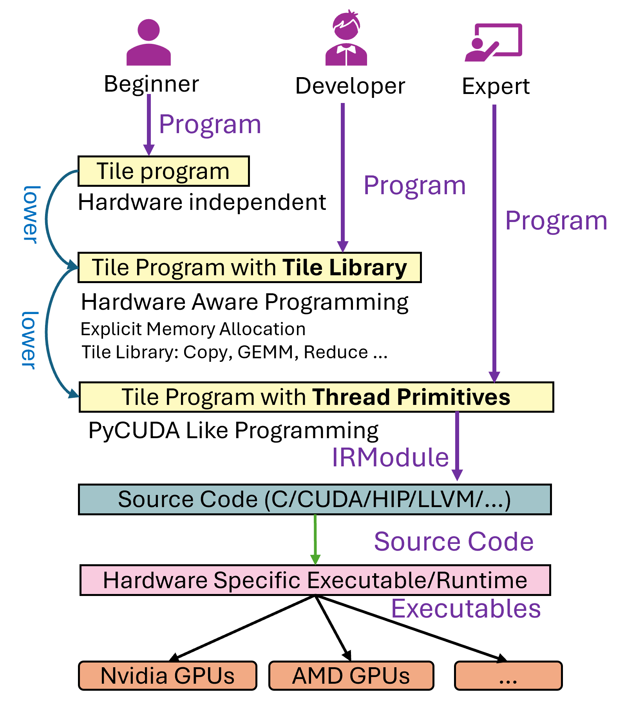

# TileLang Design and Code Learning Path

**Repository:** [tile-ai/tilelang](https://github.com/tile-ai/tilelang)  
**Inspected revision:** `5a9b2a54b9a04831886d9b4dfd7a9ad758cd7ebd`
(`main`, `v0.1.13-40-g5a9b2a54`, inspected 2026-08-10)  
**Evidence boundary:** clean checkout, static source reading only. This ingest did
not compile or run a kernel, inspect generated device code, validate numerical
correctness, or measure performance on CUDA, ROCm, Metal, or CPU hardware.

**Related pages:** [Frameworks](../index.md),
[Triton: Tiled GPU Kernel Language and Compiler](../triton/index.md),
[Triton in Practice](../triton/triton-in-vllm.md), and
[General Matrix Multiply (GEMM)](../../terms/gemm.md).

## TL;DR

**What:** TileLang is a Python-embedded domain-specific language (DSL) for
writing kernels in terms of tiles, explicit memory scopes, structured loops,
and operations such as copy and matrix multiplication.

**How:** Python first elaborates into TVM TIRX that still contains TileLang
operations. A selected backend owns the pass sequence that plans software
pipelines, infers layouts, lowers tile operations to target instructions,
generates device code, and chooses the host execution adapter.

**One thing to remember:** TileLang's main abstraction boundary is not
"Python versus C++." It is **target-neutral tile intent versus
target-specific lowering**. Most of the design makes that boundary explicit and
extensible.

## The Mental Model

Think of TileLang as five connected layers:

| Layer | What the user writes or the system owns | Design purpose |
|---|---|---|
| Tile program | `T.Kernel`, scoped buffers, `T.Pipelined`, `T.copy`, `T.gemm` | State the computation and useful scheduling intent without spelling every instruction. |
| TIRX construction | Eager builder or returned `PrimFunc` | Convert Python structure into analyzable compiler IR while retaining shapes, scopes, source spans, and tile operations. |
| Backend context | Target, pass pipeline, device/host code generators, execution policy | Resolve one coherent backend configuration for a compilation. |
| Lowering pipeline | Layout inference, software pipelining, tile-op lowering, synchronization, host/device splitting | Turn intent into legal target-level loops, memory accesses, and instructions. |
| JIT adapter | TVM FFI, Cython, NVRTC, PyTorch/Metal, or CuTe DSL | Compile/load the artifact, bind tensor arguments, launch it, and expose a Python callable. |

The repository's original overview captures this progressive lowering from a
tile program to a tile library, thread primitives, source code, and finally a
hardware-specific executable:

*Source figure copied from
[`docs/_static/img/overview.png`](https://github.com/tile-ai/tilelang/blob/5a9b2a54b9a04831886d9b4dfd7a9ad758cd7ebd/docs/_static/img/overview.png)
at the inspected revision.*

## Start from the Programming Model

The fastest way into the codebase is the
<a class="code-link"
   href="../../../external-repos/tilelang/examples/quickstart.py#L8"
   data-code-repo="tilelang-5a9b2a54b9a0"
   data-code-path="examples/quickstart.py"
   data-code-line="8"
   data-code-end-line="48"><code>examples/quickstart.py::matmul</code></a>
example. It contains nearly the whole language model in miniature:

1. Tensor annotations describe global inputs and output shape.
2. `T.Kernel` declares the grid and thread-block launch.
3. `T.alloc_shared` stages input tiles in block-visible memory.
4. `T.alloc_fragment` holds per-thread accumulator fragments.
5. `T.Pipelined` expresses overlap across K tiles.
6. `T.copy` moves data between scopes.
7. `T.gemm` preserves a tile-level matrix operation for later lowering.
8. `T.Parallel` maps the ReLU epilogue over the result tile.

This programming model is explicit about the costly state transitions—off-chip
to on-chip memory, fragment accumulation, and the final store—while delegating
instruction selection and many synchronization details to the compiler. That
is the central productivity/performance tradeoff.

### What changes state, and when?

| Time | State transition |
|---|---|
| Python decoration | The function is wrapped with its signature, source, and compile options; no device kernel has run. |
| First specialized call | Runtime tensor metadata and compile-time arguments form a cache key; Python elaborates a specialized TIRX function. |
| Compiler lowering | Abstract scopes and tile operations become physical layouts, loops, synchronization, target intrinsics, and separate host/device modules. |
| Artifact creation | Generated source and optionally a device binary/runtime module are attached to a `CompiledArtifact`. |
| Invocation | An adapter binds tensors and launches the compiled kernel. Later calls with the same specialization reuse the cached kernel. |

## End-to-End Compilation and Execution Flow

### 1. `@tilelang.jit` captures the Python function

The public
<a class="code-link"
   href="../../../external-repos/tilelang/tilelang/jit/__init__.py#L574"
   data-code-repo="tilelang-5a9b2a54b9a0"
   data-code-path="tilelang/jit/__init__.py"
   data-code-line="574"
   data-code-end-line="636"><code>jit()</code></a>
decorator records compile options, rewrites the function through `prim_func`
with eager-JIT support, captures its source and signature, and returns a
`JITImpl`. TileLang supports two authoring styles:

- **Eager:** tensor arguments are passed to the decorated function; the builder
  elaborates and executes the specialized kernel on demand.
- **Lazy:** the Python function constructs and returns a `PrimFunc`; the caller
  receives a compiled kernel object and invokes it separately.

The distinction changes how TIRX is obtained, but both styles converge on the
same compiler and adapter stack.

### 2. The first call specializes; later calls reuse

<a class="code-link"
   href="../../../external-repos/tilelang/tilelang/jit/__init__.py#L505"
   data-code-repo="tilelang-5a9b2a54b9a0"
   data-code-path="tilelang/jit/__init__.py"
   data-code-line="505"
   data-code-end-line="550"><code>JITImpl.__call__()</code></a>
infers eager versus lazy mode, binds arguments, derives a two-phase cache key,
compiles on a miss, and then either executes immediately or returns the kernel.
This is where shape/compile-time specialization enters the design: generated
code can assume the chosen shape and tile parameters, while another call shape
gets a distinct kernel.

This also explains an important failure mode: the "first call" can be slow
because it includes Python elaboration, compiler passes, device compilation,
and adapter construction. Steady-state timing must exclude that cold path.

### 3. Python elaborates into TIRX

For eager code,
<a class="code-link"
   href="../../../external-repos/tilelang/tilelang/language/eager/builder.py#L1547"
   data-code-repo="tilelang-5a9b2a54b9a0"
   data-code-path="tilelang/language/eager/builder.py"
   data-code-line="1547"
   data-code-end-line="1560"><code>JITFunc._build_tir_template()</code></a>
creates a builder, runs the transformed Python body inside a `prim_func` frame,
and returns a reusable TIR template. The builder also carries source-span logic,
which lets later compiler errors point back to Python locations instead of only
showing transformed IR.

The launch itself remains target neutral. The
<a class="code-link"
   href="../../../external-repos/tilelang/tilelang/language/kernel.py#L277"
   data-code-repo="tilelang-5a9b2a54b9a0"
   data-code-path="tilelang/language/kernel.py"
   data-code-line="277"
   data-code-end-line="288"><code>T.Kernel()</code></a>
surface emits thread-binding loops; the backend later materializes them. This is
why one high-level program can reach GPU and CPU pipelines even though their
physical execution models differ.

### 4. Tile operations remain semantic calls

`T.copy` and `T.gemm` do not immediately emit CUDA or HIP instructions:

- <a class="code-link"
     href="../../../external-repos/tilelang/tilelang/language/copy_op.py#L110"
     data-code-repo="tilelang-5a9b2a54b9a0"
     data-code-path="tilelang/language/copy_op.py"
     data-code-line="110"
     data-code-end-line="140"><code>T.copy()</code></a>
  normalizes source/destination regions and emits `tl.tileop.copy` with hints
  such as coalescing, TMA preference, and loop layout.
- <a class="code-link"
     href="../../../external-repos/tilelang/tilelang/language/gemm_op.py#L145"
     data-code-repo="tilelang-5a9b2a54b9a0"
     data-code-path="tilelang/language/gemm_op.py"
     data-code-line="145"
     data-code-end-line="194"><code>T.gemm()</code></a>
  emits `tl.tileop.gemm` with operand regions, transpose flags, warp policy,
  accumulator semantics, and target-relevant annotations.

Keeping these operations semantic until layouts and target capabilities are
known is what lets the compiler choose among SIMT copies, asynchronous copies,
Tensor Memory Accelerator (TMA), MMA/WGMMA/TCGEN5 paths, ROCm MFMA/WMMA, Metal
matrix operations, or scalar/CPU fallbacks.

### 5. One backend context binds all target decisions

The immutable
<a class="code-link"
   href="../../../external-repos/tilelang/tilelang/backend/module.py#L28"
   data-code-repo="tilelang-5a9b2a54b9a0"
   data-code-path="tilelang/backend/module.py"
   data-code-line="28"
   data-code-end-line="99"><code>BackendModule</code></a>
is the backend extension contract. A backend declares:

- target kinds it owns;
- one lowering pipeline and device code generator per target kind;
- allowed execution adapters;
- optional host code generators, hooks, capability predicates, and callbacks.

<a class="code-link"
   href="../../../external-repos/tilelang/tilelang/backend/module.py#L310"
   data-code-repo="tilelang-5a9b2a54b9a0"
   data-code-path="tilelang/backend/module.py"
   data-code-line="310"
   data-code-end-line="335"><code>create_backend_context()</code></a>
normalizes the target, chooses a host target, finds exactly one matching backend,
and resolves an available execution policy. Passing this frozen context through
lowering avoids one stage silently selecting a different target or adapter than
another.

At this revision, the project's documented main paths include CUDA, HIP, Metal,
experimental LLVM CPU, CuTe DSL, and WebGPU; external ecosystem adapters cover
other accelerators. The exact support levels and architecture qualifications
are recorded in the pinned
<a class="code-link"
   href="../../../external-repos/tilelang/README.md#L111"
   data-code-repo="tilelang-5a9b2a54b9a0"
   data-code-path="README.md"
   data-code-line="111"
   data-code-end-line="127"><code>Platform and Backend Support</code></a>
table. "Backend exists" should not be read as equal feature or performance
parity: architecture-specific operations still require compatible hardware.

### 6. Common orchestration delegates to the backend

<a class="code-link"
   href="../../../external-repos/tilelang/tilelang/engine/lower.py#L103"
   data-code-repo="tilelang-5a9b2a54b9a0"
   data-code-path="tilelang/engine/lower.py"
   data-code-line="103"
   data-code-end-line="131"><code>lower_to_host_device_ir()</code></a>
wraps a `PrimFunc` as a module, extracts parameter metadata, performs
backend-independent semantic checks, calls the chosen backend pipeline, and
filters the result into host and device modules.

That division is deliberate:

- common orchestration defines invariants shared by every target;
- the backend controls transformations whose order and legality depend on its
  memory and instruction model;
- the execution adapter controls how compiled artifacts meet Python tensors.

### 7. CUDA shows why pass order is part of the design

The CUDA backend is the deepest representative path. Its high-level
<a class="code-link"
   href="../../../external-repos/tilelang/tilelang/cuda/pipeline.py#L68"
   data-code-repo="tilelang-5a9b2a54b9a0"
   data-code-path="tilelang/cuda/pipeline.py"
   data-code-line="68"
   data-code-end-line="149"><code>CUDAPassPipelineBodyPrologue()</code></a>
orders transformations so each prepares invariants for the next:

1. bind the target and materialize the kernel launch;
2. normalize indices, verify parallel loops, and simplify;
3. optionally form producer/consumer warp specialization;
4. plan and inject software pipelining;
5. infer fragment/shared-memory layouts;
6. lower tile operations only after those layouts exist;
7. legalize access, vectorization, and safety details.

The C++
<a class="code-link"
   href="../../../external-repos/tilelang/src/transform/lower_tile_op.cc#L1065"
   data-code-repo="tilelang-5a9b2a54b9a0"
   data-code-path="src/transform/lower_tile_op.cc"
   data-code-line="1065"
   data-code-end-line="1145"><code>LowerTileOpPass::VisitStmt_(EvaluateNode)</code></a>
then recognizes semantic tile calls, gathers the current target, thread bounds,
layout and buffer maps, supplies workspace/barrier callbacks, and asks the
selected operator implementation to lower itself.

The later
<a class="code-link"
   href="../../../external-repos/tilelang/tilelang/cuda/pipeline.py#L152"
   data-code-repo="tilelang-5a9b2a54b9a0"
   data-code-path="tilelang/cuda/pipeline.py"
   data-code-line="152"
   data-code-end-line="265"><code>CUDAPassPipelineBody()</code></a>
handles physical allocation placement, barriers, buffer flattening,
vectorization, storage rewriting, thread synchronization, host/device split,
shared-memory merging, fence insertion, packed API generation, and launch
lowering.

This ordering teaches an important compiler lesson: layout inference,
instruction selection, buffer versioning, and synchronization are coupled. A
new pass cannot be placed merely where its input type compiles; it must run where
its assumptions are true and before later passes erase the information it needs.

### 8. Code generation produces an artifact; adapters make it callable

<a class="code-link"
   href="../../../external-repos/tilelang/tilelang/engine/lower.py#L161"
   data-code-repo="tilelang-5a9b2a54b9a0"
   data-code-path="tilelang/engine/lower.py"
   data-code-line="161"
   data-code-end-line="200"><code>_lower_with_context_impl()</code></a>
runs inside a Z3 analyzer context, obtains host/device IR, invokes device codegen,
inspects the generated kernel source, and packages the modules, parameters,
source, targets, and optional runtime module as a `CompiledArtifact`.

For CUDA, the registered
<a class="code-link"
   href="../../../external-repos/tilelang/tilelang/cuda/backend.py#L123"
   data-code-repo="tilelang-5a9b2a54b9a0"
   data-code-path="tilelang/cuda/backend.py"
   data-code-line="123"
   data-code-end-line="143"><code>BACKEND</code></a>
connects the CUDA pass pipeline, device code generators, execution policies,
host generators, source validation, and compilation callback. Its compilation
callback also uses a binary cache keyed by code, architecture, format, and
compiler options.

Finally,
<a class="code-link"
   href="../../../external-repos/tilelang/tilelang/jit/kernel.py#L274"
   data-code-repo="tilelang-5a9b2a54b9a0"
   data-code-path="tilelang/jit/kernel.py"
   data-code-line="274"
   data-code-end-line="379"><code>JITKernel._compile_and_create_adapter()</code></a>
runs lowering inside the TVM pass context and selects the concrete adapter:
TVM FFI, Cython, NVRTC, Metal/PyTorch, or CuTe DSL. The `JITKernel` exposes that
adapter's callable as its Python execution surface.

## Why the Design Works

### It preserves optimization freedom

Tile operations retain more semantic information than already-expanded thread
loops. The backend can decide layout and instruction family using shape, dtype,
memory scope, target architecture, and neighboring operations together.

### It separates stable concepts from volatile hardware

`T.Kernel`, `T.copy`, `T.gemm`, and scoped buffers are comparatively stable.
Hopper TMA/WGMMA, Blackwell TMEM/TCGEN5, AMD MFMA, Metal cooperative tensors,
and CPU vectorization evolve independently behind backend manifests and passes.

### It makes extension seams explicit

A new backend is not just a code generator. It must provide a coherent bundle:
target matching, pass pipeline, device codegen, supported execution policy, and
possibly host hooks and callbacks. `BackendModule` validates that bundle early.

### It treats compilation as a cached runtime service

Tile parameters and tensor metadata specialize the program; the JIT and binary
caches amortize compilation. This is productive for dynamic Python frameworks,
but cold-start cost and cache-key correctness become part of system behavior.

## Where Platforms Diverge

| Concern | Shared contract | Typical divergence |
|---|---|---|
| Launch | Target-neutral kernel frame | SIMT block/thread launch, Metal dispatch, or CPU loop materialization |
| Memory | Global/shared/fragment intent | Scope legality, layout/swizzle rules, alignment, and available on-chip memories |
| Copy | `tl.tileop.copy` regions and hints | Synchronous loops, CUDA `cp.async`/TMA, backend-specific async mechanisms |
| Matrix compute | `tl.tileop.gemm` | CUDA MMA/WGMMA/TCGEN5, AMD MFMA/WMMA, Metal matrix ops, CPU lowering |
| Pipeline | Structured producer/consumer intent | Barrier types, stage limits, warp specialization, and fallback behavior |
| Runtime | `JITKernel` adapter contract | TVM FFI, Cython, NVRTC, PyTorch/Metal, or CuTe DSL dependencies |

Do not assume a high-level primitive guarantees the same instruction on every
target. Explicit architecture-specific APIs often fail when unavailable;
generic operations may select a legal fallback. Inspect generated source and
profile the actual hardware path.

## Failure Surfaces to Learn Early

| Symptom | Likely boundary | What to inspect |
|---|---|---|
| Python annotation or builder error | Elaboration | Eager/lazy mode, tensor versus compile-time arguments, source span |
| Semantic-check failure | Common lowering | Shape, dtype, memory-scope, or launch invariant |
| Wrong or missing hardware instruction | Layout/tile-op lowering | Target architecture, inferred layout, operand scopes, fallback rules |
| Race or incorrect result | Pipeline/synchronization | Buffer versioning, producer-consumer dependency, barriers, edge predicates |
| Slow first call | JIT and device compile | Specialization count, source/binary cache behavior, adapter construction |
| Slow steady state | Generated kernel | Memory movement, occupancy, register/shared-memory use, instruction choice |
| Adapter/load error | Host-runtime boundary | Compiler availability, runtime libraries, FFI/DLPack, include paths, binary compatibility |

## A Practical Learning Path

### Stage 1: Learn the surface by changing one GEMM

1. Read the linked quickstart GEMM above end to end.
2. Change `block_M`, `block_N`, `block_K`, threads, and pipeline stages.
3. Predict the change in global-memory traffic, on-chip capacity, parallelism,
   and accumulator pressure before measuring.
4. Inspect `get_kernel_source()` and verify which path was actually generated.

Achievement: you can explain why [matrix tiling](../../terms/matrix-tiling.md)
reduces repeated [global-memory](../../terms/global-memory.md) traffic and why a
larger tile may still lose through occupancy or register pressure.

### Stage 2: Trace Python into IR

Read in this order:

1. The JIT package — decorator, mode, and specialization cache.
2. The eager language builder — builder and TIR template.
3. The language kernel module — launch frame.
4. The allocation, copy, GEMM, and loop modules — language calls and
   annotations.

Achievement: you can identify what is evaluated in ordinary Python and what is
represented in TIRX for the compiler.

### Stage 3: Trace one tile operation through CUDA

1. Start at `T.gemm` or `T.copy`.
2. Find the emitted `tl.tileop.*` call.
3. Follow `LayoutInference` and `LowerTileOp` in the linked CUDA pipeline.
4. Enter the linked C++ tile-op lowering pass and the target-specific operator
   implementation.
5. Continue through device codegen and compare generated source for two GPU
   architectures.

Achievement: you can say which choice is authored, inferred, target-selected,
or inserted for correctness.

### Stage 4: Understand the extension contract

Compare the CUDA, ROCm, Metal, and CPU backend declarations against
`BackendModule`. Note which components are common and which target owns.

Achievement: you can sketch the minimum coherent backend and know why copying a
device code generator alone is insufficient.

### Stage 5: Validate behavior, not just structure

The remaining work must happen on suitable hardware:

- compile the same kernel for at least two targets or architectures;
- inspect intermediate IR before/after layout and tile-op lowering;
- verify numerical results against a framework reference;
- separate cold compile latency from warm kernel latency;
- profile memory throughput, compute utilization, occupancy, registers, shared
  memory, and synchronization stalls;
- test non-divisible shapes and unsupported-instruction fallbacks.

This page supplies the static map. Only those experiments can confirm the
runtime and performance claims for your environment.

## Extension Map

| Goal | Start here | Follow next |
|---|---|---|
| Add a user-facing primitive | Language package | Operator registration, C++ lowering, backend-specific implementations, tests |
| Add a compiler optimization | Target pass-pipeline module | Required IR invariants, placement relative to layout/pipeline/sync passes, transform tests |
| Add a backend | Backend module contract | Existing smallest backend, pass pipeline, codegen, execution policy, host hooks |
| Add a runtime adapter | JIT adapter package | Adapter selection, caching, tensor binding, packaging tests |
| Debug wrong code | lower trace/pass diff tools | Source spans, IR before/after suspect pass, generated source, target-specific tests |
| Tune performance | examples and autotuner | Tile sizes, pipeline depth, layouts, resource usage, architecture-specific kernels |

## What Is Established and What Is Not

**Established by pinned source reading:** the DSL-to-TIRX boundary, eager/lazy
specialization path, backend manifest contract, common lowering orchestration,
CUDA pass ordering, tile-op dispatch, artifact construction, and adapter
selection described above.

**Not established here:** that every documented backend is equally complete;
that a specific operation selects a particular instruction for arbitrary shapes;
that synchronization is correct for a modified kernel; that generated code is
numerically correct; or that TileLang matches a vendor library's performance.
Those claims require compilation, tests, generated-code inspection, and hardware
profiling.
