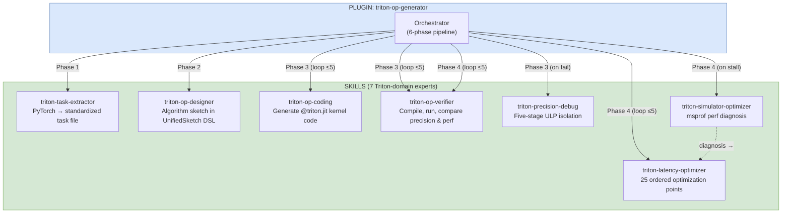
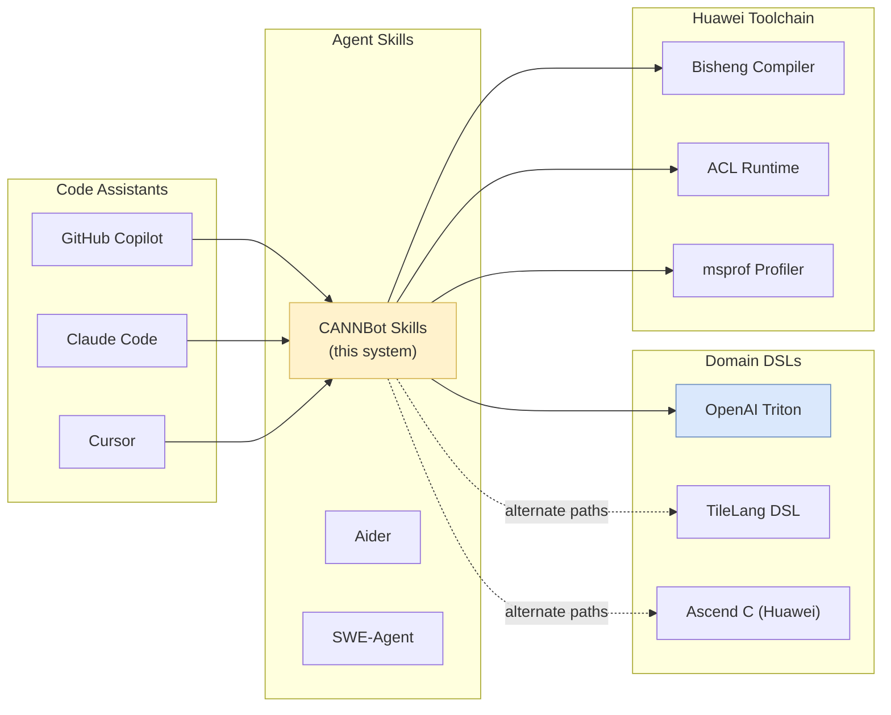

# CANNBot Skills: Triton Ascend Development Workflow

**Repository:** [cann/cannbot-skills](https://gitcode.com/cann/cannbot-skills)  
**Inspected revision:** `326a6b47210fc31a9c225f1643778a4cc733e57c` (main, 2026-08-03)

**Related pages:** [Triton Ascend Overview](./index.md), [Triton Ascend Operator Mechanisms](./operator-mechanisms.md), [Frameworks Overview](../index.md)

## TL;DR

**What:** CANNBot provides seven specialized Triton-domain skills that together form an end-to-end AI-assisted pipeline for developing optimized Triton Ascend kernels — from extracting operator tasks out of existing PyTorch code, through algorithm design and code generation, to verification, precision debugging, latency optimization, and simulator-driven bottleneck diagnosis.

**How:** The <a class="code-link" href="../../../external-repos/cannbot-skills/plugins-official/triton-op-generator/AGENTS.md#L35" data-code-repo="cannbot-skills-326a6b47210f" data-code-path="plugins-official/triton-op-generator/AGENTS.md" data-code-line="35"><code>triton-op-generator</code></a> Plugin orchestrates the skills across six phases in a structured pipeline. Each skill is an independent expert agent that receives structured inputs, produces structured outputs, and hands off to the next phase. The pipeline is iterative: both code generation (Phase 3) and performance optimization (Phase 4) loop up to 5 iterations, with a "Conductor" analyzing failures between attempts.

**The number:** The optimizer alone defines 25 distinct optimization points, each with explicit hit conditions and reference documentation — covering [tiling](../../terms/matrix-tiling.md), vectorization, memory access, loop transforms, and NPU-specific Cube/MTE3 pipeline decoupling.

## The Big Picture

Below is the CANNBot Plugin→Agent→Skill architecture applied to Triton Ascend development.



*The triton-op-generator Plugin orchestrates seven domain skills across six pipeline phases. Phases 3 and 4 are iterative: the orchestrator maintains state (iteration, history, previous code, error feedback) and calls skills in a loop until success or max iterations. The simulator-optimizer skill bridges Phase 4 stalls by providing evidence-driven bottleneck diagnosis that feeds back into the latency optimizer.*

Editable source: [cannbot-triton-architecture.mmd](assets/cannbot-triton-architecture.mmd).

## Why CANNBot Skills Exist for Triton Ascend

Writing performant Triton Ascend kernels is notoriously hard because:

1. **API divergence.** GPU Triton's `tl.dot` semantics, `num_warps`/`num_stages` parameters, and atomics behavior differ from Ascend's `triton_ascend` DSL. Blind porting produces silently incorrect or slow code.
2. **Hardware opacity.** Ascend NPUs have a Cube/Vector/MTE3 pipeline architecture with different bottlenecks than CUDA cores. Without simulator profiling, developers guess at what's slow.
3. **Compiler sensitivity.** The Bisheng compiler's scalar/vector lowering decisions can cause ULP-level precision deviations that are invisible until verification.
4. **Optimization combinatorics.** With 25 optimization points (tiling, vectorization, loop transforms, Cube-MTE3 decoupling, workspace materialization, etc.), manual trial-and-error is prohibitively slow.

CANNBot Skills encode the distilled expertise of Ascend kernel engineers into reusable, composable AI agents that each own one part of the problem.

## The Landscape

The CANNBot Skills ecosystem sits at the intersection of several tooling categories:



*CANNBot Skills act as an intermediary between AI coding assistants and the Ascend toolchain. They translate high-level operator requirements into domain-specific DSL code (Triton Ascend, TileLang, or Ascend C), then invoke the Bisheng compiler, ACL runtime, and msprof profiler for verification and optimization. Unlike general-purpose coding agents, each skill has baked-in knowledge of Ascend hardware constraints and compiler behavior.*

**Prior approaches:** Manually writing Ascend kernels required deep expertise in CANN APIs and the Bisheng compilation pipeline. GPU-first Triton developers had to learn an entirely different hardware model. Automated kernel generation tools (e.g., AutoTVM, Ansor) targeted GPU architectures and produced unreadable code. CANNBot's approach — composable, inspectable AI skills with Ascend-specific knowledge — is novel in combining automation with transparency.

Editable source: [cannbot-landscape.mmd](assets/cannbot-landscape.mmd).

## The Core Idea

Each CANNBot Triton skill is a **self-contained expert** that receives structured inputs, loads only the reference knowledge it needs (progressive disclosure), produces structured outputs, and passes them to the next skill in the pipeline. The orchestrator (the Plugin) manages state across phases: iteration counts, history of attempts, error feedback, and optimization momentum. Skills never call each other directly — the orchestrator decides when to loop back, when to escalate to precision debugging, and when to invoke simulator profiling as a last resort.

## The Seven Triton Skills

### Skill Map

| Skill | Phase | Role | Inputs | Outputs |
|-------|-------|------|--------|---------|
| `triton-task-extractor` | 1 | Extract standardized task from PyTorch code | Python source, optional JSON case manifest | Self-contained task module with `Model` + `get_inputs()` |
| `triton-op-designer` | 2 | Design algorithm sketch | `task_desc`, `arch`, optional GPU kernel ref, template constraints | UnifiedSketch design document |
| `triton-op-coding` | 3 | Generate `@triton.jit` kernel code | `task_desc`, `sketch`, optional GPU ref, previous errors | `ModelNew` with pure Triton kernel |
| `triton-op-verifier` | 3, 4 | Compile, run, compare precision & benchmark | Generated code path, task file, op name | Pass/fail, error summary, perf data |
| `triton-precision-debug` | 3 (on fail) | Five-stage ULP isolation | Code, task, verify failure JSON, iteration history | Root cause, fixed code, verification advice |
| `triton-latency-optimizer` | 4 | Apply 25 ordered optimization points | Code file, output path, NPU ID, arch | Optimized code, which point was hit, consistency proof |
| `triton-simulator-optimizer` | 4 (on stall) | msprof bottleneck diagnosis | Kernel code, NPU device | Bottleneck type, hot source lines, latency-optimizer point mapping |

---

### 1. `triton-task-extractor` — Standardizing the Input

This skill converts arbitrary PyTorch operator code into a **standardized task format** that all downstream skills can consume. It supports two modes:

- **Single-case:** The Python source contains `Model(forward)` + `get_inputs()` returning one set of inputs. The skill inlines all custom dependencies into a self-contained file.
- **Multi-case:** The Python source contains `get_input_groups()` with a companion JSONL case manifest. The skill **byte-copies both files unchanged** — no rewriting, no downgrade to single-case.

The key design constraint: the output must pass <a class="code-link" href="../../../external-repos/cannbot-skills/ops/triton-task-extractor/scripts/validate_task.py#L442" data-code-repo="cannbot-skills-326a6b47210f" data-code-path="ops/triton-task-extractor/scripts/validate_task.py" data-code-line="442"><code>validate_task.py</code></a>, which statically checks the `Model`/`get_inputs`/`get_init_inputs` contract and runs a forward pass.

---

### 2. `triton-op-designer` — Algorithm Sketch Before Code

This is the **most architecturally distinctive** skill. Before writing any code, it produces a **UnifiedSketch DSL design document** — a structured, human-readable algorithm description that includes:

- Grid decomposition strategy
- Tiling scheme (which dimensions, block sizes)
- Data flow (loads, compute, stores per tile)
- Parallelism strategy (program-level, tile-level)

The designer loads:

1. **Mandatory:** Sketch DSL syntax and design patterns from <a class="code-link" href="../../../external-repos/cannbot-skills/ops/triton-op-designer/references/sketch-design.md#L1" data-code-repo="cannbot-skills-326a6b47210f" data-code-path="ops/triton-op-designer/references/sketch-design.md" data-code-line="1"><code>sketch-design.md</code></a>
2. **Mandatory:** Hardware specs from <a class="code-link" href="../../../external-repos/cannbot-skills/ops/npu-arch/references/npu-arch-guide-triton.md#L1" data-code-repo="cannbot-skills-326a6b47210f" data-code-path="ops/npu-arch/references/npu-arch-guide-triton.md" data-code-line="1"><code>npu-arch-guide-triton.md</code></a> and <a class="code-link" href="../../../external-repos/cannbot-skills/ops/npu-arch/references/npu-hardware-params.md#L1" data-code-repo="cannbot-skills-326a6b47210f" data-code-path="ops/npu-arch/references/npu-hardware-params.md" data-code-line="1"><code>npu-hardware-params.md</code></a>
3. **Selective:** Exactly 2 case studies chosen by operator type match, such as <a class="code-link" href="../../../external-repos/cannbot-skills/ops/triton-op-designer/references/cases/matmul-swizzle2d.md#L1" data-code-repo="cannbot-skills-326a6b47210f" data-code-path="ops/triton-op-designer/references/cases/matmul-swizzle2d.md" data-code-line="1"><code>matmul-swizzle2d.md</code></a> for matmul and <a class="code-link" href="../../../external-repos/cannbot-skills/ops/triton-op-designer/references/cases/reduction-amax-large.md#L1" data-code-repo="cannbot-skills-326a6b47210f" data-code-path="ops/triton-op-designer/references/cases/reduction-amax-large.md" data-code-line="1"><code>reduction-amax-large.md</code></a> for reduction
4. **Conditional:** Category-specific template constraints when supplied in the generated task workspace

The sketch is then checked against **Layer 1 constraints** (hard rules like "never flatten a 2D transpose into a 1D gather kernel") before proceeding.

---

### 3. `triton-op-coding` — Pure Triton, No PyTorch Degradation

This skill's defining constraint: **the generated code must be pure Triton Ascend, with zero PyTorch computation in `forward()`.** The `forward()` method is allowed only to:

- Allocate output buffers (`torch.empty`, `torch.zeros`)
- Reshape/permute (no computation)
- Query metadata (`.shape`, `.dtype`, `.device`)
- Launch `@triton.jit` kernels

Everything else — `torch.matmul`, `F.softmax`, tensor operators like `+`/`*`/`@`, `nn.Module` calls — is forbidden. The skill explicitly checks for each banned pattern and rejects code that degrades to PyTorch.

---

### 4. `triton-op-verifier` — Precision and Performance Gate

The verifier is more than a pass/fail checker. It implements a **five-category precision decision matrix**:

| Category | Condition | Error Requirement |
|----------|-----------|-------------------|
| Non-compute | `--non-compute` flag | Bit-exact (via view-as-int) |
| Bool output | Output dtype is `bool` | `torch.equal` strict equality |
| Integer compute | Input is int, output is int | Exact match: `actual == golden` |
| Quantized fp→int | Float input, int output | Element-wise diff ≤ 1 |
| Float compute | Any float output | Three AND conditions (see below) |

For float compute, three conditions must ALL pass:

1. **Max error cap:** `|diff| <= atol + rtol * |golden|` for 100% of finite elements
2. **Matched ratio:** ≥90% of elements meet dtype-specific relative thresholds
3. **MERE:** Mean element-wise relative error < dtype-specific threshold

After precision passes, it runs <a class="code-link" href="../../../external-repos/cannbot-skills/ops/triton-op-verifier/scripts/benchmark.py#L774" data-code-repo="cannbot-skills-326a6b47210f" data-code-path="ops/triton-op-verifier/scripts/benchmark.py" data-code-line="774"><code>benchmark.py</code></a> and reports latency + speedup vs. the reference PyTorch implementation.

---

### 5. `triton-precision-debug` — Five-Stage ULP Isolation

When verification fails due to ULP-level precision issues (not shape mismatches or NaN/Inf), this skill applies a **five-stage isolation methodology**:

| Stage | Method | Purpose |
|-------|--------|---------|
| 0 | Pre-checks | Eliminate NaNs, uninitialized memory, dtype bugs |
| 1 | End-to-end diff | Find the worst-case element, narrow the search |
| 2 | Micro-benchmarking | Isolate each atomic operation in its own minimal kernel, compare 1:1 with torch |
| 3 | Compiler lowering | Check Bisheng scalar/vector decisions for the failing operation |
| 4 | Numerical stability | Analyze expression trees for catastrophic cancellation, division ordering |
| 5 | Architecture workaround | Suggest NPU-specific fixes (e.g., forced vector path, different constant encoding) |

The most common root cause found at Stage 2: constant division (`x / 127.0`) producing different rounding than PyTorch due to Bisheng's scalar vs. vector lowering choice.

---

### 6. `triton-latency-optimizer` — 25 Ordered Optimization Points

This skill applies optimizations in a **strict sequential order**, one at a time, verifying after each. The order matters — earlier points (e.g., making parameters `tl.constexpr`) unlock later ones (e.g., autotune).

The 25 points, grouped by category:

| # | Category | Point | Example Trigger |
|---|----------|-------|----------------|
| 1 | Parameters | Constexpr staticization | Fixed args not declared `tl.constexpr` |
| 2 | Tiling | Tiling optimization | Strided access on non-contiguous reduction axis |
| 3 | Grid | Core partitioning | Grid size mismatched with physical core count |
| 4 | Memory | Discrete access | Random-indexed `tl.load` from kernel args |
| 5 | Vectorization | Scalar→Vector | Scalar broadcast/reduction/control flow |
| 6 | Vectorization | Avoid scalar lowering | Arithmetic ops meeting compiler downgrade conditions |
| 7 | Pass fusion | Eliminate redundant passes | Multiple traversals computing different stats |
| 8 | Loop | Dimension merge | ≥3 nested loops over contiguous dims |
| 9 | Math | Libdevice functions | Hand-written math where `tl.math` exists |
| 10 | Loop | Loop-invariant hoisting | Inner loop reloads values constant across outer |
| 11 | Memory | Load reordering | Loads blocked by data dependencies |
| 12 | Dispatch | Grid shape specialization | Single kernel for both small and large workloads |
| 13 | Tuning | Autotune | Tunable `tl.constexpr` params without `@triton.autotune` |
| 14 | Strategy | Mixed strategy dispatch | Shape/dtype-dependent kernel selection |
| 15 | Normalization | Dim-merge + large-block accumulation | Nested loops with low mask coverage in stats kernels |
| 16 | Copy | Continuous copy aggregation | Multi-chunk copy with contiguous input |
| 17 | Boundary | Redundant boundary ops | Unnecessary `tl.where`/`* mask` proven by KVR analysis |
| 18 | Multi-case | Kernel splitting | Generic kernel <0.8× torch speedup with multiple cases |
| 19 | Pipeline | Cube-MTE3 decoupling | Cube output + atomic scatter interleaved in same loop |
| 20 | Fusion | Host-side tensor concat | Composite dot product `a·c + b·d` with contiguous segments |
| 21 | Pipeline | Workspace materialization | Multiple outputs with conflicting loop traversal orders |
| 22 | Latency | Tile merge for latency-bound | Dot call overhead dominating with <5% compute utilization |
| 23-24 | Specialized | Interpolate/Pooling | Domain-specific optimizations for upsample and pooling |
| 25 | Analysis | IR analysis | Always executed last as catch-all |

The skill outputs which optimization point it hit, and the verifier confirms correctness after each application.

---

### 7. `triton-simulator-optimizer` — Evidence-Driven Bottleneck Diagnosis

This skill is the "last resort" — invoked only when the latency optimizer has exhausted its 25 points but speedup is still below target. It uses `msprof op simulator` to collect per-instruction pipeline statistics from the actual NPU hardware, then produces a **diagnosis report** that maps bottlenecks back to specific latency-optimizer points.

The key architectural decision: this skill **only collects data and diagnoses** — it never modifies code. The fix always goes through the latency optimizer. This separation of concerns prevents the simulator-optimizer from accumulating a parallel optimization knowledge base.

## The Six-Phase Pipeline

```text
Phase 0: Confirm parameters (arch, input mode A/B)
    │
Phase 1: Task construction (extractor or GPU-Kernel self-build)
    │
Phase 2: Algorithm design (precheck → designer → Layer 1 compliance)
    │
Phase 3: Code generation + verification (loop ≤5)
    │   ┌─ coder generates
    │   ├─ verifier checks
    │   ├─ on fail: conductor analyzes → precision debug → back to coder
    │   └─ on pass: proceed
    │
Phase 4: Performance optimization + verification (loop ≤5)
    │   ┌─ latency-optimizer applies one point
    │   ├─ verifier confirms correctness + measures speedup
    │   ├─ if stalled: simulator-optimizer diagnoses → back to optimizer
    │   └─ if target met: proceed
    │
Phase 5: Output report (summary, perf data, GPU comparison if available)
    │
Phase 6: Session export (session.jsonl + session.md for audit trail)
```

### Phase 0: Parameter Confirmation

The orchestrator detects the hardware architecture (`ascend910b1` by default, or from `npu-smi info`). It also classifies the input mode:

- **Mode A (standard):** User provides a PyTorch reference implementation. The task extractor builds the task file.
- **Mode B (GPU kernel):** User provides only a GPU Triton kernel. The orchestrator constructs a `Model` that wraps the kernel's semantics, using a pre-computed serialized GPU output when available.

### Phase 2: Layer 1 Compliance Gate

Before calling the designer, the orchestrator checks the generated task workspace for a category-specific template. This file contains **Layer 1 constraints** — hard architectural rules derived from past experience with that operator category. Example constraints:

> "For layout-transform operators, the sketch MUST NOT use a single 1D element-wise gather kernel as the main path. Instead, provide separate kernel paths for 2D transpose, batch transpose, swap adjacent dims, reverse dims, and move size-1 dims."

If the sketch violates any Layer 1 constraint, the orchestrator sends it back to the designer with a `conductor_suggestion`. This gate prevents architectural mistakes from reaching the code generation phase.

### Phase 3-4: Iterative Loops with Conductor Analysis

Both Phase 3 (code generation) and Phase 4 (optimization) run as iterative loops. After each attempt, a **Conductor** (part of the orchestrator) analyzes the failure:

- For code generation failures: extracts the specific error, identifies whether it's a syntax bug, API misuse, or precision issue, and passes structured feedback (`verifier_error`, `conductor_suggestion`) to the next iteration.
- For optimization failures: checks whether the applied optimization point actually helped, and decides whether to continue the linear progression or invoke the simulator for diagnosis.

## Design Patterns Worth Reusing for triton-ascend Development

### 1. Progressive Disclosure via Reference Directories

Every skill keeps its core logic in a skill definition, such as the <a class="code-link" href="../../../external-repos/cannbot-skills/ops/triton-task-extractor/SKILL.md#L14" data-code-repo="cannbot-skills-326a6b47210f" data-code-path="ops/triton-task-extractor/SKILL.md" data-code-line="14"><code>task-extractor skill definition</code></a>, and stores detailed reference material separately. This is a clean separation that prevents context bloat. When writing triton-ascend code, the same pattern applies: keep the kernel logic concise and reference hardware specs from separate files.

### 2. The UnifiedSketch DSL as a Design Intermediate

Writing a sketch before code forces the designer to think about tiling, data flow, and parallelism at the right level of abstraction — not too high-level (vague English) and not too low-level (syntax details). This is an effective pattern for any complex kernel: draft the algorithm in structured pseudo-code before touching Triton syntax.

### 3. Ordered Optimization with Post-Verification

The latency optimizer's strict "one point at a time, verify after each" discipline prevents the most common optimization failure mode: applying multiple changes simultaneously and being unable to attribute a performance regression. For manual triton-ascend development, adopt the same discipline: change one thing, profile, confirm.

### 4. Template Files as Institutional Memory

The category-specific templates encode lessons learned from past kernels of the same category. For triton-ascend development, maintain a similar catalog: for each operator category (matmul, reduction, element-wise, normalization, attention), record which tiling strategies worked, which failed, and which NPU-specific gotchas apply.

### 5. Simulator Profiling as a Last Resort, Not First Guess

The simulator-optimizer is invoked only when structured optimization is exhausted. This prevents the common anti-pattern of running a profiler first, seeing a hot function, and micro-optimizing it without addressing higher-level structural issues. For triton-ascend: apply tiling, vectorization, and loop transforms first; profile only when those are exhausted.

### 6. Precision Debugging as Micro-Benchmarking

The five-stage isolation method — especially Stage 2's micro-benchmarking — is directly reusable. When a triton-ascend kernel produces unexpected numerical differences, isolate each operation into its own minimal `@triton.jit` kernel and compare against PyTorch one operation at a time. The most common root cause is constant division behavior differences in the Bisheng compiler.

## How to Use These Patterns When Writing triton-ascend Kernels

### Bootstrapping a New Kernel

1. **Extract the task:** Take your PyTorch reference implementation and standardize it into a self-contained file with `Model(forward)` + `get_inputs()`. This ensures you have a clear specification and a precision baseline.

2. **Design before coding:** Write an algorithm sketch covering grid decomposition, tiling, data flow, and parallelism strategy. Check it against known constraints for your operator category.

3. **Generate pure Triton:** Implement the kernel in `@triton.jit` without any PyTorch computation in `forward()`. All computation must happen inside the kernel.

4. **Verify and iterate:** Run the verifier to check precision against the PyTorch reference. Use the micro-benchmarking approach from `triton-precision-debug` if there are ULP-level differences.

5. **Optimize systematically:** Apply the 25 optimization points in order, verifying correctness and measuring speedup after each change. Profile with `msprof` only when the structured optimization path is exhausted.

### Reference: Optimization Points Most Likely to Help

Based on CANNBot's collected experience across hundreds of kernels, the optimization points with the highest hit rate for triton-ascend:

| Rank | Point # | Name | Why It Matters on Ascend |
|------|---------|------|--------------------------|
| 1 | 5 | Scalar→Vector | Ascend Vector unit is wide; scalar loops waste most of it |
| 2 | 1 | Constexpr staticization | Enables compiler optimizations that are blocked by dynamic params |
| 3 | 3 | Core partitioning | NPU core count is fixed; grid must match for full utilization |
| 4 | 8 | Dimension merge | Reduces loop overhead; Ascend benefits more than GPU due to different pipeline |
| 5 | 19 | Cube-MTE3 decoupling | Unique to Ascend; GPU has no equivalent pipeline conflict |

## Open Questions

- The category-specific template system currently has no formal schema — Layer 1 constraints and Layer 2 algorithm skeletons are mixed in prose. A structured format would enable automated constraint checking.
- The simulator-optimizer's mapping from `msprof` pipeline statistics to specific latency-optimizer points relies on heuristics. Quantifying how often these mappings are correct would improve trust in the diagnosis loop.
- Multi-case kernel splitting (optimization point 18) uses a heuristic threshold (`speedup_vs_torch < 0.8`). This threshold may need tuning per operator category and NPU generation.
