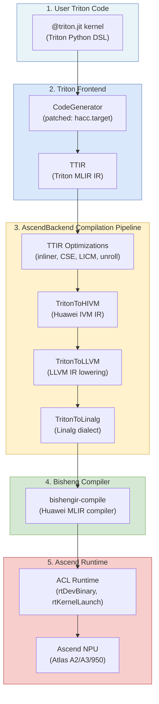
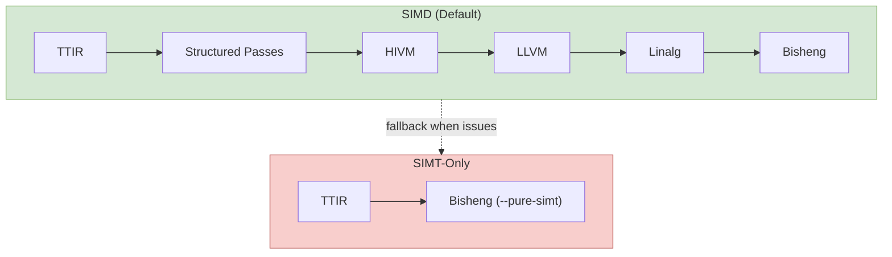

# Triton Ascend: Ascend NPU Backend for Triton

**Repository:** [triton-lang/triton-ascend](https://github.com/triton-lang/triton-ascend)  
**Inspected revision:** `41f499924da1d58955196c946895597e992127f0` (main, 2026-07-28)  
**Version:** 3.6.0-dev (pip release: 3.2.1)

**Related pages:** [Triton: Tiled GPU Kernel Language](../triton-language/index.md), [Triton in vLLM and vllm-ascend](../triton-language/triton-in-vllm.md), [Frameworks Overview](../index.md)

## TL;DR

**What:** Triton Ascend is an Ascend NPU backend plugin for OpenAI's Triton language, letting developers write GPU-style tiled kernel code once and run it on Huawei Ascend NPUs (Atlas A2/A3/950 series).

**How:** It registers as a third-party Triton backend, intercepts the standard compilation pipeline with Ascend-specific MLIR passes (TTIR → HIVM → LLVM → Linalg), then invokes Huawei's Bisheng compiler to produce NPU binary, loaded and launched via the ACL (Ascend Compute Language) runtime.

**The number:** The backend supports ~85% of Triton's Python APIs with contiguous memory access patterns, covering matmul, flash-attention, convolution, and element-wise kernels.

## The Big Picture



*① You write a Triton kernel with `@triton.jit`. ② The Triton frontend lowers it to TTIR, with AscendBackend patching the code generator to target `hacc`. ③ Ascend-specific MLIR passes convert TTIR through Huawei IVM IR, LLVM IR, and Linalg dialect. ④ Huawei's Bisheng compiler compiles the Linalg IR into Ascend NPU binary. ⑤ The ACL runtime loads and launches the binary on the NPU.*

Editable source: [compilation pipeline Mermaid diagram](assets/compilation-pipeline.mmd).

## Why Triton Ascend Exists

Triton was designed for NVIDIA and AMD GPUs. Its original compilation pipeline targets PTX/LLVM for CUDA and HIP backends. Ascend NPUs use a completely different hardware architecture and toolchain — Huawei's CANN (Compute Architecture for Neural Networks) stack with the Bisheng compiler and ACL runtime.

Triton Ascend fills this gap by providing:

1. **A Triton backend** that intercepts the standard compilation flow and redirects it to Ascend's toolchain.
2. **Ascend-specific MLIR passes** that lower Triton IR into dialects the Bisheng compiler understands.
3. **A runtime driver** (`NPUDriver` + `NPULauncher`) that loads compiled kernels and launches them on the NPU.
4. **CANN extension ops** that expose Ascend-specific hardware features (fixpipe, sync barriers, cube-vector pipeline) to Triton kernels.

Think of it this way: Triton Ascend sits between the Triton language and the Ascend NPU, translating Triton's tile-based abstractions into something the Ascend toolchain can compile and execute.

## Architecture: The Five Layers

The triton-ascend codebase is organized into five logical layers. Understanding these layers is the key to navigating the repository.

### Layer 1: Backend Registration

When you `import triton`, triton-ascend registers itself as an available backend.

**How registration works:**

1. `third_party/ascend/backend/name.conf` contains the single word `ascend` — this is the backend name.
2. During `pip install`, setup.py's `BackendInstaller` discovers the `name.conf` file and installs the backend package.
3. At runtime, `python/triton/backends/__init__.py` scans installed packages for ones with a `name.conf` file.

**Key file:** `python/triton/backends/__init__.py` — the `_discover_backends()` function walks all installed packages looking for `name.conf` files. When it finds `ascend`, it loads `third_party/ascend/backend/` as the backend module.

### Layer 2: Compilation Pipeline

The compilation pipeline is the heart of triton-ascend. It is defined in `AscendBackend.add_stages()` in `third_party/ascend/backend/compiler.py`.


**Step-by-step:**

| Stage | What it does |
|-------|-------------|
| `make_ttir()` | Standard Triton optimizations: inliner, CSE, LICM, loop unroll |
| `triton_to_structure` | Mask fallback conversion, dynamic offset handling |
| `triton_to_annotation` | Annotates TTIR with Ascend-specific metadata |
| `triton_to_hivm` | Lowers to Huawei Intermediate Virtual Machine IR |
| `triton_to_hfusion` | Operator fusion pass |
| `triton_to_llvm` | LLVM IR lowering |
| `triton_to_linalg` | Final conversion to Linalg dialect (ttadapter format) |
| `bishengir-compile` | Huawei's Bisheng compiler compiles Linalg → NPU `.o` binary |

There are **two hardware-specific code paths**:

- **A2/A3 path** (`linalg_to_bin_enable_npu_compile_A2_A3`): For Atlas A2/A3 series (Ascend 910B, etc.).
- **910/95 path** (`linalg_to_bin_enable_npu_compile_910_95`): For Ascend 910.95 / 950 series, with extra optimizations like dynamic cube-vector pipeline and UB refine.

There is also a **SIMT-only fast path** (`ttir_to_npubin()`) that bypasses the linalg stages entirely — TTIR goes directly to bishengir-compile with SIMT flags. This is useful for debugging or when the linalg path hits issues.

### Layer 3: Ascend MLIR Passes (C++)

The C++ MLIR passes live under `third_party/ascend/lib/` and `third_party/ascend/include/`. Each directory under `lib/` implements one transformation.

| Pass | Purpose |
|------|---------|
| `TritonAscend/` | The `TritonAscend` MLIR dialect — custom ops and attributes for Ascend |
| `TritonToHIVM/` | Lowers Triton IR to Huawei Intermediate Virtual Machine IR |
| `TritonToLLVM/` | LLVM IR code generation for Ascend |
| `TritonToLinalg/` | Final lowering to Linalg dialect |
| `TritonToHFusion/` | Operator fusion optimization |
| `TritonToAnnotation/` | Adds Ascend hardware annotations to TTIR |
| `AutoBlockify/` | Maps Triton program blocks to Ascend aicore/aivector cores |
| `DynamicCVPipeline/` | Cube-Vector pipeline management with data flow analysis |
| `TritonToStructured/` | Structured operations conversion |
| `TritonToUnstructure/` | SIMT unstructured path conversion |

The C++ components are bridged to Python via pybind11 in `third_party/ascend/triton_ascend.cc`.

### Layer 4: Runtime Driver

The runtime layer handles kernel loading and execution on the Ascend NPU.

| File | Role |
|------|------|
| `third_party/ascend/backend/driver.py` | `NPUDriver` (device management) and `NPULauncher` (kernel launch) |
| `third_party/ascend/backend/npu_utils.cpp` | C++ bridge: registers kernel binaries via `rtDevBinary`, integrates with ACL |
| `third_party/ascend/backend/runtime/autotuner.py` | Ascend autotuner with CV autotune, UB (Unified Buffer) tuning, and DSL analysis |

**How kernel launch works:**

1. After compilation, the kernel binary is a `.o` object file.
2. `NPULauncher` generates a small C wrapper stub that calls `rtKernelLaunch`.
3. The wrapper is compiled into a `.so` shared library.
4. The `.so` is loaded and the kernel is launched on the NPU via the ACL runtime.

### Layer 5: CANN Extension Ops

Triton Ascend exposes Ascend-specific hardware features through the `triton.language.cann` extension module.

**Key extension ops:**

| Op | Purpose |
|----|---------|
| `fixpipe` | Controls the Ascend fixpipe (hardware pipeline mode) |
| `sync_block_*` | Synchronization barriers between blocks |
| `debug_barrier` | Debug barrier for kernel debugging |
| `conv1d` | 1D convolution using Ascend's cube unit |
| `ascend_address_space` | Ascend memory address space specification |

These ops live in `third_party/ascend/language/cann/extension/` and have their own semantic checker, code generator, and MLIR builder.

## Key Design Decisions

Understanding these decisions will help you navigate the codebase:

### 1. Monkey-patching, not forking

Triton Ascend does **not** fork Triton. It monkey-patches upstream Triton's `CodeGenerator.__init__` to inject the `hacc.target` attribute. This is done in `third_party/ascend/backend/__init__.py`:

```python
# Injects hacc.target into the code generator
original_init = CodeGenerator.__init__
def patched_init(self, ...):
    original_init(self, ...)
    self.target = "hacc"
CodeGenerator.__init__ = patched_init
```

This approach means triton-ascend can ship as a pip package that installs alongside upstream Triton without conflicts.

### 2. Three compilation modes

Triton Ascend supports three compilation modes to balance performance and correctness:

| Mode | Description | When to use |
|------|------------|-------------|
| **SIMD** (default) | Structured, vectorized compilation through the full linalg pipeline | Normal usage |
| **Unstructured-in-SIMT** | Hybrid mode combining structured and SIMT paths | When SIMD hits correctness issues |
| **SIMT-only** | Pure SIMT path bypassing linalg entirely | Debugging, fallback |

### 3. Auto-tuning is Ascend-specific

The Ascend autotuner (`autotuner.py`) is fundamentally different from NVIDIA's. It includes:

- **CV autotune:** Tunes the Cube-Vector pipeline balance for Ascend's hardware.
- **UB tuning:** Manages the Unified Buffer (UB) memory, which is the Ascend equivalent of GPU shared memory.
- **DSL analysis:** Parses the kernel source to extract tiling hints, split axes, and reduction axes automatically.

## Compilation Modes Comparison



## How to Navigate the Codebase as a Beginner

If you are new to both Triton and triton-ascend, here is the recommended reading order:

### Stage 1: Understand what Triton is

Start with the [Triton overview page](../triton-language/index.md). Understand: tile-based programming, `@triton.jit`, `tl.program_id`, `tl.load`/`tl.store`, and the basic matmul kernel.

### Stage 2: Understand Triton's backend system

Read these files in order:

1. `python/triton/backends/__init__.py` — How backends are discovered.
2. `python/triton/backends/compiler.py` — The `BaseBackend` abstract class.
3. `python/triton/backends/driver.py` — The `DriverBase` abstract class.

These three files define the contract that any backend (including triton-ascend) must implement.

### Stage 3: Read the Ascend backend entry point

1. `third_party/ascend/backend/__init__.py` — See the monkey-patching and registration.
2. `third_party/ascend/backend/compiler.py` — `AscendBackend.add_stages()` is the heart. Read only this method first.
3. `third_party/ascend/backend/driver.py` — `NPULauncher.__call__()` shows the kernel launch flow.

### Stage 4: Trace one compilation end-to-end

Pick a simple test kernel (e.g., vector-add from `python/examples/`) and trace:

1. How `@triton.jit` triggers compilation.
2. How `AscendBackend.add_stages()` runs each pass.
3. How the Bisheng compiler invocation produces the `.o` file.
4. How `NPULauncher` loads and launches it.

### Stage 5: Explore advanced features

- `third_party/ascend/backend/runtime/autotuner.py` — Auto-tuning.
- `third_party/ascend/language/cann/extension/` — CANN extension ops.
- `third_party/ascend/lib/` — C++ MLIR pass implementations.

## Relationship to vllm-ascend

Triton Ascend is a **kernel-level backend** — it compiles and launches individual Triton kernels on Ascend NPUs. [vllm-ascend](https://github.com/vllm-project/vllm-ascend) is a **serving-system backend** that adapts the vLLM serving framework to run on Ascend hardware.

vllm-ascend uses triton-ascend for its Triton kernels but also implements custom AscendC kernels for performance-critical operations. See [Triton in vLLM and vllm-ascend](../triton-language/triton-in-vllm.md) for how they work together.

## Limitations

- **Not a fork:** Monkey-patching means triton-ascend depends on the internal API stability of upstream Triton.
- **~85% API coverage:** Non-contiguous memory patterns and some advanced Triton features may not work.
- **Hardware-specific:** Only supports Atlas A2/A3/950 series. Other Ascend NPUs are not supported.
- **CANN version lock:** Requires specific CANN and TorchNPU versions.
- **AscendNPU-IR submodule:** The Bisheng IR source is in a separate submodule hosted on gitcode.com, which may not be publicly accessible from all networks.

## Self-Test

After reading this page, you should be able to answer:

1. How does triton-ascend register itself as a Triton backend? (via `name.conf` + `BackendInstaller`)
2. What are the five layers of the architecture? (Registration, Compilation Pipeline, MLIR Passes, Runtime Driver, CANN Extensions)
3. What is the difference between the SIMD and SIMT compilation paths? (SIMD goes through full linalg pipeline; SIMT bypasses directly to Bisheng)
4. How does kernel launch work? (Compile to `.o` → wrap in C stub → compile to `.so` → load and launch via ACL)
5. What is the relationship between triton-ascend and vllm-ascend? (Kernel backend vs. serving-system backend)
