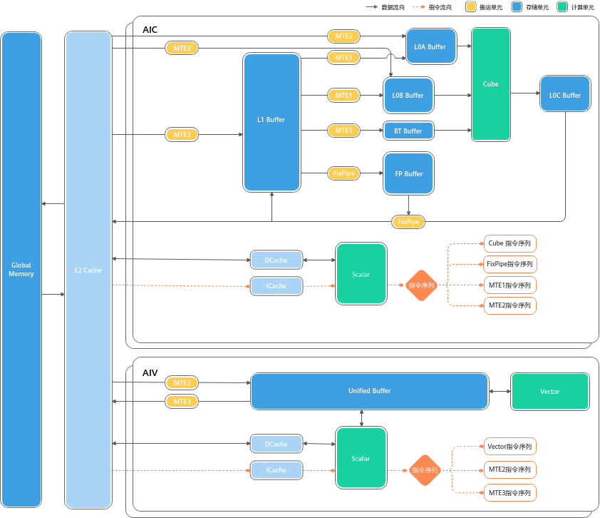
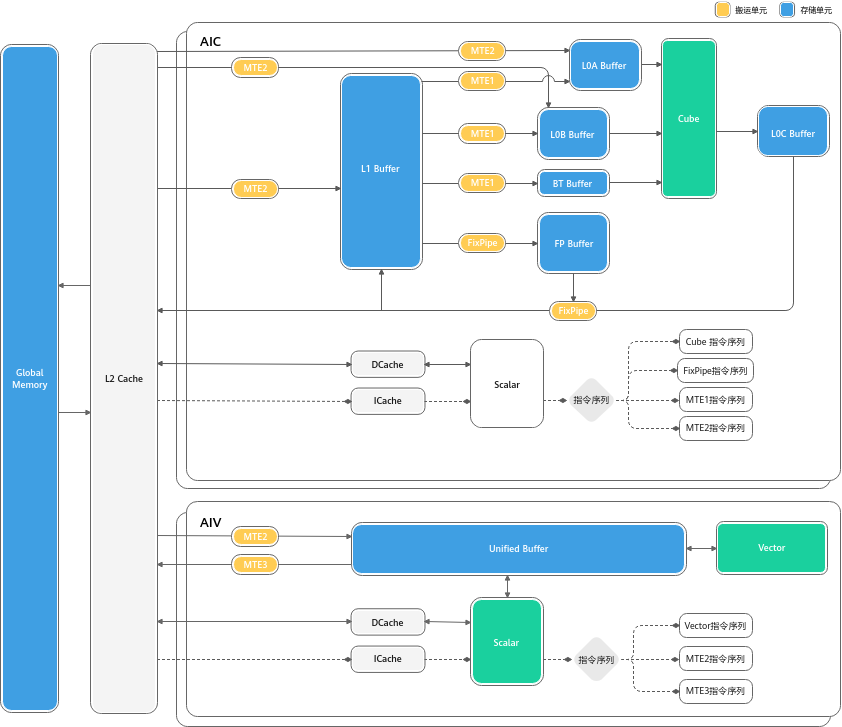
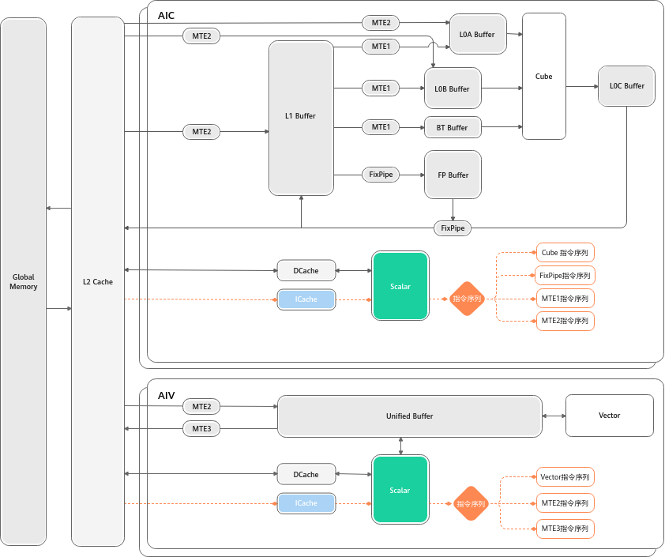
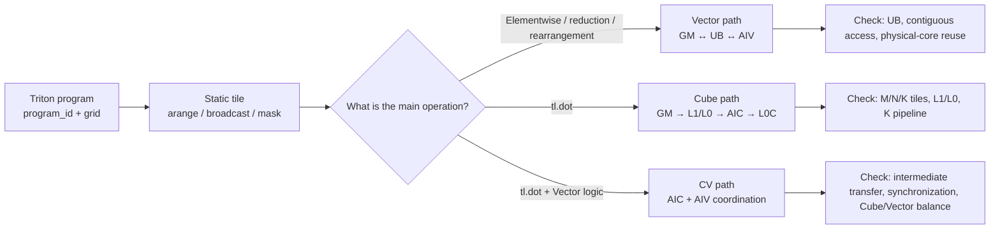
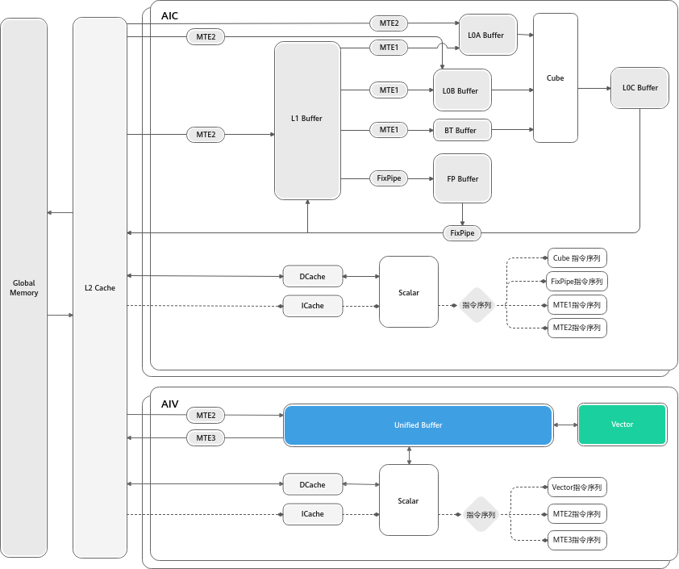
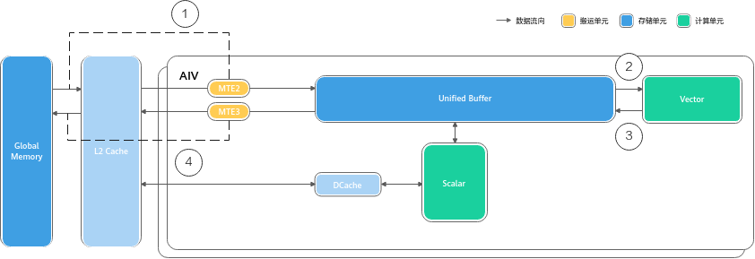
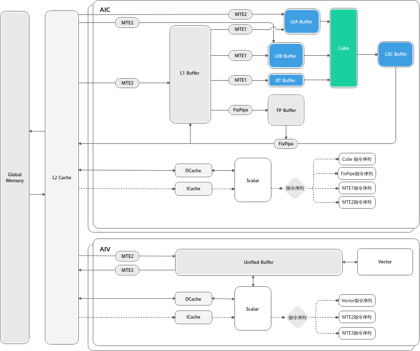
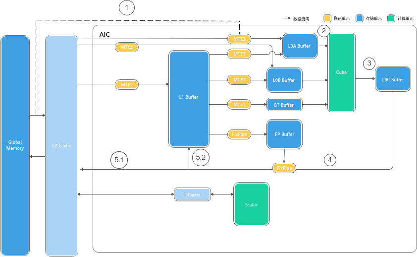
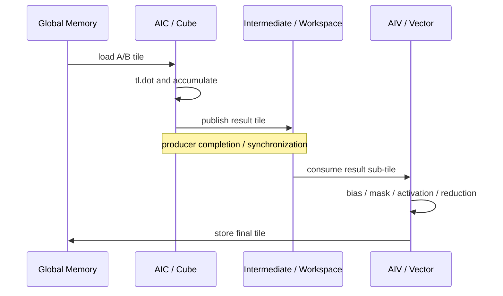

# Triton Ascend Operator Mechanisms: Vector, Cube, and CV Fusion

The goal of this note is not to memorize APIs. It is to build a mental model that you can use to read kernels, write kernels, and interpret profiling results:

> Which tile does a Triton program own? Where is that tile stored now? What moves it? What computes it? Which queue is waiting? Can the next tile's data movement overlap the current computation?

Once these six questions are clear, `BLOCK_SIZE`, `BLOCK_M/N/K`, the grid, multibuffering, and CV balance stop being parameters tuned by guesswork.

**Related pages:** [Triton Ascend compiler architecture](index.md), [Triton's tile programming model](../triton/index.md), and [Using Triton in vLLM](../triton/triton-in-vllm.md)

## At a Glance

| Operator type | Recognition signal | Main compute unit | Typical data path | First optimization goal |
|---|---|---|---|---|
| Vector | No `tl.dot`; elementwise operations, reductions, rearrangement, or gather/scatter | Vector Core / AIV | `GM → UB → Vector → UB → GM` | Feed the Vector unit with large contiguous tiles and reduce fine-grained GM access |
| Cube | `tl.dot` accounts for most of the work | Cube Core / AIC | `GM → L1/L0A/L0B → Cube → L0C → FixPipe` | Choose suitable M/N/K tiles and overlap data movement with matrix computation |
| CV fusion | Substantial Vector logic surrounds `tl.dot` | AIC + AIV coordination | Cube computation + Vector post-processing + required intermediate transfer/synchronization | Remove kernel boundaries and GM round trips without leaving either side waiting for long periods |

Do not equate a Triton tile with one particular Ascend buffer. A tile is a language-level value and unit of work. Based on the operation type, shape, dtype, and target hardware, the compiler lowers it to UB, L1, L0, registers, or a workspace and inserts the required movement and synchronization.

## 1. Start with the Hardware: Why AIC and AIV Affect Kernel Design



*An AI Core in Atlas A2 split mode. The upper AIC contains Cube, L1, L0A/L0B/L0C, and a dedicated Scalar unit; the lower AIV contains Vector, UB, and another Scalar unit. The original image comes from the [CANN 8.3.RCX basic architecture documentation](https://www.hiascend.com/document/detail/zh/CANNCommunityEdition/83RC1/opdevg/Ascendcopdevg/atlas_ascendc_10_0008.html), while this page's front matter records the immutable local snapshot.*

### 1.1 Three Compute Units

| Unit | Role | Common Triton counterpart |
|---|---|---|
| Scalar | Loops, branches, address/parameter calculation, and instruction dispatch | `program_id` calculation, loop bounds, pointer arithmetic, and control flow |
| Vector | SIMD-style elementwise operations, reductions, comparisons, conversions, and rearrangement | `+ - * /`, `tl.max/sum`, `tl.where`, casts, masks, and slices |
| Cube | Matrix multiply-accumulate | `tl.dot` and the GEMM or attention QK/PV operations built from it |

Scalar behaves more like an in-core scheduler than a small CPU for large-scale numerical computation. Complex branches, repeated scalar address calculations, and fragmented loops increase Scalar pressure. A performant kernel generally lets Scalar dispatch a regular, repeated tile pipeline instead of handling large amounts of data-dependent control flow.

### 1.2 Storage Is Not One Unified "Shared Memory"



*AI Core on-chip storage and data-movement paths. Vector primarily operates around UB, while Cube also uses L1, L0A, L0B, L0C, BT, and the FP Buffer.*

| Storage | Primary purpose | Kernel-design question |
|---|---|---|
| [GM](../../terms/global-memory.md) | High-capacity device memory | Total bytes, access contiguity, and repeated reads or writes of intermediate results |
| L2 Cache | Cache GM traffic | Whether cores reuse data and accesses match cache-line granularity |
| UB | Vector inputs, outputs, and temporaries | Whether `BLOCK_SIZE`, temporary tensors, and double buffers fit |
| L1 | On-chip staging and reuse of Cube inputs | Whether A/B tiles merit reuse and the K loop can be supplied steadily |
| L0A/L0B | Left and right Cube inputs | Shape, dtype, and layout of the M/K and K/N microtiles |
| L0C | Cube output and accumulation | Accumulator tile size and accumulation precision |
| FP Buffer | FixPipe parameters | Quantization, ReLU, or format-conversion parameters |

### 1.3 Data-Movement Engines Determine Whether Data Arrives on Time

| Movement unit | Main path | Intuition |
|---|---|---|
| MTE2 | `GM → UB/L1/L0A/L0B` | Moves external data on chip; Vector waiting on MTE2 usually indicates insufficient input supply |
| MTE1 | `L1 → L0A/L0B/BT` | Prepares left and right matrix microtiles for Cube |
| MTE3 | `UB → GM` | Writes Vector results back |
| FixPipe | `L0C → GM/L1` | Writes Cube results back and can convert formats or types along the way |

Optimization cannot consider computation alone. Even when `tl.dot` has high theoretical FLOPs, Cube remains idle if the A/B tiles do not reach L0A/L0B in time.

## 2. Why Instructions Can Run in Parallel: Scalar Dispatches Multiple Queues



*Scalar dispatches Cube, Vector, MTE1/MTE2/MTE3, and FixPipe instructions to separate queues. Instructions remain ordered within one queue, while different queues can overlap.*

A typical double-buffered timeline looks like this:

```text
time ──────────────────────────────────────────────────────────────>

MTE2     load tile 0      load tile 1      load tile 2
                    ↘                ↘
Vector/Cube          compute tile 0    compute tile 1    compute tile 2
                                  ↘                ↘
MTE3/FixPipe                       store tile 0      store tile 1
```

The important question is not whether multiple instructions exist, but whether their data dependencies allow them to overlap:

- Even if a later instruction in the same queue has been dispatched, it cannot assume that the preceding instruction has completed all reads and writes.
- Event synchronization constrains producers and consumers across different queues.
- `PipeBarrier` constrains the completion order of earlier and later data accesses within the same pipeline.
- `SetFlag/WaitFlag` establishes a producer-consumer relationship between two instruction queues.
- Normal Triton Ascend programming relies on the compiler to insert most synchronization. Understanding the underlying mechanism helps explain stalls; it is not a reason to hand-write barriers in every kernel.

## 3. A Unified Mental Model: From Triton Tiles to AI Core



*Editable source: [Ascend core dataflow](assets/ascend-core-dataflow.mmd).*

A program is not necessarily bound permanently to an exclusive physical core. A sensible grid usually covers the available physical cores first, then lets each program consume multiple logical tiles in an in-core loop. The GPU pattern of launching one program per small tile and leaving a large grid to hardware scheduling can create too many scheduling rounds on an NPU.

## 4. Vector: Design Contiguous Work Blocks Around UB



*Vector source and destination data reside in UB; MTE2 moves data in from GM, and MTE3 writes it back to GM. Vector instructions generally require addresses and operation lengths to satisfy alignment constraints.*



*Typical Vector flow: (1) MTE2 moves data from GM through L2 into UB; (2) Vector reads UB; (3) results return to UB; and (4) MTE3 writes them back to GM.*

### 4.1 Minimal Correct Kernel

```python
@triton.jit
def add_kernel(x_ptr, y_ptr, out_ptr, n_elements,
               BLOCK_SIZE: tl.constexpr):
    pid = tl.program_id(0)
    num_core = tl.num_programs(0)
    num_blocks = tl.cdiv(n_elements, BLOCK_SIZE)

    for block_idx in range(pid, num_blocks, num_core):
        offsets = block_idx * BLOCK_SIZE + tl.arange(0, BLOCK_SIZE)
        mask = offsets < n_elements

        x = tl.load(x_ptr + offsets, mask=mask, other=0.0)
        y = tl.load(y_ptr + offsets, mask=mask, other=0.0)
        out = x + y
        tl.store(out_ptr + offsets, out, mask=mask)
```

### 4.2 Line-by-Line Trace

1. `pid` determines which logical block the current program starts from.
2. `num_core` is the number of programs in the launch grid; it is usually chosen according to the number of available Vector Cores.
3. `range(pid, num_blocks, num_core)` is a grid-stride loop: the same program processes `pid`, `pid + num_core`, and `pid + 2*num_core` in sequence.
4. `tl.arange` constructs a statically sized tile. Its size affects transfer granularity and UB occupancy.
5. `mask` protects only the final incomplete block. `other=0.0` gives invalid loads a defined value.
6. Conceptually, `x`, `y`, and `out` are live at the same time, so the UB budget cannot account for only one input.

### 4.3 A Simple UB Budget

If three FP16 tiles are live simultaneously, ignoring compiler temporaries:

```text
UB bytes ≈ BLOCK_SIZE × 2 bytes × (x + y + out)
         ≈ BLOCK_SIZE × 6 bytes
```

The actual budget must also include masks, indices, type-conversion temporaries, reduction intermediates, and multibuffers. A practical process is:

1. List the tiles that are live simultaneously at the peak.
2. Calculate bytes by dtype; do not count an fp32 accumulator as fp16.
3. Leave headroom for compiler temporaries and alignment.
4. If UB overflows, first reduce the tile size or split the hidden dimension into subtiles.

### 4.4 From Contiguous Access to Complex Vector Operations

| Scenario | Main difficulty | Ascend-friendly rewrite |
|---|---|---|
| Row reduction | A row is too long, so temporaries and the reduction tree consume UB | Block the hidden dimension, reduce in segments, and combine partial results |
| Gather/scatter | Indices are scattered and GM requests are fragmented | Batch-load indices and data, rearrange in UB, then write back in larger groups |
| Dtype conversion | Dtypes have different throughput and alignment | Prefer `int32` for indices and lengths; check tile bytes before and after conversion |
| Short trailing axis | Automatic padding or poor transfer granularity | Borrow another axis, transpose, or merge multiple rows into a contiguous block |
| Multi-output fusion | Too many tiles are live simultaneously | Make lifetimes explicit, store in stages, and avoid unnecessary temporaries |

### 4.5 Diagnosing Vector Performance

| Symptom | First suspicion | Validation step |
|---|---|---|
| Vector busy, MTE idle | Compute-bound execution or inefficient Vector instructions | Simplify complex expressions/conversions and check dtype throughput |
| Vector waiting on MTE2 | Scattered GM access or tiles that are too small | Check strides, alignment, contiguity, and transfer granularity |
| Heavy MTE3 use | Too many outputs or intermediate write-backs | Evaluate fusion or reduce repeated stores |
| Low core utilization | Grid too small or uneven per-core work | Compare `num_blocks` with the number of Vector Cores |
| Too many dispatch rounds | Grid much larger than the number of physical cores | Fix the grid size and use an in-core grid-stride loop |

## 5. Cube: `tl.dot` Is Only the Entry Point; M/N/K Tiles Define the Design



*Cube reads the left and right matrices from L0A/L0B and produces and accumulates results in L0C. L1 is an important level for input reuse and staging.*



*Typical Cube flow: (1) inputs move on chip from GM; (2) A/B reach L0A/L0B; (3) Cube accumulates in L0C; (4) FixPipe reads the result; and (5) the result is written back to GM or L1.*

### 5.1 What the Three Tile Parameters Control

For `C[M, N] = A[M, K] @ B[K, N]`:

| Parameter | Controls | Benefit of increasing it | Cost of increasing it |
|---|---|---|---|
| `BLOCK_M` | Output rows computed by the current program | Greater A-tile and output reuse | Higher accumulator and A occupancy |
| `BLOCK_N` | Output columns computed by the current program | Greater B-tile and output reuse | Higher accumulator and B occupancy |
| `BLOCK_K` | Reduction width consumed by each `tl.dot` | More work per iteration and fewer loop iterations | Greater on-chip A/B occupancy, potentially limiting multibuffering |

The theoretical size of an fp32 accumulator is:

```text
accumulator bytes = BLOCK_M × BLOCK_N × 4
```

For example, a `128 × 128` fp32 accumulator is already 64 KiB. This does not yet include A/B tiles, masks, addresses, or double buffers, so a tile is not automatically better just because its output area is larger.

### 5.2 Minimal Matmul Structure

```python
@triton.jit
def matmul_kernel(a_ptr, b_ptr, c_ptr,
                  M: tl.constexpr, N: tl.constexpr, K: tl.constexpr,
                  stride_am: tl.constexpr, stride_ak: tl.constexpr,
                  stride_bk: tl.constexpr, stride_bn: tl.constexpr,
                  stride_cm: tl.constexpr, stride_cn: tl.constexpr,
                  BLOCK_M: tl.constexpr,
                  BLOCK_N: tl.constexpr,
                  BLOCK_K: tl.constexpr):
    pid = tl.program_id(0)
    num_pid_n = tl.cdiv(N, BLOCK_N)
    pid_m = pid // num_pid_n
    pid_n = pid % num_pid_n

    offs_m = pid_m * BLOCK_M + tl.arange(0, BLOCK_M)
    offs_n = pid_n * BLOCK_N + tl.arange(0, BLOCK_N)
    offs_k = tl.arange(0, BLOCK_K)
    acc = tl.zeros((BLOCK_M, BLOCK_N), dtype=tl.float32)

    for k0 in range(0, K, BLOCK_K):
        a = tl.load(
            a_ptr + offs_m[:, None] * stride_am
            + (k0 + offs_k)[None, :] * stride_ak,
            mask=(offs_m[:, None] < M)
            & ((k0 + offs_k)[None, :] < K),
            other=0.0,
        )
        b = tl.load(
            b_ptr + (k0 + offs_k)[:, None] * stride_bk
            + offs_n[None, :] * stride_bn,
            mask=((k0 + offs_k)[:, None] < K)
            & (offs_n[None, :] < N),
            other=0.0,
        )
        acc = tl.dot(a, b, acc)

    c_ptrs = (
        c_ptr + offs_m[:, None] * stride_cm
        + offs_n[None, :] * stride_cn
    )
    c_mask = (offs_m[:, None] < M) & (offs_n[None, :] < N)
    tl.store(c_ptrs, acc, mask=c_mask)
```

### 5.3 Explaining the Hardware Pipeline Through One K-Loop Iteration

The `k0` iteration can be understood in this order:

1. Scalar calculates A/B addresses from the strides and `offs_*`.
2. MTE2 moves the required tiles from GM into on-chip storage, commonly through L1.
3. MTE1 delivers the microtiles Cube needs to L0A/L0B.
4. Cube performs matrix multiply-accumulate and updates the corresponding accumulator in L0C.
5. With multibuffering, A/B for the next iteration can be moved while the current Cube computation runs.
6. After the K loop completes, FixPipe or a subsequent Vector path processes and writes back the result.

This also explains why multibuffering matters when K is long: it does not increase the amount of computation; it hides movement for iteration `k+1` behind computation for iteration `k`.

### 5.4 Multibuffering: Hiding the A/B Load Behind Cube Compute

The K-loop repeatedly runs the same data path: `GM → L1 → L0A/L0B → Cube → L0C`. Each slice's movement is independent of the previous slice's compute, so the two can overlap. Multibuffering makes that overlap explicit by allocating two or more physical buffer sets for A/B on-chip. While the Cube computes slice `k` from one buffer set, MTE2/MTE1 load slice `k+1` into another:

```text
time ─────────────────────────────────────────────────────────────>

MTE2/MTE1   load slice 0    load slice 1    load slice 2    load slice 3
                        ↘               ↘               ↘
Cube        compute slice 0  compute slice 1  compute slice 2  compute slice 3
```

The overlap is legal because Scalar dispatches MTE2, MTE1, Cube, and FixPipe instructions into separate queues (Section 2): instructions stay ordered within one queue, but different queues run concurrently. The only real ordering is the data dependency between producer and consumer — MTE1 must wait for MTE2's data, and Cube must wait for L0A/L0B to be filled — enforced by `SetFlag/WaitFlag`, event sync, or `PipeBarrier`.

In steady state the load for iteration `k+1` is fully hidden behind the computation of iteration `k`, provided the load time does not exceed the compute time. Multibuffering does not increase the amount of computation; it hides movement. Two practical consequences follow:

- **`BLOCK_K` and occupancy trade off against buffering depth.** Each buffer set is another copy of the A/B tile in L1/L0A/L0B. Increasing `BLOCK_K` makes each tile heavier and can leave no room for double buffering — the failure-mode table below lists "`BLOCK_K` too large: A/B tiles become too heavy for double buffering."
- **It only helps when MTE can keep up.** If tiles are small or access is scattered, MTE2 becomes the bottleneck and the Cube still waits; the profiling signature is "Cube waiting on MTE1/MTE2" (Section 7 table).

On Triton Ascend, `multibuffer` is a compile-time hint (`tl.constexpr`). Setting `multibuffer=True` tells the CANN compiler to pipeline memory operations so loads overlap computation — vllm-ascend kernels such as `swiglu_quant_kernel` use it, and CV-fusion tuning exposes the sibling option `set_workspace_multibuffer` for workspace transfers. Autotune sweeps `BLOCK_M/N/K` together with `multibuffer` configurations because the best tile shape depends on how many buffers fit on-chip.

### 5.5 Typical Cube Failure Modes

- `BLOCK_M/N` too small: each program has low compute density, increasing the share of scheduling and movement overhead.
- `BLOCK_M/N` too large: fp32 accumulator occupancy is too high, limiting concurrency or causing an outright overflow.
- `BLOCK_K` too small: more K-loop iterations increase instruction and transfer startup overhead.
- `BLOCK_K` too large: A/B tiles become too heavy for double buffering.
- Unfriendly strides/layouts: the logical shape is correct, but data movement and format conversion are expensive.
- Far more output tiles than Cube Cores: directly copying a GPU grid creates many dispatch rounds.

## 6. CV Fusion: One Kernel in the Language, a Cooperative Pipeline in Hardware

In Triton source, CV fusion can look quite natural:

```python
acc = tl.dot(a, b, acc)
acc = acc + bias[None, :]
acc = tl.where(acc > 0, acc, 0.01 * acc)
tl.store(c_ptrs, acc.to(tl.float16), mask=c_mask)
```

In A2/A3 split mode, however, `tl.dot` belongs to AIC, while bias and activation belong to AIV. The language-level `acc` does not mean that both units directly access the same physical register. The backend must handle:

1. Computation and accumulation of the Cube tile.
2. Transfer or mapping of the intermediate result from AIC to a location AIV can consume.
3. Synchronization between the Cube producer and Vector consumer.
4. Vector tile partitioning and post-processing.
5. Final write-back and pipelined overlap with the next group of tiles.



*This illustrates the mechanism rather than prescribing the single physical path used by any compiler version. The exact path depends on the hardware mode, compiler configuration, and lowering. Editable source: [CV fusion pipeline](assets/cv-fusion-pipeline.mmd).*

### 6.1 When Fusion Is Worthwhile

Good candidates for fusion:

- Vector post-processing depends only on the current Cube output tile.
- Splitting the operation into kernels would write the full intermediate result to GM and read it back.
- The Vector workload is small enough that Cube will not wait for long periods.
- The accumulator can be partitioned into subtiles that AIV can process efficiently.

Cases where fusion should not be the default:

- A Vector reduction must share state across many Cube tiles.
- Multiple downstream operators reuse the intermediate tensor, so forced fusion duplicates computation.
- Vector work greatly exceeds Cube work, causing a severe AIC/AIV imbalance.
- The complexity of the workspace, synchronization, and partitioning outweighs the cost of one GM round trip.

### 6.2 Start with a Matmul Epilogue

A good first CV exercise is:

```text
C = activation(A @ B + bias)
```

It has three advantages:

- Both bias and activation depend only on the current output element.
- No cross-tile reduction is required.
- GM traffic and latency are easy to compare with a two-kernel baseline.

A useful progression is:

1. matmul + cast;
2. matmul + bias;
3. matmul + bias + ReLU/SiLU;
4. QK + scale + mask;
5. QK + online softmax;
6. QK + softmax + PV;
7. add long-sequence loops and a fragmented KV cache.

### 6.3 The Cube-Vector Boundary in Attention

| Attention stage | Main unit | Reason |
|---|---|---|
| `Q @ Kᵀ` | Cube | Matrix multiplication |
| Scale and causal mask | Vector | Elementwise computation and conditional selection |
| Row max, exp, and row sum | Vector | Row-wise reductions and elementwise functions |
| Probability normalization | Vector | Elementwise division |
| `P @ V` | Cube | Second matrix multiplication |
| Cast and write-back | Vector/FixPipe | Type conversion and output |

FlashAttention-style kernels are difficult because the Cube→Vector→Cube round trip occurs inside the sequence-block loop while the kernel must also maintain `m_i`, `l_i`, and the output accumulator for numerically stable softmax.

## 7. Use Profiling to Determine What to Change

| Profile symptom | Mechanistic explanation | Priority action |
|---|---|---|
| Cube waiting on MTE1/MTE2 | Insufficient A/B tile supply | Check layout, transfer granularity, `BLOCK_K`, and multibuffering |
| Vector waiting on MTE2 | Scattered or unaligned input, or tiles too small | Merge contiguous accesses and rearrange within UB |
| Cube waiting on Vector | Epilogue/softmax is too heavy | Reduce Vector work, partition it into subtiles, and reassess fusion |
| Vector waiting on Cube | Cube tile too large or K loop too long | Adjust M/N/K tiles and CV balance |
| High FixPipe/MTE3 share | Too many output or intermediate write-backs | Check dtype conversion, repeated stores, and fusion opportunities |
| Abnormally high Scalar share | Too many branches, address calculations, or small loops | Regularize indexing and reduce data-dependent control flow |
| Low utilization across all units | Unsuitable grid/tile scheduling | Compare the grid and per-program workload against physical-core counts |

During tuning, change only one explanatory variable at a time and record:

```text
shape / dtype / layout
grid
BLOCK_SIZE or BLOCK_M/N/K
multibuffer and CV options
UB/L1/L0 or workspace usage
Cube / Vector / MTE stall
latency and effective bandwidth/FLOPs
```

Latency without resource and stall data makes it difficult to turn one accidentally good configuration into transferable knowledge.

## 8. Four-Stage Practice Path

### Stage 1: Vector Dataflow

Implement:

1. vector add;
2. compare + `tl.where`;
3. row-wise sum/max;
4. gather/scatter.

Completion criteria:

- Draw the `GM → UB → Vector → UB → GM` path for each tile.
- Estimate peak UB occupancy.
- Explain why the grid is close to the number of physical Vector Cores.
- Distinguish tail-block, index, and column masks.

### Stage 2: Cube Tiles

Implement:

1. FP16 matmul with aligned shapes;
2. matmul where M/N/K are not divisible by the tile sizes;
3. different strides/layouts;
4. multiple `BLOCK_M/N/K` and multibuffer configurations.

Completion criteria:

- Derive `(pid_m, pid_n)` from `pid`.
- Calculate accumulator bytes.
- Explain A/B movement and reuse in the K loop.
- Distinguish compute-bound Cube execution from insufficient data supply in a profile.

### Stage 3: CV Epilogue

Implement and compare:

```text
baseline: matmul kernel → GM → activation kernel
fused:    matmul + bias + activation
```

Completion criteria:

- Correctness covers non-divisible shapes and multiple dtypes.
- Quantify the reduction in GM bytes.
- Observe whether AIC and AIV are imbalanced.
- Explain why fusion is faster, or why it is not.

### Stage 4: Small-Scale Attention

Start with a short sequence, non-causal attention, and a small head dimension. Then add a causal mask, online softmax, long-sequence block loops, and a fragmented KV cache.

Completion criteria:

- Label every step as Cube, Vector, MTE, or Scalar.
- Draw the Cube→Vector→Cube dependency.
- Explain why `m_i/l_i` state must persist across K/V blocks.
- Decide when a workspace, subtiles, or separate kernels are required.

## 9. Checklist for Reading Any Triton Ascend Kernel

### Work mapping

- How many programs are in the grid? How many physical AICs/AIVs are available?
- Does one program process only one tile, or multiple tiles in an in-core loop?
- Will irregular shapes cause serious load imbalance?

### Memory

- Is each input contiguous in GM?
- Which tiles are live simultaneously at the peak?
- How many bytes do UB, L1, L0, and the accumulator use?
- Are any intermediate results written back to GM unnecessarily?

### Compute

- Which expressions execute on Vector, and which on Cube?
- What are the input dtype, shape, and accumulation dtype of `tl.dot`?
- Is Scalar handling too many branches and address calculations?

### Pipeline

- Which load can be issued one iteration ahead?
- Do computation and MTE actually overlap?
- Where is producer-consumer synchronization across queues and AIC/AIV?

### Validation

- Are tail blocks, non-divisible M/N/K, empty inputs, and very small shapes correct?
- Are results compared with a PyTorch/NumPy reference?
- Are latency, resource occupancy, and stalls recorded together instead of only the fastest time?

## 10. Common Misconceptions

- **Mechanically transferring GPU warp/block experience.** Similar Triton syntax does not imply identical physical scheduling or storage hierarchies.
- **Assuming that data automatically resides in "some shared memory" after `tl.load`.** The lowering determines the actual location, and Vector and Cube have different on-chip paths.
- **Only increasing tile size.** Larger tiles improve reuse but also increase UB/L1/L0/accumulator occupancy and can constrain the pipeline.
- **Treating the whole kernel as Cube when it contains `tl.dot`.** Softmax, masks, activations, casts, and rearrangement are still Vector work.
- **Equating fusion with concatenating source code.** The real questions are how intermediate data is transferred and synchronized and whether AIC and AIV are balanced.
- **Looking only at kernel count.** Removing one launch may not justify a larger workspace, more synchronization, and greater on-chip pressure.
- **Saving only the fastest parameters.** Parameters without shape, layout, resource, and profile context do not generalize.

## 11. Self-Test

1. Why does Vector budgeting focus on UB, while Cube must also account for L1 and L0A/L0B/L0C?
2. Why can increasing `BLOCK_K` both reduce loop overhead and break multibuffering?
3. In A2 split mode, why should an `acc` in Triton source not be interpreted simply as a physical register shared by AIC and AIV?
4. Why is matmul + bias + activation a better first CV fusion exercise than cross-tile softmax?
5. What kinds of problems are indicated by Vector waiting on MTE2, Cube waiting on Vector, and a high Scalar share?
6. Why is a sensible NPU grid often close to the physical-core count, with each program processing additional tiles in a loop?

If you can answer these questions in terms of tile ownership, data location, movement, computation, waiting, and overlap with the next iteration, you have begun to develop the skills needed to design Triton Ascend operators.

## Figures and Sources

All PNG files used on this page are stored in `docs/frameworks/triton-ascend/assets/` and come from the immutable local snapshot of the CANN 8.3.RCX Ascend C basic architecture page:

- [A2 AI Core architecture](assets/a2-ai-core-architecture.png)
- [AI Core storage](assets/ai-core-storage.png)
- [Vector Core access](assets/vector-core-access.png)
- [Vector dataflow](assets/vector-dataflow.png)
- [Cube Core access](assets/cube-core-access.png)
- [Cube dataflow](assets/cube-dataflow.png)
- [Instruction dispatch](assets/instruction-dispatch.png)
- [Editable unified dataflow diagram](assets/ascend-core-dataflow.mmd)
- [Editable CV fusion pipeline](assets/cv-fusion-pipeline.mmd)
