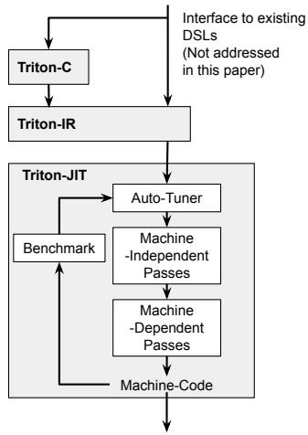
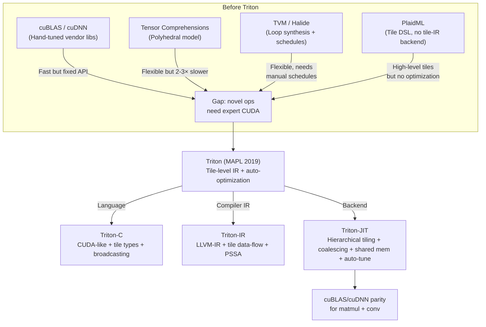
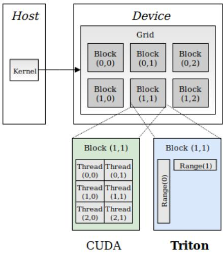
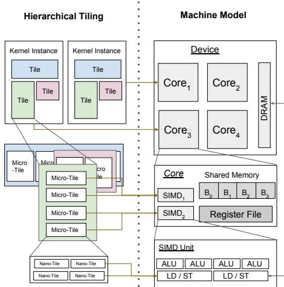
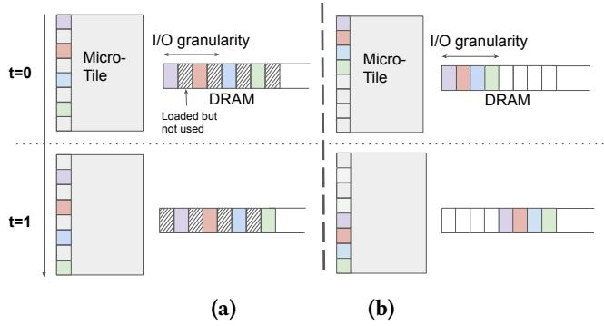
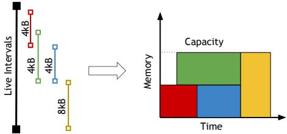
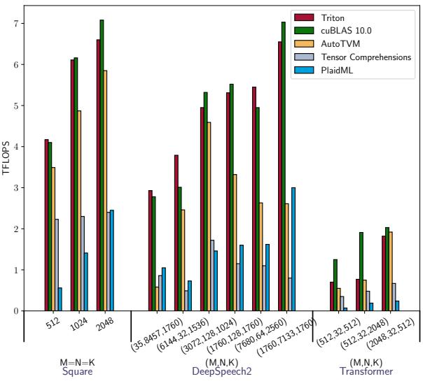
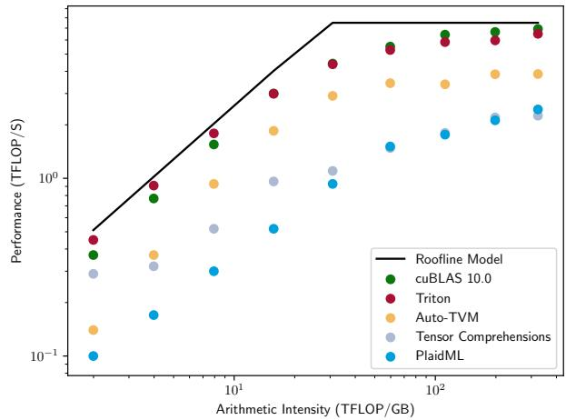

# Triton: An Intermediate Language and Compiler for Tiled Neural Network Computations

**Paper:** Triton: An Intermediate Language and Compiler for Tiled Neural Network Computations
**Authors:** Philippe Tillet, H. T. Kung, David Cox (Harvard University / IBM)
**Venue:** MAPL 2019 (3rd ACM SIGPLAN International Workshop on Machine Learning and Programming Languages)
**Date:** June 22, 2019

**Related pages:** [Frameworks Overview](../index.md), [CUDA Programming Model](../cuda/index.md), [SGLang](../sglang/index.md), [vLLM](../vllm/vllm-framework.md)

## TL;DR

**What:** Triton is a programming language and compiler that lets developers write GPU kernels using high-level *tile* abstractions — statically shaped multi-dimensional sub-arrays — instead of manually managing CUDA threads and shared memory.

**How:** Triton introduces a three-layer architecture: Triton-C (a C-like frontend with tile types and broadcasting), Triton-IR (an LLVM-based IR extended with tile-level data-flow and predicated control-flow), and Triton-JIT (a compiler that auto-applies hierarchical tiling, memory coalescing, shared memory allocation, and barrier synchronization).

**The number:** Triton's generated matrix multiplication kernels achieve >90% peak device utilization, matching cuBLAS performance and outperforming contemporary DSLs (Tensor Comprehensions, PlaidML, TVM) by 2–3× on recurrent and transformer workloads.

## The Big Picture



*① Triton-C: developer writes a kernel using tile variables (e.g., `float C[TM, TN] = 0`) with broadcasting and predication. ② Triton-IR: the frontend lowers tile operations into an LLVM-based IR with retiling instructions (reshape, broadcast), element-wise tile ops, and PSSA predication. ③ Triton-JIT: a series of compiler passes — pre-fetching, peephole optimization, hierarchical tiling, memory coalescing, shared memory allocation, and barrier insertion — transform Triton-IR into efficient LLVM bitcode. ④ An auto-tuner sweeps tile size parameters (powers of 2) to find the optimal configuration per problem shape.*

## Why This Exists

Before Triton, writing a fast GPU kernel for a novel DNN operation meant choosing between two bad options:

1. **Vendor library lock-in.** cuBLAS and cuDNN are fast but only cover a fixed set of operations ([matmul](../../terms/gemm.md), standard convolutions). If your research introduces a new primitive — say, a *shifted convolution* or a custom sparsity pattern — you are on your own.

2. **DSLs that are too slow.** Polyhedral compilers (Tensor Comprehensions) and loop synthesizers (Halide, TVM) could express arbitrary operations but produced kernels 2–3× slower than hand-tuned vendor libraries. You could write a CUDA micro-kernel by hand, but that takes expert-level effort and ties you to a specific GPU architecture.

Concretely, for a transformer matrix multiplication with $A \in \mathbb{R}^{1760 \times 1760}$ and $B \in \mathbb{R}^{N \times 1760}$, existing DSLs hit only 30–60% of the GPU's roofline, while cuBLAS reaches ~90%. Triton's key insight is that **[tiling](../../terms/matrix-tiling.md) is the universal primitive**: every efficient GPU kernel decomposes work into tiles that fit registers, shared memory, and compute units. By making tiles a first-class language concept and automating the tiling optimization, Triton closes the gap.

## The Landscape



Triton sits at a sweet spot: it provides *more flexibility* than vendor libraries (any tile-programmable operation), *more automation* than TVM/Halide (no manual schedule needed), and *better performance* than polyhedral compilers (tile-level, not loop-level, optimization).

## The Core Idea

Every efficient GPU kernel organizes computation into a hierarchy of tiles: large tiles that fit in shared memory, micro-tiles that fit in registers, and nano-tiles that map to individual compute units. The key insight of Triton is that by **elevating tiles to first-class language citizens** — with their own types, broadcasting rules, and predicated control flow — a compiler can *automatically* reason about the tiling hierarchy, memory layout, and synchronization without the programmer ever writing a CUDA thread or a `__syncthreads()` call.

## Symbol Map

Triton uses tile shapes as compile-time (or auto-tuned) constants. The notation is positional and explicit.

| Symbol | Human name | Scope | Plain meaning |
|---|---|---|---|
| `TM`, `TN` | Tile-M, Tile-N | per-kernel, tunable | Tile size along the M (row) and N (column) dimensions. |
| `TK` | Tile-K | per-kernel, tunable | Tile size along the reduction (K) dimension. |
| `float C[TM, TN]` | Accumulator tile | per-thread-block | 2D tile of partial dot-product results, kept in registers. |
| `get_global_range(axis)` | Global range query | per-kernel-instance | Returns the 1D tile of indices assigned to this kernel instance on the given axis. |
| `@predicate statement` | Predicated execution | per-element | Guards a tile-level operation: only elements where the predicate is true execute. |
| `reshape`, `broadcast` | Retiling instructions | Triton-IR | Reshape changes tile dimensionality (e.g., padding with ones); broadcast replicates along size-1 axes. |
| `icmpp`, `psi` | PSSA instructions | Triton-IR | Predicated SSA: `icmpp` returns true/false predicate tiles; `psi` merges values from different predicate streams. |

## Deep Dive

### 1. Triton-C: The Programmer's View

Triton-C looks like CUDA-C but replaces per-thread logic with tile-level operations. A matrix multiplication kernel (Listing 1 in the paper) shows the key differences:

**Tile declarations** use a dedicated syntax (`float C[TM, TN]` is a 2D tile, not a C array). Shapes can be `tunable` — the auto-tuner picks the best values from a constrained set (e.g., `{16, 32, 64, 128}`).

**Broadcasting** replicates tiles to match shapes automatically, following NumPy semantics: left-pad with ones, then replicate. For example, `a + b` where `a` is `int[16]` and `b` is `int[32, 16]` first reshapes `a` to `[1, 16]`, then broadcasts to `[32, 16]`.

**Predication** with `@` guards tile operations against out-of-bounds access at tensor edges without branching. This is critical because tiles cannot be partially executed — either the whole tile runs or none of it does.

**Built-in intrinsics** — `dot` (tile matrix multiply), `trans` (transpose), `get_global_range` (SPMD index query) — map directly to optimized hardware paths.

```c
// Key snippet: the accumulator loop in Triton-C
float C[TM, TN] = 0;
for (int k = K; k >= 0; k -= TK) {
    float A[TM, TK] = check_a ? *pa : 0;   // predicated load
    float B[TN, TK] = check_b ? *pb : 0;
    C += dot(A, trans(B));                   // tile matmul + accumulate
    pa = pa + TK * M;                        // pointer bump
    pb = pb + TK * N;
}
```

### 2. SPMD Model: No Threads, No Barriers

Triton's programming model differs fundamentally from CUDA's (Figure 3):



*Left: CUDA launches a grid of thread blocks, each containing many threads. The programmer manages thread indexing, shared memory, and `__syncthreads()`. Right: Triton launches each kernel instance as a single-threaded program associated with global index ranges. Parallelism is inferred automatically from the tile structure.*

This SPMD model eliminates three pain points:

- **No thread-level indexing.** You work with tiles, not individual threads.
- **No shared memory management.** The compiler allocates and synchronizes shared memory automatically.
- **No manual barrier insertion.** The Triton-JIT shared memory synchronization pass inserts barriers where needed using data-flow analysis of RAW and WAR hazards.

### 3. Triton-IR: Tile-Level Data-Flow and Control-Flow

Triton-IR extends LLVM-IR with two categories of tile operations.

#### Data-Flow: Retiling Instructions

- **`reshape`** changes a tile's dimensionality by padding shapes with ones. A 1D tile `i32<8>` can become `i32<1, 8>` for broadcasting.
- **`broadcast`** replicates data along size-1 dimensions to match a target shape: `broadcast i32<8, 8> %val` takes a `i32<1, 8>` and copies rows.

Standard scalar instructions (`add`, `mul`, `load`, `getelementptr`) are extended to work element-wise on tile operands. Specialized intrinsics (`dot`, `trans`) handle matrix-level operations.

#### Control-Flow: Predicated SSA (PSSA)

Tiles cannot branch per-element. Triton solves this with the Predicated SSA form:

- **`icmpp`** (predicated compare): returns two predicate tiles — one true, one false — for each element position.
- **`@predicate`**: guards an instruction so it only executes where the predicate is true.
- **`psi`**: merges values from different predicate streams, like a per-element `?:` operator.

This enables edge masking — loading `0` for out-of-bounds elements — without per-element branches.

### 4. Triton-JIT: Automatic GPU Optimization

The JIT compiler applies passes in a fixed order, each exploiting the tile structure of the IR.

#### Machine-Independent Passes

- **Pre-fetching** detects load instructions inside loops and inserts a second load one iteration ahead. This hides memory latency by overlapping loads with computation — critical when arithmetic intensity is low.
- **Peephole optimization** exploits tile algebra: chains of transposes simplify via $(X^T)^T = X$.

#### Machine-Dependent Passes



*① A large tile is decomposed into micro-tiles that fit in shared memory. ② Micro-tiles are further decomposed into nano-tiles sized for register files and warp-level compute. The auto-tuner sweeps powers of two for each decomposition level.*

**Hierarchical tiling** decomposes each tile into micro-tiles (shared memory sized) and nano-tiles (register/warp sized). Because Triton-IR programs are structured around tiles (not arbitrary loop nests), the compiler can enumerate valid decomposition strategies without polyhedral machinery.



*Left: uncoalesced access — threads in different colors access non-adjacent memory, requiring multiple DRAM transactions. Right: coalesced access — the Triton backend reorders threads within each micro-tile so adjacent threads access adjacent memory, minimizing transactions.*

**Memory coalescing** reorders virtual threads within each micro-tile so that adjacent threads access adjacent memory addresses. Since Triton kernels are single-threaded SPMD, the compiler has full freedom to map tile elements to hardware threads in coalescing-friendly layouts.



*Live ranges of tile variables are analyzed: tiles with overlapping live ranges cannot share the same shared memory space. The compiler uses a linear-time interval allocation algorithm to minimize shared memory footprint while maximizing reuse.*

**Shared memory allocation** analyzes live ranges of tile variables and packs them into shared memory using a linear-time interval allocator. This is analogous to register allocation, but for shared memory — tiles that don't overlap in time can reuse the same space.

**Shared memory synchronization** inserts barriers using data-flow analysis. For each program point, the compiler tracks which variables have pending reads and writes in shared memory. When a read-after-write (RAW) or write-after-read (WAR) hazard is detected, a barrier is inserted. The analysis uses forward data-flow equations, treating the set intersection of pending operations as the barrier trigger.

#### Auto-Tuner

The auto-tuner operates on a small search space: 3 tiling parameters per dimension per tile, each chosen from powers of two (32–128 for tile sizes, 8–32 for micro-tiles, 1–4 for nano-tiles). An exhaustive search over this compact space is practical and effective. The paper notes that only the hierarchical tiling pass was auto-tuned; future work could extend this to other passes.

### 5. Performance Results



*Matrix multiplication throughput across deep learning workloads. Triton matches cuBLAS, achieving >90% peak on favorable shapes. cuBLAS retains a slight edge on very small transformer shapes thanks to a 3D parallel reduction algorithm. DSLs (TC, PlaidML, TVM) lag by 2–3× on most shapes.*



*Roofline analysis for $C = AB^T$ with $A \in \mathbb{R}^{1760 \times 1760}$. As the K dimension (and thus arithmetic intensity) increases, Triton approaches the device's compute bound. DSLs flatline well below the roofline due to poor tile-level optimization.*

Key results:

- **Matrix multiplication:** Triton matches cuBLAS across recurrent (DeepSpeech2) and transformer shapes, reaching >90% peak device utilization. On very small transformer shapes, cuBLAS leads slightly via a 3D parallel reduction algorithm that Triton could adopt later.
- **Dense convolution:** Triton's reimplementation of cuDNN's `IMPLICIT_GEMM` matches or exceeds cuDNN on ResNet convolutional layers. The authors speculate cuDNN underinvests in 3×3 IMPLICIT_GEMM because Winograd is faster for that case.
- **Shifted convolution:** A fused shift-conv kernel in Triton (Listing 8) almost entirely hides the shift overhead, achieving near-identical performance to a plain 1×1 convolution — enabling novel CNN architectures that were previously impractical without custom CUDA.

## What Triton Enabled

Triton (the language described in this paper) was the seed for what became OpenAI's Triton, now widely used for writing high-performance GPU kernels in PyTorch. The core ideas — tile-level abstraction, automatic memory hierarchy management, and SPMD without manual thread management — remain the foundation of modern Triton.

## Limitations and Future Work (as of 2019)

- **No tensor core support.** The paper explicitly leaves this for future work; modern Triton has since added it.
- **Auto-tuning scope.** Only the hierarchical tiling pass was auto-tuned; other passes (pre-fetch depth, shared memory allocation strategy) used fixed heuristics.
- **Integration gap.** Triton at this stage was a standalone compiler; integration into higher-level frameworks (PyTorch, JAX) came later.
- **SPMD model restrictions.** The single-threaded SPMD model means Triton cannot express algorithms that require cross-thread communication patterns beyond what the tiling passes can infer.
