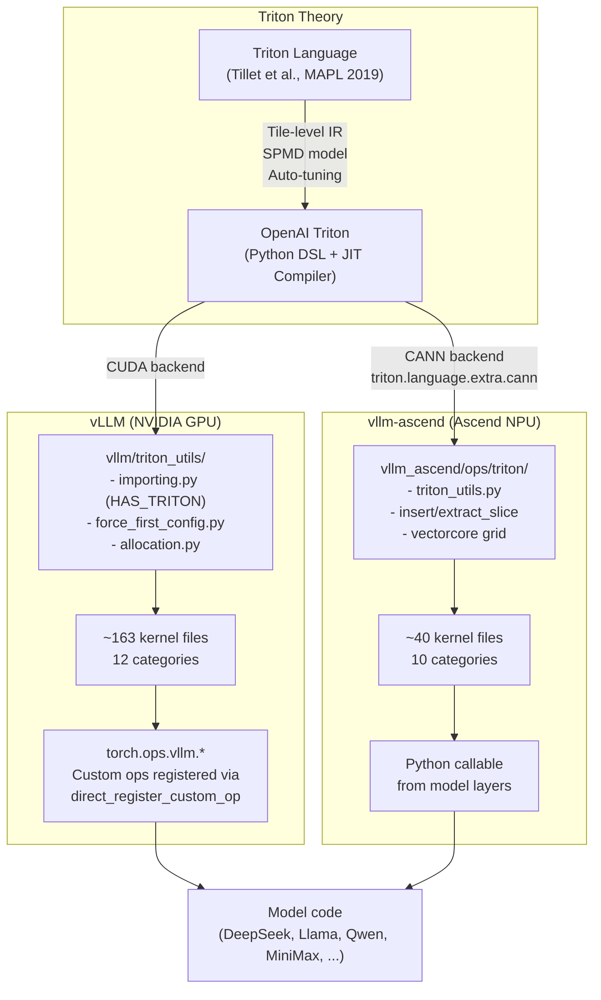
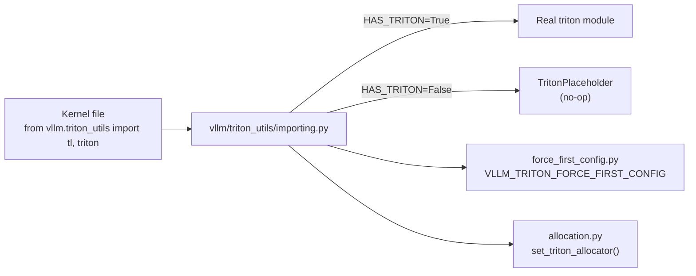
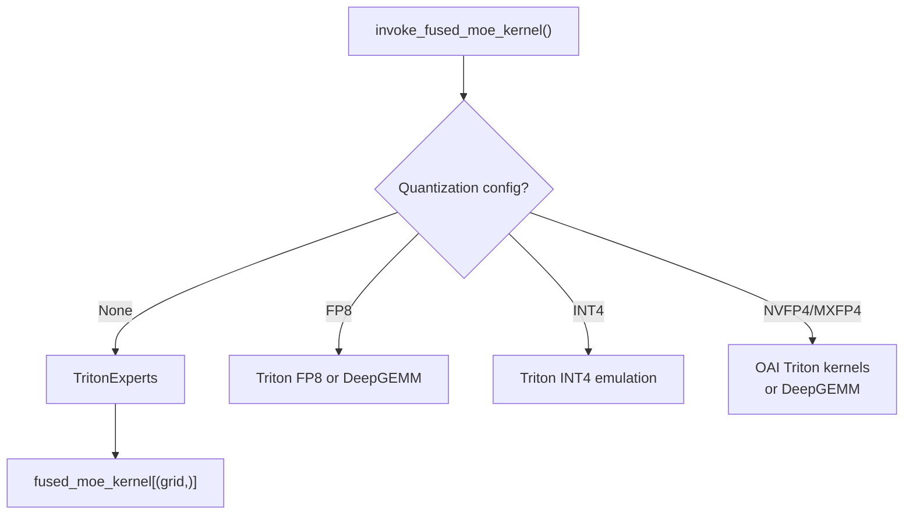
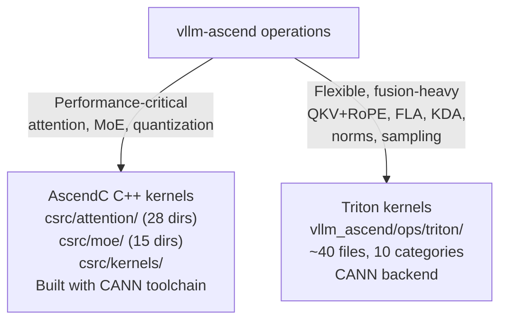

# Triton in Practice: How vLLM and vllm-ascend Use Triton

**Inspected commits:** vLLM `d18ed2304a2703e3211fc384a58607e754f5b723`;
vllm-ascend `8645122088f5cad1701205310573c5ee05c809f5`.

**Related pages:** [Triton Language Theory](index.md), [vLLM Framework](../vllm/vllm-framework.md), [vLLM Code Learning Path](../vllm/vllm-code-learning-path.md)

## TL;DR

**What:** vLLM and vllm-ascend use Triton to write ~200+ high-performance GPU/NPU kernels covering attention, [MoE](../../terms/mixture-of-experts.md), quantization, activations, normalization, RoPE, Mamba SSM, sampling, and speculative decoding — without hand-writing CUDA or AscendC for every operation.

**How:** vLLM wraps Triton through a centralized `triton_utils` import layer, registers kernels as `torch.ops.vllm.*` custom ops, and uses patterns like `tl.constexpr` for compile-time dispatch, pre-generated JSON launch configurations, grid-stride loops, and inline PTX for hardware-specific instructions. vllm-ascend adapts the same patterns for Ascend NPU via the `triton.language.extra.cann` extension; some element-wise kernels use a 1D grid sized to the NPU's vector-core count.

**The number:** ~163 files with `@triton.jit` or `@triton.autotune` in vLLM, ~40+ Triton kernel files in vllm-ascend, covering the full inference pipeline from attention through MoE to sampling.

## The Big Picture



*① Triton's tile-level abstraction and SPMD model (from the MAPL 2019 paper) underpin the OpenAI Triton Python DSL. ② vLLM wraps Triton through `vllm/triton_utils/` for safe import, config forcing, and allocator integration. ③ ~163 kernel files in vLLM cover the full inference pipeline. Kernels are registered as `torch.ops.vllm.*` custom ops. ④ vllm-ascend adapts the same Triton patterns for Ascend NPU via the CANN backend, with ~40 kernel files and several launch patterns, including vector-core-count 1D grids.*

## Why vLLM Uses Triton

vLLM's job is to serve LLMs fast. That means every microsecond in the critical path matters. The critical path — attention, MoE routing, quantization, sampling — contains many operations that are close to standard BLAS but not quite. A few examples:

| Operation | Why it's not a standard BLAS call |
|---|---|
| Flash-decoding with [KV cache](../../terms/kv-cache.md) paging | KV cache is stored in non-contiguous blocks; standard attention needs contiguous memory |
| Fused MoE with top-k gating + quantization | Requires fusing routing, dequant, [matmul](../../terms/gemm.md), and activation in one kernel launch |
| AWQ 4-bit dequant + matmul | Unpack 4-bit groups with interleaved bit-reversal, then scales/zeros per group |
| Fused QK RMSNorm + partial RoPE + gate copy | Collapses split → norm → rotary → gate chunk into one launch |
| Per-token-group FP8 quantization | Dynamic quantization at granularity finer than per-tensor |

Hand-writing CUDA for each of these is slow to develop and maintain. Triton lets vLLM write them in Python with tile-level abstractions, getting ~90%+ of hand-tuned CUDA performance with far less code.

## vLLM's Triton Infrastructure

### The Central Import Layer

Every Triton kernel in vLLM imports through `vllm/triton_utils/` — **never** directly:

```python
# ✅ Correct (used everywhere in vLLM)
from vllm.triton_utils import tl, triton

# ❌ Never done (enforced by pre-commit check)
import triton
import triton.language as tl
```

Why? Because <a class="code-link" href="../../../external-repos/vllm-d18ed2304a27/vllm/triton_utils/importing.py#L94" data-code-repo="vllm-d18ed2304a27" data-code-path="vllm/triton_utils/importing.py" data-code-line="94"><code>vllm/triton_utils/importing.py</code></a> handles:

- **Environment detection**: Triton may not be available (CPU-only builds, driverless containers during Ray init, XPU backends). The wrapper returns `TritonPlaceholder` / `TritonLanguagePlaceholder` no-op classes instead of crashing.
- **Driver leniency**: Distributed Ray workers may not have CUDA visible during init; the wrapper delays the driver check.
- **Config forcing**: `VLLM_TRITON_FORCE_FIRST_CONFIG` skips autotuning and uses the first valid config — essential for deterministic CUDA graph capture.



### Custom Op Registration

Triton kernels are registered as PyTorch custom ops so they can be called from `torch.compile` / `torch.fx` graphs:

```python
from vllm.utils.torch_utils import direct_register_custom_op

def my_kernel_impl(x: torch.Tensor, group_size: int) -> torch.Tensor:
    """Python wrapper that launches the @triton.jit kernel."""
    grid = (triton.cdiv(x.numel(), BLOCK_SIZE),)
    launch = _my_triton_kernel[grid]
    launch(x, ...)
    return result

direct_register_custom_op(
    op_name="per_token_group_quant_fp8",
    op_func=my_kernel_impl,
    mutates_args=[],
    fake_impl=my_kernel_fake,  # for torch.compile shape inference
)

# Called as:
output = torch.ops.vllm.per_token_group_quant_fp8(x, group_size)
```

The vLLM compilation pipeline's <a class="code-link" href="../../../external-repos/vllm-d18ed2304a27/vllm/compilation/passes/ir/clone_elimination.py#L19" data-code-repo="vllm-d18ed2304a27" data-code-path="vllm/compilation/passes/ir/clone_elimination.py" data-code-line="19"><code>clone_elimination.py</code></a> pass recognizes `TritonKernelWrapperFunctional` nodes, enabling graph-level optimizations across kernel boundaries.

### Launch Configuration: JSON Records vs. `@triton.autotune`

vLLM uses two distinct configuration-selection mechanisms. A small subset of
kernels uses Triton's runtime autotuner. Mamba selective-state-update kernels
instead load JSON records produced by an offline benchmark command, with a
hard-coded fallback when no matching record exists.

| Strategy | Where | How |
|---|---|---|
| **`@triton.autotune`** | A minority of kernels (16 of 163 JIT-containing files at the inspected commit) | Decorator with `configs=[...]` and a shape key. Triton benchmarks the listed configurations and caches the winner. |
| **Pre-generated JSON records** | Mamba selective state update | Files under `configs/selective_state_update/` selected by head dimension, state dimension, cache dtype, and device name. Loaded via `functools.cache`; they are not runtime autotuning. |

```python
# Condensed from mamba/ops/mamba_ssm.py
@functools.cache
def get_ssm_configs(headdim, dstate, cache_dtype):
    cache_dtype = _canonical_cache_dtype(cache_dtype)
    device_name = get_ssm_device_name()
    filename = get_ssm_config_file_name(
        headdim, dstate, cache_dtype, device_name
    )
    path = os.path.join(_CONFIGS_DIR, filename)
    if os.path.exists(path):
        with open(path) as file:
            return json.load(file)
    return None  # caller uses the hard-coded fallback
```

## vLLM Triton Kernel Categories

### 1. Attention Kernels — The Heart of Custom Attention

vLLM cannot use stock FlashAttention because its [PagedAttention](../../terms/pagedattention.md) KV cache stores keys and values in non-contiguous blocks. The attention kernels must follow [block tables](../../terms/block-table.md) to locate physical KV blocks.

| Kernel | Phase | Key Feature |
|---|---|---|
| <a class="code-link" href="../../../external-repos/vllm-d18ed2304a27/vllm/v1/attention/ops/triton_unified_attention.py#L39" data-code-repo="vllm-d18ed2304a27" data-code-path="vllm/v1/attention/ops/triton_unified_attention.py" data-code-line="39"><code>triton_unified_attention.py</code></a> | Prefill + Decode | One kernel for both phases; binary search over `query_start_loc`; supports ALiBi, softcap, QQ-bias, FP8/INT8 KV cache quantization |
| <a class="code-link" href="../../../external-repos/vllm-d18ed2304a27/vllm/v1/attention/ops/triton_decode_attention.py#L54" data-code-repo="vllm-d18ed2304a27" data-code-path="vllm/v1/attention/ops/triton_decode_attention.py" data-code-line="54"><code>triton_decode_attention.py</code></a> | Decode | Split-K flash-decoding: stage 1 computes partial softmax per tile, stage 2 merges via <a class="code-link" href="../../../external-repos/vllm-d18ed2304a27/vllm/v1/attention/ops/triton_merge_attn_states.py#L12" data-code-repo="vllm-d18ed2304a27" data-code-path="vllm/v1/attention/ops/triton_merge_attn_states.py" data-code-line="12"><code>triton_merge_attn_states.py</code></a> |
| <a class="code-link" href="../../../external-repos/vllm-d18ed2304a27/vllm/v1/attention/ops/triton_prefill_attention.py#L37" data-code-repo="vllm-d18ed2304a27" data-code-path="vllm/v1/attention/ops/triton_prefill_attention.py" data-code-line="37"><code>triton_prefill_attention.py</code></a> | Prefill | Page size = 1, adapted from SGLang/LightLLM's `context_flashattention_nopad`; supports sliding window |
| <a class="code-link" href="../../../external-repos/vllm-d18ed2304a27/vllm/v1/attention/ops/triton_reshape_and_cache_flash.py#L20" data-code-repo="vllm-d18ed2304a27" data-code-path="vllm/v1/attention/ops/triton_reshape_and_cache_flash.py" data-code-line="20"><code>triton_reshape_and_cache_flash.py</code></a> | KV cache insert | Fuses reshape + FP8 quantize + KV cache write in one kernel |
| <a class="code-link" href="../../../external-repos/vllm-d18ed2304a27/vllm/v1/attention/ops/triton_attention_helpers.py#L22" data-code-repo="vllm-d18ed2304a27" data-code-path="vllm/v1/attention/ops/triton_attention_helpers.py" data-code-line="22"><code>triton_attention_helpers.py</code></a> | Shared utilities | `find_seq_idx` (binary search), `softmax_step`, `apply_alibi_to_score`, `apply_softcap`, `store_segm_reduce_scalars` — shared across all attention kernels |

The unified attention kernel is IBM-contributed and is one of the most sophisticated Triton kernels in the codebase. It handles both prefill (many query tokens, many KV tokens) and decode (one query token, many KV tokens) in a single kernel by branching on a `IS_PREFILL` constexpr.

### 2. MoE (Mixture of Experts) Kernels

MoE models like DeepSeek-V2/V3/V4 and Mixtral route each token to a subset of experts. The fused MoE kernel combines routing, dequantization, matrix multiply, and activation in one launch:

| Kernel | Approach |
|---|---|
| <a class="code-link" href="../../../external-repos/vllm-d18ed2304a27/vllm/model_executor/layers/fused_moe/fused_moe.py#L42" data-code-repo="vllm-d18ed2304a27" data-code-path="vllm/model_executor/layers/fused_moe/fused_moe.py" data-code-line="42"><code>fused_moe.py</code></a> | Main dispatcher — gates between Triton, CUTLASS, and DeepGEMM based on quantization config |
| <a class="code-link" href="../../../external-repos/vllm-d18ed2304a27/vllm/model_executor/layers/fused_moe/experts/gpt_oss_triton_kernels_moe.py#L36" data-code-repo="vllm-d18ed2304a27" data-code-path="vllm/model_executor/layers/fused_moe/experts/gpt_oss_triton_kernels_moe.py" data-code-line="36"><code>gpt_oss_triton_kernels_moe.py</code></a> | OpenAI-style modular MoE kernels with FP4 quantization, bitmatrix sparse matmul, and swiglu |
| <a class="code-link" href="../../../external-repos/vllm-d18ed2304a27/vllm/model_executor/layers/fused_moe/experts/triton_cutlass_moe.py#L19" data-code-repo="vllm-d18ed2304a27" data-code-path="vllm/model_executor/layers/fused_moe/experts/triton_cutlass_moe.py" data-code-line="19"><code>triton_cutlass_moe.py</code></a> | Triton + CUTLASS hybrid |
| <a class="code-link" href="../../../external-repos/vllm-d18ed2304a27/vllm/model_executor/layers/fused_moe/experts/triton_deep_gemm_moe.py#L24" data-code-repo="vllm-d18ed2304a27" data-code-path="vllm/model_executor/layers/fused_moe/experts/triton_deep_gemm_moe.py" data-code-line="24"><code>triton_deep_gemm_moe.py</code></a> | Triton + DeepGEMM hybrid |
| <a class="code-link" href="../../../external-repos/vllm-d18ed2304a27/vllm/model_executor/layers/fused_moe/moe_align_block_size.py#L11" data-code-repo="vllm-d18ed2304a27" data-code-path="vllm/model_executor/layers/fused_moe/moe_align_block_size.py" data-code-line="11"><code>moe_align_block_size.py</code></a> | Token-to-expert alignment for block-size-compatible matmul — core orchestration |

The dispatch hierarchy looks like:



### 3. Quantization Kernels

Quantization is where Triton shines — each quantization scheme has custom packing/unpacking logic that doesn't map to standard BLAS:

| Kernel | Quantization Scheme |
|---|---|
| <a class="code-link" href="../../../external-repos/vllm-d18ed2304a27/vllm/model_executor/layers/quantization/awq_triton.py#L12" data-code-repo="vllm-d18ed2304a27" data-code-path="vllm/model_executor/layers/quantization/awq_triton.py" data-code-line="12"><code>awq_triton.py</code></a> | AWQ: unpacks 4-bit groups (32/64/128), uses `tl.interleave` for bit-reversal reordering, applies scales/zeros per group |
| <a class="code-link" href="../../../external-repos/vllm-d18ed2304a27/vllm/model_executor/layers/quantization/utils/fp8_utils.py#L42" data-code-repo="vllm-d18ed2304a27" data-code-path="vllm/model_executor/layers/quantization/utils/fp8_utils.py" data-code-line="42"><code>fp8_utils.py</code></a> | FP8 suite: per-token-group quant, fused SiLU+mult+FP8 quant, per-tensor quant |
| <a class="code-link" href="../../../external-repos/vllm-d18ed2304a27/vllm/model_executor/layers/quantization/utils/nvfp4_emulation_utils.py#L26" data-code-repo="vllm-d18ed2304a27" data-code-path="vllm/model_executor/layers/quantization/utils/nvfp4_emulation_utils.py" data-code-line="26"><code>nvfp4_emulation_utils.py</code></a> | NVFP4: decodes 4-bit (e2m1) nibbles to float32 via IEEE 754 bit construction |
| <a class="code-link" href="../../../external-repos/vllm-d18ed2304a27/vllm/model_executor/layers/quantization/utils/int8_utils.py#L20" data-code-repo="vllm-d18ed2304a27" data-code-path="vllm/model_executor/layers/quantization/utils/int8_utils.py" data-code-line="20"><code>int8_utils.py</code></a> | INT8: per-token dynamic quantization, block dequant |
| <a class="code-link" href="../../../external-repos/vllm-d18ed2304a27/vllm/model_executor/layers/quantization/compressed_tensors/triton_scaled_mm.py#L10" data-code-repo="vllm-d18ed2304a27" data-code-path="vllm/model_executor/layers/quantization/compressed_tensors/triton_scaled_mm.py" data-code-line="10"><code>triton_scaled_mm.py</code></a> | Compressed-tensor scaled matmul with per-tensor/per-channel scales + optional bias |

### 4. Activation, Normalization, and RoPE

vLLM fuses these small element-wise ops to reduce kernel launch overhead:

| Kernel | What It Fuses |
|---|---|
| <a class="code-link" href="../../../external-repos/vllm-d18ed2304a27/vllm/model_executor/layers/activation.py#L27" data-code-repo="vllm-d18ed2304a27" data-code-path="vllm/model_executor/layers/activation.py" data-code-line="27"><code>activation.py</code></a> (`swiglustep_and_mul_triton`) | sigmoid gate → clamp gate+up → multiply in one kernel |
| <a class="code-link" href="../../../external-repos/vllm-d18ed2304a27/vllm/model_executor/layers/fused_qk_norm_rope.py#L17" data-code-repo="vllm-d18ed2304a27" data-code-path="vllm/model_executor/layers/fused_qk_norm_rope.py" data-code-line="17"><code>fused_qk_norm_rope.py</code></a> | split → QK RMSNorm → partial RoPE → gate chunk (Qwen3.5) |
| <a class="code-link" href="../../../external-repos/vllm-d18ed2304a27/vllm/model_executor/layers/rotary_embedding/mrope.py#L15" data-code-repo="vllm-d18ed2304a27" data-code-path="vllm/model_executor/layers/rotary_embedding/mrope.py" data-code-line="15"><code>mrope.py</code></a> | Multi-resolution RoPE for Qwen2-VL with separate T/H/W cos/sin caches |

### 5. Sampling, Mamba, and Utilities

| Category | Kernel | Purpose |
|---|---|---|
| Sampling | <a class="code-link" href="../../../external-repos/vllm-d18ed2304a27/vllm/v1/sample/ops/topk_topp_triton.py#L71" data-code-repo="vllm-d18ed2304a27" data-code-path="vllm/v1/sample/ops/topk_topp_triton.py" data-code-line="71"><code>topk_topp_triton.py</code></a> | Combined Top-K + Top-P with pivot-based truncation and precomputed CDF/sigma tables |
| Mamba SSM | <a class="code-link" href="../../../external-repos/vllm-d18ed2304a27/vllm/model_executor/layers/mamba/ops/cpu/mamba_ssm.py#L10" data-code-repo="vllm-d18ed2304a27" data-code-path="vllm/model_executor/layers/mamba/ops/cpu/mamba_ssm.py" data-code-line="10"><code>mamba_ssm.py</code></a> | Selective state update with per-device JSON tuning |
| Mamba SSM | <a class="code-link" href="../../../external-repos/vllm-d18ed2304a27/vllm/model_executor/layers/mamba/ops/cpu/causal_conv1d.py#L13" data-code-repo="vllm-d18ed2304a27" data-code-path="vllm/model_executor/layers/mamba/ops/cpu/causal_conv1d.py" data-code-line="13"><code>causal_conv1d.py</code></a> | Causal 1D convolution |
| Lightning Attn | <a class="code-link" href="../../../external-repos/vllm-d18ed2304a27/vllm/model_executor/layers/lightning_attn.py#L13" data-code-repo="vllm-d18ed2304a27" data-code-path="vllm/model_executor/layers/lightning_attn.py" data-code-line="13"><code>lightning_attn.py</code></a> | Diagonal-block attention with `_fwd_diag_kernel` and `_fwd_sliding_kernel` |
| KV Offload | <a class="code-link" href="../../../external-repos/vllm-d18ed2304a27/vllm/v1/kv_offload/cpu/swap_blocks_triton.py#L25" data-code-repo="vllm-d18ed2304a27" data-code-path="vllm/v1/kv_offload/cpu/swap_blocks_triton.py" data-code-line="25"><code>swap_blocks_triton.py</code></a> | CPU↔GPU KV block swap, tuned for H100 |
| Spec Decode | Various | EAGLE draft model kernels, rejection sampling |

## Universal Triton Coding Patterns

These patterns appear across virtually every Triton kernel in vLLM:

### Pattern 1: `tl.constexpr` for Compile-Time Specialization

```python
@triton.jit
def kernel(
    x_ptr, y_ptr, output_ptr,
    N: int,
    BLOCK_SIZE: tl.constexpr,         # tile size
    KV_QUANT_MODE: tl.constexpr,       # enum: FP8/INT8/none
    USE_ALIBI: tl.constexpr,           # feature flag
    HEAD_DIM: tl.constexpr,            # model dimension
):
    ...
```

`tl.constexpr` values are baked into the compiled PTX — the Triton compiler can constant-fold and dead-code-eliminate entire branches, producing a specialized kernel for each configuration without runtime overhead.

### Pattern 2: `do_not_specialize` for Dynamic Shapes

```python
@triton.jit(do_not_specialize=["num_tokens", "seq_lens"])
def kernel(num_tokens, seq_lens, ...):
    ...
```

Without this, Triton would recompile the kernel for every distinct value of `num_tokens` — disastrous for an LLM serving system where sequence lengths vary widely. `do_not_specialize` tells the compiler to treat these as runtime values.

### Pattern 3: Grid-Stride Loop for Load Balancing

```python
@triton.jit
def elementwise_kernel(x_ptr, output_ptr, n_elements, BLOCK_SIZE: tl.constexpr):
    pid = tl.program_id(0)
    num_programs = tl.num_programs(0)
    for block_start in range(pid * BLOCK_SIZE, n_elements, num_programs * BLOCK_SIZE):
        offsets = block_start + tl.arange(0, BLOCK_SIZE)
        mask = offsets < n_elements
        x = tl.load(x_ptr + offsets, mask=mask)
        tl.store(output_ptr + offsets, x * 2.0, mask=mask)
```

Each program processes multiple non-contiguous blocks, striding by `num_programs * BLOCK_SIZE`. This handles arbitrary `n_elements` with a fixed grid size — no need to recompute grid per call.

### Pattern 4: Inline PTX for Hardware-Specific Instructions

When Triton's Python API doesn't expose a hardware instruction, vLLM uses `tl.inline_asm_elementwise`:

```python
# DeepSeek V4 FP4 packing: convert fp32→e2m1 fp4
tl.inline_asm_elementwise(
    "cvt.rn.satfinite.e2m1x2.f32 $0, $1, $2;",
    "=r,r,r",
    [a, b],
    dtype=tl.float32,
    is_pure=True,
    pack=1,
)
```

### Pattern 5: `@triton.heuristics` for Runtime Feature Toggles

```python
@triton.heuristics({
    "BLOCK_SIZE_D": lambda args: triton.next_power_of_2(args["head_dim"]),
    "USE_GATE": lambda args: args["g"] is not None,
})
@triton.jit
def kernel(head_dim, g, ...):
    ...
```

Heuristics run once at launch time and bake the result as a constexpr into the kernel — combining the flexibility of runtime dispatch with the performance of compile-time specialization.

## vllm-ascend: Triton on Ascend NPU

vllm-ascend brings vLLM to Huawei Ascend NPUs. It uses **two kernel languages**: Triton (via CANN backend) for flexibility, and AscendC (C++ with CANN APIs) for maximum performance on critical paths.

### Ascend-Specific Triton Infrastructure

The CANN (Compute Architecture for Neural Networks) backend for Triton lives at `triton.language.extra.cann`, and vllm-ascend's infrastructure wrapper is <a class="code-link" href="../../../external-repos/vllm-ascend-8645122088f5/vllm_ascend/ops/triton/triton_utils.py#L17" data-code-repo="vllm-ascend-8645122088f5" data-code-path="vllm_ascend/ops/triton/triton_utils.py" data-code-line="17"><code>vllm_ascend/ops/triton/triton_utils.py</code></a>:

```python
# vllm_ascend/ops/triton/triton_utils.py
import triton.language.extra.cann.extension as _extension_module

# Resolve: prefer CANN-optimized ops, fall back to standard tl
insert_slice = getattr(_extension_module, "insert_slice", None) or tl.insert_slice
extract_slice = getattr(_extension_module, "extract_slice", None) or tl.extract_slice
get_element = getattr(_extension_module, "get_element", None) or tl.get_element
```

Device properties are queried from the Ascend driver:

```python
# Lazy initialization of Ascend core counts
init_device_properties_triton()  # queries num_aicore, num_vectorcore
num_cores = get_vectorcore_num()
```

### Ascend-Specific Triton Patterns

#### Pattern A: 1D Grid, Vector-Core Saturating

Some vllm-ascend element-wise Triton kernels use `num_programs = num_vectorcore` with grid-stride loops:

```python
N_CORES = get_vectorcore_num()

@triton.jit
def my_kernel(ptr, n_elements, N_CORES: tl.constexpr, BLOCK_SIZE: tl.constexpr):
    pid = tl.program_id(0)
    for block_id in range(pid, n_blocks, N_CORES):
        # process block_id
        ...

grid = (N_CORES,)
launch = my_kernel[grid]
launch(ptr, n_elements, N_CORES=N_CORES, BLOCK_SIZE=BLOCK_SIZE)
```

This fixes the number of programs to the detected vector-core count while the
loop distributes additional blocks across those programs.

#### Pattern B: Ascend-Specific Optimization Hints

```python
@triton.jit
def swiglu_quant_kernel(..., multibuffer: tl.constexpr = True):
    ...
```

`multibuffer=True` is an Ascend-specific hint telling the CANN compiler to pipeline memory operations — overlapping loads with computation.

#### Pattern C: `insert_slice` / `extract_slice` from CANN Extension

vllm-ascend's fused QKV+Norm+RoPE kernel uses `extract_slice` for in-kernel tensor slicing:

```python
# Split QKV projection into Q, K, V within the kernel
q_slice = extract_slice(qkv, [0, head_start], [BLOCK_SIZE, num_q_heads * head_dim])
```

On Ascend, the CANN extension provides hardware-optimized implementations of these slice operations.

### vllm-ascend Triton Kernel Categories

| Category | Key Files | What They Do |
|---|---|---|
| **Fused QKV + Norm + RoPE** | <a class="code-link" href="../../../external-repos/vllm-ascend-8645122088f5/vllm_ascend/ops/triton/linearnorm/split_qkv_rmsnorm_rope.py#L26" data-code-repo="vllm-ascend-8645122088f5" data-code-path="vllm_ascend/ops/triton/linearnorm/split_qkv_rmsnorm_rope.py" data-code-line="26"><code>linearnorm/split_qkv_rmsnorm_rope.py</code></a> (SIMD + SIMT variants, TP-aware variant, M-RoPE variant) | The most important fused kernel — collapses QKV projection split + RMSNorm + weight/bias + rotary embedding into one launch |
| **[Flash Linear Attention](../../terms/linear-attention.md)** | <a class="code-link" href="../../../external-repos/vllm-ascend-8645122088f5/vllm_ascend/ops/triton/fla/chunk_o.py#L26" data-code-repo="vllm-ascend-8645122088f5" data-code-path="vllm_ascend/ops/triton/fla/chunk_o.py" data-code-line="26"><code>fla/chunk_o.py</code></a>, <a class="code-link" href="../../../external-repos/vllm-ascend-8645122088f5/vllm_ascend/ops/triton/kda/chunk_delta_h.py#L36" data-code-repo="vllm-ascend-8645122088f5" data-code-path="vllm_ascend/ops/triton/kda/chunk_delta_h.py" data-code-line="36"><code>chunk_delta_h.py</code></a>, <a class="code-link" href="../../../external-repos/vllm-ascend-8645122088f5/vllm_ascend/ops/triton/kda/cumsum.py#L22" data-code-repo="vllm-ascend-8645122088f5" data-code-path="vllm_ascend/ops/triton/kda/cumsum.py" data-code-line="22"><code>cumsum.py</code></a>, <a class="code-link" href="../../../external-repos/vllm-ascend-8645122088f5/vllm_ascend/ops/triton/kda/solve_tril.py#L28" data-code-repo="vllm-ascend-8645122088f5" data-code-path="vllm_ascend/ops/triton/kda/solve_tril.py" data-code-line="28"><code>solve_tril.py</code></a>, etc. (~14 files) | Chunked linear attention with gated [delta rule](../../terms/delta-rule.md), full forward pass with state updates |
| **Kernelized Dynamic Attention** | <a class="code-link" href="../../../external-repos/vllm-ascend-8645122088f5/vllm_ascend/ops/triton/kda/kda.py#L36" data-code-repo="vllm-ascend-8645122088f5" data-code-path="vllm_ascend/ops/triton/kda/kda.py" data-code-line="36"><code>kda/kda.py</code></a>, <a class="code-link" href="../../../external-repos/vllm-ascend-8645122088f5/vllm_ascend/ops/triton/kda/fused_recurrent_kda.py#L24" data-code-repo="vllm-ascend-8645122088f5" data-code-path="vllm_ascend/ops/triton/kda/fused_recurrent_kda.py" data-code-line="24"><code>fused_recurrent_kda.py</code></a>, etc. (~7 files) | Recurrent kernelized attention with L2 norm and triangular solve |
| **Activation** | <a class="code-link" href="../../../external-repos/vllm-ascend-8645122088f5/vllm_ascend/ops/triton/activation/swiglu_quant.py#L8" data-code-repo="vllm-ascend-8645122088f5" data-code-path="vllm_ascend/ops/triton/activation/swiglu_quant.py" data-code-line="8"><code>activation/swiglu_quant.py</code></a>, <a class="code-link" href="../../../external-repos/vllm-ascend-8645122088f5/vllm_ascend/ops/triton/activation/swiglustep.py#L45" data-code-repo="vllm-ascend-8645122088f5" data-code-path="vllm_ascend/ops/triton/activation/swiglustep.py" data-code-line="45"><code>swiglustep.py</code></a> | SwiGLU + int8 quantization, SwigluStepAndMul with clamping |
| **Normalization** | <a class="code-link" href="../../../external-repos/vllm-ascend-8645122088f5/vllm_ascend/ops/triton/rms_norm.py#L6" data-code-repo="vllm-ascend-8645122088f5" data-code-path="vllm_ascend/ops/triton/rms_norm.py" data-code-line="6"><code>rms_norm.py</code></a>, <a class="code-link" href="../../../external-repos/vllm-ascend-8645122088f5/vllm_ascend/ops/triton/layernorm_gated.py#L16" data-code-repo="vllm-ascend-8645122088f5" data-code-path="vllm_ascend/ops/triton/layernorm_gated.py" data-code-line="16"><code>layernorm_gated.py</code></a> | RMSNorm and gated LayerNorm |
| **RoPE** | <a class="code-link" href="../../../external-repos/vllm-ascend-8645122088f5/vllm_ascend/ops/triton/rope.py#L24" data-code-repo="vllm-ascend-8645122088f5" data-code-path="vllm_ascend/ops/triton/rope.py" data-code-line="24"><code>rope.py</code></a> | NeoX and non-NeoX rotary embedding |
| **Mamba SSM** | <a class="code-link" href="../../../external-repos/vllm-ascend-8645122088f5/vllm_ascend/ops/triton/mamba/causal_conv1d.py#L24" data-code-repo="vllm-ascend-8645122088f5" data-code-path="vllm_ascend/ops/triton/mamba/causal_conv1d.py" data-code-line="24"><code>mamba/causal_conv1d.py</code></a>, <a class="code-link" href="../../../external-repos/vllm-ascend-8645122088f5/vllm_ascend/ops/triton/mamba/lightning_attn.py#L32" data-code-repo="vllm-ascend-8645122088f5" data-code-path="vllm_ascend/ops/triton/mamba/lightning_attn.py" data-code-line="32"><code>lightning_attn.py</code></a>, <a class="code-link" href="../../../external-repos/vllm-ascend-8645122088f5/vllm_ascend/ops/triton/mamba/postprocess.py#L9" data-code-repo="vllm-ascend-8645122088f5" data-code-path="vllm_ascend/ops/triton/mamba/postprocess.py" data-code-line="9"><code>postprocess.py</code></a> | Causal conv1d, lightning attention, post-processing |
| **Sampling** | <a class="code-link" href="../../../external-repos/vllm-ascend-8645122088f5/vllm_ascend/ops/triton/penalty.py#L31" data-code-repo="vllm-ascend-8645122088f5" data-code-path="vllm_ascend/ops/triton/penalty.py" data-code-line="31"><code>penalty.py</code></a>, <a class="code-link" href="../../../external-repos/vllm-ascend-8645122088f5/vllm_ascend/ops/triton/reject_sample.py#L23" data-code-repo="vllm-ascend-8645122088f5" data-code-path="vllm_ascend/ops/triton/reject_sample.py" data-code-line="23"><code>reject_sample.py</code></a>, <a class="code-link" href="../../../external-repos/vllm-ascend-8645122088f5/vllm_ascend/ops/triton/bincount.py#L32" data-code-repo="vllm-ascend-8645122088f5" data-code-path="vllm_ascend/ops/triton/bincount.py" data-code-line="32"><code>bincount.py</code></a> | Repetition/frequency/presence penalties, rejection sampling |
| **Batch Invariant** | <a class="code-link" href="../../../external-repos/vllm-ascend-8645122088f5/vllm_ascend/ops/triton/batch_invariant/matmul.py#L25" data-code-repo="vllm-ascend-8645122088f5" data-code-path="vllm_ascend/ops/triton/batch_invariant/matmul.py" data-code-line="25"><code>batch_invariant/matmul.py</code></a>, <a class="code-link" href="../../../external-repos/vllm-ascend-8645122088f5/vllm_ascend/ops/triton/batch_invariant/mean.py#L25" data-code-repo="vllm-ascend-8645122088f5" data-code-path="vllm_ascend/ops/triton/batch_invariant/mean.py" data-code-line="25"><code>mean.py</code></a>, <a class="code-link" href="../../../external-repos/vllm-ascend-8645122088f5/vllm_ascend/ops/triton/batch_invariant/softmax.py#L22" data-code-repo="vllm-ascend-8645122088f5" data-code-path="vllm_ascend/ops/triton/batch_invariant/softmax.py" data-code-line="22"><code>softmax.py</code></a> | MatMul+bias, mean, softmax |
| **Utility** | <a class="code-link" href="../../../external-repos/vllm-ascend-8645122088f5/vllm_ascend/ops/triton/mul_add.py#L8" data-code-repo="vllm-ascend-8645122088f5" data-code-path="vllm_ascend/ops/triton/mul_add.py" data-code-line="8"><code>mul_add.py</code></a>, <a class="code-link" href="../../../external-repos/vllm-ascend-8645122088f5/vllm_ascend/ops/triton/muls_add.py#L8" data-code-repo="vllm-ascend-8645122088f5" data-code-path="vllm_ascend/ops/triton/muls_add.py" data-code-line="8"><code>muls_add.py</code></a>, <a class="code-link" href="../../../external-repos/vllm-ascend-8645122088f5/vllm_ascend/ops/triton/batch_memcpy.py#L10" data-code-repo="vllm-ascend-8645122088f5" data-code-path="vllm_ascend/ops/triton/batch_memcpy.py" data-code-line="10"><code>batch_memcpy.py</code></a> | Fused multiply-add, batch memcpy with `.cg` cache modifier |

### Triton vs. AscendC: The Dual Strategy

vllm-ascend does not use Triton for everything. Performance-critical paths use **AscendC** (C++ with CANN APIs), stored in `csrc/`:

| Operation | Language | Why |
|---|---|---|
| Attention (sparse flash, [lightning indexer](../../terms/lightning-indexer.md), KV-quant flash) | AscendC (`csrc/attention/`, 28 subdirectories) | Maximum performance on the critical attention path |
| MoE (grouped matmul, swiglu group quant, causal conv1d) | AscendC (`csrc/moe/`, 15 subdirectories) | MoE operations are compute-dense and benefit from hand-tuned AscendC |
| Fused QKV+Norm+RoPE | Triton (`linearnorm/`) | Complex fusion logic is easier to express in Triton |
| Flash Linear Attention / [KDA](../../terms/kimi-delta-attention.md) | Triton (`fla/`, `kda/`) | Algorithmic complexity; Triton's tile abstractions simplify development |
| Activation, normalization, penalties, sampling | Triton | Element-wise ops where Triton matches AscendC performance |



**Decision heuristic**: if an operation is a straightforward matmul or attention pattern, use AscendC for peak throughput. If it involves complex fusion (multiple ops collapsed into one kernel) or algorithmic exploration (new attention variants), use Triton for faster development. This is the same philosophy NVIDIA vLLM uses with Triton vs. CUDA C++.

## Key Differences: NVIDIA Triton vs. Ascend Triton

| Aspect | vLLM (NVIDIA) | vllm-ascend (Ascend) |
|---|---|---|
| **Triton backend** | CUDA → PTX/SASS | CANN → Ascend NPU |
| **Grid strategy** | Per-kernel 1D/2D/3D grids; a minority use `@triton.autotune` | Per-kernel grids; some element-wise kernels use a 1D vector-core-count grid |
| **Special ops** | `tl.inline_asm_elementwise` for PTX | `insert_slice`, `extract_slice`, `get_element` from CANN extension |
| **Device query** | `torch.cuda.get_device_properties()` | `triton.runtime.driver.active.utils.get_device_properties(npu_device)` |
| **Optimization hints** | `num_warps`, `num_stages` in autotune configs | `multibuffer=True` for memory pipelining |
| **C++ kernel fallback** | CUDA C++ kernels for some paths | AscendC C++ kernels for attention, MoE, quantization (more extensive) |
| **Import** | `from vllm.triton_utils import tl, triton` | Same! Uses vLLM's triton_utils wrapper |

## Learn by Reading: Recommended Kernel Files

If you want to understand Triton in practice, read these files in order:

1. **Start here:** <a class="code-link" href="../../../external-repos/vllm-d18ed2304a27/vllm/model_executor/layers/activation.py#L27" data-code-repo="vllm-d18ed2304a27" data-code-path="vllm/model_executor/layers/activation.py" data-code-line="27"><code>vllm/model_executor/layers/activation.py</code></a> — the `swiglustep_and_mul_triton` kernel is ~60 lines and demonstrates grid-stride loop, `tl.constexpr`, masked loads/stores, and fused element-wise math. The simplest complete example.

2. **Quantization:** <a class="code-link" href="../../../external-repos/vllm-d18ed2304a27/vllm/model_executor/layers/quantization/awq_triton.py#L12" data-code-repo="vllm-d18ed2304a27" data-code-path="vllm/model_executor/layers/quantization/awq_triton.py" data-code-line="12"><code>vllm/model_executor/layers/quantization/awq_triton.py</code></a> — shows `tl.interleave` for bit-reversal, group-wise dequant, and how scales/zeros are applied per group.

3. **Attention helpers:** <a class="code-link" href="../../../external-repos/vllm-d18ed2304a27/vllm/v1/attention/ops/triton_attention_helpers.py#L22" data-code-repo="vllm-d18ed2304a27" data-code-path="vllm/v1/attention/ops/triton_attention_helpers.py" data-code-line="22"><code>vllm/v1/attention/ops/triton_attention_helpers.py</code></a> — shared utility functions (`find_seq_idx` binary search, `softmax_step`, `apply_alibi`) that show how complex logic is decomposed into reusable `@triton.jit` functions.

4. **Decode attention:** <a class="code-link" href="../../../external-repos/vllm-d18ed2304a27/vllm/v1/attention/ops/triton_decode_attention.py#L54" data-code-repo="vllm-d18ed2304a27" data-code-path="vllm/v1/attention/ops/triton_decode_attention.py" data-code-line="54"><code>vllm/v1/attention/ops/triton_decode_attention.py</code></a> — split-K flash-decoding with two-stage reduction. Demonstrates how to structure a large kernel across multiple files.

5. **Ascend adaptation:** <a class="code-link" href="../../../external-repos/vllm-ascend-8645122088f5/vllm_ascend/ops/triton/linearnorm/split_qkv_rmsnorm_rope.py#L26" data-code-repo="vllm-ascend-8645122088f5" data-code-path="vllm_ascend/ops/triton/linearnorm/split_qkv_rmsnorm_rope.py" data-code-line="26"><code>vllm-ascend/vllm_ascend/ops/triton/linearnorm/split_qkv_rmsnorm_rope.py</code></a> — the fused QKV+Norm+RoPE kernel on Ascend, showing `extract_slice`, 1D grid, and how the same logical operation adapts across hardware.

6. **Custom op registration:** <a class="code-link" href="../../../external-repos/vllm-d18ed2304a27/vllm/model_executor/layers/quantization/utils/fp8_utils.py#L42" data-code-repo="vllm-d18ed2304a27" data-code-path="vllm/model_executor/layers/quantization/utils/fp8_utils.py" data-code-line="42"><code>vllm/model_executor/layers/quantization/utils/fp8_utils.py</code></a> — full example of wrapping a Triton kernel as a `torch.ops.vllm.*` custom op with `direct_register_custom_op`.

## Deep Dive: A Complete Kernel Walkthrough

The following condensed walkthrough preserves the shapes and packing semantics
of `awq_dequantize_kernel`. One `int32` stores eight 4-bit values. Both weights
and zero points are packed, while scales are stored per quantization group and
unpacked output column.

```python
# vllm/model_executor/layers/quantization/awq_triton.py (condensed)

@triton.jit
def awq_dequantize_kernel(
    qweight_ptr,
    scales_ptr,
    zeros_ptr,
    group_size,  # runtime value inferred from shapes; commonly 32, 64, or 128
    result_ptr,
    num_cols,
    num_rows,
    BLOCK_SIZE_X: tl.constexpr,
    BLOCK_SIZE_Y: tl.constexpr,
):
    pid_x = tl.program_id(axis=0)
    pid_y = tl.program_id(axis=1)

    packed_x = pid_x * BLOCK_SIZE_X + tl.arange(0, BLOCK_SIZE_X)
    rows = pid_y * BLOCK_SIZE_Y + tl.arange(0, BLOCK_SIZE_Y)
    packed_offsets = num_cols * rows[:, None] + packed_x[None, :]
    packed_mask = (rows[:, None] < num_rows) & (packed_x[None, :] < num_cols)

    weights = tl.load(qweight_ptr + packed_offsets, mask=packed_mask, other=0)
    weights = tl.interleave(weights, weights)
    weights = tl.interleave(weights, weights)
    weights = tl.interleave(weights, weights)

    # AWQ nibble order is [0, 4, 1, 5, 2, 6, 3, 7].
    order = ((tl.arange(0, 2) * 4)[None, :] + tl.arange(0, 4)[:, None]).reshape(8)
    shifts = tl.broadcast_to(
        (order * 4)[None, :], (BLOCK_SIZE_Y * BLOCK_SIZE_X, 8)
    )
    shifts = tl.reshape(shifts, (BLOCK_SIZE_Y, BLOCK_SIZE_X * 8))
    weights = (weights >> shifts) & 0xF

    group_row = pid_y * BLOCK_SIZE_Y // group_size + tl.arange(0, 1)
    zero_offsets = num_cols * group_row[:, None] + packed_x[None, :]
    zero_mask = (group_row[:, None] < num_rows // group_size) & (
        packed_x[None, :] < num_cols
    )
    zeros = tl.load(zeros_ptr + zero_offsets, mask=zero_mask, other=0)
    zeros = tl.interleave(zeros, zeros)
    zeros = tl.interleave(zeros, zeros)
    zeros = tl.interleave(zeros, zeros)
    zeros = tl.broadcast_to(zeros, (BLOCK_SIZE_Y, BLOCK_SIZE_X * 8))
    zeros = (zeros >> shifts) & 0xF

    output_x = pid_x * BLOCK_SIZE_X * 8 + tl.arange(0, BLOCK_SIZE_X * 8)
    scale_offsets = num_cols * 8 * group_row[:, None] + output_x[None, :]
    scale_mask = (group_row[:, None] < num_rows // group_size) & (
        output_x[None, :] < num_cols * 8
    )
    scales = tl.load(scales_ptr + scale_offsets, mask=scale_mask, other=0.0)
    scales = tl.broadcast_to(scales, (BLOCK_SIZE_Y, BLOCK_SIZE_X * 8))

    result = ((weights - zeros) * scales).to(result_ptr.type.element_ty)
    result_offsets = 8 * num_cols * rows[:, None] + output_x[None, :]
    result_mask = (rows[:, None] < num_rows) & (
        output_x[None, :] < num_cols * 8
    )
    tl.store(result_ptr + result_offsets, result, mask=result_mask)
```

The wrapper launches this kernel on a two-dimensional grid over packed columns
and rows. Repeating `tl.interleave` three times expands each packed lane to
eight positions; the explicit shift tensor then selects nibbles in AWQ order.
The same unpacking applies to packed zeros before the kernel computes
`(weight - zero) * scale` and performs a shape-consistent masked store.
