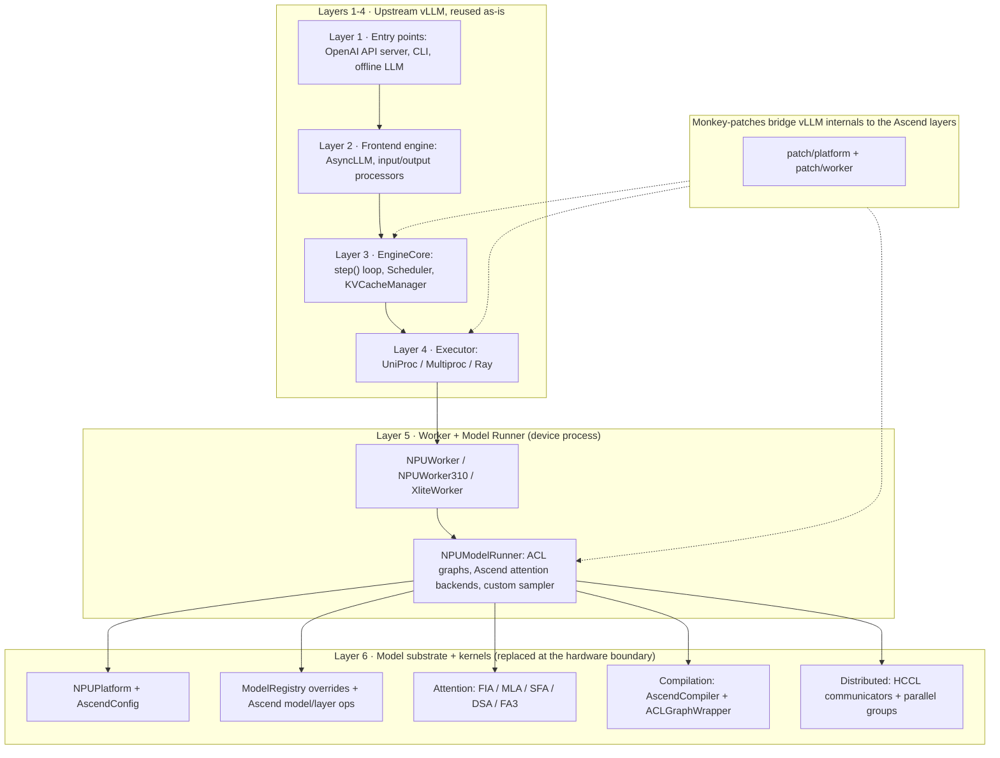
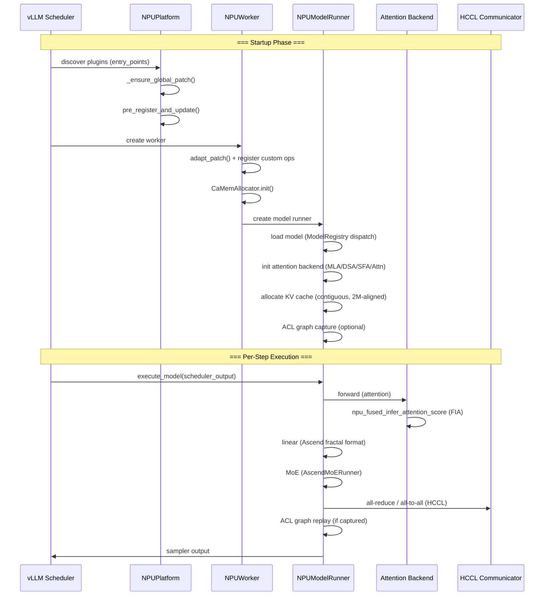

# vLLM-Ascend Architecture: How the Ascend NPU Port Integrates with vLLM

**Repository:** [vllm-project/vllm-ascend](https://github.com/vllm-project/vllm-ascend) @ `32a59d4e349c12c32cdbc1916436c16e39939afc` (main, clean, inspected 2026-08-03)

**Related pages:** [vLLM Architecture and Code Organization Overview](../vllm/vllm-overview.md), [vLLM Ascend Hub](./index.md), [vLLM-Ascend Kimi K3 MoE Forward](./kimi-k3-moe-forward.md), [DeepSeek-V4 Lightning Indexer C8 Quantization](./deepseek-v4-lightning-indexer-c8.md), [DeepSeek-V4 Inference on Ascend: The DSA Serving Stack](./deepseek-v4-inference.md), [Qwen3.5 / Qwen3.6 Inference Path on vLLM Ascend](./qwen3.5-qwen3.6-inference.md), [DeepSeek V4 Attention Code Reading](../deepseek/v4-attention-code-reading.md), [Triton in vLLM/vllm-ascend](../triton/triton-in-vllm.md), [vLLM Framework](../vllm/vllm-framework.md)

## TL;DR

**What:** vllm-ascend is a plugin-based port of vLLM to Huawei Ascend NPU hardware. Against vLLM's six-layer stack, it **keeps layers 1-4 (entry points, frontend engine, EngineCore, executor) untouched and replaces the hardware half of layers 5-6** (worker/model runner and the model + kernel substrate).

**How:** Five integration mechanisms work together: Python entry-point plugin registration, the `NPUPlatform` abstraction for compile/runtime defaults, `ModelRegistry` overrides for Ascend-specific model classes, extensive [monkey-patches](../../terms/monkey-patching.md) for CUDA-coupled internals, and custom backends for attention (FIA/MLA/SFA/DSA/FA3), communication (HCCL), and graph capture (ACL graphs).

**The number:** ~18,000 lines of Ascend-specific Python code plus C++/AscendC kernels, integrated without a single line changed in upstream vLLM.

## How vllm-ascend Maps Onto vLLM's Six-Layer Stack

The [vLLM Architecture and Code Organization Overview](../vllm/vllm-overview.md) frames vLLM as a six-layer stack split across three processes: layers 1-4 are pure orchestration (entry points, frontend engine, EngineCore, executor), layers 5-6 are the hardware (worker/model runner, then model substrate and native kernels). vllm-ascend's design fits in one sentence: **it reuses vLLM's layers 1-4 unchanged and replaces the hardware half of layers 5-6.**

| Layer (from the vLLM overview) | What upstream vLLM provides | What vllm-ascend does |
|---|---|---|
| 1 · Entry points (API process) | OpenAI / Anthropic / pooling / MCP servers, CLI, offline `LLM` | **Reuses as-is.** The OpenAI-compatible server runs unmodified. |
| 2 · Frontend engine (API process) | `AsyncLLM`, input/output processors, detokenizer | **Reuses as-is.** Request admission and streaming are hardware-agnostic. |
| 3 · EngineCore (engine process) | `step()` loop, `Scheduler`, `KVCacheManager` + `BlockPool` | **Reuses the loop and scheduler**; patches only the KV-cache layer (2M-aligned contiguous KV, per-group cache managers) via `patch/kv_cache_*`. |
| 4 · Executor (process topology) | UniProc / Multiproc / Ray | **Reuses**; small patches for NPU device ids and the multiproc executor. |
| 5 · Worker + Model Runner (device process) | `GPUWorker`, `GPUModelRunner`, `InputBatch`, `Sampler` | **Replaced.** <a class="code-link" href="../../../external-repos/vllm-ascend/vllm_ascend/worker/worker.py#L89" data-code-repo="vllm-ascend-32a59d4e349c" data-code-path="vllm_ascend/worker/worker.py" data-code-line="89"><code>NPUWorker</code></a> (plus `NPUWorker310` / `XliteWorker` variants), <a class="code-link" href="../../../external-repos/vllm-ascend/vllm_ascend/worker/model_runner_v1.py#L269" data-code-repo="vllm-ascend-32a59d4e349c" data-code-path="vllm_ascend/worker/model_runner_v1.py" data-code-line="269"><code>NPUModelRunner</code></a> with ACL-graph capture, Ascend attention backends, custom sampler. |
| 6 · Model substrate + kernels | model registry, `layers/`, attention backends, `platforms/`, compilation, distributed | **Replaced at the hardware boundary.** <a class="code-link" href="../../../external-repos/vllm-ascend/vllm_ascend/platform.py#L127" data-code-repo="vllm-ascend-32a59d4e349c" data-code-path="vllm_ascend/platform.py" data-code-line="127"><code>NPUPlatform</code></a>, `ModelRegistry` overrides, Ascend model/layer ops, FIA/MLA/SFA/DSA/FA3 attention backends, `AscendCompiler` + ACL graphs, HCCL communicators. |

The three-process rule from the overview still holds: layers 1-2 never touch an NPU, layer 3 is the engine brain, and layer 5 is where scheduled tokens become NPU tensors. vllm-ascend changes *what* layer 5 executes and *which* substrate layer 6 provides — never *when* layers 1-4 act. Everything below describes how those two layers get replaced and glued in.

## The Big Picture

[Mermaid source](./assets/vllm-ascend-architecture.mmd)



*① vLLM discovers vllm-ascend through Python entry points at startup. ② Layers 1-4 — the OpenAI server, frontend engine, the `step()` scheduling loop, and the executor — run unchanged from upstream. ③ Layer 5 is replaced: `NPUWorker` (or its 310P / xlite variants) and `NPUModelRunner` execute scheduled batches with ACL-graph capture and Ascend attention backends. ④ Layer 6 substrate is replaced at the hardware boundary: `NPUPlatform`, Ascend model/layer ops, FIA/MLA/SFA/DSA/FA3 attention, `AscendCompiler`, and HCCL communication. ⑤ Monkey-patches glue CUDA-coupled vLLM internals to the Ascend layers at startup.*

## Five Integration Mechanisms

vllm-ascend extends vLLM through five complementary mechanisms. Each solves a different class of CUDA-to-Ascend adaptation problem.

### 1. Plugin Registration — The Entry Point

vLLM's plugin system discovers vllm-ascend entirely through Python entry points declared in <a class="code-link" href="../../../external-repos/vllm-ascend/setup.py#L543" data-code-repo="vllm-ascend-32a59d4e349c" data-code-path="setup.py" data-code-line="543"><code>setup.py</code></a>:

```text
vllm.platform_plugins  → vllm_ascend:register()       → NPUPlatform
vllm.general_plugins   → register_model()             → ModelRegistry overrides
vllm.general_plugins   → register_connector()         → KV/weight transfer engines
vllm.general_plugins   → register_model_loader()      → NetLoader, RForkLoader
vllm.general_plugins   → register_service_profiling() → profiling config
```

When vLLM starts, it calls <a class="code-link" href="../../../external-repos/vllm-ascend/vllm_ascend/__init__.py#L38" data-code-repo="vllm-ascend-32a59d4e349c" data-code-path="vllm_ascend/__init__.py" data-code-line="38"><code>vllm_ascend/__init__.py</code></a> (`register()`), which returns `"vllm_ascend.platform.NPUPlatform"`. The platform is classified as `PlatformEnum.OOT` ("out-of-tree"), telling vLLM this is a third-party platform rather than a built-in CUDA/AMD/XPU target. All five registration functions call `_ensure_global_patch()` first, which applies the monkey-patch layer before any worker or model is initialized.

### 2. NPUPlatform — The Default Switchboard

<a class="code-link" href="../../../external-repos/vllm-ascend/vllm_ascend/platform.py#L127" data-code-repo="vllm-ascend-32a59d4e349c" data-code-path="vllm_ascend/platform.py" data-code-line="127"><code>NPUPlatform</code></a> (inheriting vLLM's `Platform`) is the central configuration point. Every vLLM component that needs platform-specific behavior queries the platform object:

| Setting | Standard vLLM (CUDA) | vllm-ascend |
|---|---|---|
| `device_type` | `"cuda"` | `"npu"` |
| `simple_compile_backend` | `"inductor"` | `"eager"` |
| `get_compile_backend()` | TorchInductor | `AscendCompiler` (ACL graph-based) |
| `get_pass_manager_cls()` | Inductor PassManager | `GraphFusionPassManager` |
| Graph capture | CUDA graphs | `torch.npu.NPUGraph` + `torch.npu.graph` (ACL graphs) |
| Memory allocator | PyTorch CUDA allocator | `CaMemAllocator` (pluggable, sleep-capable) |
| `is_sleep_mode_available()` | `False` | `True`, backed by the <a class="code-link" href="../../../external-repos/vllm-ascend/vllm_ascend/device_allocator/camem.py#L113" data-code-repo="vllm-ascend-32a59d4e349c" data-code-path="vllm_ascend/device_allocator/camem.py" data-code-line="113"><code>CaMemAllocator</code></a> |
| `num_compute_units()` | SM count | NPU Cube Core count |
| Quantization choices | CUDA-native | Adds `"ascend"` to CLI choices |
| Static graph wrapper | CUDA graph wrapper | <a class="code-link" href="../../../external-repos/vllm-ascend/vllm_ascend/compilation/acl_graph.py#L60" data-code-repo="vllm-ascend-32a59d4e349c" data-code-path="vllm_ascend/compilation/acl_graph.py" data-code-line="60"><code>ACLGraphWrapper</code></a> via `get_static_graph_wrapper_cls()` |
| Opaque attention op | `opaque_attention_op()=False` | `True` — attention runs through Ascend's fused op |

Key design decisions:

- **`simple_compile_backend = "eager"`**: Disables TorchInductor's default compilation path. Ascend uses its own `AscendCompiler` which lowers FX graphs to ACL (Ascend Compute Language) graphs rather than Triton/CUDA kernels.
- **`pre_register_and_update()`**: Applies global patches, forces `VLLM_DISABLE_SHARED_EXPERTS_STREAM=1` (workaround for a CUDA-specific hardcode), disables breakable cudagraph for DeepSeek V4, and sets Ascend-specific SP defaults.
- **`apply_config_platform_defaults()`**: Caps max cudagraph capture size at `max_num_seqs * decode_query_len` (max 512), sets Ascend-specific [sequence parallelism](../../terms/sequence-parallelism.md) defaults.

### 3. Model Registry — Ascend-Specific Model Classes

vllm-ascend registers Ascend-specific model implementations via vLLM's `ModelRegistry`, overriding the default model classes:

```python
ModelRegistry.register_model("DeepseekV4ForCausalLM", AscendDeepseekV4ForCausalLM)
ModelRegistry.register_model("DSparkDraftModel", DSparkDeepseekV4ForCausalLM)
ModelRegistry.register_model("MiniMaxM3SparseForCausalLM", AscendMiniMaxM3SparseForCausalLM)
```

These overrides swap in Ascend-custom components:

- **Attention backends**: `AscendMLABackend` (MLA for DeepSeek V2/V3), `AscendSFABackend` (Sparse Flash Attention for DeepSeek-V3.2-style sparse MLA), `AscendDSABackend` (DeepSeek Sparse Attention for DeepSeek-V4 compressed attention)
- **Linear layers**: Fractal-format Ascend linear ops instead of `torch.nn.Linear`
- **RoPE**: `AscendDeepseekScalingRotaryEmbedding` with complex-exponential kernels for V4
- **MoE**: `AscendMoERunner` replaces upstream `FusedMoE` (see [Kimi K3 MoE Forward Insight](./kimi-k3-moe-forward.md))

The model classes themselves are thin — most logic lives in the backends and ops they dispatch to.

### 4. Monkey-Patches — Adapting CUDA-Coupled Internals

This is the most aggressive integration mechanism. `vllm_ascend/patch/` contains runtime monkey-patches that modify vLLM internals before they execute:

**`patch/platform/`** — Platform-layer patches:

- <a class="code-link" href="../../../external-repos/vllm-ascend/vllm_ascend/patch/platform/patch_fused_moe.py#L45" data-code-repo="vllm-ascend-32a59d4e349c" data-code-path="vllm_ascend/patch/platform/patch_fused_moe.py" data-code-line="45"><code>patch_fused_moe.py</code></a>: Replaces the upstream `FusedMoE` factory with `AscendMoERunner` before model import
- The KV connector patch: Adapts KV transfer for PD (prefill-decode) disaggregation
- <a class="code-link" href="../../../external-repos/vllm-ascend/vllm_ascend/patch/platform/patch_distributed.py#L33" data-code-repo="vllm-ascend-32a59d4e349c" data-code-path="vllm_ascend/patch/platform/patch_distributed.py" data-code-line="33"><code>patch_distributed.py</code></a>: Adapts `all_reduce` for 310P device type
- Other patches: KV cache coordinator and utils, speculative config, weight transfer engine, Mamba config, MiniMax M2 config, MLA prefill backend, multiprocess executor, DP device IDs, profiling chunk, structured output, torch accelerator, V2 model runner

**`patch/worker/`** — Worker-layer patches:

- CUDA graph references redirected to ACL graph paths
- DeepSeek MTP (multi-token prediction) adapted for Ascend
- Eagle3, [FP8](../../terms/fp8.md), Triton paths adapted
- Model-specific paths: Qwen3, MiniMax M2, Kimi K2.5

Patches are applied once globally via `_ensure_global_patch()` and never re-applied. This is a practical trade-off: it allows vllm-ascend to work with upstream vLLM without maintaining a fork, at the cost of fragility when vLLM internals change.

### 5. Custom Backends — The Hardware Execution Substrate

Every hardware-touching code path is replaced with an Ascend-native equivalent:

#### Attention Backends

vLLM's attention is replaced by custom backends, all registered as `AttentionBackendEnum.CUSTOM` under the `"ASCEND"` name. Which backend a model gets is decided by `NPUPlatform.get_attn_backend_cls` (<a class="code-link" href="../../../external-repos/vllm-ascend/vllm_ascend/platform.py#L796" data-code-repo="vllm-ascend-32a59d4e349c" data-code-path="vllm_ascend/platform.py" data-code-line="796" data-code-end-line="822"><code>get_attn_backend_cls</code></a>) from three model-level flags — `use_mla`, `use_sparse`, `use_compress`:

| `(mla, sparse, compress)` | Backend | Model |
|---|---|---|
| `(False, False, _)` | `AscendAttentionBackend` | General GQA/MQA (Llama, Qwen) |
| `(True, False, False)` | `AscendMLABackend` | DeepSeek V2/V3 MLA |
| `(True, True, False)` | `AscendSFABackend` | DeepSeek-V3.2-style sparse MLA |
| `(True, False, True)` | `AscendDSABackend` | DeepSeek-V4 compressed attention |

`use_sparse` is true only when the model config has `index_topk` and **no** `compress_ratios` (<a class="code-link" href="../../../external-repos/vllm-ascend/vllm_ascend/utils.py#L111" data-code-repo="vllm-ascend-32a59d4e349c" data-code-path="vllm_ascend/utils.py" data-code-line="111" data-code-end-line="119"><code>model_uses_sfa_sparse</code></a>, mirrored in <a class="code-link" href="../../../external-repos/vllm-ascend/vllm_ascend/worker/model_runner_v1.py#L351" data-code-repo="vllm-ascend-32a59d4e349c" data-code-path="vllm_ascend/worker/model_runner_v1.py" data-code-line="351" data-code-end-line="356"><code>NPUModelRunner</code></a>); `use_compress` is true when `compress_ratios` is present (DeepSeek-V4).

| Backend | Use Case | Key Kernel |
|---|---|---|
| `AscendAttentionBackend` | General GQA/MQA (Llama, Qwen) | `torch_npu.npu_fused_infer_attention_score` (FIA) |
| `AscendMLABackend` | [MLA](../../terms/kv-cache.md) (DeepSeek V2/V3) | MLAPO (MLA Prefill Operator) |
| `AscendSFABackend` | Sparse Flash Attention — DeepSeek-V3.2-style sparse MLA (`index_topk`, no compression) | Custom SFA kernel (`npu_lightning_indexer*`) |
| `AscendDSABackend` | DeepSeek Sparse Attention — DeepSeek-V4 (`compress_ratios`) | Custom DSA kernel (`npu_sparse_attn_sharedkv`, quantized lightning indexer) |
| `AscendFABackend` | FA3 path, when `FLASH_ATTN` is selected and FA3 validation passes | FIA/FA3 |

The two sparse backends — <a class="code-link" href="../../../external-repos/vllm-ascend/vllm_ascend/attention/sfa_v1.py#L112" data-code-repo="vllm-ascend-32a59d4e349c" data-code-path="vllm_ascend/attention/sfa_v1.py" data-code-line="112" data-code-end-line="113"><code>AscendSFABackend</code></a> and <a class="code-link" href="../../../external-repos/vllm-ascend/vllm_ascend/attention/dsa_v1.py#L191" data-code-repo="vllm-ascend-32a59d4e349c" data-code-path="vllm_ascend/attention/dsa_v1.py" data-code-line="191" data-code-end-line="192"><code>AscendDSABackend</code></a> — share the [Lightning Indexer](../../terms/lightning-indexer.md) but differ in what it selects and which operator generation runs it: SFA (DeepSeek-V3.2-style) selects top-k **tokens** over the uncompressed KV cache via `npu_lightning_indexer_quant`; DSA (DeepSeek-V4) selects top-k **compressed blocks** via `npu_vllm_quant_lightning_indexer` + its AICPU metadata pre-op, with an always-8-bit ("C8") indexer cache. See [DeepSeek-V4 Lightning Indexer C8 Quantization](./deepseek-v4-lightning-indexer-c8.md).

Each backend also has a **[context-parallel](../../terms/context-parallelism.md) variant** (`AscendAttentionDCP`, `AscendDSACP`, `AscendSFADCP`) activated when decode context parallelism (`enable_dcp()`) is on.

The `AscendFABackend` FA3 path is only taken when the user explicitly selects `FLASH_ATTN` and `flash_attn_npu_v3` passes the <a class="code-link" href="../../../external-repos/vllm-ascend/vllm_ascend/attention/fa3_v1.py#L12" data-code-repo="vllm-ascend-32a59d4e349c" data-code-path="vllm_ascend/attention/fa3_v1.py" data-code-line="12"><code>AscendFABackend</code></a> validation (`_validate_fa3_backend`); it is the training-inference-consistency path. On 310P devices the whole selection collapses to a single dense `AscendAttentionBackend310` — MLA/SFA/DSA are not yet supported there.

The attention computation uses Ascend's **FIA** (Fused Infer Attention) API instead of FlashAttention CUDA kernels. FIA fuses the QK computation, softmax, and PV multiplication into a single NPU operator, analogous to FlashAttention's fusion strategy but implemented through CANN rather than CUDA.

#### Communication: HCCL Replaces NCCL

All collective communication uses HCCL (Huawei Collective Communication Library) through two abstractions:

- **`PyHcclCommunicator`**: A Python wrapper around the HCCL C API, analogous to vLLM's `PyNcclCommunicator` for custom [all-reduce](../../terms/all-reduce.md) in [tensor parallelism](../../terms/tensor-parallelism.md). Manages HCCL unique IDs, communicator creation, and collective operations.
- **`NPUCommunicator`**: Implements `DeviceCommunicatorBase`, providing `all_to_all` via `dist.all_to_all` with HCCL backend. Uses a no-op `all2all_manager` — MoE [all-to-all](../../terms/all-to-all.md) communication uses mc2/[all_gather](../../terms/all-gather.md) instead.

Ascend-specific parallel groups (<a class="code-link" href="../../../external-repos/vllm-ascend/vllm_ascend/distributed/parallel_state.py#L86" data-code-repo="vllm-ascend-32a59d4e349c" data-code-path="vllm_ascend/distributed/parallel_state.py" data-code-line="86"><code>parallel_state.py</code></a>) extend vLLM's standard TP/PP/DP groups with fine-grained groups: `_MC2` for MoE EP-like communication, `_MLP_TP`/`_OTP`/`_LMTP`/`_EMBED_TP` for component-specific tensor parallelism, `_P_TP` for PD disaggregation, and `_DYNAMIC_EPLB` for expert-parallel load balancing.

#### ACL Graph Capture — The CUDA-Graph Equivalent

vllm-ascend does not execute CUDA Graphs on an NPU. It reuses vLLM's CUDA-oriented graph modes, capture-size configuration, and capture orchestration, but the actual graph object and capture context come from PyTorch NPU's `NPUGraph`/`graph` API backed by Ascend's CANN/ACL runtime:

- **`ACLGraphWrapper`**: Creates a `torch.npu.NPUGraph`, captures the runnable inside `torch.npu.graph(..., pool=...)`, stores one entry per `BatchDescriptor`, and calls `entry.aclgraph.replay()` on later matching calls. It also keeps graph workspaces and outputs weakly referenced to reduce memory retention.
- **`NPUModelRunner.capture_model()`**: Reuses upstream vLLM capture orchestration while temporarily mapping CUDA-facing stream/event calls to `torch.npu` APIs. This is an API-compatibility bridge, not a CUDA graph execution path.
- **Replay contract**: The wrapper itself does not allocate persistent input buffers or copy new batches into them. The surrounding runner owns that preparation; in debug mode the wrapper checks that replay tensors keep the same addresses captured by the graph.
- **Three modes**: `FULL` (entire model graph), `PIECEWISE` (section-by-section), and `NONE` (no graph capture)
- **`npugraph_ex` mode**: Uses static kernel compilation for extra performance on supported devices
- **`AscendCompiler`**: Custom compile backend (<a class="code-link" href="../../../external-repos/vllm-ascend/vllm_ascend/compilation/compiler_interface.py#L39" data-code-repo="vllm-ascend-32a59d4e349c" data-code-path="vllm_ascend/compilation/compiler_interface.py" data-code-line="39"><code>compilation/compiler_interface.py</code></a>) that uses `aot_autograd` + Ascend's `PassManager` for graph fusion instead of TorchInductor

The ACL graph path mirrors CUDA graphs conceptually: capture a static execution trace once, replay it for subsequent forward passes. The difference is the underlying runtime — ACL graphs execute through CANN's runtime rather than CUDA's driver API.

#### Custom Ops

An extensive set of custom Ascend ops replace standard PyTorch ops:

| Module | What It Replaces |
|---|---|
| <a class="code-link" href="../../../external-repos/vllm-ascend/vllm_ascend/ops/mla.py#L66" data-code-repo="vllm-ascend-32a59d4e349c" data-code-path="vllm_ascend/ops/mla.py" data-code-line="66"><code>ops/mla.py</code></a> | Multi-head Latent Attention for DeepSeek V2/V3 |
| <a class="code-link" href="../../../external-repos/vllm-ascend/vllm_ascend/ops/dsa.py#L61" data-code-repo="vllm-ascend-32a59d4e349c" data-code-path="vllm_ascend/ops/dsa.py" data-code-line="61"><code>ops/dsa.py</code></a> | DeepSeek Sparse Attention kernels |
| <a class="code-link" href="../../../external-repos/vllm-ascend/vllm_ascend/ops/linear.py#L53" data-code-repo="vllm-ascend-32a59d4e349c" data-code-path="vllm_ascend/ops/linear.py" data-code-line="53"><code>ops/linear.py</code></a> | Fractal-format linear layers |
| <a class="code-link" href="../../../external-repos/vllm-ascend/vllm_ascend/ops/rotary_embedding.py#L63" data-code-repo="vllm-ascend-32a59d4e349c" data-code-path="vllm_ascend/ops/rotary_embedding.py" data-code-line="63"><code>ops/rotary_embedding.py</code></a> | RoPE with DeepSeek scaling |
| <a class="code-link" href="../../../external-repos/vllm-ascend/vllm_ascend/ops/rope_dsv4.py#L12" data-code-repo="vllm-ascend-32a59d4e349c" data-code-path="vllm_ascend/ops/rope_dsv4.py" data-code-line="12"><code>ops/rope_dsv4.py</code></a> | Complex exponential RoPE for V4 |
| <a class="code-link" href="../../../external-repos/vllm-ascend/vllm_ascend/ops/layernorm.py#L28" data-code-repo="vllm-ascend-32a59d4e349c" data-code-path="vllm_ascend/ops/layernorm.py" data-code-line="28"><code>ops/layernorm.py</code></a> | Custom RMSNorm in the [LayerNorm](../../terms/layer-normalization.md) operator family |
| <a class="code-link" href="../../../external-repos/vllm-ascend/vllm_ascend/ops/activation.py#L29" data-code-repo="vllm-ascend-32a59d4e349c" data-code-path="vllm_ascend/ops/activation.py" data-code-line="29"><code>ops/activation.py</code></a> | AscendQuickGELU, AscendSiluAndMul |
| `ops/fused_moe/` | Fused MoE with Ascend optimizations |
| <a class="code-link" href="../../../external-repos/vllm-ascend/vllm_ascend/ops/vocab_parallel_embedding.py#L45" data-code-repo="vllm-ascend-32a59d4e349c" data-code-path="vllm_ascend/ops/vocab_parallel_embedding.py" data-code-line="45"><code>ops/vocab_parallel_embedding.py</code></a> | Ascend-optimized embedding |
| `ops/triton/` | Triton-ascend kernels (rmsnorm+rope, FLA, GDN gating) |

All custom ops are registered as `torch.ops._C_ascend.*`. Dummy fusion ops (`rms_norm`, `fused_add_rms_norm`, `static_scaled_fp8_quant`, etc.) are registered at init to prevent torch compile errors on paths that reference these ops but don't execute them on Ascend.

### Worker Variants and the Memory Allocator

Layer 5's worker is not a single class. `NPUPlatform.check_and_update_config` picks which one to use based on the device:

| Worker | Extends | When |
|---|---|---|
| <a class="code-link" href="../../../external-repos/vllm-ascend/vllm_ascend/worker/worker.py#L89" data-code-repo="vllm-ascend-32a59d4e349c" data-code-path="vllm_ascend/worker/worker.py" data-code-line="89"><code>NPUWorker</code></a> | `WorkerBase` | Default Ascend worker (910B/A2/A3/A5) |
| <a class="code-link" href="../../../external-repos/vllm-ascend/vllm_ascend/_310p/worker_310p.py#L32" data-code-repo="vllm-ascend-32a59d4e349c" data-code-path="vllm_ascend/_310p/worker_310p.py" data-code-line="32"><code>NPUWorker310</code></a> | `NPUWorker` | 310P devices, with 310P-specific attention/sampling/quantization |
| <a class="code-link" href="../../../external-repos/vllm-ascend/vllm_ascend/xlite/xlite_worker.py#L22" data-code-repo="vllm-ascend-32a59d4e349c" data-code-path="vllm_ascend/xlite/xlite_worker.py" data-code-line="22"><code>XliteWorker</code></a> | `NPUWorker` | openEuler GVirt xlite (virtualized NPU) |

All workers initialize the pluggable <a class="code-link" href="../../../external-repos/vllm-ascend/vllm_ascend/device_allocator/camem.py#L113" data-code-repo="vllm-ascend-32a59d4e349c" data-code-path="vllm_ascend/device_allocator/camem.py" data-code-line="113"><code>CaMemAllocator</code></a> — the allocator that makes sleep mode possible. `NPUPlatform.is_cumem_allocator_available()` reports it as available so vLLM's sleep-mode gating accepts the NPU path.

The worker keeps the upstream split between **worker and model runner** ([vLLM overview §6.5](../vllm/vllm-overview.md)): the worker is the process-level shell, the model runner is the step-level executor. <a class="code-link" href="../../../external-repos/vllm-ascend/vllm_ascend/worker/worker.py#L590" data-code-repo="vllm-ascend-32a59d4e349c" data-code-path="vllm_ascend/worker/worker.py" data-code-line="590"><code>NPUWorker.execute_model</code></a> handles pipeline-parallel send/receive and then delegates to <a class="code-link" href="../../../external-repos/vllm-ascend/vllm_ascend/worker/model_runner_v1.py#L1707" data-code-repo="vllm-ascend-32a59d4e349c" data-code-path="vllm_ascend/worker/model_runner_v1.py" data-code-line="1707"><code>NPUModelRunner.execute_model</code></a>; everything else the worker does — device init, sleep/wakeup, weight transfer, health checks — wraps the same once-per-process concerns that upstream workers own.

## Execution Flow: End-to-End

Here is the complete flow from vLLM startup to per-step execution:



## What vLLM Code Is Reused As-Is

The key design insight is what vllm-ascend **does not** touch:

| vLLM Component | Reused? | Why |
|---|---|---|
| Scheduler (V1 iteration loop) | ✅ Fully | Pure Python logic, no CUDA dependency |
| Block Manager (paged KV cache) | ✅ Fully | Allocates abstract blocks; only the cache tensor itself is Ascend-specific |
| Prefix caching / automatic prefix caching | ✅ Fully | Hash-based, hardware-agnostic |
| Preemption / swapping | ✅ Fully | Scheduler logic only |
| OpenAI API server / tokenizer | ✅ Fully | HTTP + tokenization, no device code |
| Sequence / request lifecycle | ✅ Fully | Pure Python state machines |
| Sampling / penalties | ⚠️ Mostly | Custom `AscendSampler` for some paths |
| Speculative decoding | ⚠️ Mostly | Custom proposers (DSpark, Eagle, Medusa) |
| Weight loading (safetensors) | ✅ Fully | Disk I/O, no device dependency |

This is why vllm-ascend stays at ~18K lines of Ascend-specific code: it only replaces the ~15-20% of vLLM that touches hardware directly.

## Sleep Mode and Memory Management

vllm-ascend implements **sleep mode** via the <a class="code-link" href="../../../external-repos/vllm-ascend/vllm_ascend/device_allocator/camem.py#L113" data-code-repo="vllm-ascend-32a59d4e349c" data-code-path="vllm_ascend/device_allocator/camem.py" data-code-line="113"><code>CaMemAllocator</code></a> — a pluggable NPU memory allocator that can offload/free NPU memory while preserving critical tensors:

- `NPUWorker.sleep()`: Frees non-essential NPU memory via `CaMemAllocator`, allowing other processes to use the NPU while the vLLM server is idle
- `NPUWorker.wake_up()`: Restores device tensors from preserved allocations
- `SleepWakeupManager`: Coordinates the sleep/wakeup lifecycle across workers

This is useful in multi-tenant NPU clusters where NPU memory is scarce and vLLM servers may be idle for extended periods. The `CaMemAllocator` is analogous to CUDA's memory pool but with explicit sleep/wakeup support at the allocator level.

## Where It Breaks

| Failure mode | When it happens | Impact |
|---|---|---|
| Monkey-patch drift | Upstream vLLM renames or moves an internal symbol a patch touches | Import/runtime errors on upgrade; the patch list must be re-validated per vLLM version |
| 310P gaps | MLA/SFA/DSA models on 310P | Selection collapses to the single dense `AscendAttentionBackend310`; sparse/MLA models unsupported |
| FA3 without the package | `--attention-backend FLASH_ATTN` while `flash_attn_npu_v3` is missing | Hard error from `_validate_fa3_backend`; install the package or drop the flag |
| xlite only when enabled | xlite graph config off, or speculation enabled in xlite full mode | Falls back to the standard `NPUWorker` path |
| `ASCEND_LAUNCH_BLOCKING=1` with ACL graphs | Debug env var set while graph capture is on | ValueError at startup; unset the variable for graph runs |
| Sleep mode without cumem | Allocator not configured on the path | Sleep/wakeup unavailable; the server stays resident |

## One Thing to Remember

vllm-ascend is **vLLM's layers 5-6 made Ascend-native**. Everything you already know about vLLM — the `step()` loop, the scheduler, KV blocks, prefix caching, the OpenAI server — runs unchanged; only the worker/model runner and the model + kernel substrate are replaced, injected through five plugin mechanisms so upstream vLLM is never forked. When you debug an Ascend problem, first decide which side owns it: layers 1-4 belong to vLLM, layers 5-6 belong to vllm-ascend.

## Related Pages

- [vLLM Architecture and Code Organization Overview](../vllm/vllm-overview.md) — the six-layer vLLM stack this page maps onto
- [vLLM-Ascend Kimi K3 MoE Forward Insight](./kimi-k3-moe-forward.md) — Deep dive into the routed-MoE path
- [DeepSeek V4 Attention Code Reading](../deepseek/v4-attention-code-reading.md) — Cross-platform attention implementation map
- [Triton in vLLM and vllm-ascend](../triton/triton-in-vllm.md) — How Triton kernels are adapted for Ascend
- [Triton Ascend Architecture](../triton-ascend/index.md) — The Ascend NPU backend for Triton
- [Continuous Batching](../../terms/continuous-batching.md) — The scheduling algorithm reused from vLLM
- [KV Cache](../../terms/kv-cache.md) — KV cache terminology and variants
- [Mixture of Experts](../../terms/mixture-of-experts.md) — MoE routing and parallelism terminology
