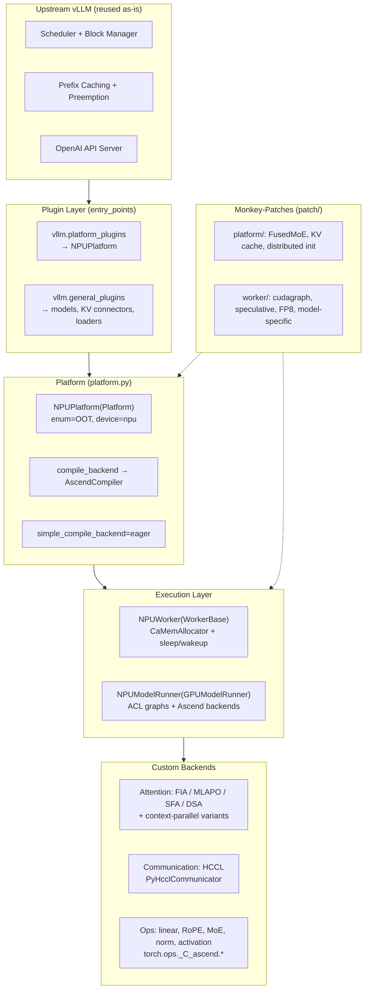
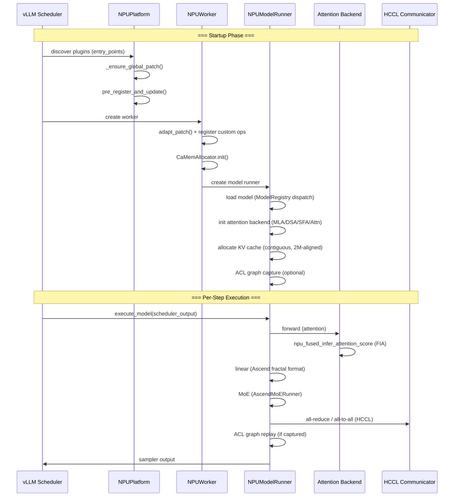

# vLLM-Ascend Architecture: How the Ascend NPU Port Integrates with vLLM

**Repository:** [vllm-project/vllm-ascend](https://github.com/vllm-project/vllm-ascend) @ `32a59d4e349c12c32cdbc1916436c16e39939afc` (main, clean, inspected 2026-08-03)

**Related pages:** [vLLM Ascend Hub](./index.md), [vLLM-Ascend Kimi K3 MoE Forward](./kimi-k3-moe-forward.md), [DeepSeek V4 Attention Code Reading](../deepseek/v4-attention-code-reading.md), [Triton in vLLM/vllm-ascend](../triton/triton-in-vllm.md), [vLLM Framework](../vllm/vllm-framework.md)

## TL;DR

**What:** vllm-ascend is a plugin-based port of vLLM to Huawei Ascend NPU hardware. It reuses all of vLLM's scheduling, memory management, and serving infrastructure, replacing only the hardware execution substrate with Ascend-native equivalents.

**How:** Five integration mechanisms work together: Python entry-point plugin registration, the `NPUPlatform` abstraction for compile/runtime defaults, `ModelRegistry` overrides for Ascend-specific model classes, extensive [monkey-patches](../../terms/monkey-patching.md) for CUDA-coupled internals, and custom backends for attention (FIA/MLAPO), communication (HCCL), and graph capture (ACL graphs).

**The number:** ~18,000 lines of Ascend-specific Python code plus C++/AscendC kernels, integrated without a single line changed in upstream vLLM.

## The Big Picture

[Mermaid source](./assets/vllm-ascend-architecture.mmd)



*① vLLM discovers vllm-ascend through Python entry points at startup. ② NPUPlatform sets compile/runtime defaults (eager mode, AscendCompiler, Ascend-specific config). ③ NPUWorker and NPUModelRunner replace the CUDA execution path with Ascend-native equivalents. ④ Custom backends handle attention (FIA/MLAPO), communication (HCCL), and all compute ops. ⑤ Monkey-patches adapt CUDA-coupled vLLM internals at runtime. ⑥ The scheduler, block manager, prefix caching, preemption, and API server run unmodified from upstream.*

## Five Integration Mechanisms

vllm-ascend extends vLLM through five complementary mechanisms. Each solves a different class of CUDA-to-Ascend adaptation problem.

### 1. Plugin Registration — The Entry Point

vLLM's plugin system discovers vllm-ascend entirely through Python entry points declared in <a class="code-link" href="../../../external-repos/vllm-ascend/setup.py#L543" data-code-repo="vllm-ascend-32a59d4e349c" data-code-path="setup.py" data-code-line="543"><code>setup.py</code></a>:

```text
vllm.platform_plugins  → vllm_ascend:register()       → NPUPlatform
vllm.general_plugins   → register_model()             → ModelRegistry overrides
vllm.general_plugins   → register_connector()         → KV/weight transfer engines
vllm.general_plugins   → register_model_loader()      → NetLoader, RForkLoader
vllm.general_plugins   → register_service_profiling() → profiling config
```

When vLLM starts, it calls `register()` which returns `"vllm_ascend.platform.NPUPlatform"`. The platform is classified as `PlatformEnum.OOT` ("out-of-tree"), telling vLLM this is a third-party platform rather than a built-in CUDA/AMD/XPU target. All five registration functions call `_ensure_global_patch()` first, which applies the monkey-patch layer before any worker or model is initialized.

### 2. NPUPlatform — The Default Switchboard

<a class="code-link" href="../../../external-repos/vllm-ascend/vllm_ascend/platform.py#L127" data-code-repo="vllm-ascend-32a59d4e349c" data-code-path="vllm_ascend/platform.py" data-code-line="127"><code>NPUPlatform</code></a> (inheriting vLLM's `Platform`) is the central configuration point. Every vLLM component that needs platform-specific behavior queries the platform object:

| Setting | Standard vLLM (CUDA) | vllm-ascend |
|---|---|---|
| `device_type` | `"cuda"` | `"npu"` |
| `simple_compile_backend` | `"inductor"` | `"eager"` |
| `get_compile_backend()` | TorchInductor | `AscendCompiler` (ACL graph-based) |
| `get_pass_manager_cls()` | Inductor PassManager | `GraphFusionPassManager` |
| Graph capture | CUDA graphs | `torch_npu.npu.warp_graph` (ACL graphs) |
| Memory allocator | PyTorch CUDA allocator | `CaMemAllocator` (pluggable, sleep-capable) |
| `is_sleep_mode_available()` | `False` | `True` |
| `num_compute_units()` | SM count | NPU Cube Core count |
| Quantization choices | CUDA-native | Adds `"ascend"` to CLI choices |

Key design decisions:

- **`simple_compile_backend = "eager"`**: Disables TorchInductor's default compilation path. Ascend uses its own `AscendCompiler` which lowers FX graphs to ACL (Ascend Compute Language) graphs rather than Triton/CUDA kernels.
- **`pre_register_and_update()`**: Applies global patches, forces `VLLM_DISABLE_SHARED_EXPERTS_STREAM=1` (workaround for a CUDA-specific hardcode), disables breakable cudagraph for DeepSeek V4, and sets Ascend-specific SP defaults.
- **`apply_config_platform_defaults()`**: Caps max cudagraph capture size at `max_num_seqs * decode_query_len` (max 512), sets Ascend-specific [sequence parallelism](../../terms/sequence-parallelism.md) defaults.

### 3. Model Registry — Ascend-Specific Model Classes

vllm-ascend registers Ascend-specific model implementations via vLLM's `ModelRegistry`, overriding the default model classes:

```python
ModelRegistry.register_model("DeepseekV4ForCausalLM", AscendDeepseekV4ForCausalLM)
ModelRegistry.register_model("DSparkDraftModel", DSparkDeepseekV4ForCausalLM)
ModelRegistry.register_model("MiniMaxM3SparseForCausalLM", AscendMiniMaxM3SparseForCausalLM)
```

These overrides swap in Ascend-custom components:

- **Attention backends**: `AscendMLABackend` (MLA for DeepSeek V2/V3), `AscendDSABackend` (DeepSeek Sparse Attention for V4 sparse), `AscendSparseFlashAttention` (SFA for V4 dense queries)
- **Linear layers**: Fractal-format Ascend linear ops instead of `torch.nn.Linear`
- **RoPE**: `AscendDeepseekScalingRotaryEmbedding` with complex-exponential kernels for V4
- **MoE**: `AscendMoERunner` replaces upstream `FusedMoE` (see [Kimi K3 MoE Forward Insight](./kimi-k3-moe-forward.md))

The model classes themselves are thin — most logic lives in the backends and ops they dispatch to.

### 4. Monkey-Patches — Adapting CUDA-Coupled Internals

This is the most aggressive integration mechanism. `vllm_ascend/patch/` contains runtime monkey-patches that modify vLLM internals before they execute:

**`patch/platform/`** — Platform-layer patches:

- <a class="code-link" href="../../../external-repos/vllm-ascend/vllm_ascend/patch/platform/patch_fused_moe.py#L45" data-code-repo="vllm-ascend-32a59d4e349c" data-code-path="vllm_ascend/patch/platform/patch_fused_moe.py" data-code-line="45"><code>patch_fused_moe.py</code></a>: Replaces the upstream `FusedMoE` factory with `AscendMoERunner` before model import
- The KV connector patch: Adapts KV transfer for PD (prefill-decode) disaggregation
- <a class="code-link" href="../../../external-repos/vllm-ascend/vllm_ascend/patch/platform/patch_distributed.py#L33" data-code-repo="vllm-ascend-32a59d4e349c" data-code-path="vllm_ascend/patch/platform/patch_distributed.py" data-code-line="33"><code>patch_distributed.py</code></a>: Adapts `all_reduce` for 310P device type
- Other patches: KV cache coordinator and utils, speculative config, weight transfer engine, Mamba config, MiniMax M2 config, MLA prefill backend, multiprocess executor, DP device IDs, profiling chunk, structured output, torch accelerator, V2 model runner

**`patch/worker/`** — Worker-layer patches:

- CUDA graph references redirected to ACL graph paths
- DeepSeek MTP (multi-token prediction) adapted for Ascend
- Eagle3, FP8, Triton paths adapted
- Model-specific paths: Qwen3, MiniMax M2, Kimi K2.5

Patches are applied once globally via `_ensure_global_patch()` and never re-applied. This is a practical trade-off: it allows vllm-ascend to work with upstream vLLM without maintaining a fork, at the cost of fragility when vLLM internals change.

### 5. Custom Backends — The Hardware Execution Substrate

Every hardware-touching code path is replaced with an Ascend-native equivalent:

#### Attention Backends

vLLM's attention is replaced by four custom backends, all registered as `AttentionBackendEnum.CUSTOM` under the `"ASCEND"` name:

| Backend | Use Case | Key Kernel |
|---|---|---|
| `AscendAttentionBackend` | General GQA/MQA (Llama, Qwen) | `torch_npu.npu_fused_infer_attention_score` (FIA) |
| `AscendMLABackend` | [MLA](../../terms/kv-cache.md) (DeepSeek V2/V3) | MLAPO (MLA Prefill Operator) |
| `AscendDSABackend` | DeepSeek Sparse Attention (V4 sparse tokens) | Custom DSA kernel |
| `AscendSparseFlashAttention` | SFA (V4 dense tokens) | Custom SFA kernel |

Each backend also has a **context-parallel variant** (`AscendAttentionDCP`, `AscendDSACP`, `AscendSFADCP`) activated when decode context parallelism (`enable_dcp()`) is on.

The attention computation uses Ascend's **FIA** (Fused Infer Attention) API instead of FlashAttention CUDA kernels. FIA fuses the QK computation, softmax, and PV multiplication into a single NPU operator, analogous to FlashAttention's fusion strategy but implemented through CANN rather than CUDA.

#### Communication: HCCL Replaces NCCL

All collective communication uses HCCL (Huawei Collective Communication Library) through two abstractions:

- **`PyHcclCommunicator`**: A Python wrapper around the HCCL C API, analogous to vLLM's `PyNcclCommunicator` for custom all-reduce in tensor parallelism. Manages HCCL unique IDs, communicator creation, and collective operations.
- **`NPUCommunicator`**: Implements `DeviceCommunicatorBase`, providing `all_to_all` via `dist.all_to_all` with HCCL backend. Uses a no-op `all2all_manager` — MoE all-to-all communication uses mc2/all_gather instead.

Ascend-specific parallel groups (<a class="code-link" href="../../../external-repos/vllm-ascend/vllm_ascend/distributed/parallel_state.py#L86" data-code-repo="vllm-ascend-32a59d4e349c" data-code-path="vllm_ascend/distributed/parallel_state.py" data-code-line="86"><code>parallel_state.py</code></a>) extend vLLM's standard TP/PP/DP groups with fine-grained groups: `_MC2` for MoE EP-like communication, `_MLP_TP`/`_OTP`/`_LMTP`/`_EMBED_TP` for component-specific tensor parallelism, `_P_TP` for PD disaggregation, and `_DYNAMIC_EPLB` for expert-parallel load balancing.

#### ACL Graph Capture — The CUDA Graph Equivalent

Instead of CUDA graphs, vllm-ascend uses **ACL graph capture** via `torch_npu.npu.warp_graph`:

- **`ACLGraphWrapper`**: Wraps `torch_npu.npu.warp_graph`, managing graph lifecycle (capture → replay) and weak-reference workspace cleanup
- **Three modes**: `FULL` (entire model graph), `PIECEWISE` (section-by-section), and `NONE` (no graph capture)
- **`npugraph_ex` mode**: Uses static kernel compilation for extra performance on supported devices
- **`AscendCompiler`**: Custom compile backend (<a class="code-link" href="../../../external-repos/vllm-ascend/vllm_ascend/compilation/compiler_interface.py#L39" data-code-repo="vllm-ascend-32a59d4e349c" data-code-path="vllm_ascend/compilation/compiler_interface.py" data-code-line="39"><code>compilation/compiler_interface.py</code></a>) that uses `aot_autograd` + Ascend's `PassManager` for graph fusion instead of TorchInductor

The ACL graph path mirrors CUDA graphs conceptually: capture a static execution trace once, replay it for subsequent forward passes. The difference is the underlying runtime — ACL graphs execute through CANN's runtime rather than CUDA's driver API.

#### Custom Ops

An extensive set of custom Ascend ops replace standard PyTorch ops:

| Module | What It Replaces |
|---|---|
| <a class="code-link" href="../../../external-repos/vllm-ascend/vllm_ascend/ops/mla.py#L66" data-code-repo="vllm-ascend-32a59d4e349c" data-code-path="vllm_ascend/ops/mla.py" data-code-line="66"><code>ops/mla.py</code></a> | Multi-head Latent Attention for DeepSeek V2/V3 |
| <a class="code-link" href="../../../external-repos/vllm-ascend/vllm_ascend/ops/dsa.py#L61" data-code-repo="vllm-ascend-32a59d4e349c" data-code-path="vllm_ascend/ops/dsa.py" data-code-line="61"><code>ops/dsa.py</code></a> | DeepSeek Sparse Attention kernels |
| <a class="code-link" href="../../../external-repos/vllm-ascend/vllm_ascend/ops/linear.py#L53" data-code-repo="vllm-ascend-32a59d4e349c" data-code-path="vllm_ascend/ops/linear.py" data-code-line="53"><code>ops/linear.py</code></a> | Fractal-format linear layers |
| <a class="code-link" href="../../../external-repos/vllm-ascend/vllm_ascend/ops/rotary_embedding.py#L63" data-code-repo="vllm-ascend-32a59d4e349c" data-code-path="vllm_ascend/ops/rotary_embedding.py" data-code-line="63"><code>ops/rotary_embedding.py</code></a> | RoPE with DeepSeek scaling |
| <a class="code-link" href="../../../external-repos/vllm-ascend/vllm_ascend/ops/rope_dsv4.py#L12" data-code-repo="vllm-ascend-32a59d4e349c" data-code-path="vllm_ascend/ops/rope_dsv4.py" data-code-line="12"><code>ops/rope_dsv4.py</code></a> | Complex exponential RoPE for V4 |
| <a class="code-link" href="../../../external-repos/vllm-ascend/vllm_ascend/ops/layernorm.py#L28" data-code-repo="vllm-ascend-32a59d4e349c" data-code-path="vllm_ascend/ops/layernorm.py" data-code-line="28"><code>ops/layernorm.py</code></a> | Custom RMSNorm |
| <a class="code-link" href="../../../external-repos/vllm-ascend/vllm_ascend/ops/activation.py#L29" data-code-repo="vllm-ascend-32a59d4e349c" data-code-path="vllm_ascend/ops/activation.py" data-code-line="29"><code>ops/activation.py</code></a> | AscendQuickGELU, AscendSiluAndMul |
| `ops/fused_moe/` | Fused MoE with Ascend optimizations |
| <a class="code-link" href="../../../external-repos/vllm-ascend/vllm_ascend/ops/vocab_parallel_embedding.py#L45" data-code-repo="vllm-ascend-32a59d4e349c" data-code-path="vllm_ascend/ops/vocab_parallel_embedding.py" data-code-line="45"><code>ops/vocab_parallel_embedding.py</code></a> | Ascend-optimized embedding |
| `ops/triton/` | Triton-ascend kernels (rmsnorm+rope, FLA, GDN gating) |

All custom ops are registered as `torch.ops._C_ascend.*`. Dummy fusion ops (`rms_norm`, `fused_add_rms_norm`, `static_scaled_fp8_quant`, etc.) are registered at init to prevent torch compile errors on paths that reference these ops but don't execute them on Ascend.

## Execution Flow: End-to-End

Here is the complete flow from vLLM startup to per-step execution:



## What vLLM Code Is Reused As-Is

The key design insight is what vllm-ascend **does not** touch:

| vLLM Component | Reused? | Why |
|---|---|---|
| Scheduler (V1 iteration loop) | ✅ Fully | Pure Python logic, no CUDA dependency |
| Block Manager (paged KV cache) | ✅ Fully | Allocates abstract blocks; only the cache tensor itself is Ascend-specific |
| Prefix caching / automatic prefix caching | ✅ Fully | Hash-based, hardware-agnostic |
| Preemption / swapping | ✅ Fully | Scheduler logic only |
| OpenAI API server / tokenizer | ✅ Fully | HTTP + tokenization, no device code |
| Sequence / request lifecycle | ✅ Fully | Pure Python state machines |
| Sampling / penalties | ⚠️ Mostly | Custom `AscendSampler` for some paths |
| Speculative decoding | ⚠️ Mostly | Custom proposers (DSpark, Eagle, Medusa) |
| Weight loading (safetensors) | ✅ Fully | Disk I/O, no device dependency |

This is why vllm-ascend stays at ~18K lines of Ascend-specific code: it only replaces the ~15-20% of vLLM that touches hardware directly.

## Sleep Mode and Memory Management

vllm-ascend implements **sleep mode** via the `CaMemAllocator` — a pluggable NPU memory allocator that can offload/free NPU memory while preserving critical tensors:

- `NPUWorker.sleep()`: Frees non-essential NPU memory via `CaMemAllocator`, allowing other processes to use the NPU while the vLLM server is idle
- `NPUWorker.wake_up()`: Restores device tensors from preserved allocations
- `SleepWakeupManager`: Coordinates the sleep/wakeup lifecycle across workers

This is useful in multi-tenant NPU clusters where NPU memory is scarce and vLLM servers may be idle for extended periods. The `CaMemAllocator` is analogous to CUDA's memory pool but with explicit sleep/wakeup support at the allocator level.

## Related Pages

- [vLLM-Ascend Kimi K3 MoE Forward Insight](./kimi-k3-moe-forward.md) — Deep dive into the routed-MoE path
- [DeepSeek V4 Attention Code Reading](../deepseek/v4-attention-code-reading.md) — Cross-platform attention implementation map
- [Triton in vLLM and vllm-ascend](../triton/triton-in-vllm.md) — How Triton kernels are adapted for Ascend
- [Triton Ascend Architecture](../triton-ascend/index.md) — The Ascend NPU backend for Triton
- [Continuous Batching](../../terms/continuous-batching.md) — The scheduling algorithm reused from vLLM
- [KV Cache](../../terms/kv-cache.md) — KV cache terminology and variants
- [Mixture of Experts](../../terms/mixture-of-experts.md) — MoE routing and parallelism terminology
