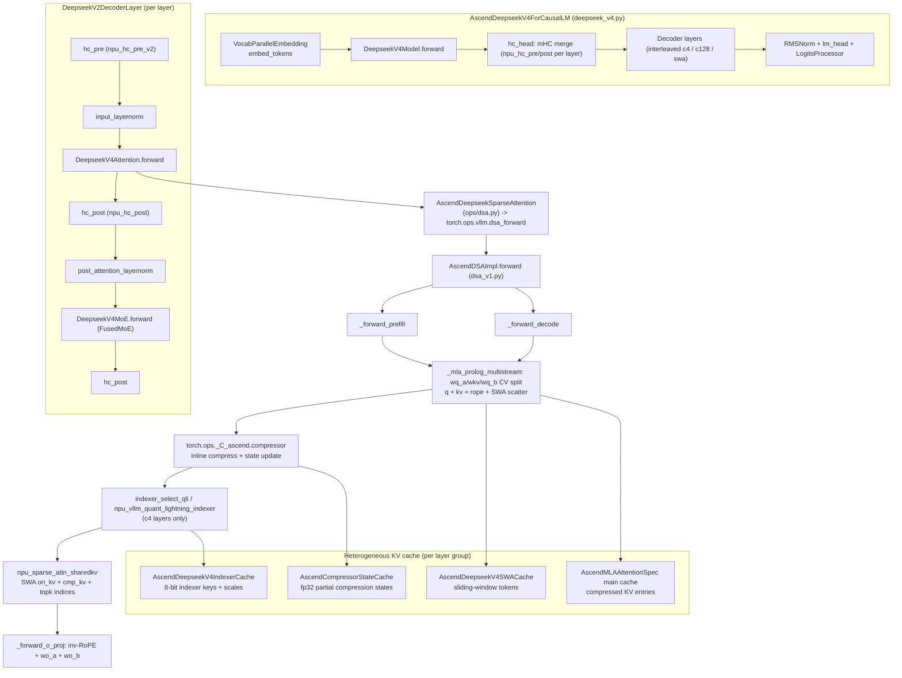
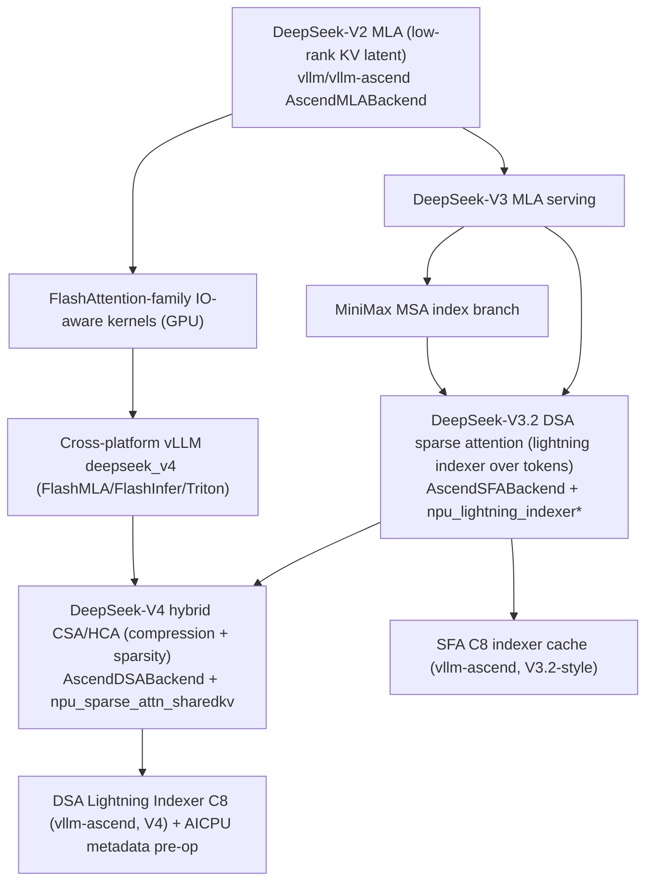

# DeepSeek-V4 Inference on Ascend: The DSA Serving Stack in vllm-ascend

**Repository:** [vllm-project/vllm-ascend](https://github.com/vllm-project/vllm-ascend) @ `32a59d4e349c12c32cdbc1916436c16e39939afc` (main, clean, inspected 2026-08-05)

**Related pages:** [vLLM Ascend Hub](./index.md), [vLLM-Ascend Architecture](./architecture.md), [DeepSeek-V4 Lightning Indexer C8 Quantization](./deepseek-v4-lightning-indexer-c8.md), [DeepSeek-V4 Attention Code Reading](../deepseek/v4-attention-code-reading.md), [DeepSeek-V4: Million-Token Context](../../training/deepseek/deepseek-v4/index.md), [DeepSeek-V3.2 Sparse Attention](../../algorithms/deepseek-v3.2/index.md)

## TL;DR

**What:** vllm-ascend replaces upstream vLLM's DeepSeek-V4 model and attention backend with Ascend-specific implementations — `AscendDeepseekV4ForCausalLM` plus the `AscendDSA` (DeepSeek Sparse Attention) backend — so a hybrid c4/c128 compressed-attention model with mHC [hyper-connections](../../terms/hyper-connections.md) and MTP runs entirely through NPU custom operators.

**How:** A model override wires the MLA-style query/KV prologue, per-layer compressor, and [Lightning Indexer](../../terms/lightning-indexer.md) into `npu_sparse_attn_sharedkv`; the DSA backend splits prefill and decode, scatters five [KV cache](../../terms/kv-cache.md) types (SWA, compressor state, compressed MLA, indexer keys, indexer scales), and runs the mHC and MTP machinery through `npu_hc_pre_v2`/`npu_hc_post` custom ops.

**The number:** One serving stack replaces three upstream layers at once — model class, attention backend, and KV cache specs — and its heterogeneous cache holds five KV types whose per-type page sizes and dtypes are chosen per device family (910B/A2/A3 vs A5).

## The Big Picture

[Mermaid source](./assets/dsv4-inference-runtime.mmd)

*Synthesized runtime flow, not a source figure. ① The registered model runs a standard embed → decoder-layer → mHC-head → LM-head chain. ② Each decoder layer brackets attention and MoE with mHC `hc_pre`/`hc_post` custom ops. ③ Attention delegates to the DSA backend through a custom `dsa_forward` op, which splits prefill and decode. ④ Per step the MLA prologue builds q/kv, the compressor folds tokens into compressed entries, the indexer picks top-k blocks (c4 layers), and `npu_sparse_attn_sharedkv` scores SWA + compressed KV. ⑤ Five KV cache types live in per-layer groups with device-specific page sizes.*

## Why This Exists

DeepSeek-V4 is a hybrid model: some layers compress KV by 4× and attend sparsely through a Lightning Indexer ("c4"/CSA layers), others compress by 128× and attend densely ("c128"/HCA layers), and every layer sits inside Manifold-Constrained Hyper-Connections (mHC) that multiply the residual stream by `hc_mult` before and after attention and FFN. At a 1M-token context, the SWA cache still holds the raw recent tokens, the compressor must fold every 4th/128th token into a state, and the indexer must score thousands of compressed blocks per query.

Upstream vLLM serves this on NVIDIA GPUs with FlashMLA/FlashInfer/Triton kernels and a CUDA-centric KV coordinator. On an Ascend NPU, none of that maps directly: the kernels are different (`npu_sparse_attn_sharedkv`), the KV paging layout is different (PA_ND vs PA_BSND, device-specific block sizes), the multi-stream overlap model is different (NPU streams + ACL graph capture), and even mHC needs custom fused operators. Without a dedicated port, DeepSeek-V4 simply could not run on Ascend hardware.

The vllm-ascend port solves this with three coordinated replacements: a **model override** (`AscendDeepseekV4ForCausalLM`), a **DSA attention backend** (`AscendDSABackend`), and **Ascend KV cache specs** (`AscendMLAAttentionSpec` / `AscendSlidingWindowMLASpec`) that teach the vLLM KV coordinator how to allocate and page the five cache types.

## The Landscape

[Mermaid source](./assets/dsv4-inference-landscape.mmd)

The Ascend DSA stack descends from DeepSeek's MLA line and its own earlier SFA backend. The V3.2 SFA backend already used a lightning indexer over *tokens*; V4's DSA backend keeps the indexer concept but applies it to *compressed blocks* inside a new `npu_sparse_attn_sharedkv` operator, with the indexer's cache running at 8-bit "C8" precision (see the [C8 page](./deepseek-v4-lightning-indexer-c8.md)).

## The Core Idea

The Ascend port does not translate kernels one-for-one; it re-architects the DeepSeek-V4 serving path around what the NPU does well: fused custom operators, heterogeneous paged KV groups, and NPU stream overlap — all captured into ACL graphs for steady-state decode. The model declares its five KV caches through Ascend specs; the DSA backend builds per-layer metadata, runs the MLA prologue, compressor, indexer, and sparse attention as a chain of `torch.ops._C_ascend` / `torch.ops.vllm` custom ops; and mHC + MTP wrap everything with `npu_hc_pre_v2` / `npu_hc_post` and a shared residual-stream buffer.

## Symbol Map

| Symbol | Human name | Meaning |
|---|---|---|
| `c4` / `c128` | layer compression ratio | CSA layer (4×, owns an indexer) vs HCA layer (128×, dense) |
| `hc_mult` | mHC stream multiplier | Residual stream expanded to `hc_mult × hidden_size` per layer |
| `wq_a`/`wq_b`/`wkv` | MLA projections | Query down-projection, query up-projection, KV projection |
| `q_norm`/`kv_norm` | MLA norms | RMSNorm over latent query / KV |
| `swa_cache` | sliding-window cache | Raw recent tokens (high-fidelity window) |
| `state_cache` | compressor state cache | fp32 partial compression states, KV + gate score |
| `compress_kv_cache` | compressed KV cache | Main MLA cache of compressed entries |
| `indexer_k_cache`/`indexer_scale_cache` | indexer caches | 8-bit indexer keys + per-token-head dequant scales |
| `sas_metadata` / `qli_metadata` | operator metadata | Core-partition info for sparse attention / quantized lightning indexer |
| `topk_indices_buffer` | IndexCache buffer | Shared top-k cache so later c4 layers can reuse an earlier layer's selection |

## Deep Dive

### 1. Model registration and the override class

**What it does:** vllm-ascend registers `AscendDeepseekV4ForCausalLM` (and `DeepSeekV4MTP`) into vLLM's `ModelRegistry`, replacing the upstream DeepSeek-V4 model for NPU runs.

**Why it matters:** The model class is the entry point for everything below; swapping it is how Ascend-specific layers, ops, and KV specs enter the pipeline without forking upstream vLLM.

**How it works:** <a class="code-link" href="../../../external-repos/vllm-ascend/vllm_ascend/models/__init__.py#L4" data-code-repo="vllm-ascend-32a59d4e349c" data-code-path="vllm_ascend/models/__init__.py" data-code-line="4" data-code-end-line="18"><code>register_model</code></a> maps `DeepseekV4ForCausalLM` to `vllm_ascend.models.deepseek_v4:AscendDeepseekV4ForCausalLM` and `DeepSeekV4MTPModel` to the MTP class. <a class="code-link" href="../../../external-repos/vllm-ascend/vllm_ascend/models/deepseek_v4.py#L1217" data-code-repo="vllm-ascend-32a59d4e349c" data-code-path="vllm_ascend/models/deepseek_v4.py" data-code-line="1217" data-code-end-line="1290"><code>AscendDeepseekV4ForCausalLM</code></a> inherits `SupportsPP`, `DeepseekV2MixtureOfExperts`, `SupportsLoRA`, and `SupportsEagle3`; it builds `DeepseekV4Model` + `lm_head` + `LogitsProcessor`, and collects MoE metadata in `set_moe_parameters`.

**The intuition:** The override is the "package manifest" — it decides which layers, MoE runner, and attention backend the model will use.

**A concrete example:** When vLLM loads `DeepseekV4ForCausalLM` on an NPU worker, `register_model` routes it to the Ascend class, whose `DeepseekV4Model` builds `DeepseekV2DecoderLayer`s (with mHC + DSA attention) instead of upstream's layers.

**Remember:** The whole Ascend DeepSeek-V4 path hangs off one registry swap.

### 2. The model forward: mHC from the first layer to the head

**What it does:** `DeepseekV4Model.forward` runs embedding, expands to `hc_mult` streams, executes the decoder layers, and merges back through `hc_head` before the LM head.

**Why it matters:** mHC (Manifold-Constrained Hyper-Connections) is how DeepSeek-V4 keeps signal stable through its deepest layers; the Ascend port implements it as custom NPU ops instead of plain tensor math.

**How it works:** On the first PP rank, hidden states are unsqueezed and repeated to `(b, s, hc_mult, h)` (<a class="code-link" href="../../../external-repos/vllm-ascend/vllm_ascend/models/deepseek_v4.py#L1103" data-code-repo="vllm-ascend-32a59d4e349c" data-code-path="vllm_ascend/models/deepseek_v4.py" data-code-line="1103" data-code-end-line="1160"><code>DeepseekV4Model.forward</code></a>). Each layer returns `(hidden_states, residual)`. After the layers, the pre-`hc_head` residual stream is stashed into a stable-address `_mtp_hidden_buffer` for the MTP draft (all-gathering first when FlashComm [sequence parallelism](../../terms/sequence-parallelism.md) is enabled), then `hc_head` (<a class="code-link" href="../../../external-repos/vllm-ascend/vllm_ascend/models/deepseek_v4.py#L1094" data-code-repo="vllm-ascend-32a59d4e349c" data-code-path="vllm_ascend/models/deepseek_v4.py" data-code-line="1094" data-code-end-line="1101"><code>hc_head</code></a>) computes a learned sigmoid-weighted mix of the streams, followed by `RMSNorm`.

**The intuition:** mHC turns one residual stream into several learnable streams per layer; `hc_head` is the final learned weighted average before the LM head.

**A concrete example:** A `hc_mult=3` model keeps `(b, s, 3, h)` alive through every layer — each decoder layer's `hc_pre`/`hc_post` combine the 3 streams with learned mixing weights, and only at the head are they folded back into one `h`-dimensional vector.

**Remember:** `hc_pre_v2`/`hc_post` run at every attention and FFN boundary; `hc_head` is the single merge point before logits.

### 3. The decoder layer: mHC + DSA attention + MoE

**What it does:** `DeepseekV2DecoderLayer.forward` is the per-layer sandwich: `hc_pre` → input norm → attention → `hc_post` → post norm → [MoE](../../terms/mixture-of-experts.md) → `hc_post`.

**Why it matters:** This is where the model's three big features (mHC, hybrid attention, MoE) physically meet in one forward pass.

**How it works:** <a class="code-link" href="../../../external-repos/vllm-ascend/vllm_ascend/models/deepseek_v4.py#L972" data-code-repo="vllm-ascend-32a59d4e349c" data-code-path="vllm_ascend/models/deepseek_v4.py" data-code-line="972" data-code-end-line="982"><code>hc_pre</code></a> calls `torch.ops._C_ascend.npu_hc_pre_v2(x, hc_fn, hc_scale, hc_base, ...)` (registered in <a class="code-link" href="../../../external-repos/vllm-ascend/csrc/torch_binding.cpp#L2519" data-code-repo="vllm-ascend-32a59d4e349c" data-code-path="csrc/torch_binding.cpp" data-code-line="2519" data-code-end-line="2525"><code>npu_hc_pre_v2</code> registration</a>); <a class="code-link" href="../../../external-repos/vllm-ascend/vllm_ascend/models/deepseek_v4.py#L984" data-code-repo="vllm-ascend-32a59d4e349c" data-code-path="vllm_ascend/models/deepseek_v4.py" data-code-line="984" data-code-end-line="1005"><code>DeepseekV2DecoderLayer.forward</code></a> runs attention and MoE between the two `hc_post` calls (<a class="code-link" href="../../../external-repos/vllm-ascend/vllm_ascend/models/deepseek_v4.py#L978" data-code-repo="vllm-ascend-32a59d4e349c" data-code-path="vllm_ascend/models/deepseek_v4.py" data-code-line="978" data-code-end-line="982"><code>hc_post</code></a> → `npu_hc_post`, registration at <a class="code-link" href="../../../external-repos/vllm-ascend/csrc/torch_binding.cpp#L2500" data-code-repo="vllm-ascend-32a59d4e349c" data-code-path="csrc/torch_binding.cpp" data-code-line="2500" data-code-end-line="2507"><code>npu_hc_post</code> registration</a>). Attention is the `DeepseekV4Attention` wrapper (Section 4); the FFN is the `DeepseekV4MoE` (Section 5).

**The intuition:** Every layer is a symmetric mHC sandwich; the mHC ops are what make deep stacks trainable at this scale.

**A concrete example:** Following one token through a layer: `hc_pre` mixes 3 streams → attention returns one stream → `hc_post` merges it back into 3 streams → MoE → `hc_post` again, keeping the manifold constraint throughout.

**Remember:** mHC wraps *both* attention and FFN inside each layer.

### 4. Attention construction: per-layer compressors, indexers, and rope

**What it does:** `DeepseekV4Attention.__init__` builds the MLA prologue modules, a per-layer `Compressor` (and `Indexer` for c4 layers), the SWA cache, and a `ComplexExpRotaryEmbedding`, all bundled into `AscendDeepseekSparseAttention`.

**Why it matters:** The per-layer `compress_ratio` (c4 vs c128 vs plain SWA) decides which modules and caches a layer gets; getting this right is what makes hybrid serving correct.

**How it works:** <a class="code-link" href="../../../external-repos/vllm-ascend/vllm_ascend/models/deepseek_v4.py#L711" data-code-repo="vllm-ascend-32a59d4e349c" data-code-path="vllm_ascend/models/deepseek_v4.py" data-code-line="711" data-code-end-line="904"><code>DeepseekV4Attention.__init__</code></a> computes the layer index and ratio via <a class="code-link" href="../../../external-repos/vllm-ascend/vllm_ascend/utils.py#L80" data-code-repo="vllm-ascend-32a59d4e349c" data-code-path="vllm_ascend/utils.py" data-code-line="80" data-code-end-line="109"><code>extract_dsv4_layer_index</code>/<code>get_dsv4_compress_ratio</code></a>. Compressor-bearing layers get a `Compressor` (with its fp32 `state_cache`); c4 layers additionally get an `Indexer` (with its 8-bit cache). The layer's rope uses `ComplexExpRotaryEmbedding` (<a class="code-link" href="../../../external-repos/vllm-ascend/vllm_ascend/ops/rope_dsv4.py#L164" data-code-repo="vllm-ascend-32a59d4e349c" data-code-path="vllm_ascend/ops/rope_dsv4.py" data-code-line="164" data-code-end-line="190"><code>ComplexExpRotaryEmbedding</code></a>) with a `c{ratio}` rope group and per-layer `rope_theta`. The `IndexCache` `skip_topk` flag (reusing a previous c4 layer's top-k, per arXiv:2603.12201) is decided here too. All modules are handed to <a class="code-link" href="../../../external-repos/vllm-ascend/vllm_ascend/ops/dsa.py#L41" data-code-repo="vllm-ascend-32a59d4e349c" data-code-path="vllm_ascend/ops/dsa.py" data-code-line="41" data-code-end-line="59"><code>DSAModules</code></a> and then to `AscendDeepseekSparseAttention`.

**The intuition:** The layer type (c4/c128/swa) is a config-driven decision that determines the whole module + cache footprint of that layer.

**A concrete example:** A `compress_ratios=[4,128,...]` config makes layer 0 a c4 layer with `Compressor(4)` + `Indexer` + SWA cache, while a `compress_ratio=1` layer gets only the SWA cache and no compressor.

**Remember:** c4 = compressor + indexer; c128 = compressor only; swa = neither.

### 5. MoE forward: routed experts with shared experts and mHC scaling

**What it does:** `DeepseekV4MoE.forward` routes tokens through grouped top-k experts and applies the `routed_scaling_factor`, with optional sequence-parallel chunking.

**Why it matters:** DeepSeek-V4 is a 1.6T/49B-active MoE; the FFN dominates FLOPs, and the Ascend port runs it through the patched `FusedMoE`/`AscendMoERunner`.

**How it works:** <a class="code-link" href="../../../external-repos/vllm-ascend/vllm_ascend/models/deepseek_v4.py#L354" data-code-repo="vllm-ascend-32a59d4e349c" data-code-path="vllm_ascend/models/deepseek_v4.py" data-code-line="354" data-code-end-line="460"><code>DeepseekV4MoE.__init__</code></a> builds a `ReplicatedLinear` gate (with hash routing on early layers) and a `FusedMoE` with grouped top-k, EPLB redundancy, and shared experts. <a class="code-link" href="../../../external-repos/vllm-ascend/vllm_ascend/models/deepseek_v4.py#L462" data-code-repo="vllm-ascend-32a59d4e349c" data-code-path="vllm_ascend/models/deepseek_v4.py" data-code-line="462" data-code-end-line="529"><code>DeepseekV4MoE.forward</code></a> computes router logits (or lets the internal router run), executes the experts, then applies `muls_add_triton` to fold in shared-expert output and `routed_scaling_factor`. Sequence-parallel mode chunks before and all-gathers after.

**The intuition:** The MoE is the compute-heavy half of each layer; the shared experts + scaling are folded into the routed output with a Triton fused add.

**A concrete example:** With `n_shared_experts=1`, a token routed to 8 of 256 experts gets expert output scaled by `routed_scaling_factor` and added to the shared MLP output via `muls_add_triton`.

**Remember:** Grouped top-k, EPLB redundant experts, and shared-expert fusion are all configured at construction, executed in one forward.

### 6. The DSA attention operator: one custom op for the whole attention pass

**What it does:** `AscendDeepseekSparseAttention.forward` wraps the entire attention + output projection in a single `torch.ops.vllm.dsa_forward` custom op that dispatches to the DSA backend implementation.

**Why it matters:** Running the whole attention pass inside one custom op is what makes it capturable into an ACL graph (a CUDA-graph replacement on NPU).

**How it works:** <a class="code-link" href="../../../external-repos/vllm-ascend/vllm_ascend/ops/dsa.py#L61" data-code-repo="vllm-ascend-32a59d4e349c" data-code-path="vllm_ascend/ops/dsa.py" data-code-line="61" data-code-end-line="176"><code>AscendDeepseekSparseAttention</code></a> builds a `DSAAttention` layer that instantiates the backend impl; <a class="code-link" href="../../../external-repos/vllm-ascend/vllm_ascend/ops/dsa.py#L157" data-code-repo="vllm-ascend-32a59d4e349c" data-code-path="vllm_ascend/ops/dsa.py" data-code-line="157" data-code-end-line="177"><code>forward</code></a> calls `torch.ops.vllm.dsa_forward(hidden_states, need_gather_q_kv, output, self.prefix)`. The registered <a class="code-link" href="../../../external-repos/vllm-ascend/vllm_ascend/ops/dsa.py#L178" data-code-repo="vllm-ascend-32a59d4e349c" data-code-path="vllm_ascend/ops/dsa.py" data-code-line="178" data-code-end-line="212"><code>dsa_forward</code></a> looks up the layer's impl from the forward context, filters metadata for this layer, and calls `AscendDSAImpl.forward`. The profiling run is special-cased (Section 8).

**The intuition:** One op = one ACL-graph node = one capturable, replayable attention pass.

**A concrete example:** During ACL graph capture, the profiler calls `dsa_forward` once per layer with no metadata; the impl zero-fills output (or runs the OTP collectives) so the graph records every op that later replay needs.

**Remember:** `dsa_forward` is registered with `dispatch_key="PrivateUse1"` and a fake impl, so torch.compile / graph capture sees a stable op boundary.

### 7. The DSA backend: metadata build + forward orchestration

**What it does:** `AscendDSABackend` provides the metadata builder and impl factory; `AscendDSAImpl.forward` orchestrates the per-layer prefill/decode execution.

**Why it matters:** This is the runtime heart — it turns scheduler output into per-layer metadata and drives all five caches and three operator chains.

**How it works:** <a class="code-link" href="../../../external-repos/vllm-ascend/vllm_ascend/attention/dsa_v1.py#L191" data-code-repo="vllm-ascend-32a59d4e349c" data-code-path="vllm_ascend/attention/dsa_v1.py" data-code-line="191" data-code-end-line="233"><code>AscendDSABackend</code></a> returns `AscendDSAMetadataBuilder` (or the DSA-CP variant) and `AscendDSAImpl` (or `AscendDSACPImpl`). The builder's <a class="code-link" href="../../../external-repos/vllm-ascend/vllm_ascend/attention/dsa_v1.py#L621" data-code-repo="vllm-ascend-32a59d4e349c" data-code-path="vllm_ascend/attention/dsa_v1.py" data-code-line="621" data-code-end-line="720"><code>build</code></a> splits decodes/prefills, computes cos/sin via <a class="code-link" href="../../../external-repos/vllm-ascend/vllm_ascend/ops/rope_dsv4.py#L83" data-code-repo="vllm-ascend-32a59d4e349c" data-code-path="vllm_ascend/ops/rope_dsv4.py" data-code-line="83" data-code-end-line="139"><code>get_cos_and_sin_dsa</code></a>, formats slot mappings, and builds prefill + decode metadata. <a class="code-link" href="../../../external-repos/vllm-ascend/vllm_ascend/attention/dsa_v1.py#L1761" data-code-repo="vllm-ascend-32a59d4e349c" data-code-path="vllm_ascend/attention/dsa_v1.py" data-code-line="1761" data-code-end-line="1835"><code>AscendDSAImpl.forward</code></a> splits hidden states into decode/prefill segments, runs `_forward_prefill`/`_forward_decode`, applies inverse partial RoPE to the output, and runs `_forward_o_proj`.

**The intuition:** The metadata builder turns ragged scheduler output into the fixed tensors the NPU kernels need; the impl then runs the same operator chain for whichever phase is present.

**A concrete example:** One step schedules 2 decodes + 1 prefill of 100 tokens: the builder emits `num_decode_tokens=2`, `num_prefill_tokens=100`, separate metadata, and the impl calls `_forward_prefill` on the prefill slice and `_forward_decode` on the decode slice, merging outputs into one `o_proj_input`.

**Remember:** Prefill and decode share the operator chain but get separate metadata and separate code paths.

### 8. The prefill path: MLA prologue → compressor → indexer → sparse attention

**What it does:** `_forward_prefill` runs the whole c4/c128 prefill: build q/kv, scatter SWA KV, compress, index, and score.

**Why it matters:** Prefill is compute-bound and builds the compressed state; it is where the compressor and indexer first run for a new sequence.

**How it works:** <a class="code-link" href="../../../external-repos/vllm-ascend/vllm_ascend/attention/dsa_v1.py#L1933" data-code-repo="vllm-ascend-32a59d4e349c" data-code-path="vllm_ascend/attention/dsa_v1.py" data-code-line="1933" data-code-end-line="2244"><code>_forward_prefill</code></a> unpacks the five caches via <a class="code-link" href="../../../external-repos/vllm-ascend/vllm_ascend/device/device_op.py#L807" data-code-repo="vllm-ascend-32a59d4e349c" data-code-path="vllm_ascend/device/device_op.py" data-code-line="807" data-code-end-line="841"><code>unpack_dsa_forward_kv_cache</code></a>. The MLA prologue runs either the multi-stream `_mla_prolog_multistream` (<a class="code-link" href="../../../external-repos/vllm-ascend/vllm_ascend/attention/dsa_v1.py#L1836" data-code-repo="vllm-ascend-32a59d4e349c" data-code-path="vllm_ascend/attention/dsa_v1.py" data-code-line="1836" data-code-end-line="1932"><code>_mla_prolog_multistream</code></a> — CV-split q/kv on two NPU streams) or the serial path. For c4/c128 layers, `_compute_compressor_metadata` and `torch.ops._C_ascend.compressor` fold tokens into the compressed cache; c4 layers additionally run `indexer_select_qli` → `npu_vllm_quant_lightning_indexer`; finally `npu_sparse_attn_sharedkv` (<a class="code-link" href="../../../external-repos/vllm-ascend/csrc/torch_binding.cpp#L2418" data-code-repo="vllm-ascend-32a59d4e349c" data-code-path="csrc/torch_binding.cpp" data-code-line="2418" data-code-end-line="2444"><code>npu_sparse_attn_sharedkv</code> registration</a>) scores SWA + compressed KV.

**The intuition:** Prefill = build every cache + compute attention once; the compressor is the step that collapses 4 (or 128) tokens into one KV entry.

**A concrete example:** A 100-token prefill through a c4 layer compresses 100 → 25 compressed entries (plus the raw SWA window), the indexer picks top-k of those 25, and sparse attention scores the window + chosen blocks.

**Remember:** The compressor output is scattered into the compressed cache with a block-offset slot mapping; a zero-row output skips scatter (A5 guard).

### 9. The decode path: one token at a time through the same chain

**What it does:** `_forward_decode` runs the same MLA → compressor → indexer → sparse-attention chain for 1-token queries.

**Why it matters:** Decode is memory-bound and must be fast; it is also the path ACL graphs capture for steady-state token generation.

**How it works:** <a class="code-link" href="../../../external-repos/vllm-ascend/vllm_ascend/attention/dsa_v1.py#L2245" data-code-repo="vllm-ascend-32a59d4e349c" data-code-path="vllm_ascend/attention/dsa_v1.py" data-code-line="2245" data-code-end-line="2558"><code>_forward_decode</code></a> reuses the same helpers with decode metadata: one query token per request, one KV update per request, compressor folds the new token into the running state, and the indexer re-scores the (now larger) compressed block list. The whole path runs inside the ACL graph once captured.

**The intuition:** Decode is prefill's "one new token" specialization — the same chain, but the compressor only updates state and the indexer re-ranks.

**A concrete example:** After a 100-token prefill, each decode step adds token 101; the c4 layer compresses it into the state, the indexer re-picks top-k from the now 26 blocks, and sparse attention scores the window + 26 blocks.

**Remember:** Decode and prefill share helper code but diverge on metadata; decode is what the ACL graph replays every step.

### 10. Output projection: inverse RoPE, grouped o_proj, and TP variants

**What it does:** `_forward_o_proj` converts attention output back to hidden space via inverse partial RoPE, `wo_a`, and `wo_b`, with three TP strategies.

**Why it matters:** The output projection is where the attention result re-enters the residual stream; its TP handling (A5 quantized path, OTP [all-to-all](../../terms/all-to-all.md), olora TP) differs per hardware and config.

**How it works:** <a class="code-link" href="../../../external-repos/vllm-ascend/vllm_ascend/attention/dsa_v1.py#L1652" data-code-repo="vllm-ascend-32a59d4e349c" data-code-path="vllm_ascend/attention/dsa_v1.py" data-code-line="1652" data-code-end-line="1760"><code>_forward_o_proj</code></a> first applies inverse partial rotary (`inplace_partial_rotary_mul` with `-sin`), then reshapes into groups. On A5 it uses an FP8 MX-quantized batch [matmul](../../terms/gemm.md) path; with `oproj_tp_enable()` it does a static-buffer `all_to_all_single` + batch matmul + `reduce_scatter_tensor`; with `olora_tp_enable()` it uses `wo_a`/`wo_b`; otherwise a plain `npu_transpose_batchmatmul` + `wo_b`.

**The intuition:** The output projection is a grouped low-rank matmul (`wo_a` then `wo_b`); on multi-rank setups it becomes an all-to-all across output-tensor-parallel groups.

**A concrete example:** With output TP=2 and 16 local groups, each rank sends half its groups to the other rank (`all_to_all`), computes `wo_a` on the received groups, then `reduce_scatter`s the result back — all through address-stable static buffers so the ACL graph stays replay-safe.

**Remember:** OTP uses static send/recv buffers on purpose — per-call allocations would desync the HCCL operator during graph replay.

### 11. Heterogeneous KV cache: five types, per-layer groups, device-specific paging

**What it does:** Each DeepSeek-V4 layer declares its KV caches through Ascend specs; the patched KV coordinator groups them and allocates device-specific page sizes.

**Why it matters:** The five cache types have wildly different sizes and dtypes; correct paging is what makes 1M-token contexts fit in NPU memory.

**How it works:** The caches are `AscendDeepseekV4SWACache` (<a class="code-link" href="../../../external-repos/vllm-ascend/vllm_ascend/models/deepseek_v4.py#L179" data-code-repo="vllm-ascend-32a59d4e349c" data-code-path="vllm_ascend/models/deepseek_v4.py" data-code-line="179" data-code-end-line="212"><code>AscendDeepseekV4SWACache</code></a>), `AscendCompressorStateCache` (<a class="code-link" href="../../../external-repos/vllm-ascend/vllm_ascend/models/deepseek_v4.py#L110" data-code-repo="vllm-ascend-32a59d4e349c" data-code-path="vllm_ascend/models/deepseek_v4.py" data-code-line="110" data-code-end-line="142"><code>AscendCompressorStateCache</code></a>), the main compressed MLA cache (`AscendMLAAttentionSpec`, <a class="code-link" href="../../../external-repos/vllm-ascend/vllm_ascend/core/kv_cache_interface.py#L19" data-code-repo="vllm-ascend-32a59d4e349c" data-code-path="vllm_ascend/core/kv_cache_interface.py" data-code-line="19" data-code-end-line="88"><code>AscendMLAAttentionSpec</code></a>), and the indexer caches (<a class="code-link" href="../../../external-repos/vllm-ascend/vllm_ascend/models/deepseek_v4.py#L143" data-code-repo="vllm-ascend-32a59d4e349c" data-code-path="vllm_ascend/models/deepseek_v4.py" data-code-line="143" data-code-end-line="177"><code>AscendDeepseekV4IndexerCache</code></a>). Block sizes come from `DSV4_BLOCK_SIZES` (<a class="code-link" href="../../../external-repos/vllm-ascend/vllm_ascend/models/layer/attention/layer.py#L28" data-code-repo="vllm-ascend-32a59d4e349c" data-code-path="vllm_ascend/models/layer/attention/layer.py" data-code-line="28" data-code-end-line="50"><code>get_dsv4_block_sizes</code></a>): `[mla, swa, c4-state, c128-state]` plus padded page sizes, with a separate A5 table. The <a class="code-link" href="../../../external-repos/vllm-ascend/vllm_ascend/patch/platform/patch_kv_cache_coordinator.py#L68" data-code-repo="vllm-ascend-32a59d4e349c" data-code-path="vllm_ascend/patch/platform/patch_kv_cache_coordinator.py" data-code-line="68" data-code-end-line="80"><code>AscendHybridKVCacheCoordinator</code></a> patch handles the hybrid multi-group case.

**The intuition:** DeepSeek-V4 doesn't have one KV cache — it has five, each sized and paged for a different granularity (raw window, partial states, compressed entries, indexer keys, indexer scales).

**A concrete example:** On a 910B device with `block_size=128`, the table gives `[128, 128, 8, 32]` — SWA and MLA use 128-token pages, c4 compressor state uses 8-token pages, c128 state uses 32-token pages — and page-padding sizes `[16640, 131072]`.

**Remember:** Cache dtype also differs by device: on A5 the SWA/compressed caches are FP8 e4m3fn; on 910B/A2/A3 they are BF16 (indexer cache is INT8).

### 12. MTP: the draft model reuses the same layer machinery

**What it does:** `DeepSeekV4MTP` is the multi-token-prediction draft model used for speculative decoding, reusing `DeepseekV2DecoderLayer` and mHC.

**Why it matters:** MTP is what lets DeepSeek-V4 speculate tokens cheaply; the Ascend port must keep the draft and target models' residual streams in sync.

**How it works:** <a class="code-link" href="../../../external-repos/vllm-ascend/vllm_ascend/models/deepseek_v4_mtp.py#L201" data-code-repo="vllm-ascend-32a59d4e349c" data-code-path="vllm_ascend/models/deepseek_v4_mtp.py" data-code-line="201" data-code-end-line="250"><code>DeepSeekV4MTP</code></a> wraps `DeepSeekMultiTokenPredictor`, whose layers combine the current token's embedding with the target model's `_mtp_hidden_buffer` (the pre-`hc_head` residual stream stashed by the target forward). Each MTP layer is a `DeepSeekMultiTokenPredictorLayer` (<a class="code-link" href="../../../external-repos/vllm-ascend/vllm_ascend/models/deepseek_v4_mtp.py#L56" data-code-repo="vllm-ascend-32a59d4e349c" data-code-path="vllm_ascend/models/deepseek_v4_mtp.py" data-code-line="56" data-code-end-line="138"><code>DeepSeekMultiTokenPredictorLayer</code></a>) that norm-merges `e_proj(embed)` with `h_proj(previous_hidden_states)` and runs one `DeepseekV2DecoderLayer`; logits come from a shared head.

**The intuition:** MTP is "one more decoder layer" that conditions on the target model's final residual stream instead of only on the previous token.

**A concrete example:** When `num_nextn_predict_layers=1`, each draft step runs one MTP layer: embedding → `e_proj` + target-stream `h_proj` → a full decoder layer (mHC + DSA attention + MoE) → shared-head logits.

**Remember:** The target model must keep `_mtp_hidden_buffer` fresh (all-gathering under FlashComm) or the draft's acceptance rate collapses.

### 13. Hardware divergence: A5 vs 910B/A2/A3

**What it does:** The same code paths branch on `get_ascend_device_type()` to pick dtypes, layouts, and fused ops per device family.

**Why it matters:** A5 (Ascend 950) supports FP8 caches and fused scatter paths the older devices do not; the port keeps one codebase with device-dispatch.

**How it works:** A5 selects FP8 e4m3fn SWA/compressed/indexer caches with FP32 scales, the fused `indexer_compress_epilog_v2` path, a one-dimensional slot mapping, and an FP8 quantized `o_proj`; non-A5 uses BF16 caches (INT8 indexer), the `npu_scatter_nd_update_v2`-based scatter, 2-D `[block_idx, offset]` slot mappings, and a Triton q-RMS. `AscendConfig` gates the SFA/LI C8 switches (see the [C8 page](./deepseek-v4-lightning-indexer-c8.md) for the SFA side).

**The intuition:** A5 gets the newer FP8/fused path; the older devices get the proven INT8/BF16 path — same model, different backend knobs.

**A concrete example:** `AscendDeepseekV4IndexerCache.get_kv_cache_spec` sets `dtype=float8_e4m3fn` and `cache_dtype="float8_e4m3fn"` only on A5; elsewhere the indexer key cache stays INT8 with FP16 scales.

**Remember:** Device family is read at construction (cache dtype) and at runtime (op selection) — the branches are consistent but duplicated in several files.

## Putting It Together

① A request is scheduled; `AscendDSAMetadataBuilder.build` splits decodes from prefills and computes cos/sin, slot mappings, and per-phase metadata. ② The model runner invokes `AscendDeepseekV4ForCausalLM.forward`: embed → `DeepseekV4Model.forward` expands to `hc_mult` streams → each `DeepseekV2DecoderLayer` runs `hc_pre` → attention → `hc_post` → MoE → `hc_post`. ③ Attention goes through `AscendDeepseekSparseAttention` → `dsa_forward` → `AscendDSAImpl.forward`, which unpacks the five caches and runs `_forward_prefill` (or `_forward_decode`). ④ Prefill/decode build q/kv in the MLA prologue, scatter SWA KV, compress tokens into the compressed cache, run the indexer (c4), and score SWA + compressed blocks with `npu_sparse_attn_sharedkv`. ⑤ `_forward_o_proj` inverse-rotates and reduces the output through `wo_a`/`wo_b`. ⑥ The layer's `hc_post` merges the stream back; after all layers, `hc_head` folds the streams and the LM head produces logits. ⑦ For speculative decoding, `DeepSeekV4MTP` runs one MTP layer per draft step, conditioning on the target model's stashed residual stream. The whole decode path replays as an ACL graph.

## What This Buys You

### The headline claim

vllm-ascend serves DeepSeek-V4's hybrid c4/c128 compressed attention, mHC, and MTP on Ascend NPUs through one model override, one DSA backend, and five KV cache groups — with no upstream vLLM fork.

### How we know: static code reading

This is a static reading of revision `32a59d4e349c`; there are no runtime numbers in the checkout. The evidence table in the supporting note lists every claim's file, symbol, and line.

### The mechanism behind the numbers

The design buys two things structurally: **graph capture** (attention and o_proj run inside `dsa_forward`, so ACL graph replay covers the whole steady-state decode) and **heterogeneous paging** (each cache type gets its own block size, so compressed state and indexer caches don't waste the large pages needed by SWA/MLA).

### ⚠️ How to read these numbers

Do not infer throughput or latency from this page. The A5 FP8 path, OTP collectives, and `indexer_compress_epilog_v2` fusion are read from device-dispatch code, not executed. Treat all performance claims as unverified until run on real hardware.

## Where It Breaks

| Failure mode | When it happens | Impact |
|---|---|---|
| IndexCache stale top-k | `use_index_cache` with `skip_topk` layers reading a buffer not refreshed by the owning c4 layer (e.g. MTP draft) | Wrong sparse selection; the code excludes `.mtp.` prefixes and asserts the buffer exists |
| A5-only paths unexercised | FP8 o_proj, `indexer_compress_epilog_v2`, FP8 cache dtypes on 910B/A2/A3 | Those branches are device-dispatched and not run on non-A5 |
| FlashComm + MTP mismatch | Sequence parallelism enabled but `_mtp_hidden_buffer` not all-gathered | NaN values and low acceptance rate (the code all-gathers and pads explicitly) |
| OTP static buffer under-capacity | `num_tokens > exchange_num_tokens` (static `potential_max_tokens` too small) | Raised ValueError before graph replay |
| Compressor zero-row scatter | `compressed_kv.shape[0] == 0` | Scatter must be skipped; A5 scatter dereferences `x.view()` on empty tensors |
| `quant_mode` beyond 0 | Any `query_quant_mode`/`key_quant_mode` other than per-token-head (0) | Not implemented in the operator |
| 310P devices | MLA/SFA/DSA models on 310P | Selection collapses to dense `AscendAttentionBackend310`; sparse/compressed models unsupported |

## One Thing to Remember

**DeepSeek-V4 inference on Ascend is one model override plus one DSA backend that drive five KV cache types and a chain of NPU custom operators** — `npu_hc_pre_v2`/`npu_hc_post` for mHC, `compressor` for KV folding, `npu_vllm_quant_lightning_indexer` for block selection, and `npu_sparse_attn_sharedkv` for the sparse attention itself, all captured inside `dsa_forward` for ACL graph replay, with the MTP draft reusing the same layer machinery off a stashed residual stream.

## Code Reading Path

1. **Model entry:** <a class="code-link" href="../../../external-repos/vllm-ascend/vllm_ascend/models/__init__.py#L4" data-code-repo="vllm-ascend-32a59d4e349c" data-code-path="vllm_ascend/models/__init__.py" data-code-line="4" data-code-end-line="18"><code>register_model</code></a>; then `AscendDeepseekV4ForCausalLM` and `DeepseekV4Model.forward` (Sections 1–2).
2. **Layer + mHC:** `DeepseekV2DecoderLayer.forward`, `hc_pre`/`hc_post`, and the `npu_hc_pre_v2`/`npu_hc_post` registrations in <a class="code-link" href="../../../external-repos/vllm-ascend/csrc/torch_binding.cpp#L2500" data-code-repo="vllm-ascend-32a59d4e349c" data-code-path="csrc/torch_binding.cpp" data-code-line="2500" data-code-end-line="2525"><code>torch_binding.cpp</code></a> (Section 3).
3. **Attention construction:** `DeepseekV4Attention.__init__` and `AscendDeepseekSparseAttention` (Sections 4, 6).
4. **MoE:** `DeepseekV4MoE.__init__`/`forward` (Section 5).
5. **Backend runtime:** `AscendDSABackend` → `AscendDSAMetadataBuilder.build` → `AscendDSAImpl.forward` → `_forward_prefill` / `_forward_decode` (Sections 7–9).
6. **Output projection + KV:** `_forward_o_proj`, `AscendMLAAttentionSpec`, `get_dsv4_block_sizes`, `AscendHybridKVCacheCoordinator` (Sections 10–11).
7. **MTP:** `DeepSeekV4MTP` and `DeepSeekMultiTokenPredictorLayer` (Section 12).
8. **C8 indexer depth:** see [DeepSeek-V4 Lightning Indexer C8 Quantization](./deepseek-v4-lightning-indexer-c8.md).
