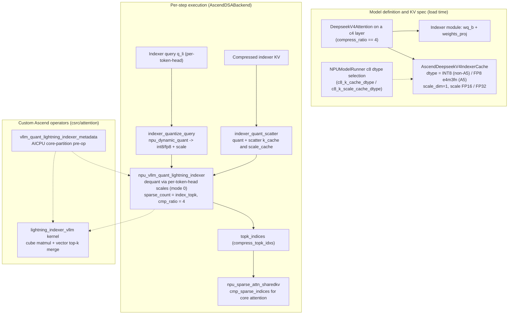
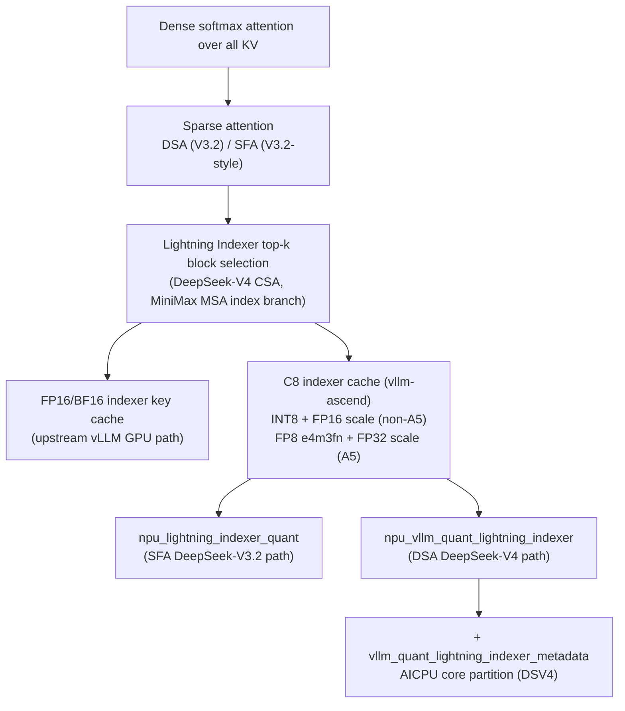

# DeepSeek-V4 Lightning Indexer C8 Quantization: INT8/FP8 Indexer Cache in vllm-ascend

**Repository:** [vllm-project/vllm-ascend](https://github.com/vllm-project/vllm-ascend) @ `32a59d4e349c12c32cdbc1916436c16e39939afc` (main, clean, inspected 2026-08-05)

**Related pages:** [vLLM Ascend Hub](./index.md), [vLLM-Ascend Architecture](./architecture.md), [DeepSeek-V4 Inference on Ascend: The DSA Serving Stack](./deepseek-v4-inference.md), [DeepSeek-V4 Attention Code Reading](../deepseek/v4-attention-code-reading.md), [DeepSeek-V4: Million-Token Context](../../training/deepseek/deepseek-v4/index.md), [DeepSeek-V3.2 Sparse Attention](../../algorithms/deepseek-v3.2/index.md), [MiniMax Sparse Attention](../../training/efficient-attention/minimax-sparse-attention/index.md)

## TL;DR

**What:** In vllm-ascend, the DeepSeek-V4 [Lightning Indexer's](../../terms/lightning-indexer.md) key cache and query are always stored in 8-bit — **INT8 + FP16 per-token-head scales on non-A5 devices, FP8 e4m3fn + FP32 scales on A5** — so the indexer's sparse top-k selection never reads a full-precision [KV cache](../../terms/kv-cache.md).

**How:** The model declares an 8-bit indexer cache, the DSA backend quantizes the indexer query and compressed KV at runtime, and a pair of custom Ascend operators (`npu_vllm_quant_lightning_indexer` + an AICPU metadata pre-op) dequantize inside the kernel, score blocks, and return top-k indices.

**The number:** "C8" is the 8-bit scheme implemented today; a 4-bit "C4" indexer quantization is **not implemented in this revision** and is planned for the future. Separately, "c4" is also the DSV4 layer type (compress ratio 4) that owns the Indexer, contrasted with "C128" HCA layers.

## The Big Picture

[Mermaid source](./assets/dsv4-lightning-indexer-c8-runtime.mmd)

*Synthesized runtime flow, not a source figure. ① A c4 layer owns an Indexer whose cache is declared 8-bit at load time. ② Per step, the backend quantizes the indexer query and the compressed KV, scattering key + scale into the indexer cache. ③ The quantized top-k operator (fed by an AICPU metadata pre-op that partitions work across cores) dequantizes per-token-head, scores blocks, and emits `topk_indices`. ④ The sparse attention op consumes those indices as `cmp_sparse_indices`.*

## Why This Exists

DeepSeek-V4's CSA layers compress KV by 4× and then ask the Lightning Indexer to pick the top-k most relevant compressed blocks for core attention. At a 1M-token context, the indexer alone would otherwise read millions of compressed keys every step. If the indexer keys and queries stayed in BF16, the indexer's [matmul](../../terms/gemm.md) bandwidth and the indexer cache's memory footprint would scale with context length — exactly the cost the model was designed to eliminate.

Quantizing the indexer to 8 bits cuts the indexer cache to ¼ of its BF16 size and lets the scoring matmul run on 8-bit data, at the price of a small accuracy loss in the relevance scores. The design keeps a **per-token-head scale** so that within a token the quantization is coarse but the ranking signal survives: the indexer only needs the *ordering* of block scores, not their exact values.

## The Landscape

[Mermaid source](./assets/dsv4-lightning-indexer-c8-landscape.mmd)

The Lightning Indexer descends from sparse-attention top-k selection (DeepSeek Sparse Attention / MiniMax's index branch). vllm-ascend adds a hardware-driven branch: instead of keeping the indexer key cache in FP16/BF16 as upstream vLLM does on GPU, it stores an 8-bit "C8" cache. That branch then splits into two operator generations — the older `npu_lightning_indexer_quant` used by the DeepSeek-V3.2 SFA path, and the newer `npu_vllm_quant_lightning_indexer` (+ AICPU metadata pre-op) used by the DeepSeek-V4 DSA path.

## The Core Idea

The DeepSeek-V4 Lightning Indexer is a small learned scorer: for each query token it scores every compressed KV block and returns the top-k block indices. vllm-ascend runs this scorer entirely on 8-bit data — quantizing the indexer query and the compressed indexer keys at runtime, caching keys as INT8 (or FP8 on A5) with per-token-head scales, and dequantizing only inside the custom top-k kernel where the scores are actually computed. "C8" is the implemented precision; a 4-bit "C4" quantization is future work and does not exist in this revision, while "c4" in the code merely names the DSV4 layer type that owns an indexer.

## Terminology Map

Three "C" words collide in this feature; keep them separate. Only `C8` is implemented in this revision; a 4-bit `C4` quantization is planned but not implemented.

| Name | What it is | Value |
|---|---|---|
| `C8` | **8-bit quantization scheme** for the indexer (and SFA) caches | INT8 or FP8 e4m3fn |
| `C4` *(planned)* | **4-bit** indexer quantization variant | **not implemented** in this revision; future work |
| `c4` layer | DSV4 layer category with KV `compress_ratio == 4`; **owns an Indexer** (a layer-type name, not a precision) | CSA layers |
| `c128` layer | DSV4 layer category with `compress_ratio == 128`; dense compressed attention, no indexer | HCA layers |

| Symbol | Human name | Meaning |
|---|---|---|
| `indexer_k_cache` | indexer key cache | 8-bit compressed indexer keys, paged (`PA_BSND`) |
| `indexer_scale_cache` | indexer key scale cache | per-token-head dequant scales (FP16 non-A5, FP32 A5) |
| `q_li` / `q_scale` | indexer query + scale | 8-bit query with its per-token-head scale |
| `weights` | indexer score weights | `weights_proj` output, cast to FP16 for scoring |
| `quant_mode = 0` | per-token-head quant mode | the only mode the quant ops currently accept |
| `sparse_count` | top-k count | `index_topk` from the DSV4 config |
| `cmp_ratio = 4` | compression ratio | 4 for CSA layers |

## Deep Dive

### 1. The DSV4 model declares an always-8-bit indexer cache

In the DSV4 model, every CSA layer (`compress_ratio == 4`) constructs an `Indexer` with a `k_cache` of type <a class="code-link" href="../../../external-repos/vllm-ascend/vllm_ascend/models/deepseek_v4.py#L143" data-code-repo="vllm-ascend-32a59d4e349c" data-code-path="vllm_ascend/models/deepseek_v4.py" data-code-line="143" data-code-end-line="166"><code>AscendDeepseekV4IndexerCache</code></a>. Its dtype is hard-coded, not configurable: FP8 `e4m3fn` on A5, INT8 everywhere else, and the KV spec reports `scale_dim=1` with FP32 (A5) or FP16 scales because the indexer head dim is 128.

The <a class="code-link" href="../../../external-repos/vllm-ascend/vllm_ascend/models/deepseek_v4.py#L531" data-code-repo="vllm-ascend-32a59d4e349c" data-code-path="vllm_ascend/models/deepseek_v4.py" data-code-line="531" data-code-end-line="605"><code>Indexer</code></a> module itself holds two small linear layers — `wq_b` (query projection, quantized via `quant_config`) and `weights_proj` (per-head score weights, unquantized) — plus the 8-bit key cache. Whether a layer owns an indexer is decided in `DeepseekV4Attention.__init__`: only layers with `compress_ratio == 4` create one, and the `skip_topk` / IndexCache logic (reusing a previous c4 layer's top-k) is evaluated there too (<a class="code-link" href="../../../external-repos/vllm-ascend/vllm_ascend/models/deepseek_v4.py#L820" data-code-repo="vllm-ascend-32a59d4e349c" data-code-path="vllm_ascend/models/deepseek_v4.py" data-code-line="820" data-code-end-line="855"><code>DeepseekV4Attention.__init__</code></a>).

The KV-cache coordinator treats c4 and c128 layers as separate cache groups with different page sizes — the comment in <a class="code-link" href="../../../external-repos/vllm-ascend/vllm_ascend/patch/platform/patch_kv_cache_utils.py#L110" data-code-repo="vllm-ascend-32a59d4e349c" data-code-path="vllm_ascend/patch/platform/patch_kv_cache_utils.py" data-code-line="110" data-code-end-line="130"><code>_get_kv_cache_groups_uniform_groups</code></a> spells this out ("11 C4 layers and 10 C128 layers").

### 2. The C8 dtypes are chosen once, per device family

The model runner picks the 8-bit cache dtypes when either sparse-C8 switch is enabled (<a class="code-link" href="../../../external-repos/vllm-ascend/vllm_ascend/worker/model_runner_v1.py#L357" data-code-repo="vllm-ascend-32a59d4e349c" data-code-path="vllm_ascend/worker/model_runner_v1.py" data-code-line="357" data-code-end-line="366"><code>NPUModelRunner.__init__</code></a>): A5 → `float8_e4m3fn` keys + `float32` scales; everything else → `int8` keys + `float16` scales. The same pairing is duplicated in the SFA backend for DeepSeek-V3.2-style indexer caches (<a class="code-link" href="../../../external-repos/vllm-ascend/vllm_ascend/attention/sfa_v1.py#L602" data-code-repo="vllm-ascend-32a59d4e349c" data-code-path="vllm_ascend/attention/sfa_v1.py" data-code-line="602" data-code-end-line="611"><code>AscendSFAImpl.__init__</code></a>).

The `enable_sparse_li_c8` / `enable_sparse_sfa_c8` switches live in `AscendConfig` (<a class="code-link" href="../../../external-repos/vllm-ascend/vllm_ascend/ascend_config.py#L249" data-code-repo="vllm-ascend-32a59d4e349c" data-code-path="vllm_ascend/ascend_config.py" data-code-line="249" data-code-end-line="258"><code>AscendConfig.__init__</code></a>). They gate the **SFA** (DeepSeek-V3.2) path; the DSV4 indexer cache is 8-bit regardless because its dtype is hard-coded in the cache class. For SFA, per-layer control comes from the ModelSlim quant description: keys ending in `.indexer.quant_type` or `.indexer.wq_b_weight` with values `INT8_DYNAMIC` or `W8A8_MXFP8` mark a layer as LI-C8 (<a class="code-link" href="../../../external-repos/vllm-ascend/vllm_ascend/ascend_config.py#L376" data-code-repo="vllm-ascend-32a59d4e349c" data-code-path="vllm_ascend/ascend_config.py" data-code-line="376" data-code-end-line="399"><code>_parse_sparse_li_c8_layers_from_quant_config</code></a>, <a class="code-link" href="../../../external-repos/vllm-ascend/vllm_ascend/ascend_config.py#L401" data-code-repo="vllm-ascend-32a59d4e349c" data-code-path="vllm_ascend/ascend_config.py" data-code-line="401" data-code-end-line="419"><code>is_sparse_li_c8_layer</code></a>).

### 3. Per step: quantize the query, quantize and scatter the keys

At runtime the DSA backend quantizes everything the indexer consumes. On non-A5 devices, <a class="code-link" href="../../../external-repos/vllm-ascend/vllm_ascend/device/device_op.py#L703" data-code-repo="vllm-ascend-32a59d4e349c" data-code-path="vllm_ascend/device/device_op.py" data-code-line="703" data-code-end-line="708"><code>indexer_quantize_query</code></a> runs `npu_dynamic_quant(q, dst_type=torch.int8)` and keeps an FP16 scale; <a class="code-link" href="../../../external-repos/vllm-ascend/vllm_ascend/device/device_op.py#L711" data-code-repo="vllm-ascend-32a59d4e349c" data-code-path="vllm_ascend/device/device_op.py" data-code-line="711" data-code-end-line="728"><code>indexer_quant_scatter</code></a> quantizes the compressed KV to INT8 and scatters the quantized keys into `indexer_k_cache` plus the FP16 scale into `indexer_scale_cache` via `npu_scatter_nd_update_v2`.

On A5 the same helpers use FP8 and a fused path (<a class="code-link" href="../../../external-repos/vllm-ascend/vllm_ascend/device/device_op.py#L1486" data-code-repo="vllm-ascend-32a59d4e349c" data-code-path="vllm_ascend/device/device_op.py" data-code-line="1486" data-code-end-line="1510"><code>A5 indexer_quantize_query / indexer_quant_scatter</code></a>): the query is quantized to FP8 separately, while `indexer_compress_epilog_v2` fuses KV quantization + cache scatter into the packed `indexer_full_cache`. Two small preparers finalize the operator inputs: the score weights are cast to FP16 (<a class="code-link" href="../../../external-repos/vllm-ascend/vllm_ascend/device/device_op.py#L767" data-code-repo="vllm-ascend-32a59d4e349c" data-code-path="vllm_ascend/device/device_op.py" data-code-line="767" data-code-end-line="769"><code>prepare_dsa_indexer_weights</code></a>) and the key scale is squeezed/cast to FP16 (<a class="code-link" href="../../../external-repos/vllm-ascend/vllm_ascend/device/device_op.py#L777" data-code-repo="vllm-ascend-32a59d4e349c" data-code-path="vllm_ascend/device/device_op.py" data-code-line="777" data-code-end-line="778"><code>prepare_dsa_indexer_key_scale</code></a>).

### 4. The quantized top-k operator (DSV4)

For DSV4, the metadata for the quantized top-k is built once per prefill/decode shape via `npu_vllm_quant_lightning_indexer_metadata` (<a class="code-link" href="../../../external-repos/vllm-ascend/vllm_ascend/attention/dsa_v1.py#L895" data-code-repo="vllm-ascend-32a59d4e349c" data-code-path="vllm_ascend/attention/dsa_v1.py" data-code-line="895" data-code-end-line="923"><code>build_prefill_metadata</code></a>): 64 indexer heads, head dim 128, `sparse_count = index_topk` (512), `sparse_mode=3`, `cmp_ratio=4`, `layout_key="PA_BSND"`. This metadata is produced by an **AICPU kernel** that partitions work across AI cores (start/end offsets per core) before the main kernel runs.

The main call feeds the 8-bit query, keys, weights, and both scale tensors to `npu_vllm_quant_lightning_indexer` with `query_quant_mode=0`, `key_quant_mode=0` (per-token-head) — in prefill (<a class="code-link" href="../../../external-repos/vllm-ascend/vllm_ascend/attention/dsa_v1.py#L2166" data-code-repo="vllm-ascend-32a59d4e349c" data-code-path="vllm_ascend/attention/dsa_v1.py" data-code-line="2166" data-code-end-line="2184"><code>_forward_prefill</code></a>), decode (<a class="code-link" href="../../../external-repos/vllm-ascend/vllm_ascend/attention/dsa_v1.py#L2464" data-code-repo="vllm-ascend-32a59d4e349c" data-code-path="vllm_ascend/attention/dsa_v1.py" data-code-line="2464" data-code-end-line="2482"><code>_forward_decode</code></a>), and the post-decode path (<a class="code-link" href="../../../external-repos/vllm-ascend/vllm_ascend/attention/dsa_v1.py#L2732" data-code-repo="vllm-ascend-32a59d4e349c" data-code-path="vllm_ascend/attention/dsa_v1.py" data-code-line="2732" data-code-end-line="2750"><code>_indexer_qli</code></a>). The returned `topk_indices` become `cmp_sparse_indices` for `npu_sparse_attn_sharedkv`.

The kernel entry point is <a class="code-link" href="../../../external-repos/vllm-ascend/csrc/attention/lightning_indexer_vllm/op_kernel/lightning_indexer_vllm.cpp#L38" data-code-repo="vllm-ascend-32a59d4e349c" data-code-path="csrc/attention/lightning_indexer_vllm/op_kernel/lightning_indexer_vllm.cpp" data-code-line="38" data-code-end-line="57"><code>lightning_indexer_vllm</code></a>, templated over FP16/BF16 compute dtype and layouts; the metadata kernel is <a class="code-link" href="../../../external-repos/vllm-ascend/csrc/attention/vllm_quant_lightning_indexer_metadata/op_kernel_aicpu/vllm_quant_lightning_indexer_metadata_aicpu.cpp#L300" data-code-repo="vllm-ascend-32a59d4e349c" data-code-path="csrc/attention/vllm_quant_lightning_indexer_metadata/op_kernel_aicpu/vllm_quant_lightning_indexer_metadata_aicpu.cpp" data-code-line="300" data-code-end-line="320"><code>VllmQuantLightningIndexerMetadataCpuKernel::CalcSplitInfo</code></a>. Both are registered as `torch.ops._C_ascend` custom ops (<a class="code-link" href="../../../external-repos/vllm-ascend/csrc/torch_binding.cpp#L2400" data-code-repo="vllm-ascend-32a59d4e349c" data-code-path="csrc/torch_binding.cpp" data-code-line="2400" data-code-end-line="2415"><code>npu_vllm_quant_lightning_indexer</code> registration</a>).

### 5. The SFA (DeepSeek-V3.2) path, for contrast

The older SFA backend routes indexer selection through <a class="code-link" href="../../../external-repos/vllm-ascend/vllm_ascend/device/device_op.py#L459" data-code-repo="vllm-ascend-32a59d4e349c" data-code-path="vllm_ascend/device/device_op.py" data-code-line="459" data-code-end-line="519"><code>indexer_select_post_process</code></a>, which has three branches: with `enable_sparse_li_c8` it calls `npu_lightning_indexer_quant` (or `torch_npu.npu_quant_lightning_indexer` on A5) passing dequant scales; for `glm_moe_dsa` models it uses the native `torch_npu.npu_lightning_indexer`; otherwise it uses the non-quant `npu_lightning_indexer`. The same "C8 = 8-bit, C4 = layer type" naming applies there, but this page's focus is the DSV4 DSA path.

### 6. What C8 is *not*: the dense-model C8 KV cache

A separate feature also called "C8" — `AscendC8KVCacheAttentionMethod` in <a class="code-link" href="../../../external-repos/vllm-ascend/vllm_ascend/quantization/methods/kv_c8.py#L108" data-code-repo="vllm-ascend-32a59d4e349c" data-code-path="vllm_ascend/quantization/methods/kv_c8.py" data-code-line="108" data-code-end-line="160"><code>kv_c8.py</code></a> — quantizes the *dense-attention* KV cache (e.g. Qwen3) to INT8 with scale/offset tensors. It is unrelated to the Lightning Indexer and is handled by the attention backend, not by the indexer operators. Do not conflate the two.

## Verification Boundary

This page is a **static code reading** of revision `32a59d4e349c`. The dtype tables, call signatures, and operator registrations are read directly from the pinned checkout. What is **not** verified here: numerical accuracy of the 8-bit indexer, end-to-end runtimes, or behavior of the A5 `indexer_compress_epilog_v2` fused path (A5 hardware paths are inferred from device-dispatch code, not executed). The operator documentation shipped with `VllmQuantLightningIndexerMetadata` confirms only that per-token-head mode (`0`) is currently supported for `query_quant_mode`/`key_quant_mode`.

## Putting It Together

Follow one CSA layer through a step: the layer's `Indexer` cache is 8-bit by construction. The backend quantizes the indexer query (`indexer_quantize_query`) and the compressed KV (`indexer_quant_scatter`), scatters keys + scales into paged caches, then invokes `npu_vllm_quant_lightning_indexer` with the metadata produced by the AICPU pre-op. The kernel dequantizes per-token-head, scores blocks with the FP16 weights, and returns the top-k block indices that the sparse-attention op turns into the actual attended KV.

## Where It Breaks

- **Accuracy:** 8-bit per-token-head quantization can reorder close relevance scores, changing which blocks win top-k. The design bets that ordering survives 8 bits; it is a heuristic, not a guarantee.
- **A5 fusion:** the fused `indexer_compress_epilog_v2` path and FP8 e4m3 format are A5-only and are the least exercised by tests visible in the pinned revision.
- **Per-token-head only:** `quant_mode` currently supports only `0`; other quant modes are not implemented in the operator.
- **Config gate is SFA-only:** `enable_sparse_li_c8` selects LI-C8 layers for DeepSeek-V3.2-style SFA; the DSV4 indexer cache ignores it and is always 8-bit, so you cannot run a DSV4 indexer at FP16 through this path.
- **No C4 quantization yet:** only the 8-bit ("C8") indexer cache and query exist in this revision. A 4-bit ("C4") indexer quantization is not implemented and is planned as future work, so there is no 4-bit code path or config surface to inspect.

## One-Sentence Takeaway

The DeepSeek-V4 Lightning Indexer in vllm-ascend runs entirely on an 8-bit ("C8") key cache and query — INT8+FP16 on 910B/A2/A3, FP8 e4m3+FP32 on A5. A 4-bit ("C4") indexer quantization is not implemented yet and is planned for the future; "c4" in the code also happens to name the CSA layer type that owns the indexer.

## Code Reading Path

1. Start in the model: `AscendDeepseekV4IndexerCache` and `Indexer` (Section 1) to see the hard-coded 8-bit cache dtype and which layers own an indexer.
2. Config: `enable_sparse_li_c8` / `enable_sparse_sfa_c8` and the quant-description layer filter (Section 2).
3. Runtime helpers: `indexer_quantize_query`, `indexer_quant_scatter`, and the A5 fused variants (Section 3).
4. Call sites: `npu_vllm_quant_lightning_indexer` and its metadata pre-op in the DSA backend (Section 4).
5. Operators: the `lightning_indexer_vllm` kernel and the AICPU metadata kernel under `csrc/attention/` (Section 4).
