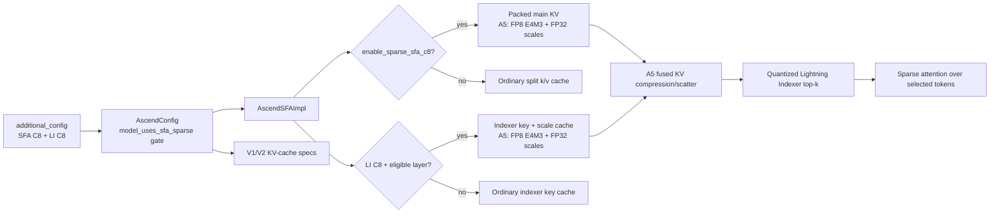

# GLM-5.1 W4A4C8 on Ascend 950: How vLLM-Ascend Turns On Sparse C8

**Repository:** [vllm-project/vllm-ascend](https://github.com/vllm-project/vllm-ascend) @
`7702ccd7d8dea6b4dabdacb0118adb522dedbec7` (detached, clean, inspected
2026-08-27; static code reading)

**Related pages:** [vLLM Ascend Hub](index.md) · [GLM-5.2 inference path](glm-5.2-inference-path.md) · [DeepSeek Lightning Indexer C8](deepseek-v4-lightning-indexer-c8.md) · [Qwen3.8 on Ascend 950](qwen3.8-fp8-mxfp8-950.md) · [KV cache](../../terms/kv-cache.md) · [Lightning Indexer](../../terms/lightning-indexer.md) · [FP8](../../terms/fp8.md) · [Mixture of Experts](../../terms/mixture-of-experts.md)

> **Status:** The exact `GLM-5.1-W4A4C8-mxfp4-rot` checkpoint appears in an official vLLM-Ascend A5 validation issue, but this page should be read as revision-scoped and experimental deployment guidance. The pinned release notes still list A950 SFA/context-parallel limitations.

## The answer in one minute

`W4A4C8` describes three quantization contracts: 4-bit weights, 4-bit
activations, and an 8-bit cache representation. For GLM-5.1, the last part is
not one global `C8` switch. vLLM-Ascend exposes two independent sparse-cache
switches:

- `enable_sparse_sfa_c8` packs the main Sparse Flash Attention (SFA) key/value
  cache into one tensor.
- `enable_sparse_li_c8` quantizes the Lightning Indexer (LI) key cache and
  stores a separate scale cache for eligible indexer layers.

On Ascend 950, the SFA implementation selects FP8 E4M3 payloads and FP32
scales for either sparse-C8 cache family. The first usable launch setting is:

```shell
MODEL_PATH=/models/GLM-5.1-W4A4C8-mxfp4-rot

vllm serve "$MODEL_PATH" \
  --tensor-parallel-size 8 \
  --enable-expert-parallel \
  --trust-remote-code \
  --quantization ascend \
  --additional-config '{"enable_sparse_sfa_c8":true,"enable_sparse_li_c8":true}'
```

The command assumes a matching ModelSlim/vLLM-Ascend W4A4C8 checkpoint and
leaves workload-specific limits, graph settings, and networking options to the
normal GLM deployment recipe. Turning on the flags does not quantize a BF16 or
W8A8 checkpoint after the fact.

## Mental model: two switches, two cache owners

The reader question is “which switch changes which persistent tensor?” The
one-sentence model is: **SFA C8 changes the main attention cache; LI C8 changes
the indexer cache; the A5 device branch chooses their byte-and-scale contract
after configuration has accepted both switches.**

[Editable Mermaid source](assets/glm-5.1-c8-950-toggle.mmd)



*Synthesized implementation flow, not a source figure. It answers which
configuration branch owns the main cache, which owns the indexer cache, and
where the A5 fused operators enter the token step.*

## The switches and their safe scope

The pinned configuration documentation describes the flags as separate options;
the <a class="code-link" href="../../../external-repos/vllm-ascend-7702ccd7d8de/docs/source/user_guide/configuration/additional_config.md#L63" data-code-repo="vllm-ascend-7702ccd7d8de" data-code-path="docs/source/user_guide/configuration/additional_config.md" data-code-line="63" data-code-end-line="65"><code>sparse-C8 configuration contract</code></a>
also makes clear that reshape optimization depends on LI C8.

| Setting | What it turns on | Default | GLM-5.1/A950 guidance |
|---|---|---:|---|
| `enable_sparse_sfa_c8` | One packed SFA main KV cache | `false` | Enable for the W4A4C8 sparse-attention cache. |
| `enable_sparse_li_c8` | LI key cache plus per-token scale cache | `false` | Enable when the checkpoint’s quantization metadata describes the LI/indexer layers. |
| `c8_enable_reshape_optim` | `StoreKVBlock` writes for LI C8 | `false` | Optional optimization; it requires LI C8 and is intended for the P node in P/D serving. |
| `enable_dsa_cp` | DSA/context parallelism | `false` | Not a C8 switch; do not enable for SFA on Ascend 950 in this pinned release. |

The <a class="code-link" href="../../../external-repos/vllm-ascend-7702ccd7d8de/vllm_ascend/ascend_config.py#L482" data-code-repo="vllm-ascend-7702ccd7d8de" data-code-path="vllm_ascend/ascend_config.py" data-code-line="482" data-code-end-line="496"><code>AscendConfig sparse-C8 derivation</code></a>
first detects whether the model uses sparse SFA, then masks both user switches
off for a non-sparse model. It also masks `c8_enable_reshape_optim` unless LI
C8 remains active. This is why adding the JSON keys to an unrelated dense model
does not turn its ordinary KV cache into this GLM path.

The LI switch has a second gate. The <a class="code-link" href="../../../external-repos/vllm-ascend-7702ccd7d8de/vllm_ascend/ascend_config.py#L655" data-code-repo="vllm-ascend-7702ccd7d8de" data-code-path="vllm_ascend/ascend_config.py" data-code-line="655" data-code-end-line="706"><code>LI C8 quant-metadata parser and layer filter</code></a>
looks for `.indexer.quant_type` or `.indexer.wq_b_weight` entries and accepts
`INT8_DYNAMIC` or `W8A8_MXFP8` metadata. With a filtered quantization
description, only the declared indexer layers receive LI C8 storage.

Do not use the former `enable_sparse_c8` spelling with this revision: the
release notes record that it was split into the two component switches. Also do
not infer that `enable_dsa_cp` is required for C8. The pinned release notes say
that DSA-CP is now an explicit `additional_config` option, while the same notes
list SFA context parallelism as unsupported on Ascend 950.

## What changes on Ascend 950

The hardware naming boundary is explicit: <a class="code-link" href="../../../external-repos/vllm-ascend-7702ccd7d8de/vllm_ascend/device/device_config.py#L57" data-code-repo="vllm-ascend-7702ccd7d8de" data-code-path="vllm_ascend/device/device_config.py" data-code-line="57" data-code-end-line="63"><code>is_950()</code></a>
maps the A5 device type to Ascend 950. When either sparse-C8 switch is active,
the <a class="code-link" href="../../../external-repos/vllm-ascend-7702ccd7d8de/vllm_ascend/attention/sfa_v1.py#L503" data-code-repo="vllm-ascend-7702ccd7d8de" data-code-path="vllm_ascend/attention/sfa_v1.py" data-code-line="503" data-code-end-line="520"><code>AscendSFAImpl GLM/A5 initialization</code></a>
selects:

| Logical object | A5/Ascend 950 representation | Non-A5 fallback in the same code |
|---|---|---|
| SFA or LI C8 payload | `torch.float8_e4m3fn` | `torch.int8` |
| SFA or LI scale | `torch.float32` | `torch.float16` |
| LI ownership | `has_indexer` plus the quant-metadata layer filter | The same ownership rule |

This is a cache representation decision, not a claim that every tensor in the
model becomes FP8. The W4/A4 weight and activation path still comes from the
checkpoint and the `ascend` quantization implementation; these flags select
the sparse attention cache layouts.

## One token through the sparse-C8 path

The following trace follows one mixed-batch token from configuration to the
top-k selection and sparse-attention consumer. It is a runtime-shaped trace,
but the behavior below is inferred from the pinned source; no Ascend 950 NPU or
CANN execution was available in this workspace.

| Step | Owner and code evidence | State transition |
|---:|---|---|
| 1 | Configuration: the <a class="code-link" href="../../../external-repos/vllm-ascend-7702ccd7d8de/vllm_ascend/attention/sfa_v1.py#L534" data-code-repo="vllm-ascend-7702ccd7d8de" data-code-path="vllm_ascend/attention/sfa_v1.py" data-code-line="534" data-code-end-line="553"><code>SFA cache-index properties</code></a> define the tuple positions. | No C8: `(k_nope, k_pe, indexer_k)`; both C8 modes: `(packed_kv, indexer_k, indexer_scale)`. |
| 2 | Cache allocation: the <a class="code-link" href="../../../external-repos/vllm-ascend-7702ccd7d8de/vllm_ascend/worker/model_runner_v1.py#L4717" data-code-repo="vllm-ascend-7702ccd7d8de" data-code-path="vllm_ascend/worker/model_runner_v1.py" data-code-line="4717" data-code-end-line="4775"><code>V1 runner KV-spec builder</code></a> and <a class="code-link" href="../../../external-repos/vllm-ascend-7702ccd7d8de/vllm_ascend/worker/v2/attn_utils.py#L74" data-code-repo="vllm-ascend-7702ccd7d8de" data-code-path="vllm_ascend/worker/v2/attn_utils.py" data-code-line="74" data-code-end-line="135"><code>V2 cache-spec builder</code></a> describe the main SFA and separate LI specs. | The main cache gets a packed head dimension when SFA C8 is on; an LI layer gets `scale_dim=1` and a scale dtype when LI C8 is on. |
| 3 | SFA producer: <a class="code-link" href="../../../external-repos/vllm-ascend-7702ccd7d8de/vllm_ascend/attention/sfa_v1.py#L1335" data-code-repo="vllm-ascend-7702ccd7d8de" data-code-path="vllm_ascend/attention/sfa_v1.py" data-code-line="1335" data-code-end-line="1355"><code>_store_parallel_kv()</code></a> concatenates `k_nope`, `k_pe`, and the `knope` scale, then scatters the packed row to the main cache. | Three logical pieces become one slot-addressed SFA cache row. |
| 4 | LI producer: <a class="code-link" href="../../../external-repos/vllm-ascend-7702ccd7d8de/vllm_ascend/attention/sfa_v1.py#L1148" data-code-repo="vllm-ascend-7702ccd7d8de" data-code-path="vllm_ascend/attention/sfa_v1.py" data-code-line="1148" data-code-end-line="1156"><code>indexer_select_pre_process()</code></a> rotates and dynamically quantizes the new LI key; the <a class="code-link" href="../../../external-repos/vllm-ascend-7702ccd7d8de/vllm_ascend/attention/sfa_v1.py#L1220" data-code-repo="vllm-ascend-7702ccd7d8de" data-code-path="vllm_ascend/attention/sfa_v1.py" data-code-line="1220" data-code-end-line="1240"><code>indexer_select_post_process()</code></a> applies the corresponding query transform and scale. | The LI key and query become A5 C8 payload/scale pairs before indexer scoring. |
| 5 | Device handoff: <a class="code-link" href="../../../external-repos/vllm-ascend-7702ccd7d8de/vllm_ascend/device/device_op.py#L1275" data-code-repo="vllm-ascend-7702ccd7d8de" data-code-path="vllm_ascend/device/device_op.py" data-code-line="1275" data-code-end-line="1316"><code>A5 KV/indexer compression and scatter</code></a> uses fused Ascend operators; the <a class="code-link" href="../../../external-repos/vllm-ascend-7702ccd7d8de/vllm_ascend/device/device_op.py#L1352" data-code-repo="vllm-ascend-7702ccd7d8de" data-code-path="vllm_ascend/device/device_op.py" data-code-line="1352" data-code-end-line="1367"><code>A5 indexer dtype preparation</code></a> keeps weights and dequant scales in float32. | The hardware-facing cache write and query preparation use the A5 operator contract. |
| 6 | Indexer result: <a class="code-link" href="../../../external-repos/vllm-ascend-7702ccd7d8de/vllm_ascend/device/device_op.py#L1460" data-code-repo="vllm-ascend-7702ccd7d8de" data-code-path="vllm_ascend/device/device_op.py" data-code-line="1460" data-code-end-line="1527"><code>indexer_select_post_process()</code></a> calls the quantized or ordinary Lightning Indexer and requests `sparse_count=2048`; the <a class="code-link" href="../../../external-repos/vllm-ascend-7702ccd7d8de/vllm_ascend/attention/sfa_v1.py#L1394" data-code-repo="vllm-ascend-7702ccd7d8de" data-code-path="vllm_ascend/attention/sfa_v1.py" data-code-line="1394" data-code-end-line="1450"><code>_compose_sfa_kv_cache()</code></a> assembles the cache tuple expected by the kernel. | Top-k token indices select the sparse history, and the attention backend receives the layout implied by the two switches. |
| 7 | Forward orchestration: <a class="code-link" href="../../../external-repos/vllm-ascend-7702ccd7d8de/vllm_ascend/attention/sfa_v1.py#L1452" data-code-repo="vllm-ascend-7702ccd7d8de" data-code-path="vllm_ascend/attention/sfa_v1.py" data-code-line="1452" data-code-end-line="1515"><code>AscendSFAImpl.forward()</code></a> chooses native, Prolog V3, or MLAPO preprocessing before the sparse-attention compute continues. | The cache format selected at startup is consumed in each prefill/decode iteration. |

The LI query path is not merely an `int8` cast. With LI C8 enabled, the code
applies Hadamard transforms and dynamic quantization to both the new key and the
query. That keeps the indexer’s dot-product contract aligned with the cached
key scale. The main SFA cache has a different job: it packs the latent key/value
pieces so the shared-key/value sparse attention operator can consume one main
cache tensor.

## The A5 physical write path

The A5 device operator uses two fused write boundaries:

1. `kv_compress_epilog` quantizes, compresses, and scatters the SFA KV row with
   group size 64.
2. `indexer_compress_epilog_v2` quantizes/scatters the LI key and its scale in
   one fused path. The query is dynamically quantized separately before the LI
   top-k operation.

The allocator still treats cache memory as bytes. The <a class="code-link" href="../../../external-repos/vllm-ascend-7702ccd7d8de/vllm_ascend/worker/v2/attn_utils.py#L492" data-code-repo="vllm-ascend-7702ccd7d8de" data-code-path="vllm_ascend/worker/v2/attn_utils.py" data-code-line="492" data-code-end-line="540"><code>aligned LI C8 allocator</code></a>
returns logical key and scale views from one aligned raw allocation. That is a
memory-registration optimization, not a third quantization mode. It reduces
the number of HCCL/Mooncake registration ranges while preserving separate
logical key and scale tensors.

The cache tuple is deliberately recomposed late. The <a class="code-link" href="../../../external-repos/vllm-ascend-7702ccd7d8de/vllm_ascend/attention/sfa_v1.py#L1394" data-code-repo="vllm-ascend-7702ccd7d8de" data-code-path="vllm_ascend/attention/sfa_v1.py" data-code-line="1394" data-code-end-line="1450"><code>_compose_sfa_kv_cache()</code></a> code documents four combinations:

- neither switch: split main `k/v` plus one indexer key tensor;
- SFA C8 only: packed main tensor plus one indexer key tensor;
- LI C8 only: split main `k/v` plus indexer key and scale tensors;
- both switches: packed main tensor plus indexer key and scale tensors.

The allocator can therefore own main and indexer cache specs separately while
the current kernel-facing SFA tuple remains backward-compatible.

## Do not confuse this with dense `kv_cache_type: C8`

There are two similarly named mechanisms in the repository:

| Mechanism | Configuration source | Cache owner | GLM-5.1 recommendation |
|---|---|---|---|
| Sparse SFA/LI C8 | `enable_sparse_sfa_c8` and `enable_sparse_li_c8` | SFA main cache and DSA indexer cache | This is the path described on this page. |
| Dense attention C8 | Model quantization metadata `kv_cache_type == "C8"` | Ordinary dense-attention K/V cache | Do not substitute this for the GLM sparse switches. |

The separate dense path is visible in the <a class="code-link" href="../../../external-repos/vllm-ascend-7702ccd7d8de/vllm_ascend/quantization/modelslim_config.py#L1050" data-code-repo="vllm-ascend-7702ccd7d8de" data-code-path="vllm_ascend/quantization/modelslim_config.py" data-code-line="1050" data-code-end-line="1068"><code>ModelSlim KV-cache metadata parser</code></a> and the <a class="code-link" href="../../../external-repos/vllm-ascend-7702ccd7d8de/vllm_ascend/quantization/methods/kv_c8.py#L108" data-code-repo="vllm-ascend-7702ccd7d8de" data-code-path="vllm_ascend/quantization/methods/kv_c8.py" data-code-line="108" data-code-end-line="139"><code>dense C8 attention method</code></a>, which installs K/V scale and offset parameters for dense attention. GLM-5.1’s sparse SFA path instead changes the cache tuple and calls the sparse indexer/attention operators.

## Validation checklist and failure surfaces

Before treating the launch as production-ready, check these boundaries:

- **Checkpoint contract:** use a checkpoint whose quantization metadata and
  model architecture actually expose sparse SFA/LI. The official validation
  issue names `GLM-5.1-W4A4C8-mxfp4-rot`; a generic GLM-5.1 BF16 checkpoint is
  not made W4A4C8 by the two runtime flags.
- **Old configuration names:** replace `enable_sparse_c8` with the split
  names. A mixed container image and config file can otherwise silently miss
  the intended branch or fail strict config validation.
- **A950 context parallelism:** the <a class="code-link" href="../../../external-repos/vllm-ascend-7702ccd7d8de/docs/source/user_guide/release_notes.md#L106" data-code-repo="vllm-ascend-7702ccd7d8de" data-code-path="docs/source/user_guide/release_notes.md" data-code-line="106" data-code-end-line="147"><code>pinned configuration changes and known issues</code></a> say that SFA context parallelism is unsupported on Ascend 950. Keep `enable_dsa_cp` out of the A950 SFA launch unless a later, explicitly validated revision changes that constraint.
- **P/D symmetry and performance:** on supported P/D paths, DCP must be
  symmetric between prefiller and decoder; the same release notes report a
  GLM-5.1 regression for 64K-input/1K-output P/D workloads when both SFA C8
  and LI C8 are enabled. Measure P and D separately before assuming that both
  switches improve throughput.
- **Runtime verification:** this workspace has no Ascend 950 NPU, CANN, or
  ModelSlim runtime. The page therefore establishes the configuration and code
  path, not a verified tokens-per-second, memory, or accuracy result.

## One thing to remember

For GLM-5.1 on Ascend 950, “turn on C8” means **turn on the two sparse cache
contracts together when the W4A4C8 checkpoint’s metadata supports both**:

```json
{
  "enable_sparse_sfa_c8": true,
  "enable_sparse_li_c8": true
}
```

SFA C8 changes the main packed cache; LI C8 changes the indexer key/scale cache.
The A5 branch then stores FP8 E4M3-class bytes with FP32 scale handling and
dispatches fused Ascend operators. If you enable only one flag, the code
legitimately constructs a mixed layout; that is useful for isolation tests but
is not the same thing as enabling the complete W4A4C8 sparse-cache contract.

## Go deeper

- [Official GLM-5 & GLM-5.1 deployment guide](https://github.com/vllm-project/vllm-ascend/blob/main/docs/source/tutorials/models/GLM5.md) — baseline model-serving options and release-specific recipes.
- [Official vLLM-Ascend GLM-5.1 W4A4C8 validation issue](https://github.com/vllm-project/vllm-ascend/issues/11162) — source for the exact `GLM-5.1-W4A4C8-mxfp4-rot` checkpoint name and A5/TP8 validation context.
- [DeepSeek-V4 Lightning Indexer C8 Quantization](deepseek-v4-lightning-indexer-c8.md) — the neighboring C8 implementation, with the DSA compressor/indexer distinction.
- [Qwen3.8-FP8 on Ascend 950](qwen3.8-fp8-mxfp8-950.md) — a contrasting Ascend 950 load-time weight conversion path.
