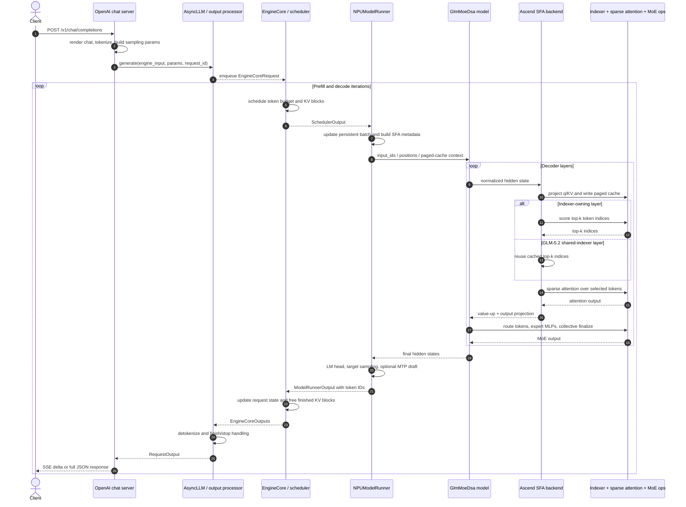

# GLM-5.2 on vLLM Ascend: Request-to-Backend Inference Path

**Repositories:** [vllm-project/vllm](https://github.com/vllm-project/vllm) @
`a0c092ee72c0dcefbb3b3e74f97ac62d842e5f4b` and
[vllm-project/vllm-ascend](https://github.com/vllm-project/vllm-ascend) @
`9a52ca5fc36c1852241822863c50717bee5dc761` (clean, static reading)

**Related pages:** [upstream vLLM GLM-5.2 path](../vllm/glm-5.2-inference-path.md),
[vLLM Ascend](index.md),
[vLLM architecture](../vllm/vllm-overview.md),
[continuous batching](../vllm/vllm-continuous-batching/index.md),
[vLLM-Ascend architecture](architecture.md),
[DeepSeek-V3.2 sparse attention](../../algorithms/deepseek-v3.2/index.md),
[DeepSeek-V4 inference on Ascend](deepseek-v4-inference.md)

> **Scope:** this is the Ascend NPU companion to the
> [primary upstream-vLLM GPU trace](../vllm/glm-5.2-inference-path.md). Use the
> upstream page for CUDA worker, indexer, and sparse-MLA backend selection; use
> this page for the vllm-ascend SFA and NPU operator path.

## TL;DR

A GLM-5.2 chat request spends its first and last stages in ordinary upstream
vLLM: the OpenAI-compatible server renders and tokenizes the conversation,
`AsyncLLM` admits the request, the V1 scheduler assigns token and KV-block
budgets, and the output processor detokenizes sampled token IDs before the
server emits JSON or Server-Sent Events (SSE).

The model/backend half is Ascend-specific. `GlmMoeDsaForCausalLM` is a thin
alias over the DeepSeek-V2-family sparse
[Mixture-of-Experts (MoE)](../../terms/mixture-of-experts.md) model shell.
Because GLM-5.2 advertises Multi-head Latent Attention (MLA) plus sparsity but
not DeepSeek-V4-style compression, `NPUPlatform` selects
`AscendSFABackend`. Each decoder layer therefore runs:

```text
RMSNorm
  -> latent q/KV projections + RoPE
  -> paged KV write
  -> compute or reuse top-k token indices
  -> sparse attention over selected tokens
  -> value-up + output projection
  -> RMSNorm
  -> routed + shared MoE experts
```

The GLM-5.2-specific twist is **shared indexers**. An indexer-owning layer
scores the KV history and writes top-k token indices into a shared buffer;
checkpoint-declared `shared` layers omit their own Indexer weights and reuse
those indices. This saves repeated indexer work without changing the main
sparse-attention calculation.

> **Important:** GLM-5.2 implements the model algorithm commonly called
> DeepSeek Sparse Attention, but its vLLM-Ascend class is the **SFA backend**.
> `AscendDSABackend` in this codebase is reserved for the newer DeepSeek-V4
> compressed-block path. For GLM-5.2, the indexer selects **tokens**, not
> compressed blocks.

## Scope and Mental Model

This page answers: *What happens to one OpenAI chat request from HTTP admission
to the deepest meaningful Ascend operators, and how does the sampled result get
back to the client?*

The code-free mental model is: **vLLM is the traffic controller, the GLM model
is the layer recipe, and vLLM-Ascend replaces the device-facing execution of
that recipe.** Scheduling decides *which token rows run now*; SFA decides *which
past token positions each row attends to*; MoE routing decides *which expert
MLPs transform each row*.

The default concrete path follows the checked-in single-node W4A8C8 command.
The <a class="code-link" href="../../../external-repos/vllm-ascend-9a52ca5fc36c/docs/source/tutorials/models/GLM5.2.md#L113" data-code-repo="vllm-ascend-9a52ca5fc36c" data-code-path="docs/source/tutorials/models/GLM5.2.md" data-code-line="113" data-code-end-line="145"><code>GLM-5.2 deployment contract</code></a>
uses TP=8, expert parallelism, `--quantization ascend`, decode-only graph
capture, DSA [context parallelism](../../terms/context-parallelism.md), an 8-bit
[Lightning Indexer](../../terms/lightning-indexer.md) cache, and a three-token
DeepSeek MTP [speculative-decoding](../../terms/speculative-decoding.md)
drafter. The same control flow also applies to BF16
and W8A8 checkpoints; quantized projection and cache kernels vary.

## Request Round Trip

[Editable Mermaid source](assets/glm-5.2-request-round-trip.mmd)



The diagram shows both directions deliberately: GPU/NPU call-chain diagrams
often stop at logits, but a serving request is not complete until token IDs are
detokenized, parsed into reasoning/tool/content fields, emitted, and released
from scheduler and frontend state.

### 1. HTTP admission and chat rendering

<a class="code-link" href="../../../external-repos/vllm/vllm/entrypoints/openai/chat_completion/serving.py#L255" data-code-repo="vllm-a0c092ee72c0" data-code-path="vllm/entrypoints/openai/chat_completion/serving.py" data-code-line="255" data-code-end-line="407"><code>OpenAIServingChat._create_chat_completion</code></a>
renders the message list, produces tokenized engine inputs, validates the
maximum completion length, constructs sampling parameters, and creates one
engine generator. The GLM deployment chooses `glm45` reasoning parsing and
`glm47` tool-call parsing; these parsers affect request rendering and response
interpretation, not attention or MoE math.

Output of this stage: prompt token IDs, sampling parameters, request metadata,
and an asynchronous result generator.

### 2. Frontend-to-core admission

<a class="code-link" href="../../../external-repos/vllm/vllm/v1/engine/async_llm.py#L527" data-code-repo="vllm-a0c092ee72c0" data-code-path="vllm/v1/engine/async_llm.py" data-code-line="527" data-code-end-line="599"><code>AsyncLLM.generate</code></a>
creates the per-request output collector, processes and enqueues the request in
the separate engine core, then yields items pushed back by the background
output handler. Cancellation follows the same boundary in reverse and aborts
the core request.

Output of this stage: an `EngineCoreRequest` owned by the engine process and a
frontend queue keyed by request ID.

### 3. Continuous scheduling and KV allocation

Each engine iteration is explicit in
<a class="code-link" href="../../../external-repos/vllm/vllm/v1/engine/core.py#L584" data-code-repo="vllm-a0c092ee72c0" data-code-path="vllm/v1/engine/core.py" data-code-line="584" data-code-end-line="614"><code>EngineCore.step</code></a>:
schedule, execute, sample if execution was split, process aborts, and update the
scheduler from model output.

<a class="code-link" href="../../../external-repos/vllm/vllm/v1/core/sched/scheduler.py#L427" data-code-repo="vllm-a0c092ee72c0" data-code-path="vllm/v1/core/sched/scheduler.py" data-code-line="427" data-code-end-line="570"><code>Scheduler.schedule</code></a>
does not maintain separate global prefill and decode phases. It advances each
request's computed-token count toward its prompt, output, and speculative-token
count; caps work by the step token budget and model length; and allocates new
paged-KV slots. If no blocks are available, lower-priority work can be
preempted.

Output of this stage: `SchedulerOutput`, including request rows, scheduled token
counts, new cache blocks, block tables, and optional draft tokens.

### 4. NPU batch preparation and attention metadata

The Ascend runner updates its persistent input batch, prepares token/position
tensors, chooses eager versus captured execution, and builds per-backend
metadata. The SFA builder's
<a class="code-link" href="../../../external-repos/vllm-ascend-9a52ca5fc36c/vllm_ascend/attention/sfa_v1.py#L337" data-code-repo="vllm-ascend-9a52ca5fc36c" data-code-path="vllm_ascend/attention/sfa_v1.py" data-code-line="337" data-code-end-line="481"><code>AscendSFAMetadataBuilder._build</code></a>
materializes:

- cumulative query lengths and current sequence lengths;
- paged block tables and per-token slot mappings;
- position-dependent RoPE cosine/sine tensors;
- the current attention state (prefill, decode, mixed, or speculative);
- optional context-parallel local token ranges and local causal lengths.

The result is not model data; it is the addressing and shape contract that lets
the NPU kernels interpret a flattened mixed batch correctly.

### 5. Model identity and decoder stack

The upstream registry maps
<a class="code-link" href="../../../external-repos/vllm/vllm/model_executor/models/registry.py#L117" data-code-repo="vllm-a0c092ee72c0" data-code-path="vllm/model_executor/models/registry.py" data-code-line="117"><code>GlmMoeDsaForCausalLM</code></a>
to the DeepSeek-V2 implementation module. The
<a class="code-link" href="../../../external-repos/vllm/vllm/model_executor/models/deepseek_v2.py#L1938" data-code-repo="vllm-a0c092ee72c0" data-code-path="vllm/model_executor/models/deepseek_v2.py" data-code-line="1938" data-code-end-line="1939"><code>GlmMoeDsaForCausalLM</code></a>
class itself is deliberately thin. Its base
<a class="code-link" href="../../../external-repos/vllm/vllm/model_executor/models/deepseek_v2.py#L1801" data-code-repo="vllm-a0c092ee72c0" data-code-path="vllm/model_executor/models/deepseek_v2.py" data-code-line="1801" data-code-end-line="1863"><code>DeepseekV2ForCausalLM.__init__</code></a>
constructs the model, LM head, logits processor, and MoE metadata, while
<a class="code-link" href="../../../external-repos/vllm/vllm/model_executor/models/deepseek_v2.py#L1894" data-code-repo="vllm-a0c092ee72c0" data-code-path="vllm/model_executor/models/deepseek_v2.py" data-code-line="1894" data-code-end-line="1911"><code>forward / compute_logits</code></a>
delegate to the model stack and project final hidden states to vocabulary
logits.

That reuse is substantial. The
<a class="code-link" href="../../../external-repos/vllm/vllm/model_executor/models/deepseek_v2.py#L1431" data-code-repo="vllm-a0c092ee72c0" data-code-path="vllm/model_executor/models/deepseek_v2.py" data-code-line="1431" data-code-end-line="1519"><code>DeepseekV2Model.forward</code></a>
embeds input IDs, walks the pipeline-local decoder layers, carries the residual
stream, optionally gathers sequence-parallel states, and applies the final
RMSNorm. Per layer,
<a class="code-link" href="../../../external-repos/vllm/vllm/model_executor/models/deepseek_v2.py#L1290" data-code-repo="vllm-a0c092ee72c0" data-code-path="vllm/model_executor/models/deepseek_v2.py" data-code-line="1290" data-code-end-line="1361"><code>DeepseekV2DecoderLayer.forward</code></a>
runs pre-attention normalization, sparse MLA attention, post-attention
normalization, then either a dense MLP or routed MoE.

### 6. Why GLM-5.2 selects SFA

The hardware boundary is
<a class="code-link" href="../../../external-repos/vllm-ascend-9a52ca5fc36c/vllm_ascend/platform.py#L216" data-code-repo="vllm-ascend-9a52ca5fc36c" data-code-path="vllm_ascend/platform.py" data-code-line="216" data-code-end-line="242"><code>NPUPlatform.get_attn_backend_cls</code></a>.
Its three-way capability key yields these important cases:

| Model properties | Selected backend | Meaning |
|---|---|---|
| MLA, dense, uncompressed | `AscendMLABackend` | Dense latent attention |
| MLA, sparse, uncompressed | `AscendSFABackend` | GLM-5.2 / DeepSeek-V3.2-style top-k token attention |
| MLA, dense, compressed | `AscendDSABackend` | DeepSeek-V4 compressed-block stack |
| Non-MLA, dense | `AscendAttentionBackend` | Ordinary FIA MHA/GQA |

This naming can be confusing: SFA is the backend implementation name, while
DSA is also used in model literature and configuration names such as
`enable_dsa_cp`.

### 7. GLM-5.2 shared-indexer construction

The vLLM-Ascend compatibility patch makes checkpoint layout explicit.
<a class="code-link" href="../../../external-repos/vllm-ascend-9a52ca5fc36c/vllm_ascend/patch/worker/patch_deepseek_v2.py#L36" data-code-repo="vllm-ascend-9a52ca5fc36c" data-code-path="vllm_ascend/patch/worker/patch_deepseek_v2.py" data-code-line="36" data-code-end-line="54"><code>_should_skip_indexer_init</code></a>
skips local Indexer construction only when the layer both reuses top-k and its
`indexer_types` entry says `shared`. The distinction matters:

| Case | Indexer weights in this layer? | Top-k operation |
|---|---:|---|
| Ordinary sparse layer | Yes | Compute and optionally cache indices |
| GLM-5.1-style runtime cache reuse | Yes | Skip scoring for this step/layer, reuse indices |
| GLM-5.2 checkpoint `shared` layer | No | Reuse another layer's indices and shared buffer |

At runtime,
<a class="code-link" href="../../../external-repos/vllm-ascend-9a52ca5fc36c/vllm_ascend/attention/sfa_v1.py#L533" data-code-repo="vllm-ascend-9a52ca5fc36c" data-code-path="vllm_ascend/attention/sfa_v1.py" data-code-line="533" data-code-end-line="647"><code>AscendSFAImpl.__init__</code></a>
validates that an indexer-less layer has both `skip_topk` and a shared top-k
buffer, switches GLM's RoPE/indexer operator convention, and chooses indexer
cache dtypes: INT8 keys with FP16 scales on A2/A3, or FP8 e4m3 keys with FP32
scales on A5 when Lightning Indexer C8 is enabled.

### 8. The SFA backend, step by step

The central
<a class="code-link" href="../../../external-repos/vllm-ascend-9a52ca5fc36c/vllm_ascend/attention/sfa_v1.py#L1811" data-code-repo="vllm-ascend-9a52ca5fc36c" data-code-path="vllm_ascend/attention/sfa_v1.py" data-code-line="1811" data-code-end-line="2056"><code>AscendSFAImpl.forward</code></a>
transforms a flattened hidden-state tensor as follows:

1. **Compose caches.** It combines the main latent KV cache with the separate
   indexer cache. Depending on flags, the main cache can be BF16/FP16 tensors
   or one packed 8-bit tensor; an owning indexer cache can add keys and scales.
2. **Choose preprocessing.** Prefill and mixed batches use the native path.
   Eligible decode batches may use a fused prologue or MLA projection/output
   fusion path for graph-stable execution.
3. **Build latent q and KV.** The fused A projection is split into compressed
   query state and latent KV+RoPE state. RMSNorm, query up-projection, KV
   projection, and RoPE produce `q_nope`, `q_pe`, `k_nope`, and `k_pe`.
4. **Write paged cache.** The slot mapping scatters new latent KV and, for
   indexer-owning layers, indexer keys/scales into their physical cache pages.
   Context-parallel mode can gather KV pieces before the write.
5. **Select tokens.** An owning layer scores the history; a shared layer reads
   the cached top-k buffer. The checked-in operator asks for 2,048 positions.
6. **Run sparse attention.** The kernel attends only to those token positions
   while preserving the MLA non-RoPE/RoPE split.
7. **Restore hidden width.** Value up-projection converts latent attention
   output back to per-head values, and output projection returns model hidden
   states. Context-parallel variants add the required collective.

The indexer dispatch is explicit in
<a class="code-link" href="../../../external-repos/vllm-ascend-9a52ca5fc36c/vllm_ascend/device/device_op.py#L454" data-code-repo="vllm-ascend-9a52ca5fc36c" data-code-path="vllm_ascend/device/device_op.py" data-code-line="454" data-code-end-line="521"><code>DeviceOperator.indexer_select_post_process</code></a>:

- LI C8 calls the quantized Lightning Indexer with query/key dequant scales;
- GLM uses the `torch_npu` Lightning Indexer convention;
- the fallback custom op handles other V3.2-style models;
- all three consume paged indexer keys, sequence lengths, and block tables and
  return top-k token indices.

Those indices feed
<a class="code-link" href="../../../external-repos/vllm-ascend-9a52ca5fc36c/vllm_ascend/device/device_op.py#L523" data-code-repo="vllm-ascend-9a52ca5fc36c" data-code-path="vllm_ascend/device/device_op.py" data-code-line="523" data-code-end-line="584"><code>DeviceOperator.execute_sparse_flash_attention_process</code></a>.
Quantized packed KV selects the quantized sparse operator; BF16/FP16 KV calls
`npu_sparse_flash_attention` with latent query, separate RoPE query/key,
physical block table, exact sequence lengths, and the top-k indices.

> **Inference:** The shared-indexer optimization reduces index-selection work
> and indexer-weight storage for marked layers, but it does not reduce the
> number of selected tokens inside the subsequent sparse-attention operator.
> That conclusion follows from the unchanged top-k buffer shape and downstream
> kernel call; it was not benchmarked here.

### 9. Routed and shared MoE execution

After attention, the upstream decoder layer computes router logits and invokes
the experts. vLLM-Ascend's
<a class="code-link" href="../../../external-repos/vllm-ascend-9a52ca5fc36c/vllm_ascend/ops/fused_moe/routed_experts.py#L443" data-code-repo="vllm-ascend-9a52ca5fc36c" data-code-path="vllm_ascend/ops/fused_moe/routed_experts.py" data-code-line="443" data-code-end-line="524"><code>AscendFusedMoE.forward_impl</code></a>
then performs four material transitions:

1. the configured communication method prepares/dispatches tokens and router
   logits across TP/DP/EP ranks;
2. expert selection produces top-k expert IDs and weights;
3. the active BF16/W8A8/W4A8 scheme runs grouped expert MLP compute;
4. the communication method combines and finalizes routed outputs.

Shared experts are handled alongside this routed result and can overlap on NPU
streams when enabled. This is a different top-k from attention: attention top-k
selects **past token positions**; MoE top-k selects **expert networks** for each
current token.

### 10. Logits, target sampling, and optional MTP

The
<a class="code-link" href="../../../external-repos/vllm-ascend-9a52ca5fc36c/vllm_ascend/worker/model_runner_v1.py#L2079" data-code-repo="vllm-ascend-9a52ca5fc36c" data-code-path="vllm_ascend/worker/model_runner_v1.py" data-code-line="2079" data-code-end-line="2179"><code>NPUModelRunner.execute_model</code></a>
sets Ascend forward context, runs the model (captured or eager), selects only
rows that need logits, applies the LM head, and retains ephemeral state for the
separate sampling call.

<a class="code-link" href="../../../external-repos/vllm-ascend-9a52ca5fc36c/vllm_ascend/worker/model_runner_v1.py#L2230" data-code-repo="vllm-ascend-9a52ca5fc36c" data-code-path="vllm_ascend/worker/model_runner_v1.py" data-code-line="2230" data-code-end-line="2340"><code>NPUModelRunner.sample_tokens</code></a>
applies grammar constraints when needed, samples target logits, performs
bookkeeping, optionally proposes the next draft token set, and returns a
`ModelRunnerOutput` keyed by request ID.

The checked-in default enables DeepSeek MTP. The Ascend patch's
<a class="code-link" href="../../../external-repos/vllm-ascend-9a52ca5fc36c/vllm_ascend/patch/worker/patch_deepseek_mtp.py#L26" data-code-repo="vllm-ascend-9a52ca5fc36c" data-code-path="vllm_ascend/patch/worker/patch_deepseek_mtp.py" data-code-line="26" data-code-end-line="80"><code>GLM MTP adaptation</code></a>
adds the optional GLM rotation over previous hidden states, preserves the
pre-norm/post-norm draft contract, rewrites the rotation weight name, and skips
the target-only rotation weight when loading the main model. Drafting is an
optimization branch: the target model's logits still determine which tokens
are committed.

### 11. Scheduler update, detokenization, and cleanup

Back in the engine core, scheduler output processing attaches sampled IDs to
requests, advances computed/output counts, evaluates stop and length conditions,
and frees finished KV blocks. The frontend's
<a class="code-link" href="../../../external-repos/vllm/vllm/v1/engine/output_processor.py#L589" data-code-repo="vllm-a0c092ee72c0" data-code-path="vllm/v1/engine/output_processor.py" data-code-line="589" data-code-end-line="711"><code>OutputProcessor.process_outputs</code></a>
is the return-path join: it detokenizes new IDs, checks stop strings, updates
logprobs, produces `RequestOutput`, pushes it to the request queue, and removes
finished frontend state. If frontend stop-string detection finishes before the
core, it explicitly requests a core abort so device-side state is also
released.

Finally,
<a class="code-link" href="../../../external-repos/vllm/vllm/entrypoints/openai/chat_completion/serving.py#L573" data-code-repo="vllm-a0c092ee72c0" data-code-path="vllm/entrypoints/openai/chat_completion/serving.py" data-code-line="573" data-code-end-line="753"><code>chat_completion_stream_generator</code></a>
maps text/token deltas through the GLM reasoning/tool parser, assigns the
OpenAI-compatible finish reason, includes optional token/logprob/usage fields,
serializes the chunk, and emits it as SSE. Non-streaming requests aggregate the
same `RequestOutput` sequence into one response object.

## Load-Time Decisions Versus Per-Step Work

| Time | Decisions and state changes | Why it is not repeated every token |
|---|---|---|
| Startup/config | Resolve `glm_moe_dsa`, choose SFA, parse TP/DP/EP and graph settings | Stable for the server lifetime |
| Weight load | Construct model layers, omit checkpoint-shared indexers, select quant methods, transform backend weights | Converts checkpoint layout into NPU-ready parameters |
| Graph warmup/capture | Allocate stable buffers and capture eligible decode shapes | Replay avoids repeated Python launch overhead |
| Request admission | Render/tokenize chat and create sampling/parser state | Per request, before model execution |
| Every engine step | Budget tokens, allocate slots, build metadata, execute attention/MoE, sample | Batch composition and sequence lengths change continuously |
| Request finish | Free core KV state and frontend detokenizer/queue state | Ownership ends only after stop/abort/length completion |

## Quantization and Hardware Branches

The GLM tutorial lists BF16, W8A8, and W4A8C8 checkpoints. The model graph stays
the same, while per-layer methods change. The GLM packed-module map groups the
gate/up projections, expert weights, and fused q/KV A projection. Then
<a class="code-link" href="../../../external-repos/vllm-ascend-9a52ca5fc36c/vllm_ascend/quantization/modelslim_config.py#L665" data-code-repo="vllm-ascend-9a52ca5fc36c" data-code-path="vllm_ascend/quantization/modelslim_config.py" data-code-line="665" data-code-end-line="734"><code>AscendModelSlimConfig.get_quant_method</code></a>
selects a scheme independently for linear layers, attention/indexer caches,
FusedMoE, and embeddings.

| Variant or switch | What changes | What remains invariant |
|---|---|---|
| BF16 | Projection, expert, and main KV tensors remain floating point | Scheduler, shared-indexer semantics, SFA topology |
| W8A8 | Linear/MoE weights and activations use the checkpoint's Ascend quant schemes | Request path and attention selection |
| W4A8C8 | 4-bit weights, 8-bit activations, and selected 8-bit cache paths | Model/layer order and sampled-token return path |
| LI C8 | Indexer keys and queries use quantized Lightning Indexer with scales | Main sparse attention may still use floating KV |
| SFA C8 | Main latent KV is packed and the quantized sparse-attention op is used | Top-k index meaning |
| A2/A3 vs A5 | Indexer cache is INT8+FP16 scales vs FP8 e4m3+FP32 scales | Shared-indexer ownership rule |
| DSA context parallelism | Query/KV rows and output projection add TP-domain collectives | Exact causal sequence-length metadata |

## Failure and Correctness Boundaries

- A layer with neither an Indexer nor `skip_topk` is rejected at construction;
  otherwise the backend would have no way to produce sparse indices.
- A shared layer without the shared top-k buffer is also rejected. Reusing an
  uninitialized buffer would silently corrupt attention selection.
- Cache tuple length is validated against SFA C8 and LI C8 flags before kernels
  run; packed and unpacked cache layouts are not interchangeable.
- The sparse kernel receives exact query/key lengths and block tables. Wrong
  metadata would mix requests or attend beyond the causal prefix even if the
  tensor shapes looked valid.
- Grammar masking currently moves logits to CPU and back on Ascend. Structured
  output correctness is preserved, but this is a latency boundary.
- Client disconnects and frontend stop-string matches propagate aborts to the
  engine core so scheduler/KV ownership does not leak.

## What Is Direct Evidence and What Is Inferred

> **Evidence:** The pinned source directly shows model registration, backend
> selection, shared-indexer construction, SFA cache/indexer/sparse-op dispatch,
> MoE dispatch/finalize, model sampling, detokenization, and SSE serialization.

The boundary between those facts and the synthesis is explicit:

> **Inference:** The end-to-end composition, the traffic-controller mental
> model, and the expected savings from shared indexers are repository-level
> synthesis. They were not validated with GLM-5.2 weights or an Ascend profiler.

## Limitations and Freshness

This is a static reading, not a successful model run. No Ascend NPU, CANN
runtime, HCCL fabric, ACL graph capture, quantized checkpoint, multi-node
transport, throughput test, or numerical comparison was available in this
environment. Deployment-specific branches such as prefill/decode disaggregation,
sparse KV offload, DSpark, and A5-only kernels are orientation points, not
executed evidence here.

On 2026-08-18, the repository helper compared the declared GLM-5.2 scope at
vllm-ascend `9a52ca5fc36c` with upstream `2515e80d4684` and found relevant
changes. Repository policy deferred a new immutable evidence revision until
2026-08-20. Therefore all implementation links and claims on this page remain
pinned to `9a52ca5fc36c`, paired with the upstream vLLM substrate at
`a0c092ee72c0`; they do not describe current `main`.

## Suggested Reading Order

1. Start with [vLLM architecture](../vllm/vllm-overview.md) for the process
   boundaries.
2. Read [continuous batching](../vllm/vllm-continuous-batching/index.md) for
   token budgets and paged KV allocation.
3. Use this page for the GLM-5.2 SFA/shared-indexer/MoE path.
4. Compare [DeepSeek-V4 inference](deepseek-v4-inference.md) to see why its
   compressed-block `AscendDSABackend` is a different stack.
