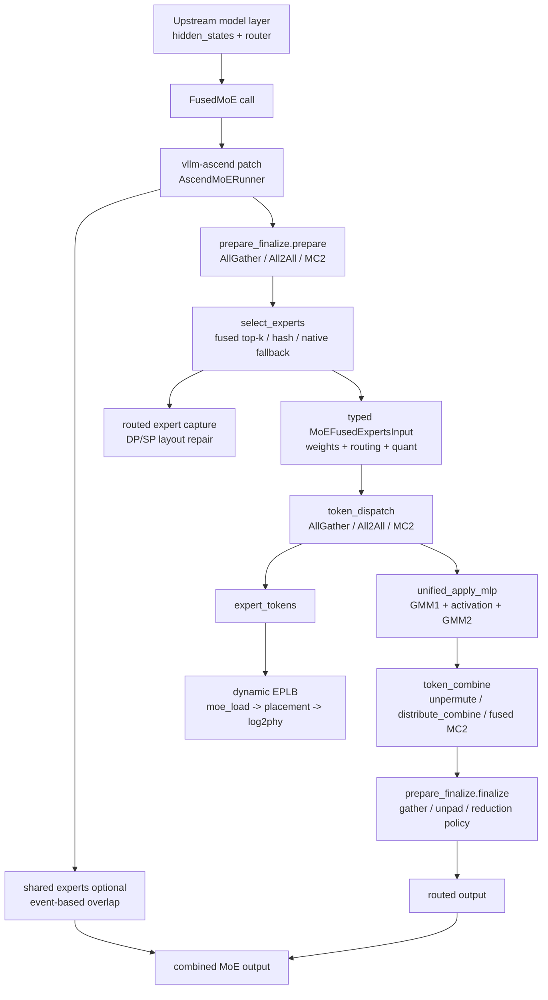

# vLLM-Ascend Kimi K3 MoE Forward Insight

**Repository:** [vllm-project/vllm-ascend](https://github.com/vllm-project/vllm-ascend) @ `e3bb5f570f0b7d7fef9df3190a450052bee090cc` (origin/main, clean detached worktree, inspected 2026-07-30)

**Related pages:** [Kimi K3](../../training/kimi/kimi-k3/index.md), [vLLM Kimi K3 Code Reading Map](../vllm/vllm-kimi-k3-code-reading.md), [Mixture of Experts](../../terms/mixture-of-experts.md), [DeepSeek V4 Attention Code Reading](../deepseek/v4-attention-code-reading.md), [Triton in vLLM/vllm-ascend](../triton/triton-in-vllm.md)

## TL;DR

The latest inspected vllm-ascend code still does not contain a plugin-local `kimi_k3` model module. The real K3-serving insight is that vllm-ascend hijacks upstream vLLM's `FusedMoE` factory and turns any upstream Kimi K3-style [Mixture of Experts](../../terms/mixture-of-experts.md) layer into an Ascend-native routed-MoE pipeline.

The forward path is:

1. upstream model code calls `FusedMoE`;
2. <a class="code-link" href="../../../external-repos/vllm-ascend-e3bb5f570/vllm_ascend/patch/platform/patch_fused_moe.py#L45" data-code-repo="vllm-ascend-e3bb5f570f0b" data-code-path="vllm_ascend/patch/platform/patch_fused_moe.py" data-code-line="45"><code>patch/platform/patch_fused_moe.py</code></a> replaces the factory with <a class="code-link" href="../../../external-repos/vllm-ascend-e3bb5f570/vllm_ascend/ops/fused_moe/fused_moe.py#L311" data-code-repo="vllm-ascend-e3bb5f570f0b" data-code-path="vllm_ascend/ops/fused_moe/fused_moe.py" data-code-line="311"><code>AscendMoERunner</code></a>;
3. <a class="code-link" href="../../../external-repos/vllm-ascend-e3bb5f570/vllm_ascend/ops/fused_moe/fused_moe.py#L620" data-code-repo="vllm-ascend-e3bb5f570f0b" data-code-path="vllm_ascend/ops/fused_moe/fused_moe.py" data-code-line="620"><code>AscendMoERunner.no_shared_forward_impl()</code></a> prepares the tensor layout for AllGather, All2All, or MC2;
4. <a class="code-link" href="../../../external-repos/vllm-ascend-e3bb5f570/vllm_ascend/ops/fused_moe/experts_selector.py#L29" data-code-repo="vllm-ascend-e3bb5f570f0b" data-code-path="vllm_ascend/ops/fused_moe/experts_selector.py" data-code-line="29"><code>select_experts()</code></a> chooses top-k experts with fused Ascend top-k, the hash/sqrtsoftplus path, or native fallback;
5. typed MoE stage payloads carry weights, routing maps, quantization metadata, and combine metadata across stages;
6. token dispatch sends tokens to local physical experts;
7. `unified_apply_mlp()` runs grouped `gate/up -> activation -> down` compute;
8. token combine and finalize restore the expected token layout;
9. routed-expert capture and dynamic EPLB observe and rebalance the same routing stream.

Compared with the older `8645122088f5...` page, the new code-reading emphasis is the typed MoE stage-contract refactor, routed-expert capture under DP/SP layouts, and the more explicit MC2/Fused-MC2 plus EPLB interaction. Remote `main` was verified at `e3bb5f570f0b7d7fef9df3190a450052bee090cc`; the commits after the initial local `32a59d4e349c...` checkout did not touch the inspected MoE/EPLB/routed-capture files.

[Mermaid source](../assets/vllm-ascend-kimi-k3-moe-forward.mmd)



## What K3 Means Here

Kimi K3 is a large routed MoE model. In upstream vLLM, K3 has a concrete model implementation; in this vllm-ascend plugin revision, the local repository supplies the hardware substrate that upstream model code lands on.

The plugin has Kimi-adjacent pieces, including <a class="code-link" href="../../../external-repos/vllm-ascend-e3bb5f570/vllm_ascend/patch/worker/patch_kimi_k25.py#L44" data-code-repo="vllm-ascend-e3bb5f570f0b" data-code-path="vllm_ascend/patch/worker/patch_kimi_k25.py" data-code-line="44"><code>patch/worker/patch_kimi_k25.py</code></a> and KDA Triton kernels under `ops/triton/kda/`, but the MoE path itself is generic. The page is about how Kimi K3-style routed experts run once upstream model construction reaches `FusedMoE`.

The optional `xlite` runtime is also not the K3 answer in this revision. <a class="code-link" href="../../../external-repos/vllm-ascend-e3bb5f570/vllm_ascend/xlite/xlite.py#L454" data-code-repo="vllm-ascend-e3bb5f570f0b" data-code-path="vllm_ascend/xlite/xlite.py" data-code-line="454"><code>xlite/xlite.py</code></a> registers graph adapters for Qwen MoE, GLM MoE, and MiniMax M2. It does not register a Kimi K3 adapter, so the reliable K3 path remains the patched `FusedMoE` runner.

## Entry Point

The entry point is <a class="code-link" href="../../../external-repos/vllm-ascend-e3bb5f570/vllm_ascend/patch/platform/patch_fused_moe.py#L45" data-code-repo="vllm-ascend-e3bb5f570f0b" data-code-path="vllm_ascend/patch/platform/patch_fused_moe.py" data-code-line="45"><code>vllm_ascend/patch/platform/patch_fused_moe.py</code></a>.

vLLM model files import `FusedMoE` from upstream `vllm.model_executor.layers.fused_moe`. vllm-ascend replaces both upstream bindings before model import:

- `_fused_moe_layer.FusedMoE = _ascend_FusedMoE`
- `_fused_moe_pkg.FusedMoE = _ascend_FusedMoE`

`_ascend_FusedMoE()` chooses `AscendMoERunner` by default, or `AscendMoERunner310` on 310P; pushes Ascend EPLB redundant expert capacity into upstream weight allocation; rejects conflicting redundancy settings; and forwards `tid2eid` into `runner_args`. This is the central inversion: upstream keeps the model shape, vllm-ascend owns the execution.

## Runner Initialization

<a class="code-link" href="../../../external-repos/vllm-ascend-e3bb5f570/vllm_ascend/ops/fused_moe/fused_moe.py#L311" data-code-repo="vllm-ascend-e3bb5f570f0b" data-code-path="vllm_ascend/ops/fused_moe/fused_moe.py" data-code-line="311"><code>vllm_ascend/ops/fused_moe/fused_moe.py</code></a> defines `AscendMoERunner`.

During construction it copies upstream routing configuration from `routed_experts`: grouped top-k settings, renormalization, scoring function, correction bias, routed scaling, and router-weight-on-input behavior.

It then replaces the quant method on `routed_experts`, not on the runner itself. That detail is important because newer upstream vLLM owns expert weights under the `RoutedExperts` child module. Passing or mutating the wrong module would make weight loading and `process_weights_after_loading()` hit the wrong object.

The runner also initializes TP, DP, EP, and MC2 groups; shared-expert options; `global_expert_map`; local `_expert_map`; `log2phy`; dynamic EPLB load buffers; and registration with <a class="code-link" href="../../../external-repos/vllm-ascend-e3bb5f570/vllm_ascend/eplb/adaptor/vllm_adaptor.py#L61" data-code-repo="vllm-ascend-e3bb5f570f0b" data-code-path="vllm_ascend/eplb/adaptor/vllm_adaptor.py" data-code-line="61"><code>VllmEplbAdaptor</code></a>. That makes expert IDs two-level: routing selects logical experts, while dispatch may map them through `log2phy` to current physical slots.

## Forward Skeleton

The main routed path is <a class="code-link" href="../../../external-repos/vllm-ascend-e3bb5f570/vllm_ascend/ops/fused_moe/fused_moe.py#L620" data-code-repo="vllm-ascend-e3bb5f570f0b" data-code-path="vllm_ascend/ops/fused_moe/fused_moe.py" data-code-line="620"><code>AscendMoERunner.no_shared_forward_impl()</code></a>:

1. synchronize per-layer MoE LoRA context when present;
2. call `_EXTRA_CTX.moe_comm_method.prepare(...)`;
3. call `self._quant_method.apply(layer=self.routed_experts, ...)`;
4. if dynamic EPLB heat collection is active, convert returned expert-token lists into local load and add them into `moe_load`;
5. call `_EXTRA_CTX.moe_comm_method.finalize(...)`;
6. return either the routed tensor or a `FusedMoEResult` with NPU events for shared-expert overlap.

Shared experts run through `_forward_shared_experts()`. For quantized shared experts, the code overlaps dynamic quant, gate/up projection, activation, and down projection with routed-expert events such as `before_dispatch`, `before_gmm2`, and `before_combine`.

## Stage 1: Prepare

Preparation is isolated in <a class="code-link" href="../../../external-repos/vllm-ascend-e3bb5f570/vllm_ascend/ops/fused_moe/prepare_finalize.py#L233" data-code-repo="vllm-ascend-e3bb5f570f0b" data-code-path="vllm_ascend/ops/fused_moe/prepare_finalize.py" data-code-line="233"><code>ops/fused_moe/prepare_finalize.py</code></a>.

- `PrepareAndFinalizeWithAllGather` handles DP/EP gathering and later reduction or scatter.
- `PrepareAndFinalizeWithAll2All` pads hidden states and router logits to TP boundaries, slices by TP rank, then later all-gathers and unpads.
- `PrepareAndFinalizeWithMC2` inherits All2All-style slicing but uses `mc2_mask` and padded token capacity from the Ascend forward context.

The typed `MoEPrepareOutput` carries processed hidden states, processed router logits, optional `mc2_mask`, optional padded shape, and optional per-token scale. This stage defines the tensor contract for the rest of the pipeline.

## Stage 2: Select Experts

`AscendUnquantizedFusedMoEMethod.apply()` calls `select_experts()` from <a class="code-link" href="../../../external-repos/vllm-ascend-e3bb5f570/vllm_ascend/ops/fused_moe/experts_selector.py#L29" data-code-repo="vllm-ascend-e3bb5f570f0b" data-code-path="vllm_ascend/ops/fused_moe/experts_selector.py" data-code-line="29"><code>ops/fused_moe/experts_selector.py</code></a>.

The fused path accepts softmax, sigmoid, and `sqrtsoftplus` scoring when group/top-k constraints are valid and no custom routing function is supplied. The Kimi/DeepSeek-relevant branch is `sqrtsoftplus` with hash metadata. When `tid2eid` is present, the code aligns `input_ids` with the communication layout and calls:

```text
torch.ops._C_ascend.moe_gating_top_k_hash(...)
```

The normal fused softmax/sigmoid path calls `DeviceOperator.moe_gating_top_k()`. Unsupported cases fall back to native PyTorch scoring, grouped top-k, correction bias, optional custom routing, top-k, renormalization, and routed scaling.

If `enable_return_routed_experts` is active, the selected `topk_ids` are also captured on the routed-experts module before dispatch.

## Stage 3: Typed Runtime Contracts

One major latest-code change is the explicit contract layer:

- <a class="code-link" href="../../../external-repos/vllm-ascend-e3bb5f570/vllm_ascend/ops/fused_moe/moe_stage_contracts.py#L32" data-code-repo="vllm-ascend-e3bb5f570f0b" data-code-path="vllm_ascend/ops/fused_moe/moe_stage_contracts.py" data-code-line="32"><code>moe_stage_contracts.py</code></a> defines `MoEPrepareOutput`, `MoEFusedExpertsInput`, `MoETokenDispatchInput`, `MoETokenDispatchOutput`, `MoEMlpComputeInput`, and combine metadata dataclasses.
- <a class="code-link" href="../../../external-repos/vllm-ascend-e3bb5f570/vllm_ascend/ops/fused_moe/moe_runtime_args.py#L116" data-code-repo="vllm-ascend-e3bb5f570f0b" data-code-path="vllm_ascend/ops/fused_moe/moe_runtime_args.py" data-code-line="116"><code>moe_runtime_args.py</code></a> builds those payloads from legacy call sites.

The dispatch, MLP, and combine path now receives structured sub-payloads for weights, routing, quantization, activation controls, and optional MoE LoRA context. For K3-scale serving, this makes token layout, quantization, physical expert placement, and activation flavor easier to audit.

## Stage 4: Dispatch, MLP, Combine

<a class="code-link" href="../../../external-repos/vllm-ascend-e3bb5f570/vllm_ascend/ops/fused_moe/moe_comm_method.py#L133" data-code-repo="vllm-ascend-e3bb5f570f0b" data-code-path="vllm_ascend/ops/fused_moe/moe_comm_method.py" data-code-line="133"><code>MoECommMethod.fused_experts()</code></a> is the common path:

1. record `before_dispatch_evt`;
2. map logical `topk_ids` through `log2phy` when dynamic placement is active;
3. build `MoETokenDispatchInput`;
4. call `token_dispatch()`;
5. build `MoEMlpComputeInput`;
6. call `unified_apply_mlp()`;
7. record `before_combine_evt`;
8. call `token_combine()`;
9. return `FusedExpertsResult`.

| Mode | Dispatch | Combine | When It Matters |
|---|---|---|---|
| AllGather | `DeviceOperator.npu_moe_init_routing()` sorts tokens and returns expert token counts. | `DeviceOperator.npu_moe_token_unpermute()` restores token order and applies probabilities. | Default broad compatibility and single-EP cases. |
| All2All | `torch_npu.npu_moe_token_permute()`, async EP all-to-all, local expert post-sort. | Expert-output unpermute, async all-to-all back, final token unpermute. | EP deployments where All2All beats AllGather. |
| MC2 | `torch_npu.npu_moe_distribute_dispatch(_v2)` with HCCL groups, EP rank/world, quant mode, hierarchy communication, and optional `mc2_mask`. | `torch_npu.npu_moe_distribute_combine(_v2)`. | Ascend communication-compute optimized routed MoE. |
| Fused MC2 | CANN MegaMoe when available, otherwise `_C_ascend.dispatch_ffn_combine()` for `enable_fused_mc2 == 1`. | Fused op returns already combined output. | Quantized or fused routes where dispatch, FFN, and combine can collapse. |

The MLP compute in <a class="code-link" href="../../../external-repos/vllm-ascend-e3bb5f570/vllm_ascend/ops/fused_moe/moe_mlp.py#L589" data-code-repo="vllm-ascend-e3bb5f570f0b" data-code-path="vllm_ascend/ops/fused_moe/moe_mlp.py" data-code-line="589"><code>moe_mlp.py</code></a> has the standard MoE shape:

```text
expert input -> grouped matmul gate/up -> activation -> grouped matmul down
```

Unquantized execution uses `torch_npu.npu_grouped_matmul()`. Quantized paths cover W8A8, W4A8, W8A8FP, and MXFP variants, including custom fused GMM+SwiGLU+quant ops where supported. Activation branches include normal SwiGLU, clipped `swigluoai_uninterleave`, `swiglustep`, GELU, and GELU-tanh.

## Stage 5: Routed-Expert Capture

The latest code has a plugin-specific routed-expert capture patch in <a class="code-link" href="../../../external-repos/vllm-ascend-e3bb5f570/vllm_ascend/patch/worker/patch_routed_experts_capture.py#L35" data-code-repo="vllm-ascend-e3bb5f570f0b" data-code-path="vllm_ascend/patch/worker/patch_routed_experts_capture.py" data-code-line="35"><code>patch/worker/patch_routed_experts_capture.py</code></a>.

It handles all-DP concatenation, modular-kernel per-rank routing, padded AllGather blocks, and sequence-parallel shards that must be all-gathered across TP ranks before capture. This matters because API-visible routed expert IDs should correspond to the user's tokens, not the plugin's padded, split, or exchanged internal layout.

## Stage 6: Dynamic EPLB

Dynamic EPLB consumes the same `expert_tokens` produced by dispatch. In `AscendMoERunner.no_shared_forward_impl()`, the runner converts cumulative group lists to per-expert counts when needed and adds the result into each layer's `moe_load`.

<a class="code-link" href="../../../external-repos/vllm-ascend-e3bb5f570/vllm_ascend/eplb/adaptor/vllm_adaptor.py#L61" data-code-repo="vllm-ascend-e3bb5f570f0b" data-code-path="vllm_ascend/eplb/adaptor/vllm_adaptor.py" data-code-line="61"><code>VllmEplbAdaptor</code></a> gathers per-layer load, exposes expert parameters for the actual weight owner, copies updated expert maps into layers, updates `log2phy`, and moves expert weights when placements change. <a class="code-link" href="../../../external-repos/vllm-ascend-e3bb5f570/vllm_ascend/eplb/core/eplb_worker.py#L29" data-code-repo="vllm-ascend-e3bb5f570f0b" data-code-path="vllm_ascend/eplb/core/eplb_worker.py" data-code-line="29"><code>EplbWorker</code></a> computes placements, validates that every logical expert remains placed and is not duplicated on a rank, and emits update information.

The key serving insight is that K3-scale MoE is not static expert parallelism only. vllm-ascend can observe hot routed experts and remap logical expert IDs to physical slots while preserving the router's logical output.

## What Changed From the Old Insight

- The MoE pipeline has explicit stage contracts in <a class="code-link" href="../../../external-repos/vllm-ascend-e3bb5f570/vllm_ascend/ops/fused_moe/moe_runtime_args.py#L116" data-code-repo="vllm-ascend-e3bb5f570f0b" data-code-path="vllm_ascend/ops/fused_moe/moe_runtime_args.py" data-code-line="116"><code>moe_runtime_args.py</code></a> and <a class="code-link" href="../../../external-repos/vllm-ascend-e3bb5f570/vllm_ascend/ops/fused_moe/moe_stage_contracts.py#L32" data-code-repo="vllm-ascend-e3bb5f570f0b" data-code-path="vllm_ascend/ops/fused_moe/moe_stage_contracts.py" data-code-line="32"><code>moe_stage_contracts.py</code></a>.
- The quant method is deliberately installed on `routed_experts`, and forward passes the `routed_experts` child as the weight owner.
- Routed-expert capture is now part of the practical serving surface and has Ascend-specific DP/SP layout repair.
- MC2/Fused-MC2 has more explicit A3/A5, hierarchy communication, `global_bs`, MegaMoe symmetric-buffer, and active-mask behavior.
- EPLB support is wired through runner registration and parameter accessors that understand the refactored weight owner.
- `xlite` exists as a separate graph runtime surface, but it currently does not make Kimi K3 a plugin-local graph-adapted model.

## Where It Breaks

- If the patch runs after model import, upstream `FusedMoE` may be bound before vllm-ascend replaces it.
- If redundant expert counts disagree between upstream vLLM and Ascend config, allocation and placement diverge.
- If `mc2_mask`, padded token count, or TP slicing is wrong, MC2 can combine the wrong rows or hang in distributed communication.
- If `log2phy` is stale during dynamic EPLB, the router's logical IDs point at the wrong physical weights.
- If routed-expert capture does not recognize the current DP/SP layout, API-visible expert IDs become misleading.
- If Fused MC2's symmetric buffer is sized from per-rank runtime tokens instead of rank-invariant capacity, EP ranks can allocate incompatible buffers.

## Reading Path

1. Start with <a class="code-link" href="../../../external-repos/vllm-ascend-e3bb5f570/vllm_ascend/patch/platform/patch_fused_moe.py#L45" data-code-repo="vllm-ascend-e3bb5f570f0b" data-code-path="vllm_ascend/patch/platform/patch_fused_moe.py" data-code-line="45"><code>vllm_ascend/patch/platform/patch_fused_moe.py</code></a>.
2. Read `AscendMoERunner.__init__()` and `no_shared_forward_impl()` in <a class="code-link" href="../../../external-repos/vllm-ascend-e3bb5f570/vllm_ascend/ops/fused_moe/fused_moe.py#L311" data-code-repo="vllm-ascend-e3bb5f570f0b" data-code-path="vllm_ascend/ops/fused_moe/fused_moe.py" data-code-line="311"><code>vllm_ascend/ops/fused_moe/fused_moe.py</code></a>.
3. Follow `select_experts()` in <a class="code-link" href="../../../external-repos/vllm-ascend-e3bb5f570/vllm_ascend/ops/fused_moe/experts_selector.py#L29" data-code-repo="vllm-ascend-e3bb5f570f0b" data-code-path="vllm_ascend/ops/fused_moe/experts_selector.py" data-code-line="29"><code>vllm_ascend/ops/fused_moe/experts_selector.py</code></a>.
4. Read the typed contracts in <a class="code-link" href="../../../external-repos/vllm-ascend-e3bb5f570/vllm_ascend/ops/fused_moe/moe_stage_contracts.py#L32" data-code-repo="vllm-ascend-e3bb5f570f0b" data-code-path="vllm_ascend/ops/fused_moe/moe_stage_contracts.py" data-code-line="32"><code>moe_stage_contracts.py</code></a> and builders in <a class="code-link" href="../../../external-repos/vllm-ascend-e3bb5f570/vllm_ascend/ops/fused_moe/moe_runtime_args.py#L116" data-code-repo="vllm-ascend-e3bb5f570f0b" data-code-path="vllm_ascend/ops/fused_moe/moe_runtime_args.py" data-code-line="116"><code>moe_runtime_args.py</code></a>.
5. Read `MoECommMethod.fused_experts()` in <a class="code-link" href="../../../external-repos/vllm-ascend-e3bb5f570/vllm_ascend/ops/fused_moe/moe_comm_method.py#L133" data-code-repo="vllm-ascend-e3bb5f570f0b" data-code-path="vllm_ascend/ops/fused_moe/moe_comm_method.py" data-code-line="133"><code>moe_comm_method.py</code></a>.
6. Pick one dispatcher in <a class="code-link" href="../../../external-repos/vllm-ascend-e3bb5f570/vllm_ascend/ops/fused_moe/token_dispatcher.py#L69" data-code-repo="vllm-ascend-e3bb5f570f0b" data-code-path="vllm_ascend/ops/fused_moe/token_dispatcher.py" data-code-line="69"><code>token_dispatcher.py</code></a>: AllGather first, then MC2.
7. Finish with `unified_apply_mlp()` in <a class="code-link" href="../../../external-repos/vllm-ascend-e3bb5f570/vllm_ascend/ops/fused_moe/moe_mlp.py#L589" data-code-repo="vllm-ascend-e3bb5f570f0b" data-code-path="vllm_ascend/ops/fused_moe/moe_mlp.py" data-code-line="589"><code>moe_mlp.py</code></a>.
8. For serving observability and balancing, read <a class="code-link" href="../../../external-repos/vllm-ascend-e3bb5f570/vllm_ascend/patch/worker/patch_routed_experts_capture.py#L35" data-code-repo="vllm-ascend-e3bb5f570f0b" data-code-path="vllm_ascend/patch/worker/patch_routed_experts_capture.py" data-code-line="35"><code>patch_routed_experts_capture.py</code></a> and <a class="code-link" href="../../../external-repos/vllm-ascend-e3bb5f570/vllm_ascend/eplb/adaptor/vllm_adaptor.py#L61" data-code-repo="vllm-ascend-e3bb5f570f0b" data-code-path="vllm_ascend/eplb/adaptor/vllm_adaptor.py" data-code-line="61"><code>eplb/adaptor/vllm_adaptor.py</code></a>.

## Go Deeper

- [Kimi K3](../../training/kimi/kimi-k3/index.md) for the model architecture.
- [vLLM Kimi K3 Code Reading Map](../vllm/vllm-kimi-k3-code-reading.md) for upstream model code.
- [Mixture of Experts](../../terms/mixture-of-experts.md) for the general sparse-routing concept.
- [DeepSeek V4 Attention Code Reading](../deepseek/v4-attention-code-reading.md) for the neighboring vllm-ascend long-context attention path.
- [Triton in vLLM/vllm-ascend](../triton/triton-in-vllm.md) for the plugin's Triton and custom-kernel surface.
