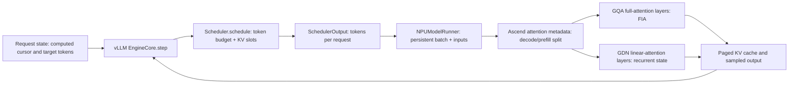
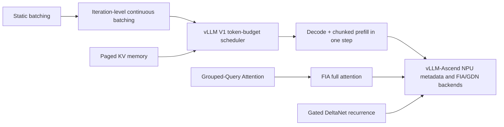

# vLLM-Ascend Prefill and Decode Scheduling: Qwen3.5 GQA

**Repositories:** [vllm-project/vllm-ascend](https://github.com/vllm-project/vllm-ascend) @ `9a52ca5fc36c1852241822863c50717bee5dc761`; [vllm-project/vllm](https://github.com/vllm-project/vllm) @ `a0c092ee72c0dcefbb3b3e74f97ac62d842e5f4b`.

**Related pages:** [Qwen3.5 / Qwen3.6 inference path](./qwen3.5-qwen3.6-inference.md), [vLLM continuous batching](../vllm/vllm-continuous-batching/index.md), [vLLM-Ascend architecture](./architecture.md), [Grouped-Query Attention](../../algorithms/attention-variants/grouped-query-attention/index.md), [Chunked Prefill](../../terms/chunked-prefill.md), [Continuous Batching](../../terms/continuous-batching.md), [Block Table](../../terms/block-table.md).

## TL;DR

**What:** vLLM V1 schedules a token-level work plan on every engine iteration, so one step can contain one-token decodes, a chunk of a new prompt, or both.

**How:** The scheduler advances each request's computed-token cursor toward its target, allocates only the required KV blocks, and vLLM-Ascend classifies the resulting batch as prefill, decode, speculative, or chunked-prefill before the Qwen3.5 attention backends run.

**The boundary:** The scheduler is upstream vLLM code; vLLM-Ascend owns the NPU-side state classification, metadata construction, FIA/GQA execution, and GDN execution for Qwen3.5's hybrid layers.

## The Big Picture

*Synthesized runtime view from the pinned repositories. 1. The engine closes one schedule/execute/update loop. 2. The scheduler emits token counts and KV block assignments. 3. The Ascend runner turns those counts into attention metadata. 4. Qwen3.5's full-attention layers use GQA through FIA, while GDN layers use a recurrent state path. Editable source: [prefill-decode-path.mmd](./assets/prefill-decode-path.mmd).*

## Why This Exists

Imagine request A arriving with a 12-token prompt while request B is already generating its next token. If the server ran whole prompts atomically, A could occupy the device while B waits, or B could force A to wait until a large prefill finishes. With a six-token per-step budget, the scheduler can give B one decode token and A a five-token prompt chunk, then continue A in a later iteration. The prompt does not disappear between chunks: its KV blocks and computed-token cursor are retained.

That mixed step is the important example for the rest of this page. The scheduler decides **how many tokens each request advances**; the Ascend backend decides **how those token ranges are laid out and computed**.

## The Landscape

*Landscape synthesis: iteration-level scheduling and paged KV memory provide the upstream serving substrate; GQA/FIA and GDN are the two Qwen3.5 layer-level execution branches. Editable source: [landscape.mmd](./assets/landscape.mmd).*

## The Core Idea

**Prefill and decode are not two scheduler queues in V1.** A request is represented by how many tokens have already been computed and how many tokens are currently required. Every iteration spends a shared token budget to reduce that gap. A one-token gap looks like decode; a larger gap is prompt work or speculative work; a long prompt is chunked when the remaining budget cannot cover it. vLLM-Ascend receives this same plan and preserves the token order needed by its NPU attention kernels.

## Symbol Map

The names below describe the handoff between scheduler and backend. `num_computed_tokens` is the cursor; `num_tokens` is the current non-speculative target; `num_tokens_with_spec` can include draft tokens. `num_scheduled_tokens` is the per-iteration delta, not the total sequence length.

| Symbol or field | Human meaning | Scope | Why it matters |
|---|---|---|---|
| `num_computed_tokens` | Computed-token cursor | Per request | The scheduler advances this toward the target. |
| `num_tokens_with_spec` | Current target including draft tokens | Per request | Unifies ordinary decode and speculative work. |
| `num_scheduled_tokens` | Tokens issued this step | Per request | Defines query length for the worker. |
| `token_budget` | Remaining work capacity | Per iteration | Shared by running requests and newly admitted prompts. |
| `num_decode_tokens` | Tokens belonging to decode rows | Per attention batch | Prefix of the mixed FIA input. |
| `num_prefills` | Number of prompt rows | Per attention batch | Tells FIA how many rows use prefill metadata. |
| `attn_state` | Ascend execution mode | Per runner step | Selects decode-only, prefill, chunked-prefill, or speculative behavior. |
| `block_tables` | Logical-to-physical KV mapping | Per request | Lets prompt chunks and outputs grow without contiguous memory. |

## Deep Dive 1: The Engine Creates the Rescheduling Boundary

**What it does:** <a class="code-link" href="../../../external-repos/vllm/vllm/v1/engine/core.py#L584" data-code-repo="vllm-a0c092ee72c0" data-code-path="vllm/v1/engine/core.py" data-code-line="584" data-code-end-line="606"><code>EngineCore.step()</code></a> calls scheduling, model execution, and output update once.

**Why it matters:** A completed output token is also an opportunity to admit new work or continue a prompt chunk.

**How it works:**

1. <a class="code-link" href="../../../external-repos/vllm/vllm/v1/engine/core.py#L584" data-code-repo="vllm-a0c092ee72c0" data-code-path="vllm/v1/engine/core.py" data-code-line="584" data-code-end-line="606"><code>EngineCore.step()</code></a> calls `Scheduler.schedule()`.
2. The returned `SchedulerOutput` goes to the model executor.
3. Sampling produces output tokens or accepted speculative tokens.
4. The scheduler updates request cursors and finish state.
5. The next iteration builds a new plan; the previous batch is not a permanent phase boundary.

**The intuition:** Every model step is a small scheduling decision, not merely another pass through a fixed batch.

**A concrete example:** B's one-token decode and A's next prompt chunk can coexist in one step; after B finishes, the next step can replace it with another waiting request.

**Remember:** The schedule/execute/update loop is the unit of continuous batching.

## Deep Dive 2: The Scheduler Spends One Token Budget

**What it does:** <a class="code-link" href="../../../external-repos/vllm/vllm/v1/core/sched/scheduler.py#L427" data-code-repo="vllm-a0c092ee72c0" data-code-path="vllm/v1/core/sched/scheduler.py" data-code-line="427" data-code-end-line="617"><code>Scheduler.schedule()</code></a> gives running requests the first claim on `max_num_scheduled_tokens`, then considers waiting requests.

**Why it matters:** Decode work remains responsive while long prompts are admitted incrementally.

**How it works:**

- For a running request, the scheduler computes the gap between <a class="code-link" href="../../../external-repos/vllm/vllm/v1/request.py#L277" data-code-repo="vllm-a0c092ee72c0" data-code-path="vllm/v1/request.py" data-code-line="277" data-code-end-line="278"><code>Request.num_tokens_with_spec</code></a> plus `num_output_placeholders` and `num_computed_tokens`.
- It clips that gap by the remaining token budget and model-length limit.
- It asks <a class="code-link" href="../../../external-repos/vllm/vllm/v1/core/kv_cache_manager.py#L344" data-code-repo="vllm-a0c092ee72c0" data-code-path="vllm/v1/core/kv_cache_manager.py" data-code-line="344" data-code-end-line="410"><code>KVCacheManager.allocate_slots()</code></a> for only the blocks needed by that work.
- If a waiting prompt is larger than the remaining budget, chunked prefill allows the scheduler to use the remaining budget instead of stopping the entire pass.
- If KV allocation fails, the scheduler can preempt a running request and retry the admission.

**The intuition:** The budget is a shared measuring cup: decode takes a sip, and a prompt chunk uses what remains.

**A concrete example:** With a budget of six, B consumes one decode token and A receives five prompt tokens. A's `num_computed_tokens` advances by five, but A is still a prefill request.

**Remember:** `max_num_scheduled_tokens` limits token work, not the number of requests.

## Deep Dive 3: Chunked Prefill Is a Cursor That Persists

**What it does:** A prompt longer than the current budget is admitted as a partial range and remains in `running` until its computed cursor catches up with the prompt.

**Why it matters:** One long prompt cannot monopolize a step or force all decode requests to wait.

**How it works:** The request tracks `num_computed_tokens`, `num_tokens`, and `num_tokens_with_spec`; its <a class="code-link" href="../../../external-repos/vllm/vllm/v1/core/sched/scheduler.py#L1318" data-code-repo="vllm-a0c092ee72c0" data-code-path="vllm/v1/core/sched/scheduler.py" data-code-line="1318" data-code-end-line="1325"><code>is_prefill_chunk</code></a> flag is refreshed after scheduled tokens are accounted for in the scheduler's output-update path. The request's newly computed KV is retained in paged blocks, so the next iteration starts at the next prompt position rather than recomputing the finished prefix.

The key upstream switch is `enable_chunked_prefill`: when it is disabled, a waiting prompt that exceeds the remaining budget stops admission; when enabled, `num_new_tokens` is clipped to the budget. This is why chunked prefill is a scheduling policy coupled to KV allocation, not a special attention formula.

**The intuition:** Chunking turns one oversized prompt into a sequence of resumable cursor advances.

**A concrete example:** A's 12-token prompt runs as 5 + 6 + 1 tokens across three iterations if other decode work consumes the budget. The first two chunks write KV blocks; the final chunk makes A eligible for ordinary generation.

**Remember:** A prefill chunk is unfinished prompt work with persistent state, not a new request.

## Deep Dive 4: Ascend Reclassifies the Scheduled Batch

**What it does:** <a class="code-link" href="../../../external-repos/vllm-ascend-9a52ca5fc36c/vllm_ascend/worker/model_runner_v1.py#L1289" data-code-repo="vllm-ascend-9a52ca5fc36c" data-code-path="vllm_ascend/worker/model_runner_v1.py" data-code-line="1289" data-code-end-line="1316"><code>NPUModelRunner._build_attn_state()</code></a> turns scheduler-produced token counts and cached-token state into an Ascend attention mode.

**Why it matters:** The scheduler speaks in token counts, while NPU kernels need an explicit execution layout.

**How it works:**

| Runner observation | Ascend state | Meaning |
|---|---|---|
| Every request has zero computed tokens | `PrefillNoCache` | Initial prompt processing with no prior KV hit. |
| Every scheduled request contributes one token | `DecodeOnly` | Ordinary autoregressive decode, unless MTP changes the state. |
| The batch mixes multi-token and one-token work, or chunking is enabled | `ChunkedPrefill` | Split-fuse execution for prompt chunks and decodes. |
| Prompt tokens are already cached | `PrefillCacheHit` | Prefill reads existing paged KV state. |
| Draft/accepted-token conditions apply | `SpecDecoding` | Speculative path with special token accounting. |

The runner also computes per-request `is_prefilling` metadata from the computed cursor and prompt length. Its <a class="code-link" href="../../../external-repos/vllm-ascend-9a52ca5fc36c/vllm_ascend/worker/model_runner_v1.py#L1756" data-code-repo="vllm-ascend-9a52ca5fc36c" data-code-path="vllm_ascend/worker/model_runner_v1.py" data-code-line="1756" data-code-end-line="1935"><code>NPUModelRunner.execute_model()</code></a> receives the upstream `SchedulerOutput` and prepares the persistent batch before this metadata is built. This means a mixed batch can contain a request still prefilling even when another request is decoding.

**The intuition:** Ascend does not guess the phase from request age; it derives the phase from the actual token ranges in this step.

**A concrete example:** For B = `[1]` and A = `[5]`, the runner marks the batch `ChunkedPrefill`, and the attention metadata records the decode prefix plus the prompt suffix.

**Remember:** `attn_state` is a backend execution mode derived after scheduling, not the scheduler's queue identity.

## Deep Dive 5: FIA Executes Decode and Prefill Differently

**What it does:** <a class="code-link" href="../../../external-repos/vllm-ascend-9a52ca5fc36c/vllm_ascend/attention/attention_v1.py#L287" data-code-repo="vllm-ascend-9a52ca5fc36c" data-code-path="vllm_ascend/attention/attention_v1.py" data-code-line="287" data-code-end-line="375"><code>AscendAttentionMetadataBuilder.build()</code></a> calls the shared <a class="code-link" href="../../../external-repos/vllm-ascend-9a52ca5fc36c/vllm_ascend/attention/attention_v1.py#L260" data-code-repo="vllm-ascend-9a52ca5fc36c" data-code-path="vllm_ascend/attention/attention_v1.py" data-code-line="260" data-code-end-line="264"><code>_split_decodes_and_prefills()</code></a> helper and materializes `num_decode_tokens`, `num_decodes`, `num_prefills`, sequence lengths, block tables, and slot mappings.

**Why it matters:** Qwen3.5's full-attention layers are GQA layers: decode benefits from paged KV reads, while prompt tokens need a variable-length TND representation.

**How it works:**

1. <a class="code-link" href="../../../external-repos/vllm-ascend-9a52ca5fc36c/vllm_ascend/attention/attention_v1.py#L138" data-code-repo="vllm-ascend-9a52ca5fc36c" data-code-path="vllm_ascend/attention/attention_v1.py" data-code-line="138" data-code-end-line="143"><code>AscendAttentionState</code></a> labels the step.
2. The builder places decode tokens in the leading range `[0, num_decode_tokens)` and prompt tokens after them.
3. <a class="code-link" href="../../../external-repos/vllm-ascend-9a52ca5fc36c/vllm_ascend/attention/attention_v1.py#L1604" data-code-repo="vllm-ascend-9a52ca5fc36c" data-code-path="vllm_ascend/attention/attention_v1.py" data-code-line="1604" data-code-end-line="1669"><code>AscendAttentionBackendImpl.forward()</code></a> writes new K/V to the paged cache when present, then dispatches to the FIA implementation.
4. In a mixed C8 path, <a class="code-link" href="../../../external-repos/vllm-ascend-9a52ca5fc36c/vllm_ascend/attention/attention_v1.py#L1920" data-code-repo="vllm-ascend-9a52ca5fc36c" data-code-path="vllm_ascend/attention/attention_v1.py" data-code-line="1920" data-code-end-line="2019"><code>_forward_c8_chunked_prefill()</code></a> runs decode through paged INT8 BNSD and prompt work through FIA TND. New prompt KV can stay in float; a continuing chunk can gather and dequantize prior paged KV.
5. In an all-decode step, the normal fast path uses paged KV/FIA decode behavior without a prompt TND section.

For the Qwen3.5 GQA example, `num_query_heads` can exceed `num_key_value_heads`; FIA receives both counts and reuses each grouped K/V head for its query group. This is the full-attention half of the Qwen3.5 hybrid model, not the GDN half.

**The intuition:** The same scheduled token list is split into two kernel-friendly coordinate systems: paged BNSD for decode and packed TND for prompt work.

**A concrete example:** B's first token occupies the decode prefix and reads B's existing KV blocks; A's five new prompt tokens occupy the TND suffix and write A's new KV slots.

**Remember:** Chunked prefill is a mixed layout contract as much as it is a scheduler policy.

## Deep Dive 6: Qwen3.5 Has a Second, Recurrent Attention Path

**What it does:** The Qwen3.5 family alternates GDN linear-attention layers with full-attention GQA layers; vLLM-Ascend patches the decoder layer to route each layer type to its own implementation.

**Why it matters:** A scheduler explanation that only follows FIA is incomplete for Qwen3.5: GDN layers carry recurrent state rather than ordinary full-attention KV history.

**How it works:** <a class="code-link" href="../../../external-repos/vllm-ascend-9a52ca5fc36c/vllm_ascend/patch/worker/patch_qwen3_5.py#L117" data-code-repo="vllm-ascend-9a52ca5fc36c" data-code-path="vllm_ascend/patch/worker/patch_qwen3_5.py" data-code-line="117" data-code-end-line="160"><code>AscendQwen3_5DecoderLayer.forward()</code></a> routes `linear_attention` layers to `AscendGatedDeltaNetAttention` and `full_attention` layers to the Ascend attention backend. The GDN backend receives the same vLLM step metadata, but its state update and chunked recurrent kernels are different from FIA's paged-KV reads; <a class="code-link" href="../../../external-repos/vllm-ascend-9a52ca5fc36c/vllm_ascend/ops/gdn.py#L67" data-code-repo="vllm-ascend-9a52ca5fc36c" data-code-path="vllm_ascend/ops/gdn.py" data-code-line="67" data-code-end-line="148"><code>AscendGatedDeltaNetAttention.forward()</code></a> performs that GDN branch.

**The intuition:** One scheduler plan feeds two kinds of memory: paged token history for GQA and recurrent state for GDN.

**A concrete example:** A's five-token chunk advances through both kinds of Qwen3.5 layers. FIA appends full-attention K/V for its full-attention layers; GDN updates its recurrent state for its linear-attention layers.

**Remember:** "Qwen3.5 GQA path" means the full-attention layers; the model as a whole is hybrid.

## Putting It Together

Use the same two-request scenario throughout:

1. **Initial admission:** A has a 12-token prompt and waits; B is already running with one decode token due. The engine enters <a class="code-link" href="../../../external-repos/vllm/vllm/v1/engine/core.py#L584" data-code-repo="vllm-a0c092ee72c0" data-code-path="vllm/v1/engine/core.py" data-code-line="584" data-code-end-line="606"><code>EngineCore.step()</code></a>.
2. **Running work first:** <a class="code-link" href="../../../external-repos/vllm/vllm/v1/core/sched/scheduler.py#L427" data-code-repo="vllm-a0c092ee72c0" data-code-path="vllm/v1/core/sched/scheduler.py" data-code-line="427" data-code-end-line="617"><code>Scheduler.schedule()</code></a> gives B one token and leaves five tokens in the shared budget.
3. **Chunk admission:** A is admitted for five prompt tokens. <a class="code-link" href="../../../external-repos/vllm/vllm/v1/core/kv_cache_manager.py#L344" data-code-repo="vllm-a0c092ee72c0" data-code-path="vllm/v1/core/kv_cache_manager.py" data-code-line="344" data-code-end-line="410"><code>KVCacheManager.allocate_slots()</code></a> allocates only the blocks required for that chunk.
4. **Persistent worker state:** <a class="code-link" href="../../../external-repos/vllm/vllm/v1/worker/gpu_model_runner.py#L1192" data-code-repo="vllm-a0c092ee72c0" data-code-path="vllm/v1/worker/gpu_model_runner.py" data-code-line="1192" data-code-end-line="1230"><code>GPUModelRunner._update_states()</code></a> reconciles the batch, retaining B and adding A's prompt range; unchanged request state is not rebuilt from zero.
5. **Ascend classification:** <a class="code-link" href="../../../external-repos/vllm-ascend-9a52ca5fc36c/vllm_ascend/worker/model_runner_v1.py#L1289" data-code-repo="vllm-ascend-9a52ca5fc36c" data-code-path="vllm_ascend/worker/model_runner_v1.py" data-code-line="1289" data-code-end-line="1316"><code>NPUModelRunner._build_attn_state()</code></a> selects `ChunkedPrefill` because the scheduled token lengths are mixed.
6. **FIA metadata:** <a class="code-link" href="../../../external-repos/vllm-ascend-9a52ca5fc36c/vllm_ascend/attention/attention_v1.py#L287" data-code-repo="vllm-ascend-9a52ca5fc36c" data-code-path="vllm_ascend/attention/attention_v1.py" data-code-line="287" data-code-end-line="375"><code>AscendAttentionMetadataBuilder.build()</code></a> puts B's decode token first and A's five prefill tokens after it, with query lengths and block tables for both.
7. **Layer execution:** Qwen3.5 full-attention layers use FIA's decode/prefill split; GDN layers update recurrent state through the Ascend GDN path.
8. **Sampling and next step:** The engine samples B's output, updates both cursors, and schedules A's remaining seven prompt tokens or other work in the next iteration.

The important invariant is that **the scheduler owns progress, while the backend owns representation**. A backend can optimize decode and prefill differently without inventing a second request scheduler.

## What This Buys You

### The headline claim

The design keeps decode work moving while long prompts are admitted in bounded chunks, and it lets Ascend use specialized layouts for each part of a mixed batch.

### How we know: code-path evidence

| Question | Evidence | Interpretation |
|---|---|---|
| Can decode and prompt chunks share a step? | Scheduler token budget plus Ascend `num_decode_tokens`/`num_prefills` split | Yes, when the scheduler emits mixed per-request token counts. |
| Does a chunk reserve a full prompt? | `allocate_slots()` receives `num_new_tokens` | No; allocation follows the scheduled range, subject to cache policy. |
| Does Ascend use one kernel layout for both? | FIA C8 mixed path uses BNSD for decode and TND for prefill | No; phase-specific layouts are explicit. |
| Is Qwen3.5 only GQA? | Decoder patch distinguishes `linear_attention` and `full_attention` | No; GQA describes the full-attention branch. |

### The mechanism behind the behavior

Chunking improves admission flexibility, while paged KV blocks make the partial progress durable. The Ascend-specific gain comes from preserving that distinction down to the attention call: decode reads existing blocks in a layout optimized for one or a few query tokens, and prefill processes a packed variable-length query range. The GDN branch avoids pretending its recurrent state is an ordinary full-attention KV table.

### How to read these claims

These are code-path claims, not a benchmark result. They explain why a mixed batch is possible and what data moves where; they do not establish a universal throughput or latency gain for every Ascend device, model size, chunk size, or deployment configuration.

## Where It Breaks

| Failure mode | When it happens | Impact |
|---|---|---|
| Chunking is disabled | A waiting prompt is larger than the remaining token budget | Admission stops instead of splitting that prompt. |
| KV blocks are unavailable | `allocate_slots()` cannot satisfy the scheduled range | The request waits, or another running request is preempted under the scheduler policy. |
| Full attention is mistaken for the whole model | The Qwen3.5 layer type is ignored | GDN recurrent-state behavior and its separate backend are missed. |
| C8 continuing prefill needs old KV | A chunk has a cache hit rather than all-new prompt tokens | Ascend may gather and dequantize paged KV before TND FIA. |
| Static graph assumptions do not fit | Batch token counts or shapes fall outside captured modes | The runner may use eager/piecewise behavior or lose graph reuse. |
| Version pairing drifts | The Ascend plugin and upstream vLLM revisions are not compatible | Scheduler output or attention metadata contracts may change. |

## One Thing to Remember

**The scheduler advances cursors; Ascend chooses layouts.** In the Qwen3.5 example, a six-token budget can advance one decode request by one token and a long prompt by five tokens in the same iteration. vLLM V1 records that as per-request token deltas and KV-block allocations; vLLM-Ascend then turns the mixed ranges into FIA decode/prefill metadata for GQA layers and recurrent-state work for GDN layers.

## Static Reading and Runtime Boundary

- **Static evidence:** The flow and symbols above come from the clean pinned vLLM commit `a0c092ee72c0dcefbb3b3e74f97ac62d842e5f4b` and vLLM-Ascend commit `9a52ca5fc36c1852241822863c50717bee5dc761`.
- **Freshness boundary:** A scoped sync on 2026-08-06 returned `defer` for the vLLM scheduler because upstream changed after the pinned snapshot but the repository's 14-day revision interval is not yet eligible; it returned `reuse` for the Ascend paths. The page therefore explains the pinned pair, not the unpinned upstream tip.
- **Runtime validation:** No Ascend NPU execution, graph capture, or throughput measurement was run in this environment.
- **Hardware/configuration limits:** Exact behavior depends on Ascend device generation, CANN version, KV-cache dtype, graph mode, speculative decoding, tensor/data parallelism, and whether chunked prefill is enabled.

## Go Deeper

- **Read:** [Qwen3.5 / Qwen3.6 inference path](./qwen3.5-qwen3.6-inference.md) for model loading, hybrid attention, quantization, and MTP.
- **Understand the scheduler:** [vLLM continuous batching](../vllm/vllm-continuous-batching/index.md) for the broader V1 token-budget and paged-KV story.
- **Understand the attention contrast:** [Grouped-Query Attention](../../algorithms/attention-variants/grouped-query-attention/index.md) and [Linear Attention](../../terms/linear-attention.md).
- **Build on it:** [vLLM-Ascend architecture](./architecture.md) for plugin, platform, worker, backend, and graph integration.
- **Reproduce:** Inspect the pinned checkouts through the revision-aware code links; no NPU runtime reproduction was available here.
