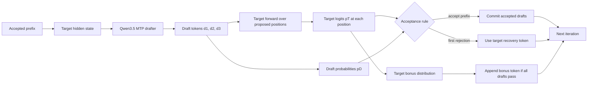
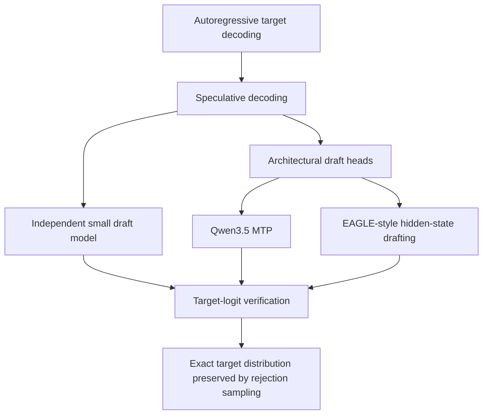

# Qwen3.5 MTP: Drafting and Target-Model Verification

**Repositories:** [vllm-project/vllm-ascend](https://github.com/vllm-project/vllm-ascend) @ `9a52ca5fc36c1852241822863c50717bee5dc761`; [vllm-project/vllm](https://github.com/vllm-project/vllm) @ `a0c092ee72c0dcefbb3b3e74f97ac62d842e5f4b`

**Example configuration:** Qwen3.5/Qwen3.6 family with `qwen3_5_mtp` and `num_speculative_tokens: 3` on vllm-ascend.

**Related pages:** [Qwen3.5 / Qwen3.6 Inference Path](./qwen3.5-qwen3.6-inference.md), [vLLM-Ascend Hub](./index.md), [vLLM Architecture Overview](../vllm/vllm-overview.md), [vLLM Kimi K3 Code Reading Map](../vllm/vllm-kimi-k3-code-reading.md)

## TL;DR

**What:** Multi-token prediction (MTP) adds a small drafter that proposes several future tokens from the target model's hidden state, so one target-model step can verify a run of tokens.

**How:** Qwen3.5 combines the current token embedding with the target hidden state, runs one MTP layer for each speculative step, and sends the proposed token IDs back through the target model's ordinary causal forward pass.

**The number:** With three speculative tokens, the target model supplies three verification distributions plus one bonus-token distribution; vLLM accepts the prefix of proposals that passes the sampler's rule and discards everything after the first rejection.

## The Big Picture

[Editable runtime diagram](./assets/qwen3.5-mtp-runtime.mmd)



*Synthesized runtime flow from the pinned vLLM and vllm-ascend code. ① The target model creates the hidden state used by the drafter. ② Qwen3.5 MTP proposes a short continuation. ③ The target model evaluates the proposed positions in one causal pass. ④ The sampler accepts a contiguous prefix, recovers the first rejected position when needed, and optionally appends a target-only bonus token.*

## Why This Exists

Autoregressive decoding normally pays for one target-model forward pass to produce one token. Suppose the accepted context is `The capital of France is` and the next likely continuation is `Paris . It`. A Qwen3.5 MTP drafter may propose all three tokens. The target model then evaluates the positions in one pass:

| Target position | Target distribution asks | Draft proposal |
|---|---|---|
| 1 | $p_T(\cdot \mid \text{The capital of France is})$ | `Paris` |
| 2 | $p_T(\cdot \mid \text{... is Paris})$ | `.` |
| 3 | $p_T(\cdot \mid \text{... Paris .})$ | `It` |
| bonus | $p_T(\cdot \mid \text{... Paris . It})$ | none |

If the target agrees with all three, one target pass commits three tokens and supplies the next target-only token. If position 2 fails, the sampler commits `Paris`, replaces position 2 with a target-derived token, and does not trust position 3 because its prefix contains the rejected token.

## The Landscape

[Editable landscape diagram](./assets/qwen3.5-mtp-landscape.mmd)



The important contrast is between **drafting** and **verification**. A separate draft model and Qwen3.5 MTP differ in where proposals come from, but both still require the target model to evaluate the proposed positions. MTP is not a weaker target model and it does not certify itself: it is an inexpensive proposer attached to the target model's hidden-state stream.

## The Core Idea

Qwen3.5 MTP turns one target hidden state into a short speculative continuation. The target model remains the authority: it runs its normal causal computation over the proposed positions, turns those hidden states into logits, and lets the sampler decide which draft tokens are legal to commit. The target does not verify by comparing hidden-state tensors; it verifies by the probability or argmax that the target assigns to each proposed token.

## Symbol Map

Here `T` means the target model, `D` means the drafter, and position `i` means the `i`-th proposed token in the current speculative batch. `d_i` is a token ID, while $p_T(d_i)$ and $p_D(d_i)$ are probabilities assigned to that same token at the same causal position.

| Symbol | Human name | Scope | Plain meaning |
|---|---|---|---|
| $d_i$ | draft token | one speculative position | Token proposed by Qwen3.5 MTP. |
| $p_T(d_i)$ | target probability | one speculative position | Probability the target model assigns to $d_i$. |
| $p_D(d_i)$ | draft probability | one speculative position | Probability the drafter assigns to $d_i$. |
| $u_i$ | acceptance random value | one speculative position | Uniform random value used for non-greedy rejection sampling. |
| `target_logits_indices` | target-row selector | flattened batch | Rows containing target logits for draft positions. |
| `bonus_logits_indices` | bonus-row selector | one row per request | Rows used to sample the target-only token after all drafts pass. |
| `num_accepted_tokens` | accepted-token count | one request | Number of contiguous draft outputs that survived verification. |

## Deep Dive

### 1. Enabling Qwen3.5 MTP

**What it does:** vllm-ascend rewrites the ordinary Qwen3.5 model type to the MTP architecture when speculative decoding is enabled.

**Why it matters:** The rewrite selects a drafter class without replacing the target model's ordinary Qwen3.5 serving path.

**How it works:** <a class="code-link" href="../../../external-repos/vllm-ascend-9a52ca5fc36c/vllm_ascend/patch/platform/patch_speculative_config.py#L106" data-code-repo="vllm-ascend-9a52ca5fc36c" data-code-path="vllm_ascend/patch/platform/patch_speculative_config.py" data-code-line="106" data-code-end-line="114"><code>patch_speculative_config.py</code></a> detects `qwen3_5` or `qwen3_5_moe`, changes the model type to `qwen3_5_mtp`, reads `mtp_num_hidden_layers` into `n_predict`, and selects `Qwen3_5MTP` or `Qwen3_5MoeMTP`. The Qwen3.6 family reaches this same path because it reuses the Qwen3.5 model type.

**The intuition:** The config switch adds a prediction head path; it does not make the drafter the source of truth.

**A concrete example:** A Qwen3.5-35B-A3B configuration can request `qwen3_5_mtp` with three speculative tokens while retaining the normal Qwen3.5 target model and Ascend attention patches.

**Remember:** MTP is selected at model construction, but acceptance happens later in the target-side sampler.

### 2. How the Qwen3.5 drafter proposes tokens

**What it does:** The MTP module turns the target hidden state and the current token embedding into a new hidden state, then produces draft logits.

**Why it matters:** The drafter is cheap because it reuses information already computed by the target model instead of recomputing the entire target stack for every proposal.

**How it works:** Upstream <a class="code-link" href="../../../external-repos/vllm/vllm/model_executor/models/qwen3_5_mtp.py#L64" data-code-repo="vllm-a0c092ee72c0" data-code-path="vllm/model_executor/models/qwen3_5_mtp.py" data-code-line="64" data-code-end-line="189"><code>Qwen3_5MultiTokenPredictor</code></a> owns the MTP embedding, concatenation projection, MTP decoder layers, and final norm. Its `forward` selects `self.layers[spec_step_idx % self.num_mtp_layers]`, so each speculative step chooses the corresponding MTP layer and wraps around if the configured number of steps is larger. <a class="code-link" href="../../../external-repos/vllm-ascend-9a52ca5fc36c/vllm_ascend/patch/worker/patch_qwen3_5.py#L165" data-code-repo="vllm-ascend-9a52ca5fc36c" data-code-path="vllm_ascend/patch/worker/patch_qwen3_5.py" data-code-line="165" data-code-end-line="212"><code>qwen3_5_mtp_forward</code></a> is the Ascend backport: it normalizes the token embedding and target hidden state, concatenates them, applies `fc`, runs one MTP layer, and returns the final hidden state from the last pipeline stage. <a class="code-link" href="../../../external-repos/vllm/vllm/model_executor/models/qwen3_5_mtp.py#L212" data-code-repo="vllm-a0c092ee72c0" data-code-path="vllm/model_executor/models/qwen3_5_mtp.py" data-code-line="212" data-code-end-line="299"><code>Qwen3_5MTP</code> adds the LM head and `compute_logits`, which turns that hidden state into draft-token logits.

**The intuition:** MTP is a small continuation engine fed by the target's current understanding of the prefix.

**A concrete example:** For `Paris`, `.`, and `It`, the drafter repeatedly receives the current token embedding plus the target hidden state and emits the next proposal; it does not run every target decoder layer again.

**Remember:** MTP proposes token IDs; it does not get permission to commit them.

### 3. How the target model creates verification evidence

**What it does:** The target model evaluates the draft positions and exposes one logits row per draft position plus a bonus row.

**Why it matters:** Causal alignment is what makes verification meaningful: the row for position `i` must represent the target distribution for the same token proposed at position `i`.

**How it works:** vLLM records this contract in <a class="code-link" href="../../../external-repos/vllm/vllm/v1/spec_decode/metadata.py#L8" data-code-repo="vllm-a0c092ee72c0" data-code-path="vllm/v1/spec_decode/metadata.py" data-code-line="8" data-code-end-line="31"><code>SpecDecodeMetadata</code></a>. `draft_token_ids` is flattened across requests; `target_logits_indices` selects the target logits for those draft positions; and `bonus_logits_indices` selects one final target row per request. The target logits are passed from the model runner into <a class="code-link" href="../../../external-repos/vllm/vllm/v1/worker/gpu_model_runner.py#L3692" data-code-repo="vllm-a0c092ee72c0" data-code-path="vllm/v1/worker/gpu_model_runner.py" data-code-line="3692" data-code-end-line="3719"><code>GPUModelRunner._sample</code></a>, which calls `self.rejection_sampler(...)` when speculative metadata exists.

For three drafts, the target rows conceptually correspond to:

```text
row 0: p_T(. | accepted prefix)
row 1: p_T(. | accepted prefix, d1)
row 2: p_T(. | accepted prefix, d1, d2)
row 3: p_T(. | accepted prefix, d1, d2, d3)  # bonus row
```

**The intuition:** The target model judges every proposed position in parallel, but the positions remain causally ordered.

**A concrete example:** If the target assigns `Paris` the highest probability at row 0 and `.` the highest probability at row 1, those two drafts can pass even if row 2 disagrees with `It`.

**Remember:** Verification evidence is target logits aligned to draft positions, not a hidden-state equality test.

### 4. How a draft token is accepted or rejected

**What it does:** The rejection sampler converts target logits and draft tokens into the final output sequence.

**Why it matters:** The sampler preserves the target distribution while allowing a matching drafter to batch several output tokens into one target pass.

**How it works:** <a class="code-link" href="../../../external-repos/vllm/vllm/v1/sample/rejection_sampler.py#L38" data-code-repo="vllm-a0c092ee72c0" data-code-path="vllm/v1/sample/rejection_sampler.py" data-code-line="38" data-code-end-line="181"><code>RejectionSampler.forward</code></a> extracts target and bonus rows, applies the request's sampling constraints, and calls <a class="code-link" href="../../../external-repos/vllm/vllm/v1/sample/rejection_sampler.py#L394" data-code-repo="vllm-a0c092ee72c0" data-code-path="vllm/v1/sample/rejection_sampler.py" data-code-line="394" data-code-end-line="501"><code>rejection_sample</code></a>.

For greedy decoding, <a class="code-link" href="../../../external-repos/vllm/vllm/v1/sample/rejection_sampler.py#L715" data-code-repo="vllm-a0c092ee72c0" data-code-path="vllm/v1/sample/rejection_sampler.py" data-code-line="715" data-code-end-line="769"><code>rejection_greedy_sample_kernel</code></a> computes the target argmax at each row and accepts while `draft_token_id == target_argmax_id`. At the first mismatch it emits the target argmax for that position and marks later draft positions invalid.

For non-greedy decoding, <a class="code-link" href="../../../external-repos/vllm/vllm/v1/sample/rejection_sampler.py#L774" data-code-repo="vllm-a0c092ee72c0" data-code-path="vllm/v1/sample/rejection_sampler.py" data-code-line="774" data-code-end-line="845"><code>rejection_random_sample_kernel</code></a> accepts a draft token when:

$$u_i < \frac{p_T(d_i)}{p_D(d_i)}$$

If the draft probability is unavailable, vLLM uses the target probability path's special handling; if the proposal is rejected, it samples a recovery token from the adjusted target-minus-draft distribution. The sampler always stops checking after the first rejection, then appends the bonus token only when every draft passed.

**The intuition:** Greedy verification is equality; stochastic verification is a probability-ratio test that keeps the target distribution correct.

**A concrete example:** If $p_D(.) = 0.80$, $p_T(.) = 0.72$, and $u = 0.7$, the ratio is $0.9$, so the draft passes. If $u = 0.95$, it fails and the target-derived recovery token replaces it.

**Remember:** The target verifies the probability assigned to the proposed token, not whether the drafter's hidden vector resembles the target's.

### 5. What happens to rejected state

**What it does:** vLLM keeps only the state corresponding to the accepted prefix before the next speculative iteration.

**Why it matters:** Qwen3.5 is a hybrid model with recurrent linear-attention state. Keeping state for rejected draft tokens would make the next target or draft step condition on tokens that were never committed.

**How it works:** In the GPU model runner, `_update_states_after_model_execute` counts valid output tokens as `num_accepted_tokens` and passes that count into hybrid attention metadata and state post-processing. The next input preparation uses the accepted count to reconcile optimistic sequence lengths and recurrent state. This is the state-management counterpart to the sampler's placeholder `-1` values for rejected outputs.

**The intuition:** Verification is not complete until both token IDs and model state agree on the same accepted prefix.

**A concrete example:** If `[Paris, ., It]` becomes `[Paris, target_recovery]`, the next iteration shifts the state as if only the committed sequence existed; it does not retain the speculative `It` state.

**Remember:** Accepted-token counting is the bridge from sampler output back to hybrid KV/recurrent state.

## Putting It Together

For Qwen3.5 with three speculative tokens, one iteration looks like this:

1. The scheduler supplies the accepted context and reserves room for up to three lookahead tokens.
2. The target Qwen3.5 forward produces hidden states for the current context; on Ascend, its hybrid GDN/FIA path is the same target substrate described in the [family inference page](./qwen3.5-qwen3.6-inference.md).
3. `Qwen3_5MultiTokenPredictor` normalizes the target hidden state, concatenates it with the current token embedding, and runs the MTP layer for `spec_step_idx = 0`; the resulting logits propose `d1`.
4. The next MTP steps propose `d2` and `d3`. The proposals are flattened into `draft_token_ids`, with draft probabilities retained when the sampling mode needs them.
5. The target model evaluates the proposed positions in a single causal batch. `SpecDecodeMetadata` maps the target rows to `d1`, `d2`, `d3`, and the bonus row.
6. `RejectionSampler` applies greedy equality or the probability-ratio rule from left to right. It commits the accepted prefix, replaces the first rejected token with a target-derived token when necessary, and filters later proposals.
7. If all drafts pass, the target-only bonus token is appended. The accepted-token count then updates the next iteration's KV and recurrent-state handling.

## What This Buys You

### The headline claim

MTP reduces the number of target-model iterations needed for a run of tokens when its proposals have high acceptance probability.

### How we know: code-path evidence

| Question | Evidence in this revision |
|---|---|
| Where are proposals made? | Qwen3.5 MTP embedding + MTP layers + LM head. |
| Where is the target authority? | `GPUModelRunner._sample` passes target logits to `RejectionSampler`. |
| What is compared? | Target argmax in greedy mode; target/draft probability ratio in random mode. |
| What is committed? | A contiguous accepted prefix, a recovery token at first rejection, and an optional target bonus token. |

### The mechanism behind the numbers

The useful quantity is not simply "three draft tokens requested." It is the expected number of committed tokens per target pass. If the drafter often disagrees at position 1, MTP still pays proposal overhead but gains little. If it usually passes all three, one target pass can advance the sequence by four output positions including the bonus token.

### How to read these numbers

The `num_speculative_tokens: 3` setting is a maximum lookahead, not a guarantee that three tokens are accepted. Acceptance depends on the target distribution, sampling parameters, draft quality, and the first-rejection rule.

## Where It Breaks

| Failure mode | When it happens | Impact |
|---|---|---|
| Early target disagreement | The first draft token fails target argmax or the probability-ratio test. | Later proposals are discarded because their causal prefix is no longer valid. |
| Weak draft quality | The MTP head frequently diverges from target logits. | Extra drafting work produces little iteration reduction. |
| Wrong row alignment | `target_logits_indices` does not match flattened draft positions. | A token is verified against the wrong conditional distribution. |
| Recurrent-state mismatch | Accepted counts are not applied to hybrid state updates. | The next step can condition on rejected tokens and become incorrect. |
| Unsupported cache mode | Qwen3.5 MTP rejects `mamba-cache-mode=all` in its constructor. | The Qwen3.5 MTP path must use the supported cache mode instead. |
| Sampling-policy mismatch | Draft and target probabilities are unavailable or processed under incompatible constraints. | Stochastic acceptance cannot preserve the intended target distribution. |
| Hardware/version drift | The inspected Ascend patch is paired with upstream vLLM internals at pinned revisions. | Symbol names, patch points, or custom-kernel support may change upstream. |

## One Thing to Remember

**MTP is a fast guesser, not a second authority.** Qwen3.5 uses target hidden states to make several guesses, but the target model's aligned logits decide which guesses survive; greedy mode checks target argmax equality, sampling mode checks a target-to-draft probability ratio, and the runtime commits only the contiguous accepted prefix.

## Go Deeper

- **Read:** [vLLM speculative rejection sampler](../../../external-repos/vllm/vllm/v1/sample/rejection_sampler.py) in the pinned checkout; [Qwen3.5 MTP implementation](../../../external-repos/vllm/vllm/model_executor/models/qwen3_5_mtp.py); [Ascend Qwen3.5 MTP patch](../../../external-repos/vllm-ascend-9a52ca5fc36c/vllm_ascend/patch/worker/patch_qwen3_5.py).
- **Understand the target model:** [Qwen3.5 / Qwen3.6 Inference Path](./qwen3.5-qwen3.6-inference.md).
- **Understand the runtime shell:** [vLLM Architecture and Code Organization Overview](../vllm/vllm-overview.md).
- **Reproduce:** The page is based on static reading of clean pinned checkouts; no Ascend NPU execution was available in this environment.
