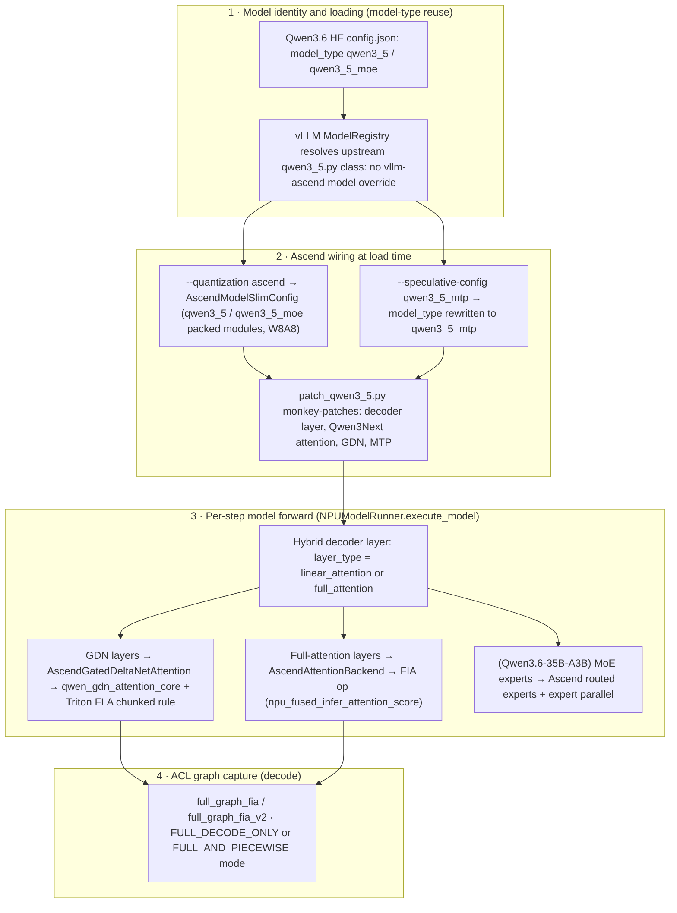

# Qwen3.5 / Qwen3.6 Inference Path on vLLM Ascend

**Repository:** [vllm-project/vllm-ascend](https://github.com/vllm-project/vllm-ascend) @ `9a52ca5fc36c1852241822863c50717bee5dc761` (main, clean, inspected 2026-08-06)

**Related pages:** [vLLM Ascend Hub](./index.md), [vLLM-Ascend Architecture](./architecture.md), [vLLM-Ascend Kimi K3 MoE Forward](./kimi-k3-moe-forward.md), [DeepSeek-V4 Inference on Ascend](./deepseek-v4-inference.md), [vLLM Architecture and Code Organization Overview](../vllm/vllm-overview.md)

## TL;DR

**What:** Qwen3.5 and Qwen3.6 share one model architecture and run on Ascend NPUs by **reusing the same Qwen3.5 family model types** (`qwen3_5` / `qwen3_5_moe`); vllm-ascend ships **zero Qwen3.5/Qwen3.6-specific model code** — a sharp contrast with DeepSeek-V4 and MiniMax-M3, which get dedicated vllm-ascend model overrides.

**How:** upstream vLLM's qwen3_5 model classes execute through vllm-ascend's hybrid-attention path: a patched decoder layer routes GDN (Gated DeltaNet) linear-attention layers to the Ascend GDN custom op and full-attention layers to the FIA op, with ModelSlim W8A8 quantization and `qwen3_5_mtp` 3-token MTP speculation on top.

**The number:** the Qwen3.6-35B-A3B weekly configuration drives a ~1,010,000-token context window (`max-model-len 1010000`) with `num_speculative_tokens: 3` on 2× Atlas A3 — and Qwen3.5-397B-A17B ships the same `qwen3_5_mtp` path at 1,010,000-token context — long-context hybrid MoE serving built entirely on the shared Qwen3.5 code path.

## Revision Note

This page is backed by a new immutable revision created with an explicit `--force-new-revision` override of the 14-day revision interval (the previous snapshot was inspected 2026-08-03, normally eligible 2026-08-17). The override is justified as an explicitly requested, release-specific inspection: the Qwen3.6-35B-A3B weekly test configs and the Qwen3.6 support-matrix/docs updates land only on this upstream tip, while the previously pinned revision already contained the Qwen3.6-27B FIA test and Qwen3.6 docs. The model substrate was cross-checked against the pinned vLLM checkout `a0c092ee72c0dcefbb3b3e74f97ac62d842e5f4b`.

## The Qwen3.5/Qwen3.6 Family and Why There Is No Model File

vllm-ascend's model registry overrides live in <a class="code-link" href="../../../external-repos/vllm-ascend-9a52ca5fc36c/vllm_ascend/models/__init__.py#L1" data-code-repo="vllm-ascend-9a52ca5fc36c" data-code-path="vllm_ascend/models/__init__.py" data-code-line="1"><code>vllm_ascend/models/__init__.py</code></a> and cover DeepSeek-V4, MiniMax-M3, DSpark, and Qwen3-DSpark — **not Qwen3.5/Qwen3.6**. Both generations are served purely through upstream vLLM model classes keyed by the HF model type in the checkpoint's config.json. Because Qwen3.6 keeps the Qwen3.5 architecture, the entire Qwen3.5 inference path applies to Qwen3.6 unchanged — this page inspects that shared path:

| Model | Kind | HF model type (reused) | Upstream vLLM class (registry) | First vllm-ascend release |
|---|---|---|---|---|
| Qwen3.5-27B | dense hybrid Mamba-Transformer (GDN + full attention) | `qwen3_5` | `Qwen3_5ForCausalLM` | v0.17.0rc1 |
| Qwen3.6-27B | dense hybrid Mamba-Transformer, **multimodal** (GDN + full attention + vision encoder) | `qwen3_5` | `Qwen3_5ForConditionalGeneration` / `Qwen3_5ForCausalLM` | v0.18.0rc1 |
| Qwen3.5-35B-A3B | sparse MoE (~3B activated), hybrid attention | `qwen3_5_moe` | `Qwen3_5MoeForCausalLM` / `Qwen3_5MoeForConditionalGeneration` | 300I DUO matrix |
| Qwen3.6-35B-A3B | sparse MoE (~3B activated), hybrid attention | `qwen3_5_moe` | `Qwen3_5MoeForCausalLM` / `Qwen3_5MoeForConditionalGeneration` | v0.18.0rc1 |
| Qwen3.5-397B-A17B | large sparse MoE, **multimodal**, long context | `qwen3_5_moe` | `Qwen3_5MoeForConditionalGeneration` | v0.17.0rc1 |

The vLLM-side mapping is in <a class="code-link" href="../../../external-repos/vllm/vllm/model_executor/models/registry.py#L198" data-code-repo="vllm-a0c092ee72c0" data-code-path="vllm/model_executor/models/registry.py" data-code-line="198" data-code-end-line="199"><code>registry.py</code></a> (`Qwen3_5ForCausalLM`, `Qwen3_5MoeForCausalLM` → module `qwen3_5`), and the concrete classes live in <a class="code-link" href="../../../external-repos/vllm/vllm/model_executor/models/qwen3_5.py#L418" data-code-repo="vllm-a0c092ee72c0" data-code-path="vllm/model_executor/models/qwen3_5.py" data-code-line="418"><code>qwen3_5.py</code></a> (`Qwen3_5ForCausalLM`), <a class="code-link" href="../../../external-repos/vllm/vllm/model_executor/models/qwen3_5.py#L422" data-code-repo="vllm-a0c092ee72c0" data-code-path="vllm/model_executor/models/qwen3_5.py" data-code-line="422"><code>qwen3_5.py</code></a> (`Qwen3_5MoeForCausalLM`), and <a class="code-link" href="../../../external-repos/vllm/vllm/model_executor/models/qwen3_5.py#L440" data-code-repo="vllm-a0c092ee72c0" data-code-path="vllm/model_executor/models/qwen3_5.py" data-code-line="440"><code>qwen3_5.py</code></a> (`Qwen3_5ForConditionalGeneration`, the multimodal variant used by Qwen3.5-397B-A17B and Qwen3.6-27B). vllm-ascend instead enables the Qwen3.5/Qwen3.6 path with three mechanisms on top of those upstream classes: monkey-patches, quantization config, and a speculative-config rewrite.

The strongest evidence that vllm-ascend keys off the `qwen3_5` family rather than a Qwen3.6 type is the ModelSlim packed-module map in <a class="code-link" href="../../../external-repos/vllm-ascend-9a52ca5fc36c/vllm_ascend/quantization/modelslim_config.py#L69" data-code-repo="vllm-ascend-9a52ca5fc36c" data-code-path="vllm_ascend/quantization/modelslim_config.py" data-code-line="69" data-code-end-line="100"><code>modelslim_config.py</code></a> (`packed_modules_model_mapping` with `qwen3_5` and `qwen3_5_moe` entries that fuse `in_proj_qkvz`, `in_proj_ba`, `qkv_proj`, `gate_up_proj`, and `experts`), and the speculative rewrite in <a class="code-link" href="../../../external-repos/vllm-ascend-9a52ca5fc36c/vllm_ascend/patch/platform/patch_speculative_config.py#L106" data-code-repo="vllm-ascend-9a52ca5fc36c" data-code-path="vllm_ascend/patch/platform/patch_speculative_config.py" data-code-line="106" data-code-end-line="114"><code>patch_speculative_config.py</code></a> that turns `qwen3_5` / `qwen3_5_moe` into the `qwen3_5_mtp` variant. A repository-wide grep for `qwen3.6` under `vllm_ascend/` returns nothing — the Qwen3.6 name never appears in Ascend-side code.

## How a Qwen3.5/Qwen3.6 Request Flows Through vllm-ascend

The path below is the end-to-end runtime flow; the same diagram is saved as an editable Mermaid file at [qwen3.5-qwen3.6-inference-path.mmd](./assets/qwen3.5-qwen3.6-inference-path.mmd):

Then each stage in detail:

1. **Model identity and loading.** The checkpoint's config.json carries a `qwen3_5` / `qwen3_5_moe` model type, so vLLM's ModelRegistry instantiates the upstream qwen3_5 class with no vllm-ascend override (stage 1 above). Quantization wiring happens at load: `--quantization ascend` routes to `AscendModelSlimConfig`, whose packed-module map (evidence: `model-type-reuse`) and per-layer method dispatch in <a class="code-link" href="../../../external-repos/vllm-ascend-9a52ca5fc36c/vllm_ascend/quantization/modelslim_config.py#L665" data-code-repo="vllm-ascend-9a52ca5fc36c" data-code-path="vllm_ascend/quantization/modelslim_config.py" data-code-line="665" data-code-end-line="735"><code>modelslim_config.py</code></a> `get_quant_method` (evidence: `quant-config`) shape weight loading and quant methods.
2. **Speculative rewrite (optional).** Launching with `--speculative-config '{"method":"qwen3_5_mtp","num_speculative_tokens":3}'` makes vllm-ascend rewrite the HF config's model type to `qwen3_5_mtp` and set the `Qwen3_5MTP` / `Qwen3_5MoeMTP` architecture (evidence: `spec-rewrite`), selecting the MTP drafter classes.
3. **Patch application.** At process start, <a class="code-link" href="../../../external-repos/vllm-ascend-9a52ca5fc36c/vllm_ascend/patch/worker/patch_qwen3_5.py#L215" data-code-repo="vllm-ascend-9a52ca5fc36c" data-code-path="vllm_ascend/patch/worker/patch_qwen3_5.py" data-code-line="215" data-code-end-line="228"><code>patch_qwen3_5.py</code></a> swaps in the Ascend implementations: `Qwen3NextAttention.forward`, the GDN `_split_ba_for_tp` / `get_state_shape` / `get_attn_backend` / `forward` / `_forward_core`, and the MTP forward (evidence: `gdn-patch`, `mtp-forward`).
4. **Hybrid decoder forward.** The patched <a class="code-link" href="../../../external-repos/vllm-ascend-9a52ca5fc36c/vllm_ascend/patch/worker/patch_qwen3_5.py#L117" data-code-repo="vllm-ascend-9a52ca5fc36c" data-code-path="vllm_ascend/patch/worker/patch_qwen3_5.py" data-code-line="117" data-code-end-line="160"><code>patch_qwen3_5.py</code></a> `AscendQwen3_5DecoderLayer.forward` dispatches each layer by `layer_type`: `linear_attention` layers go to the Ascend GDN attention module, `full_attention` layers go to the Ascend attention layer (evidence: `decoder-patch`); the fused qkv+rmsnorm+mrope projection for `qwen3_5` is handled by <a class="code-link" href="../../../external-repos/vllm-ascend-9a52ca5fc36c/vllm_ascend/patch/worker/patch_qwen3_5.py#L65" data-code-repo="vllm-ascend-9a52ca5fc36c" data-code-path="vllm_ascend/patch/worker/patch_qwen3_5.py" data-code-line="65" data-code-end-line="114"><code>patch_qwen3_5.py</code></a> `AscendQwen3NextAttention.forward` (evidence: `attn-patch`).
5. **GDN [linear attention](../../terms/linear-attention.md).** `AscendGatedDeltaNetAttention.forward` in <a class="code-link" href="../../../external-repos/vllm-ascend-9a52ca5fc36c/vllm_ascend/ops/gdn.py#L67" data-code-repo="vllm-ascend-9a52ca5fc36c" data-code-path="vllm_ascend/ops/gdn.py" data-code-line="67" data-code-end-line="148"><code>gdn.py</code></a> runs the input projections (`in_proj_qkv` / `in_proj_ba` / `in_proj_z`, or the fused `in_proj_qkvz`), calls the custom `torch.ops.vllm.qwen_gdn_attention_core` op, normalizes, and applies the output projection; `_forward_core` in <a class="code-link" href="../../../external-repos/vllm-ascend-9a52ca5fc36c/vllm_ascend/ops/gdn.py#L149" data-code-repo="vllm-ascend-9a52ca5fc36c" data-code-path="vllm_ascend/ops/gdn.py" data-code-line="149" data-code-end-line="457"><code>gdn.py</code></a> drives the Triton FLA chunked-delta-rule kernels (evidence: `gdn-forward`, `gdn-core`).
6. **Full attention (FIA).** `NPUPlatform.get_attn_backend_cls` in <a class="code-link" href="../../../external-repos/vllm-ascend-9a52ca5fc36c/vllm_ascend/platform.py#L216" data-code-repo="vllm-ascend-9a52ca5fc36c" data-code-path="vllm_ascend/platform.py" data-code-line="216" data-code-end-line="244"><code>platform.py</code></a> selects <a class="code-link" href="../../../external-repos/vllm-ascend-9a52ca5fc36c/vllm_ascend/attention/attention_v1.py#L72" data-code-repo="vllm-ascend-9a52ca5fc36c" data-code-path="vllm_ascend/attention/attention_v1.py" data-code-line="72" data-code-end-line="136"><code>attention_v1.py</code></a> `AscendAttentionBackend` (the FIA path) for full-attention layers; `AscendAttentionBackendImpl.forward` dispatches to <a class="code-link" href="../../../external-repos/vllm-ascend-9a52ca5fc36c/vllm_ascend/attention/attention_v1.py#L1268" data-code-repo="vllm-ascend-9a52ca5fc36c" data-code-path="vllm_ascend/attention/attention_v1.py" data-code-line="1268" data-code-end-line="1400"><code>attention_v1.py</code></a> `forward_fused_infer_attention`, which calls the `npu_fused_infer_attention_score` FIA op (evidence: `backend-select`, `fia-backend`, `fia-forward`, `fia-op`).
7. **[MoE](../../terms/mixture-of-experts.md) experts (35B-A3B only).** The sparse-MoE variant routes tokens through Ascend routed experts (FusedMoE) under `--enable-expert-parallel`, enabled by the `qwen3_5_moe` packed-module layout.
8. **Step execution and graph capture.** `NPUModelRunner.execute_model` in <a class="code-link" href="../../../external-repos/vllm-ascend-9a52ca5fc36c/vllm_ascend/worker/model_runner_v1.py#L1756" data-code-repo="vllm-ascend-9a52ca5fc36c" data-code-path="vllm_ascend/worker/model_runner_v1.py" data-code-line="1756" data-code-end-line="2181"><code>model_runner_v1.py</code></a> runs the model and sampler; <a class="code-link" href="../../../external-repos/vllm-ascend-9a52ca5fc36c/vllm_ascend/worker/model_runner_v1.py#L3517" data-code-repo="vllm-ascend-9a52ca5fc36c" data-code-path="vllm_ascend/worker/model_runner_v1.py" data-code-line="3517"><code>model_runner_v1.py</code></a> `NPUModelRunner.load_model` builds the runner and model, and <a class="code-link" href="../../../external-repos/vllm-ascend-9a52ca5fc36c/vllm_ascend/worker/model_runner_v1.py#L4845" data-code-repo="vllm-ascend-9a52ca5fc36c" data-code-path="vllm_ascend/worker/model_runner_v1.py" data-code-line="4845"><code>model_runner_v1.py</code></a> `NPUModelRunner.capture_model` captures ACL graphs (evidence: `runner-exec`, `runner-load`, `runner-capture`). During capture, FIA layers use <a class="code-link" href="../../../external-repos/vllm-ascend-9a52ca5fc36c/vllm_ascend/attention/attention_v1.py#L845" data-code-repo="vllm-ascend-9a52ca5fc36c" data-code-path="vllm_ascend/attention/attention_v1.py" data-code-line="845" data-code-end-line="1015"><code>attention_v1.py</code></a> `full_graph_fia` (or `full_graph_fia_v2` with sinks) to bake the FIA op into the graph with workspace caching (evidence: `fia-graph`).

## Deep Dive: The GDN + FIA Hybrid Attention

Qwen3.6 inherits the Qwen3.5 hybrid design: a stack of alternating linear-attention (GDN) and full-attention layers, wrapped in the same `Qwen3_5DecoderLayer` shell. The two attention families use completely different Ascend machinery. Importantly, the full-attention layers are **standard grouped-query attention (the "GQA path")**: `use_mla` is `False` (it is set only for DeepSeek-MLA architectures) and `use_sparse` is `False` (it is set only for `index_topk` SFA-style models), so `get_attn_backend_cls` selects `AscendAttentionBackend` — not MLA, SFA, or DSA, which are the DeepSeek-family backends:

| Layer type | Ascend implementation | Compute engine | Evidence |
|---|---|---|---|
| GDN linear attention | <a class="code-link" href="../../../external-repos/vllm-ascend-9a52ca5fc36c/vllm_ascend/ops/gdn.py#L39" data-code-repo="vllm-ascend-9a52ca5fc36c" data-code-path="vllm_ascend/ops/gdn.py" data-code-line="39"><code>gdn.py</code></a> `AscendGatedDeltaNetAttention` | `torch.ops.vllm.qwen_gdn_attention_core` + Triton FLA `chunk_gated_delta_rule` | `gdn-forward`, `gdn-core` |
| GDN attention backend | <a class="code-link" href="../../../external-repos/vllm-ascend-9a52ca5fc36c/vllm_ascend/ops/gdn_attn_builder.py#L804" data-code-repo="vllm-ascend-9a52ca5fc36c" data-code-path="vllm_ascend/ops/gdn_attn_builder.py" data-code-line="804" data-code-end-line="807"><code>gdn_attn_builder.py</code></a> `AscendGDNAttentionBackend` + <a class="code-link" href="../../../external-repos/vllm-ascend-9a52ca5fc36c/vllm_ascend/ops/gdn_attn_builder.py#L193" data-code-repo="vllm-ascend-9a52ca5fc36c" data-code-path="vllm_ascend/ops/gdn_attn_builder.py" data-code-line="193" data-code-end-line="196"><code>gdn_attn_builder.py</code></a> `AscendGDNAttentionMetadataBuilder` | vLLM V1 attention-backend interface (metadata, spec-decode metadata, reorder) | `gdn-backend`, `gdn-metadata` |
| Full attention | <a class="code-link" href="../../../external-repos/vllm-ascend-9a52ca5fc36c/vllm_ascend/attention/attention_v1.py#L1604" data-code-repo="vllm-ascend-9a52ca5fc36c" data-code-path="vllm_ascend/attention/attention_v1.py" data-code-line="1604" data-code-end-line="1669"><code>attention_v1.py</code></a> `AscendAttentionBackendImpl.forward` | `npu_fused_infer_attention_score` (FIA), paged-attention fast path for DecodeOnly | `fia-forward`, `fia-op` |
| Full attention in graphs | <a class="code-link" href="../../../external-repos/vllm-ascend-9a52ca5fc36c/vllm_ascend/attention/attention_v1.py#L845" data-code-repo="vllm-ascend-9a52ca5fc36c" data-code-path="vllm_ascend/attention/attention_v1.py" data-code-line="845" data-code-end-line="1015"><code>attention_v1.py</code></a> `full_graph_fia` / `full_graph_fia_v2` | FIA op captured via `graph_task_group_begin/end` with workspace caching and weak-ref parameter replay | `fia-graph` |

Two properties stand out for the Qwen3.5/Qwen3.6 family specifically. First, the GDN path keeps per-token recurrent state (the Mamba-style `b`, `a`, and `z` projections plus `get_state_shape`); this is what makes hybrid models need the layer-aware FIA graph replay and the `VLLM_ASCEND_GDN_*` env knobs (see below) rather than a plain transformer graph. Second, the full-attention side on Ascend 950 (A5) splits mixed ChunkedPrefill batches into per-phase FIA calls via `_forward_fia_chunked_prefill_split`, which is the branch the Qwen3.6-27B multimodal FIA test exercises.

## KV-Cache Quantization: C8 on the GQA/FIA Path

KV-cache quantization is a separate concern from the ModelSlim weight schemes above: it quantizes the K/V tensors that the FIA op reads back on every step. On the GQA/FIA path this is **C8 — static per-channel INT8 [KV cache](../../terms/kv-cache.md)** (the QuaRot-style scheme), not FP8.

### Activation and Scale Wiring (Load Time)

The checkpoint's quant description carries `kv_cache_type: "C8"`. In <a class="code-link" href="../../../external-repos/vllm-ascend-9a52ca5fc36c/vllm_ascend/quantization/modelslim_config.py#L1001" data-code-repo="vllm-ascend-9a52ca5fc36c" data-code-path="vllm_ascend/quantization/modelslim_config.py" data-code-line="1001" data-code-end-line="1012"><code>modelslim_config.py</code></a>, `AscendModelSlimConfig` sets `enable_c8_quant = True` and collects every layer whose keys include `k_proj.kv_cache_scale` into `c8_quant_layers` (evidence: `c8-activate`). For those `AttentionLayerBase` layers, `get_quant_method` (<a class="code-link" href="../../../external-repos/vllm-ascend-9a52ca5fc36c/vllm_ascend/quantization/modelslim_config.py#L711" data-code-repo="vllm-ascend-9a52ca5fc36c" data-code-path="vllm_ascend/quantization/modelslim_config.py" data-code-line="711" data-code-end-line="715"><code>modelslim_config.py</code></a> L711-715) returns `AscendKVCacheMethod(AscendC8KVCacheAttentionMethod(...))` (evidence: `c8-method`).

The actual setup happens in `AscendC8KVCacheAttentionMethod.create_weights` (<a class="code-link" href="../../../external-repos/vllm-ascend-9a52ca5fc36c/vllm_ascend/quantization/methods/kv_c8.py#L119" data-code-repo="vllm-ascend-9a52ca5fc36c" data-code-path="vllm_ascend/quantization/methods/kv_c8.py" data-code-line="119" data-code-end-line="146"><code>kv_c8.py</code></a> L119-146, evidence: `c8-scales`):

- sets `layer.kv_cache_torch_dtype = torch.int8`, so the KV cache allocates INT8;
- performs **class surgery**: `layer.impl.__class__ = AscendC8AttentionBackendImpl`, so every C8 attention layer always takes the C8 forward path;
- creates static per-channel `k_cache_scale` / `k_cache_offset` / `v_cache_scale` / `v_cache_offset` parameters, loaded from the checkpoint through `get_cache_scale_mapper` (which maps `.k_proj.kv_cache_scale` → `.attn.k_cache_scale`).

### The C8 Forward Path (Runtime)

`AscendC8AttentionBackendImpl` (<a class="code-link" href="../../../external-repos/vllm-ascend-9a52ca5fc36c/vllm_ascend/attention/attention_v1.py#L1671" data-code-repo="vllm-ascend-9a52ca5fc36c" data-code-path="vllm_ascend/attention/attention_v1.py" data-code-line="1671" data-code-end-line="2115"><code>attention_v1.py</code></a> L1671-2115, evidence: `c8-impl`) subclasses the base FIA impl and inserts quantize/dequant around it. The numbered stages:

1. `forward` (<a class="code-link" href="../../../external-repos/vllm-ascend-9a52ca5fc36c/vllm_ascend/attention/attention_v1.py#L1680" data-code-repo="vllm-ascend-9a52ca5fc36c" data-code-path="vllm_ascend/attention/attention_v1.py" data-code-line="1680" data-code-end-line="1769"><code>attention_v1.py</code></a> L1680-1769, evidence: `c8-forward`) calls `_prepare_c8_scales`, quantizes the incoming K/V, writes them via `_reshape_and_cache`, then dispatches by `attn_state`.
2. `_prepare_c8_scales` (<a class="code-link" href="../../../external-repos/vllm-ascend-9a52ca5fc36c/vllm_ascend/attention/attention_v1.py#L1776" data-code-repo="vllm-ascend-9a52ca5fc36c" data-code-path="vllm_ascend/attention/attention_v1.py" data-code-line="1776" data-code-end-line="1809"><code>attention_v1.py</code></a> L1776-1809, evidence: `c8-scales-prep`) shards the per-channel scales to this TP rank and precomputes the BF16 NZ-BNSD antiquant tensors (`_c8_k_aq_scale_nz_bnsd` / `_c8_v_aq_scale_nz_bnsd`).
3. `_quantize_kv_to_int8` (<a class="code-link" href="../../../external-repos/vllm-ascend-9a52ca5fc36c/vllm_ascend/attention/attention_v1.py#L1859" data-code-repo="vllm-ascend-9a52ca5fc36c" data-code-path="vllm_ascend/attention/attention_v1.py" data-code-line="1859" data-code-end-line="1880"><code>attention_v1.py</code></a> L1859-1880, evidence: `c8-quantize`) computes `clamp(round(k · inv_scale + offset), -128, 127)` for k and v.
4. `_reshape_and_cache` (<a class="code-link" href="../../../external-repos/vllm-ascend-9a52ca5fc36c/vllm_ascend/attention/attention_v1.py#L2080" data-code-repo="vllm-ascend-9a52ca5fc36c" data-code-path="vllm_ascend/attention/attention_v1.py" data-code-line="2080" data-code-end-line="2115"><code>attention_v1.py</code></a> L2080-2115, evidence: `c8-reshape`) writes the INT8 KV into the paged cache in NZ 5D layout via `npu_scatter_pa_kv_cache`.
5. Decode — `_forward_c8_decode` (<a class="code-link" href="../../../external-repos/vllm-ascend-9a52ca5fc36c/vllm_ascend/attention/attention_v1.py#L1882" data-code-repo="vllm-ascend-9a52ca5fc36c" data-code-path="vllm_ascend/attention/attention_v1.py" data-code-line="1882" data-code-end-line="1918"><code>attention_v1.py</code></a> L1882-1918, evidence: `c8-decode`) runs FIA V1 in **BNSD** on native paged INT8 KV with per-channel antiquant (`key_antiquant_scale` / `value_antiquant_scale`, `antiquant_mode=0`, `inner_precise=1`) — zero gather.
6. ChunkedPrefill — `_forward_c8_chunked_prefill` (<a class="code-link" href="../../../external-repos/vllm-ascend-9a52ca5fc36c/vllm_ascend/attention/attention_v1.py#L1920" data-code-repo="vllm-ascend-9a52ca5fc36c" data-code-path="vllm_ascend/attention/attention_v1.py" data-code-line="1920" data-code-end-line="2019"><code>attention_v1.py</code></a> L1920-2019, evidence: `c8-chunked`) runs decode via BNSD paged INT8 and prefill via TND — float KV when all-new, else gather + dequant.
7. Prefill states — `_forward_c8_fused_infer_attention` (<a class="code-link" href="../../../external-repos/vllm-ascend-9a52ca5fc36c/vllm_ascend/attention/attention_v1.py#L2021" data-code-repo="vllm-ascend-9a52ca5fc36c" data-code-path="vllm_ascend/attention/attention_v1.py" data-code-line="2021" data-code-end-line="2078"><code>attention_v1.py</code></a> L2021-2078, evidence: `c8-prefill`) uses float KV for `PrefillNoCache` and gather+dequant (`_dequant_paged_kv_to_dense`) for `PrefillCacheHit`.
8. Graph capture — reuses `full_graph_fia`, which appends the C8 antiquant `extra_args` and switches to the BNSD layout inside the ACL graph (evidence: `fia-graph`).

### The A5 FP8 Boundary

GQA/FIA KV-cache quantization is **INT8-only on every device, including A5** — attention_v1.py contains no `fp8` / `float8` / `e4m3` reference. The FP8 (`float8_e4m3fn`) KV cache that exists on A5 is scoped exclusively to the DeepSeek-V4 family paths:

| FP8 KV site | Scope |
|---|---|
| <a class="code-link" href="../../../external-repos/vllm-ascend-9a52ca5fc36c/vllm_ascend/worker/model_runner_v1.py#L382" data-code-repo="vllm-ascend-9a52ca5fc36c" data-code-path="vllm_ascend/worker/model_runner_v1.py" data-code-line="382" data-code-end-line="386"><code>model_runner_v1.py</code></a> `c8_k_cache_dtype = float8_e4m3fn` on A5 (int8 elsewhere) | only inside `enable_sparse_sfa_c8 or enable_sparse_li_c8` — never for GQA (evidence: `fp8-runner`) |
| <a class="code-link" href="../../../external-repos/vllm-ascend-9a52ca5fc36c/vllm_ascend/attention/sfa_v1.py#L618" data-code-repo="vllm-ascend-9a52ca5fc36c" data-code-path="vllm_ascend/attention/sfa_v1.py" data-code-line="618" data-code-end-line="619"><code>sfa_v1.py</code></a> `AscendSFABackend` same A5 FP8 dtype | sparse-attention C8 path (evidence: `fp8-sfa`) |
| <a class="code-link" href="../../../external-repos/vllm-ascend-9a52ca5fc36c/vllm_ascend/models/deepseek_v4.py#L569" data-code-repo="vllm-ascend-9a52ca5fc36c" data-code-path="vllm_ascend/models/deepseek_v4.py" data-code-line="569" data-code-end-line="569"><code>deepseek_v4.py</code></a> A5 FP8 [indexer](../../terms/lightning-indexer.md) KV dtype (`float8_e4m3fn` vs int8) | DeepSeek-V4 indexer keys (evidence: `fp8-dsv4`) |
| <a class="code-link" href="../../../external-repos/vllm-ascend-9a52ca5fc36c/vllm_ascend/models/layer/attention/layer.py#L180" data-code-repo="vllm-ascend-9a52ca5fc36c" data-code-path="vllm_ascend/models/layer/attention/layer.py" data-code-line="180" data-code-end-line="181"><code>layer.py</code></a> DSV4 MLA `get_kv_cache_spec` forces `float8_e4m3fn` on A5 | DeepSeek-V4 compressed MLA cache (evidence: `fp8-layer`) |

The reason is architectural: A5 FP8 e4m3 antiquant is wired into the DeepSeek-V4 compressed-MLA/indexer and SFA sparse paths, while the dense GQA FIA op is served by the INT8 BNSD-antiquant C8 design. FP8 weight/activation quantization (W8A8-FP8) is a separate, orthogonal feature on the GQA attention layers' linear projections — it does not quantize the KV cache.

## Quantization and Speculative Decoding

**Quantization.** Qwen3.5/Qwen3.6 BF16 and W8A8 checkpoints are all supported; the quantized variants run with `--quantization ascend`, which routes to `AscendModelSlimConfig` in <a class="code-link" href="../../../external-repos/vllm-ascend-9a52ca5fc36c/vllm_ascend/quantization/modelslim_config.py#L509" data-code-repo="vllm-ascend-9a52ca5fc36c" data-code-path="vllm_ascend/quantization/modelslim_config.py" data-code-line="509"><code>modelslim_config.py</code></a>. `get_quant_method` (evidence: `quant-config`) assigns per-layer methods — `AscendLinearMethod` for linear layers, `AscendKVCacheMethod` for attention, `AscendFusedMoEMethod` for the 35B-A3B experts — using the `qwen3_5` / `qwen3_5_moe` packed-module mappings so that fused `qkv_proj`, `gate_up_proj`, `in_proj_qkvz`, `in_proj_ba`, and `experts` weights are quantized as one unit. When the checkpoint also quantizes the KV cache (C8), the attention layers additionally take the [KV-cache C8 path](#kv-cache-quantization-c8-on-the-gqafia-path) described above.

**Speculative decoding.** Qwen3.5-27B, Qwen3.6-27B, Qwen3.5-35B-A3B, Qwen3.6-35B-A3B, and Qwen3.5-397B-A17B all use the `qwen3_5_mtp` method with 3 predicted tokens. The rewrite in <a class="code-link" href="../../../external-repos/vllm-ascend-9a52ca5fc36c/vllm_ascend/patch/platform/patch_speculative_config.py#L106" data-code-repo="vllm-ascend-9a52ca5fc36c" data-code-path="vllm_ascend/patch/platform/patch_speculative_config.py" data-code-line="106" data-code-end-line="114"><code>patch_speculative_config.py</code></a> (evidence: `spec-rewrite`) switches the model type to `qwen3_5_mtp` and the architecture to `Qwen3_5MTP` (dense) or `Qwen3_5MoeMTP` (MoE); the Ascend-side MTP forward is the backported <a class="code-link" href="../../../external-repos/vllm-ascend-9a52ca5fc36c/vllm_ascend/patch/worker/patch_qwen3_5.py#L165" data-code-repo="vllm-ascend-9a52ca5fc36c" data-code-path="vllm_ascend/patch/worker/patch_qwen3_5.py" data-code-line="165" data-code-end-line="212"><code>patch_qwen3_5.py</code></a> `qwen3_5_mtp_forward` (evidence: `mtp-forward`), which runs the drafter on the last PP stage by concatenating token embeddings with target hidden states.

## Deployment Configs and Validation

**Qwen3.6-27B (multimodal, FIA).** The e2e test <a class="code-link" href="../../../external-repos/vllm-ascend-9a52ca5fc36c/tests/e2e/pull_request/two_card/test_qwen3_6_27b_fia.py#L28" data-code-repo="vllm-ascend-9a52ca5fc36c" data-code-path="tests/e2e/pull_request/two_card/test_qwen3_6_27b_fia.py" data-code-line="28" data-code-end-line="64"><code>test_qwen3_6_27b_fia.py</code></a> runs `Qwen/Qwen3.6-27B` with image inputs on 2 NPUs, `language_model_only=False`, and `mm_processor_kwargs` (min/max pixels), verifying both eager mode and `FULL_AND_PIECEWISE` ACL-graph mode (evidence: `e2e-fia`). The upstream tutorial page shares Qwen3.5-27B and Qwen3.6-27B because they share the GDN + full-attention design.

**Qwen3.6-35B-A3B (weekly perf/accuracy).** The weekly config <a class="code-link" href="../../../external-repos/vllm-ascend-9a52ca5fc36c/tests/e2e/weekly/single_node/configs/Qwen3.6-35B-A3B-w4a8-A3.yaml#L6" data-code-repo="vllm-ascend-9a52ca5fc36c" data-code-path="tests/e2e/weekly/single_node/configs/Qwen3.6-35B-A3B-w4a8-A3.yaml" data-code-line="6" data-code-end-line="65"><code>Qwen3.6-35B-A3B-w4a8-A3.yaml</code></a> (evidence: `weekly-config`) exercises `Eco-Tech/Qwen3.6-35B-A3B-w8a8` with `--quantization ascend`, `--tensor-parallel-size 2`, `--enable-expert-parallel`, `--speculative-config '{"method":"qwen3_5_mtp","num_speculative_tokens":3}'`, `--compilation-config '{"cudagraph_mode":"FULL_DECODE_ONLY"}'`, and the env knobs `VLLM_ASCEND_ENABLE_FLASHCOMM1`, `VLLM_ASCEND_BALANCE_SCHEDULING`, `VLLM_ASCEND_ENABLE_FUSED_MC2`, `VLLM_ASCEND_GDN_FAST_PATH`, and `VLLM_ASCEND_GDN_MAX_PADDING_RATIO`. A second case reaches `max-model-len 1010000` (≈1M-token context) via `--hf-overrides` YARN rope parameters; a third accuracy config covers W8A8 gsm8k-style validation.

## What Changed Since the Previous Pinned Revision

The previously pinned revision `32a59d4e349c12c32cdbc1916436c16e39939afc` (2026-07-30) **already supported Qwen3.6-27B** — it contained the FIA e2e test, the Qwen3.6 docs, and the `qwen3_5` / `qwen3_5_moe` code path. The new revision adds the Qwen3.6-35B-A3B weekly test configs, the support-matrix rows, and the Qwen3.6-27B Ascend-950 (A5) support documentation. The Qwen3.6-relevant code deltas between the two revisions are small and behavioral-compat oriented: patch_qwen3_5.py dropped the old vLLM-0.25.1 release-version guard (always patching now) and added FlashComm-v1-aware sequence-parallel gathering, and modelslim_config.py retargeted one fused-MoE method import after an ops refactor.

## Limitations and Static/Runtime Boundary

- **Static reading, not execution.** All findings are from code inspection of the pinned revision plus upstream tutorial/test evidence; no Ascend NPU run or runtime validation was performed in this environment.
- **Model-type assumption.** The `qwen3_5` / `qwen3_5_moe` model-type mapping is inferred from vllm-ascend internals (packed-module keys, speculative rewrite, `qwen3_5_mtp` method in the weekly config) and the shared upstream tutorial pages; the HF config.json of the released Qwen3.5/Qwen3.6 checkpoints was not directly read.
- **Pairing boundary.** The upstream vLLM model classes were verified against the pinned vLLM checkout `a0c092ee72c0dcefbb3b3e74f97ac62d842e5f4b`; the vllm-ascend `9a52ca5fc36c` revision pairs with a newer vLLM, so class names and line numbers in that area could drift.
- **vLLM-version sensitivity.** patch_qwen3_5.py is written against current vLLM internals (for example `_all_gather_hidden_and_residual`), which upstream refactors periodically.
