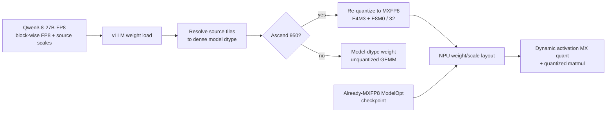

# Qwen3.8-FP8 on Ascend 950: Why Weights Become MXFP8 at Load Time

**Repositories:**

- [vllm-project/vllm-ascend](https://github.com/vllm-project/vllm-ascend) @ `7702ccd7d8dea6b4dabdacb0118adb522dedbec7` (detached, clean, inspected 2026-08-27)
- [vllm-project/vllm](https://github.com/vllm-project/vllm) @ `ca90b9e7d4e3ec670143e4b1822bb856ab0260cc` (detached, clean, inspected 2026-08-27)

This page interprets “Qwen3.8-FP8” as the exact checkpoint named by the
Ascend implementation: `Qwen/Qwen3.8-27B-FP8`.

**Related pages:** [vLLM Ascend Hub](./index.md) · [vLLM](../vllm/index.md) · [FP8](../../terms/fp8.md) · [Microscaling and MX Formats](../../hardware/quantization/microscaling-mx-formats/index.md) · [GEMM](../../terms/gemm.md)

## TL;DR

**What:** The checkpoint is not already in the exact scale layout consumed by Ascend 950: it stores E4M3 FP8 weights plus float32 `weight_scale_inv` values for larger source tiles.

**How:** vLLM first loads those tensors, vllm-ascend reconstructs a dense model-dtype matrix, and Ascend 950 then calls `npu_dynamic_mx_quant` to create E4M3 payloads with E8M0 scales for 32-value groups before repacking the buffers for `npu_quant_matmul`.

**Boundary:** This conversion happens once in the post-load hook; at inference time activations are dynamically MX-quantized too, while non-950 Ascend devices keep the resolved weights in model dtype and use unquantized GEMM.

## The Big Picture

The reader question here is “what representation exists at each moment?” The
table follows one linear weight matrix from checkpoint storage to the runtime
kernel. For a mixture-of-experts layer, the same contract is applied expert by
expert.

| Stage | Input representation | Operation | Persistent result |
|---|---|---|---|
| 1. Configuration | HF `quant_method: "fp8"`, `weight_block_size`, dynamic activations | <a class="code-link" href="../../../external-repos/vllm-ascend-7702ccd7d8de/vllm_ascend/quantization/fp8_config.py#L30" data-code-repo="vllm-ascend-7702ccd7d8de" data-code-path="vllm_ascend/quantization/fp8_config.py" data-code-line="30" data-code-end-line="113"><code>AscendFp8Config</code></a> selects the native block-wise FP8 scheme | Parameters are allocated for FP8 payload plus source scales |
| 2. Checkpoint load | E4M3 `weight` + float32 `weight_scale_inv` | Generic vLLM loads checkpoint tensors into those parameters | Source layout is present on the layer |
| 3. Source-scale resolve | FP8 matrix + one scale per source tile | Broadcast each tile scale, multiply in float32, write model dtype | Temporary dense `[N,K]` matrix |
| 4. Ascend 950 conversion | Dense model-dtype `[N,K]` | <a class="code-link" href="../../../external-repos/vllm-ascend-7702ccd7d8de/vllm_ascend/quantization/methods/fp8_block.py#L100" data-code-repo="vllm-ascend-7702ccd7d8de" data-code-path="vllm_ascend/quantization/methods/fp8_block.py" data-code-line="100" data-code-end-line="106"><code>_mx_quantize()</code></a> calls `npu_dynamic_mx_quant` | E4M3 payload + uint8-stored E8M0 scales |
| 5. Kernel repack | MXFP8 `[N,K]` plus `[N,K/32]` scales | <a class="code-link" href="../../../external-repos/vllm-ascend-7702ccd7d8de/vllm_ascend/quantization/methods/w8a8_mxfp8.py#L122" data-code-repo="vllm-ascend-7702ccd7d8de" data-code-path="vllm_ascend/quantization/methods/w8a8_mxfp8.py" data-code-line="122" data-code-end-line="175"><code>MXFP8 process_weights_after_loading()</code></a> transposes and reshapes for the NPU | Kernel-ready weight and scale buffers |
| 6. Runtime | BF16/FP16 activation and kernel-ready MXFP8 weights | Dynamic activation quantization plus `npu_quant_matmul` | BF16/FP16 output |

The important distinction is that the payload remains an 8-bit E4M3 *family*
member, but its values are re-quantized under a different scale contract. This
is a real dequantize-and-requantize boundary, not a metadata rename.

## Why This Exists

Take one projection matrix $W$ with shape $[N,K]$. The checkpoint may describe
its values with a source tile size $(B_N,B_K)$: each float32 entry in
`weight_scale_inv` applies to a $B_N \times B_K$ tile. The Ascend 950 quantized
matmul path expects a different contract: one E8M0 scale for every group of 32
values along the reduction dimension $K$, followed by a hardware-specific
layout.

If the loader passed the checkpoint tensors directly to the NPU matmul, the
kernel would see the wrong scale type, granularity, and layout. If it simply
expanded the matrix to BF16 and stopped, the model would work through the
ordinary GEMM fallback but lose the one-byte MXFP8 weight path that this
hardware supports. The load-time conversion resolves both mismatches once,
before requests arrive.

## The Landscape

[Editable Mermaid source](assets/qwen3.8-fp8-mxfp8-landscape.mmd)

*Synthesized implementation landscape, not a source figure. It answers which
path a checkpoint takes: native generic `fp8` first resolves its source tiles;
Ascend 950 then follows the MXFP8 branch, other Ascend generations follow the
dense fallback, and an already-MXFP8 checkpoint skips the source resolve.*

## The Core Idea

There are two independent format contracts. The checkpoint contract says how to
reconstruct the learned matrix; the kernel contract says how the NPU wants
weights and scales arranged for its block-scaled matmul. vllm-ascend bridges
them at load time: reconstruct the source matrix, quantize it again using the
kernel's MXFP8 groups, discard the source scale tensor, and retain only the
kernel-ready payload and scale buffers.

## Symbol Map

The page uses $N$ for the output dimension and $K$ for the reduction/input
dimension. “Source” means the representation in the Qwen checkpoint; “MX” means
the representation consumed by the Ascend 950 kernel.

| Symbol | Human name | Shape / scope | Plain meaning |
|---|---|---|---|
| $W$ | projection weight | `[N,K]` before kernel repack | One learned matrix being followed through load and inference. |
| $N$ | output dimension | rows before repack | Number of output features; the source scale grid has a ceil-divided row dimension. |
| $K$ | reduction/input dimension | columns before repack | Dimension reduced by the matrix multiplication; MX groups use 32 values along it. |
| $B_N,B_K$ | source block dimensions | checkpoint tile | Rows and columns covered by one source `weight_scale_inv` entry. |
| `weight_scale_inv` | source reconstruction scale | `[ceil(N/B_N), ceil(K/B_K)]` | Float32 scale metadata paired with the source E4M3 payload. |
| `weight_scale` | MX weight scale | `[N,K/32]` before repack | One E8M0 scale per 32 reduction-dimension values; stored as `uint8` in the layer buffer. |
| E4M3 | FP8 payload encoding | one byte per element | The 8-bit element payload used by both the source checkpoint and the MXFP8 target. |
| E8M0 | MX shared-scale encoding | one byte per 32 values | The power-of-two-style scale dtype passed to the Ascend MX matmul. |
| `scale_alg` | MX scale-selection policy | per conversion | The policy used by the NPU dynamic MX quantizer; Qwen3.8 takes the default zero path in this revision. |

## Where the Hook Runs

The generic loader is the timing boundary; the Ascend scheme owns the format
boundary.

1. vLLM's <a class="code-link" href="../../../external-repos/vllm-ca90b9e7d4e3/vllm/model_executor/model_loader/weight_utils.py#L240" data-code-repo="vllm-ca90b9e7d4e3" data-code-path="vllm/model_executor/model_loader/weight_utils.py" data-code-line="240" data-code-end-line="287"><code>get_quant_config()</code></a> reads the model's quantization method and passes the Hugging Face quantization configuration to the selected class.
2. <a class="code-link" href="../../../external-repos/vllm-ca90b9e7d4e3/vllm/model_executor/model_loader/default_loader.py#L414" data-code-repo="vllm-ca90b9e7d4e3" data-code-path="vllm/model_executor/model_loader/default_loader.py" data-code-line="414" data-code-end-line="427"><code>DefaultModelLoader.load_weights()</code></a> obtains all checkpoint tensors and calls the model's `load_weights`, which fills the parameters allocated by the quantization method.
3. <a class="code-link" href="../../../external-repos/vllm-ca90b9e7d4e3/vllm/model_executor/model_loader/base_loader.py#L42" data-code-repo="vllm-ca90b9e7d4e3" data-code-path="vllm/model_executor/model_loader/base_loader.py" data-code-line="42" data-code-end-line="80"><code>BaseModelLoader.load_model()</code></a> invokes post-load processing after checkpoint loading completes.
4. Its <a class="code-link" href="../../../external-repos/vllm-ca90b9e7d4e3/vllm/model_executor/model_loader/utils.py#L97" data-code-repo="vllm-ca90b9e7d4e3" data-code-path="vllm/model_executor/model_loader/utils.py" data-code-line="97" data-code-end-line="123"><code>process_weights_after_loading()</code></a> walks quantized modules and calls each module's quant method while the parameters are on the target device.
5. vllm-ascend's <a class="code-link" href="../../../external-repos/vllm-ascend-7702ccd7d8de/vllm_ascend/quantization/fp8_config.py#L30" data-code-repo="vllm-ascend-7702ccd7d8de" data-code-path="vllm_ascend/quantization/fp8_config.py" data-code-line="30" data-code-end-line="113"><code>AscendFp8Config.get_quant_method()</code></a> selects the block-wise linear or fused-MoE method that performs the conversion.

So “at load time” means after the generic checkpoint tensors have landed in
their source-layout parameters, but before the model enters request execution.

## Deep Dive

### 1. The source contract is block-wise FP8

**What it does:** Describes the checkpoint tensors that vllm-ascend must accept
before it can use the Ascend kernel.

**Why it matters:** A scale tensor is meaningful only together with its
granularity and axis convention; knowing that the payload is FP8 is not enough.

**How it works:** The native block-wise implementation documents
`Qwen/Qwen3.8-27B-FP8` as E4M3 `weight` plus float32 `weight_scale_inv`, with one
scale per `weight_block_size` tile. The configuration layer requires
`weight_block_size` and dynamic activation quantization. Per-tensor and
per-channel native FP8 scales are rejected, and skipped layers remain on their
unquantized method.

The <a class="code-link" href="../../../external-repos/vllm-ascend-7702ccd7d8de/vllm_ascend/quantization/methods/fp8_block.py#L17" data-code-repo="vllm-ascend-7702ccd7d8de" data-code-path="vllm_ascend/quantization/methods/fp8_block.py" data-code-line="17" data-code-end-line="33"><code>native block-wise FP8 module contract</code></a> states the source and target distinction. The <a class="code-link" href="../../../external-repos/vllm-ascend-7702ccd7d8de/vllm_ascend/quantization/fp8_config.py#L30" data-code-repo="vllm-ascend-7702ccd7d8de" data-code-path="vllm_ascend/quantization/fp8_config.py" data-code-line="30" data-code-end-line="113"><code>AscendFp8Config</code></a> validates the required block size and chooses a registered linear or MoE scheme.

**The intuition:** The checkpoint gives the loader compressed tiles plus the
instructions for putting each tile back on the right numerical scale.

**A concrete example:** If four adjacent rows and eight adjacent columns share
one source scale, that one scale is expanded across exactly those 32 matrix
entries before any MXFP8 scale is computed.

**Remember:** Source FP8 and target MXFP8 are compatible in payload width, not
in scale layout.

### 2. The loader reconstructs the source matrix

**What it does:** Converts source FP8 bytes and their tile scales into a dense
matrix in the model's configured dtype.

**Why it matters:** MXFP8 quantization must measure the actual reconstructed
values; it cannot derive the new 32-value scales from raw FP8 bytes while
ignoring the source tile scales.

**How it works:** For a matrix entry $(i,j)$, the implementation effectively
computes

$$
W_{\mathrm{resolved}}[i,j] = \operatorname{float32}(W_{\mathrm{FP8}}[i,j]) \times S_{\mathrm{source}}[\lfloor i/B_N \rfloor,\lfloor j/B_K \rfloor].
$$

The <a class="code-link" href="../../../external-repos/vllm-ascend-7702ccd7d8de/vllm_ascend/quantization/methods/fp8_block.py#L59" data-code-repo="vllm-ascend-7702ccd7d8de" data-code-path="vllm_ascend/quantization/methods/fp8_block.py" data-code-line="59" data-code-end-line="97"><code>resolve_block_scales()</code></a> validates the two-dimensional weight and the ceil-divided scale shape, repeats each tile scale across its rows and columns, multiplies in float32, and writes row chunks into the model-dtype output. The row-chunk loop limits staging memory rather than materializing an additional float32 copy of the entire matrix.

**The intuition:** First undo the checkpoint's shared ruler so the next
quantizer sees real matrix values.

**A concrete example:** The same $W[N,K]$ from above becomes a dense matrix;
each source tile's scale is repeated over its $B_N \times B_K$ rectangle, with
edge tiles cropped to the true matrix shape.

**Remember:** This is the temporary dense staging step; it is not yet the final
runtime representation.

### 3. Ascend 950 re-quantizes the resolved matrix

**What it does:** Converts the dense staging matrix into the MXFP8 contract
that Ascend 950's quantized matmul expects.

**Why it matters:** The source scale grid can be larger or differently shaped
than the kernel's fixed group-of-32 reduction-axis contract.

**How it works:** The native linear method creates an MXFP8 method only when
`is_950()` is true; that hardware gate is in <a class="code-link" href="../../../external-repos/vllm-ascend-7702ccd7d8de/vllm_ascend/quantization/methods/fp8_block.py#L123" data-code-repo="vllm-ascend-7702ccd7d8de" data-code-path="vllm_ascend/quantization/methods/fp8_block.py" data-code-line="123" data-code-end-line="126"><code>AscendFp8BlockLinearMethod.__init__()</code></a>. Its <a class="code-link" href="../../../external-repos/vllm-ascend-7702ccd7d8de/vllm_ascend/quantization/methods/fp8_block.py#L146" data-code-repo="vllm-ascend-7702ccd7d8de" data-code-path="vllm_ascend/quantization/methods/fp8_block.py" data-code-line="146" data-code-end-line="175"><code>process_weights_after_loading()</code></a> deletes `weight_scale_inv`, checks that the reduction dimension is divisible by the MX group size, and then calls `npu_dynamic_mx_quant` through <a class="code-link" href="../../../external-repos/vllm-ascend-7702ccd7d8de/vllm_ascend/quantization/methods/fp8_block.py#L100" data-code-repo="vllm-ascend-7702ccd7d8de" data-code-path="vllm_ascend/quantization/methods/fp8_block.py" data-code-line="100" data-code-end-line="106"><code>_mx_quantize()</code></a>. The method installs the returned E4M3 payload as `weight` and the returned scale bytes as `weight_scale`.

The scale-selection helper <a class="code-link" href="../../../external-repos/vllm-ascend-7702ccd7d8de/vllm_ascend/quantization/utils.py#L40" data-code-repo="vllm-ascend-7702ccd7d8de" data-code-path="vllm_ascend/quantization/utils.py" data-code-line="40" data-code-end-line="67"><code>get_dynamic_mx_quant_scale_alg()</code></a> reserves algorithm `1` for MiniMax M3 and returns `0` for the normal case. Therefore, for a normal Qwen3.8 configuration, the current code uses `scale_alg=0`; this is a code-level inference because no Qwen3.8 runtime configuration was executed here.

The target scale buffer is allocated as `uint8`, but the runtime call tells
Ascend to interpret it with `torch_npu.float8_e8m0fnu`. Storage dtype and
logical scale format are therefore two views of the same byte buffer.

**The intuition:** Rebuild the matrix once, then measure each 32-value slice
with the ruler the hardware understands.

**A concrete example:** The resolved $W[N,K]$ is scanned along $K$; every group
of 32 values receives one E8M0 scale and an E4M3 payload value, replacing the
source tile-scale description.

**Remember:** The conversion changes the scale contract and can change the
payload bytes; it is not a pointer cast from one FP8 format to another.

### 4. The MX method repacks the weight for the kernel

**What it does:** Changes the ordinary matrix and scale shapes into the layout
used by the Ascend MXFP8 operator.

**Why it matters:** A numerically correct pair of tensors can still be
incompatible with a kernel that expects its reduction and output dimensions
in a different order.

**How it works:** Before repacking, the linear MX method sees weight shape
`[N,K]` and scale shape `[N,K/32]`. Its post-load method transposes the weight to
`[K,N]`; it reshapes scale groups in pairs and transposes them to
`[ceil(K/64),N,2]` (with padding when the number of 32-value groups is odd).
It retains persistent transformed buffers so repeated reloads can copy in
place without changing the addresses captured by an ACL graph. The full
linear transformation is in <a class="code-link" href="../../../external-repos/vllm-ascend-7702ccd7d8de/vllm_ascend/quantization/methods/w8a8_mxfp8.py#L122" data-code-repo="vllm-ascend-7702ccd7d8de" data-code-path="vllm_ascend/quantization/methods/w8a8_mxfp8.py" data-code-line="122" data-code-end-line="175"><code>AscendW8A8MXFP8DynamicLinearMethod.process_weights_after_loading()</code></a>.

**The intuition:** The quantizer produces the right numbers; the repacker puts
those numbers in the order and shape the kernel reads.

**A concrete example:** A source matrix with $K=128$ has four MX scale groups
per output row. The kernel-facing scale view pairs those four groups as two
groups of two and moves the paired group axis before $N$, while the weight's
two dimensions are transposed.

**Remember:** “MXFP8 at load” includes a layout transformation after the
numeric re-quantization.

### 5. Runtime uses MXFP8 for both activation and weight operands

**What it does:** Feeds the repacked weights and dynamically scaled activations
to the Ascend quantized matmul.

**Why it matters:** Keeping weights in MXFP8 is useful only if the runtime
operator consumes their E8M0 scales and receives activations in a compatible
contract.

**How it works:** The <a class="code-link" href="../../../external-repos/vllm-ascend-7702ccd7d8de/vllm_ascend/quantization/methods/w8a8_mxfp8.py#L79" data-code-repo="vllm-ascend-7702ccd7d8de" data-code-path="vllm_ascend/quantization/methods/w8a8_mxfp8.py" data-code-line="79" data-code-end-line="120"><code>AscendW8A8MXFP8DynamicLinearMethod.apply()</code></a> dynamically quantizes an ordinary activation to E4M3 plus per-token E8M0 scale unless a pre-quantized tuple is already supplied. It then calls `npu_quant_matmul` with the weight, `weight_scale`, E8M0 scale dtype, per-token scale, and `group_sizes=[1,1,32]`; the output is restored to the original leading shape for vision-language inputs.

**The intuition:** Weights are prepared once, but each new activation gets its
own runtime MX scale because its range depends on the current tokens.

**A concrete example:** For the same $W[N,K]$, a request's activation row is
quantized into E4M3 groups of 32 on the fly, then multiplied with the stored
repacked weight and its E8M0 scales.

**Remember:** Weight conversion is load-time work; activation conversion is
per-application work.

### 6. MoE weights follow the same contract without a full dense expert copy

**What it does:** Applies the source resolve and MXFP8 conversion to fused
mixture-of-experts matrices while controlling peak staging memory.

**Why it matters:** An expert stack adds a leading expert dimension, so
materializing every dense expert at once would make the load-time memory spike
much larger than for one linear layer.

**How it works:** The fused-MoE method checks the reduction dimension of both
`w13_weight` and `w2_weight`. On 950 it resolves one expert at a time,
re-quantizes it, copies the quantized result back into the existing FP8 weight
buffer, and writes that expert's E8M0 scales into a separate scale buffer. Its
post-load implementation and one-expert staging loop are covered by
<a class="code-link" href="../../../external-repos/vllm-ascend-7702ccd7d8de/vllm_ascend/quantization/methods/fp8_block.py#L254" data-code-repo="vllm-ascend-7702ccd7d8de" data-code-path="vllm_ascend/quantization/methods/fp8_block.py" data-code-line="254" data-code-end-line="319"><code>AscendFp8BlockFusedMoEMethod.process_weights_after_loading()</code></a>. The resulting expert weights and scales are transposed by the MX MoE method, whose layout code is <a class="code-link" href="../../../external-repos/vllm-ascend-7702ccd7d8de/vllm_ascend/quantization/methods/w8a8_mxfp8.py#L319" data-code-repo="vllm-ascend-7702ccd7d8de" data-code-path="vllm_ascend/quantization/methods/w8a8_mxfp8.py" data-code-line="319" data-code-end-line="358"><code>AscendW8A8MXFP8DynamicFusedMoEMethod.process_weights_after_loading()</code></a>.

At runtime, the MoE method passes the transformed expert buffers, E8M0 scales,
activation quantization types, and routing metadata into fused expert
execution, as shown by <a class="code-link" href="../../../external-repos/vllm-ascend-7702ccd7d8de/vllm_ascend/quantization/methods/w8a8_mxfp8.py#L269" data-code-repo="vllm-ascend-7702ccd7d8de" data-code-path="vllm_ascend/quantization/methods/w8a8_mxfp8.py" data-code-line="269" data-code-end-line="308"><code>AscendW8A8MXFP8DynamicFusedMoEMethod.apply()</code></a>.

**The intuition:** Quantize one expert, reuse the source buffer, and keep only
the final per-group scales instead of holding all dense experts simultaneously.

**A concrete example:** If an MoE layer has many experts, expert 0 is resolved
and requantized, then its source bytes are overwritten by MXFP8 bytes before
expert 1 is staged; the peak temporary dense allocation is one expert.

**Remember:** The MoE path changes the leading expert dimension, but its source
resolve → MX requantize → kernel repack contract is the same.

### 7. Already-MXFP8 checkpoints take a shorter route

**What it does:** Distinguishes a checkpoint that is natively tagged as MXFP8
from the generic block-wise FP8 checkpoint discussed above.

**Why it matters:** It prevents confusing “load an MXFP8 checkpoint” with
“convert a block-wise FP8 checkpoint into MXFP8 while loading.”

**How it works:** The <a class="code-link" href="../../../external-repos/vllm-ascend-7702ccd7d8de/vllm_ascend/quantization/modelopt_mxfp8_config.py#L35" data-code-repo="vllm-ascend-7702ccd7d8de" data-code-path="vllm_ascend/quantization/modelopt_mxfp8_config.py" data-code-line="35" data-code-end-line="91"><code>AscendModelOptMxFp8Config</code></a> handles `mxfp8` and `modelopt_mxfp8` registrations and directly selects the W8A8 MXFP8 methods for non-excluded linear and MoE layers. Those methods still perform kernel layout preparation, but they do not need the native source `resolve_block_scales()` step because their checkpoint is already described in the MXFP8 contract.

**The intuition:** If the checkpoint already speaks the kernel's language, the
loader only needs to prepare the device layout, not translate the vocabulary.

**A concrete example:** A ModelOpt MXFP8 matrix enters with its MX weight and
scale tensors; it follows the MX method's layout path directly, whereas
Qwen3.8-27B-FP8 first carries `weight_scale_inv` and must be reconstructed.

**Remember:** The `fp8` and `mxfp8` tags select different source contracts.

## Putting It Together

Follow one dense projection matrix $W[N,K]$ through a normal Ascend 950 load.

| Step | Actor | Input state | Action | Output state |
|---:|---|---|---|---|
| 1 | vLLM quant config | HF generic `fp8` config | Resolve the quantization class and construct the layer's quant method | Native Ascend block-wise FP8 method selected |
| 2 | Generic loader | Checkpoint E4M3 `weight` and float32 `weight_scale_inv` | Call model `load_weights` | Source tensors fill their allocated parameters |
| 3 | vllm-ascend source method | `[N,K]` FP8 payload plus source tile scales | Broadcast tile scales and multiply in float32 | Dense model-dtype staging matrix |
| 4 | Ascend 950 branch | Dense model-dtype staging matrix | Run `npu_dynamic_mx_quant` with the selected scale algorithm | E4M3 `weight` plus byte-stored E8M0 `weight_scale` |
| 5 | MX linear method | Source-shaped MX tensors | Transpose weight and pair/transpose scales | Kernel-facing persistent buffers |
| 6 | Each inference step | Current activation plus persistent MX weights | Dynamically MX-quantize activation and call `npu_quant_matmul` | Layer output in the surrounding model dtype |

The source scale tensor is deleted after step 4. The final layer no longer
needs to remember how the checkpoint was encoded; it retains only what the
Ascend MX kernel consumes.

## What This Buys You

### The headline claim

On Ascend 950, the implementation preserves an 8-bit E4M3 weight payload and
routes the layer to the MXFP8 quantized matmul path without requiring an
offline, per-model conversion artifact. The source module explicitly describes
the 950 branch as the path that keeps weights at one byte per element. This
page makes no independent memory or throughput measurement.

### How we know: static code path

The direct evidence is the sequence of source-scale resolution, `is_950()`
selection, `npu_dynamic_mx_quant`, and `npu_quant_matmul` links above. The
generic vLLM links establish that this work is called after checkpoint loading,
not during every inference request.

| Situation | Final weight representation | Compute path |
|---|---|---|
| Native `fp8` checkpoint on Ascend 950 | E4M3 payload + E8M0 scale per 32 reduction values | MXFP8 quantized matmul |
| Native `fp8` checkpoint on another Ascend generation | Resolved model-dtype weight | Ordinary unquantized GEMM |
| Already `mxfp8` / `modelopt_mxfp8` checkpoint | MXFP8 payload and scales, then kernel layout | MXFP8 quantized matmul |

## Where It Breaks or Falls Back

| Condition | Behavior | Why |
|---|---|---|
| No `weight_block_size` in the native FP8 config | Raises `NotImplementedError` | The native path has no source scale-grid interpretation for per-tensor or per-channel scales. |
| Activation scheme is not dynamic | Raises `NotImplementedError` | This implementation expects runtime activation quantization. |
| Linear reduction dimension is not divisible by group size 32 | Resolves to model dtype and uses unquantized GEMM | The target MX grouping cannot be formed safely. |
| Either MoE reduction dimension fails the group-size check | The fused-MoE layer falls back to its unquantized method | Both expert matrices must satisfy the target contract. |
| Source weight and scale shapes disagree | Raises `ValueError` during source resolve | A scale tile cannot be broadcast to the declared matrix shape. |
| Device is not Ascend 950 | No MXFP8 re-quantization in this native path | The code deliberately keeps the resolved matrix in model dtype and uses unquantized GEMM. |

> **Evidence:** The format distinction, the 950 branch, the source-scale
> broadcast, the MoE one-expert loop, and the runtime operator arguments are
> directly visible in the pinned source links on this page.
> **Inference:** The current helper returns `scale_alg=0` for a normal
> Qwen3.8 configuration because it selects algorithm `1` only for MiniMax M3.
> Confirming the exact model configuration and numerical error would require a
> real checkpoint load.
> **Warning:** This is static code reading. No Ascend 950 device, CANN runtime,
> Qwen3.8 checkpoint load, numerical comparison, ACL-graph replay, or benchmark
> was executed. Treat performance, peak-memory numbers, and numerical
> equivalence as unverified here.

## One Thing to Remember

**The loader does not simply rename FP8 to MXFP8.** It reconstructs the
checkpoint's block-scaled values, re-quantizes them with the MXFP8 32-value/E8M0
contract on Ascend 950, and repacks the result for the NPU kernel. That work is
paid once at model load so inference can use the hardware-native representation.

## Go Deeper

- [Microscaling (MX) Formats: Block Floating Point for AI Hardware](../../hardware/quantization/microscaling-mx-formats/index.md) — OCP MX's shared-scale block contract and E8M0/E4M3 terminology.
- [FP8](../../terms/fp8.md) — General FP8 encodings, scales, and deployment tradeoffs.
- [vLLM Ascend Hub](./index.md) — Neighboring Ascend code-reading pages.
- [vLLM](../vllm/index.md) — Upstream loader and serving context.
