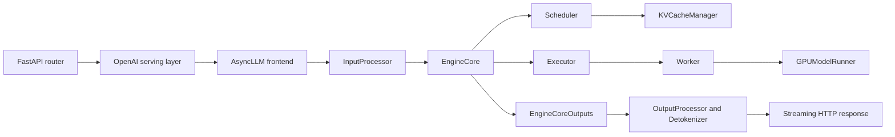

# vLLM Code Learning Path and Request Flow

**Related page:** [vLLM: PagedAttention Serving Framework](vllm-framework.md)

## Why this page exists

The existing [vLLM framework page](vllm-framework.md) explains the original paper design. This page explains the current codebase from the serving path downward, with one practical goal: learn vLLM by building a smaller version in stages.

The main advice is simple: do **not** start from `vllm/v1/worker/gpu_model_runner.py`. It is important, but it is too deep as a first entry point. Start from the request path, then move downward layer by layer.

## The Current Stack

The request path in the current codebase is roughly:

## Basic Components

### 1. API and protocol layer

This layer exposes OpenAI-compatible endpoints and converts HTTP requests into internal calls.

Key files:

- `vllm/entrypoints/openai/chat_completion/api_router.py`
- `vllm/entrypoints/openai/chat_completion/serving.py`

What it does:

- validates the HTTP request;
- selects the serving handler from `app.state`;
- renders chat messages into engine inputs;
- chooses streaming or non-streaming response mode.

### 2. Frontend engine layer

This layer lives in the API process and manages request admission and output delivery.

Key files:

- `vllm/v1/engine/async_llm.py`
- `vllm/v1/engine/input_processor.py`
- `vllm/v1/engine/output_processor.py`
- `vllm/v1/engine/detokenizer.py`

What it does:

- converts rendered inputs into `EngineCoreRequest`;
- assigns internal request IDs;
- sends requests to the background engine core;
- receives engine outputs asynchronously;
- detokenizes and packages them into `RequestOutput`.

### 3. Engine core

This is the central serving loop.

Key file:

- `vllm/v1/engine/core.py`

What it does:

- owns the executor and scheduler;
- initializes KV cache capacity;
- runs the step loop;
- calls `schedule -> execute_model -> update_from_output`.

### 4. Scheduler

This is the heart of request-level serving behavior.

Key file:

- `vllm/v1/core/sched/scheduler.py`

What it does:

- tracks `waiting` and `running` requests;
- decides how many tokens each request gets this step;
- handles chunked prefill, decode, preemption, prefix reuse, and structured-output dependencies;
- builds `SchedulerOutput` for workers;
- consumes model outputs and updates request state.

### 5. KV cache management

This layer turns "how much context do I have?" into actual block allocation.

Key files:

- `vllm/v1/core/kv_cache_manager.py`
- `vllm/v1/core/block_pool.py`

What it does:

- allocates KV blocks for scheduled tokens;
- supports prefix-cache hits;
- manages free blocks, cached blocks, and eviction candidates;
- hides block details behind `KVCacheBlocks`.

### 6. Executor

This layer decides how the engine talks to workers.

Key file:

- `vllm/v1/executor/abstract.py`

What it does:

- chooses `UniProcExecutor`, `MultiprocExecutor`, Ray, or external launcher;
- provides a uniform API for `execute_model`, RPC, and worker initialization.

### 7. Worker and model runner

This is where scheduled batches become tensors, model forward passes, and sampled tokens.

Key files:

- `vllm/v1/worker/gpu_worker.py`
- `vllm/v1/worker/gpu_model_runner.py`
- `vllm/v1/worker/gpu/input_batch.py`

What it does:

- receives `SchedulerOutput`;
- updates persistent batch state;
- builds `InputBatch`;
- runs forward passes;
- samples next tokens;
- returns `ModelRunnerOutput`.

## Request Handling Flow

Below is the simplest mental model for a chat completion request in the current v1 engine path.

### Step 1. HTTP request enters FastAPI

`/v1/chat/completions` lands in `create_chat_completion` in `api_router.py`. The router passes the parsed request to `OpenAIServingChat.create_chat_completion`.

### Step 2. Chat request is rendered into engine inputs

`OpenAIServingChat` validates the model, renders messages through the renderer, computes sampling params, and calls:

- `self.engine_client.generate(...)`

For chat requests, this happens in `vllm/entrypoints/openai/chat_completion/serving.py`.

### Step 3. Frontend converts inputs into an internal engine request

Inside `AsyncLLM.generate`, the request is turned into an `EngineCoreRequest` by `InputProcessor.process_inputs`.

This is where vLLM:

- validates sampling or pooling params;
- checks prompt length;
- handles multimodal features;
- creates one internal request object with arrival time, priority, and adapter info.

### Step 4. Request is registered in two places

`AsyncLLM._add_request` does two separate things:

1. registers the request in `OutputProcessor` so outputs have somewhere to go;
2. sends the `EngineCoreRequest` into `EngineCoreClient`, which talks to the background engine process.

This split is important. The API process owns response streaming, while the engine core owns scheduling and execution.

### Step 5. EngineCore preprocesses and enqueues the request

`EngineCore.preprocess_add_request` converts `EngineCoreRequest` into a richer internal `Request` object.

At this point vLLM may also:

- initialize structured-output grammar state;
- compute request block hashes for prefix caching;
- attach multimodal receiver-cache features.

### Step 6. Scheduler chooses work for the next iteration

In `EngineCore.step`, the main loop is effectively:

1. `scheduler.schedule(...)`
2. `model_executor.execute_model(...)`
3. `scheduler.update_from_output(...)`

During `schedule`, the scheduler:

- selects from `running` first, then `waiting`;
- decides the token budget for this step;
- allocates KV slots through `KVCacheManager`;
- emits `SchedulerOutput`.

### Step 7. KV cache blocks are allocated

`KVCacheManager.allocate_slots(...)` ensures the request has block space for newly scheduled tokens. This is where the paper idea becomes concrete code.

Important mental model:

- the scheduler thinks in tokens;
- the KV manager thinks in blocks;
- the worker later thinks in slot mappings and tensors.

### Step 8. Executor sends scheduled work to workers

`Executor.execute_model(...)` abstracts away whether execution is:

- single-process;
- multi-process;
- Ray-based;
- externally launched.

For a GPU path, the worker eventually calls `GPUModelRunner.execute_model(...)`.

### Step 9. Worker builds the actual batch

`GPUModelRunner` updates request state, prepares tensors, builds an `InputBatch`, computes slot mappings, runs the model forward, and stores transient sampling state.

Then `sample_tokens(...)` turns logits into next-token decisions and packages `ModelRunnerOutput`.

### Step 10. Scheduler consumes model output

`Scheduler.update_from_output(...)`:

- appends sampled tokens to each request;
- handles stop conditions;
- updates accepted or rejected speculative tokens;
- frees finished requests;
- emits `EngineCoreOutput`.

### Step 11. Frontend detokenizes and streams back

The background `output_handler` in `AsyncLLM` pulls `EngineCoreOutputs`, calls `OutputProcessor.process_outputs(...)`, and pushes `RequestOutput` into the per-request queue.

`IncrementalDetokenizer` converts token IDs into streaming text chunks, and the API layer formats those chunks as OpenAI-compatible streaming events or a final JSON response.

## What to Read First

If you want to understand the system without getting buried, read in this order:

1. `vllm/entrypoints/openai/chat_completion/api_router.py`
2. `vllm/entrypoints/openai/chat_completion/serving.py`
3. `vllm/v1/engine/async_llm.py`
4. `vllm/v1/engine/input_processor.py`
5. `vllm/v1/engine/output_processor.py`
6. `vllm/v1/engine/core.py`
7. `vllm/v1/core/sched/scheduler.py`
8. `vllm/v1/core/kv_cache_manager.py`
9. `vllm/v1/executor/abstract.py`
10. `vllm/v1/worker/gpu_worker.py`
11. `vllm/v1/worker/gpu_model_runner.py`

This order follows the request lifecycle instead of the directory tree.

## Learning Path: Build a Mini vLLM

The right learning order is not "smallest file first" and not "most famous concept first". The right order is "smallest complete serving loop first".

### Stage 1. Single-request toy engine

Build:

- one request;
- one worker;
- no batching;
- no KV block manager;
- no streaming server, just a Python generator.

Core objects to implement:

- `Request`
- `Engine`
- `Worker`
- `Sampler`

Achievement:

- you can submit one prompt and watch tokens stream back from your own loop.

Why first:

- this gives you the smallest end-to-end win;
- it matches the `generate -> add_request -> execute -> output` shape without production complexity.

### Stage 2. HTTP wrapper

Build:

- a tiny FastAPI endpoint;
- JSON request parsing;
- SSE or chunked-text streaming.

Achievement:

- your toy engine now feels like a real service.

What you learn:

- the separation between protocol layer and engine layer.

### Stage 3. Multi-request dynamic batching

Build:

- `waiting` queue;
- one scheduler loop;
- merge several requests into one batch per iteration.

Achievement:

- you can see throughput improve when multiple requests arrive together.

What you learn:

- why serving is an iteration scheduler, not a simple request-per-forward loop.

### Stage 4. Continuous prefill plus decode

Build:

- allow a long prompt to enter while short decode requests are already running;
- schedule token budgets per iteration.

Achievement:

- your engine now starts to feel like a real LLM server instead of a demo batcher.

What you learn:

- the real reason vLLM's scheduler is token-centric.

### Stage 5. Toy KV cache blocks

Build:

- fixed-size blocks;
- per-request block tables;
- block allocation and free.

Achievement:

- you reproduce the first truly distinctive vLLM idea.

What you learn:

- how PagedAttention-style memory management changes admission and batching.

### Stage 6. Prefix cache reuse

Build:

- hash full KV blocks;
- reuse cached prompt prefixes across requests.

Achievement:

- repeated prompts become measurably faster.

What you learn:

- why block hashes live near request initialization and KV management.

### Stage 7. Streaming detokenization and stop handling

Build:

- incremental detokenizer;
- stop string checks;
- streaming delta outputs.

Achievement:

- your API behavior starts to match real user expectations.

What you learn:

- why output processing is its own subsystem.

### Stage 8. Preemption and memory pressure

Build:

- if blocks are exhausted, preempt one request;
- return it to waiting;
- resume later.

Achievement:

- your mini engine survives overload instead of just crashing or rejecting everything.

What you learn:

- how scheduler policy and KV memory policy are tied together.

### Stage 9. Multi-process executor

Build:

- engine process;
- worker process;
- message passing.

Achievement:

- your design now resembles the real `AsyncLLM -> EngineCore -> Worker` separation.

What you learn:

- why vLLM isolates request streaming from model execution.

### Stage 10. Advanced features

Choose one at a time:

- speculative decoding;
- structured outputs;
- multimodal inputs;
- multi-LoRA;
- distributed workers.

Achievement:

- each feature becomes a focused learning project instead of a giant codebase dive.

## Recommended order for our next sessions

To keep the learning curve smooth, the next component-by-component study should be:

1. `AsyncLLM` plus `InputProcessor`
2. `OutputProcessor` plus `IncrementalDetokenizer`
3. `Scheduler`
4. `KVCacheManager` plus `BlockPool`
5. `Executor`
6. `GPUWorker` plus `GPUModelRunner`

This order keeps the visible product feeling strong at every step. After the first two sessions, you can already build a toy streaming service. After the scheduler session, you can batch. After the KV session, you get the first "this is really vLLM" moment.

## First milestone to implement

The best first mini-vLLM project is:

**A single-process, single-worker, token-streaming text generation engine with a queue and a simple scheduler, but without paged KV cache yet.**

That project is small enough to finish, but big enough to feel real. It gives an immediate achievement and creates a clean base for adding batched scheduling and block-based KV cache later.
