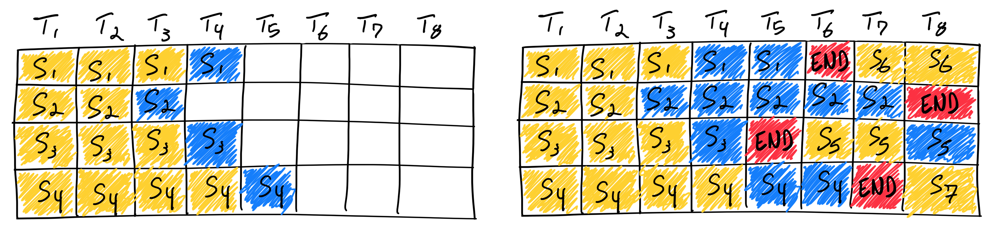
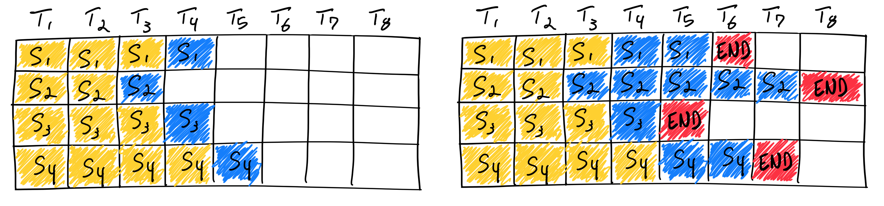
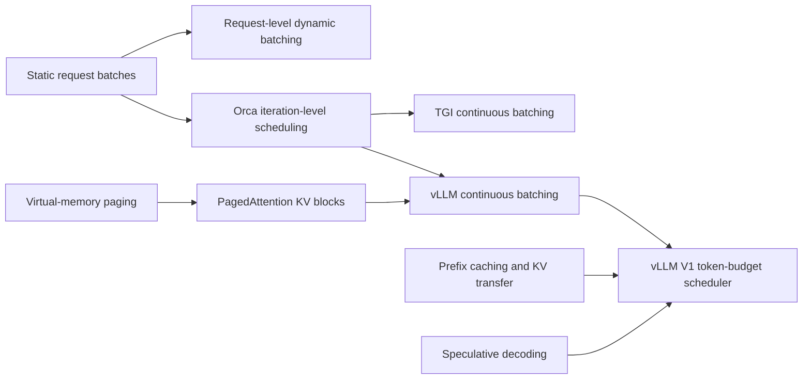

# vLLM Continuous Batching: Scheduler, KV Blocks, and Runtime Flow

**Repository:** [vllm-project/vllm](https://github.com/vllm-project/vllm)
**Inspected commit:** `a0c092ee72c0dcefbb3b3e74f97ac62d842e5f4b`
**Checkout state:** clean, static reading on 2026-08-02

**Related pages:** [vLLM: PagedAttention Serving Framework](../vllm-framework.md),
[vLLM Code Learning Path](../vllm-code-learning-path.md),
[SGLang](../sglang-framework.md), [KV Cache](../../terms/kv-cache.md)

## TL;DR

**What:** [Continuous batching](../../terms/continuous-batching.md) means vLLM
chooses work again at every engine iteration instead of holding a static group
until its slowest request finishes.

**How:** The V1 scheduler spends a per-step token budget on existing running
requests first, admits waiting requests into remaining token and sequence
capacity, asks the [KV-cache](../../terms/kv-cache.md) manager for physical blocks, and sends a compact
`SchedulerOutput` to a worker-side persistent batch.

**The number:** Historical sources report gains ranging from about 8× for
continuous over naive static batching to as much as 23× when vLLM's scheduling
and memory optimizations are combined; these are workload-specific 2023
benchmarks, not universal multipliers.

## The Big Picture



*Original AnyScale figure: the left half shows the first iteration; the right
half shows S5, S6, and S7 entering as earlier sequences finish. The next model
iteration reuses capacity instead of waiting for a fixed request group. Figure
preserved locally from the
[AnyScale continuous-batching article](https://www.anyscale.com/blog/continuous-batching-llm-inference).*

## Why Static Batches Waste the GPU

Consider four chat requests whose outputs need 2, 6, 3, and 5 decode steps. A
static batch launches all four together and keeps the batch boundary until the
six-step request finishes. After the short requests emit EOS, their rows become
empty work: the server still cannot replace them with newly arrived requests.



*Static batching: completed sequences leave unusable gaps inside the fixed
request group. Figure preserved locally from the
[AnyScale continuous-batching article](https://www.anyscale.com/blog/continuous-batching-llm-inference).*

| Decode iteration | Static batch | Continuous batch |
|---:|---|---|
| 1 | A, B, C, D | A, B, C, D |
| 3 | B, C, D plus idle A slot | B, C, D plus new E |
| 4 | B, D plus idle A/C slots | B, D, E plus new F |
| 6 | B plus three idle slots | Any runnable requests that fit |

The key waste is **not padding inside one tensor alone**. It is the lost chance
to schedule unrelated work at each autoregressive boundary. Since decode
usually produces one token per request per forward pass, those boundaries occur
continually.

## The Landscape



*Landscape synthesis: Orca contributes iteration-level scheduling;
virtual-memory paging contributes block-based KV management; current vLLM V1
combines those roots with token budgeting, prefix reuse, KV transfer, and
speculative decoding.*

Editable diagram: [landscape.mmd](assets/landscape.mmd).

## The Core Idea: Rebuild Work Every Iteration

The simple mental model is “replace a sequence when it finishes.” The current
implementation is more general: **recompute a token-level execution plan on
every engine step**. Some requests contribute one decode token, some contribute
a prompt chunk, and speculative decoding can contribute several tokens. A
request does not need to finish before the composition of the next GPU batch
changes.

This makes continuous batching an orchestration policy. PagedAttention is the
memory mechanism that makes the policy effective under variable sequence
lengths. They solve different halves of the same serving problem.

| Layer | Question it answers | vLLM mechanism |
|---|---|---|
| Scheduling | Which requests advance now? | Per-step running/waiting traversal |
| Compute budgeting | How much work fits this iteration? | `max_num_scheduled_tokens` |
| Concurrency | How many live sequences fit? | `max_num_seqs` |
| State memory | Where does each request's growing history live? | Paged KV blocks and block tables |
| Execution | How is changing work presented efficiently? | Worker-side persistent batch |
| Lifecycle | What happens at stop or memory pressure? | Block free or preempt/requeue |

## State Map

| State or field | Plain meaning | Why it matters |
|---|---|---|
| `waiting` | Requests not currently resident as running work | Source of new admissions |
| `running` | Admitted requests that may be considered each step | Persists logically, even when a request is skipped for one step |
| `num_computed_tokens` | Prefix length already executed or treated as executed | Cursor for the next token range |
| `num_tokens_with_spec` | Prompt + accepted output + current draft tokens | Target the computed cursor tries to catch |
| `token_budget` | Tokens still available in this scheduler iteration | Shared by prompt chunks and decode tokens |
| `num_scheduled_tokens` | Request ID → token count for this step | Defines the actual token-level batch |
| block table | Logical block position → physical KV block ID | Lets request state grow without contiguous reservation |
| `finished_req_ids` | Requests completed since the prior scheduling handoff | Tells workers to discard persistent request rows and side state |

The source comment in `Scheduler.schedule()` is especially important: the
scheduler has no fundamental “prefill phase queue” and “decode phase queue.” It
models every request as a difference between a computed cursor and a target
token count.

## Deep Dive 1: One Engine Step Is a Closed Control Loop

**What it does:** `EngineCore.step()` performs schedule → execute → update once.

**Why it matters:** This loop is the iteration boundary at which the active
batch may change.

**How it works:**

1. `Scheduler.schedule()` constructs a new `SchedulerOutput`.
2. `model_executor.execute_model()` runs the planned tokens.
3. Sampling returns zero or more accepted output tokens per scheduled request.
4. `Scheduler.update_from_output()` advances request state and evaluates stop
   conditions.
5. Unfinished requests remain eligible for the next step; finished requests
   leave `running` and release request-owned cache blocks.

**The intuition:** Every generated-token boundary is also a rescheduling
opportunity.

**A concrete example:** If B emits EOS in step 1, B is removed after that
step's output is processed. Step 2 can admit D from `waiting`; A and C do not
restart and keep their logical histories.

**Remember:** The batch changes between model iterations, not inside a running
forward pass.

## Deep Dive 2: Existing Work Gets the First Claim on the Token Budget

**What it does:** `Scheduler.schedule()` initializes `token_budget` from
`max_num_scheduled_tokens` and visits `running` before `waiting`.

**Why it matters:** Continuous admission cannot come at the cost of forgetting
in-flight generations.

**How it works:** For each running request, the scheduler computes approximately:

```text
new work = target tokens + output placeholders - computed tokens
new work = min(new work, remaining token budget, remaining model length)
```

Additional gates cover long-prefill thresholds, encoder inputs, speculative
lookahead, pipeline cadence, and hybrid-cache alignment. After allocating KV
slots, the scheduler subtracts that request's count from the remaining budget.

**The intuition:** The token budget is a suitcase packed every step; running
decodes go in first, and prompt work fills the remaining space.

**A concrete example:** With a six-token budget, A may receive a four-token
prefill chunk while B and C each receive one decode token. A newly arrived D
waits because the step is full, even if `max_num_seqs` has not been reached.

**Remember:** `max_num_batched_tokens` is a token-work ceiling, not simply a
request batch-size setting.

## Deep Dive 3: Waiting Requests Are Admitted Into Remaining Capacity

**What it does:** After running work, the scheduler traverses waiting work under
FCFS by default or priority scheduling when configured.

**Why it matters:** This is where a continuous batch gains new rows without
waiting for every old row to finish.

**How it works:** Admission stops or skips when any relevant constraint fails:

- the token budget reaches zero;
- `len(running)` reaches `max_num_seqs`;
- a prompt cannot fit and chunking is disabled;
- the model-length, encoder, LoRA, or multimodal constraint is reached;
- the KV-cache manager cannot allocate the required slots;
- structured-output or remote-KV dependencies are not ready.

With chunked prefill enabled, a long prompt can take only the remaining token
budget. It becomes a running prefill chunk and continues later rather than
blocking all shorter work behind one full prompt.

**The intuition:** Admission is opportunistic but bounded; “continuous” does
not mean “unlimited.”

**A concrete example:** After B finishes, D can enter step 2 if its first prompt
chunk fits both the remaining token budget and available KV blocks. If D's
whole prompt need not fit because chunking is enabled, the scheduler may admit
only three prompt tokens now and continue later.

**Remember:** Free sequence capacity is necessary but not sufficient—token and
KV capacity must also agree.

## Deep Dive 4: Paged KV Memory Makes Fine-Grained Admission Practical

**What it does:** `KVCacheManager.allocate_slots()` maps newly required logical
token positions to physical KV blocks.

**Why it matters:** A scheduler cannot safely add and grow arbitrary requests
if each one must reserve a maximum-length contiguous KV buffer.

**How it works:** The manager accounts for already computed tokens, local or
external prefix-cache hits, new tokens, and speculative lookahead. It frees
unneeded blocks where supported, checks capacity, then allocates only the new
blocks needed for the planned range. The attention backend reads those
non-contiguous blocks through per-request block tables.


*PagedAttention's block mapping is the memory counterpart to iteration-level
scheduling. Animation preserved locally from the
[official vLLM launch article](https://vllm.ai/blog/2023-06-20-vllm).*

The 2023 vLLM article reports that contiguous reservation and fragmentation
wasted 60–80% of KV memory in compared systems, while block paging confined
ordinary internal waste to the last block and under 4% in its experiments.
Those extra blocks translate into more resident sequences and more scheduling
choices.

**The intuition:** Continuous batching decides *when* a request runs;
PagedAttention makes its growing history cheap enough to keep resident.

**A concrete example:** D does not reserve its maximum output length at
admission. It receives blocks as its prompt and generated output cross block
boundaries, leaving unused physical blocks available for A and C.

**Remember:** The headline throughput comes from the coupling of iteration-level
scheduling and memory-efficient residency, not from either label alone.

## Deep Dive 5: The GPU Batch Is Persistent but Reconciled

**What it does:** `GPUModelRunner._update_states()` updates an existing input
batch rather than reconstructing every request's state from scratch.

**Why it matters:** Fine-grained scheduling would lose its benefit if every
iteration paid large CPU setup and state-copy costs.

**How it works:** The worker:

1. removes rows named in `finished_req_ids`;
2. removes temporarily unscheduled or preempted rows from the active batch;
3. updates token cursors and appends block IDs for cached running requests;
4. creates state for newly admitted requests;
5. restores resumed requests; and
6. compacts or reuses batch indices before preparing GPU tensors.

Most consecutive batches overlap heavily, which is the assumption behind the
persistent-batch optimization. The code explicitly warns that alternating
between disjoint request sets makes this optimization inefficient.

**The intuition:** Logical membership is dynamic, but unchanged rows are kept
warm.

**A concrete example:** A and C retain cached request state between steps; B's
row disappears; D is inserted with its prompt tokens and block table.

**Remember:** Continuous batching changes membership incrementally rather than
throwing away all worker state each step.

## Deep Dive 6: Completion Frees Capacity; Pressure Causes Preemption

**What it does:** Normal stopping releases a request's blocks, while failed KV
admission can evict a running request and place it back in waiting state.

**Why it matters:** The scheduler needs both a fast success path and a recovery
path when aggregate KV demand exceeds physical capacity.

**How it works:** On EOS, stop string, or maximum tokens,
`update_from_output()` marks the request finished, removes it from the running
set, and calls `_free_request()`. Its KV blocks return to the allocator unless
an asynchronous transfer requires deferred release.

If `allocate_slots()` returns `None` for running work, the scheduler preempts
the lowest-priority request under priority mode or removes from the end of the
running list under FCFS. Resumption may reuse prefix-cached blocks or recompute
the missing state. Excessive preemption therefore converts memory pressure into
repeated work and worse tail latency.

**The intuition:** Finished work gives memory back for free; preempted work gives
memory back by borrowing from future compute.

**A concrete example:** If A needs another KV block and none is free, D may be
preempted and requeued. A advances, but D later pays resume or recomputation
cost—evidence that the server is operating beyond comfortable cache capacity.

**Remember:** A high preemption count is a capacity symptom, not a batching win.

## Putting It Together: Two Iterations With Mixed Work

1. **Step 1 starts with six token slots:** A receives a four-token prefill
   chunk, while B and C each receive one decode token.
2. **D arrives while the model executes:** it remains in `waiting` because the
   current iteration is already fixed and its token budget is exhausted.
3. **B emits EOS:** output processing removes B from `running` and releases its
   request-owned KV blocks.
4. **Step 2 is rebuilt:** A receives two more prompt tokens, C receives one
   decode token, and D is admitted with a three-token prompt chunk.
5. **The worker reconciles membership:** A and C retain persistent request
   state, B disappears, and D enters with its block table.

Both iterations spend six token slots, but they contain different request
shapes. `SchedulerOutput` is therefore best understood as a mapping from
request IDs to scheduled token counts plus the KV-block metadata needed to
execute those ranges—not as one fixed request batch.

## Continuous, Dynamic, Iteration-Level, and Chunked Are Not Synonyms

| Term | Decision boundary | What changes |
|---|---|---|
| Static batching | After the whole request group finishes | Entire request group |
| Request-level dynamic batching | Before launching a new static group | Group size based on queue arrivals |
| Continuous batching | Every generation/model iteration | Active request membership and per-request work |
| Iteration-level scheduling | Same core mechanism as continuous batching | Emphasizes scheduler timing |
| Chunked prefill | Within prompt processing across iterations | How a long prompt consumes token budget |
| PagedAttention | On KV allocation and attention access | Where request state resides |

The AnyScale article notes that “dynamic batching” is sometimes used for
continuous batching but is ambiguous because request-level dynamic batching can
still produce a static generation group. In vLLM code, chunked prefill and
PagedAttention are complementary mechanisms, not alternate names for the
scheduler.

## What the Main Knobs Actually Control

| Knob | Direct control | Increasing it can improve | Increasing it can hurt |
|---|---|---|---|
| `max_num_batched_tokens` | Token work per iteration | Throughput and prompt progress | Step time, TPOT, memory/workspace pressure |
| `max_num_seqs` | Concurrent running requests | Decode concurrency | Per-step overhead, KV pressure, preemption |
| `enable_chunked_prefill` | Whether prompts can span token-budgeted steps | Decode/prefill coexistence, long-prompt fairness | More scheduling complexity; prompt completion spans steps |
| `long_prefill_token_threshold` | Cap for one long-prefill chunk | Limits a prompt's per-step interference | Too low can extend TTFT for long prompts |
| `gpu_memory_utilization` | Fraction available to model execution and KV cache | More resident KV blocks | OOM risk and less safety margin |
| scheduling policy | FCFS or priority queue ordering | Workload-specific fairness or urgency | Priority policy can starve low-priority work if misused |

There is no universal best value. The pinned code chooses hardware- and
usage-context-dependent defaults; it even contains a warning that overly large
token batches can reduce A100 throughput. Tune against prompt length, output
length, arrival process, latency objectives, and actual model/hardware—not a
single blog checklist.

## What This Buys You

### The headline claim

**Continuous batching recovers otherwise idle decode opportunities, and paged
KV memory raises the concurrency level at which those opportunities remain
available.**

### How we know: historical serving evidence

| Source and workload | Reported result | What it isolates |
|---|---:|---|
| AnyScale, OPT-13B on one A100 40 GB | Up to 8× continuous over naive static batching | Scheduling plus implementation differences |
| AnyScale, same study with vLLM | Up to 23× over naive baseline | Continuous batching plus vLLM memory optimizations |
| vLLM launch article, LLaMA-7B/13B ShareGPT | Up to 24× over HF and 3.5× over TGI | Full-system comparison |
| vLLM launch article, paged KV memory | Under 4% ordinary waste in its experiments | Block allocation efficiency |

### The mechanism behind the numbers

Static batching loses utilization as output-length variance grows. Continuous
batching makes the loss recoverable at the next iteration. vLLM then keeps more
sequences eligible by avoiding maximum-length contiguous KV reservations. The
gain should therefore grow with variable output lengths, queue depth, and KV
memory pressure, then shrink when the workload is already compute-bound or has
uniform short outputs.

### ⚠️ How to read these numbers

The EaseCloud 2026 page offers useful operational framing, but several of its
exact benchmark and tuning claims are not accompanied by a reproducible setup
in the captured article. This page uses it as secondary operational evidence,
not as the authority for implementation behavior. The 2023 comparisons also
target older framework versions and hardware; do not transfer their multipliers
directly to a current deployment.

## Where It Breaks

| Failure mode | When it happens | Impact |
|---|---|---|
| No queue to fill gaps | Low request arrival rate | Continuous admission has little extra work to schedule |
| Uniform one-token outputs | Requests finish at nearly the same time | Static batching already has little tail waste |
| Oversized token budget | Long mixed steps on latency-sensitive traffic | Higher throughput may worsen inter-token latency |
| Prefill interference | Large prompts consume most step tokens | Decode TPOT and new-request TTFT can become unstable |
| KV saturation | Too many or too-long resident sequences | Preemption, recomputation, queueing, and tail-latency spikes |
| Low batch overlap | Consecutive steps alternate between disjoint request sets | Persistent-batch reconciliation loses efficiency |
| Compute-bound model/workload | KV memory is not the bottleneck | Paging and scheduling overhead provide smaller gains |
| Misread aggregate tokens/s | Throughput rises because many users share the GPU | Individual request latency may still violate an SLA |
| Blog defaults copied blindly | Model, GPU, context, and traffic differ | OOM, regressions, or misleading benchmark conclusions |

## Code Reading Path

1. Start at `vllm/v1/engine/core.py::EngineCore.step` to see the control loop.
2. Read `vllm/v1/core/sched/scheduler.py::Scheduler.schedule`, especially the
   running loop, waiting loop, and `SchedulerOutput` construction.
3. Read `vllm/v1/request.py::Request` for the computed-token cursor model.
4. Follow `KVCacheManager.allocate_slots` in
   `vllm/v1/core/kv_cache_manager.py` for memory admission.
5. Inspect `GPUModelRunner._update_states` in
   `vllm/v1/worker/gpu_model_runner.py` for persistent-batch mutation.
6. Return to `Scheduler.update_from_output` to see stop detection, queue removal,
   preemption aftermath, and KV release.

The factual code evidence and reproduction commands are preserved in
[continuous-batching-runtime.md](../../../derived/repo-analysis/frameworks/vllm/a0c092ee72c0dcefbb3b3e74f97ac62d842e5f4b/continuous-batching-runtime.md).

## One Thing to Remember

**vLLM does not keep a batch alive; it keeps requests alive and rebuilds their
next token-level execution slice every iteration.** Paged KV blocks preserve
each request's history while membership changes, so finished rows can disappear,
new prompt chunks can enter, and ongoing decodes can continue without waiting
for a slowest-request barrier.

## Go Deeper

- **Read:** [vLLM launch article](https://vllm.ai/blog/2023-06-20-vllm) and
  [AnyScale's continuous-batching explanation](https://www.anyscale.com/blog/continuous-batching-llm-inference).
- **Build on:** [vLLM PagedAttention framework analysis](../vllm-framework.md)
  and [SGLang's prefix-aware runtime](../sglang-framework.md).
- **Operate:** [EaseCloud's throughput guide](https://blog.easecloud.io/ai-cloud/increase-throughput-with-vllm-serving/),
  with the evidence caveats above.
- **Inspect:** vLLM commit
  [`a0c092ee72c0dcefbb3b3e74f97ac62d842e5f4b`](https://github.com/vllm-project/vllm/commit/a0c092ee72c0dcefbb3b3e74f97ac62d842e5f4b).
