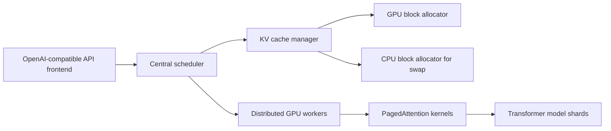
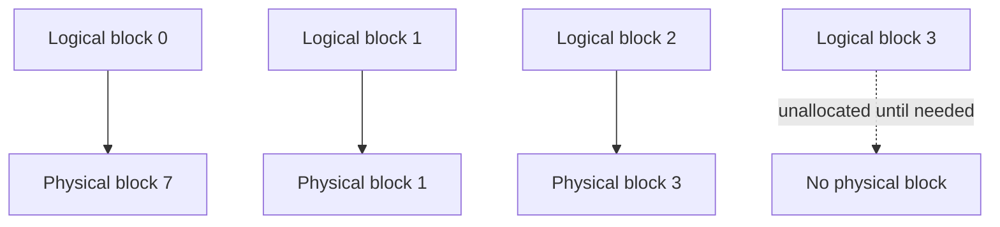

# vLLM: PagedAttention Serving Framework

**Paper:** Efficient Memory Management for Large Language Model Serving with PagedAttention
**Authors:** Woosuk Kwon, Zhuohan Li, Siyuan Zhuang, Ying Sheng, Lianmin Zheng, Cody Hao Yu, Joseph E. Gonzalez, Hao Zhang, Ion Stoica
**Venue / arXiv:** SOSP 2023; arXiv:2309.06180v1 - 12 Sep 2023

**Related page:** [SGLang: Structured Language Model Programs](sglang-framework.md)

## Summary

vLLM is a high-throughput LLM serving framework built around PagedAttention, an attention algorithm and memory-management design that stores KV cache in non-contiguous fixed-size blocks. The paper argues that LLM serving is primarily limited by KV-cache memory, not model weights or transient activations. vLLM improves serving throughput by making KV-cache allocation behave more like operating-system virtual memory: allocate blocks on demand, map logical sequence blocks to physical GPU blocks, and share blocks where decoding algorithms permit it.

The paper reports 2-4x throughput improvements over state-of-the-art serving systems such as FasterTransformer and Orca at comparable latency. Gains are larger for long sequences, larger models, shared-prefix workloads, and decoding methods such as parallel sampling or beam search.

## Problem Framing

Autoregressive LLM serving has two phases:

- **Prompt phase:** the full input prompt is processed in parallel, producing KV cache for prompt tokens and the first next-token probability.
- **Generation phase:** tokens are generated one at a time. Each step depends on prior tokens through the KV cache, making this phase memory-bound and hard to parallelize within a single request.

Batching many requests improves GPU utilization because model weights are shared across the batch. The bottleneck is that each request needs a large, dynamically growing KV cache. For OPT-13B, the paper estimates one token's KV cache at 800 KB, so a 2048-token request can require up to 1.6 GB of KV-cache memory.

Existing systems usually store each request's KV cache in contiguous memory and reserve memory up to a predicted or maximum sequence length. This creates three kinds of waste:

| Waste type | Cause |
|---|---|
| Reserved slots | Memory kept for future generated tokens that may not yet exist |
| Internal fragmentation | Over-allocation when actual sequence length is shorter than reserved capacity |
| External fragmentation | Allocator gaps caused by variable-size contiguous allocations |

The paper reports that, in prior systems, only 20.4% to 38.2% of KV-cache memory may store actual token states in the profiled experiment.

## PagedAttention

PagedAttention divides each sequence's KV cache into fixed-size KV blocks. A request sees a logical sequence of blocks, but those logical blocks can map to arbitrary physical blocks in GPU memory.

This is analogous to virtual memory:

| OS concept | vLLM equivalent |
|---|---|
| Process virtual address space | Request's logical KV blocks |
| Page | Fixed-size KV block |
| Physical page | Physical GPU KV block |
| Page table | Per-request block table |
| Copy-on-write | Shared KV blocks split only when a sequence writes to a shared block |

Because logical continuity no longer requires physical contiguity, vLLM can allocate KV memory incrementally. A new physical block is allocated only when the previous block is full. This bounds per-request internal waste to at most one block and eliminates external fragmentation from variable-size request allocations.

## KV Cache Manager

vLLM's KV cache manager maintains block tables that map each request's logical blocks to physical blocks. Each block table entry records the physical block ID and the number of filled positions.

The serving loop works as follows:

1. The scheduler selects candidate sequences for the next decoding iteration.
2. The KV cache manager allocates new physical blocks for sequences that need more space.
3. vLLM batches prompt tokens and latest generation tokens into one model execution.
4. PagedAttention kernels read prior KV cache through block tables.
5. Newly generated KV cache is written into mapped physical blocks.
6. Finished requests free their physical blocks.

The default block size is 16 tokens. The paper finds this large enough for GPU efficiency while small enough to avoid substantial internal fragmentation across both long ShareGPT and short Alpaca traces.

## Decoding Support

PagedAttention is not only a memory-fragmentation optimization; it also enables flexible KV-cache sharing across decoding strategies.

### Parallel Sampling

When a request asks for multiple samples from the same prompt, all samples share the prompt KV cache. vLLM maps their prompt logical blocks to the same physical blocks and tracks reference counts. Once samples diverge during generation, vLLM uses block-level copy-on-write for the block being modified.

### Beam Search

Beam search creates dynamic sharing patterns because beam candidates share prefixes and then diverge or disappear. vLLM stores shared beam-prefix blocks once, decrements reference counts when candidates are removed, frees blocks with zero references, and allocates new blocks for new candidates. The paper emphasizes that this avoids large KV-cache copies between beam candidates.

### Shared Prefixes

For applications with common system prompts or few-shot examples, a service provider can precompute and reserve physical blocks for the shared prefix. Requests using that prefix map their logical blocks to those cached physical blocks and only compute request-specific suffixes.

This is related to SGLang's later RadixAttention design, but vLLM's paper focuses on block-level memory management and predefined sharing patterns, while [SGLang](sglang-framework.md) focuses on automatic radix-tree KV reuse across structured language-model programs.

## Scheduling and Preemption

vLLM adopts first-come-first-served scheduling for fairness and starvation avoidance. If GPU KV blocks are exhausted, vLLM preempts the latest-arrived work first.

A key design choice is all-or-nothing sequence eviction: because processing a sequence requires all of its token states together, vLLM evicts all blocks for a sequence or none. Multiple sequences inside one request, such as beam candidates, are gang-scheduled as a sequence group because they may share physical blocks.

vLLM supports two recovery methods:

| Method | Mechanism | Tradeoff |
|---|---|---|
| Swapping | Move evicted KV blocks from GPU memory to CPU memory and later swap them back | Better with larger block sizes, but many small transfers hurt PCIe bandwidth |
| Recomputation | Recompute KV cache by treating prompt plus generated tokens as a new prompt | Often competitive for small and medium block sizes; overhead is independent of block size |

For block sizes 16 to 64, the paper reports comparable end-to-end performance between swapping and recomputation.

## Distributed Execution

vLLM supports Megatron-LM-style tensor parallelism. Each worker stores only the KV cache for its shard of attention heads, but all workers share the same logical-to-physical block mapping from the centralized scheduler.

At each decoding step:

1. The scheduler sends input token IDs and block tables to workers.
2. Workers run their model shards and read KV cache according to the shared block table.
3. Workers synchronize intermediate results through all-reduce.
4. Workers return sampled tokens to the scheduler.

The paper's evaluated configurations include OPT-13B on one A100 40 GB GPU, OPT-66B on four A100 GPUs, and OPT-175B on eight A100 80 GB GPUs.

## Implementation

vLLM is implemented as an end-to-end serving system with:

- a FastAPI frontend extending the OpenAI API interface;
- a Python scheduler and block manager;
- custom C++/CUDA kernels for PagedAttention and block operations;
- PyTorch and Transformers model executors for GPT, OPT, and LLaMA-style models;
- NCCL for distributed tensor-parallel communication.

The paper reports about 8.5K lines of Python and 2K lines of C++/CUDA.

Kernel-level optimizations include:

- fused reshape and block write for new KV cache;
- fused block read and attention through block-table-aware attention kernels;
- fused block copy for copy-on-write operations.

The PagedAttention kernel has a measured 20-26% higher attention-kernel latency than FasterTransformer's highly optimized attention kernel, but the end-to-end system is faster because memory efficiency allows much larger batches.

## Evaluation Setup

The paper evaluates OPT-13B, OPT-66B, OPT-175B, and LLaMA-13B on Google Cloud A2 instances with NVIDIA A100 GPUs.

Workloads are synthesized from:

- **ShareGPT:** longer conversational prompts and outputs, with mean input length 161.31 tokens and mean output length 337.99 tokens.
- **Alpaca:** shorter instruction-following traces, with mean input length 19.31 tokens and mean output length 58.45 tokens.

Baselines:

| Baseline | Description |
|---|---|
| FasterTransformer | Latency-optimized distributed inference engine with custom dynamic batching scheduler |
| Orca (Max) | Reserves output KV-cache space up to the model maximum sequence length |
| Orca (Pow2) | Reserves output space rounded up to a power-of-two bound |
| Orca (Oracle) | Uses actual future output length, an infeasible upper-bound baseline |

The primary metric is sustainable request rate while maintaining similar normalized latency, where normalized latency is end-to-end latency divided by output length.

## Results

| Scenario | Reported result |
|---|---|
| Overall serving throughput | 2-4x improvement over state-of-the-art systems |
| ShareGPT basic sampling | 1.7-2.7x higher sustainable request rates than Orca (Oracle), 2.7-8x higher than Orca (Max) |
| FasterTransformer comparison | Up to 22x higher request rates because FasterTransformer lacks fine-grained scheduling and has inefficient memory management |
| OPT-13B average batch size on ShareGPT | vLLM batches 30.42 requests vs. 13.62 for Orca (Oracle) and 7.00 for Orca (Max) |
| OPT-13B average batch size on Alpaca | vLLM batches 132.44 requests vs. 72.75 for Orca (Oracle) and 7.00 for Orca (Max) |
| Parallel sampling memory saving on Alpaca | 6.1-9.8% |
| Beam search memory saving on Alpaca | 37.6-55.2% |
| Parallel sampling memory saving on ShareGPT | 16.2-30.5% |
| Beam search memory saving on ShareGPT | 44.3-66.3% |
| Shared-prefix translation, one-shot prefix | 1.67x higher throughput than Orca (Oracle) |
| Shared-prefix translation, five-shot prefix | 3.58x higher throughput than Orca (Oracle) |
| Chatbot workload | 2x higher sustainable request rates than Orca baselines |

The results show that vLLM is strongest when memory is the limiting factor: long prompts, long outputs, many concurrent requests, shared prompts, and decoding methods with reusable prefixes. Its advantage shrinks when workloads are short enough and GPU memory is large enough that serving becomes compute-bound instead.

## Relationship to Orca and SGLang

Orca and vLLM are complementary. Orca improves throughput through iteration-level scheduling and interleaving, while vLLM improves throughput by increasing KV-cache memory utilization so more working sets fit into GPU memory. The paper argues that fine-grained scheduling makes memory management more difficult, which makes vLLM's block-level design more important.

Compared with [SGLang](sglang-framework.md), vLLM is lower in the stack. vLLM is an inference-serving engine centered on paged KV-cache memory management. SGLang is a programming and runtime framework for structured multi-call language-model programs, and its RadixAttention generalizes KV-cache reuse around prefix trees and cache-aware scheduling.

## Limitations and Design Boundaries

The paper is explicit that paging is valuable here because LLM serving has dynamic memory allocation, unknown output lengths, and memory-bound execution. The same technique may not help static or compute-bound GPU workloads, such as many DNN training jobs or non-LLM inference services. In those cases, block-table indirection and non-contiguous memory access can add overhead without improving throughput.

Other boundaries:

- PagedAttention's attention kernel is slower in isolation than FasterTransformer's kernel.
- Block size is workload-sensitive; too small hurts GPU utilization, too large increases fragmentation and reduces sharing.
- Swapping can be expensive with small blocks due to many small CPU-GPU transfers.
- vLLM's shared-prefix mechanism in this paper is convenient for known prefixes but is not the same as fully automatic multi-level prefix reuse.

## Key Takeaways

- vLLM reframes KV cache as a virtual-memory problem: logical sequence blocks mapped to physical GPU blocks.
- PagedAttention lets attention read KV cache from non-contiguous memory, enabling block-level allocation, sharing, and copy-on-write.
- The framework turns wasted KV-cache memory into larger effective batch sizes, which directly improves serving throughput.
- The biggest gains appear when sequence lengths are long, request concurrency is high, or decoding creates shared-prefix opportunities.
- vLLM is a serving-system foundation that later frameworks and runtimes can build on when they need efficient online LLM inference.
