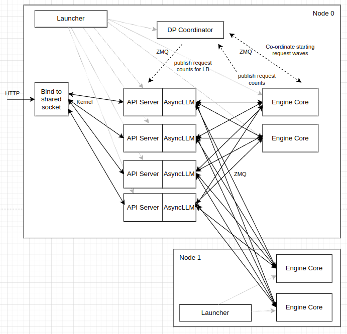
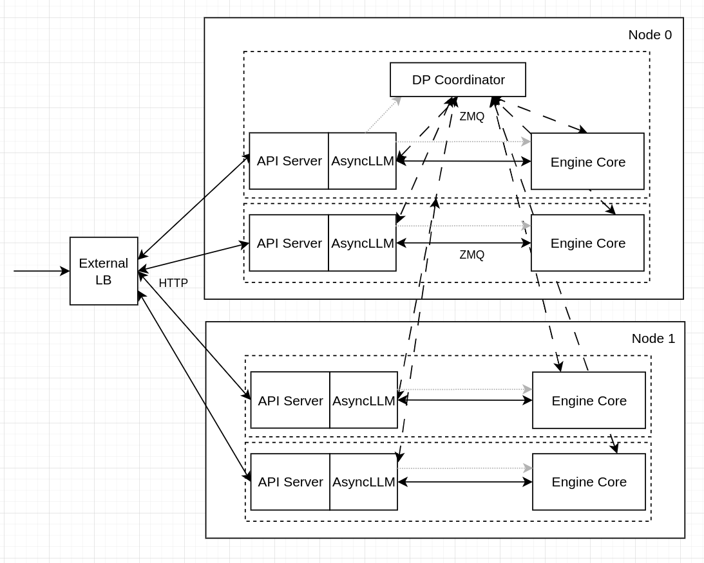
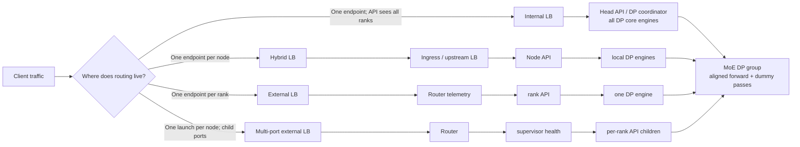

# vLLM Data-Parallel Deployment: Internal and External Load Balancing

**Web source:** [Data Parallel Deployment - vLLM](https://docs.vllm.ai/en/latest/serving/data_parallel_deployment/)

**Repository:** [vllm-project/vllm](https://github.com/vllm-project/vllm)

**Inspected commit:** `8fe9317f2e401aff6e13044098ac7f59e95dce97`

**Checkout state:** clean, commit-pinned static reading on 2026-08-25. The
upstream page at the pinned revision is available as the
<a class="code-link" href="../../../../external-repos/vllm-8fe9317f2e40/docs/serving/data_parallel_deployment.md#L1" data-code-repo="vllm-8fe9317f2e40" data-code-path="docs/serving/data_parallel_deployment.md" data-code-line="1"><code>vLLM deployment guide</code></a>.

**Related pages:** [vLLM Architecture Overview](../vllm-overview.md), [vLLM
Continuous Batching](../vllm-continuous-batching/index.md), [vLLM Prefill/Decode
Disaggregation](../prefill-decode-disaggregated-deployment/index.md), and [vLLM
Block Table Management](../vllm-block-management/index.md).

## TL;DR

**What:** Data parallelism replicates model weights across DP ranks so separate
request batches can be processed by separate vLLM engine instances.

**How:** vLLM can place request routing inside one API process, at the node
boundary, or in an external router that treats each DP rank as its own endpoint.

**The deployment rule:** Dense-model replicas are independent servers; MoE DP
ranks still have synchronized forward passes, so external HTTP routing does not
remove the cross-rank execution contract.

## The Big Picture

The official diagrams answer the most important topology question: where does
an incoming request meet the DP ranks?



*Source: the [captured vLLM deployment page](https://docs.vllm.ai/en/latest/serving/data_parallel_deployment/), preserved locally from the pinned documentation source. The single API endpoint owns the routing decision and can reach all DP engines.*



*Source: the [captured vLLM deployment page](https://docs.vllm.ai/en/latest/serving/data_parallel_deployment/), preserved locally from the pinned documentation source. Separate launches expose separate rank endpoints; an external router owns the request distribution.*

The diagrams do not show the hybrid mode or the newer multi-port supervisor
path. The following synthesized map adds those two intermediate choices.



*Synthesized topology map. It answers “who chooses a rank?” rather than
redrawing the upstream figures. Internal mode chooses across the full process;
hybrid mode chooses across local ranks after an upstream node choice; external
mode chooses the rank endpoint outside vLLM. Editable source:
[dp-deployment-strategies.mmd](assets/dp-deployment-strategies.mmd).*

## Why This Exists

Consider four DP ranks serving a mixture of long prompts and short decode
requests. Every rank has its own KV cache. If the API sends new prompts to a
rank that already has a long waiting queue, that rank may drain slowly even
though another rank is idle. If the prompt shares a prefix with work already on
one rank, sending it elsewhere also loses the local prefix-cache opportunity.

Internal LB solves this with one vLLM API process that observes rank state.
Hybrid LB first sends traffic to a node and then balances only among the ranks
on that node. External LB moves the first decision to an ingress or router,
which must obtain suitable live telemetry and maintain any locality policy.

For an MoE model, this routing problem has a second layer. A rank with no user
request cannot simply stop if its experts participate in a distributed forward
pass. It must execute synchronized empty work while another rank is active.
The HTTP load-balancing boundary and the MoE execution boundary are therefore
different things.

## The Core Idea

The <a class="code-link" href="../../../../external-repos/vllm-8fe9317f2e40/vllm/config/parallel.py#L129" data-code-repo="vllm-8fe9317f2e40" data-code-path="vllm/config/parallel.py" data-code-line="129"><code>ParallelConfig</code></a> expresses a global DP size, a local DP size,
a rank, and the address/port used for DP coordination. With DP size `D` and
attention tensor-parallel size `T`, a single-node deployment normally needs
`D x T` accelerator devices. `--max-num-seqs` applies per DP rank, so increasing
`D` changes both capacity and the number of independent scheduler budgets.

The three important routing shapes are:

| Mode | Who chooses the DP rank? | What each API process manages | Best fit | Main cost |
|---|---|---|---|---|
| Internal | vLLM API process | All DP engines in the deployment | Moderate scale and one simple endpoint | Head-node API/coordinator can become a bottleneck |
| Hybrid | Upstream LB chooses a node; vLLM chooses a local rank | Only the node's local DP engines | Multi-node deployments that want local request traffic | Requires per-node endpoints and global MoE coordination |
| External | An ingress/router chooses a rank endpoint | One DP engine per vLLM server | Large Kubernetes-style deployments and custom telemetry | Router must own health, rank selection, and locality |
| Multi-port external | An upstream LB chooses a node; supervisor owns child ports | One API child per local rank | One launch per node with aggregated health | More processes and ports to operate |

`data_parallel_external_lb` and `data_parallel_hybrid_lb` make the client
manage only local engines; the
<a class="code-link" href="../../../../external-repos/vllm-8fe9317f2e40/vllm/config/parallel.py#L598" data-code-repo="vllm-8fe9317f2e40" data-code-path="vllm/config/parallel.py" data-code-line="598"><code>local_engines_only</code></a> property is the compact implementation of that
boundary. Pure internal LB is the exception: the rank-0 API process can manage
local and remote engines.

## Deployment Strategy

Use this sequence when choosing a topology:

1. **Classify the model.** For a dense model, launch independent vLLM
   instances and place a normal HTTP load balancer in front of them. Do not use
   the MoE-oriented external DP CLI options. For an MoE model, decide whether
   its attention is replicated with DP and its experts use tensor parallelism
   (the default) or expert parallelism with `--enable-expert-parallel`.
2. **Choose the replica shape.** Set `--data-parallel-size D` for the number of
   model replicas and `--tensor-parallel-size T` for the attention worker group
   inside each replica. Keep the model, tokenizer, KV-cache dtype, and parallel
   configuration identical across ranks.
3. **Choose the routing boundary.** Start with internal LB when one endpoint and
   vLLM-managed queue-aware routing are enough. Choose hybrid LB when node-local
   routing reduces cross-node request traffic. Choose external LB when the
   platform already has an ingress, autoscaler, health system, and telemetry
   plane that should own rank selection.
4. **Choose the process launcher.** Use the multiprocessing backend for explicit
   multi-node MP launches. Use Ray internal DP when cluster resource placement
   and one-command startup are more valuable than explicit per-node commands.
   Use the multi-port supervisor when one process per node should expose one
   health endpoint while its children expose one port per local rank.
5. **Validate the execution contract.** For MoE, test that every rank joins the
   same DP/expert collectives, including idle periods. For any mode, measure
   queue depth, running requests, KV usage, prefix-cache hit behavior, TTFT,
   inter-token latency, and router errors together.

The upstream
<a class="code-link" href="../../../../external-repos/vllm-8fe9317f2e40/vllm/engine/arg_utils.py#L1095" data-code-repo="vllm-8fe9317f2e40" data-code-path="vllm/engine/arg_utils.py" data-code-line="1095"><code>data-parallel CLI definitions</code></a> expose the global size, local size, rank,
start rank, coordinator address, RPC port, backend, and three LB flags. The
<a class="code-link" href="../../../../external-repos/vllm-8fe9317f2e40/vllm/engine/arg_utils.py#L2094" data-code-repo="vllm-8fe9317f2e40" data-code-path="vllm/engine/arg_utils.py" data-code-line="2094"><code>engine-argument validation</code></a> rejects incompatible mode combinations,
requires a rank for pure external mode, rejects external DP mode for non-MoE
models, and infers a hybrid mode when a non-headless launch supplies a start
rank.

## Internal Load Balancing

### What starts

A single-node internal deployment is the shortest path to one endpoint:

```bash
vllm serve $MODEL \
  --data-parallel-size 4 \
  --tensor-parallel-size 2
```

This creates four DP engines, each with two tensor-parallel workers, for eight
GPUs total. vLLM's serve command defaults the API-server count to the full DP
size in internal mode. The
<a class="code-link" href="../../../../external-repos/vllm-8fe9317f2e40/vllm/entrypoints/cli/serve.py#L78" data-code-repo="vllm-8fe9317f2e40" data-code-path="vllm/entrypoints/cli/serve.py" data-code-line="78"><code>serve mode selection</code></a> is also where the command distinguishes
internal, hybrid, external, and multi-port external launches.

For a large DP size, add `--api-server-count N`. These API processes share the
same public port and split frontend work, but this scale-out remains inside the
head node; it does not distribute the API layer across the cluster.

### Multi-node internal mode

For explicit multiprocessing across two nodes, keep one global DP size and
assign a contiguous local rank range to each launch. The first node owns the
API server and ranks 0-1; the second node is headless and starts ranks 2-3:

```bash
# Node 0, API server and DP ranks 0-1
vllm serve $MODEL \
  --data-parallel-size 4 \
  --data-parallel-size-local 2 \
  --data-parallel-address 10.99.48.128 \
  --data-parallel-rpc-port 13345

# Node 1, headless DP ranks 2-3
vllm serve $MODEL \
  --headless \
  --data-parallel-size 4 \
  --data-parallel-size-local 2 \
  --data-parallel-start-rank 2 \
  --data-parallel-address 10.99.48.128 \
  --data-parallel-rpc-port 13345
```

The `--headless` launch starts engines but no API server. An alternative is to
put only the API server on the first node with
`--data-parallel-size-local 0` and run all four engines headlessly on the
second node. Ray can express the same internal topology with one launch:

```bash
vllm serve $MODEL \
  --data-parallel-size 4 \
  --data-parallel-size-local 2 \
  --data-parallel-backend=ray
```

With Ray, the cluster supplies remote resources and the launch does not need
an explicit DP address or RPC port. When one DP group spans multiple nodes, set
`VLLM_RAY_DP_PACK_STRATEGY=span`; Ray then determines the local placement rather
than using `--data-parallel-size-local` as a fixed count.

### How a request is selected

The async engine client factory selects
<a class="code-link" href="../../../../external-repos/vllm-8fe9317f2e40/vllm/v1/engine/core_client.py#L128" data-code-repo="vllm-8fe9317f2e40" data-code-path="vllm/v1/engine/core_client.py" data-code-line="128"><code>DPLBAsyncMPClient</code></a> for internal and hybrid LB, and
`DPAsyncMPClient` for external LB. In internal mode, the client receives
coordinator snapshots for the engines it manages. The snapshot has
`[waiting, running, kv_cache_usage]` per engine.

<a class="code-link" href="../../../../external-repos/vllm-8fe9317f2e40/vllm/v1/engine/core_client.py#L1472" data-code-repo="vllm-8fe9317f2e40" data-code-path="vllm/v1/engine/core_client.py" data-code-line="1472"><code>DPLBAsyncMPClient.get_core_engine_for_request</code></a> chooses the engine with the
lowest estimated score. In the pinned revision the score is the greater of the
coordinator's `waiting + running` snapshot and the current client's own
in-flight count scaled by the number of API clients. A waiting queue receives an
additional penalty as KV usage rises above 50 percent. Ties rotate across the
engine list, and the client increments an optimistic waiting count between
100-ms coordinator updates.

> **Evidence:** The captured web page describes internal LB as based on running
> and waiting queues and leaves KV-cache-aware routing as future work. The
> pinned `8fe931...` implementation already includes `kv_cache_usage` in the
> score. Treat the code behavior as revision-specific and verify the exact
> scoring policy when upgrading vLLM.

### How the coordinator feeds it

<a class="code-link" href="../../../../external-repos/vllm-8fe9317f2e40/vllm/v1/engine/coordinator.py#L23" data-code-repo="vllm-8fe9317f2e40" data-code-path="vllm/v1/engine/coordinator.py" data-code-line="23"><code>DPCoordinator</code></a> is a separate process. Its
<a class="code-link" href="../../../../external-repos/vllm-8fe9317f2e40/vllm/v1/engine/coordinator.py#L189" data-code-repo="vllm-8fe9317f2e40" data-code-path="vllm/v1/engine/coordinator.py" data-code-line="189"><code>process_input_socket</code></a> receives scheduler statistics from engine cores,
stores waiting/running/KV-usage state, and publishes the most recent snapshot
to frontend clients. It also carries the current request wave and running state
used by MoE synchronization.

The client does not route on raw GPU utilization. It routes on the state vLLM
makes available at the scheduler boundary, so queue and KV behavior should be
part of the deployment's capacity model.

## Hybrid Load Balancing

Hybrid mode places one API server or API-server group on every node. The
upstream load balancer chooses a node; the node-local vLLM client then chooses
among its colocated DP engines. It is enabled explicitly with
`--data-parallel-hybrid-lb`, or implicitly for a non-headless launch that uses
`--data-parallel-start-rank`.

For DP=4 with two ranks on each node, use the same global DP size on both nodes
and give each node its local count and rank offset:

```bash
# Node 0: DP ranks 0 and 1
vllm serve $MODEL \
  --data-parallel-size 4 \
  --data-parallel-size-local 2 \
  --data-parallel-start-rank 0 \
  --data-parallel-hybrid-lb \
  --data-parallel-address 10.99.48.128 \
  --data-parallel-rpc-port 13345

# Node 1: DP ranks 2 and 3
vllm serve $MODEL \
  --data-parallel-size 4 \
  --data-parallel-size-local 2 \
  --data-parallel-start-rank 2 \
  --data-parallel-hybrid-lb \
  --data-parallel-address 10.99.48.128 \
  --data-parallel-rpc-port 13345
```

Every node exposes an API endpoint, so hybrid mode is not compatible with
`--headless`. Set `--api-server-count` per node according to the number of
local ranks. Because each client manages only local engines, the upstream LB is
responsible for node-level distribution while vLLM remains responsible for
rank-level distribution.

The hybrid process still participates in the global MoE coordinator and DP
collectives. Hybrid changes request ingress locality; it does not turn an MoE
DP group into independent processes.

## External Load Balancing

### Dense models: independent replicas

For a dense model, launch independent vLLM servers without DP-specific flags:

```bash
CUDA_VISIBLE_DEVICES=0 vllm serve $MODEL --port 8000
CUDA_VISIBLE_DEVICES=1 vllm serve $MODEL --port 8001
```

A normal external load balancer can distribute requests between these servers.
There is no shared MoE DP coordinator, so each replica is an independent
serving unit. This is also the simplest failure domain.

### MoE models: one endpoint per DP rank

For an MoE DP deployment, each launch identifies its rank. Co-located ranks
need distinct HTTP ports:

```bash
# Rank 0
CUDA_VISIBLE_DEVICES=0 vllm serve $MODEL \
  --data-parallel-size 2 \
  --data-parallel-rank 0 \
  --port 8000

# Rank 1
CUDA_VISIBLE_DEVICES=1 vllm serve $MODEL \
  --data-parallel-size 2 \
  --data-parallel-rank 1 \
  --port 8001
```

For multi-node ranks, set the same rank-0 coordinator address and RPC port on
every launch:

```bash
# Rank 0, coordinator host 10.99.48.128
vllm serve $MODEL \
  --data-parallel-size 2 \
  --data-parallel-rank 0 \
  --data-parallel-address 10.99.48.128 \
  --data-parallel-rpc-port 13345

# Rank 1
vllm serve $MODEL \
  --data-parallel-size 2 \
  --data-parallel-rank 1 \
  --data-parallel-address 10.99.48.128 \
  --data-parallel-rpc-port 13345
```

The external router selects one HTTP endpoint per request. Inside each server,
<a class="code-link" href="../../../../external-repos/vllm-8fe9317f2e40/vllm/v1/engine/core_client.py#L1253" data-code-repo="vllm-8fe9317f2e40" data-code-path="vllm/v1/engine/core_client.py" data-code-line="1253"><code>DPAsyncMPClient</code></a> manages one rank-local engine, so it does not
perform full-DP request balancing. The same client shape is used when a request
is explicitly assigned a `data_parallel_rank` in the input processor.

An external router should use live health and workload telemetry rather than
blind round robin when prefix locality, queue depth, or KV capacity matters.
That policy is outside the pinned vLLM client. The router must also treat a
failed MoE rank as a group-level event, because the surviving ranks may be
unable to complete the next synchronized forward pass alone.

### Multi-port external supervisor

The pinned revision also contains `--data-parallel-multi-port-external-lb`. It
is useful when an orchestrator wants one launch per node but still wants one API
port per local rank. The supervisor derives each child rank and port, starts the
children, probes their `/health` endpoints, and exposes an aggregated health
endpoint only after all children are ready. The
<a class="code-link" href="../../../../external-repos/vllm-8fe9317f2e40/vllm/entrypoints/openai/dp_supervisor.py#L269" data-code-repo="vllm-8fe9317f2e40" data-code-path="vllm/entrypoints/openai/dp_supervisor.py" data-code-line="269"><code>DPSupervisor</code></a> implementation makes this a process supervisor,
not another request-balancing algorithm.

A node-local launch has the shape:

```bash
vllm serve $MODEL \
  --data-parallel-size 4 \
  --data-parallel-size-local 2 \
  --data-parallel-start-rank 0 \
  --data-parallel-multi-port-external-lb \
  --port 8000 \
  --data-parallel-supervisor-port 9256
```

The two child rank servers use ports 8000 and 8001; the supervisor's health
port is 9256. A second node uses `--data-parallel-start-rank 2` and a non-
overlapping HTTP/supervisor port range. The child creation and rank/port
mapping are implemented in
<a class="code-link" href="../../../../external-repos/vllm-8fe9317f2e40/vllm/entrypoints/openai/dp_supervisor.py#L401" data-code-repo="vllm-8fe9317f2e40" data-code-path="vllm/entrypoints/openai/dp_supervisor.py" data-code-line="401"><code>DPSupervisor._start_children</code></a>, while readiness and failure shutdown are
handled by
<a class="code-link" href="../../../../external-repos/vllm-8fe9317f2e40/vllm/entrypoints/openai/dp_supervisor.py#L417" data-code-repo="vllm-8fe9317f2e40" data-code-path="vllm/entrypoints/openai/dp_supervisor.py" data-code-line="417"><code>DPSupervisor._probe_all_children</code></a>.

## MoE Synchronization Is Separate from HTTP Routing

The upstream page states that DP ranks for MoE models are not completely
independent. By default, expert layers form a tensor-parallel group of size
`DP x TP`; `--enable-expert-parallel` changes the expert sharding strategy.
Forward passes remain aligned even when only one rank has user requests.

The launch path creates the
<a class="code-link" href="../../../../external-repos/vllm-8fe9317f2e40/vllm/v1/engine/utils.py#L1104" data-code-repo="vllm-8fe9317f2e40" data-code-path="vllm/v1/engine/utils.py" data-code-line="1104"><code>launch_core_engines</code></a> process topology. In online DP mode, rank 0
starts the coordinator when the configuration needs one. Internal mode lets
rank 0 handshake with all core engines; hybrid and external modes keep the
frontend's engine ownership local while preserving the shared DP setup.

<a class="code-link" href="../../../../external-repos/vllm-8fe9317f2e40/vllm/v1/engine/core.py#L2000" data-code-repo="vllm-8fe9317f2e40" data-code-path="vllm/v1/engine/core.py" data-code-line="2000"><code>DPEngineCoreProc</code></a> uses a lockstep loop for MoE DP. If its local scheduler has
no ready request while another rank is active, it executes a dummy batch. Every
32 steps it calls
<a class="code-link" href="../../../../external-repos/vllm-8fe9317f2e40/vllm/v1/engine/core.py#L2267" data-code-repo="vllm-8fe9317f2e40" data-code-path="vllm/v1/engine/core.py" data-code-line="2267"><code>_has_global_unfinished_reqs</code></a>, which uses a DP all-reduce to decide
whether the group can pause. The coordinator broadcasts request-wave state so
a new request wakes the other ranks and stale wave notifications do not
reawaken a group that has already reached pause consensus.

> **Important:** External LB controls which server receives the HTTP request;
> it does not control whether all MoE DP ranks participate in the next forward
> pass.

## Putting It Together: One Request Round Trip

Follow request `R` in the four-DP internal case. The same core stages apply to
hybrid and external modes; only the set of engine identities visible to the
client changes.

| Step | Actor and code evidence | Input state | Action | Output state |
|---:|---|---|---|---|
| 1 | API input processor: <a class="code-link" href="../../../../external-repos/vllm-8fe9317f2e40/vllm/v1/engine/input_processor.py#L301" data-code-repo="vllm-8fe9317f2e40" data-code-path="vllm/v1/engine/input_processor.py" data-code-line="301"><code>process_inputs</code></a> and <a class="code-link" href="../../../../external-repos/vllm-8fe9317f2e40/vllm/v1/engine/input_processor.py#L418" data-code-repo="vllm-8fe9317f2e40" data-code-path="vllm/v1/engine/input_processor.py" data-code-line="418"><code>EngineCoreRequest construction</code></a> | HTTP or programmatic request, optional rank hint | Validates the rank range and builds `EngineCoreRequest` | Request carries `data_parallel_rank` or no hint |
| 2 | Client factory: <a class="code-link" href="../../../../external-repos/vllm-8fe9317f2e40/vllm/v1/engine/core_client.py#L128" data-code-repo="vllm-8fe9317f2e40" data-code-path="vllm/v1/engine/core_client.py" data-code-line="128"><code>make_async_mp_client</code></a> | DP configuration | Selects the full-DP LB client or one-rank client | Routing policy is fixed for this API process |
| 3 | Request selection: <a class="code-link" href="../../../../external-repos/vllm-8fe9317f2e40/vllm/v1/engine/core_client.py#L1472" data-code-repo="vllm-8fe9317f2e40" data-code-path="vllm/v1/engine/core_client.py" data-code-line="1472"><code>get_core_engine_for_request</code></a> | R plus engine state snapshots | Chooses the lowest internal score, honors a rank hint, or uses the only external engine | R is sent through ZMQ to one core engine |
| 4 | Coordinator: <a class="code-link" href="../../../../external-repos/vllm-8fe9317f2e40/vllm/v1/engine/coordinator.py#L189" data-code-repo="vllm-8fe9317f2e40" data-code-path="vllm/v1/engine/coordinator.py" data-code-line="189"><code>process_input_socket</code></a> | Per-engine scheduler counts and wave state | Publishes fresh counts; for MoE, wakes or advances the synchronized wave | Clients update their routing snapshot; DP ranks agree on running state |
| 5 | MoE engine loop: <a class="code-link" href="../../../../external-repos/vllm-8fe9317f2e40/vllm/v1/engine/core.py#L2184" data-code-repo="vllm-8fe9317f2e40" data-code-path="vllm/v1/engine/core.py" data-code-line="2184"><code>DPEngineCoreProc.run_busy_loop</code></a> | R on one rank, possibly no local request on peers | Runs the model on R and dummy work on idle peers; all-reduces unfinished state | Model outputs and scheduler stats return from the engine group |
| 6 | Client output queue: <a class="code-link" href="../../../../external-repos/vllm-8fe9317f2e40/vllm/v1/engine/core_client.py#L1097" data-code-repo="vllm-8fe9317f2e40" data-code-path="vllm/v1/engine/core_client.py" data-code-line="1097"><code>AsyncMPClient.get_output_async</code></a> | EngineCore output frames | Decodes output frames and exposes them to the async engine | `EngineCoreOutputs` reaches `AsyncLLM` |
| 7 | Response processing: <a class="code-link" href="../../../../external-repos/vllm-8fe9317f2e40/vllm/v1/engine/async_llm.py#L691" data-code-repo="vllm-8fe9317f2e40" data-code-path="vllm/v1/engine/async_llm.py" data-code-line="691"><code>AsyncLLM output handler</code></a> | Engine outputs and finished request IDs | Processes output chunks, updates scheduler stats, and closes the request queue | Client receives streamed result; internal routing state releases R |

For an external per-rank launch, step 3 is simpler: the external router has
already chosen the rank endpoint and that API process's
`DPAsyncMPClient.get_core_engine_for_request` returns its sole local engine.
The MoE coordinator and steps 4-7 still matter.

## Sizing and Operational Signals

Use these as separate dimensions rather than reducing the deployment to GPU
count:

| Dimension | What to watch | Why it changes the strategy |
|---|---|---|
| Prompt admission | Prompt tokens per second and TTFT | Prefill-heavy traffic can make one rank's waiting queue dominate |
| Decode service | Active sequences, output length, and inter-token latency | Long generations keep ranks occupied even with few new requests |
| KV capacity | KV usage, cache evictions, and prefix-cache hits | Each DP rank owns an independent cache; routing affects locality |
| Frontend | API queueing, CPU usage, and request fan-out | Internal LB can make the head API a bottleneck |
| Network | Cross-node request/RPC traffic and error rate | Hybrid reduces request routing distance but not MoE collectives |
| Synchronization | Dummy steps, wave transitions, and stalled collectives | MoE DP cannot be evaluated as independent HTTP servers |

The internal client currently exposes queue and KV signals to its own routing
logic. An external router must define its telemetry contract separately and
should test stale metrics, rank failure, retry duplication, and prefix locality.

## Where It Breaks

| Failure mode | When it happens | Impact |
|---|---|---|
| Non-MoE external DP flags | A dense model is launched with external DP CLI options | vLLM rejects the configuration; use independent servers instead |
| Missing external rank | External mode has no `--data-parallel-rank` and no inferable multi-node rank | Startup cannot bind this launch to one DP engine |
| Invalid local topology | Local size exceeds global size, or rank plus local size exceeds the DP range | Engine startup or argument validation fails |
| Hybrid/headless conflict | Hybrid mode is combined with `--headless` | A mode that needs a per-node API endpoint has no API process |
| Conflicting LB modes | More than one of internal, hybrid, external, or multi-port flags is active | CLI validation rejects ambiguous ownership |
| MoE rank drift | One rank uses a different model, expert/TP setting, or DP group address | Collective mismatch, startup failure, or a hung forward pass |
| Coordinator failure | The rank-0 coordinator or its ZMQ paths die | Stats and wave coordination stop; the deployment may become unavailable |
| Stale external telemetry | Router sends work using old queue/KV or health data | Load imbalance, prefix-cache loss, retries, or avoidable tail latency |
| Port collision | Per-rank HTTP ports, supervisor ports, or RPC ports overlap | Child launch or cross-node handshakes fail |
| Overloaded head API | Large internal DP count or too many concurrent clients | Routing and serialization add latency even when engines have capacity |

## Verification Boundary and Limits

The page combines the captured official documentation with static inspection of
the clean vLLM checkout at commit `8fe9317f2e401aff6e13044098ac7f59e95dce97`.
The repository contains focused unit tests for internal routing and the
multi-port supervisor, including
<a class="code-link" href="../../../../external-repos/vllm-8fe9317f2e40/tests/v1/engine/test_engine_core_client.py#L206" data-code-repo="vllm-8fe9317f2e40" data-code-path="tests/v1/engine/test_engine_core_client.py" data-code-line="206"><code>DPLBAsyncMPClient routing tests</code></a> and
<a class="code-link" href="../../../../external-repos/vllm-8fe9317f2e40/tests/entrypoints/openai/test_dp_supervisor.py#L136" data-code-repo="vllm-8fe9317f2e40" data-code-path="tests/entrypoints/openai/test_dp_supervisor.py" data-code-line="136"><code>DPSupervisor tests</code></a>. They were not executed here. No multi-GPU,
Ray, Kubernetes, or production network run was performed, so throughput,
interconnect behavior, failover time, and real prefix-cache gains remain
unverified. vLLM changes quickly; re-check the pinned flags and scoring logic
when upgrading.

## One Thing to Remember

**Load balancing decides where a request enters; data-parallel execution decides
who must participate.** Internal LB centralizes rank selection in one vLLM
frontend, hybrid LB splits the decision between an upstream node router and a
local vLLM frontend, and external LB gives each rank its own endpoint. For MoE,
all of those choices still sit above a synchronized DP execution group.

## Go Deeper

- **Read:** [vLLM Data Parallel Deployment](https://docs.vllm.ai/en/latest/serving/data_parallel_deployment/)
- **Inspect the pinned guide:** <a class="code-link" href="../../../../external-repos/vllm-8fe9317f2e40/docs/serving/data_parallel_deployment.md#L1" data-code-repo="vllm-8fe9317f2e40" data-code-path="docs/serving/data_parallel_deployment.md" data-code-line="1"><code>docs/serving/data_parallel_deployment.md</code></a>
- **Understand the engine:** [vLLM Architecture Overview](../vllm-overview.md) and [vLLM Continuous Batching](../vllm-continuous-batching/index.md)
- **Compare deployment boundaries:** [vLLM Prefill/Decode Disaggregation](../prefill-decode-disaggregated-deployment/index.md)
- **Reproduce:** Run the focused vLLM tests in a dependency-complete environment; a multi-GPU or Ray deployment is required to validate distributed behavior.
- **Reuse the diagram source:** [dp-deployment-strategies.mmd](assets/dp-deployment-strategies.mmd)
