# GLM-5.1 on vLLM: Expert-Parallel MoE Path

**Repository:** [vllm-project/vllm](https://github.com/vllm-project/vllm) @
`a0c092ee72c0dcefbb3b3e74f97ac62d842e5f4b` (pinned static reading; the
inspected EP/GLM files are unchanged, but the checkout has an unrelated debug
edit in an out-of-scope linear-layer module)

**Related pages:** [vLLM architecture](../vllm-overview.md), [vLLM data-parallel
deployment](../data-parallel-deployment/index.md), [GLM-5.2 request path](../glm-5.2-inference-path.md), and [Mixture of Experts](../../../terms/mixture-of-experts.md)

> **Scope:** This page follows the upstream CUDA-agnostic MoE control path. It
> uses GLM-5.1 as the concrete model identity, but the expert-parallel runner
> is shared with other sparse-MoE models. It does not describe Ascend's
> `MoeDistributeDispatchV2` path or claim that a particular GLM-5.1 checkpoint
> was executed.

## TL;DR

**What:** GLM-5.1 is registered as `GlmMoeDsaForCausalLM`, a thin alias over
the DeepSeek-V2-family model shell whose decoder layers call the generic
FusedMoE stack.

**How:** With `--enable-expert-parallel`, vLLM flattens the active TP, prefill
context-parallel, and DP axes into one EP group, keeps one complete expert shard
per rank, dispatches each token's top-k routes, runs only local experts, and
combines the results back into the caller's token order.

**The boundary:** The router produces global expert IDs; `ExpertMapManager`
maps those IDs to local weight rows; the selected all-to-all backend owns the
cross-rank movement; the expert kernel owns the two GEMMs and activation; the
finalize step owns router weighting and output reduction.

## The Big Picture

[Editable Mermaid source](assets/glm-5.1-expert-parallel-path.mmd)

```mermaid
flowchart LR
    A["GLM-5.1 request row"] --> B["GlmMoeDsaForCausalLM"]
    B --> C["DeepseekV2DecoderLayer\npost-attention hidden state"]
    C --> D["GateLinear\nrouter logits"]
    D --> E["Grouped top-k router\nglobal expert IDs + weights"]
    E --> F["ExpertMapManager\nglobal -> local expert IDs"]
    F --> G["Prepare / dispatch\nall-gather+reduce-scatter or A2A"]
    G --> H["Local expert shard\nw13 -> SiLU -> w2"]
    H --> I["Finalize / combine\nweighted output + reduction"]
    I --> J["MoE output\nnext residual-stream state"]
```

*Synthesized implementation flow. It answers the key ownership question: the
model and router decide **where a token wants to go**, the EP communication
layer moves the routed rows, and the local expert kernel computes only the
experts resident on that rank.*

## Why This Exists

Suppose GLM-5.1 has many routed experts but only a small number of experts are
active for each token. Replicating every expert on every GPU wastes memory. A
tensor-parallel MoE alternative shards every expert's matrices across ranks,
which keeps each token visible everywhere but makes every expert call a
distributed matrix multiply.

Expert parallelism changes the ownership rule: each rank keeps whole experts,
and a token travels to the rank that owns each selected expert. The price is
communication and token reordering. The benefit is that expert memory scales
with the number of EP ranks, while each local expert can run a complete MLP.

This is also why EP is not the same as request-level data-parallel load
balancing. The latter chooses which engine receives a request; EP chooses which
rank computes each routed expert inside one forward pass. For the outer request
contract, see [vLLM data-parallel deployment](../data-parallel-deployment/index.md).

## The Core Idea

**EP is a change in expert ownership, not a change in the router's meaning.**
Every routed token still receives global expert IDs and weights. vLLM uses the
EP group to move the token and its routing metadata to the appropriate rank,
looks up the local expert rows through a global-to-local map, applies the
expert MLP, and moves the weighted result back. The rest of GLM-5.1's decoder
layer can consume one hidden-state row as if the experts had been local.

## Symbol Map

| Symbol or name | Meaning | Scope |
|---|---|---|
| `E` | Global routed-expert count | One GLM-5.1 checkpoint |
| `K` | Experts selected for one token | Router output per token |
| `R` | EP group size | Active TP x PCP x DP ranks when EP is enabled |
| `expert_map` | Global expert ID to local expert index, or `-1` when absent | One EP rank |
| `topk_ids` | Global IDs of the selected experts | One token row |
| `topk_weights` | Router weights for the selected experts | One token row |
| `a1` / `a1q` | Input activation before / after optional dispatch quantization | Routed expert input |
| `w1` / `w2` | Fused gate-up and down expert weights | Local expert shard |

The important distinction is between `topk_ids` and `expert_map`: the router
speaks in the global expert namespace, while the local expert kernel receives
the rank-local weight storage and the map that connects the two.

## Parallelism Map

The <a class="code-link" href="../../../../external-repos/vllm/vllm/model_executor/layers/fused_moe/config.py#L1124" data-code-repo="vllm-a0c092ee72c0" data-code-path="vllm/model_executor/layers/fused_moe/config.py" data-code-line="1124"><code>FusedMoEParallelConfig.make()</code></a> decision is the control point for this table. The <a class="code-link" href="../../../../external-repos/vllm/vllm/config/parallel.py#L165" data-code-repo="vllm-a0c092ee72c0" data-code-path="vllm/config/parallel.py" data-code-line="165"><code>enable_expert_parallel</code> configuration field</a> enables the mode:

| Mode | MoE weight ownership | Token movement | Output contract |
|---|---|---|---|
| TP without EP | Each expert is tensor-sharded | No expert dispatch required | Tensor-parallel reduction restores the hidden row |
| EP with TP=2 | Each rank owns whole experts; the active EP size becomes 2 | Routes cross the EP group | Combine returns one row per source token |
| DP + EP | DP ranks also join the flattened EP group | Local tokens are gathered before expert work when the backend requires it | Reduce-scatter returns each rank's source-token slice |
| PCP + EP | PCP ranks participate in expert ownership and communication | Prefill token partitions join the same EP contract | PCP reduction restores the local query partition |

When EP is enabled, vLLM sets MoE `tp_size=1`, uses the flattened TP/PCP/DP
size as `ep_size`, and keeps the outer DP and PCP sizes for their own metadata.
That is the implementation meaning of "experts are sharded, not tensor-sharded"
in this path.

## GLM-5.1 Enters a Shared MoE Shell

The <a class="code-link" href="../../../../external-repos/vllm/docs/models/supported_models.md#L383" data-code-repo="vllm-a0c092ee72c0" data-code-path="docs/models/supported_models.md" data-code-line="383"><code>supported-model table</code></a> lists GLM-5, GLM-5.1, and GLM-5.2 under
`GlmMoeDsaForCausalLM`.
The <a class="code-link" href="../../../../external-repos/vllm/vllm/model_executor/models/registry.py#L117" data-code-repo="vllm-a0c092ee72c0" data-code-path="vllm/model_executor/models/registry.py" data-code-line="117"><code>model registry entry</code></a> resolves that name to the shared
`deepseek_v2` module, and the <a class="code-link" href="../../../../external-repos/vllm/vllm/model_executor/models/deepseek_v2.py#L1938" data-code-repo="vllm-a0c092ee72c0" data-code-path="vllm/model_executor/models/deepseek_v2.py" data-code-line="1938"><code>GlmMoeDsaForCausalLM</code></a> class adds no override.

The checkpoint configuration therefore supplies the GLM-specific expert count,
experts-per-token, grouped-top-k settings, hidden dimensions, and sparse-MLA
settings. The shared <a class="code-link" href="../../../../external-repos/vllm/vllm/model_executor/models/deepseek_v2.py#L279" data-code-repo="vllm-a0c092ee72c0" data-code-path="vllm/model_executor/models/deepseek_v2.py" data-code-line="279"><code>DeepseekV2MoE</code></a> construction creates the router and
the generic <a class="code-link" href="../../../../external-repos/vllm/vllm/model_executor/layers/fused_moe/layer.py#L100" data-code-repo="vllm-a0c092ee72c0" data-code-path="vllm/model_executor/layers/fused_moe/layer.py" data-code-line="100"><code>FusedMoE</code> factory</a>; its forward method sends hidden states and router logits into that
runner. This is why a GLM-5.1 EP reading is mostly a model-to-generic-runner
trace rather than a GLM-only communication implementation.

## Deep Dive

### 1. Build one EP group and one local expert namespace

**What it does:** It establishes which ranks exchange routed tokens and which
expert weights each rank owns.

**Why it matters:** Without one consistent namespace, a router's expert ID
would not identify the same weight on every rank.

**How it works:** The <a class="code-link" href="../../../../external-repos/vllm/vllm/distributed/parallel_state.py#L1919" data-code-repo="vllm-a0c092ee72c0" data-code-path="vllm/distributed/parallel_state.py" data-code-line="1919"><code>EP group construction</code></a> spans the active data, prefill-context, and tensor ranks for a MoE model. `FusedMoEParallelConfig.make()` then changes the MoE-local TP/EP sizes. The <a class="code-link" href="../../../../external-repos/vllm/vllm/model_executor/layers/fused_moe/expert_map_manager.py#L22" data-code-repo="vllm-a0c092ee72c0" data-code-path="vllm/model_executor/layers/fused_moe/expert_map_manager.py" data-code-line="22"><code>determine_expert_map</code></a> helper assigns contiguous experts by default or supports round-robin placement when the selected backend and model configuration allow it.

**The intuition:** Every rank owns a shelf of complete experts; the map is the
catalog that turns a global shelf label into a local row number.

**A concrete example:** With 256 global experts and 4 EP ranks under linear
placement, rank 2 owns the third quarter of the global IDs. A token routed to
expert 139 therefore travels to rank 2 and is looked up using that rank's local
index.

**Remember:** EP changes where expert weights live before it changes how the
expert MLP is evaluated.

### 2. Run the GLM router in the global expert namespace

**What it does:** It converts the post-attention hidden row into router logits,
top-k expert IDs, and top-k weights.

**Why it matters:** The router must remain model-defined and globally
consistent even though weights are physically split across ranks.

**How it works:** GLM-5.1's shared <a class="code-link" href="../../../../external-repos/vllm/vllm/model_executor/models/deepseek_v2.py#L364" data-code-repo="vllm-a0c092ee72c0" data-code-path="vllm/model_executor/models/deepseek_v2.py" data-code-line="364"><code>FusedMoE construction</code></a> receives the configured expert count, experts-per-token, grouped-top-k policy, scoring function, correction bias, and optional shared experts. In the <a class="code-link" href="../../../../external-repos/vllm/vllm/model_executor/layers/fused_moe/runner/moe_runner.py#L577" data-code-repo="vllm-a0c092ee72c0" data-code-path="vllm/model_executor/layers/fused_moe/runner/moe_runner.py" data-code-line="577"><code>MoERunner._apply_quant_method</code></a> modular branch, `router.select_experts()` runs before the routed expert kernel.

**The intuition:** Routing answers "which experts should see this row?" before
the distributed layer answers "where are those experts?"

**A concrete example:** If a row selects experts 12 and 139 with weights 0.4
and 0.6, those global IDs and weights travel with the row during dispatch.

**Remember:** `topk_ids` are global IDs until the local expert kernel consumes
them with `expert_map`.

### 3. Dispatch the row and its routing metadata

**What it does:** It moves activations, expert IDs, and weights to the ranks
that can compute the selected experts.

**Why it matters:** A local rank cannot evaluate a route whose expert weights
are stored on another rank.

**How it works:** The <a class="code-link" href="../../../../external-repos/vllm/vllm/model_executor/layers/fused_moe/runner/moe_runner.py#L837" data-code-repo="vllm-a0c092ee72c0" data-code-path="vllm/model_executor/layers/fused_moe/runner/moe_runner.py" data-code-line="837"><code>MoERunner._forward_impl</code></a> enters <a class="code-link" href="../../../../external-repos/vllm/vllm/model_executor/layers/fused_moe/modular_kernel.py#L1189" data-code-repo="vllm-a0c092ee72c0" data-code-path="vllm/model_executor/layers/fused_moe/modular_kernel.py" data-code-line="1189"><code>FusedMoEKernelModularImpl._prepare()</code></a>, which delegates quantization and communication to the selected prepare/finalize object. For the default `allgather_reducescatter` backend, <a class="code-link" href="../../../../external-repos/vllm/vllm/model_executor/layers/fused_moe/prepare_finalize/naive_dp_ep.py#L71" data-code-repo="vllm-a0c092ee72c0" data-code-path="vllm/model_executor/layers/fused_moe/prepare_finalize/naive_dp_ep.py" data-code-line="71"><code>MoEPrepareAndFinalizeNaiveDPEPModular</code></a> calls the EP group's dispatch operation with the activation, weights, IDs, and optional quantization scales. The <a class="code-link" href="../../../../external-repos/vllm/vllm/distributed/device_communicators/all2all.py#L44" data-code-repo="vllm-a0c092ee72c0" data-code-path="vllm/distributed/device_communicators/all2all.py" data-code-line="44"><code>AgRsAll2AllManager</code></a> implements that default as all-gather for dispatch and reduce-scatter for combine.

**The intuition:** Dispatch is a distributed permutation: rows are gathered
into the rank-local batch that contains the requested experts.

**A concrete example:** The row selecting expert 12 may stay on rank 0 while
its second route to expert 139 is represented in the gathered batch seen by
rank 2. The metadata keeps both contributions tied to the original source row.

**Remember:** Dispatch moves routing metadata along with activations; moving
only hidden states would lose the expert assignment.

### 4. Compute only the local expert shard

**What it does:** It applies the local gate-up projection, activation, and
down projection to the dispatched rows.

**Why it matters:** Whole-expert ownership avoids slicing every expert GEMM
across the EP group.

**How it works:** <a class="code-link" href="../../../../external-repos/vllm/vllm/model_executor/layers/fused_moe/routed_experts.py#L1181" data-code-repo="vllm-a0c092ee72c0" data-code-path="vllm/model_executor/layers/fused_moe/routed_experts.py" data-code-line="1181"><code>RoutedExperts.forward_modular()</code></a> delegates to the selected quantization method. The <a class="code-link" href="../../../../external-repos/vllm/vllm/model_executor/layers/fused_moe/modular_kernel.py#L1430" data-code-repo="vllm-a0c092ee72c0" data-code-path="vllm/model_executor/layers/fused_moe/modular_kernel.py" data-code-line="1430"><code>FusedMoEKernelModularImpl.apply()</code></a> prepares buffers, calls the expert implementation with the local weight tensors and `expert_map`, and passes the unweighted expert outputs to finalize. The local expert count and global-to-local map are owned by <a class="code-link" href="../../../../external-repos/vllm/vllm/model_executor/layers/fused_moe/expert_map_manager.py#L152" data-code-repo="vllm-a0c092ee72c0" data-code-path="vllm/model_executor/layers/fused_moe/expert_map_manager.py" data-code-line="152"><code>ExpertMapManager</code></a>.

**The intuition:** Communication gets each rank the rows it can serve; the
expert kernel is then an ordinary local grouped MLP over that rank's shelves.

**A concrete example:** Rank 2 evaluates expert 139 with its local `w1` and
`w2` rows, not with a partial copy of every global expert.

**Remember:** The EP kernel still needs the global IDs, because `expert_map`
is what selects the corresponding local rows.

### 5. Weight, combine, and return to the decoder

**What it does:** It applies top-k weights, moves each contribution back to its
source rank, reduces the contributions, and returns the hidden-state shape
expected by the decoder.

**Why it matters:** The next residual addition must see one correctly ordered
hidden row per input token, not a rank-local expert batch.

**How it works:** The modular kernel's <a class="code-link" href="../../../../external-repos/vllm/vllm/model_executor/layers/fused_moe/modular_kernel.py#L1362" data-code-repo="vllm-a0c092ee72c0" data-code-path="vllm/model_executor/layers/fused_moe/modular_kernel.py" data-code-line="1362"><code>_finalize()</code></a> invokes the backend finalize hook. The default naive EP implementation applies top-k weights, then the <a class="code-link" href="../../../../external-repos/vllm/vllm/model_executor/layers/fused_moe/prepare_finalize/naive_dp_ep.py#L187" data-code-repo="vllm-a0c092ee72c0" data-code-path="vllm/model_executor/layers/fused_moe/prepare_finalize/naive_dp_ep.py" data-code-line="187"><code>naive EP finalize</code></a> calls `get_ep_group().combine()`. The default <a class="code-link" href="../../../../external-repos/vllm/vllm/distributed/device_communicators/all2all.py#L101" data-code-repo="vllm-a0c092ee72c0" data-code-path="vllm/distributed/device_communicators/all2all.py" data-code-line="101"><code>AgRsAll2AllManager.dispatch()</code></a> / <a class="code-link" href="../../../../external-repos/vllm/vllm/distributed/device_communicators/all2all.py#L138" data-code-repo="vllm-a0c092ee72c0" data-code-path="vllm/distributed/device_communicators/all2all.py" data-code-line="138"><code>AgRsAll2AllManager.combine()</code></a> pair gathers routed rows and reduce-scatters the rank-local output slices. `DeepseekV2MoE.forward()` then gathers sequence-parallel output when that mode is active; the <a class="code-link" href="../../../../external-repos/vllm/vllm/model_executor/models/deepseek_v2.py#L1290" data-code-repo="vllm-a0c092ee72c0" data-code-path="vllm/model_executor/models/deepseek_v2.py" data-code-line="1290"><code>decoder-layer forward</code></a> returns the result to the residual stream.

**The intuition:** Finalize reverses the distributed permutation and collapses
the top-k expert contributions back into the token rows the transformer owns.

**A concrete example:** The 0.4-weighted rank-0 contribution and the
0.6-weighted rank-2 contribution are combined into the one output row for the
original token before the next decoder layer runs.

**Remember:** A successful local expert GEMM is not the end of EP; the output
must be weighted, returned, reduced, and ordered.

## Putting It Together

Follow one decode token whose post-attention row selects global experts 12 and
139 in a four-rank EP group:

| Step | Owner | Input state | Transition | Output state |
|---:|---|---|---|---|
| 1 | GLM decoder | Post-attention hidden row | `GateLinear` produces global router logits | Scores over all routed experts |
| 2 | Router | Router logits | Grouped top-k selects experts 12 and 139 | `topk_ids`, `topk_weights` |
| 3 | EP setup | Global IDs and rank-local maps | Map each ID to its owner rank and local expert index | Dispatch destinations plus local IDs |
| 4 | Prepare | Hidden row, IDs, weights | Quantize if required and gather or exchange routed rows | Rank-local expert batch |
| 5 | Local experts | Rank-local batch and whole expert weights | Run gate-up, SiLU-and-multiply, and down projections | Unweighted expert outputs |
| 6 | Finalize | Expert outputs and top-k weights | Apply weights, combine across EP ranks, reduce-scatter if selected | One output row for the source token |
| 7 | Decoder | MoE output and residual state | Continue the decoder layer and later LM-head path | Next hidden state / sampled-token pipeline |

The key state change is the batch layout: it is source-token ordered before
dispatch, expert-owner ordered during local compute, and source-token ordered
again after combine.

## Backend Branches

The EP contract is stable, but the transport and activation format are not.
`maybe_make_prepare_finalize()` selects the implementation from the MoE
parallel configuration and available dependencies.

| Backend family | Prepare/dispatch behavior | Finalize/combine behavior | Main dependency or tradeoff |
|---|---|---|---|
| `allgather_reducescatter` | Gather activations and route metadata | Reduce-scatter output slices | Simple default; communicates full gathered batches |
| DeepEP high throughput | Device-buffered dispatch with asynchronous communication | Backend combine | High-throughput inter-node path; requires DeepEP |
| DeepEP low latency / DeepEP v2 | Batched or low-latency expert dispatch | Backend combine, often graph-aware | Shape and dependency constraints differ from the default |
| Mori / NIXL EP | Backend-owned transport and metadata | Backend-owned combine | Specialized communication stacks |
| No DP/PCP/EP communication | Local preparation only | Local top-k reduction | Used when no distributed expert movement is needed |

The <a class="code-link" href="../../../../external-repos/vllm/vllm/model_executor/layers/fused_moe/all2all_utils.py#L118" data-code-repo="vllm-a0c092ee72c0" data-code-path="vllm/model_executor/layers/fused_moe/all2all_utils.py" data-code-line="118"><code>maybe_make_prepare_finalize()</code></a> selector keeps this choice outside the GLM model file. The CUDA communicator registers an all-to-all manager from `all2all_backend`; the <a class="code-link" href="../../../../external-repos/vllm/vllm/distributed/device_communicators/cuda_communicator.py#L140" data-code-repo="vllm-a0c092ee72c0" data-code-path="vllm/distributed/device_communicators/cuda_communicator.py" data-code-line="140"><code>all2all manager selection</code></a> shows the dispatch table.

> **Important:** Do not infer the actual kernel from `--enable-expert-parallel`
> alone. The all-to-all backend, quantization method, platform, graph mode,
> token shape, and installed communication libraries choose the concrete path.

## What This Buys You

EP trades communication for expert memory locality. For GLM-5.1, each rank
stores a fraction of the routed expert weights as complete MLPs, so the model's
expert capacity can scale across devices without tensor-slicing every expert.
The router and decoder remain model-level code; the distributed cost is
concentrated at prepare and finalize.

This separation also gives vLLM an extension point. The same router and local
expert contract can use a simple all-gather/reduce-scatter implementation for
portability, or a specialized communication backend when the deployment has
the matching libraries and interconnect. The page establishes the control flow,
not a throughput ranking between those backends.

## Where It Breaks

| Failure mode | When it happens | Impact |
|---|---|---|
| EP group mismatch | Ranks disagree on TP/PCP/DP sizes, model, or backend | Collective initialization failure or a hung forward pass |
| Missing expert weights | A rank loads global weights without the matching local map, or a checkpoint loader cannot handle EP sharding | Local expert lookup or weight loading fails |
| Unsupported placement strategy | Round-robin placement is requested with a backend that lacks routing tables | vLLM falls back to linear placement or rejects the combination |
| Backend dependency missing | DeepEP, Mori, NIXL, or FlashInfer is selected but unavailable | The selected prepare/finalize path cannot initialize |
| Shape or graph mismatch | A specialized backend receives unsupported token counts, hidden sizes, or graph-capture shapes | Runtime fallback, graph failure, or launch error |
| Wrong reduction assumption | A kernel already reduces output but a later path reduces it again, or neither path reduces it | Incorrect output scaling or duplicated results |
| Pipeline parallel boundary | Sequence-parallel MoE is requested across a pipeline-partitioned model | The decoder disables that path because cross-stage sequence state is unsafe |
| Skewed expert traffic | The router sends many tokens to a small set of experts | Communication and local expert queues become the bottleneck; EP does not guarantee balance |

## Verification Boundary

> **Evidence:** The pinned source directly shows GLM-5.1 support, the thin
> `GlmMoeDsaForCausalLM` alias, EP-group formation, flattened EP sizing,
> global-to-local expert mapping, router selection, prepare/finalize dispatch,
> local expert execution, and output combine. The focused MoE tests configure
> `enable_expert_parallel` and exercise parallel backends, but the <a class="code-link" href="../../../../external-repos/vllm/tests/kernels/moe/test_moe_layer.py#L1842" data-code-repo="vllm-a0c092ee72c0" data-code-path="tests/kernels/moe/test_moe_layer.py" data-code-line="1842"><code>parallel MoE test configuration</code></a> was not run in this workspace.
>
> **Inference:** The numbered token trace and the memory-versus-communication
> **Inference:** The numbered token trace and the memory-versus-communication
> interpretation are synthesis across those modules. No GLM-5.1 checkpoint,
> CUDA device, multi-rank process group, DeepEP/Mori/NIXL library, CUDA graph,
> or throughput benchmark was executed.

The checkout is pinned at `a0c092ee72c0dcefbb3b3e74f97ac62d842e5f4b`. Its only
working-tree modification is an unrelated debug edit in the linear-layer file;
none of the inspected GLM or EP evidence paths is modified. A scoped upstream
freshness check was attempted but GitHub access returned HTTP 403, so this page
does not claim that the pinned revision describes the current upstream tip.

## One Thing to Remember

**GLM-5.1 EP keeps the router global and the expert weights local:** the model
chooses global top-k experts, vLLM maps those IDs to owner ranks, a prepare
backend moves rows and metadata to local expert shelves, local MLPs compute, and
finalize returns one weighted hidden row to the decoder.

## Go Deeper

- **Outer serving path:** [vLLM architecture](../vllm-overview.md) and [vLLM data-parallel deployment](../data-parallel-deployment/index.md)
- **GLM sparse attention companion:** [GLM-5.2 on vLLM](../glm-5.2-inference-path.md)
- **Evidence map:** [GLM-5.1 EP pinned findings](../../../../derived/repo-analysis/frameworks/vllm/a0c092ee72c0dcefbb3b3e74f97ac62d842e5f4b/glm-5.1-expert-parallel-path.md)
- **Reproduce:** Run the focused multi-GPU MoE tests in a dependency-complete environment; a CPU-only or single-rank run cannot validate EP collectives.
