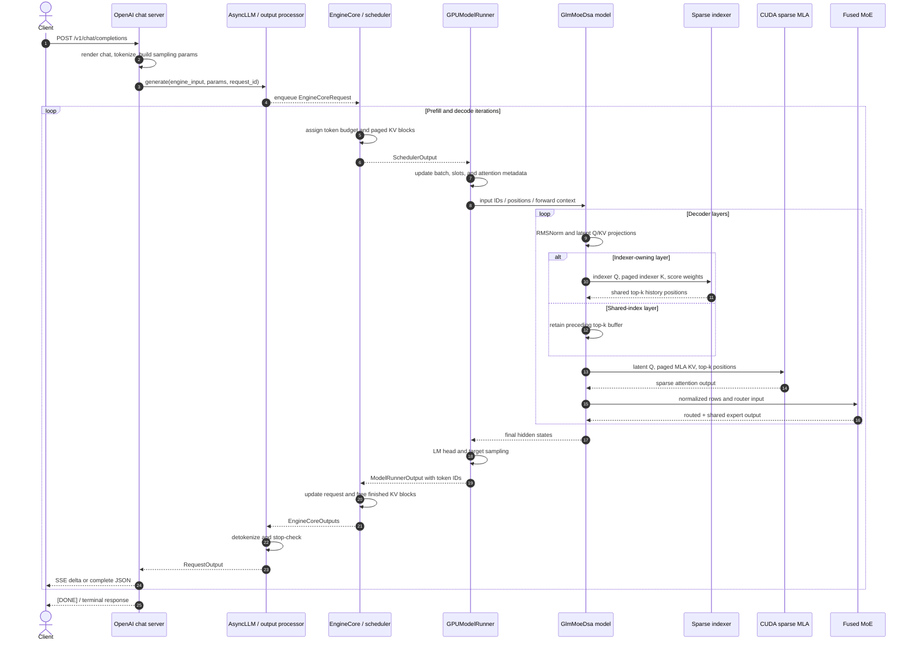

# GLM-5.2 on vLLM: Request-to-GPU Backend Inference Path

**Repository:** [vllm-project/vllm](https://github.com/vllm-project/vllm) @
`5c9ff5366b039a69b344773bdfead8466ed9a097` (clean, static reading)

**Related pages:** [vLLM](index.md),
[vLLM architecture](vllm-overview.md),
[continuous batching](vllm-continuous-batching/index.md),
[MHA to paged KV cache](vllm-mha-code-path.md),
[GLM-5.2 on vLLM Ascend](../vllm-ascend/glm-5.2-inference-path.md)

## TL;DR

Upstream vLLM does support the GLM sparse-MoE family directly. The model
registry resolves `GlmMoeDsaForCausalLM` to the shared DeepSeek-V2-family
implementation, where checkpoint configuration activates Multi-head Latent
Attention (MLA), sparse history selection, shared index buffers, and routed
[Mixture-of-Experts (MoE)](../../terms/mixture-of-experts.md) layers.

There is no single universal “GLM-5.2 backend.” The CUDA platform filters and
ranks sparse-MLA implementations using GPU compute capability, model dtype,
[KV cache](../../terms/kv-cache.md) dtype, block size, local head count,
context-parallel settings, installed dependencies, and an optional explicit
backend override. A Hopper request commonly reaches FlashAttention sparse MLA;
datacenter Blackwell chooses between FlashInfer and FlashMLA sparse paths.

For each generated token, the important data path is:

```text
chat messages
  -> prompt token IDs
  -> scheduled token rows + paged-cache slots
  -> latent Q and latent KV
  -> quantized indexer scores over cached history
  -> top-k history positions
  -> sparse MLA over those positions
  -> routed/shared expert MLPs
  -> vocabulary logits
  -> sampled token ID
  -> detokenized text delta
  -> SSE or JSON response
```

> **Important:** the vLLM repository contains the model class and the generic
> configuration-driven execution path, but not an immutable GLM-5.2 checkpoint
> configuration. The exact dimensions, top-k value, layer-sharing pattern,
> quantization, and ultimately selected GPU backend must therefore be confirmed
> from the deployed checkpoint and server arguments.

## Scope and Mental Model

This page answers: *How does one OpenAI-compatible GLM-5.2 request cross
upstream vLLM and reach detailed NVIDIA GPU work, and how does the result come
back?*

The mental model is: **the scheduler chooses token rows and cache addresses;
the GLM model chooses the layer recipe; the indexer chooses history positions;
the CUDA backend chooses the kernel implementation.** These are separate
decisions:

| Decision | Owner | Result |
|---|---|---|
| What text and sampling policy enter the engine? | OpenAI server and renderer | Prompt IDs plus `SamplingParams` |
| Which requests advance this iteration? | V1 scheduler | Token counts, block tables, slot mappings |
| Is this a sparse MLA layer? | Checkpoint configuration | Indexer and shared top-k buffer construction |
| Which old tokens are relevant? | Sparse indexer | Per-query history positions |
| Which device code consumes them? | CUDA attention selector | Hopper/Blackwell sparse-MLA implementation |
| Which FFNs process each row? | MoE router and runner | Top-k experts, optional dispatch/combine |

The concrete backend trace is NVIDIA CUDA. Upstream vLLM also contains ROCm
and XPU sparse-MLA paths, but following all three to equal kernel depth would
obscure the request round trip; those paths are outside this page's concrete
execution branch.

## Request Round Trip

[Editable Mermaid source](assets/glm-5.2-request-round-trip.mmd)



The diagram includes the return path deliberately. Reaching an attention
kernel is only half of serving: sampled IDs still have to update scheduler
state, pass stop checks, become text, be parsed into content/reasoning/tool
fields, and be emitted before request and cache state can disappear.

## Detailed Request Trace

### 1. The chat endpoint creates engine-ready input

<a class="code-link" href="../../../external-repos/vllm-5c9ff5366b03/vllm/entrypoints/openai/chat_completion/serving.py#L241" data-code-repo="vllm-5c9ff5366b03" data-code-path="vllm/entrypoints/openai/chat_completion/serving.py" data-code-line="241" data-code-end-line="396"><code>OpenAIServingChat._create_chat_completion</code></a>
renders the conversation, extracts prompt token IDs, computes the legal
completion length, converts API fields into sampling parameters, assigns a
request ID, and calls the engine client. Streaming versus full-response mode
branches only after it obtains the asynchronous result generator.

**Input state:** chat messages, tools, parser settings, and sampling fields.

**Output state:** tokenized `EngineInput`, `SamplingParams`, request metadata,
and a generator of future `RequestOutput` objects.

### 2. `AsyncLLM` admits the request across the process boundary

<a class="code-link" href="../../../external-repos/vllm-5c9ff5366b03/vllm/v1/engine/async_llm.py#L550" data-code-repo="vllm-5c9ff5366b03" data-code-path="vllm/v1/engine/async_llm.py" data-code-line="550" data-code-end-line="624"><code>AsyncLLM.generate</code></a>
creates the per-request output collector, processes and enqueues the request in
the separate engine core, and yields objects pushed by the background output
handler. If the client disconnects, this same boundary aborts the core request.

The engine process then repeats
<a class="code-link" href="../../../external-repos/vllm-5c9ff5366b03/vllm/v1/engine/core.py#L583" data-code-repo="vllm-5c9ff5366b03" data-code-path="vllm/v1/engine/core.py" data-code-line="583" data-code-end-line="613"><code>EngineCore.step</code></a>:
schedule a batch, launch model execution, sample if execution and sampling were
split, and feed the result back to the scheduler.

### 3. Continuous scheduling assigns work and cache capacity

The scheduler explicitly says that it has no global “prefill phase” followed
by a global “decode phase.”
<a class="code-link" href="../../../external-repos/vllm-5c9ff5366b03/vllm/v1/core/sched/scheduler.py#L476" data-code-repo="vllm-5c9ff5366b03" data-code-path="vllm/v1/core/sched/scheduler.py" data-code-line="476" data-code-end-line="487"><code>Scheduler.schedule</code></a>
instead advances each request's computed-token count toward its prompt,
sampled output, and optional speculative tokens under a shared token budget.

For a running request, the
<a class="code-link" href="../../../external-repos/vllm-5c9ff5366b03/vllm/v1/core/sched/scheduler.py#L628" data-code-repo="vllm-5c9ff5366b03" data-code-path="vllm/v1/core/sched/scheduler.py" data-code-line="628" data-code-end-line="701"><code>KV-slot allocation loop</code></a>
asks the cache manager for enough new blocks. On failure it preempts a victim,
restores that request's budgets, and retries. Success records the new block IDs
and number of token rows that this request contributes to `SchedulerOutput`.

**Output state:** a mixed batch of request rows, scheduled-token counts,
physical cache blocks, speculative tokens, and cache-copy/zeroing work.

### 4. The GPU runner materializes tensors and launches the model

<a class="code-link" href="../../../external-repos/vllm-5c9ff5366b03/vllm/v1/worker/gpu_model_runner.py#L4494" data-code-repo="vllm-5c9ff5366b03" data-code-path="vllm/v1/worker/gpu_model_runner.py" data-code-line="4494" data-code-end-line="4655"><code>GPUModelRunner.execute_model</code></a>
turns scheduler state into per-group slot mappings and attention metadata,
prepares input IDs/embeddings and positions, installs them in the forward
context, runs the compiled/eager/CUDA-graph model, selects hidden rows that need
logits, and applies the model's LM head.

This is the first point where the scheduler's logical choice becomes concrete
device state:

| Runtime object | What it tells the GPU |
|---|---|
| `input_ids`, `positions` | Which token rows to execute and their sequence positions |
| query start locations | Where each request's rows begin in the flattened batch |
| block tables | Which physical pages hold each request's history |
| slot mappings | Where the new latent KV and indexer K entries are written |
| attention metadata | Prefill/decode split, lengths, backend workspaces, graph shape |

### 5. The registry selects a shared model implementation

The model registry maps
<a class="code-link" href="../../../external-repos/vllm-5c9ff5366b03/vllm/model_executor/models/registry.py#L118" data-code-repo="vllm-5c9ff5366b03" data-code-path="vllm/model_executor/models/registry.py" data-code-line="118"><code>GlmMoeDsaForCausalLM</code></a>
to the shared DeepSeek-V2-family model module. The resulting
<a class="code-link" href="../../../external-repos/vllm-5c9ff5366b03/vllm/model_executor/models/deepseek_v2.py#L1931" data-code-repo="vllm-5c9ff5366b03" data-code-path="vllm/model_executor/models/deepseek_v2.py" data-code-line="1931" data-code-end-line="1932"><code>GLM class</code></a>
is a zero-override subclass.

That does not mean GLM and DeepSeek checkpoints are identical. It means their
inference-time module contract is similar enough that checkpoint configuration
and weights parameterize the same
<a class="code-link" href="../../../external-repos/vllm-5c9ff5366b03/vllm/model_executor/models/deepseek_v2.py#L1794" data-code-repo="vllm-5c9ff5366b03" data-code-path="vllm/model_executor/models/deepseek_v2.py" data-code-line="1794" data-code-end-line="1904"><code>DeepseekV2ForCausalLM shell</code></a>:
model body, LM head, logits processor, MoE metadata, forward, and logits.

<a class="code-link" href="../../../external-repos/vllm-5c9ff5366b03/vllm/model_executor/models/deepseek_v2.py#L1427" data-code-repo="vllm-5c9ff5366b03" data-code-path="vllm/model_executor/models/deepseek_v2.py" data-code-line="1427" data-code-end-line="1504"><code>DeepseekV2Model.forward</code></a>
embeds tokens, walks the pipeline-local decoder layers, carries the residual
stream, and gathers sequence-parallel state when required. Each
<a class="code-link" href="../../../external-repos/vllm-5c9ff5366b03/vllm/model_executor/models/deepseek_v2.py#L1286" data-code-repo="vllm-5c9ff5366b03" data-code-path="vllm/model_executor/models/deepseek_v2.py" data-code-line="1286" data-code-end-line="1357"><code>decoder layer</code></a>
runs input RMSNorm, attention, post-attention RMSNorm, and a dense or MoE MLP.

### 6. Sparse construction separates index owners from index consumers

The sparse switch is configuration-driven. In
<a class="code-link" href="../../../external-repos/vllm-5c9ff5366b03/vllm/model_executor/models/deepseek_v2.py#L1080" data-code-repo="vllm-5c9ff5366b03" data-code-path="vllm/model_executor/models/deepseek_v2.py" data-code-line="1080" data-code-end-line="1179"><code>DeepseekV2MLAAttention construction</code></a>,
the presence of `index_topk` marks the model as sparse. An
`index_topk_pattern` or frequency rule determines whether this layer builds an
Indexer. Regardless, the MLA wrapper receives `is_sparse=True` and the shared
top-k buffer.

The buffer is allocated once in
<a class="code-link" href="../../../external-repos/vllm-5c9ff5366b03/vllm/model_executor/models/deepseek_v2.py#L1373" data-code-repo="vllm-5c9ff5366b03" data-code-path="vllm/model_executor/models/deepseek_v2.py" data-code-line="1373" data-code-end-line="1402"><code>DeepseekV2Model.__init__</code></a>
with shape `[max_num_batched_tokens, index_topk]` and is passed into every
decoder layer.

That creates two layer roles:

| Layer role | Local Indexer weights/cache | Runtime action |
|---|---:|---|
| Index owner | Present | Score history and overwrite the shared top-k rows |
| Shared-index consumer | Absent | Reuse the most recently written top-k rows |
| MTP/next-token layer | Forced present initially | Compute before any draft-step reuse toggle |

The actual ordering is visible in
<a class="code-link" href="../../../external-repos/vllm-5c9ff5366b03/vllm/model_executor/layers/mla.py#L150" data-code-repo="vllm-5c9ff5366b03" data-code-path="vllm/model_executor/layers/mla.py" data-code-line="150" data-code-end-line="226"><code>MultiHeadLatentAttentionWrapper.forward</code></a>:
project and normalize latent Q/KV, apply RoPE, optionally run the indexer, run
MLA attention, then apply the output projection.

> **Inference:** a shared layer reuses positions, not attention values. It
> still runs its own Q/KV projections, reads its main MLA cache, performs sparse
> attention, and applies its output projection. The shared object is the
> `int32` top-k index matrix.

### 7. CUDA backend selection is a validated decision, not a hard-coded call

The MLA layer calls
<a class="code-link" href="../../../external-repos/vllm-5c9ff5366b03/vllm/v1/attention/selector.py#L105" data-code-repo="vllm-5c9ff5366b03" data-code-path="vllm/v1/attention/selector.py" data-code-line="105" data-code-end-line="226"><code>get_attn_backend</code></a>
with `use_mla=True` and `use_sparse=True`. It incorporates explicit backend
overrides and runtime configuration, then delegates to the current platform.

Every candidate passes
<a class="code-link" href="../../../external-repos/vllm-5c9ff5366b03/vllm/v1/attention/backend.py#L367" data-code-repo="vllm-5c9ff5366b03" data-code-path="vllm/v1/attention/backend.py" data-code-line="367" data-code-end-line="452"><code>AttentionBackend.validate_configuration</code></a>.
That rejects a candidate for incompatible head size, dtype, cache dtype, block
size, MLA/sparse mode, compute capability, attention type, DCP/PCP, or other
feature combinations.

CUDA then applies
<a class="code-link" href="../../../external-repos/vllm-5c9ff5366b03/vllm/platforms/cuda.py#L83" data-code-repo="vllm-5c9ff5366b03" data-code-path="vllm/platforms/cuda.py" data-code-line="83" data-code-end-line="143"><code>architecture-specific backend priorities</code></a>
and
<a class="code-link" href="../../../external-repos/vllm-5c9ff5366b03/vllm/platforms/cuda.py#L363" data-code-repo="vllm-5c9ff5366b03" data-code-path="vllm/platforms/cuda.py" data-code-line="363" data-code-end-line="490"><code>selects the highest-priority valid candidate</code></a>.

## Which CUDA Backend Actually Runs?

The following is the useful decision map at the inspected revision. “First
choice” still means first *valid and importable* candidate, not a guarantee.

| GPU family | Typical first sparse candidate | Important gates | Fallback/alternative |
|---|---|---|---|
| Hopper, SM90 | `FLASH_ATTN_MLA_SPARSE` | FP16/BF16 main KV, block size 64, no DCP | `FLASHMLA_SPARSE` when compatible |
| Datacenter Blackwell, SM100 | `FLASHINFER_MLA_SPARSE` for quantized KV or low local head count; otherwise `FLASHMLA_SPARSE` | Head dimensions, cache format, block size, installed libraries | The other of FlashInfer/FlashMLA |
| Consumer Blackwell, SM120 | `FLASHINFER_MLA_SPARSE_SM120` | BF16 model path, supported cache dtype, `index_topk=2048`, FlashInfer sparse API | No universal sparse fallback in the short priority list |

An explicit `--attention-backend` does not bypass validation: an incompatible
forced backend fails early rather than silently executing another kernel.

## The Detailed Sparse-MLA Backend

### Indexer state: a second paged cache beside the main MLA cache

The model-side
<a class="code-link" href="../../../external-repos/vllm-5c9ff5366b03/vllm/model_executor/models/deepseek_v2.py#L633" data-code-repo="vllm-5c9ff5366b03" data-code-path="vllm/model_executor/models/deepseek_v2.py" data-code-line="633" data-code-end-line="808"><code>Indexer</code></a>
constructs replicated query projection, fused K/score projection, K
normalization, a separate paged indexer K cache, and `SparseAttnIndexer`. On the
CUDA BF16 fast path it applies indexer RoPE and FP8 query quantization together,
folding the query scale into per-head score weights.

One token row changes through these representations:

| State | Shape/scope | Meaning |
|---|---|---|
| `hidden_states` | one row at model hidden width | Input to attention and indexer projections |
| indexer Q | one vector per indexer head | Query used only to rank history positions |
| indexer K cache | one quantized vector per cached token | Separate paged search key, not the main latent KV |
| indexer logits | query rows × eligible history | Relevance scores before top-k |
| top-k buffer | query rows × configured K, `int32` | Logical history positions selected for attention |
| main MLA cache | one latent KV plus RoPE state per token | Values and keys consumed by sparse attention |

The deepest common CUDA indexer path is
<a class="code-link" href="../../../external-repos/vllm-5c9ff5366b03/vllm/model_executor/layers/sparse_attn_indexer.py#L295" data-code-repo="vllm-5c9ff5366b03" data-code-path="vllm/model_executor/layers/sparse_attn_indexer.py" data-code-line="295" data-code-end-line="689"><code>sparse_attn_indexer</code></a>:

1. Quantize and scatter each new indexer K to the physical slot mapping.
2. For prefill, gather paged K chunks, run FP8/FP4 MQA scoring, and select
   top-k per row under a bounded logits-memory budget.
3. For decode, score directly against the paged K cache using block tables and
   exact sequence lengths.
4. Choose cooperative CUDA top-k, persistent CUDA top-k, or the generic
   per-row operator according to K, row count, alignment, and GPU family.
5. Under decode context parallelism, merge per-rank candidates into an exact
   global top-k rather than gathering every score.

The result remains request-logical history positions. The attention backend is
responsible for mapping those positions to its physical main-cache layout.

### Main MLA dispatch: prefill and decode are deliberately different

<a class="code-link" href="../../../external-repos/vllm-5c9ff5366b03/vllm/model_executor/layers/attention/mla_attention.py#L780" data-code-repo="vllm-5c9ff5366b03" data-code-path="vllm/model_executor/layers/attention/mla_attention.py" data-code-line="780" data-code-end-line="980"><code>MLAAttention.forward_impl</code></a>
splits the flattened batch into MHA-style prefill rows and MQA-style decode
rows. Sparse prefill can take three forms:

- dense MHA when the context is no larger than K;
- masked MHA when the optimized backend and workspace support a top-k mask;
- sparse MQA when the other routes are unavailable or forced off.

Decode absorbs the no-RoPE query projection into latent-key space, combines it
with the RoPE query, invokes the selected sparse MQA backend, optionally merges
decode-context-parallel partial outputs with log-sum-exp metadata, applies the
value-up projection, and returns hidden-width attention output.

This is why “GLM uses sparse attention” does not imply “every prompt token runs
the same sparse decode kernel.” Long-prompt and one-token decode shapes favor
different algorithms even within one selected backend class.

### Hopper path: request positions become a FlashAttention block table

The
<a class="code-link" href="../../../external-repos/vllm-5c9ff5366b03/vllm/v1/attention/backends/mla/flashattn_mla_sparse.py#L33" data-code-repo="vllm-5c9ff5366b03" data-code-path="vllm/v1/attention/backends/mla/flashattn_mla_sparse.py" data-code-line="33" data-code-end-line="104"><code>FlashAttnMLASparseBackend</code></a>
accepts Hopper, FP16/BF16 main KV, block size 64, sparse configuration, and no
decode context parallelism.

Its
<a class="code-link" href="../../../external-repos/vllm-5c9ff5366b03/vllm/v1/attention/backends/mla/flashattn_mla_sparse.py#L210" data-code-repo="vllm-5c9ff5366b03" data-code-path="vllm/v1/attention/backends/mla/flashattn_mla_sparse.py" data-code-line="210" data-code-end-line="260"><code>decode implementation</code></a>:

1. converts each request-local selected position through the request's block
   table to a physical cache index;
2. views the paged latent cache as K-RoPE state plus latent values;
3. calls FlashAttention varlen with the physical selected-position matrix as
   its block table and the valid selected count as `seqused_k`;
4. returns latent per-head output to the common value-up projection.

### Blackwell paths: the same contract, different launchers and cache formats

The FlashInfer implementation's
<a class="code-link" href="../../../external-repos/vllm-5c9ff5366b03/vllm/v1/attention/backends/mla/flashinfer_mla_sparse.py#L380" data-code-repo="vllm-5c9ff5366b03" data-code-path="vllm/v1/attention/backends/mla/flashinfer_mla_sparse.py" data-code-line="380" data-code-end-line="469"><code>forward_mqa</code></a>
localizes top-k positions to physical pages, allocates a reusable workspace,
applies cache-dependent score scales, and invokes FlashInfer's TRT-LLM batch
decode with `sparse_mla_top_k`. It can return log-sum-exp values for exact DCP
recombination.

The FlashMLA alternative's
<a class="code-link" href="../../../external-repos/vllm-5c9ff5366b03/vllm/v1/attention/backends/mla/flashmla_sparse.py#L802" data-code-repo="vllm-5c9ff5366b03" data-code-path="vllm/v1/attention/backends/mla/flashmla_sparse.py" data-code-line="802" data-code-end-line="869"><code>BF16 sparse kernel and dispatch</code></a>
pads head count when required by the kernel, calls `flash_mla_sparse_fwd`, and
also contains a separate packed FP8 cache route. The CUDA selector's priority
rules exist because these launchers win in different head-count and cache-dtype
regimes.

> **Intuition:** the indexer is a search engine over cached tokens; sparse MLA
> is the reader. The search engine returns logical document IDs, then the
> backend translates them through the request's page table before reading the
> latent cache.

## The MoE Backend After Attention

Attention returns one hidden row per scheduled token. The decoder layer then
normalizes that row and invokes either a dense MLP or MoE. The
<a class="code-link" href="../../../external-repos/vllm-5c9ff5366b03/vllm/model_executor/models/deepseek_v2.py#L279" data-code-repo="vllm-5c9ff5366b03" data-code-path="vllm/model_executor/models/deepseek_v2.py" data-code-line="279" data-code-end-line="416"><code>DeepseekV2MoE</code></a>
builds a gate, optional shared-expert MLP, and a `FusedMoEFactory` runner using
the checkpoint's expert count, experts per token, grouped-top-k policy,
scoring function, correction bias, and routed scaling factor.

There are two deepest expert routes in
<a class="code-link" href="../../../external-repos/vllm-5c9ff5366b03/vllm/model_executor/layers/fused_moe/runner/moe_runner.py#L570" data-code-repo="vllm-5c9ff5366b03" data-code-path="vllm/model_executor/layers/fused_moe/runner/moe_runner.py" data-code-line="570" data-code-end-line="619"><code>MoERunner._apply_quant_method</code></a>:

| Quantized expert style | Routing boundary | Expert call |
|---|---|---|
| Modular | Router produces top-k expert IDs and weights first | Routed expert method consumes rows, IDs, and weights |
| Monolithic | Runner passes router logits directly | Quantized kernel routes and computes internally |

Around that kernel,
<a class="code-link" href="../../../external-repos/vllm-5c9ff5366b03/vllm/model_executor/layers/fused_moe/runner/moe_runner.py#L781" data-code-repo="vllm-5c9ff5366b03" data-code-path="vllm/model_executor/layers/fused_moe/runner/moe_runner.py" data-code-line="781" data-code-end-line="884"><code>MoERunner dispatch and combine</code></a>
may dispatch rows/router logits across data/expert ranks, compute shared experts
on an overlapping stream, invoke routed experts, combine distributed outputs,
add shared and routed contributions, and apply the required reduction.

The exact GEMM implementation is not GLM-specific. It depends on weight
quantization, GPU, tensor/expert/data parallel sizes, available modular kernels,
and whether the chosen method owns dispatch/combine internally.

## Sampling and the Return Path

After the final decoder layer, the GPU runner selects only rows that require
logits and calls the model's LM head. Then
<a class="code-link" href="../../../external-repos/vllm-5c9ff5366b03/vllm/v1/worker/gpu_model_runner.py#L4673" data-code-repo="vllm-5c9ff5366b03" data-code-path="vllm/v1/worker/gpu_model_runner.py" data-code-line="4673" data-code-end-line="4713"><code>GPUModelRunner.sample_tokens</code></a>
applies any grammar mask, invokes target sampling or rejection sampling, and
updates persistent worker-side token state.

The runner packages request ordering, valid sampled IDs, log probabilities,
connector metadata, and optional routed-expert traces into
<a class="code-link" href="../../../external-repos/vllm-5c9ff5366b03/vllm/v1/worker/gpu_model_runner.py#L4887" data-code-repo="vllm-5c9ff5366b03" data-code-path="vllm/v1/worker/gpu_model_runner.py" data-code-line="4887" data-code-end-line="4913"><code>ModelRunnerOutput</code></a>.

Back in the engine process,
<a class="code-link" href="../../../external-repos/vllm-5c9ff5366b03/vllm/v1/core/sched/scheduler.py#L1733" data-code-repo="vllm-5c9ff5366b03" data-code-path="vllm/v1/core/sched/scheduler.py" data-code-line="1733" data-code-end-line="2036"><code>Scheduler.update_from_output</code></a>
associates sampled IDs with requests, resolves accepted speculative tokens,
updates completion state, creates `EngineCoreOutput`, and removes stopped
requests from scheduling queues. Its
<a class="code-link" href="../../../external-repos/vllm-5c9ff5366b03/vllm/v1/core/sched/scheduler.py#L2388" data-code-repo="vllm-5c9ff5366b03" data-code-path="vllm/v1/core/sched/scheduler.py" data-code-line="2388" data-code-end-line="2442"><code>cleanup path</code></a>
frees encoder and KV state immediately or defers block reuse until in-flight GPU
writes are known to be complete.

The frontend
<a class="code-link" href="../../../external-repos/vllm-5c9ff5366b03/vllm/v1/engine/output_processor.py#L598" data-code-repo="vllm-5c9ff5366b03" data-code-path="vllm/v1/engine/output_processor.py" data-code-line="598" data-code-end-line="724"><code>OutputProcessor.process_outputs</code></a>
detokenizes new IDs, checks stop strings, updates log probabilities, creates a
`RequestOutput`, queues it for `AsyncLLM.generate`, and removes completed
frontend state.

Finally, the chat server's
<a class="code-link" href="../../../external-repos/vllm-5c9ff5366b03/vllm/entrypoints/openai/chat_completion/serving.py#L603" data-code-repo="vllm-5c9ff5366b03" data-code-path="vllm/entrypoints/openai/chat_completion/serving.py" data-code-line="603" data-code-end-line="795"><code>streaming response loop</code></a>
parses each delta into content, reasoning, or tool calls, serializes the
OpenAI-compatible chunk, and yields Server-Sent Events (SSE). Its
<a class="code-link" href="../../../external-repos/vllm-5c9ff5366b03/vllm/entrypoints/openai/chat_completion/serving.py#L879" data-code-repo="vllm-5c9ff5366b03" data-code-path="vllm/entrypoints/openai/chat_completion/serving.py" data-code-line="879" data-code-end-line="886"><code>terminal branch</code></a>
converts errors or emits the final `[DONE]` event.

## One Decode Token, End to End

Assume request `r7` has a long cached prompt and the scheduler advances it by
one token:

| Step | Actor | Input state | Action | Output state |
|---:|---|---|---|---|
| 1 | Scheduler | `r7` computed through position `t-1` | Reserve one token and any needed cache page | One scheduled row plus block/slot metadata |
| 2 | GPU runner | Mixed `SchedulerOutput` | Insert `r7` into the persistent batch and build per-backend metadata | Flattened row, position `t`, physical slot, block table |
| 3 | GLM decoder | Hidden row at position `t` | RMSNorm and latent Q/KV projection | Q plus new latent KV/RoPE state |
| 4 | Index owner | Indexer Q and quantized paged indexer K history | Score eligible past tokens and select top-k | Logical history positions in shared `int32` buffer |
| 5 | Sparse backend | Q, main latent cache, top-k positions, block table | Translate positions to physical pages and run sparse MLA | Per-head latent attention output |
| 6 | MLA wrapper | Latent output | Value-up and output projection | Hidden-width attention contribution |
| 7 | MoE runner | Post-attention normalized row | Route, run selected/shared experts, combine | Hidden-width FFN contribution |
| 8 | GPU runner | Final normalized hidden row | LM head, logits processors, target sampler | One sampled token ID |
| 9 | Scheduler/frontend | Sampled ID and request state | Commit/finish, detokenize, parse delta | Text/reasoning/tool-call delta |
| 10 | Chat server | `RequestOutput` | Serialize OpenAI chunk | SSE event visible to the client |

On the next decode iteration, that sampled ID becomes model input, and the new
main-MLA and indexer-K cache entries become part of the searchable history.

## Offline, Load-Time, and Runtime Work

| Phase | Important work |
|---|---|
| Checkpoint production | Choose architecture name, dimensions, expert layout, index top-k/pattern, and weight quantization |
| Engine initialization | Resolve `GlmMoeDsaForCausalLM`, instantiate index-owner/shared layers, allocate main and indexer cache specs, validate one attention backend, load weights, prepare MoE kernels, profile memory, and capture eligible graph shapes |
| Request admission | Render/tokenize chat and construct sampling/parser state |
| Every engine iteration | Schedule rows/blocks, build metadata, run model/indexer/attention/MoE, sample, update request state, detokenize, and emit output |
| Request completion | Free or safely defer cache blocks and remove engine/frontend request records |

Backend selection belongs to initialization, not the hot loop. Shared indexer
selection and attention/MoE execution belong to every scheduled forward.

## Where It Breaks or Changes Path

| Condition | What changes or fails |
|---|---|
| Checkpoint architecture does not advertise `GlmMoeDsaForCausalLM` | The registry selects another model class; this model trace no longer applies. |
| Configuration has no `index_topk` | The shared implementation builds dense MLA rather than the sparse indexer path. |
| Index-sharing pattern differs from the assumed checkpoint | Different layers own versus reuse the top-k buffer; inspect `index_topk_pattern` or frequency fields. |
| Forced backend violates dtype, block-size, compute-capability, DCP/PCP, or sparse constraints | Initialization raises a backend validation error. |
| Hopper uses quantized main KV | FlashAttention sparse MLA rejects it; another compatible sparse backend is needed. |
| Hopper FlashAttention sparse MLA with DCP | Validation rejects the combination. |
| Blackwell dependency or dimension checks fail | FlashInfer/FlashMLA is filtered; selection falls through or reports that no valid backend exists. |
| Short prefill or context length no larger than K | The common wrapper may use dense MHA; do not infer decode-kernel behavior from prefill traces. |
| Indexer logits exceed the configured memory budget | Prefill scoring is split into smaller query/request chunks. |
| MoE quantization or parallel configuration changes | Router ownership, expert kernel, dispatch/combine, and reduction points can all change. |
| Client disconnects or a stop string is detected | `AsyncLLM` aborts the core request, or the output processor requests an abort after frontend stop detection. |

## Verification Boundary

> **Evidence:** the checkout was clean and pinned at
> `5c9ff5366b039a69b344773bdfead8466ed9a097`. The request, scheduler, model,
> CUDA-selection, indexer, sparse-attention, MoE, sampling, output, and cleanup
> claims above are linked to that immutable implementation.
>
> **Inference:** this was static reading. No GLM-5.2 checkpoint or configuration
> was frozen with the source, and no HTTP server, NVIDIA GPU, CUDA graph,
> attention kernel, MoE kernel, sampler, or parser was executed. Consequently,
> the page explains the supported upstream path and its dispatch conditions; it
> is not a runtime verification of one specific GLM-5.2 deployment.

## Recommended Code-Reading Order

1. Start at the chat endpoint and `AsyncLLM.generate` to establish ownership.
2. Read `EngineCore.step` and `Scheduler.schedule` to understand the batch
   contract received by the worker.
3. Read `GPUModelRunner.execute_model` to see where token counts become tensors,
   slot mappings, attention metadata, and logits.
4. Read `GlmMoeDsaForCausalLM`, the decoder layer, and the MLA wrapper to see
   how checkpoint configuration controls the shared implementation.
5. Read the attention selector and CUDA priorities before choosing one backend
   file; otherwise it is easy to study a kernel that the deployment cannot use.
6. Follow `Indexer.forward` into `sparse_attn_indexer`, then the selected sparse
   MLA backend.
7. Finish with `DeepseekV2MoE`, `MoERunner`, sampling, scheduler update,
   detokenization, and SSE serialization.

## One Thing to Remember

**GLM-5.2's upstream vLLM path is configuration-driven composition, not a
standalone GLM backend:** a thin model alias activates a shared sparse-MLA/MoE
stack, the indexer chooses logical history positions, the CUDA selector chooses
the compatible physical kernel, and the V1 runtime carries the resulting token
all the way back to the client.

## Go Deeper

- **Serving architecture:** [vLLM architecture](vllm-overview.md)
- **Scheduling and cache admission:** [vLLM continuous batching](vllm-continuous-batching/index.md)
- **Dense attention contrast:** [vLLM MHA to paged KV cache](vllm-mha-code-path.md)
- **NPU companion:** [GLM-5.2 on vLLM Ascend](../vllm-ascend/glm-5.2-inference-path.md)
- **Evidence map:** [pinned upstream findings](../../../derived/repo-analysis/frameworks/vllm/5c9ff5366b039a69b344773bdfead8466ed9a097/important-files.md)
