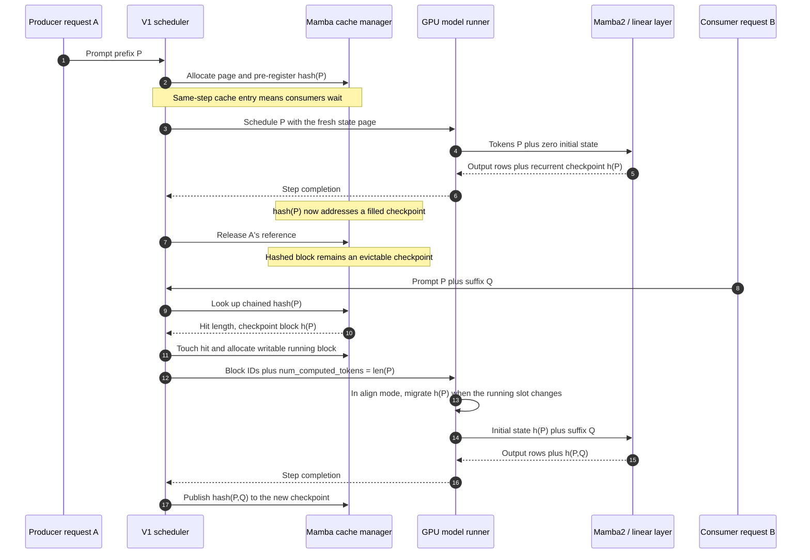

# vLLM Mamba2 and Linear-Attention Prefix-Cache Path

**Repository:** [vllm-project/vllm](https://github.com/vllm-project/vllm) @
`5c9ff5366b039a69b344773bdfead8466ed9a097` (clean, static reading)

**Related pages:** [vLLM](../index.md),
[block-table management](../vllm-block-management/index.md),
[continuous batching](../vllm-continuous-batching/index.md),
[linear attention](../../../algorithms/linear-attention/index.md),
[Gated Delta Networks](../../../training/efficient-attention/gated-delta-networks/index.md)

## TL;DR

**What:** vLLM's Mamba prefix cache does not preserve every old token's K/V
vectors. It associates a chained token-prefix hash with the **recurrent state
after that prefix**—for Mamba2, principally convolution and state-space-model
(SSM) state—so a later request can start from that checkpoint.

**How:** the V1 scheduler finds one safe hit boundary across all cache groups,
adopts the checkpoint's physical block, and sends its block ID plus the hit
length to the GPU runner. The worker maps that block to a state index, migrates
it to a writable running slot when `align` mode crosses a block boundary, and
the Mamba2 or linear-attention kernel processes only the suffix.

**The architectural point:** Mamba2, Gated Delta Network (GDN), and other
[linear-attention](../../../terms/linear-attention.md) implementations share
`MambaSpec`, block-table, hash lookup, allocation, and state-address metadata;
their recurrence kernels and state shapes remain different.

> **Evidence:** this page follows a clean pinned checkout and declared line-level
> evidence. It does not report a GPU execution or performance benchmark. A
> scoped freshness check on 2026-08-24 found relevant upstream changes but
> returned `decision: defer`; the next eligible evidence promotion date is
> 2026-09-01.

## The Mental Model: Cache a Checkpoint, Not a Token History

For ordinary decoder attention, each cached page holds K/V rows for a token
range, and the next query still reads the retained history. For a recurrent
layer, the history has already been folded into a fixed-shape state. Prefix
caching therefore needs the state at the resume boundary, not every earlier
state:

| Question | Full attention | Mamba2 / recurrent linear attention |
|---|---|---|
| Cached value | K/V rows for many tokens | State snapshot after one prefix boundary |
| What a hit returns | Every page covering the reusable prefix | The last usable checkpoint; earlier logical positions can be null |
| Next computation | New queries attend over cached K/V plus new rows | Recurrence resumes from the checkpoint and scans only the suffix |
| Mutable tail | A partially filled K/V page | The current running recurrent-state block |
| Kernel contract | Block table plus per-token slot mapping | Block table reduced to one or a few state-block indices |

The common layer contract is
<a class="code-link" href="../../../../external-repos/vllm-5c9ff5366b03/vllm/model_executor/layers/mamba/abstract.py#L63" data-code-repo="vllm-5c9ff5366b03" data-code-path="vllm/model_executor/layers/mamba/abstract.py" data-code-line="63" data-code-end-line="81"><code>MambaBase.get_kv_cache_spec()</code></a>.
It publishes state shapes and dtypes, the Mamba block size, cache mode, and
speculative-state count as one `MambaSpec`. That is why a non-Mamba algorithm
such as GDN can reuse the Mamba cache manager: **`MambaSpec` means
fixed-shape recurrent state to the serving runtime, not one specific equation.**

<a class="code-link" href="../../../../external-repos/vllm-5c9ff5366b03/vllm/v1/kv_cache_interface.py#L667" data-code-repo="vllm-5c9ff5366b03" data-code-path="vllm/v1/kv_cache_interface.py" data-code-line="667" data-code-end-line="708"><code>MambaSpec</code></a>
also makes the memory consequence explicit: `all` mode budgets a checkpoint
for every Mamba block, `align` budgets two live state pages plus speculative
pages, and `none` budgets one live page plus speculative pages.

## The Producer-to-Consumer Checkpoint Path

*Synthesized sequence from the pinned implementation. It shows the state
checkpoint's ownership changes, not a separate network protocol. Editable
source: [prefix-cache-sequence.mmd](assets/prefix-cache-sequence.mmd).*

### 1. A producer materializes and publishes a state boundary

During slot allocation, the scheduler knows which finalized token boundaries
the upcoming forward will fill, so it eagerly routes them through
<a class="code-link" href="../../../../external-repos/vllm-5c9ff5366b03/vllm/v1/core/single_type_kv_cache_manager.py#L1691" data-code-repo="vllm-5c9ff5366b03" data-code-path="vllm/v1/core/single_type_kv_cache_manager.py" data-code-line="1691" data-code-end-line="1714"><code>MambaManager.cache_blocks()</code></a>.
For every cacheable non-null state page, the generic
<a class="code-link" href="../../../../external-repos/vllm-5c9ff5366b03/vllm/v1/core/block_pool.py#L225" data-code-repo="vllm-5c9ff5366b03" data-code-path="vllm/v1/core/block_pool.py" data-code-line="225" data-code-end-line="299"><code>BlockPool.cache_full_blocks()</code></a>
resolves the request's chained hashes at the Mamba block size and inserts
`(prefix hash, cache-group ID) -> physical state block`.

The hash is therefore registered before the GPU has finished filling the page.
To prevent a waiting request in the same scheduling pass from consuming that
unwritten state, the manager records hashes created this step and
<a class="code-link" href="../../../../external-repos/vllm-5c9ff5366b03/vllm/v1/core/single_type_kv_cache_manager.py#L1477" data-code-repo="vllm-5c9ff5366b03" data-code-path="vllm/v1/core/single_type_kv_cache_manager.py" data-code-line="1477" data-code-end-line="1486"><code>refuses same-step adoption</code></a>.
It becomes a usable checkpoint only after the scheduled forward writes the
state. The index does not reconstruct or serialize that state—it only gives a
later request a stable address for the filled GPU page.

When the producer finishes, the page can have reference count zero without
losing its hash. The
<a class="code-link" href="../../../../external-repos/vllm-5c9ff5366b03/vllm/v1/core/block_pool.py#L719" data-code-repo="vllm-5c9ff5366b03" data-code-path="vllm/v1/core/block_pool.py" data-code-line="719" data-code-end-line="743"><code>free_blocks()</code></a>
policy puts hashed pages at the eviction end of the free queue. The checkpoint
therefore remains reusable until memory pressure chooses that physical page
for a new allocation and evicts its hash.

### 2. A consumer request asks for the longest safe checkpoint

For a waiting request with no computed tokens, the scheduler invokes local
prefix lookup in
<a class="code-link" href="../../../../external-repos/vllm-5c9ff5366b03/vllm/v1/core/sched/scheduler.py#L805" data-code-repo="vllm-5c9ff5366b03" data-code-path="vllm/v1/core/sched/scheduler.py" data-code-line="805" data-code-end-line="818"><code>Scheduler.schedule()</code></a>.
The top-level
<a class="code-link" href="../../../../external-repos/vllm-5c9ff5366b03/vllm/v1/core/kv_cache_manager.py#L232" data-code-repo="vllm-5c9ff5366b03" data-code-path="vllm/v1/core/kv_cache_manager.py" data-code-line="232" data-code-end-line="298"><code>KVCacheManager.get_computed_blocks()</code></a>
caps the hit at `prompt_length - 1`. Even a complete prompt hit must recompute
the final token to produce logits; today that cap can force recomputation of a
whole alignment unit.

The Mamba-specific lookup is deliberately unlike full-attention lookup.
<a class="code-link" href="../../../../external-repos/vllm-5c9ff5366b03/vllm/v1/core/single_type_kv_cache_manager.py#L1294" data-code-repo="vllm-5c9ff5366b03" data-code-path="vllm/v1/core/single_type_kv_cache_manager.py" data-code-line="1294" data-code-end-line="1371"><code>MambaManager.find_longest_cache_hit()</code></a>
searches from the latest permitted boundary backward and stops at the first
matching snapshot. It fills earlier logical block positions with the null block
and returns the single state page at the hit boundary. **The state at token
128 already summarizes tokens 1–128; states at 64 and earlier are unnecessary
for resuming at 128.**

### 3. Hybrid models reconcile one boundary across cache types

A hybrid full-attention + recurrent model cannot independently resume each
group at a different token. The
<a class="code-link" href="../../../../external-repos/vllm-5c9ff5366b03/vllm/v1/core/kv_cache_coordinator.py#L757" data-code-repo="vllm-5c9ff5366b03" data-code-path="vllm/v1/core/kv_cache_coordinator.py" data-code-line="757" data-code-end-line="889"><code>HybridKVCacheCoordinator.find_longest_cache_hit()</code></a>
runs a monotone fixed-point loop: each cache-spec group accepts or lowers the
candidate, and the loop ends only when every group agrees.

| Full-attention hit | Mamba-state hit | Safe combined resume | Why |
|---:|---:|---:|---|
| 128 | 128 | 128 | Both groups have valid state at the same boundary. |
| 128 | 64 | 64 | Attention has more history, but the recurrent state at 128 is absent. |
| 64 | 128 | 64 | The recurrent checkpoint is deeper, but attention K/V from 65–128 is absent. |
| 128 | 96 | 96 only when fine-grained alignment is enabled | Every group and the hash unit must represent the 96-token boundary. |

This is not merely conservative accounting. Starting full attention at 128
and Mamba at 64 would put the layers at different logical sequence positions,
so the next token's hidden state would combine incompatible histories.

### 4. Allocation adopts the checkpoint without letting the consumer corrupt it

Once a hit is accepted,
<a class="code-link" href="../../../../external-repos/vllm-5c9ff5366b03/vllm/v1/core/single_type_kv_cache_manager.py#L229" data-code-repo="vllm-5c9ff5366b03" data-code-path="vllm/v1/core/single_type_kv_cache_manager.py" data-code-line="229" data-code-end-line="286"><code>add_local_computed_blocks()</code></a>
touches the returned physical page, raises its reference count, pads skipped
logical positions with nulls, and attaches the checkpoint to the new request.

In `align` mode, the worker needs one writable running page while older
positions remain index-stable. The specialized
<a class="code-link" href="../../../../external-repos/vllm-5c9ff5366b03/vllm/v1/core/single_type_kv_cache_manager.py#L1547" data-code-repo="vllm-5c9ff5366b03" data-code-path="vllm/v1/core/single_type_kv_cache_manager.py" data-code-line="1547" data-code-end-line="1667"><code>MambaManager.allocate_new_blocks()</code></a>
records which logical column owns the previous state, inserts nulls for skipped
history, allocates the new running page, and applies copy-on-write when a
fine-grained partial-tail hit shares a page that the consumer will overwrite.

The invariant is simple: **a hashed snapshot may be shared; the next mutable
state must be private.**

### 5. The scheduler result becomes a worker-side state address

The scheduler sends per-group block IDs and the hit length as a scheduled new
request. The GPU runner constructs its persistent request state from those
fields in
<a class="code-link" href="../../../../external-repos/vllm-5c9ff5366b03/vllm/v1/worker/gpu_model_runner.py#L1319" data-code-repo="vllm-5c9ff5366b03" data-code-path="vllm/v1/worker/gpu_model_runner.py" data-code-line="1319" data-code-end-line="1363"><code>GPUModelRunner._update_states()</code></a>.
At this point, `num_computed_tokens = hit_length` means “the model state already
represents this many tokens,” while the block-table row tells each cache group
which physical page contains that state.

For `align` mode,
<a class="code-link" href="../../../../external-repos/vllm-5c9ff5366b03/vllm/v1/worker/mamba_utils.py#L1229" data-code-repo="vllm-5c9ff5366b03" data-code-path="vllm/v1/worker/mamba_utils.py" data-code-line="1229" data-code-end-line="1333"><code>preprocess_mamba()</code></a>
derives the previous state column from the hit length, derives the current
running column from `hit + scheduled`, and copies every Mamba group's per-layer
state when those columns differ. This is the concrete handoff from a
read-only prefix checkpoint to the state page that the next forward pass may
mutate.

### 6. Mamba2 loads the checkpoint, scans the suffix, and writes the next one

The shared Mamba metadata builder turns the group block table into state
indices. In
<a class="code-link" href="../../../../external-repos/vllm-5c9ff5366b03/vllm/v1/attention/backends/mamba_attn.py#L504" data-code-repo="vllm-5c9ff5366b03" data-code-path="vllm/v1/attention/backends/mamba_attn.py" data-code-line="504" data-code-end-line="570"><code>BaseMambaAttentionMetadataBuilder._compute_common_metadata()</code></a>,
`all` mode keeps the full table and computes first/last state-block positions;
the other modes reduce it to the running block or speculative window. A
prefill row with `num_computed_tokens > 0` receives
`has_initial_states_p = true`.

The Mamba2 mixer then uses the selected page twice. In its
<a class="code-link" href="../../../../external-repos/vllm-5c9ff5366b03/vllm/model_executor/layers/mamba/mamba_mixer2.py#L815" data-code-repo="vllm-5c9ff5366b03" data-code-path="vllm/model_executor/layers/mamba/mamba_mixer2.py" data-code-line="815" data-code-end-line="893"><code>prefill path</code></a>,
the causal convolution reads cached convolution state, the SSM gathers cached
initial state only for hit rows, and the variable-length scan processes the
scheduled suffix. At the end,
<a class="code-link" href="../../../../external-repos/vllm-5c9ff5366b03/vllm/model_executor/layers/mamba/mamba_mixer2.py#L970" data-code-repo="vllm-5c9ff5366b03" data-code-path="vllm/model_executor/layers/mamba/mamba_mixer2.py" data-code-line="970" data-code-end-line="983"><code>the final-state write</code></a>
stores the new SSM state into the selected page. The producer path can now
hash that checkpoint for another request.

## Why Linear Attention Uses the Same Cache Architecture

The sharing boundary is the serving-state contract, not the math kernel:

| Layer family | Shared serving plumbing | Layer-specific work |
|---|---|---|
| Mamba2 | `MambaSpec`, `MambaManager`, block table, state migration | Convolution state plus selective SSM scan/update |
| GDN / KDA-style layers | Same cache spec, manager, and group addressing | Delta-rule state, gates, correction, and backend-specific kernels |
| MiniMax/Bailing linear attention | Same cache spec, manager, and recurrent page | Q/K/V feature-map recurrence and layer-specific normalization/gating |

For the simpler linear-attention backend,
<a class="code-link" href="../../../../external-repos/vllm-5c9ff5366b03/vllm/v1/attention/backends/linear_attn.py#L63" data-code-repo="vllm-5c9ff5366b03" data-code-path="vllm/v1/attention/backends/linear_attn.py" data-code-line="63" data-code-end-line="94"><code>LinearAttentionMetadataBuilder.build()</code></a>
reduces each request's block table to `state_indices_tensor`. A representative
consumer,
<a class="code-link" href="../../../../external-repos/vllm-5c9ff5366b03/vllm/model_executor/layers/mamba/linear/minimax_linear_attn.py#L277" data-code-repo="vllm-5c9ff5366b03" data-code-path="vllm/model_executor/layers/mamba/linear/minimax_linear_attn.py" data-code-line="277" data-code-end-line="318"><code>MiniMaxText01LinearAttention._forward()</code></a>,
uses that index to select its recurrent cache page before dispatching a prefill
or decode kernel.

So “Mamba cache” in the V1 memory stack is best read as **recurrent-state cache
infrastructure**. It does not imply that every consuming layer runs Mamba2's
selective state-space recurrence.

## `none`, `all`, and `align` Are Different Storage Policies

The user-facing definitions live in
<a class="code-link" href="../../../../external-repos/vllm-5c9ff5366b03/vllm/config/cache.py#L145" data-code-repo="vllm-5c9ff5366b03" data-code-path="vllm/config/cache.py" data-code-line="145" data-code-end-line="165"><code>CacheConfig</code></a>:

| Mode | Prefix caching | Resident state pattern | Runtime consequence |
|---|---|---|---|
| `none` | Disabled | One running page, plus speculative pages | No cross-request state hit; recurrence starts from zero for a new prompt. |
| `all` | Enabled | One checkpoint per Mamba block, plus speculative pages | Directly address old and new boundary states; prefill emits intermediate block-aligned states. |
| `align` | Enabled; default prefix mode | Two live state pages per request, plus speculative pages; older logical columns become null | State migrates when the running column advances; block-aligned and eligible partial-tail checkpoints remain reusable through the global pool. |

`align` is the important memory-saving path. The request's logical block-table
row still covers the full sequence, but only the previous and current state
pages need to remain resident for forward progress. Hash-retained checkpoints
can outlive the producer independently in the global pool.

## Worked Trace: Reuse a 128-Token Checkpoint

Assume one Mamba group with a 64-token Mamba block, prefix caching enabled in
`align` mode, and a consumer prompt sharing the producer's first 128 tokens.

| Step | Actor | Input state | Action | Output state |
|---:|---|---|---|---|
| 1 | Producer Mamba2 layer | Zero state, tokens 1–128 | Runs convolution + SSM recurrence | State page contains `h(1…128)` at logical boundary 128 |
| 2 | Scheduler and cache manager | Chained hash for tokens 1–128, physical state page | Pre-register `(hash128, group) -> page57` and mark it cached this step | Same-pass consumers are deferred while `page57` is still unwritten |
| 3 | Producer forward and completion | Tokens 1–128, `page57` | Writes `h(1…128)`, then later drops the producer reference | The hash now addresses a filled checkpoint; at `ref_cnt = 0` it remains at the eviction end of the free queue |
| 4 | Consumer scheduler | Same first 128 tokens plus suffix | Looks up hashes, capped below full-prompt length | Mamba lookup returns null for logical block 0 and `page57` for block 1; hit length 128 |
| 5 | Allocation | Shared `page57`, fresh request | Touches `page57`; allocates a private running page for the suffix | Consumer owns the checkpoint reference and a writable state destination |
| 6 | GPU runner | `num_computed_tokens = 128`, block-table row | Maps the checkpoint and running page to state indices; copies on a boundary change | Forward metadata names the correct initial and destination states |
| 7 | Consumer Mamba2 layer | Initial `h(1…128)`, scheduled suffix | Scans only the suffix and writes the final recurrent state | Outputs are identical to replaying the prefix, assuming the checkpoint is valid |
| 8 | Cache manager | Finalized suffix boundary | Publishes its chained hash when cacheable | A later request can resume from the deeper checkpoint |

The null at logical block 0 is intentional. Resuming at 128 needs the state
*after* token 128; it does not need the state after token 64.

## Where This Path Stops Being Safe or Useful

| Condition | What happens | Reader consequence |
|---|---|---|
| Prefix caching is disabled (`none`) | No local recurrent checkpoint lookup runs | Every new prompt recomputes from its initial state. |
| The whole prompt matches | Lookup stops below the final token | At least the last token—and sometimes an alignment unit—is recomputed to obtain logits. |
| One hybrid cache group has a shorter hit | The fixed-point coordinator lowers the common boundary | A deeper Mamba checkpoint cannot compensate for missing attention K/V, or vice versa. |
| The cached page reaches the head of the free queue under pressure | Allocation evicts its hash before reusing the page | The next matching request becomes a miss and recomputes the prefix. |
| A partial-tail checkpoint shares a page the consumer must extend | Allocation performs copy-on-write | Reuse remains correct but consumes an extra page and copy before mutation. |
| DCP or PCP is requested for the Mamba finder in this revision | The Mamba manager asserts world size 1 | Do not infer that this recurrent prefix path is context-parallel-ready. |
| A different checkpoint, backend, or cache layout changes state semantics | The saved state may not be compatible | Token equality alone is insufficient across incompatible serving configurations. |
| Upstream behavior after the pinned revision is assumed | The scoped code changed after `5c9ff5366b03` | Re-run the repository freshness workflow after 2026-09-01 before treating this as latest-code documentation. |

## Code Reading Order

For maintenance, read the path in this order:

1. `MambaBase.get_kv_cache_spec()` to learn the state layout contract.
2. `Scheduler.schedule()` and `KVCacheManager.get_computed_blocks()` for
   admission and the hit-length cap.
3. `HybridKVCacheCoordinator.find_longest_cache_hit()` and
   `MambaManager.find_longest_cache_hit()` for boundary selection.
4. `MambaManager.allocate_new_blocks()` for null padding, running-state
   placement, and partial-hit copy-on-write.
5. `GPUModelRunner._update_states()` and `preprocess_mamba()` for the
   scheduler-to-worker handoff.
6. The Mamba2 or linear-attention metadata builder for state indices.
7. The layer kernel for initial-state consumption and final-state write.
8. `MambaManager.cache_blocks()`, its same-step visibility gate, and
   `BlockPool.cache_full_blocks()` for safe publication back into the prefix
   index.

## One Thing to Remember

**A Mamba prefix hit is a resume checkpoint, not a miniature KV history.** The
token hash proves which prefix produced the state, the cache manager keeps one
safe physical snapshot at that boundary, and the worker turns that snapshot
back into the initial recurrent state for suffix-only execution. Mamba2 and
linear-attention layers share this address-and-lifecycle machinery even though
the contents and update equations of their states are different.

## Go Deeper

- **Understand the allocator:** [vLLM Block Table Management](../vllm-block-management/index.md)
- **Understand scheduling:** [vLLM Continuous Batching](../vllm-continuous-batching/index.md)
- **Understand the algorithmic bridge:** [Transformers Are RNNs: Linear Attention](../../../algorithms/linear-attention/index.md)
- **Compare a Mamba2-derived recurrence:** [Gated Delta Networks](../../../training/efficient-attention/gated-delta-networks/index.md)
- **Inspect the evidence map:** [pinned analysis note](../../../../derived/repo-analysis/frameworks/vllm/5c9ff5366b039a69b344773bdfead8466ed9a097/mamba2-linear-attention-prefix-cache-path.md)
