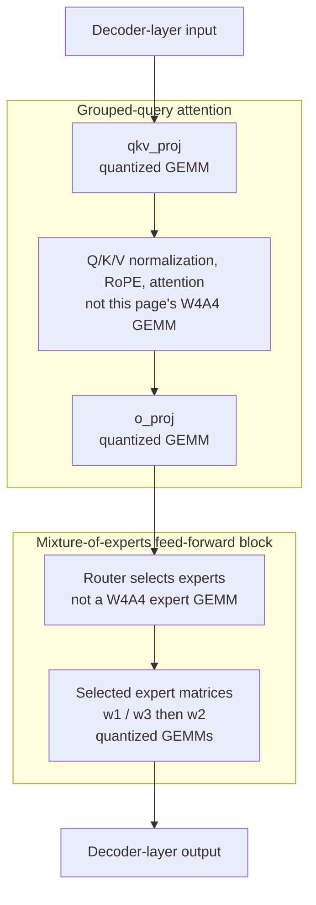
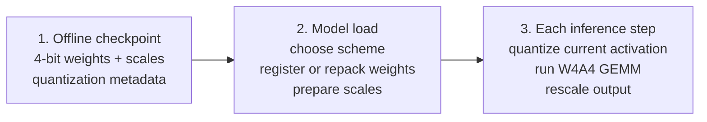
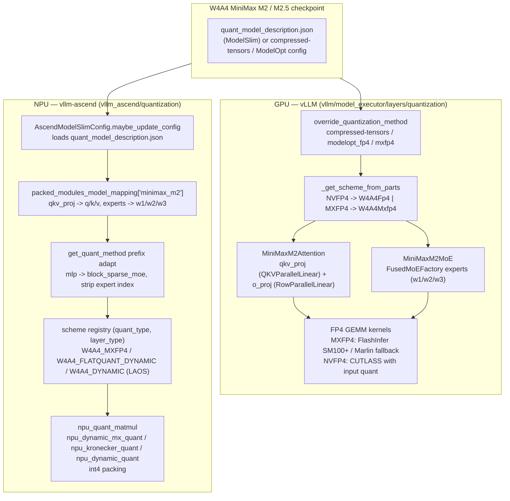

# MiniMax GQA W4A4 Quantization Path: GPU (vLLM) and NPU (vllm-ascend)

**Repositories:**

- [vllm-project/vllm](https://github.com/vllm-project/vllm) @ `72cd5424da80a4a9caa3f42fd65bc0b94e61cbf0` (main, clean)
- [vllm-project/vllm-ascend](https://github.com/vllm-project/vllm-ascend) @ `61221e9add8c717b304005bd9d48d6215d035be7` (main, clean)

**Related pages:** [vLLM Ascend Architecture](../vllm-ascend/architecture.md), [vLLM Kimi K3 Code Reading Map](vllm-kimi-k3-code-reading.md), [vLLM Code Learning Path](vllm-code-learning-path.md), [NVFP4: Blackwell 4-Bit Floating Point](../../hardware/quantization/nvfp4.md), [FlatQuant: Fast Learnable Affine Quantization](../../hardware/quantization/flatquant/index.md), [Quantization](../../hardware/quantization/index.md)

## TL;DR

**Mental model:** W4A4 makes the large matrix multiplications cheaper by using
4-bit weights (**W4**) and converting their input activations to 4-bit
(**A4**) just before multiplication. The model does not stay in 4-bit for its
entire forward pass; scales convert the quantized result back to the precision
expected by the surrounding layers.

**What is quantized:** MiniMax M2/M2.5 attaches these schemes to grouped-query
attention (GQA) projections (`qkv_proj`, `o_proj`) and mixture-of-experts (MoE)
matrices (`w1`, `w2`, `w3`). GPU vLLM reads the checkpoint's Hugging Face
quantization config; vllm-ascend reads a ModelSlim description and dispatches
Ascend operators.

**Important boundary:** This page traces static code at two clean pinned
revisions. It identifies implementation paths and fallbacks, but it does not
claim that the GPU and NPU revisions were run together or benchmarked end to
end.

## Before You Start

| Term | Beginner meaning |
|---|---|
| Weight | A learned matrix stored in the checkpoint. W4 stores each quantized value in 4 bits. |
| Activation | The runtime tensor entering a layer. A4 converts it to 4 bits for the quantized matrix multiplication. |
| Scale | Metadata used to map between a small 4-bit value range and the model's numerical range. |
| GQA | [Grouped-query attention](../../algorithms/attention-variants/grouped-query-attention/) shares fewer key/value heads across more query heads. |
| MoE | [Mixture of Experts](../../terms/mixture-of-experts.md) routes a token through selected feed-forward experts. |
| GEMM | [General matrix multiply](../../terms/gemm.md), the expensive operation these schemes accelerate. |
| Checkpoint | Saved model weights plus configuration describing how those weights are encoded. |

## What This Path Is For

MiniMax M2 and M2.5 decoder layers contain a GQA attention block and a
block-sparse MoE block. W4A4 targets their large learned matrices:

- The GQA attention projections `qkv_proj` (fused q/k/v) and `o_proj` are the dense linear layers that dominate weight size in the attention path.
- The MoE experts (`w1`/`w2`/`w3`) dominate the feed-forward path.

The same three-stage layer contract appears on both platforms:
`create_weights` → `process_weights_after_loading` → `apply`. The implementation
underneath differs: GPU kernels use FlashInfer, CUTLASS, or Marlin; NPU schemes
use Ascend quantization and matrix-multiplication operators.

## What Gets Quantized

[Mermaid source](assets/minimax-gqa-w4a4-layer-map.mmd)

*Synthesized explanation from the pinned model code. ① The attention block uses
W4A4 for its input and output projections, not for normalization, rotary
position encoding, or the attention operation itself. ② The MoE router chooses
experts. ③ The selected experts use W4A4 for their large matrices. The diagram
shows placement, not every residual or normalization edge.*

## The Three Moments of W4A4

[Mermaid source](assets/minimax-gqa-w4a4-lifecycle.mmd)

*Synthesized explanation. ① Weight quantization normally happens before the
server starts. ② Loading selects a compatible scheme and prepares the packed
parameters. ③ During inference, the current activation is dynamically
quantized immediately before the matrix multiplication. This offline/load/runtime
separation is the central mental model for the rest of the page.*

## Detailed Platform Map

[Mermaid source](assets/minimax-gqa-w4a4-path.mmd)

*Synthesized from the pinned checkouts (not a source figure). ① A W4A4 checkpoint carries its quantization contract either in a ModelSlim description file (NPU) or in the HF quant config (GPU). ② GPU vLLM selects a compressed-tensors or ModelOpt W4A4 scheme. ③ MiniMax M2's GQA `qkv_proj`/`o_proj` and MoE `w1/w2/w3` layers receive the scheme. ④ GPU runs FP4 GEMM kernels. ⑤ NPU loads the ModelSlim description, maps MiniMax M2 fused modules, and dispatches each layer to a registered W4A4 scheme that calls NPU quantized matmul operators.*

## The MiniMax M2 GQA Layer Being Quantized

MiniMax M2 is the current MiniMax generation with GQA attention. In <a class="code-link" href="../../../external-repos/vllm-72cd5424da80/vllm/model_executor/models/minimax_m2.py#L137" data-code-repo="vllm-72cd5424da80" data-code-path="vllm/model_executor/models/minimax_m2.py" data-code-line="137" data-code-end-line="201"><code>MiniMaxM2Attention</code></a>:

- `num_kv_heads` is read from `config.num_key_value_heads`; KV heads are partitioned or replicated across tensor-parallel ranks while query heads are always partitioned — the classic GQA pattern.
- The fused projection is a <a class="code-link" href="../../../external-repos/vllm-72cd5424da80/vllm/model_executor/models/minimax_m2.py#L176" data-code-repo="vllm-72cd5424da80" data-code-path="vllm/model_executor/models/minimax_m2.py" data-code-line="176" data-code-end-line="198"><code>QKVParallelLinear</code> `qkv_proj`</a> and `RowParallelLinear` `o_proj`, both constructed with the model's `quant_config` — this is where the W4A4 quant method attaches.
- The forward is `qkv_proj → q/k/v norm → RoPE → Attention → o_proj`.

The MoE side is <a class="code-link" href="../../../external-repos/vllm-72cd5424da80/vllm/model_executor/models/minimax_m2.py#L70" data-code-repo="vllm-72cd5424da80" data-code-path="vllm/model_executor/models/minimax_m2.py" data-code-line="70" data-code-end-line="96"><code>MiniMaxM2MoE</code></a>, which builds a `FusedMoEFactory` with `ckpt_names=("w1","w2","w3")` and passes the same `quant_config` to the experts.

Two details matter for quantization:

1. `MiniMaxM2ForCausalLM` declares `packed_modules_mapping = {"qkv_proj": ["q_proj","k_proj","v_proj"]}` (see <a class="code-link" href="../../../external-repos/vllm-72cd5424da80/vllm/model_executor/models/minimax_m2.py#L430" data-code-repo="vllm-72cd5424da80" data-code-path="vllm/model_executor/models/minimax_m2.py" data-code-line="430" data-code-end-line="437"><code>MiniMaxM2ForCausalLM</code></a>). The compressed-tensors loader uses this to load the three shards into one quantized fused parameter.
2. The weight mapper folds `.q_proj`/`.k_proj`/`.v_proj` onto `.qkv_proj` shards.

## GPU Path: W4A4 in vLLM

Map the next four steps onto the lifecycle above: checkpoint discovery records
the offline contract; scheme selection and weight preparation happen while the
model loads; kernel execution happens for each inference step.

### Step 1 — Checkpoint config discovery

A W4A4 MiniMax M2/M2.5 checkpoint declares its format in the HF quant config. Three GPU routes exist in this vllm revision:

| Checkpoint signature | Resolved method | W4A4? |
|---|---|---|
| `quant_method: "compressed-tensors"` + `format: mxfp4` / `nvfp4`, `strategy: w4a4` | `CompressedTensorsConfig` | Yes |
| `quant_method: "modelopt"` + `quant_algo: NVFP4` | `ModelOptNvFp4Config` | Yes |
| `quant_method: "mxfp4"` (GPT-OSS style) | `GptOssMxfp4Config` | MoE only |
| `quant_method: "mxfp8"` (MiniMax-style) | `ModelOptMxFp8Config` | No — W8A8 |

MiniMax-style checkpoints tag `quant_method: "mxfp8"`; <a class="code-link" href="../../../external-repos/vllm-72cd5424da80/vllm/model_executor/layers/quantization/modelopt.py#L1719" data-code-repo="vllm-72cd5424da80" data-code-path="vllm/model_executor/layers/quantization/modelopt.py" data-code-line="1719" data-code-end-line="1744"><code>ModelOptMxFp8Config.from_config()</code></a> normalizes that to the ModelOpt MXFP8 schema (8-bit floats), so the *true* W4A4 GPU path comes from compressed-tensors or ModelOpt NVFP4 checkpoints, not from the MXFP8 tag.

### Step 2 — Scheme selection

`CompressedTensorsConfig` builds a per-target scheme map, and `_get_scheme_from_parts()` (see <a class="code-link" href="../../../external-repos/vllm-72cd5424da80/vllm/model_executor/layers/quantization/compressed_tensors/compressed_tensors.py#L722" data-code-repo="vllm-72cd5424da80" data-code-path="vllm/model_executor/layers/quantization/compressed_tensors/compressed_tensors.py" data-code-line="722" data-code-end-line="748"><code>compressed_tensors.py</code></a>) dispatches by the weight's quant format:

- **NVFP4 weights** → `CompressedTensorsW4A4Fp4(use_a16=True)` when the checkpoint has no input-activation quantization (that is W4A16 weight-only), or `CompressedTensorsW4A4Fp4()` for true W4A4 with runtime activation quantization.
- **MXFP4 weights** → `CompressedTensorsW4A4Mxfp4()` — always treated as W4A4-capable.

Each linear layer gets its scheme stored on `layer.scheme` and is wrapped in `CompressedTensorsLinearMethod`, which implements the standard `create_weights` / `process_weights_after_loading` / `apply` contract.

### Step 3 — The two GPU W4A4 linear schemes

**MXFP4** — <a class="code-link" href="../../../external-repos/vllm-72cd5424da80/vllm/model_executor/layers/quantization/compressed_tensors/schemes/compressed_tensors_w4a4_mxfp4.py#L23" data-code-repo="vllm-72cd5424da80" data-code-path="vllm/model_executor/layers/quantization/compressed_tensors/schemes/compressed_tensors_w4a4_mxfp4.py" data-code-line="23" data-code-end-line="101"><code>CompressedTensorsW4A4Mxfp4</code></a>:

- 4-bit float weights (E2M1) packed two per uint8 byte: `weight_packed` shape `(out, in // 2)`.
- Per-group E8M0 scales, `group_size = 32`, no global scale.
- On SM100+ with FlashInfer this is *true* W4A4 — activations are dynamically quantized at GEMM time. On older GPUs it degrades to W4A16 weight-only via Marlin.
- `min_capability = 80`.

**NVFP4** — <a class="code-link" href="../../../external-repos/vllm-72cd5424da80/vllm/model_executor/layers/quantization/compressed_tensors/schemes/compressed_tensors_w4a4_nvfp4.py#L28" data-code-repo="vllm-72cd5424da80" data-code-path="vllm/model_executor/layers/quantization/compressed_tensors/schemes/compressed_tensors_w4a4_nvfp4.py" data-code-line="28" data-code-end-line="148"><code>CompressedTensorsW4A4Fp4</code></a>:

- Packed FP4 weights plus a per-tensor global weight scale and per-group FP8 (E4M3) scales, `group_size = 16`.
- In W4A4 mode it also loads an `input_global_scale` and precomputes `alpha = input_global_scale * weight_global_scale` for the runtime activation-quantization path (`process_weights_after_loading`).
- `min_capability = 75`; true W4A4 with input-activation quantization requires SM100+ (Blackwell), while SM75–SM90 uses Marlin W4A16 weight-only fallback.

The **bare `mxfp4` method** (`Mxfp4Config`) is NOT a complete GPU W4A4 linear path in this revision: <a class="code-link" href="../../../external-repos/vllm-72cd5424da80/vllm/model_executor/layers/quantization/mxfp4.py#L82" data-code-repo="vllm-72cd5424da80" data-code-path="vllm/model_executor/layers/quantization/mxfp4.py" data-code-line="82" data-code-end-line="108"><code>Mxfp4Config.get_quant_method()</code></a> returns `UnquantizedLinearMethod` for `LinearBase` (with a "not implemented" debug log) and only implements MoE via `Mxfp4MoEMethod` / `GptOssMxfp4MoEMethod`. So for MiniMax M2's dense GQA `qkv_proj`/`o_proj`, the W4A4 path must come from the compressed-tensors W4A4 schemes or ModelOpt NVFP4.

**ModelOpt NVFP4** — <a class="code-link" href="../../../external-repos/vllm-72cd5424da80/vllm/model_executor/layers/quantization/modelopt.py#L1002" data-code-repo="vllm-72cd5424da80" data-code-path="vllm/model_executor/layers/quantization/modelopt.py" data-code-line="1002" data-code-end-line="1098"><code>ModelOptNvFp4Config</code></a> maps `quant_algo: "NVFP4"` to `ModelOptNvFp4LinearMethod` — "W4A4: cutlass NVFP4 GEMM with input quantization" — and `"W4A16_NVFP4"` to the FP4-Marlin weight-only path.

### Step 4 — Forward kernels

The schemes hand off to <a class="code-link" href="../../../external-repos/vllm-72cd5424da80/vllm/model_executor/kernels/linear/__init__.py#L840" data-code-repo="vllm-72cd5424da80" data-code-path="vllm/model_executor/kernels/linear/__init__.py" data-code-line="840" data-code-end-line="875"><code>init_mxfp4_linear_kernel()</code></a> (and `init_nvfp4_linear_kernel()`), which select the best kernel for the current platform with `--linear-backend` filtering and `VLLM_DISABLED_KERNELS` overrides. The chosen kernel implements the actual packed-FP4 [GEMM](../../terms/gemm.md) with dynamic activation quantization.

## NPU Path: W4A4 in vllm-ascend

The NPU side is a ModelSlim-driven flow. ModelSlim quantizes the checkpoint
offline and writes the quantization description. Model loading reads that
description, maps MiniMax names to schemes, and prepares weights; inference
then quantizes each incoming activation and calls the selected Ascend operator.

### Step 1 — Config registration and loading

`AscendModelSlimConfig` is registered as the `"ascend"` quant method (see <a class="code-link" href="../../../external-repos/vllm-ascend-61221e9add8c/vllm_ascend/quantization/modelslim_config.py#L508" data-code-repo="vllm-ascend-61221e9add8c" data-code-path="vllm_ascend/quantization/modelslim_config.py" data-code-line="508" data-code-end-line="560"><code>AscendModelSlimConfig</code></a>). It overrides `get_config_filenames()` to return an empty list so vLLM's standard file lookup is bypassed, then loads the real description file in <a class="code-link" href="../../../external-repos/vllm-ascend-61221e9add8c/vllm_ascend/quantization/modelslim_config.py#L820" data-code-repo="vllm-ascend-61221e9add8c" data-code-path="vllm_ascend/quantization/modelslim_config.py" data-code-line="820" data-code-end-line="900"><code>maybe_update_config()</code></a>, which is invoked by vLLM's engine config after `get_quant_config()`. Each weight key in the JSON maps to a quant type string (e.g. `"W4A4_MXFP4"`, `"W4A4_FLATQUANT_DYNAMIC"`, `"W4A4_DYNAMIC"`, or `"FLOAT"` for skipped layers).

### Step 2 — MiniMax M2 dispatch

Two things make MiniMax M2 work on NPU without a plugin-local model file:

1. **Fused-module mapping.** `packed_modules_model_mapping` (see <a class="code-link" href="../../../external-repos/vllm-ascend-61221e9add8c/vllm_ascend/quantization/modelslim_config.py#L246" data-code-repo="vllm-ascend-61221e9add8c" data-code-path="vllm_ascend/quantization/modelslim_config.py" data-code-line="246" data-code-end-line="254"><code>minimax_m2</code> entry</a>) declares `qkv_proj -> q/k/v` and `experts -> w1/w2/w3`, matching the upstream vLLM model's fused parameter layout so sharding and weight loading stay consistent.
2. **Prefix adaptation + scheme factory.** <a class="code-link" href="../../../external-repos/vllm-ascend-61221e9add8c/vllm_ascend/quantization/modelslim_config.py#L665" data-code-repo="vllm-ascend-61221e9add8c" data-code-path="vllm_ascend/quantization/modelslim_config.py" data-code-line="665" data-code-end-line="759"><code>get_quant_method()</code></a> rewrites MiniMax prefixes (`mlp` → `block_sparse_moe`, strips the expert index so `experts.0` → `experts`), then for each `LinearBase` calls <a class="code-link" href="../../../external-repos/vllm-ascend-61221e9add8c/vllm_ascend/quantization/modelslim_config.py#L469" data-code-repo="vllm-ascend-61221e9add8c" data-code-path="vllm_ascend/quantization/modelslim_config.py" data-code-line="469" data-code-end-line="505"><code>create_scheme_for_layer()</code></a> with `layer_type="linear"`, and for each fused-MoE layer with `layer_type="moe"`.

`create_scheme_for_layer()` resolves the layer's quant type from the description and instantiates the registered scheme class via <a class="code-link" href="../../../external-repos/vllm-ascend-61221e9add8c/vllm_ascend/quantization/methods/registry.py#L52" data-code-repo="vllm-ascend-61221e9add8c" data-code-path="vllm_ascend/quantization/methods/registry.py" data-code-line="52" data-code-end-line="60"><code>get_scheme_class(quant_type, layer_type)</code></a> from the `(quant_type, layer_type)` registry. The scheme is wrapped by <a class="code-link" href="../../../external-repos/vllm-ascend-61221e9add8c/vllm_ascend/quantization/method_adapters.py#L36" data-code-repo="vllm-ascend-61221e9add8c" data-code-path="vllm_ascend/quantization/method_adapters.py" data-code-line="36" data-code-end-line="190"><code>AscendLinearMethod</code></a> (linear) or `AscendFusedMoEMethod` (MoE), which implement the same `create_weights` / `process_weights_after_loading` / `apply` contract as the GPU side.

### Step 3 — The three NPU W4A4 schemes

**W4A4_MXFP4** — <a class="code-link" href="../../../external-repos/vllm-ascend-61221e9add8c/vllm_ascend/quantization/methods/w4a4_mxfp4.py#L42" data-code-repo="vllm-ascend-61221e9add8c" data-code-path="vllm_ascend/quantization/methods/w4a4_mxfp4.py" data-code-line="42" data-code-end-line="123"><code>AscendW4A4MXFP4DynamicLinearMethod</code></a> — [microscaling](../../terms/microscaling.md) FP4: weights packed FP4 (E2M1) as uint8 with per-group E8M0 scales (`group_size` from the quant description, default 32). `apply()` runs `npu_dynamic_mx_quant` to FP4 then `npu_quant_matmul` with E8M0 scales and per-token scales. A matching `W4A4_MXFP4` MoE scheme exists for the experts.

**W4A4_FLATQUANT_DYNAMIC** — <a class="code-link" href="../../../external-repos/vllm-ascend-61221e9add8c/vllm_ascend/quantization/methods/w4a4_flatquant.py#L78" data-code-repo="vllm-ascend-61221e9add8c" data-code-path="vllm_ascend/quantization/methods/w4a4_flatquant.py" data-code-line="78" data-code-end-line="160"><code>AscendW4A4FlatQuantDynamicLinearMethod</code></a> — per-channel INT4 weights (packed to int32 during loading) plus FlatQuant [Kronecker](../../terms/kronecker-product.md) `left_trans`/`right_trans` matrices and a `clip_ratio` that smooth the activation distribution before 4-bit dynamic quantization. `apply()` uses `npu_kronecker_quant` then `npu_quant_matmul`.

**W4A4_DYNAMIC (LAOS)** — <a class="code-link" href="../../../external-repos/vllm-ascend-61221e9add8c/vllm_ascend/quantization/methods/w4a4_laos_dynamic.py#L28" data-code-repo="vllm-ascend-61221e9add8c" data-code-path="vllm_ascend/quantization/methods/w4a4_laos_dynamic.py" data-code-line="28" data-code-end-line="76"><code>AscendW4A4LaosDynamicLinearMethod</code></a> — per-channel INT4 weights with scale and offset, 4-bit dynamic activation quantization via `npu_dynamic_quant` (`quint4x2`), then `npu_quant_matmul` with a per-token scale.

### Step 4 — Forward on NPU

All three schemes converge on the same NPU operator family: `npu_quant_matmul` for the quantized GEMM, plus a scheme-specific activation quantizer (`npu_dynamic_mx_quant` for MXFP4, `npu_kronecker_quant` for FlatQuant, `npu_dynamic_quant` for LAOS). The INT4-based methods (FLATQUANT, LAOS) pack weights via `npu_convert_weight_to_int4pack` in `process_weights_after_loading`; MXFP4 stores FP4 directly in uint8 with E8M0 scales, transposed during loading. The `AscendLinearMethod` adapter supplies TP-rank handling for row-parallel projections such as `o_proj`.

### Step 5 — MiniMax M2 FP8 checkpoint handling

MiniMax M2 official checkpoints are FP8, which the NPU path does not serve directly: <a class="code-link" href="../../../external-repos/vllm-ascend-61221e9add8c/vllm_ascend/patch/platform/patch_minimax_m2_config.py#L61" data-code-repo="vllm-ascend-61221e9add8c" data-code-path="vllm_ascend/patch/platform/patch_minimax_m2_config.py" data-code-line="61" data-code-end-line="90"><code>patch/platform/patch_minimax_m2_config.py</code></a> detects a `minimax_m2` model with `quant_method == "fp8"` on NPU, disables quantization, and loads dequantized bf16 weights instead. This is the inverse of the W4A4 path — it exists because FP8 weights are unsupported on the NPU, so users must either run bf16 or a ModelSlim W4A4/W8A8 checkpoint.

## GPU vs NPU: Same Path, Different Substrate

| Stage | GPU (vLLM) | NPU (vllm-ascend) |
|---|---|---|
| Quant contract | checkpoint HF config (`compressed-tensors` / `modelopt`) | quant_model_description.json via ModelSlim |
| Config object | `CompressedTensorsConfig` / `ModelOptNvFp4Config` | `AscendModelSlimConfig` (`--quantization ascend`) |
| Scheme dispatch | `_get_scheme_from_parts()` by format | `create_scheme_for_layer()` by registry key |
| W4A4 schemes | `CompressedTensorsW4A4Mxfp4`, `CompressedTensorsW4A4Fp4`, ModelOpt NVFP4 | `W4A4_MXFP4`, `W4A4_FLATQUANT_DYNAMIC`, `W4A4_DYNAMIC` (LAOS) |
| Weight layout | FP4 packed 2/byte + E8M0 (MXFP4, group 32) or global+group FP8 (NVFP4, group 16) | FP4 packed (MXFP4) or INT4 packed to int32 (FLATQUANT/LAOS) |
| Activation quant | dynamic at GEMM (FlashInfer SM100+ / CUTLASS NVFP4) | `npu_dynamic_mx_quant` / `npu_kronecker_quant` / `npu_dynamic_quant` |
| Matmul | FP4 GEMM kernel (Marlin W4A16 fallback) | `npu_quant_matmul` |
| MiniMax M2 glue | `packed_modules_mapping` + weight mapper in the MiniMax M2 model module | `packed_modules_model_mapping["minimax_m2"]` + prefix rewrite in `get_quant_method()` |

The common shape is more important than the class names: **metadata chooses a
scheme, loading prepares weights and scales, and runtime quantizes activations
before GEMM**. The two platforms differ mainly in metadata format, packed
representation, and backend operator.

## Hardware Support and Fallbacks

| Input and platform | What the inspected code does |
|---|---|
| GPU MXFP4 or NVFP4 on SM100+ Blackwell | Uses a true W4A4 path with runtime activation quantization. |
| GPU compressed-tensors FP4 on older supported GPUs | Uses the Marlin W4A16 fallback: weights remain 4-bit, but activations do not use the A4 path. |
| GPU bare `mxfp4` method on dense attention projections | Returns an unquantized linear method in this revision; its implemented quantized path is MoE-only. |
| Ascend ModelSlim W4A4 checkpoint | Uses the registered MXFP4, FlatQuant, or LAOS scheme selected for each layer. The inspected unit-test surface primarily covers A2/A3-class paths. |
| Official MiniMax M2 FP8 checkpoint on Ascend | Disables FP8 quantization and loads dequantized bf16 weights instead. |

Do not infer “W4A4” from the model name alone. The checkpoint metadata,
available backend, and accelerator generation together determine whether the
actual path is W4A4, W4A16, unquantized, or bf16.

## Evidence and Verification Limits

- The conclusions come from static reading of two clean, pinned main-branch
  snapshots. No end-to-end serving command or numerical accuracy test was run.
- The vLLM and vllm-ascend commits are independent snapshots; compatibility
  between this exact pair was not executed.
- Kernel names and dispatch conditions show intended implementation behavior,
  but this page does not provide latency, throughput, memory, or accuracy
  measurements.
- The inspected vllm-ascend evidence emphasizes A2/A3-class W4A4 schemes. A5
  and other hardware paths can differ in kernel selection details.

## Where It Breaks

| Failure mode | When it happens | Impact |
|---|---|---|
| MXFP4 on non-SM100 GPU | `CompressedTensorsW4A4Mxfp4` on pre-Blackwell | Degrades to W4A16 Marlin (weight-only), not true W4A4 |
| Bare `mxfp4` method on dense layers | `Mxfp4Config` with MiniMax M2 `qkv_proj`/`o_proj` | Silent fallback to `UnquantizedLinearMethod` — no quantization applied; only MoE is quantized |
| MiniMax `mxfp8` checkpoint on GPU | User expects W4A4 from the `mxfp8` tag | Resolves to ModelOpt MXFP8 (W8A8), not W4A4 |
| NVFP4 parallel shard scales differ | q/k/v shards carry different global scales | Accuracy warning; fused-layer shared global scale is expected |
| MiniMax M2 FP8 on NPU | Official FP8 checkpoint with `--quantization` or auto-detect | fp8 quantization disabled; bf16 dequantized weights loaded instead |
| Missing quant_model_description.json | `--quantization ascend` on an unquantized model | Clear `ValueError` with remediation steps |
| Non-uniform shard quant type | One shard of `qkv_proj` quantized, another not | `ValueError` from `get_linear_quant_type()` |
| Unknown quant type | quant_model_description.json names an unsupported scheme | `NotImplementedError` from `create_scheme_for_layer()` |

## Code Reading Path

After learning the mechanism above, follow this implementation order:

1. **Read the MiniMax M2 model layer** — <a class="code-link" href="../../../external-repos/vllm-72cd5424da80/vllm/model_executor/models/minimax_m2.py#L137" data-code-repo="vllm-72cd5424da80" data-code-path="vllm/model_executor/models/minimax_m2.py" data-code-line="137" data-code-end-line="201"><code>MiniMaxM2Attention</code></a> and <a class="code-link" href="../../../external-repos/vllm-72cd5424da80/vllm/model_executor/models/minimax_m2.py#L70" data-code-repo="vllm-72cd5424da80" data-code-path="vllm/model_executor/models/minimax_m2.py" data-code-line="70" data-code-end-line="96"><code>MiniMaxM2MoE</code></a> — to see which layers carry `quant_config`.
2. **Read the GPU scheme dispatch** — <a class="code-link" href="../../../external-repos/vllm-72cd5424da80/vllm/model_executor/layers/quantization/compressed_tensors/compressed_tensors.py#L722" data-code-repo="vllm-72cd5424da80" data-code-path="vllm/model_executor/layers/quantization/compressed_tensors/compressed_tensors.py" data-code-line="722" data-code-end-line="748"><code>_get_scheme_from_parts()</code></a>, then one scheme (<a class="code-link" href="../../../external-repos/vllm-72cd5424da80/vllm/model_executor/layers/quantization/compressed_tensors/schemes/compressed_tensors_w4a4_mxfp4.py#L23" data-code-repo="vllm-72cd5424da80" data-code-path="vllm/model_executor/layers/quantization/compressed_tensors/schemes/compressed_tensors_w4a4_mxfp4.py" data-code-line="23" data-code-end-line="101"><code>CompressedTensorsW4A4Mxfp4</code></a> or <a class="code-link" href="../../../external-repos/vllm-72cd5424da80/vllm/model_executor/layers/quantization/compressed_tensors/schemes/compressed_tensors_w4a4_nvfp4.py#L28" data-code-repo="vllm-72cd5424da80" data-code-path="vllm/model_executor/layers/quantization/compressed_tensors/schemes/compressed_tensors_w4a4_nvfp4.py" data-code-line="28" data-code-end-line="148"><code>CompressedTensorsW4A4Fp4</code></a>).
3. **Read the NPU config flow** — <a class="code-link" href="../../../external-repos/vllm-ascend-61221e9add8c/vllm_ascend/quantization/modelslim_config.py#L820" data-code-repo="vllm-ascend-61221e9add8c" data-code-path="vllm_ascend/quantization/modelslim_config.py" data-code-line="820" data-code-end-line="900"><code>maybe_update_config()</code></a> → <a class="code-link" href="../../../external-repos/vllm-ascend-61221e9add8c/vllm_ascend/quantization/modelslim_config.py#L665" data-code-repo="vllm-ascend-61221e9add8c" data-code-path="vllm_ascend/quantization/modelslim_config.py" data-code-line="665" data-code-end-line="759"><code>get_quant_method()</code></a> → <a class="code-link" href="../../../external-repos/vllm-ascend-61221e9add8c/vllm_ascend/quantization/methods/w4a4_mxfp4.py#L42" data-code-repo="vllm-ascend-61221e9add8c" data-code-path="vllm_ascend/quantization/methods/w4a4_mxfp4.py" data-code-line="42" data-code-end-line="123"><code>AscendW4A4MXFP4DynamicLinearMethod</code></a> — to see the NPU dispatch and one scheme end-to-end.
4. **Compare the two stacks** using the table above, then read <a class="code-link" href="../../../external-repos/vllm-ascend-61221e9add8c/vllm_ascend/patch/platform/patch_minimax_m2_config.py#L61" data-code-repo="vllm-ascend-61221e9add8c" data-code-path="vllm_ascend/patch/platform/patch_minimax_m2_config.py" data-code-line="61" data-code-end-line="90"><code>patch_minimax_m2_config.py</code></a> for the FP8 exception on NPU.

## One Thing to Remember

**W4A4 is a three-part contract, not just a checkpoint label:** the checkpoint
must carry compatible 4-bit weights and metadata, model loading must select a
supported scheme, and runtime must quantize the current activation before a
matching kernel or operator can perform a true W4A4 GEMM.

## Go Deeper

- **Related quantization pages:** [NVFP4: Blackwell 4-Bit Floating Point](../../hardware/quantization/nvfp4.md), [FlatQuant](../../hardware/quantization/flatquant/index.md), [Quantization hub](../../hardware/quantization/index.md)
- **Serving framework context:** [vLLM Ascend Architecture](../vllm-ascend/architecture.md), [vLLM Code Learning Path](vllm-code-learning-path.md), [vLLM Ascend Kimi K3 MoE Forward](../vllm-ascend/kimi-k3-moe-forward.md)
- **Reproduce:** Both checkouts are clean at the pinned commits. GPU evidence is under `vllm/model_executor/layers/quantization/` and in the MiniMax M2 model module; NPU evidence is under `vllm_ascend/quantization/` and `vllm_ascend/patch/platform/`.
