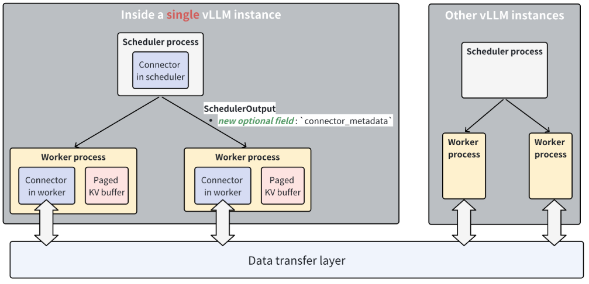

# vLLM Prefill/Decode Disaggregated Deployment Path

**Repository:** [vllm-project/vllm](https://github.com/vllm-project/vllm)

**Inspected commit:** `2d24355eb87b716fc1169e66731dc0386ed1a3a2`

**Verification boundary:** clean, commit-pinned static reading. The proxy, GPUs,
NIXL transport, failure recovery, and multi-node performance were not executed.

## The Short Version

Prefill/decode (PD) disaggregation does not split one vLLM engine in half. It
runs two independently schedulable vLLM pools and adds a router plus a KV data
plane between them:

1. The router sends a one-token generation request to a prefill instance.
2. Prefill computes the prompt and retains its paged [KV cache](../../../terms/kv-cache.md).
3. The router sends a coordinated request to a decode instance.
4. Decode imports the prompt KV into its own block allocation, then generates
   the client-visible token stream.

The main reason to deploy this shape is isolation: prefill resources can be
tuned for time to first token (TTFT), while decode resources can be tuned for
inter-token latency (ITL). vLLM's own feature guide explicitly frames it this
way and warns that disaggregation is not inherently a throughput optimization
in <a class="code-link" href="../../../../external-repos/vllm-2d24355eb87b/docs/features/disagg_prefill.md#L8" data-code-repo="vllm-2d24355eb87b" data-code-path="docs/features/disagg_prefill.md" data-code-line="8" data-code-end-line="16"><code>Why disaggregated prefilling</code></a>.

> **Intuition:** PD disaggregation trades an in-process scheduling interference
> problem for a distributed coordination problem. It can make decode latency
> more predictable, but now correctness depends on routing identity, compatible
> KV layouts, successful transfer, and timely block release.

## What Changes Compared with One vLLM Pool

| Concern | Co-located prefill and decode | PD-disaggregated deployment |
|---|---|---|
| Admission | One scheduler mixes prompt and decode work | Router selects a P instance and a D instance |
| Prompt state | KV remains in the same engine | KV is copied into blocks owned by D |
| Scaling | One replica shape serves both phases | P and D counts and parallelism can scale independently |
| Latency coupling | Prompt work can disturb ongoing decode | Transfer and queueing replace most compute interference |
| Failure scope | One engine/request path | Router, P, D, side channel, and KV data plane can fail independently |
| Capacity accounting | One KV block pool | P must lease source blocks while D allocates destination blocks |
| Correctness contract | One model/configuration | P and D must agree on model and transferable KV layout |

PD is therefore a good fit when tail ITL has a strict service-level objective,
prefill and decode need different accelerator or parallelism shapes, or the two
phases need independent autoscaling. For a simpler deployment, vLLM's ordinary
mixed scheduler plus [chunked prefill](../../../terms/chunked-prefill.md) may be
the better baseline because it avoids the network handoff.

## Deployment Topology

The minimum production shape has three logical planes:

- **Request plane:** an OpenAI-compatible router chooses P and D endpoints and
  preserves request identity and transfer metadata.
- **Engine control plane:** scheduler-side connectors decide which tokens and
  block mappings can come from another engine.
- **KV data plane:** worker-side connectors move device or host buffers through
  NIXL/UCX, GDS, LIBFABRIC, or another connector backend.



*vLLM's original high-level connector design. The scheduler connector emits
opaque metadata; worker connectors touch the paged KV buffers and data-transfer
layer. Source: the pinned
<a class="code-link" href="../../../../external-repos/vllm-2d24355eb87b/docs/features/disagg_prefill.md#L105" data-code-repo="vllm-2d24355eb87b" data-code-path="docs/features/disagg_prefill.md" data-code-line="105" data-code-end-line="116"><code>disaggregated-prefill design documentation</code></a>.*

This separation matters operationally. HTTP success does not prove KV transfer
success, and a healthy worker data plane does not prove the router is pairing
the right request metadata.

## A Minimal NIXL Deployment

A same-host smoke test needs one GPU for P, one for D, distinct HTTP ports, and
distinct NIXL side-channel ports. Use explicit roles; `kv_both` is deprecated
for `NixlConnector`.

```bash
# Prefill / KV producer
CUDA_VISIBLE_DEVICES=0 \
VLLM_NIXL_SIDE_CHANNEL_PORT=5600 \
UCX_NET_DEVICES=all \
vllm serve Qwen/Qwen3-0.6B \
  --port 8100 \
  --kv-transfer-config \
  '{"kv_connector":"NixlConnector","kv_role":"kv_producer","kv_load_failure_policy":"fail"}'

# Decode / KV consumer
CUDA_VISIBLE_DEVICES=1 \
VLLM_NIXL_SIDE_CHANNEL_PORT=5601 \
UCX_NET_DEVICES=all \
vllm serve Qwen/Qwen3-0.6B \
  --port 8200 \
  --kv-transfer-config \
  '{"kv_connector":"NixlConnector","kv_role":"kv_consumer","kv_load_failure_policy":"fail"}'
```

Then place a PD-aware router in front of `8100` and `8200`. Across hosts, set
`VLLM_NIXL_SIDE_CHANNEL_HOST` to a reachable data-plane address. Each worker on
one host needs a unique side-channel port; data-parallel ranks derive ports
from the configured base.

> **Important:** configure UCX/NIXL networking, not just NCCL networking.
> `NCCL_SOCKET_IFNAME` and `NCCL_IB_HCA` do not select the NIXL UCX path.

## One Request, End to End

Assume a chat prompt of 1,024 tokens and a router that chooses P0 and D2.

### 1. The router creates two coordinated legs

The P leg keeps the original prompt but caps generation at one token and marks
the request as producing KV for a remote decoder. The D leg carries the original
generation limit and marks the prompt as remotely prefetched. A shared request
identity joins the two legs.

The push-mode reference router shows the concrete request fields in
<a class="code-link" href="../../../../external-repos/vllm-2d24355eb87b/examples/disaggregated/disaggregated_serving/disagg_proxy_pushconnector_demo.py#L227" data-code-repo="vllm-2d24355eb87b" data-code-path="examples/disaggregated/disaggregated_serving/disagg_proxy_pushconnector_demo.py" data-code-line="227" data-code-end-line="272"><code>PushProxy._push_completion()</code></a>:

- P receives `max_tokens=1`, `do_remote_decode=true`.
- D receives `do_remote_prefill=true` and the same `X-Request-Id`.
- Only D's output is returned to the client.

The first token computed on P is a handoff boundary, not the user-visible
stream. D recomputes the final prompt position when required so sampling remains
attached to D's local execution state.

### 2. D treats the remote prompt as a cache candidate

When D first admits the request, the scheduler performs its normal local prefix
lookup and then calls the KV connector for an external match in
<a class="code-link" href="../../../../external-repos/vllm-2d24355eb87b/vllm/v1/core/sched/scheduler.py#L767" data-code-repo="vllm-2d24355eb87b" data-code-path="vllm/v1/core/sched/scheduler.py" data-code-line="767" data-code-end-line="820"><code>Scheduler.schedule()</code></a>.

For NIXL pull mode,
<a class="code-link" href="../../../../external-repos/vllm-2d24355eb87b/vllm/distributed/kv_transfer/kv_connector/v1/nixl/pull_scheduler.py#L34" data-code-repo="vllm-2d24355eb87b" data-code-path="vllm/distributed/kv_transfer/kv_connector/v1/nixl/pull_scheduler.py" data-code-line="34" data-code-end-line="110"><code>NixlPullConnectorScheduler.get_num_new_matched_tokens()</code></a>
reports how many prompt tokens can arrive remotely and whether the load is
asynchronous. The scheduler can then reserve local destination blocks without
recomputing the entire prompt.

### 3. The connector binds remote blocks to local blocks

After allocation,
<a class="code-link" href="../../../../external-repos/vllm-2d24355eb87b/vllm/distributed/kv_transfer/kv_connector/v1/nixl/pull_scheduler.py#L112" data-code-repo="vllm-2d24355eb87b" data-code-path="vllm/distributed/kv_transfer/kv_connector/v1/nixl/pull_scheduler.py" data-code-line="112" data-code-end-line="179"><code>NixlPullConnectorScheduler.update_state_after_alloc()</code></a>
records the request, local destination block IDs, and P's remote engine/block
metadata. The flag is consumed once so preemption or rescheduling does not
start duplicate transfers.

The scheduler packages this plan into opaque connector metadata through
<a class="code-link" href="../../../../external-repos/vllm-2d24355eb87b/vllm/v1/core/sched/scheduler.py#L1220" data-code-repo="vllm-2d24355eb87b" data-code-path="vllm/v1/core/sched/scheduler.py" data-code-line="1220" data-code-end-line="1270"><code>Scheduler._build_kv_connector_meta()</code></a>.
The scheduler coordinates ownership; it does not copy tensors itself.

### 4. Worker connectors move the KV

The model-runner connector context binds scheduler metadata, starts background
loads, waits for required saves, and returns completion/error information in
<a class="code-link" href="../../../../external-repos/vllm-2d24355eb87b/vllm/v1/worker/kv_connector_model_runner_mixin.py#L74" data-code-repo="vllm-2d24355eb87b" data-code-path="vllm/v1/worker/kv_connector_model_runner_mixin.py" data-code-line="74" data-code-end-line="112"><code>KVConnectorModelRunnerMixin._get_kv_connector_output()</code></a>.

In pull mode, D's
<a class="code-link" href="../../../../external-repos/vllm-2d24355eb87b/vllm/distributed/kv_transfer/kv_connector/v1/nixl/pull_worker.py#L42" data-code-repo="vllm-2d24355eb87b" data-code-path="vllm/distributed/kv_transfer/kv_connector/v1/nixl/pull_worker.py" data-code-line="42" data-code-end-line="77"><code>NixlPullConnectorWorker.start_load_kv()</code></a>
maps logical blocks to physical blocks, establishes an out-of-band handshake if
needed, and posts asynchronous NIXL reads. Transfer completion is polled on
later engine steps without stalling the scheduler process.

### 5. P leases source blocks instead of freeing them

At P request completion,
<a class="code-link" href="../../../../external-repos/vllm-2d24355eb87b/vllm/distributed/kv_transfer/kv_connector/v1/nixl/pull_scheduler.py#L237" data-code-repo="vllm-2d24355eb87b" data-code-path="vllm/distributed/kv_transfer/kv_connector/v1/nixl/pull_scheduler.py" data-code-line="237" data-code-end-line="280"><code>NixlPullConnectorScheduler.request_finished()</code></a>
returns the remote engine identity, host, port, block IDs, token count, and block
expiry. It also requests delayed freeing when transferable blocks exist.

The ordinary scheduler cleanup path honors that ownership handoff in
<a class="code-link" href="../../../../external-repos/vllm-2d24355eb87b/vllm/v1/core/sched/scheduler.py#L2338" data-code-repo="vllm-2d24355eb87b" data-code-path="vllm/v1/core/sched/scheduler.py" data-code-line="2338" data-code-end-line="2365"><code>Scheduler._free_request()</code></a>.
The default P lease is finite; heartbeats extend it while D is queued. This is
why router delay and decode queueing consume P-side KV capacity even after
prefill compute has finished.

### 6. D becomes schedulable only after the transfer completes

Worker completion flows back to
<a class="code-link" href="../../../../external-repos/vllm-2d24355eb87b/vllm/v1/core/sched/scheduler.py#L2752" data-code-repo="vllm-2d24355eb87b" data-code-path="vllm/v1/core/sched/scheduler.py" data-code-line="2752" data-code-end-line="2779"><code>Scheduler._update_from_kv_xfer_finished()</code></a>.
A finished receive makes the waiting D request eligible for scheduling; a
finished send lets P finally free the leased source blocks.

D then performs decode normally and streams the visible response. The final
OpenAI-compatible chat response can propagate connector metadata through
<a class="code-link" href="../../../../external-repos/vllm-2d24355eb87b/vllm/entrypoints/openai/chat_completion/serving.py#L1092" data-code-repo="vllm-2d24355eb87b" data-code-path="vllm/entrypoints/openai/chat_completion/serving.py" data-code-line="1092" data-code-end-line="1105"><code>ChatCompletionResponse.kv_transfer_params</code></a>.
A stateful router uses this for bidirectional multi-turn reuse.

## Pull Mode vs. Push Mode

| Question | NIXL pull (`NixlConnector`) | NIXL push (`NixlPushConnector`) |
|---|---|---|
| Who initiates the data operation? | D reads P's registered memory | P writes into D's registered memory |
| What must the router pass to D? | P's engine coordinates and remote block IDs | P coordinates and shared request ID; no P block IDs |
| When can transfer start? | After P exposes its block metadata | After D allocates and registers destination blocks and P has finished blocks |
| Natural control dependency | P response precedes D transfer | D registration and P completion are matched asynchronously |
| Main operational risk | Source lease expires before D reads | Registration or completion never finds its peer |

Push mode changes the handshake, not the scheduler's semantic result. D still
claims the prompt as externally computed and waits for valid local KV blocks.
Its scheduler records D's allocated blocks and P's coordinates in
<a class="code-link" href="../../../../external-repos/vllm-2d24355eb87b/vllm/distributed/kv_transfer/kv_connector/v1/nixl/push_scheduler.py#L129" data-code-repo="vllm-2d24355eb87b" data-code-path="vllm/distributed/kv_transfer/kv_connector/v1/nixl/push_scheduler.py" data-code-line="129" data-code-end-line="206"><code>NixlPushConnectorScheduler.update_state_after_alloc()</code></a>.

The worker thread then matches D registrations with P's finished blocks and
posts the write in
<a class="code-link" href="../../../../external-repos/vllm-2d24355eb87b/vllm/distributed/kv_transfer/kv_connector/v1/nixl/push_worker.py#L210" data-code-repo="vllm-2d24355eb87b" data-code-path="vllm/distributed/kv_transfer/kv_connector/v1/nixl/push_worker.py" data-code-line="210" data-code-end-line="290"><code>NixlPushConnectorWorker._push_writer_loop()</code></a>.

> **Evidence:** the push proxy comments say the P and D HTTP requests are fired
> concurrently, but the implementation first drains P's response and only then
> constructs D's streaming request. The data-plane matcher still tolerates
> either arrival order, but this demo should not be treated as proof of optimal
> overlap or as a production router.

Start with pull mode unless the target platform, security model, or network
topology specifically favors remote writes. Benchmark both modes on the real
fabric; static code structure cannot establish which is faster.

## Independent Scaling Is the Point—and the Trap

An `XpYd` deployment can scale P and D independently, but the ratio must follow
measured demand rather than GPU counts alone.

- **P capacity** is governed by prompt-token arrival rate, prompt length,
  prefill parallelism, and how long completed blocks remain leased.
- **D capacity** is governed by active sequences, output length, per-token
  latency, and D-side KV capacity.
- **The router** must consider queue depth and KV locality, not just round robin.
  A P with free compute can still be a poor choice if its block lease is likely
  to expire before the selected D admits the request.
- **The network** must sustain KV bytes per second at the chosen block layout.
  Otherwise PD merely moves the latency bottleneck from compute interference to
  transfer queueing.

A rough capacity model is:

```text
P demand  ~= prompt tokens / second
D demand  ~= active sequences * decode steps / second
KV fabric ~= completed prompts / second * transferable KV bytes / prompt
```

These are sizing dimensions, not a throughput prediction. Measure TTFT, time
in the D remote-KV wait state, transfer P50/P90, bytes per transfer, descriptor
count, failed transfers, and expired P leases together.

## Compatibility and Correctness Gates

NIXL's handshake checks more than reachability. P and D must agree on vLLM and
connector version, model shape, attention backend, KV dtype, and compatible
speculative-decoding configuration. The pinned compatibility rules and known
model restrictions are summarized in
<a class="code-link" href="../../../../external-repos/vllm-2d24355eb87b/docs/features/nixl_connector_compatibility.md#L74" data-code-repo="vllm-2d24355eb87b" data-code-path="docs/features/nixl_connector_compatibility.md" data-code-line="74" data-code-end-line="110"><code>NixlConnector configuration notes</code></a>.

Before rollout, validate:

1. The exact model revision, tokenizer/chat template, KV dtype, and attention
   backend on both pools.
2. P and D produce identical output to a co-located baseline for short, long,
   prefix-cached, structured-output, logprob, and speculative requests.
3. The router forwards one stable request identity and the connector metadata
   from the chosen P to the chosen D.
4. Side-channel host/ports are reachable from every relevant worker, with no
   port collision inside a host.
5. Different P/D tensor-shard counts, block sizes, and KV layouts are supported
   by the exact model family. Do not disable compatibility hashing merely to
   make a handshake pass.
6. Abort, timeout, P loss, D loss, router retry, and lease expiry do not leak
   blocks or generate from partially loaded KV.

## Failure Policy: Fail or Recompute

The decode pool can either fail a request when remote KV loading fails or
recompute the missing prompt locally. vLLM documents both choices in
<a class="code-link" href="../../../../external-repos/vllm-2d24355eb87b/docs/features/nixl_connector_usage.md#L389" data-code-repo="vllm-2d24355eb87b" data-code-path="docs/features/nixl_connector_usage.md" data-code-line="389" data-code-end-line="397"><code>KV Load Failure Policy</code></a>.

| Policy | Benefit | Cost | Recommended use |
|---|---|---|---|
| `fail` | Preserves decode isolation and exposes infrastructure faults | Client sees an error unless the router retries safely | Production default when tail ITL matters |
| `recompute` | May salvage an individual request | Injects prefill work into D and can disturb every active decode | Controlled degradation only after load testing |

Router retries are not automatically safe. A retry must know whether P blocks
are still leased, whether D received any blocks, and whether any output has
already reached the client. Treat this as a distributed request-state machine,
not a stateless HTTP retry.

## Multi-Turn Requests

In ordinary one-way PD, every new turn asks P to recompute the entire expanded
conversation even though D still owns the previous turn's generated KV.
Bidirectional transfer lets a stateful router cache D's returned transfer
metadata, send it to P on the next turn, and then transfer only the newly
computed suffix back to D.

This saves repeated prefill work but adds two hard requirements:

- conversation affinity and metadata lifetime become router state;
- the next prompt's token sequence must actually extend the cached sequence.

If a client removes hidden reasoning tokens or otherwise rewrites history, the
visible conversation may no longer match D's cached token positions. The router
must detect that mismatch and fall back to a full prefill.

## Deployment Checklist

- [ ] Establish a co-located correctness and latency baseline.
- [ ] Pin identical model, tokenizer, vLLM, connector, attention, and KV-dtype
      versions across P and D.
- [ ] Prove P→D transfer on one host before adding RDMA or multiple nodes.
- [ ] Verify every NIXL host/port and UCX device selection from every worker.
- [ ] Load-test the chosen P:D ratio with real prompt/output distributions.
- [ ] Alert on remote-KV wait time, failed transfers/notifications, expired
      leases, transfer bytes, descriptor count, and effective bandwidth.
- [ ] Inject P, D, router, and network failures under both `fail` and any planned
      recompute/retry policy.
- [ ] Check block release after success, abort, timeout, and client disconnect.
- [ ] Validate every non-default combination: different P/D tensor-shard counts,
      block size, speculative decoding, quantized KV, hybrid models, and
      multimodal input.
- [ ] Treat the example proxies as executable explanations, not production
      control planes.

## What Static Reading Cannot Prove

- The P:D ratio that minimizes cost under a real arrival distribution.
- Whether KV transfer overlaps enough compute to improve TTFT.
- Whether pull or push performs better on a particular NIC/GPU topology.
- Tail behavior during congestion, lease renewal, preemption, or partial
  transfer failure.
- End-to-end correctness for the chosen model and connector combination.

Those require an accuracy suite, transport telemetry, queue-state metrics, and
failure injection on the target deployment.

## One Thing to Remember

**The router is part of the inference engine:** it chooses both compute phases,
carries the KV ownership contract between them, and determines whether the
decode scheduler sees a valid prompt cache or a distributed failure.

## Related Reading

- [vLLM Architecture and Code Organization Overview](../vllm-overview.md) — where the API, engine, scheduler, worker, and model runner boundaries live.
- [vLLM Scheduler, KV Blocks, and Runtime Flow](../vllm-continuous-batching/index.md) — the co-located scheduling path PD disaggregation is intended to isolate.
- [vLLM Paged KV Block Management](../vllm-block-management/index.md) — how logical request blocks map to paged physical KV storage.
