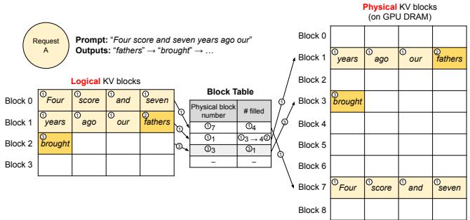
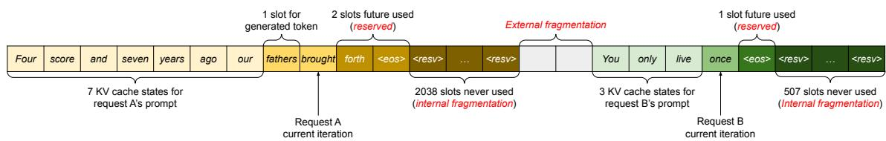
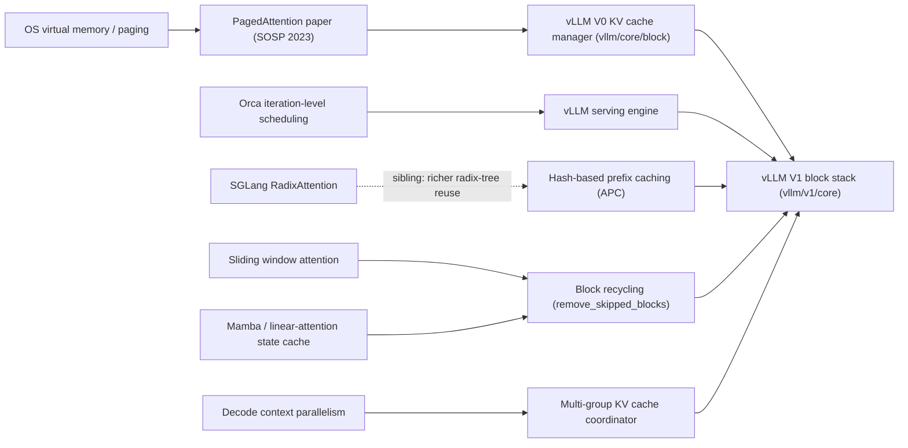
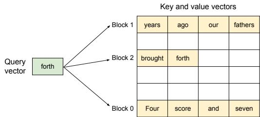
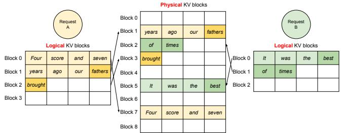

# vLLM Block Table Management: From PagedAttention to the V1 KV Cache Stack

**Repository:** [vllm-project/vllm](https://github.com/vllm-project/vllm)
**Inspected commit:** `dd11df04f3b7046c40f13e586ac38a3725bc3c03`
**Checkout state:** clean, static reading on 2026-08-03
**Paper:** [Efficient Memory Management for LLM Serving with PagedAttention](https://arxiv.org/abs/2309.06180) (SOSP 2023)

**Related pages:** [vLLM: PagedAttention Serving Framework](../vllm-framework.md),
[vLLM Continuous Batching](../vllm-continuous-batching/index.md),
[vLLM Code Learning Path](../vllm-code-learning-path.md),
[KV Cache](../../../terms/kv-cache.md), [PagedAttention](../../../terms/pagedattention.md),
[Block Table](../../../terms/block-table.md)

## TL;DR

**What:** vLLM's block table is the per-request logical-to-physical mapping that lets a growing KV cache live in fixed-size non-contiguous memory pages, exactly like an OS page table.

**How:** A shared `BlockPool` hands out physical blocks with reference counts; per-attention-type managers build each request's logical block list, share blocks by touching refcounts, reuse cached prefixes by chained hashes, and hand the worker a compact int32 block-table tensor that PagedAttention kernels index.

**The number:** The paper reports prior systems store usable KV state in as little as 20.4% of their KV memory; vLLM's paged design bounds a request's waste to at most one block, turning the rest into larger batch sizes.

## The Big Picture

*Original PagedAttention paper Figure 6, preserved locally. ① A 7-token prompt fills logical blocks 0 and 1, mapped to physical blocks 7 and 1 — the first block holds 4 tokens, the second 3 with 1 free slot, tracked by the `#filled` column. ② First decode step writes the new KV into the free slot of physical block 1. ③ Second decode step finds block 1 full, so the manager allocates physical block 3, records it in the table, and the kernel reads all three blocks.*

## Why This Exists

Naive serving systems reserve one contiguous chunk of KV memory per request sized for the request's maximum possible sequence length. That single decision creates three kinds of waste at once:

*Original PagedAttention paper Figure 3, preserved locally. Each box is a request's pre-reserved chunk; the red slots are memory that can never serve tokens.*

| Waste type | Cause | When it is known |
|---|---|---|
| Reserved slots | Space held for future generated tokens | Only realized as waste when a request finishes short |
| Internal fragmentation | Over-provisioning for a max length that never happens | Only realized after sampling |
| External fragmentation | Buddy-allocator gaps between variable-size chunks | Known before serving, never usable |

A single OPT-13B token needs about 800 KB of KV cache, so one request can demand up to 1.6 GB. When most of that is pre-reserved and idle, far fewer requests fit, and GPU utilization collapses. The paper's own profiled numbers show prior systems store usable KV state in only **20.4% to 38.2%** of their KV memory.

**The fix is to stop reserving for the future and allocate block-by-block as tokens actually arrive** — the same reason operating systems page, not pre-allocate, process address spaces.

## The Landscape

*Landscape synthesis (editable source: [landscape.mmd](assets/landscape.mmd)). OS paging is the parent idea; PagedAttention makes it concrete for KV cache; vLLM's V0 manager evolved into the V1 `vllm/v1/core` stack, which also absorbs hash-based prefix caching, block recycling for sparse attention, and multi-group coordination for hybrid models. SGLang's RadixAttention is a sibling approach to the same reuse problem.*

## The Core Idea

**A KV cache block is a fixed-size page; a block table is that page table.** The scheduler and the KV cache manager never think about GPU memory addresses — they think about logical block numbers per request. The physical placement is a pool-wide decision that only needs the invariant "one logical block maps to exactly one physical block," plus a reference count that tells the pool how many requests currently depend on each physical block. Everything else — prefix reuse, copy-on-write, eviction, hybrid-model coordination — is bookkeeping layered on top of those two facts.

## Symbol Map

The code has its own compact vocabulary. All symbols below are exact names from the source.

| Symbol | Human name | Scope | Plain meaning |
|---|---|---|---|
| `block_size` | KV block size | per KV cache group | Tokens per block (default 16); DCP multiplies it for attention groups |
| `hash_block_size` | hash granularity | global | Tokens per hash unit; GCD of all group block sizes, each group's block size is a multiple of it |
| `scheduler_block_size` | scheduling granularity | global | LCM of all group block sizes; hits are reported on this boundary |
| `KVCacheBlock` | physical block | pool-wide | `block_id`, `ref_cnt`, optional `_block_hash`, free-list links, `is_null` |
| `ref_cnt` | reference count | per block | Number of requests sharing this physical block |
| `req_to_blocks` | logical block table | per request per group | The ordered list of `KVCacheBlock`s a request owns |
| `block_hashes` | chained prefix hashes | per request | One hash per `hash_block_size` unit; each hash fingerprints its whole prefix |
| `num_cached_block` | cache frontier | per request | How many leading blocks are already registered in the prefix cache |
| `null_block` | padding block | pool-wide | Block 0, `is_null=True`, never cached or freed; pads skipped positions |
| `KV cache group` | cache type | per model | One group per distinct attention type (full, SWA, mamba, cross-attention, ...) |

## Deep Dive

### 1. The physical block pool

**What it does:** Owns every physical KV block and the free-list that decides eviction order.

**Why it matters:** The pool is the single source of truth for "is there memory?" — the scheduler's admission decision is just `required_blocks <= free_blocks`.

**How it works:** <a class="code-link" href="../../../../external-repos/vllm-dd11df04f3b7/vllm/v1/core/block_pool.py#L143" data-code-repo="vllm-dd11df04f3b7" data-code-path="vllm/v1/core/block_pool.py" data-code-line="143"><code>BlockPool</code></a> starts by materializing `num_gpu_blocks` `KVCacheBlock`s and linking them into a doubly linked free queue. Block 0 is peeled off as the permanent `null_block`. Allocation pops blocks from the head of the free queue; freeing appends them back; a cached block that gets reallocated is first evicted from the prefix-cache hash map. The free queue itself is a hand-rolled doubly linked list that stores its links *inside* each block, giving O(1) middle removal without allocating Python objects.

*Original PagedAttention paper Figure 5, preserved locally: the key/value vectors for "Four score and seven years ago our..." live in three blocks that are not contiguous in physical memory, and the PagedAttention kernel multiplies the query against each block's keys separately.*

| Operation | Effect | Eviction-order consequence |
|---|---|---|
| `get_new_blocks(n)` | Pop n from free-list head, `ref_cnt += 1` | Newest reuse is cheapest |
| `free_blocks(ordered)` | `ref_cnt -= 1`; at 0, hashed blocks append to tail, unhashed blocks prepend to head | Unhashed blocks (never usable for APC) get recycled first |
| `touch(blocks)` | Remove from free-list if present, `ref_cnt += 1` | A prefix hit "rescues" an eviction candidate |
| `_maybe_evict_cached_block(b)` | Drop its hash from the prefix map on reallocation | Cache entries never block allocation |

**The intuition:** The free-list is an LRU with a twist — never-cacheable blocks jump the queue, and tail-of-chain blocks (more hash tokens) evict before head blocks.

**A concrete example:** Reusing the paper's Figure 6 walkthrough: the pool holds blocks `0..N`; block 0 is the null block; when the second decode step needs a third logical block, `get_new_blocks(1)` hands back physical block 3 from the free-list head, and `ref_cnt` on block 3 becomes 1.

**Remember:** Allocation is a queue pop; freeing is an ordered queue push; the ordering *is* the eviction policy.

### 2. The logical block table per request

**What it does:** Tracks, for each request and each KV cache group, the ordered list of physical blocks its tokens live in.

**Why it matters:** This ordered list *is* the block table — it is what gets serialized to the worker and turned into the kernel's block-table tensor.

**How it works:** The coordinator keeps `req_to_blocks[request_id]` per group. <a class="code-link" href="../../../../external-repos/vllm-dd11df04f3b7/vllm/v1/core/kv_cache_manager.py#L344" data-code-repo="vllm-dd11df04f3b7" data-code-path="vllm/v1/core/kv_cache_manager.py" data-code-line="344"><code>KVCacheManager.allocate_slots()</code></a> is the entry point the scheduler calls: it counts how many blocks `num_tokens` needs, checks the free pool, then asks each group manager to append new blocks. Blocks are appended in token order, so the list is always sorted by token position; skipped positions are padded with `null_block` so index `i` still means "the block containing token `i * block_size`".

**The intuition:** A request's block table is an append-only array — the worker relies on this so same-step block IDs never change.

**A concrete example:** The 7-token prompt gets `req_to_blocks = [phys7, phys1]`; after the second decode step it becomes `[phys7, phys1, phys3]` — the new block is appended, never inserted.

**Remember:** Logical order is preserved by appending; null blocks preserve index arithmetic even when physical blocks are freed.

### 3. Reference counts and copy-on-write

**What it does:** Decides when a physical block can be freed (`ref_cnt == 0`) and lets many requests share one block safely.

**Why it matters:** Sharing the prompt prefix across parallel samples or a common system prompt is where PagedAttention's biggest memory savings come from (up to 55% for beam search in the paper).

**How it works:** <a class="code-link" href="../../../../external-repos/vllm-dd11df04f3b7/vllm/v1/core/block_pool.py#L702" data-code-repo="vllm-dd11df04f3b7" data-code-path="vllm/v1/core/block_pool.py" data-code-line="702"><code>touch()</code></a> increments `ref_cnt` when a request adopts a cached block; `free_blocks()` decrements it. Two requests sharing a block both hold a reference, so the block survives until both are done. When one writer needs to diverge from a shared block, the manager allocates a fresh block and queues a `KVCacheBlockCopy(src, dst)` for the worker to copy the KV data before the writer overwrites — copy-on-write. The `_apply_cow` path in the single-type manager records the redirect.

*Original PagedAttention paper Figure 7, preserved locally: two sequences (blue and orange) occupy the same physical pool; their neighboring logical blocks are not physically contiguous, and freed blocks are reusable by either sequence.*

**The intuition:** `ref_cnt` is the garbage collector for the pool — a block lives exactly as long as the last request that points to it.

**A concrete example:** If a second request arrives whose prompt is the same 7 tokens as the first, its first two logical blocks *are* physical 7 and 1, and both requests bump those blocks' `ref_cnt` to 2. When the first request finishes, its free only drops the count back to 1 — the second request keeps the data alive.

**Remember:** Sharing is free; divergence costs one copy per diverging block, not a whole-prefix copy.

### 4. Hash-based prefix caching

**What it does:** Lets a new request skip computing KV for a prompt prefix that another request already cached.

**Why it matters:** Chat system prompts, few-shot examples, and repeated agents share huge prefixes; recomputing them wastes the entire prefill.

**How it works:** Each request's tokens are hashed in `hash_block_size` chunks with a *chained* hash — `hash_block_tokens(hash_fn, parent_hash, tokens, extra_keys)` — so the hash at boundary $t$ uniquely fingerprints the whole prefix up to $t$. Full blocks register `hash + group_id → block` in `BlockHashToBlockMap`. On a new request, <a class="code-link" href="../../../../external-repos/vllm-dd11df04f3b7/vllm/v1/core/single_type_kv_cache_manager.py#L682" data-code-repo="vllm-dd11df04f3b7" data-code-path="vllm/v1/core/single_type_kv_cache_manager.py" data-code-line="682"><code>FullAttentionManager.find_longest_cache_hit</code></a> walks the request's hashes left to right and adopts every matching cached block via `touch()`. Blocks past the hit are allocated fresh, and only the *new* suffix is computed.

The prefix-cache index deliberately does not de-duplicate: two requests with identical full blocks get *two* physical blocks, because block-table IDs must stay append-only (see NOTE in `BlockHashToBlockMap`).

**The intuition:** Chaining makes "does my prefix exist?" a single hash lookup per block; sharing is just `touch()`.

**A concrete example:** The second request from section 3 does not need its 7 prompt tokens recomputed at all — `find_longest_cache_hit` returns physical blocks 7 and 1, `num_new_computed_tokens = 7`, and only the first generated token is computed.

**Remember:** A block is only cached when it is *full*; the last partial block is never a cache entry.

### 5. Multi-group coordination for hybrid models

**What it does:** Keeps one consistent cache-hit length across every KV cache group (full attention, sliding window, mamba state, cross-attention) at once.

**Why it matters:** Hybrid models (e.g. full-attention + mamba layers, or DeepSeek-style MLA + sparse) have different block sizes per group; the *shortest* agreeing hit across groups is the only safe one to reuse.

**How it works:** <a class="code-link" href="../../../../external-repos/vllm-dd11df04f3b7/vllm/v1/core/kv_cache_coordinator.py#L685" data-code-repo="vllm-dd11df04f3b7" data-code-path="vllm/v1/core/kv_cache_coordinator.py" data-code-line="685"><code>HybridKVCacheCoordinator.find_longest_cache_hit</code></a> runs a fixed-point loop: it proposes a hit length, each spec group (`SpecGroup`) either accepts it or reduces it, and the loop restarts until the length stops shrinking. Full attention is downward-closed (checked once, then only trimmed). Groups with different block sizes reuse the chained hashes at their own granularity via `BlockHashListWithBlockSize` — the last `hash_block_size` hash inside a larger block is that block's hash.

**The intuition:** The coordinator is a consensus protocol over block sizes — everyone must agree on where the shared prefix ends.

**A concrete example:** A model with 16-token full-attention blocks and 64-token mamba state blocks: if full attention cached 32 tokens but the mamba group only cached 16, the reconciled hit is 16 tokens — the mamba state at 32 tokens does not exist yet.

**Remember:** The cache hit is only as long as the weakest group's cached prefix.

### 6. Block recycling for sliding-window and mamba models

**What it does:** Frees blocks that attention will never read again, instead of holding them until the request ends.

**Why it matters:** Sliding-window attention only reads the last `window` tokens, and mamba only needs the *last* recurrent state — holding everything would waste most of the pool.

**How it works:** Each manager implements `get_num_skipped_tokens()` and `remove_skipped_blocks()`: SWA frees everything before `num_computed - window + 1`, chunked-local frees whole chunks before the current one, mamba frees every state except the last, and R-SWA frees the gap between prefill tail and decode window. Freed positions are replaced by `null_block` in `req_to_blocks` so the block table stays index-stable for the kernels.

**The intuition:** "Skipped" tokens are a *memory* statement, not just an attention statement — if the window will never look back, the blocks can go.

**A concrete example:** A request with a 4000-token prompt and a 2048-token sliding window has, after the window moves, roughly 1952 tokens' worth of blocks freed and padded with nulls — the request's peak KV is bounded by the window, not the prompt.

**Remember:** Recycling keeps peak per-request KV at $O(\text{window} + \text{prefix})$, which is what lets long-context and streaming workloads fit at all.

### 7. Worker-side block table materialization

**What it does:** Turns the scheduler's per-request block-ID lists into the actual GPU tensor that attention kernels index.

**Why it matters:** The kernel does not know about managers or hashes — it only reads `block_table[row][col]` to find a KV block.

**How it works:** The scheduler packs each request's `block_ids` (per group) into <a class="code-link" href="../../../../external-repos/vllm-dd11df04f3b7/vllm/v1/worker/block_table.py#L270" data-code-repo="vllm-dd11df04f3b7" data-code-path="vllm/v1/worker/block_table.py" data-code-line="270"><code>MultiGroupBlockTable</code></a>. Each group's `BlockTable` keeps an int32 CPU+GPU buffer; `add_row()` writes a request's block IDs, `compute_slot_mapping()` fills the per-token `slot_mapping` tensor (token → physical slot) via a Triton kernel, and `commit_block_table()` copies to GPU. When the allocation block size differs from the kernel block size, `map_to_kernel_blocks()` expands each KV block into `blocks_per_kv_block` kernel blocks.

**The intuition:** The block table is the only contract between the Python-side memory manager and the CUDA/Triton-side attention — small, dense, and append-only.

**A concrete example:** The 7-token request's row is `[7, 1]` and later `[7, 1, 3]`; the slot-mapping kernel maps token positions 0-15 to physical block 7, 16-31 to block 1, and so on.

**Remember:** `slot_mapping` + `block_table` are the two tensors that make paged attention read arbitrary physical blocks in constant time.

## Putting It Together

Watch two requests share the pool across one scheduler loop at `dd11df04f3b7`:

1. **Pool boot:** the engine sizes `num_gpu_blocks` from GPU memory and the page size (<a class="code-link" href="../../../../external-repos/vllm-dd11df04f3b7/vllm/v1/core/kv_cache_utils.py#L973" data-code-repo="vllm-dd11df04f3b7" data-code-path="vllm/v1/core/kv_cache_utils.py" data-code-line="973"><code>get_num_blocks</code></a>), and `BlockPool` links them into the free queue.
2. **Request A (the 7-token prompt)** is admitted: `allocate_slots()` finds 2 blocks free, pops physical 7 and 1, appends them to A's `req_to_blocks`, and <a class="code-link" href="../../../../external-repos/vllm-dd11df04f3b7/vllm/v1/core/block_pool.py#L225" data-code-repo="vllm-dd11df04f3b7" data-code-path="vllm/v1/core/block_pool.py" data-code-line="225"><code>cache_full_blocks()</code></a> registers their hashes after prefill.
3. **Decode steps:** each generated token lands in a free slot; when block 1 fills, <a class="code-link" href="../../../../external-repos/vllm-dd11df04f3b7/vllm/v1/core/block_pool.py#L647" data-code-repo="vllm-dd11df04f3b7" data-code-path="vllm/v1/core/block_pool.py" data-code-line="647"><code>get_new_blocks(1)</code></a> pops physical 3 and appends it. The worker's `MultiGroupBlockTable` row grows to `[7, 1, 3]` and the PagedAttention kernel reads exactly those blocks.
4. **Request B arrives with the same prompt:** `find_longest_cache_hit` returns blocks 7 and 1; `touch()` bumps both `ref_cnt`s to 2, B skips prefill entirely, and only its first generated token is computed.
5. **A finishes:** `free(A)` decrements both shared blocks to `ref_cnt == 1` (B keeps them alive) and frees A's private tail block, which goes to the LRU end of the free queue.
6. **Memory pressure:** if a new request needs a block and the free queue is empty, allocation pops the LRU candidate — a cached-but-unreferenced block — and <a class="code-link" href="../../../../external-repos/vllm-dd11df04f3b7/vllm/v1/core/block_pool.py#L679" data-code-repo="vllm-dd11df04f3b7" data-code-path="vllm/v1/core/block_pool.py" data-code-line="679"><code>_maybe_evict_cached_block()</code></a> drops its hash so the prefix cache cannot hand it out again.

## What This Buys You

### The headline claim

Paging the KV cache converts previously wasted memory into larger effective batch sizes, which is the dominant throughput lever for serving.

### How we know: paper benchmarks

| Workload | Reported gain |
|---|---|
| OPT-13B, ShareGPT + Alpaca | 2-4× throughput vs. FasterTransformer and Orca |
| Long-sequence & shared-prefix cases | Largest relative gains |
| Beam search memory sharing | Up to 55% of KV memory saved |

### The mechanism behind the numbers

Higher effective batch size is the direct consequence of the three waste classes in "Why This Exists" disappearing: no reservation, no internal fragmentation beyond one block, no external fragmentation. More requests in flight means weights are amortized over more tokens per step — exactly the regime where decode, a memory-bound operation, becomes compute-efficient.

### ⚠️ How to read these numbers

These are 2023 single-GPU OPT-13B benchmarks. Do **not** treat "2-4×" as a universal multiplier for modern models, multi-GPU deployments, or FP8 caches. The qualitative claim — paging beats contiguous reservation — is what generalizes, not the specific ratios. Also, prefix-cache hit rates in these benchmarks depend heavily on the workload's prompt overlap; a dataset with unique prompts gets far less benefit from sections 4-5.

## Where It Breaks

| Failure mode | When it happens | Impact |
|---|---|---|
| Prefix-cache thrash | Prompts share no prefix; or cache blocks get evicted between identical requests | Hash bookkeeping overhead with zero reuse; occasionally *worse* than no caching |
| Small block size hurts kernels | `block_size` too small (e.g. 1) | More block-table indirection and branch overhead; the paper's ablation shows block size trades parallelism vs. fragmentation |
| Large block size fragments | `block_size` too large for short requests | Internal fragmentation up to one full block per request |
| Refcount drift in CoW | A shared tail block is copied but the copy is never committed by a connector/worker step | Stale KV reads or double frees (the code pins copy endpoints precisely to avoid this) |
| Chained-hash recompute cost | Extremely long prompts with dense hashing | Hash computation adds prefill overhead; mitigations include `prefix_match_unit` and sparse retention intervals |
| SWA/Mamba recycling + prefix caching interplay | Long sliding-window prompts under memory pressure | A deeper cached prefix may be evicted while a shorter one survives, so hit lengths must be reconciled per group |

## One Thing to Remember

**A block table is a page table for KV cache**: one fixed-size physical block per logical block, an append-only per-request mapping, and a reference count that makes sharing free — and the entire V1 stack in `vllm/v1/core` exists to keep that mapping consistent across prefix reuse, copy-on-write, hybrid attention groups, and the worker kernels that finally read it.

## Go Deeper

- **Read:** [PagedAttention paper (arXiv:2309.06180)](https://arxiv.org/abs/2309.06180); the MinerU extraction with all figures is at derived/pdf-markdown/frameworks/vllm-pagedattention-serving-framework.md.
- **Build on:** [vLLM Continuous Batching](../vllm-continuous-batching/index.md) for the scheduler loop that calls `allocate_slots`; [SGLang](../../sglang/index.md) for the RadixAttention sibling approach; [DeepSeek-V2 MLA](../../../algorithms/attention-variants/deepseek-v2-mla.md) for a cache-shrinking alternative.
- **Understand the context:** [KV Cache](../../../terms/kv-cache.md), [PagedAttention](../../../terms/pagedattention.md), [Block Table](../../../terms/block-table.md), [Continuous Batching](../../../terms/continuous-batching.md).
- **Reproduce:** the whole block stack is in `vllm/v1/core/` — start at <a class="code-link" href="../../../../external-repos/vllm-dd11df04f3b7/vllm/v1/core/kv_cache_manager.py#L344" data-code-repo="vllm-dd11df04f3b7" data-code-path="vllm/v1/core/kv_cache_manager.py" data-code-line="344"><code>KVCacheManager.allocate_slots</code></a>, then `BlockPool`, then <a class="code-link" href="../../../../external-repos/vllm-dd11df04f3b7/vllm/v1/worker/block_table.py#L270" data-code-repo="vllm-dd11df04f3b7" data-code-path="vllm/v1/worker/block_table.py" data-code-line="270"><code>MultiGroupBlockTable</code></a> in <a class="code-link" href="../../../../external-repos/vllm-dd11df04f3b7/vllm/v1/worker/block_table.py#L270" data-code-repo="vllm-dd11df04f3b7" data-code-path="vllm/v1/worker/block_table.py" data-code-line="270"><code>vllm/v1/worker/block_table.py</code></a>.
