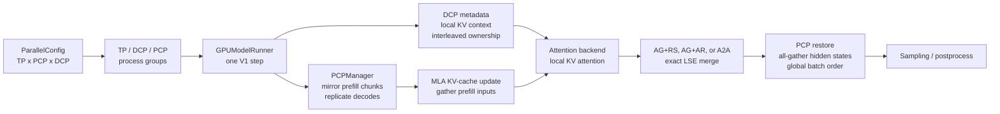
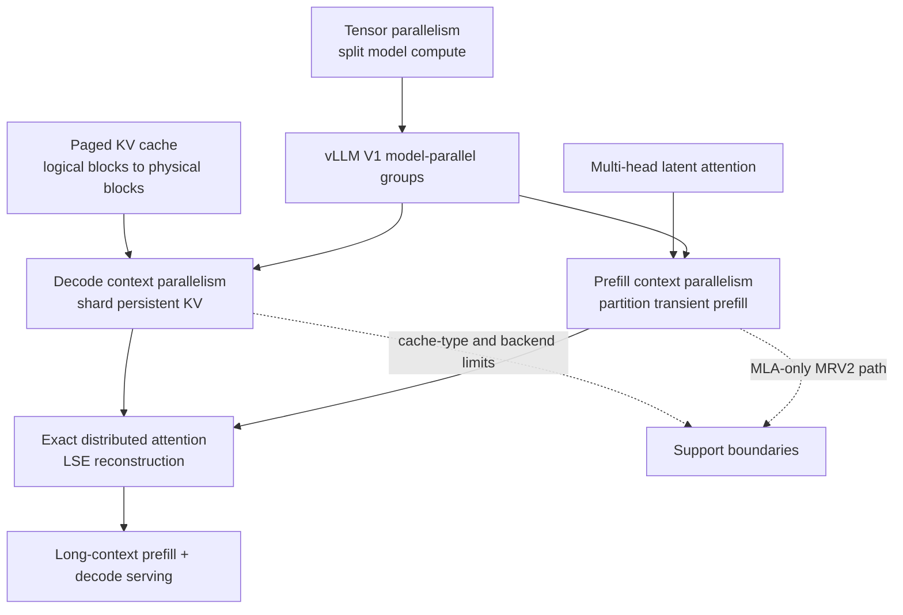

# vLLM DCP and PCP: Decode and Prefill Context Parallelism

**Repository:** [vllm-project/vllm](https://github.com/vllm-project/vllm)
**Inspected commit:** `a0c092ee72c0dcefbb3b3e74f97ac62d842e5f4b`
**Checkout state:** clean, static reading on 2026-08-10

**Related pages:** [vLLM Architecture Overview](vllm-overview.md),
[vLLM Continuous Batching](vllm-continuous-batching/index.md),
[vLLM Block Table Management](vllm-block-management/index.md),
[Context Parallelism for Scalable Million-Token Inference](../../algorithms/context-parallelism/index.md),
[Context Parallelism](../../terms/context-parallelism.md),
[DCP Attention Merge Derivation](dcp-attention/index.md)

## TL;DR

**What:** vLLM exposes two composable ownership schemes: PCP partitions prefill query rows, while DCP partitions the KV context those queries read.

**How:** PCP rewrites a global batch into rank-local prefill chunks but replicates decode rows; DCP interleaves KV ownership, computes rank-local attention, and reconstructs exact output with log-sum-exp-aware collectives.

**The number:** `PCP` multiplies the process world; `DCP` does not. For DCP size `N` and interleave `I`, KV ownership repeats every `N × I` tokens, while the cache manager scales its attention block size by `N`.

## The Big Picture



*Synthesized implementation flow, not an upstream vLLM figure. ① Startup creates TP, DCP, and PCP groups. ② PCP chooses which query rows a rank computes, while DCP determines which KV rows it can read locally. ③ Attention merges exact partial results. ④ PCP restores global hidden-state order before sampling. Editable source: [dcp-pcp-runtime.mmd](assets/dcp-pcp-runtime.mmd).*

**The key distinction is which side of attention is partitioned.** PCP owns the current query/token layout; DCP owns the persistent KV-context layout. They can be enabled together because those are orthogonal responsibilities, but their restoration points differ.

## Why This Exists

Imagine serving one 128K-token prompt followed by a long decode stream in a [continuous batching](../../terms/continuous-batching.md) scheduler on a TP8 deployment. Prefill has enough tokens to benefit from splitting the sequence, but decode repeatedly touches a growing [KV cache](../../terms/kv-cache.md) and needs every query to see the full context. A single undifferentiated context-parallel switch would either duplicate cache writes during prefill or force every decode rank to hold and process the same KV history.

vLLM addresses the two pressure points separately. PCP gives each rank two mirrored prefill chunks, keeps decode rows replicated, and reconstructs the global hidden-state batch. DCP gives each rank an interleaved shard of the KV context, sends rank-local lengths to attention backends, and combines partial attention outputs with numerically stable log-sum-exp statistics.

**The reusable example for this page is a mixed batch:** request A is a long fresh prefill, request B is already decoding. PCP must split A but keep B's sampled token visible to every rank; DCP must let B's query attend across all KV shards without making every rank own every block.

## The Landscape



*Landscape synthesis (editable source: [dcp-pcp-landscape.mmd](assets/dcp-pcp-landscape.mmd)). Paged KV management supplies the storage substrate, tensor parallelism supplies the model shard, MLA supplies the currently supported MRV2 PCP path, and DCP/PCP add two different context-parallel branches before exact attention returns to the serving loop.*

## The Core Idea

[Context parallelism](../../terms/context-parallelism.md) is not one operation in vLLM. **PCP answers “which query rows does this rank compute?”; DCP answers “which KV rows does this rank own?”** PCP therefore needs to restore global token order, while DCP needs to restore the global softmax result. Their names describe the workload each dimension primarily targets, not a rule that DCP can never participate in prefill: the pinned FlashInfer path contains a DCP prefill wrapper.

| Reader question | PCP | DCP |
|---|---|---|
| What is partitioned? | Prefill query/token rows in the current step | Persistent KV rows and their local causal lengths |
| Which view remains global? | The scheduler's batch identity | Full-attention semantics across every KV shard |
| What prevents duplicate cache writes? | Only rank 0 contributes replicated decode slots | Interleaved slot ownership makes each KV row local to one rank |
| What must be reconstructed? | Global hidden-state/token order | Exact globally normalized attention output |
| Where is the main communication? | Prefill cache-input and hidden-state all-gathers | Per-layer LSE plus output collectives |
| Does it add workers? | Yes, PCP expands the process world | No, DCP is a group view over existing TP/PCP ranks |

> **Important:** “Prefill” and “decode” identify the optimization targets. The implementation boundary is more precise: PCP partitions query work, while DCP partitions KV context and can therefore appear in both decode and prefill attention paths.

## Symbol Map

The code uses `PCP` for prefill context parallelism and `DCP` for decode context parallelism. `TP` is [tensor parallelism](../../terms/tensor-parallelism.md). A `rank` is one distributed worker; global `world_size` is the number of workers in the process world, while a group's world size is the number of ranks in that communicator. `LSE` is the log-sum-exp statistic retained by attention so partial softmax results can be merged exactly. In the derivation below, `i` identifies a DCP rank, `b` a batch row, and `h` an attention head; the equations apply independently to every `(b, h)` pair.

| Symbol or field | Human name | Scope | Plain meaning |
|---|---|---|---|
| `prefill_context_parallel_size` | PCP size | process world | Number of ranks that split prefill sequence computation. |
| `decode_context_parallel_size` | DCP size | DCP group | Number of ranks that shard decode KV cache. |
| `cp_kv_cache_interleave_size` | KV interleave | token ownership | Consecutive tokens assigned to one DCP rank before ownership advances. |
| `dcp_local_seq_lens` | local KV lengths | per request and rank | Sequence lengths after applying DCP ownership and interleave. |
| `slot_mapping` | cache slot map | per token | Logical token to physical KV-cache slot mapping. |
| `AG+RS` | [all-gather](../../terms/all-gather.md) plus reduce-scatter | DCP merge | Gather LSE, merge partial attention, then scatter output heads. |
| `AG+AR` | all-gather plus [all-reduce](../../terms/all-reduce.md) | PCP + DCP merge | Gather LSE, merge partial attention, then replicate output across ranks. |
| `A2A` | [all-to-all](../../terms/all-to-all.md) DCP merge | optional DCP backend | Exchange packed output/LSE payloads and reduce them locally. |
| $q_{b,h}$ | query vector | per batch row and head | The query used by every DCP rank for a decode row. |
| $\mathcal{K}_i$ | local KV shard | per DCP rank | The keys and values owned by rank `i`. |
| $o_i$ | local attention output | `[B, H, D]` before merge | Attention output computed using only $\mathcal{K}_i$. |
| $L_i$ | local LSE | `[B, H]` | Local log-sum-exp normalizer for rank `i`. |
| $O$ | logical global output | `[B, H, D]` before output distribution | Exact attention over the union of all DCP KV shards. |

## Deep Dive

### 1. PCP adds ranks; DCP reuses them

**What it does:** `ParallelConfig` declares the PCP and DCP sizes and rejects topologies the runtime cannot represent.

**Why it matters:** The process-world shape determines both which ranks communicate and how much cache each rank must own. A wrong group layout can deadlock before the first model step.

**How it works:** <a class="code-link" href="../../../external-repos/vllm/vllm/config/parallel.py#L126" data-code-repo="vllm-a0c092ee72c0" data-code-path="vllm/config/parallel.py" data-code-line="126" data-code-end-line="128"><code>ParallelConfig.prefill_context_parallel_size</code></a> expands the process world and participates in [MoE](../../terms/mixture-of-experts.md) sharding, while <a class="code-link" href="../../../external-repos/vllm/vllm/config/parallel.py#L342" data-code-repo="vllm-a0c092ee72c0" data-code-path="vllm/config/parallel.py" data-code-line="342" data-code-end-line="345"><code>decode_context_parallel_size</code></a> shards the decode KV cache without expanding that world. Validation then applies these rules in <a class="code-link" href="../../../external-repos/vllm/vllm/config/parallel.py#L524" data-code-repo="vllm-a0c092ee72c0" data-code-path="vllm/config/parallel.py" data-code-line="524" data-code-end-line="543"><code>ParallelConfig.__post_init__</code></a>:

| PCP | DCP | Accepted relationship |
|---:|---:|---|
| 1 | 1 | Ordinary TP execution. |
| 1 | >1 | DCP reuses TP ranks; TP must be divisible by DCP. |
| >1 | 1 | PCP expands the world; decode KV is not additionally sharded. |
| >1 | PCP or TP x PCP | DCP spans the PCP axis or the full TP x PCP block. |
| >1 | other | Rejected; arbitrary overlap is not supported. |

`PCP > 1` with data parallelism is rejected at this revision. The runtime also requires the A2A DCP communication backend to have DCP greater than one.

**The intuition:** PCP changes how many workers participate in the prefill; DCP changes how those workers divide persistent KV state.

**A concrete example:** With TP4 and PCP2, the process world is eight ranks. DCP can be disabled, span the two PCP ranks, or span all eight ranks, but it cannot choose an unrelated group of three ranks.

**Remember:** Read the topology constraints before reading an attention kernel; they explain which collective shapes are legal.

### 2. One rank mesh becomes three communication views

**What it does:** `initialize_model_parallel()` turns the global rank layout into separate `GroupCoordinator` objects.

**Why it matters:** DCP and PCP are not ad hoc calls layered on TP. Their rank membership is fixed at worker startup and every later collective assumes those groups are consistent.

**How it works:** The worker passes TP, PCP, and DCP sizes from <a class="code-link" href="../../../external-repos/vllm/vllm/v1/worker/gpu_worker.py#L1380" data-code-repo="vllm-a0c092ee72c0" data-code-path="vllm/v1/worker/gpu_worker.py" data-code-line="1380" data-code-end-line="1385"><code>GPUWorker.init_worker_distributed_environment</code></a> into <a class="code-link" href="../../../external-repos/vllm/vllm/distributed/parallel_state.py#L1746" data-code-repo="vllm-a0c092ee72c0" data-code-path="vllm/distributed/parallel_state.py" data-code-line="1746" data-code-end-line="1746"><code>initialize_model_parallel</code></a>. The function arranges ranks as ExternalDP x DP x PP x PCP x TP, builds TP groups, transposes the last two axes when DCP is enabled, and constructs PCP groups by transposing the PCP/TP axes. Existing groups are checked by <a class="code-link" href="../../../external-repos/vllm/vllm/distributed/parallel_state.py#L1992" data-code-repo="vllm-a0c092ee72c0" data-code-path="vllm/distributed/parallel_state.py" data-code-line="1992" data-code-end-line="2041"><code>ensure_model_parallel_initialized</code></a>.

**The process mesh:** The total process world is the product of the five layout axes:

$$
W = \text{ExternalDP} \times \text{DP} \times \text{PP} \times \text{PCP} \times \text{TP}.
$$

`DCP` is deliberately absent from this product: it is a communication view over existing ranks, not an additional set of workers. Each rank has one coordinate tuple `(external_dp_idx, dp_idx, pp_idx, pcp_idx, tp_idx)`. With the layout above, TP varies fastest, so the corresponding linear rank is:

$$
r = ((((e \times \text{DP} + d) \times \text{PP} + p) \times \text{PCP} + c) \times \text{TP} + t).
$$

For `TP4 x PCP2`, with the other axes equal to one, the mesh is:

```text
             tp_idx
             0    1    2    3
pcp_idx  0   R0   R1   R2   R3
         1   R4   R5   R6   R7
```

**Group versus coordinate:** A coordinate is a rank's position on one mesh axis; a group is the set of ranks selected for one communicator by holding some coordinates fixed and allowing another dimension to vary. Thus, for this example, TP groups are `{R0, R1, R2, R3}` and `{R4, R5, R6, R7}`, while PCP groups are `{R0, R4}`, `{R1, R5}`, `{R2, R6}`, and `{R3, R7}`. A rank can belong to all of these views at once. The group-local position is the rank's position in that communicator's ordered rank list; it is not automatically the same thing as `tp_idx`, `pcp_idx`, or `dcp_idx`.

For rank R5, the mesh coordinates are `(external_dp_idx=0, dp_idx=0, pp_idx=0, pcp_idx=1, tp_idx=1)`. R5 belongs to the TP group `{R4, R5, R6, R7}` and the PCP group `{R1, R5}`. If `DCP=PCP=2`, DCP uses the PCP pairs. If `DCP=TP x PCP=8`, the one DCP group is ordered PCP-first as `{R0, R4, R1, R5, R2, R6, R3, R7}`: it walks across both PCP coordinates before moving to the next TP coordinate. That ordering explains what it means for DCP to span PCP first and then TP.

The reason vLLM creates separate groups is that each collective needs a precise participant set. A TP all-reduce must stay inside a TP group, a PCP all-gather must use a PCP group, and a DCP attention merge must use a DCP group. `GroupCoordinator` packages that communicator and its local metadata; the coordinate tuple tells the worker what it is, while the group tells it whom to communicate with.

**The intuition:** One rank tensor defines several communication views; DCP and PCP are different slices through the same process grid.

**A concrete example:** For TP4 x PCP2, PCP pairs ranks that share the same TP/PP/DP coordinates, while DCP first transposes the PCP and TP axes so a DCP group can span PCP first and then TP.

**Remember:** Group membership is a load-time contract, not something an attention layer decides per request.

### 3. PCP splits prefill queries and replicates decode queries

**What it does:** `PCPManager` rewrites the global scheduled batch into a rank-local batch that attention backends can execute.

**Why it matters:** In the mixed batch example, a fresh prefill needs sequence partitioning, but a decode token must remain visible on every PCP rank so sampling and cache updates stay synchronized.

**How it works:** <a class="code-link" href="../../../external-repos/vllm/vllm/v1/worker/gpu/model_runner.py#L476" data-code-repo="vllm-a0c092ee72c0" data-code-path="vllm/v1/worker/gpu/model_runner.py" data-code-line="476" data-code-end-line="485"><code>GPUModelRunner</code></a> creates PCP state at initialization. <a class="code-link" href="../../../external-repos/vllm/vllm/v1/worker/gpu/pcp_manager.py#L37" data-code-repo="vllm-a0c092ee72c0" data-code-path="vllm/v1/worker/gpu/pcp_manager.py" data-code-line="37" data-code-end-line="123"><code>PCPManager</code></a> then builds two chunks per rank for each prefill: an early chunk and a mirrored late chunk. Its <a class="code-link" href="../../../external-repos/vllm/vllm/v1/worker/gpu/pcp_manager.py#L195" data-code-repo="vllm-a0c092ee72c0" data-code-path="vllm/v1/worker/gpu/pcp_manager.py" data-code-line="195" data-code-end-line="250"><code>_get_rank_segments</code></a> leaves decode requests replicated, then <a class="code-link" href="../../../external-repos/vllm/vllm/v1/worker/gpu/pcp_manager.py#L252" data-code-repo="vllm-a0c092ee72c0" data-code-path="vllm/v1/worker/gpu/pcp_manager.py" data-code-line="252" data-code-end-line="317"><code>_build_batch_layout</code></a> computes padded gather indices, a hidden-state restore index, and a one-writer KV mask. <a class="code-link" href="../../../external-repos/vllm/vllm/v1/worker/gpu/model_runner.py#L1092" data-code-repo="vllm-a0c092ee72c0" data-code-path="vllm/v1/worker/gpu/model_runner.py" data-code-line="1092"><code>GPUModelRunner._get_padded_input_ids</code></a> applies the partition before the forward pass.

The manager validates that MRV2 PCP is currently MLA-only and rejects [pipeline parallelism](../../terms/pipeline-parallelism.md), encoder-decoder models, multimodal inputs, LoRA, speculative decoding, and full CUDA graphs in <a class="code-link" href="../../../external-repos/vllm/vllm/v1/worker/gpu/pcp_manager.py#L125" data-code-repo="vllm-a0c092ee72c0" data-code-path="vllm/v1/worker/gpu/pcp_manager.py" data-code-line="125" data-code-end-line="180"><code>PCPManager.validate_config</code></a>.

**The intuition:** PCP makes each rank see a balanced slice of the prefill while keeping the decode control plane replicated.

**A concrete example:** If a prefill has eight chunks and PCP4, rank 0 processes chunks 0 and 7, rank 1 processes 1 and 6, and so on; the decoding request in the same batch appears on all four ranks.

**Remember:** PCP's unit of partitioning is the scheduled batch and its token rows, not the model weights.

### 4. PCP gathers prefill writes but commits replicated decode once

**What it does:** The MLA cache path gathers the prefill KV inputs across PCP ranks and keeps the replicated decode write local to one rank.

**Why it matters:** If every PCP rank wrote the same decode KV entry, the cache would receive duplicate writes; if prefills were not gathered, each rank would build an incomplete persistent context.

**How it works:** <a class="code-link" href="../../../external-repos/vllm/vllm/model_executor/layers/attention/pcp.py#L11" data-code-repo="vllm-a0c092ee72c0" data-code-path="vllm/model_executor/layers/attention/pcp.py" data-code-line="11" data-code-end-line="45"><code>_gather_prefill_cache_inputs</code></a> leaves the first `num_decode_tokens` local, all-gathers the prefill suffix through the PCP group, and rearranges slot mappings so decode slots come from rank 0 while prefill slots come from every rank. MLA invokes this at <a class="code-link" href="../../../external-repos/vllm/vllm/model_executor/layers/attention/mla_attention.py#L634" data-code-repo="vllm-a0c092ee72c0" data-code-path="vllm/model_executor/layers/attention/mla_attention.py" data-code-line="634" data-code-end-line="649"><code>MLAImpl.forward</code></a> before `do_kv_cache_update()`.

**The intuition:** Gather the work that is unique to each prefill shard, but nominate one writer for replicated decode state.

**A concrete example:** In the mixed batch, request A's prefill suffix is gathered from all PCP ranks into the cache update, while request B's one-token KV write uses the rank-0 slot mapping only.

**Remember:** PCP's all-gather is selective: it does not blindly duplicate every cache write.

### 5. DCP virtual blocks encode interleaved KV ownership

**What it does:** DCP changes the cache manager's logical block size and gives each attention backend the local sequence length for its rank's KV shard.

**Why it matters:** The scheduler and block table must agree with the physical ownership pattern; otherwise a backend would index the wrong local block or apply the wrong causal bound.

**How it works:** <a class="code-link" href="../../../external-repos/vllm/vllm/v1/core/single_type_kv_cache_manager.py#L36" data-code-repo="vllm-a0c092ee72c0" data-code-path="vllm/v1/core/single_type_kv_cache_manager.py" data-code-line="36" data-code-end-line="84"><code>SingleTypeKVCacheManager.__init__</code></a> multiplies the attention `block_size` by `dcp_world_size`; PCP does not multiply it because PCP expands prefill compute rather than persistent KV shards. <a class="code-link" href="../../../external-repos/vllm/vllm/v1/attention/backends/utils.py#L887" data-code-repo="vllm-a0c092ee72c0" data-code-path="vllm/v1/attention/backends/utils.py" data-code-line="887" data-code-end-line="920"><code>get_dcp_local_seq_lens</code></a> then applies the interleave size and rank offset to compute the local KV lengths. The GPU model runner materializes those lengths for each request before the [block table](../../terms/block-table.md) and attention metadata are built.

The cache manager explicitly rejects DCP/PCP for <a class="code-link" href="../../../external-repos/vllm/vllm/v1/core/single_type_kv_cache_manager.py#L906" data-code-repo="vllm-a0c092ee72c0" data-code-path="vllm/v1/core/single_type_kv_cache_manager.py" data-code-line="906" data-code-end-line="913"><code>SlidingWindowManager</code></a>, <a class="code-link" href="../../../external-repos/vllm/vllm/v1/core/single_type_kv_cache_manager.py#L1110" data-code-repo="vllm-a0c092ee72c0" data-code-path="vllm/v1/core/single_type_kv_cache_manager.py" data-code-line="1110" data-code-end-line="1156"><code>ChunkedLocalAttentionManager</code></a>, and <a class="code-link" href="../../../external-repos/vllm/vllm/v1/core/single_type_kv_cache_manager.py#L1253" data-code-repo="vllm-a0c092ee72c0" data-code-path="vllm/v1/core/single_type_kv_cache_manager.py" data-code-line="1253" data-code-end-line="1296"><code>MambaManager</code></a>. This is an implementation boundary, not a general statement that those attention ideas can never compose with context parallelism.

**The intuition:** DCP makes one scheduler block represent a full round of distributed token ownership, then tells each kernel how much of that block belongs locally.

**A concrete example:** With DCP4 and interleave 2, ownership advances in two-token groups across four ranks; a request's local sequence lengths can differ by at most one interleave group.

**Remember:** DCP is visible in both the block allocator and the attention metadata; changing only one side would be incorrect.

### 6. LSE restores global attention; the collective chooses placement

**What it does:** Each DCP rank computes attention over its local KV shard, then combines partial outputs so the result matches attention over the global context.

**Why it matters:** Local attention alone would omit most of the request history. The reduction must preserve the softmax normalization, not merely sum already-normalized outputs.

**How it works:** The default path in <a class="code-link" href="../../../external-repos/vllm/vllm/v1/attention/ops/common.py#L213" data-code-repo="vllm-a0c092ee72c0" data-code-path="vllm/v1/attention/ops/common.py" data-code-line="213" data-code-end-line="236"><code>cp_lse_ag_out_rs</code></a> all-gathers per-rank LSE values, performs an exact LSE-weighted merge, and reduce-scatters output heads. The `AG+AR` variant at <a class="code-link" href="../../../external-repos/vllm/vllm/v1/attention/ops/common.py#L238" data-code-repo="vllm-a0c092ee72c0" data-code-path="vllm/v1/attention/ops/common.py" data-code-line="238" data-code-end-line="261"><code>cp_lse_ag_out_ar</code></a> all-reduces the merged output when PCP needs replicated heads.

The optional A2A path in <a class="code-link" href="../../../external-repos/vllm/vllm/v1/attention/ops/dcp_alltoall.py#L392" data-code-repo="vllm-a0c092ee72c0" data-code-path="vllm/v1/attention/ops/dcp_alltoall.py" data-code-line="392" data-code-end-line="460"><code>dcp_a2a_lse_reduce</code></a> packs each partial output and its fp32 LSE into one buffer, performs one `all_to_all_single`, and runs a Triton LSE-weighted reduction. FlashInfer's <a class="code-link" href="../../../external-repos/vllm/vllm/v1/attention/backends/flashinfer.py#L230" data-code-repo="vllm-a0c092ee72c0" data-code-path="vllm/v1/attention/backends/flashinfer.py" data-code-line="230" data-code-end-line="326"><code>BatchDCPPrefillWrapper</code></a> all-gathers prefill queries across DCP heads before applying the same exact merge family.

MLA selects among these paths in <a class="code-link" href="../../../external-repos/vllm/vllm/model_executor/layers/attention/mla_attention.py#L898" data-code-repo="vllm-a0c092ee72c0" data-code-path="vllm/model_executor/layers/attention/mla_attention.py" data-code-line="898" data-code-end-line="921"><code>MLAImpl.forward_impl</code></a>: A2A when configured, AG+AR for PCP, and AG+RS otherwise. When PCP is active, <a class="code-link" href="../../../external-repos/vllm/vllm/model_executor/layers/attention/pcp.py#L83" data-code-repo="vllm-a0c092ee72c0" data-code-path="vllm/model_executor/layers/attention/pcp.py" data-code-line="83" data-code-end-line="92"><code>finalize_mla_pcp_decode</code></a> all-gathers or slices heads to restore the expected MLA shape.

#### Deriving the partial and global outputs

For DCP decode, the query is not split. Every rank in the DCP group uses the same query against a different KV shard. Let rank `i` own the disjoint shard $\mathcal{K}_i$; for one fixed batch row and attention head, its local scores, local LSE, and local attention output are:

$$
s_{i,j} = \frac{q \cdot k_j}{\sqrt{d}}, \qquad j \in \mathcal{K}_i,
$$

$$
L_i = \log \sum_{j \in \mathcal{K}_i} \exp(s_{i,j}), \qquad
o_i = \frac{\sum_{j \in \mathcal{K}_i} \exp(s_{i,j}) v_j}{\exp(L_i)}.
$$

The local output is already softmax-normalized over $\mathcal{K}_i$, so it cannot be summed directly with another rank's output. Multiplying it by $\exp(L_i)$ recovers the unnormalized weighted-value sum:

$$
o_i \exp(L_i) = \sum_{j \in \mathcal{K}_i} \exp(s_{i,j}) v_j.
$$

The equations use natural logarithms. The implementation can use the equivalent base-2 form when `is_lse_base_on_e` is false, replacing `exp`/`log` with `exp2`/`log2` without changing the merge logic.

Because the DCP shards partition the full context, $\mathcal{K} = \bigcup_i \mathcal{K}_i$. The exact logical global output is therefore:

$$
O = \frac{\sum_i o_i \exp(L_i)}{\sum_i \exp(L_i)}.
$$

For numerical stability, define $\ell = \max_i L_i$ and $\alpha_i = \exp(L_i - \ell)$. Then the same result is computed as:

$$
O = \frac{\sum_i \alpha_i o_i}{\sum_i \alpha_i},
\qquad
L = \ell + \log \sum_i \alpha_i.
$$

Here `L_i` and `L` are `[B, H]` tensors, not one scalar per rank: the merge is independent for every batch row and head. <a class="code-link" href="../../../external-repos/vllm/vllm/v1/attention/ops/common.py#L111" data-code-repo="vllm-a0c092ee72c0" data-code-path="vllm/v1/attention/ops/common.py" data-code-line="111" data-code-end-line="178"><code>correct_attn_out</code></a> implements this correction after the LSE all-gather, scaling each rank's local output by $\exp(L_i - L)$; the linked `cp_lse_ag_out_rs` and `cp_lse_ag_out_ar` wrappers then reduce the corrected outputs.

The logical `O` does not necessarily appear in full on every GPU. AG+RS reduce-scatters the head dimension so each rank keeps a head slice `[B, H/N, D]`; AG+AR all-reduces so every rank keeps `[B, H, D]`; A2A exchanges head partitions and performs the same exact LSE-weighted reduction while returning a head-scattered result. Thus "global output" describes the mathematical attention result, while the collective chooses its physical distribution.

**The intuition:** Every rank computes a piece of the softmax partition function, then the LSE values tell the group how to reweight those pieces exactly.

**A concrete example:** Request B's query sees four local KV shards. Each rank returns a partial output plus LSE; the merge reconstructs one global attention result before MLA's output projection.

**Remember:** DCP communicates the normalization statistics as well as the value vectors; output summation alone would be wrong.

## Putting It Together

The same mixed batch—request A prefilling and request B decoding—crosses two independent ownership transformations:

| Step | Actor | Input state | Action | Output state |
|---:|---|---|---|---|
| 1 | <a class="code-link" href="../../../external-repos/vllm/vllm/v1/worker/gpu_worker.py#L1380" data-code-repo="vllm-a0c092ee72c0" data-code-path="vllm/v1/worker/gpu_worker.py" data-code-line="1380" data-code-end-line="1385"><code>GPUWorker</code></a> | TP/PCP/DCP sizes | Initializes the three group views | Every rank knows its TP, PCP, and DCP peers |
| 2 | <a class="code-link" href="../../../external-repos/vllm/vllm/v1/core/single_type_kv_cache_manager.py#L36" data-code-repo="vllm-a0c092ee72c0" data-code-path="vllm/v1/core/single_type_kv_cache_manager.py" data-code-line="36" data-code-end-line="84"><code>SingleTypeKVCacheManager</code></a> | Physical attention block size | Multiplies it by DCP world size for scheduler-visible allocation | One virtual block represents a full round of distributed KV ownership |
| 3 | <a class="code-link" href="../../../external-repos/vllm/vllm/v1/worker/gpu/pcp_manager.py#L37" data-code-repo="vllm-a0c092ee72c0" data-code-path="vllm/v1/worker/gpu/pcp_manager.py" data-code-line="37" data-code-end-line="123"><code>PCPManager</code></a> | Global batch containing A and B | Retains the global view and prepares rank-local buffers | The batch has both a global identity and a local execution layout |
| 4 | <a class="code-link" href="../../../external-repos/vllm/vllm/v1/worker/gpu/model_runner.py#L1092" data-code-repo="vllm-a0c092ee72c0" data-code-path="vllm/v1/worker/gpu/model_runner.py" data-code-line="1092" data-code-end-line="1098"><code>maybe_partition_pcp_batch</code></a> | A's prefill rows and B's decode row | Assigns two mirrored A chunks per PCP rank and replicates B | Rank-local query rows with restore indices back to global order |
| 5 | <a class="code-link" href="../../../external-repos/vllm/vllm/v1/attention/backends/utils.py#L887" data-code-repo="vllm-a0c092ee72c0" data-code-path="vllm/v1/attention/backends/utils.py" data-code-line="887" data-code-end-line="920"><code>get_dcp_local_seq_lens</code></a> | Global sequence lengths plus DCP rank/interleave | Computes local causal lengths | Each attention backend sees only its valid KV prefix |
| 6 | <a class="code-link" href="../../../external-repos/vllm/vllm/model_executor/layers/attention/pcp.py#L11" data-code-repo="vllm-a0c092ee72c0" data-code-path="vllm/model_executor/layers/attention/pcp.py" data-code-line="11" data-code-end-line="45"><code>_gather_prefill_cache_inputs</code></a> | Partitioned A cache inputs and replicated B cache input | Gathers A from every PCP rank but selects B's slot from rank 0 | Complete A writes without duplicate B writes |
| 7 | <a class="code-link" href="../../../external-repos/vllm/vllm/model_executor/layers/attention/mla_attention.py#L898" data-code-repo="vllm-a0c092ee72c0" data-code-path="vllm/model_executor/layers/attention/mla_attention.py" data-code-line="898" data-code-end-line="921"><code>MLAImpl.forward_impl</code></a> | Local attention outputs and LSE values | Selects AG+RS, AG+AR, or A2A and merges exactly | Globally normalized attention with the required head placement |
| 8 | <a class="code-link" href="../../../external-repos/vllm/vllm/v1/worker/gpu/model_runner.py#L1472" data-code-repo="vllm-a0c092ee72c0" data-code-path="vllm/v1/worker/gpu/model_runner.py" data-code-line="1472" data-code-end-line="1474"><code>maybe_restore_pcp_for_sampling</code></a> | Rank-local hidden states plus restore indices | All-gathers and reindexes hidden states | Global A/B batch order is ready for sampling and postprocessing |

## What This Buys You

### The headline claim

**vLLM gets separate scaling knobs for query work and KV-context ownership without changing the mathematical attention result.** PCP primarily parallelizes long prefills; DCP distributes persistent KV capacity and local attention work.

### How we know: source and test coverage

| Evidence | What it establishes | Boundary |
|---|---|---|
| Static source map | Group topology, batch rewrites, cache ownership, and exact merge contracts | Inference from the pinned commit, not a live serving run |
| <a class="code-link" href="../../../external-repos/vllm/tests/distributed/test_dcp_a2a.py#L1" data-code-repo="vllm-a0c092ee72c0" data-code-path="tests/distributed/test_dcp_a2a.py" data-code-line="1"><code>test_dcp_a2a.py</code></a> | CPU reference LSE combination and A2A configuration validation | Does not prove multi-GPU transport performance |
| <a class="code-link" href="../../../external-repos/vllm/tests/v1/attention/test_indexer_dcp_localize.py#L1" data-code-repo="vllm-a0c092ee72c0" data-code-path="tests/v1/attention/test_indexer_dcp_localize.py" data-code-line="1"><code>test_indexer_dcp_localize.py</code></a> | Interleave-aware local lengths, candidate localization, and exact sparse-DCP reference comparisons | CUDA/CuteDSL sections are hardware gated |
| <a class="code-link" href="../../../external-repos/vllm/tests/distributed/test_context_parallel.py#L1" data-code-repo="vllm-a0c092ee72c0" data-code-path="tests/distributed/test_context_parallel.py" data-code-line="1"><code>test_context_parallel.py</code></a> | Multi-process context-parallel serving and accuracy checks | Requires the model, distributed runtime, and supported hardware |

The implementation's payoff is architectural: prefill query work can be split without multiplying decode cache writes, and KV context can be sharded without reducing attention to an inexact sum of local softmax outputs.

### The mechanism behind the result

PCP reduces per-rank prefill rows and pays an all-gather when cache inputs or hidden states must become global. DCP reduces per-rank KV ownership and pays attention collectives on every layer. The right setting therefore depends on whether the workload is prefill-heavy, decode-heavy, cache-capacity constrained, or dominated by interconnect latency.

### How to read these claims

These are code-level capability claims, not throughput numbers. The pinned checkout has focused tests, but this workspace did not run a multi-GPU server or benchmark, so no latency or scaling conclusion should be inferred from this page alone.

## Where It Breaks

| Failure mode | When it happens | Impact |
|---|---|---|
| PCP model mismatch | PCP is greater than one for a non-MLA model | `PCPManager.validate_config` raises; the current MRV2 implementation is MLA-only. |
| Unsupported feature composition | PCP is combined with PP, DP, multimodal inputs, LoRA, speculative decoding, or full CUDA graphs | Startup rejects the configuration. Sparse MLA additionally requires CUDA graphs to be disabled. |
| Unsupported cache type | DCP/PCP is requested for sliding-window, chunked-local, or Mamba cache groups | Cache-manager assertions stop startup because their state semantics are not DCP-aware here. |
| Invalid DCP topology | PCP is enabled but DCP is neither 1, PCP, nor TP x PCP | `ParallelConfig` rejects the group shape before workers initialize. |
| A2A shape mismatch | The DCP head count is not divisible by the DCP world size, or A2A is selected with DCP equal to one | The A2A reducer raises or configuration validation fails. |
| Collective hidden by no work | A batch has little prefill work or very small decode requests | Communication is exposed on the critical path; DCP can increase latency even while reducing local KV work. |
| Stale cache metadata | Block size, interleave, local sequence lengths, or slot mappings are constructed from different DCP settings | Attention can read the wrong physical KV locations or apply incorrect causal bounds. |

## One Thing to Remember

**PCP partitions the query side and restores token order; DCP partitions the KV side and restores softmax normalization.** Their names point to the workloads they optimize, but the durable mental model is ownership: current-step rows for PCP, persistent context rows for DCP.

## Verification Boundary and Limits

This page remains a static reading of the clean vLLM checkout at commit `a0c092ee72c0dcefbb3b3e74f97ac62d842e5f4b`; the context-parallel evidence was inspected on 2026-08-10. On 2026-08-17, a scoped comparison from the newest registered vLLM snapshot found relevant upstream changes, but repository policy deferred a new immutable revision until 2026-08-27. Therefore every implementation claim and code link here describes the pinned commit, not current `main`. The local repository contains the CPU reference and GPU/distributed tests named above, but they were not executed; hardware behavior, communication overlap, and throughput remain unverified.

## Go Deeper

- **Read:** [vLLM source revision](https://github.com/vllm-project/vllm/tree/a0c092ee72c0dcefbb3b3e74f97ac62d842e5f4b)
- **Understand the context:** [Context Parallelism for Scalable Million-Token Inference](../../algorithms/context-parallelism/index.md), [vLLM Block Table Management](vllm-block-management/index.md)
- **Inspect:** <a class="code-link" href="../../../external-repos/vllm/tests/distributed/test_dcp_a2a.py#L1" data-code-repo="vllm-a0c092ee72c0" data-code-path="tests/distributed/test_dcp_a2a.py" data-code-line="1"><code>DCP A2A tests</code></a>, <a class="code-link" href="../../../external-repos/vllm/tests/distributed/test_context_parallel.py#L1" data-code-repo="vllm-a0c092ee72c0" data-code-path="tests/distributed/test_context_parallel.py" data-code-line="1"><code>context-parallel tests</code></a>
- **Reproduce:** Multi-GPU DCP/PCP serving requires a CUDA-capable distributed environment; not run in this workspace.
