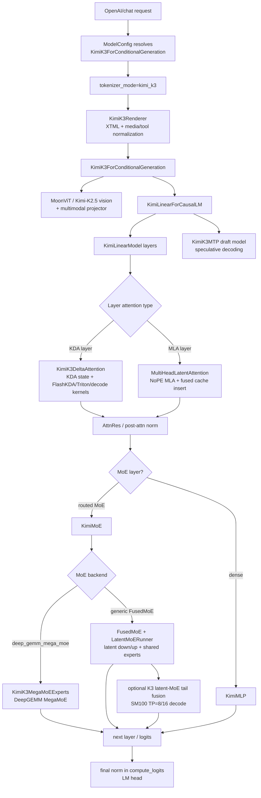

# vLLM Kimi K3 Code Reading Map

**Repository:** [vllm-project/vllm](https://github.com/vllm-project/vllm) @ `a0c092ee72c0dcefbb3b3e74f97ac62d842e5f4b` (main, clean)

**Related pages:** [Kimi K3](../../training/kimi/kimi-k3/index.md), [Kimi Delta Attention](../../terms/kimi-delta-attention.md), [Mixture of Experts](../../terms/mixture-of-experts.md), [vLLM-Ascend Kimi K3 MoE Forward Path](../vllm-ascend/kimi-k3-moe-forward.md), [vLLM Code Learning Path](vllm-code-learning-path.md)

## TL;DR

The latest local upstream vLLM checkout now has a real `vllm/models/kimi_k3/` implementation. Kimi K3 is no longer only inferable through generic MoE substrate code.

The code path is:

1. <a class="code-link" href="../../../external-repos/vllm/vllm/models/kimi_k3/nvidia/model.py#L1441" data-code-repo="vllm-a0c092ee72c0" data-code-path="vllm/models/kimi_k3/nvidia/model.py" data-code-line="1441"><code>KimiK3ForConditionalGeneration</code></a> wraps image processing plus an inner `KimiLinearForCausalLM`.
2. <a class="code-link" href="../../../external-repos/vllm/vllm/models/kimi_k3/nvidia/model.py#L941" data-code-repo="vllm-a0c092ee72c0" data-code-path="vllm/models/kimi_k3/nvidia/model.py" data-code-line="941"><code>KimiLinearModel</code></a> runs decoder layers with hybrid KDA/MLA attention.
3. <a class="code-link" href="../../../external-repos/vllm/vllm/models/kimi_k3/nvidia/model.py#L689" data-code-repo="vllm-a0c092ee72c0" data-code-path="vllm/models/kimi_k3/nvidia/model.py" data-code-line="689"><code>KimiDecoderLayer</code></a> chooses <a class="code-link" href="../../../external-repos/vllm/vllm/models/kimi_k3/nvidia/kda.py#L284" data-code-repo="vllm-a0c092ee72c0" data-code-path="vllm/models/kimi_k3/nvidia/kda.py" data-code-line="284"><code>KimiK3DeltaAttention</code></a> for KDA layers and <a class="code-link" href="../../../external-repos/vllm/vllm/models/kimi_k3/nvidia/mla.py#L102" data-code-repo="vllm-a0c092ee72c0" data-code-path="vllm/models/kimi_k3/nvidia/mla.py" data-code-line="102"><code>MultiHeadLatentAttention</code></a> for NoPE MLA layers.
4. MoE layers use <a class="code-link" href="../../../external-repos/vllm/vllm/models/kimi_k3/nvidia/model.py#L381" data-code-repo="vllm-a0c092ee72c0" data-code-path="vllm/models/kimi_k3/nvidia/model.py" data-code-line="381"><code>KimiMoE</code></a>, which implements latent routed experts, optional shared experts, optional DeepGEMM MegaMoE, and generic `FusedMoE + LatentMoERunner`.
5. K3-specific serving pieces include XTML rendering/parsing, multimodal preprocessing, attention-residual kernels, fused MLA cache-insert kernels, optional low-latency [GEMM](../../terms/gemm.md), MTP draft model, and optional SM100 latent-MoE tail fusion.

The important engineering shift is that Kimi K3 is implemented as a hardware-isolated model package under <a class="code-link" href="../../../external-repos/vllm/vllm/models/kimi_k3/__init__.py#L10" data-code-repo="vllm-a0c092ee72c0" data-code-path="vllm/models/kimi_k3/__init__.py" data-code-line="10"><code>vllm/models/kimi_k3/</code></a>, while still reusing vLLM's generic model registry, multimodal registry, attention backend interface, `FusedMoE`, speculative decoding, and parser infrastructure.

[Mermaid source](../assets/vllm-kimi-k3-code-reading.mmd)



## What Changed Versus the Previous Reading

The prior vllm-ascend-focused insight had to describe a Kimi K3-style MoE substrate because the inspected vllm-ascend revision did not have a literal K3 model file. The current upstream vLLM revision does.

The relevant package is:

```text
vllm/models/kimi_k3/
  __init__.py
  amd/
  common/
  nvidia/
```

<a class="code-link" href="../../../external-repos/vllm/vllm/models/kimi_k3/__init__.py#L10" data-code-repo="vllm-a0c092ee72c0" data-code-path="vllm/models/kimi_k3/__init__.py" data-code-line="10"><code>__init__.py</code></a> is a hardware-isolated entrypoint. It imports NVIDIA classes by default and switches to AMD classes when `current_platform.is_rocm()` is true. The public classes are:

- `KimiK3ForConditionalGeneration`;
- <a class="code-link" href="../../../external-repos/vllm/vllm/models/kimi_k3/nvidia/mtp.py#L202" data-code-repo="vllm-a0c092ee72c0" data-code-path="vllm/models/kimi_k3/nvidia/mtp.py" data-code-line="202"><code>KimiK3MTP</code></a>;
- <a class="code-link" href="../../../external-repos/vllm/vllm/models/kimi_k3/nvidia/model.py#L1311" data-code-repo="vllm-a0c092ee72c0" data-code-path="vllm/models/kimi_k3/nvidia/model.py" data-code-line="1311"><code>KimiLinearForCausalLM</code></a>.

## Request and Chat Surface

Kimi K3 has dedicated request-surface handling because it uses XTML rather than a normal Jinja chat template.

<a class="code-link" href="../../../external-repos/vllm/vllm/config/model.py#L647" data-code-repo="vllm-a0c092ee72c0" data-code-path="vllm/config/model.py" data-code-line="647"><code>vllm/config/model.py</code></a> adds `kimi_k3` as a tokenizer mode. During model config initialization, if the resolved architecture is `KimiK3ForConditionalGeneration`, vLLM sets:

```text
tokenizer_mode = "kimi_k3"
```

The tokenizer itself still uses the Hugging Face cached tokenizer path through <a class="code-link" href="../../../external-repos/vllm/vllm/tokenizers/registry.py#L57" data-code-repo="vllm-a0c092ee72c0" data-code-path="vllm/tokenizers/registry.py" data-code-line="57"><code>vllm/tokenizers/registry.py</code></a>, but rendering changes:

- <a class="code-link" href="../../../external-repos/vllm/vllm/renderers/registry.py#L27" data-code-repo="vllm-a0c092ee72c0" data-code-path="vllm/renderers/registry.py" data-code-line="27"><code>vllm/renderers/registry.py</code></a> maps `kimi_k3` to `KimiK3Renderer`.
- <a class="code-link" href="../../../external-repos/vllm/vllm/renderers/kimi_k3.py#L143" data-code-repo="vllm-a0c092ee72c0" data-code-path="vllm/renderers/kimi_k3.py" data-code-line="143"><code>vllm/renderers/kimi_k3.py</code></a> calls the tokenizer's Python `apply_chat_template(..., tokenize=True)` so XTML structural markers keep their special token IDs.
- The renderer maps `reasoning_effort="none"` to `thinking=False`, supports `thinking_effort` values `low`, `high`, and `max`, preserves image alpha by default, and reorders consecutive tool-result messages to match assistant tool-call order.
- <a class="code-link" href="../../../external-repos/vllm/vllm/parser/parser_manager.py#L128" data-code-repo="vllm-a0c092ee72c0" data-code-path="vllm/parser/parser_manager.py" data-code-line="128"><code>vllm/parser/parser_manager.py</code></a> selects `KimiK3Parser` when either the reasoning parser or tool parser name is `kimi_k3`.
- <a class="code-link" href="../../../external-repos/vllm/vllm/parser/kimi_k3.py#L23" data-code-repo="vllm-a0c092ee72c0" data-code-path="vllm/parser/kimi_k3.py" data-code-line="23"><code>vllm/parser/kimi_k3.py</code></a> composes the reasoning parser and tool parser, and handles `tool_choice="none"` without leaking tool calls.
- <a class="code-link" href="../../../external-repos/vllm/vllm/tool_parsers/structural_tag_registry.py#L581" data-code-repo="vllm-a0c092ee72c0" data-code-path="vllm/tool_parsers/structural_tag_registry.py" data-code-line="581"><code>vllm/tool_parsers/structural_tag_registry.py</code></a> registers a `kimi_k3` structural tag grammar for constrained response/tool-call output.

This is not cosmetic. If the renderer re-tokenized XTML as plain text, structural markers would not stay aligned with K3's expected special-token IDs.

## Multimodal Wrapper

<a class="code-link" href="../../../external-repos/vllm/vllm/transformers_utils/configs/kimi_k3.py#L86" data-code-repo="vllm-a0c092ee72c0" data-code-path="vllm/transformers_utils/configs/kimi_k3.py" data-code-line="86"><code>vllm/transformers_utils/configs/kimi_k3.py</code></a> defines the model config:

- `KimiK3Config` owns a `KimiLinearConfig` text config and `KimiK3VisionConfig`;
- it forces `vision_config.text_hidden_size` to match `text_config.hidden_size`;
- it defines the media placeholder token ID and image placeholder string.

<a class="code-link" href="../../../external-repos/vllm/vllm/transformers_utils/processors/kimi_k3.py#L9" data-code-repo="vllm-a0c092ee72c0" data-code-path="vllm/transformers_utils/processors/kimi_k3.py" data-code-line="9"><code>vllm/transformers_utils/processors/kimi_k3.py</code></a> adapts ordinary vLLM image inputs into the media dictionaries expected by the K3 vision image processor.

`KimiK3ForConditionalGeneration` in <a class="code-link" href="../../../external-repos/vllm/vllm/models/kimi_k3/nvidia/model.py#L1441" data-code-repo="vllm-a0c092ee72c0" data-code-path="vllm/models/kimi_k3/nvidia/model.py" data-code-line="1441"><code>vllm/models/kimi_k3/nvidia/model.py</code></a> then builds:

- `MoonViT3dPretrainedModel` for vision;
- `KimiK25MultiModalProjector`;
- an inner `KimiLinearForCausalLM` language model using `init_vllm_registered_model(..., architectures=["KimiLinearForCausalLM"])`;
- encoder CUDA graph support for image batches;
- placeholder replacement and multimodal embedding merge logic.

The class description says it directly: K3 is implemented as Kimi-K2.5 vision plus KimiLinear text.

## Text Model: KimiLinearForCausalLM

<a class="code-link" href="../../../external-repos/vllm/vllm/models/kimi_k3/nvidia/model.py#L1311" data-code-repo="vllm-a0c092ee72c0" data-code-path="vllm/models/kimi_k3/nvidia/model.py" data-code-line="1311"><code>KimiLinearForCausalLM</code></a> owns:

- `KimiLinearModel`;
- `ParallelLMHead`;
- `LogitsProcessor`;
- KDA state shape/dtype/copy hooks;
- low-latency GEMM enablement;
- weight loading and post-load MegaMoE finalization.

One non-obvious design: the final norm is applied in `compute_logits()` rather than at the end of `forward()`. The comment says this keeps pre-norm hidden states available for the MTP draft model.

<a class="code-link" href="../../../external-repos/vllm/vllm/models/kimi_k3/nvidia/model.py#L941" data-code-repo="vllm-a0c092ee72c0" data-code-path="vllm/models/kimi_k3/nvidia/model.py" data-code-line="941"><code>KimiLinearModel.forward()</code></a> handles:

1. token embedding or pipeline intermediate tensors;
2. optional sequence-parallel sharding;
3. optional attention-residual state storage;
4. decoder-layer iteration;
5. optional aux hidden states for Eagle/MTP-style consumers;
6. final residual/attention-residual combination;
7. optional sequence-parallel gather.

The layer stack is still recognizably vLLM, but K3 inserts several specialized paths inside each decoder layer.

## Decoder Layer: Hybrid KDA/MLA + MoE

<a class="code-link" href="../../../external-repos/vllm/vllm/models/kimi_k3/nvidia/model.py#L689" data-code-repo="vllm-a0c092ee72c0" data-code-path="vllm/models/kimi_k3/nvidia/model.py" data-code-line="689"><code>KimiDecoderLayer</code></a> is where architecture selection happens.

For attention:

- if `config.is_kda_layer(layer_idx)` is true, it uses `KimiK3DeltaAttention` when the KDA config requests a full-rank gate;
- otherwise it uses the shared `KimiLinearGatedDeltaNetAttention`;
- if the layer is not KDA, it uses `MultiHeadLatentAttention`;
- K3's MLA path asserts `mla_use_nope`, so the target K3 MLA layers are NoPE-only.

For feed-forward:

- MoE layers use `KimiMoE`;
- dense layers use `KimiMLP`;
- MoE placement is controlled by `config.first_k_dense_replace` and `config.moe_layer_freq`.

The layer also implements attention residuals through `attn_res()` before attention, after attention, and at model output.

## KDA Path: KimiK3DeltaAttention

<a class="code-link" href="../../../external-repos/vllm/vllm/models/kimi_k3/nvidia/kda.py#L284" data-code-repo="vllm-a0c092ee72c0" data-code-path="vllm/models/kimi_k3/nvidia/kda.py" data-code-line="284"><code>vllm/models/kimi_k3/nvidia/kda.py</code></a> specializes KDA beyond the shared Kimi Linear implementation.

The forward path is:

1. `in_proj_qkvgfab(hidden_states)` produces packed Q/K/V/gate/filter/beta components;
2. split into `mixed_qkv`, output-gate states, `f_a`, and `beta`;
3. `f_b_proj(f_a)` produces gate component `g1`;
4. `_forward()` consumes K3-specific KDA metadata from the forward context;
5. update or read convolution and recurrent KDA state;
6. choose a fused decode path when supported, otherwise split speculative and non-speculative token paths;
7. run recurrent/chunk KDA kernels;
8. apply gated RMSNorm and `o_proj`.

K3-specific backend decisions:

- `KimiK3KDAAttentionBackend` names the backend `KIMI_K3_KDA`;
- FlashKDA prefill is selected when the GPU is SM90/SM10x/SM12x, dtype is bf16, head dim is 128, and the KDA gate is lower-bounded;
- `ops.fused_kda_decode(...)` is used for supported decode-only cases: selected head counts, `head_dim=128`, `conv_width=4`, bf16 input/state, no speculative tokens, and an available custom op.

The failure mode is clear: unsupported shapes or speculative decode fall back to more general KDA paths.

## MLA Path: MultiHeadLatentAttention

<a class="code-link" href="../../../external-repos/vllm/vllm/models/kimi_k3/nvidia/mla.py#L102" data-code-repo="vllm-a0c092ee72c0" data-code-path="vllm/models/kimi_k3/nvidia/mla.py" data-code-line="102"><code>vllm/models/kimi_k3/nvidia/mla.py</code></a> is a self-contained MLA layer rather than a thin wrapper around a generic attention module.

Its constructor owns:

- q-LoRA or direct query projection;
- KV latent projection and RMSNorm;
- `kv_b_proj`;
- optional output gate `g_proj`;
- output projection `o_proj`;
- attention backend and implementation;
- MLA [KV cache](../../terms/kv-cache.md) spec;
- prefill backend;
- static forward-context registration.

Post-load, `process_weights_after_loading()` absorbs `kv_b_proj` into decode-time matrices:

- `W_UK_T`: maps query NoPE components into latent KV space;
- `W_UV`: maps latent attention output back to value-head space.

That avoids materializing full K/V during decode.

Forward has two main branches:

### Prefill

For prefill tokens, `_forward_prefill_fused()` runs fused key-concat plus KV-cache insert, then calls `run_prefill_new_tokens(...)`.

The fused cache insert path dispatches by cache dtype:

- bf16 cache: `fused_mla_key_concat_kv_cache_insert`;
- plain fp8 cache: `fused_mla_qkv_quant_kv_cache_fp8_insert`;
- `fp8_ds_mla`: `fused_mla_key_concat_ds_mla_insert`.

Chunked-context prefill merges context and suffix attention states with `merge_attn_states(...)`.

### Decode

For decode tokens:

1. split query into NoPE and PE parts;
2. run BMM with `W_UK_T` to project NoPE query into latent space;
3. call `_decode_concat_cache(...)` to concatenate query latent + PE and insert decode KV latent into cache;
4. call `impl.forward_mqa(...)`;
5. run `_v_up_proj(...)` with `W_UV`.

If `g_proj` is enabled, K3 overlaps the output-gate GEMM with the attention front-end for small token counts and applies `attn_out * sigmoid(gate)` before `o_proj`.

## MoE Path: KimiMoE

<a class="code-link" href="../../../external-repos/vllm/vllm/models/kimi_k3/nvidia/model.py#L381" data-code-repo="vllm-a0c092ee72c0" data-code-path="vllm/models/kimi_k3/nvidia/model.py" data-code-line="381"><code>KimiMoE</code></a> is the main answer to “how does K3 MoE forward run in upstream vLLM?”

It constructs:

- fp32 `GateLinear` router;
- `e_score_correction_bias`;
- optional shared experts via `KimiMLP`;
- latent routed expert down-projection and up-projection if `routed_expert_hidden_size` is configured;
- either `KimiK3MegaMoEExperts` or generic `FusedMoE`.

### Router/down-projection overlap

`_maybe_overlap_router_and_down_proj()` overlaps:

- router gate on the default stream;
- routed latent down-projection on an auxiliary CUDA stream.

For MegaMoE, grouped top-k selection also runs in the router branch, returning `topk_weights` and `topk_ids` directly. For generic `FusedMoE`, the router branch returns raw logits and lets `FusedMoE` route.

### MegaMoE backend

If `vllm_config.kernel_config.moe_backend == "deep_gemm_mega_moe"`, K3 uses `KimiK3MegaMoEExperts`.

Constraints enforced by the code:

- expert parallel must be enabled;
- activation must be SITU;
- latent MoE projections must exist;
- grouped top-k routing must be enabled;
- currently one expert group is required;
- `num_experts` must be divisible by EP size.

`KimiK3MegaMoEExperts` adapts DeepSeek V4 MegaMoE for K3. It transforms FP8/FP4 expert weights for DeepGEMM, caches symmetric buffers keyed by group/device/shape, maps logical experts to physical experts when EPLB is active, prepares MegaMoE inputs, and calls:

```text
deep_gemm.fp8_fp4_mega_moe(...)
```

### Generic FusedMoE backend

If not using MegaMoE, `KimiMoE` builds upstream `FusedMoE(...)`.

For latent MoE, it passes:

```text
runner_cls=LatentMoERunner
```

and optionally:

```text
runner_args={"enable_k3_latent_moe_tail_fusion": True}
```

when `VLLM_ENABLE_K3_LATENT_MOE_TAIL_FUSION=1`.

`KimiMoE.forward()` then:

1. computes routed latent states and router output;
2. if MegaMoE, runs experts directly on latent states, applies routed output transform, and adds shared experts;
3. otherwise calls `FusedMoE(hidden_states=routed_hidden_states, router_logits=router_output, shared_experts_input=hidden_states)`;
4. returns full hidden-size output.

## LatentMoERunner: Why K3 Needs a Special Runner

<a class="code-link" href="../../../external-repos/vllm/vllm/model_executor/layers/fused_moe/runner/latent_moe_runner.py#L22" data-code-repo="vllm-a0c092ee72c0" data-code-path="vllm/model_executor/layers/fused_moe/runner/latent_moe_runner.py" data-code-line="22"><code>LatentMoERunner</code></a> lives in generic vLLM MoE code but exists for latent MoE models such as K3.

Its fused path is enabled when:

- TP size is greater than 1;
- shared experts exist;
- routed output is not already reduced;
- [sequence parallelism](../../terms/sequence-parallelism.md) is off.

The core idea:

1. run routed experts in latent dimension;
2. produce shared expert output in full hidden dimension;
3. reduce latent and shared partials efficiently;
4. normalize and up-project the latent output locally;
5. add shared output.

The code path reduces communication compared with treating latent routed output and shared output as independent full-size paths.

If optional K3 tail fusion is enabled, `LatentMoERunner` calls <a class="code-link" href="../../../external-repos/vllm/vllm/models/kimi_k3/nvidia/ops/latent_moe_tail.py#L40" data-code-repo="vllm-a0c092ee72c0" data-code-path="vllm/models/kimi_k3/nvidia/ops/latent_moe_tail.py" data-code-line="40"><code>KimiK3LatentMoETailOp</code></a> for small decode batches. That op fuses collective, RMSNorm, up-projection, and shared add with CuTe DSL kernels.

Hard constraints for the optional tail fusion:

- CUDA device;
- SM100;
- bfloat16;
- TP size 8 or 16;
- hidden size 7168;
- latent size 3584;
- at most 16 tokens.

If those constraints are not met, the runner uses the normal fused/native latent MoE path.

## MTP Draft Model

<a class="code-link" href="../../../external-repos/vllm/vllm/models/kimi_k3/nvidia/mtp.py#L202" data-code-repo="vllm-a0c092ee72c0" data-code-path="vllm/models/kimi_k3/nvidia/mtp.py" data-code-line="202"><code>vllm/models/kimi_k3/nvidia/mtp.py</code></a> defines `KimiK3MTP`.

The MTP path:

1. embeds the candidate token;
2. fuses token embedding with previous hidden states through `fused_mtp_input(...)`;
3. runs a `KimiDecoderLayer` configured with attention residual disabled;
4. returns normalized hidden states for logits and pre-norm hidden states for the next MTP step;
5. reuses the shared LM head.

Weight loading mirrors the base text model: packed KDA projections, optional q-LoRA fused QKV weights, and expert mapping for either MegaMoE or generic FusedMoE.

There is also <a class="code-link" href="../../../external-repos/vllm/vllm/models/kimi_k3/nvidia/dspark_mla.py#L437" data-code-repo="vllm-a0c092ee72c0" data-code-path="vllm/models/kimi_k3/nvidia/dspark_mla.py" data-code-line="437"><code>vllm/models/kimi_k3/nvidia/dspark_mla.py</code></a>, a dense MLA DSpark draft model path.

## How To Read the Code in Order

Use this order when debugging or modifying K3 support:

1. <a class="code-link" href="../../../external-repos/vllm/vllm/config/model.py#L647" data-code-repo="vllm-a0c092ee72c0" data-code-path="vllm/config/model.py" data-code-line="647"><code>vllm/config/model.py</code></a> — confirms `KimiK3ForConditionalGeneration` selects `tokenizer_mode="kimi_k3"`.
2. <a class="code-link" href="../../../external-repos/vllm/vllm/renderers/kimi_k3.py#L143" data-code-repo="vllm-a0c092ee72c0" data-code-path="vllm/renderers/kimi_k3.py" data-code-line="143"><code>vllm/renderers/kimi_k3.py</code></a> — understand XTML prompt rendering and thinking/tool parameters.
3. <a class="code-link" href="../../../external-repos/vllm/vllm/models/kimi_k3/__init__.py#L10" data-code-repo="vllm-a0c092ee72c0" data-code-path="vllm/models/kimi_k3/__init__.py" data-code-line="10"><code>vllm/models/kimi_k3/__init__.py</code></a> — understand NVIDIA/AMD platform dispatch.
4. <a class="code-link" href="../../../external-repos/vllm/vllm/models/kimi_k3/nvidia/model.py#L1441" data-code-repo="vllm-a0c092ee72c0" data-code-path="vllm/models/kimi_k3/nvidia/model.py" data-code-line="1441"><code>vllm/models/kimi_k3/nvidia/model.py</code></a> — start with `KimiK3ForConditionalGeneration`, then `KimiLinearForCausalLM`, `KimiLinearModel`, `KimiDecoderLayer`, and `KimiMoE`.
5. <a class="code-link" href="../../../external-repos/vllm/vllm/models/kimi_k3/nvidia/kda.py#L284" data-code-repo="vllm-a0c092ee72c0" data-code-path="vllm/models/kimi_k3/nvidia/kda.py" data-code-line="284"><code>vllm/models/kimi_k3/nvidia/kda.py</code></a> — read the KDA path and metadata dependencies.
6. <a class="code-link" href="../../../external-repos/vllm/vllm/models/kimi_k3/nvidia/mla.py#L102" data-code-repo="vllm-a0c092ee72c0" data-code-path="vllm/models/kimi_k3/nvidia/mla.py" data-code-line="102"><code>vllm/models/kimi_k3/nvidia/mla.py</code></a> — read prefill/decode split and cache-insert kernels.
7. <a class="code-link" href="../../../external-repos/vllm/vllm/model_executor/layers/fused_moe/runner/latent_moe_runner.py#L22" data-code-repo="vllm-a0c092ee72c0" data-code-path="vllm/model_executor/layers/fused_moe/runner/latent_moe_runner.py" data-code-line="22"><code>vllm/model_executor/layers/fused_moe/runner/latent_moe_runner.py</code></a> — read latent routed-output finalization.
8. <a class="code-link" href="../../../external-repos/vllm/vllm/models/kimi_k3/nvidia/ops/latent_moe_tail.py#L40" data-code-repo="vllm-a0c092ee72c0" data-code-path="vllm/models/kimi_k3/nvidia/ops/latent_moe_tail.py" data-code-line="40"><code>vllm/models/kimi_k3/nvidia/ops/latent_moe_tail.py</code></a> — read optional SM100 decode-tail fusion.
9. <a class="code-link" href="../../../external-repos/vllm/vllm/models/kimi_k3/nvidia/mtp.py#L202" data-code-repo="vllm-a0c092ee72c0" data-code-path="vllm/models/kimi_k3/nvidia/mtp.py" data-code-line="202"><code>vllm/models/kimi_k3/nvidia/mtp.py</code></a> — read speculative draft-model support.

## Where It Breaks

- **Wrong tokenizer mode:** K3 requires `kimi_k3` rendering so XTML structural markers remain special tokens.
- **Unsupported tail-fusion hardware:** the latent-MoE tail fusion is intentionally narrow: SM100, bf16, TP 8/16, K3 target dimensions, small token count.
- **MegaMoE configuration mismatch:** MegaMoE requires expert parallelism, SITU activation, latent MoE, grouped top-k, one expert group, and expert count divisible by EP size.
- **MLA context parallelism:** `MultiHeadLatentAttention` asserts no decode/prefill context parallelism in this implementation.
- **fp8 MLA cache policy mismatch:** plain fp8 KV cache requires fp8 prefill query quantization; `fp8_ds_mla` expects bf16 prefill query.
- **KDA fast-path constraints:** fused decode and FlashKDA prefill require specific shapes, dtype, gate lower bound, and GPU capabilities.
- **Static reading limitation:** this page does not prove runtime correctness or performance; it maps the code paths in a clean pinned checkout.

## One Thing to Remember

Upstream vLLM now implements Kimi K3 as a full model stack, not just a generic MoE case: XTML request handling, multimodal wrapper, hybrid KDA/MLA text model, latent MoE with MegaMoE and `LatentMoERunner`, K3-specific kernels, and MTP draft-model support all live in the repository.
