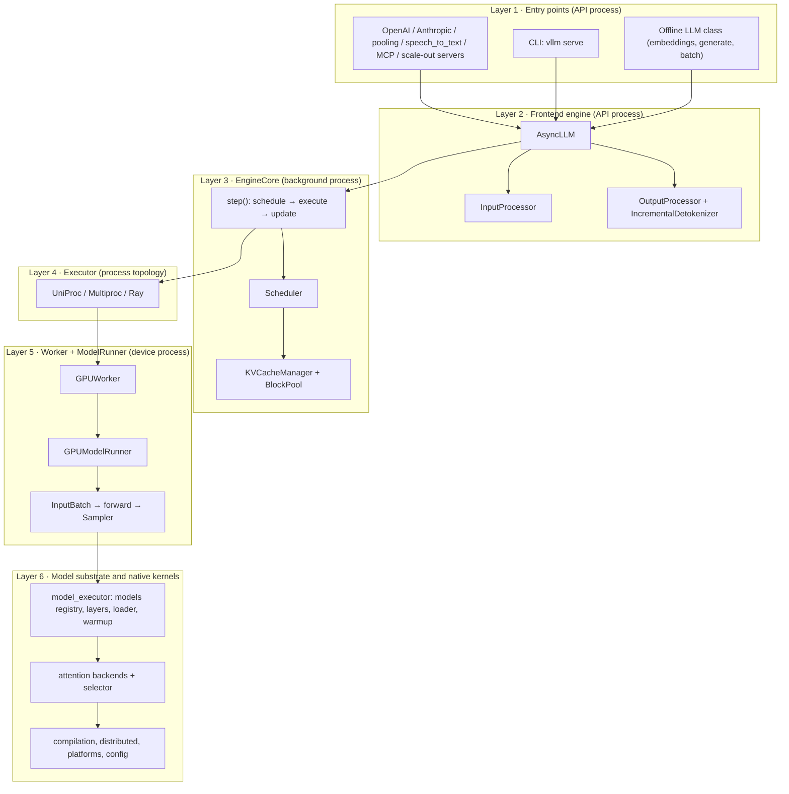

# vLLM Architecture and Code Organization Overview

**Repository:** [vllm-project/vllm](https://github.com/vllm-project/vllm)
**Inspected commit:** `a0c092ee72c0dcefbb3b3e74f97ac62d842e5f4b` (main, 2026-07-29)
**Checkout state:** clean, static reading on 2026-08-05

**Related pages:** [vLLM Continuous Batching](vllm-continuous-batching/index.md),
[vLLM Block Table Management](vllm-block-management/index.md),
[vLLM: PagedAttention Serving Framework](vllm-framework.md),
[vLLM Kimi K3 Code Reading Map](vllm-kimi-k3-code-reading.md),
[vLLM Ascend](../vllm-ascend/index.md), [Triton in Practice](../triton/triton-in-vllm.md)

## TL;DR

**What:** This page is the bird's-eye map of the vLLM codebase — what each top-level directory and each `vllm/v1/` subpackage owns, and how they compose into a serving engine.
**How:** It layers the repository from entry points down to native kernels, gives each layer a "what lives here / what it does / key files" table, and then traces one request through the V1 iteration loop with pinned code links.
**The number:** The engine is V1-only at this revision: the old standalone V0 engine is gone, the single <a class="code-link" href="../../../external-repos/vllm/vllm/v1/worker/gpu_model_runner.py#L453" data-code-repo="vllm-a0c092ee72c0" data-code-path="vllm/v1/worker/gpu_model_runner.py" data-code-line="453"><code>vllm/v1/worker/gpu_model_runner.py</code></a> is ~7,900 lines, and `vllm/model_executor/models/` holds 289 model files behind one registry.

## Why This Page Exists

Before you can understand any single component — the scheduler, the [KV cache](../../terms/kv-cache.md) stack, an attention backend, a platform port — you need to know where it lives and what boundary it sits on. This page answers two questions up front:

1. **How is the repository organized?** Which directory owns which responsibility, and what are the seams between them?
2. **How do the pieces move data at runtime?** Which objects cross which process boundaries on every model step?

The mental model to keep for the whole page: **vLLM is a three-process pipeline.** An *API process* owns HTTP and streaming, a background *engine process* owns the scheduling loop, and *device processes* (workers) own the model forward pass. Everything in the directory tree is one of these three, or substrate those processes share (config, model definitions, kernels, distributed communication).

This is a static code-reading map. Behavior claims are inferred from the pinned checkout, not from a running server; the [verification boundary](#verification-boundary-and-limits) at the end says exactly what was and was not verified.

## The Big Picture: Six Layers

The editable source for this diagram is saved locally at
[`assets/vllm-overview-layers.mmd`](assets/vllm-overview-layers.mmd).

*Synthesized explanation (not a source figure): the six-layer serving stack and the process boundary between layers 1-2, layer 3, and layer 5.*

Layers 1-2 run in the API process and never touch a GPU. Layer 3 is the single iteration brain. Layer 4 chooses how many processes host the model. Layer 5 is where scheduled token IDs become GPU tensors and come back as sampled tokens. Layer 6 is the substrate both the engine and the worker depend on.

## Where the Old V0 Engine Went

A quick orientation fact that disambiguates many old blog posts: **the standalone V0 engine no longer exists at this revision.** The top-level `vllm/engine/` directory is now a thin compatibility shim — <a class="code-link" href="../../../external-repos/vllm/vllm/engine/llm_engine.py#L1" data-code-repo="vllm-a0c092ee72c0" data-code-path="vllm/engine/llm_engine.py" data-code-line="1"><code>vllm/engine/llm_engine.py</code></a> is a one-line re-export of the V1 `LLMEngine`. There is no `vllm/attention/`, `vllm/executor/`, or `vllm/worker/` at the package root anymore; all of those live under `vllm/v1/`. When a doc or a tutorial says "vLLM V0", treat it as historical: the current codebase is V1 end to end.

## Repository Top Level

| Path | What lives here |
|---|---|
| `vllm/` | The Python package — engine, model executor, config, entry points. |
| `csrc/` | Native C++/CUDA kernels and their torch bindings: `attention/`, `moe/`, `quantization/`, `core/`, `custom_all_reduce.cuh`, <a class="code-link" href="../../../external-repos/vllm/csrc/torch_bindings.cpp#L1" data-code-repo="vllm-a0c092ee72c0" data-code-path="csrc/torch_bindings.cpp" data-code-line="1"><code>csrc/torch_bindings.cpp</code></a>, plus Cutlass extensions. |
| `benchmarks/`, `examples/`, `tests/`, `docs/` | Benchmarks, usage examples, the test suite, and project docs. |
| `docker/`, `tools/`, `scripts/` | Container images, maintenance tooling, CI scripts. |
| `rust/` | Rust toolchain sources used by some kernel components at this revision. |
| pyproject.toml, setup.py, CMakeLists.txt | Packaging and native build orchestration. |

The Python package is deliberately split so that **pure-Python orchestration** (`vllm/v1/`, `vllm/config/`, `vllm/distributed/`) stays separate from **hardware-touching code** (`csrc/`, `vllm/kernels/`, `vllm/triton_utils/`), and both stay separate from **model definitions** (`vllm/model_executor/models/`). That separation is what lets vllm-ascend and other ports reuse the engine wholesale and swap only the hardware layers.

## The `vllm/` Package: One Directory per Subsystem

| Directory | Responsibility |
|---|---|
| `vllm/v1/` | **The engine.** Frontend, EngineCore, scheduler, KV cache, executor, worker, attention, sampling, spec decode, structured output, metrics. |
| `vllm/model_executor/` | Model definitions and their reusable building blocks: `models/`, `layers/`, `model_loader/`, `warmup/`, `offloader/`, `kernels/`, and the custom-op base class in <a class="code-link" href="../../../external-repos/vllm/vllm/model_executor/custom_op.py#L1" data-code-repo="vllm-a0c092ee72c0" data-code-path="vllm/model_executor/custom_op.py" data-code-line="1"><code>vllm/model_executor/custom_op.py</code></a>. |
| `vllm/models/` | Newer hardware-isolated model packages (deepseek_v4, kimi_k3, minimax_m3, ...), separate from the classic registry in `model_executor/models/`. |
| `vllm/config/` | One module per config domain (`model`, `parallel`, `scheduler`, `cache`, `compilation`, `quantization`, ...) plus the `VllmConfig` aggregate. |
| `vllm/entrypoints/` | Public APIs: OpenAI-compatible server, Anthropic server, pooling, speech_to_text, scale-out, MCP, the `cli/` commands, and the offline `LLM` class. |
| `vllm/engine/` | V0-compat shim (alias to V1). |
| `vllm/compilation/` | torch.compile integration: compiler interface, CUDA-graph backends, piecewise backend, custom fusion passes. |
| `vllm/distributed/` | Parallel state (`GroupCoordinator`), device communicators, KV transfer, elastic expert-parallel load balancing. |
| `vllm/platforms/` | The `Platform` hardware abstraction: cuda, rocm, xpu, tpu, cpu, zen_cpu. |
| `vllm/inputs/`, `vllm/multimodal/`, `vllm/transformers_utils/`, `vllm/tokenizers/`, `vllm/parser/`, `vllm/tool_parsers/`, `vllm/reasoning/`, `vllm/renderers/` | Turning user input into tokens and features: prompt preprocessing, multimodal processing, HuggingFace config/tokenizer glue, structured content parsing. |
| `vllm/lora/` | LoRA adapter loading and runtime. |
| `vllm/triton_utils/`, `vllm/kernels/` | Triton helpers, custom-op registration, and platform kernel shims. |
| `vllm/plugins/`, `vllm/usage/`, `vllm/profiler/`, `vllm/tracing/` | Plugin loading, anonymous usage telemetry, profiling, tracing. |
| <a class="code-link" href="../../../external-repos/vllm/vllm/envs.py#L1" data-code-repo="vllm-a0c092ee72c0" data-code-path="vllm/envs.py" data-code-line="1"><code>vllm/envs.py</code></a>, <a class="code-link" href="../../../external-repos/vllm/vllm/forward_context.py#L1" data-code-repo="vllm-a0c092ee72c0" data-code-path="vllm/forward_context.py" data-code-line="1"><code>vllm/forward_context.py</code></a>, <a class="code-link" href="../../../external-repos/vllm/vllm/_custom_ops.py#L1" data-code-repo="vllm-a0c092ee72c0" data-code-path="vllm/_custom_ops.py" data-code-line="1"><code>vllm/_custom_ops.py</code></a>, <a class="code-link" href="../../../external-repos/vllm/vllm/sampling_params.py#L1" data-code-repo="vllm-a0c092ee72c0" data-code-path="vllm/sampling_params.py" data-code-line="1"><code>vllm/sampling_params.py</code></a>, <a class="code-link" href="../../../external-repos/vllm/vllm/outputs.py#L1" data-code-repo="vllm-a0c092ee72c0" data-code-path="vllm/outputs.py" data-code-line="1"><code>vllm/outputs.py</code></a>, <a class="code-link" href="../../../external-repos/vllm/vllm/sequence.py#L1" data-code-repo="vllm-a0c092ee72c0" data-code-path="vllm/sequence.py" data-code-line="1"><code>vllm/sequence.py</code></a> | Cross-cutting glue: environment variables, per-forward context, custom-op entry points, and shared data types. |

Two places deserve a zoom-in because they confuse newcomers:

- **Two model locations.** `vllm/model_executor/models/` is the classic, registry-driven home (289 files at this revision); `vllm/models/` is the newer home for hardware-isolated model packages like Kimi K3. Both end up loadable through the same machinery — the registry in <a class="code-link" href="../../../external-repos/vllm/vllm/model_executor/models/registry.py#L711" data-code-repo="vllm-a0c092ee72c0" data-code-path="vllm/model_executor/models/registry.py" data-code-line="711"><code>vllm/model_executor/models/registry.py</code></a> maps architecture names to model classes.
- **`vllm/kernels/` vs `csrc/`.** `csrc/` is compiled C++; `vllm/kernels/` and `vllm/triton_utils/` are the Python-side entry points and Triton kernels that dispatch to native code through `torch.library` custom ops.

## The V1 Engine: `vllm/v1/` Subpackages

| Subpackage | Responsibility |
|---|---|
| `v1/engine/` | Frontend (<a class="code-link" href="../../../external-repos/vllm/vllm/v1/engine/async_llm.py#L72" data-code-repo="vllm-a0c092ee72c0" data-code-path="vllm/v1/engine/async_llm.py" data-code-line="72"><code>vllm/v1/engine/async_llm.py</code></a>), `EngineCore` (<a class="code-link" href="../../../external-repos/vllm/vllm/v1/engine/core.py#L584" data-code-repo="vllm-a0c092ee72c0" data-code-path="vllm/v1/engine/core.py" data-code-line="584"><code>vllm/v1/engine/core.py</code></a>), input/output processors, detokenizer, core client, offline `LLMEngine`, coordinator. |
| `v1/core/` | The brain: `sched/` (scheduler, async scheduler, request queue, output), KV cache managers, <a class="code-link" href="../../../external-repos/vllm/vllm/v1/core/block_pool.py#L143" data-code-repo="vllm-a0c092ee72c0" data-code-path="vllm/v1/core/block_pool.py" data-code-line="143"><code>vllm/v1/core/block_pool.py</code></a>, kv-cache utilities. |
| `v1/executor/` | Process topology: uniproc, multiproc, Ray, Ray v2. |
| `v1/worker/` | Per-device execution: <a class="code-link" href="../../../external-repos/vllm/vllm/v1/worker/worker_base.py#L39" data-code-repo="vllm-a0c092ee72c0" data-code-path="vllm/v1/worker/worker_base.py" data-code-line="39"><code>vllm/v1/worker/worker_base.py</code></a>, <a class="code-link" href="../../../external-repos/vllm/vllm/v1/worker/gpu_worker.py#L128" data-code-repo="vllm-a0c092ee72c0" data-code-path="vllm/v1/worker/gpu_worker.py" data-code-line="128"><code>vllm/v1/worker/gpu_worker.py</code></a>, <a class="code-link" href="../../../external-repos/vllm/vllm/v1/worker/gpu_model_runner.py#L453" data-code-repo="vllm-a0c092ee72c0" data-code-path="vllm/v1/worker/gpu_model_runner.py" data-code-line="453"><code>vllm/v1/worker/gpu_model_runner.py</code></a>, CPU/XPU workers, [block tables](../../terms/block-table.md), DP/UB utils, and the `gpu/` subpackage (input batch, model states, spec decode, mm, pool, sample, metrics). |
| `v1/attention/` | The attention abstraction: <a class="code-link" href="../../../external-repos/vllm/vllm/v1/attention/backend.py#L56" data-code-repo="vllm-a0c092ee72c0" data-code-path="vllm/v1/attention/backend.py" data-code-line="56"><code>vllm/v1/attention/backend.py</code></a> (base class), <a class="code-link" href="../../../external-repos/vllm/vllm/v1/attention/selector.py#L101" data-code-repo="vllm-a0c092ee72c0" data-code-path="vllm/v1/attention/selector.py" data-code-line="101"><code>vllm/v1/attention/selector.py</code></a>, `backends/` (FlashAttention, FlashInfer, Triton, MLA, Mamba, FlexAttention, ROCm, ...), `ops/`. |
| `v1/sample/` | Token sampling: <a class="code-link" href="../../../external-repos/vllm/vllm/v1/sample/sampler.py#L20" data-code-repo="vllm-a0c092ee72c0" data-code-path="vllm/v1/sample/sampler.py" data-code-line="20"><code>vllm/v1/sample/sampler.py</code></a>, logits processors, rejection sampler, metadata. |
| `v1/spec_decode/` | Speculative decoding draft models: EAGLE, Medusa, N-gram proposer, draft-model base, dynamic drafts, Gemma4, DFLASH, Step3.5, suffix decoding. |
| `v1/structured_output/` | Constrained decoding backends: xgrammar, outlines, guidance, lm-format-enforcer. |
| `v1/pool/` | Embedding/pooling runs (late interaction). |
| <a class="code-link" href="../../../external-repos/vllm/vllm/v1/outputs.py#L1" data-code-repo="vllm-a0c092ee72c0" data-code-path="vllm/v1/outputs.py" data-code-line="1"><code>vllm/v1/outputs.py</code></a>, <a class="code-link" href="../../../external-repos/vllm/vllm/v1/request.py#L59" data-code-repo="vllm-a0c092ee72c0" data-code-path="vllm/v1/request.py" data-code-line="59"><code>vllm/v1/request.py</code></a> | Engine-side data contracts: `ModelRunnerOutput`, `SamplerOutput`, `Request`/`RequestStatus`. |
| <a class="code-link" href="../../../external-repos/vllm/vllm/v1/kv_cache_interface.py#L1" data-code-repo="vllm-a0c092ee72c0" data-code-path="vllm/v1/kv_cache_interface.py" data-code-line="1"><code>vllm/v1/kv_cache_interface.py</code></a>, <a class="code-link" href="../../../external-repos/vllm/vllm/v1/kv_cache_spec_registry.py#L1" data-code-repo="vllm-a0c092ee72c0" data-code-path="vllm/v1/kv_cache_spec_registry.py" data-code-line="1"><code>vllm/v1/kv_cache_spec_registry.py</code></a> | Registration seam for custom KV-cache specs (how ports add their own cache managers). |
| `v1/metrics/`, `v1/fault_tolerance/`, `v1/kv_offload/`, `v1/simple_kv_offload/` | Observability, engine restart, KV offload. |

## Component by Component

Each component below is one slice of the six-layer diagram. The pattern is the same everywhere: *the scheduler thinks in tokens, the KV manager in blocks, the worker in tensors.*

### 1. Entry Points: API, CLI, and Offline Use

**What it does:** converts HTTP, CLI, or direct Python calls into engine requests and formats engine outputs back.

The OpenAI-compatible server is assembled in <a class="code-link" href="../../../external-repos/vllm/vllm/entrypoints/openai/api_server.py#L189" data-code-repo="vllm-a0c092ee72c0" data-code-path="vllm/entrypoints/openai/api_server.py" data-code-line="189"><code>vllm/entrypoints/openai/api_server.py</code></a> (`build_app()`); chat completions are handled by <a class="code-link" href="../../../external-repos/vllm/vllm/entrypoints/openai/chat_completion/serving.py#L112" data-code-repo="vllm-a0c092ee72c0" data-code-path="vllm/entrypoints/openai/chat_completion/serving.py" data-code-line="112"><code>vllm/entrypoints/openai/chat_completion/serving.py</code></a> (`OpenAIServingChat`). The same directory also hosts completion, models, responses, and batch endpoints. Parallel entry points cover Anthropic-compatible serving, pooling, speech-to-text, an MCP tool server, and multi-server scale-out.

The offline path is the <a class="code-link" href="../../../external-repos/vllm/vllm/entrypoints/llm.py#L66" data-code-repo="vllm-a0c092ee72c0" data-code-path="vllm/entrypoints/llm.py" data-code-line="66"><code>vllm/entrypoints/llm.py</code></a> `LLM` class — the synchronous, in-process API used by scripts and tests. Both the server and the offline class ultimately feed the same engine.

**The intuition:** the entry layer is a *translator*: nothing about LLM serving lives here, only protocol in and protocol out.

### 2. Frontend Engine: Admission and Output Delivery

**What it does:** in the API process, turns rendered inputs into internal requests and turns engine outputs into streamed responses.

<a class="code-link" href="../../../external-repos/vllm/vllm/v1/engine/async_llm.py#L72" data-code-repo="vllm-a0c092ee72c0" data-code-path="vllm/v1/engine/async_llm.py" data-code-line="72"><code>vllm/v1/engine/async_llm.py</code></a> (`AsyncLLM`) is the frontend: it owns the async API surface, per-request output queues, and streaming. <a class="code-link" href="../../../external-repos/vllm/vllm/v1/engine/input_processor.py#L37" data-code-repo="vllm-a0c092ee72c0" data-code-path="vllm/v1/engine/input_processor.py" data-code-line="37"><code>vllm/v1/engine/input_processor.py</code></a> (`InputProcessor`) validates and expands an incoming request (prompt length, sampling params, multimodal features) into an `EngineCoreRequest`. On the way back, <a class="code-link" href="../../../external-repos/vllm/vllm/v1/engine/output_processor.py#L429" data-code-repo="vllm-a0c092ee72c0" data-code-path="vllm/v1/engine/output_processor.py" data-code-line="429"><code>vllm/v1/engine/output_processor.py</code></a> (`OutputProcessor`) reassembles token-level engine outputs into per-request outputs, and <a class="code-link" href="../../../external-repos/vllm/vllm/v1/engine/detokenizer.py#L31" data-code-repo="vllm-a0c092ee72c0" data-code-path="vllm/v1/engine/detokenizer.py" data-code-line="31"><code>vllm/v1/engine/detokenizer.py</code></a> (`IncrementalDetokenizer`) converts token IDs into streaming text chunks.

**The intuition:** the frontend never schedules. It is the async bridge between the protocol layer and the synchronous engine core, and it is where the *process boundary* lives — the frontend talks to the engine core over an IPC client (<a class="code-link" href="../../../external-repos/vllm/vllm/v1/engine/core_client.py#L1" data-code-repo="vllm-a0c092ee72c0" data-code-path="vllm/v1/engine/core_client.py" data-code-line="1"><code>vllm/v1/engine/core_client.py</code></a>).

### 3. EngineCore: The Iteration Loop

**What it does:** owns the scheduler, the KV cache, and the executor, and runs one step per iteration.

The internal request model is <a class="code-link" href="../../../external-repos/vllm/vllm/v1/request.py#L59" data-code-repo="vllm-a0c092ee72c0" data-code-path="vllm/v1/request.py" data-code-line="59"><code>vllm/v1/request.py</code></a> (`Request`), and the engine that drives everything is <a class="code-link" href="../../../external-repos/vllm/vllm/v1/engine/core.py#L584" data-code-repo="vllm-a0c092ee72c0" data-code-path="vllm/v1/engine/core.py" data-code-line="584" data-code-end-line="621"><code>vllm/v1/engine/core.py</code></a> (`EngineCore.step()`). Its body is the whole serving loop in four calls:

1. `scheduler.schedule(...)` — pick work for this iteration.
2. `model_executor.execute_model(scheduler_output, non_block=True)` — hand it to the workers.
3. `sample_tokens(...)` — turn logits into tokens (when the executor returns no sampled output).
4. `scheduler.update_from_output(...)` — advance requests, free finished work, emit outputs.

**The intuition:** `step()` is the heartbeat. Every component's "when does it run" question is answered by "during one of these four calls."

### 4. Scheduler and KV Cache: The Brain

**What it does:** decides which requests run, how many tokens each gets, and where their KV goes.

<a class="code-link" href="../../../external-repos/vllm/vllm/v1/core/sched/scheduler.py#L69" data-code-repo="vllm-a0c092ee72c0" data-code-path="vllm/v1/core/sched/scheduler.py" data-code-line="69"><code>vllm/v1/core/sched/scheduler.py</code></a> (`Scheduler`) tracks waiting/running requests, applies token and sequence budgets, [chunked prefill](../../terms/chunked-prefill.md), preemption, prefix reuse, and emits <a class="code-link" href="../../../external-repos/vllm/vllm/v1/core/sched/output.py#L193" data-code-repo="vllm-a0c092ee72c0" data-code-path="vllm/v1/core/sched/output.py" data-code-line="193"><code>vllm/v1/core/sched/output.py</code></a> (`SchedulerOutput`) — the exact work order the workers consume. The KV side is <a class="code-link" href="../../../external-repos/vllm/vllm/v1/core/kv_cache_manager.py#L117" data-code-repo="vllm-a0c092ee72c0" data-code-path="vllm/v1/core/kv_cache_manager.py" data-code-line="117"><code>vllm/v1/core/kv_cache_manager.py</code></a> (`KVCacheManager`), backed by <a class="code-link" href="../../../external-repos/vllm/vllm/v1/core/block_pool.py#L143" data-code-repo="vllm-a0c092ee72c0" data-code-path="vllm/v1/core/block_pool.py" data-code-line="143"><code>vllm/v1/core/block_pool.py</code></a> (`BlockPool`) (physical blocks, refcounts, prefix-cache index, eviction). Per-attention-type managers and the coordinator live in <a class="code-link" href="../../../external-repos/vllm/vllm/v1/core/single_type_kv_cache_manager.py#L1" data-code-repo="vllm-a0c092ee72c0" data-code-path="vllm/v1/core/single_type_kv_cache_manager.py" data-code-line="1"><code>vllm/v1/core/single_type_kv_cache_manager.py</code></a> and <a class="code-link" href="../../../external-repos/vllm/vllm/v1/core/kv_cache_coordinator.py#L1" data-code-repo="vllm-a0c092ee72c0" data-code-path="vllm/v1/core/kv_cache_coordinator.py" data-code-line="1"><code>vllm/v1/core/kv_cache_coordinator.py</code></a>.

**The intuition:** the scheduler thinks in *tokens* ("this request gets 256 tokens this step"), the KV manager thinks in *blocks* ("those tokens need physical slots"), and the worker later thinks in *slot-mapped tensors*. The block-management deep dive covers this stack in full.

### 5. Executor: Process Topology

**What it does:** decides how many worker processes exist and routes `execute_model` calls to them.

<a class="code-link" href="../../../external-repos/vllm/vllm/v1/executor/abstract.py#L210" data-code-repo="vllm-a0c092ee72c0" data-code-path="vllm/v1/executor/abstract.py" data-code-line="210"><code>vllm/v1/executor/abstract.py</code></a> (`Executor.execute_model()`) is the uniform API; the concrete classes in `vllm/v1/executor/` choose the topology: `UniProcExecutor` (in-process), `MultiprocExecutor` (local subprocesses), or the Ray executors (cluster). For one GPU there is effectively one worker; for tensor/pipeline/data parallel there are many, all fed from the same scheduler output.

**The intuition:** the executor is the only component that knows *how many* model copies exist. Everything above it pretends there is one.

### 6. Worker and Model Runner: Where Tokens Become Tensors

**What it does:** turns a `SchedulerOutput` into a GPU batch, runs the model forward, and samples.

The base contract is <a class="code-link" href="../../../external-repos/vllm/vllm/v1/worker/worker_base.py#L39" data-code-repo="vllm-a0c092ee72c0" data-code-path="vllm/v1/worker/worker_base.py" data-code-line="39"><code>vllm/v1/worker/worker_base.py</code></a> (`WorkerBase`); the GPU implementation is <a class="code-link" href="../../../external-repos/vllm/vllm/v1/worker/gpu_worker.py#L128" data-code-repo="vllm-a0c092ee72c0" data-code-path="vllm/v1/worker/gpu_worker.py" data-code-line="128"><code>vllm/v1/worker/gpu_worker.py</code></a> (`Worker`). The heavy lifting is <a class="code-link" href="../../../external-repos/vllm/vllm/v1/worker/gpu_model_runner.py#L453" data-code-repo="vllm-a0c092ee72c0" data-code-path="vllm/v1/worker/gpu_model_runner.py" data-code-line="453"><code>vllm/v1/worker/gpu_model_runner.py</code></a> (`GPUModelRunner`) — at roughly 7,900 lines, the largest file in the repo, covering persistent batch state, input-batch construction, slot mapping, forward execution, and CUDA-graph capture. Token selection happens in <a class="code-link" href="../../../external-repos/vllm/vllm/v1/sample/sampler.py#L20" data-code-repo="vllm-a0c092ee72c0" data-code-path="vllm/v1/sample/sampler.py" data-code-line="20"><code>vllm/v1/sample/sampler.py</code></a> (`Sampler`).

**The intuition:** everything upstream is about *which tokens* to compute; everything from here down is about *how to compute them fast* — persistent batches, pre-allocated tensors, graph capture, fused kernels.

### 6.5 Worker vs. Model Runner: Process Shell vs. Step Executor

`WorkerBase` and `GPUModelRunner` look like two names for the same thing — both live in `vllm/v1/worker/`, both have `execute_model()`. The split is deliberate: **the worker is the process-level shell (the object the executor talks to across the process boundary), and the model runner is the step-level executor inside it (the object that actually runs the model).**

| Concern | Worker (`WorkerBase` → `Worker`) | Model Runner (`GPUModelRunner`) |
|---|---|---|
| Role | Process shell + RPC surface | Step executor |
| Device and process | Binds the device, initializes the distributed environment, memory profiling | — |
| Model weights | Orchestrates loading (`load_model` → runner) | Actually loads weights into the model |
| KV cache | `initialize_from_config` → runner | Allocates the KV cache tensors |
| Per-step forward | Pipeline-parallel send/receive, then delegates | Builds `InputBatch`, runs the forward |
| Sampling | Delegates | Runs `sample_tokens` |
| Warmup / graphs | `compile_or_warm_up_model` → runner | `_dummy_run`, `profile_run`, `capture_model` |
| Lifecycle | sleep/wakeup, health check, LoRA passthrough, weight transfer | — |

Concretely, the executor (engine process) calls <a class="code-link" href="../../../external-repos/vllm/vllm/v1/worker/gpu_worker.py#L1019" data-code-repo="vllm-a0c092ee72c0" data-code-path="vllm/v1/worker/gpu_worker.py" data-code-line="1019"><code>Worker.execute_model</code></a>; the worker handles pipeline-parallel send/receive and then calls <a class="code-link" href="../../../external-repos/vllm/vllm/v1/worker/gpu_model_runner.py#L4166" data-code-repo="vllm-a0c092ee72c0" data-code-path="vllm/v1/worker/gpu_model_runner.py" data-code-line="4166"><code>GPUModelRunner.execute_model</code></a>. Memory is profiled by <a class="code-link" href="../../../external-repos/vllm/vllm/v1/worker/gpu_worker.py#L460" data-code-repo="vllm-a0c092ee72c0" data-code-path="vllm/v1/worker/gpu_worker.py" data-code-line="460"><code>Worker.determine_available_memory</code></a> (which invokes the runner's `profile_run`), weights are loaded by <a class="code-link" href="../../../external-repos/vllm/vllm/v1/worker/gpu_model_runner.py#L5303" data-code-repo="vllm-a0c092ee72c0" data-code-path="vllm/v1/worker/gpu_model_runner.py" data-code-line="5303"><code>GPUModelRunner.load_model</code></a>, KV tensors are created by <a class="code-link" href="../../../external-repos/vllm/vllm/v1/worker/gpu_model_runner.py#L7612" data-code-repo="vllm-a0c092ee72c0" data-code-path="vllm/v1/worker/gpu_model_runner.py" data-code-line="7612"><code>GPUModelRunner.initialize_kv_cache</code></a>, and graphs are captured by <a class="code-link" href="../../../external-repos/vllm/vllm/v1/worker/gpu_model_runner.py#L6806" data-code-repo="vllm-a0c092ee72c0" data-code-path="vllm/v1/worker/gpu_model_runner.py" data-code-line="6806"><code>GPUModelRunner.capture_model</code></a>.

**Why the split exists:** three reasons. ① **A stable RPC surface** — the executor needs one small interface per device process; the worker is that interface, no matter how complex model execution gets. ② **Lifecycle vs. step concerns** — once-per-process work (device setup, memory budget, sleep, health) must not mix with per-step work (batch build, forward, sampling). ③ **Hardware containment** — almost all hardware-specific code lives in the model runner (tensors, kernels, graph capture), so porting to a new accelerator mostly means writing a new model runner while the worker stays a thin delegator. This is exactly the pattern vllm-ascend follows: `NPUWorker.execute_model()` delegates per-step work to `NPUModelRunner.execute_model()` (see [vLLM-Ascend Architecture](../vllm-ascend/architecture.md)).

### 7. Model Executor: Definitions, Layers, and Weight Loading

**What it does:** maps architecture names to model classes, provides reusable layers, and loads weights.

The registry is <a class="code-link" href="../../../external-repos/vllm/vllm/model_executor/models/registry.py#L711" data-code-repo="vllm-a0c092ee72c0" data-code-path="vllm/model_executor/models/registry.py" data-code-line="711"><code>vllm/model_executor/models/registry.py</code></a> (`_VLLM_MODELS`), which merges text-generation, embedding, late-interaction, reward, token-classification, sequence-classification, multimodal, and speculative-decoding model dicts. Model files in `vllm/model_executor/models/` (289 files) each define `XxxForCausalLM`-style classes that reuse building blocks from `vllm/model_executor/layers/`, including attention, fused expert layers, quantization, rotary embeddings, and [LayerNorm](../../terms/layer-normalization.md): <a class="code-link" href="../../../external-repos/vllm/vllm/model_executor/layers/linear.py#L1" data-code-repo="vllm-a0c092ee72c0" data-code-path="vllm/model_executor/layers/linear.py" data-code-line="1"><code>vllm/model_executor/layers/linear.py</code></a>, <a class="code-link" href="../../../external-repos/vllm/vllm/model_executor/layers/layernorm.py#L1" data-code-repo="vllm-a0c092ee72c0" data-code-path="vllm/model_executor/layers/layernorm.py" data-code-line="1"><code>vllm/model_executor/layers/layernorm.py</code></a>, <a class="code-link" href="../../../external-repos/vllm/vllm/model_executor/layers/vocab_parallel_embedding.py#L1" data-code-repo="vllm-a0c092ee72c0" data-code-path="vllm/model_executor/layers/vocab_parallel_embedding.py" data-code-line="1"><code>vllm/model_executor/layers/vocab_parallel_embedding.py</code></a>, and more. Weight loading is `vllm/model_executor/model_loader/` (default, sharded-state, tensorizer, bitsandbytes, runai-streamer loaders), and CUDA-graph warmup is `vllm/model_executor/warmup/`.

**The intuition:** the model files are *thin assemblers*. They describe which layers to stack; the actual compute lives in the reusable layers and the native kernels behind them.

### 8. Attention Backends: Swappable Attention Kernels

**What it does:** lets one model definition run on many attention implementations.

<a class="code-link" href="../../../external-repos/vllm/vllm/v1/attention/backend.py#L56" data-code-repo="vllm-a0c092ee72c0" data-code-path="vllm/v1/attention/backend.py" data-code-line="56"><code>vllm/v1/attention/backend.py</code></a> (`AttentionBackend`) defines the contract (metadata, forward, and build), and <a class="code-link" href="../../../external-repos/vllm/vllm/v1/attention/selector.py#L101" data-code-repo="vllm-a0c092ee72c0" data-code-path="vllm/v1/attention/selector.py" data-code-line="101"><code>vllm/v1/attention/selector.py</code></a> (`get_attn_backend()`) picks one based on model and platform. The `vllm/v1/attention/backends/` directory holds ~26 modules: FlashAttention, FlashInfer, Triton, MLA, Mamba (1/2/attn), FlexAttention, [linear attention](../../terms/linear-attention.md), ROCm variants, HPC attention, and more. This is the primary extension point a hardware port replaces — vllm-ascend's FIA/MLA/SFA/DSA backends plug in here.

**The intuition:** model code calls *an* attention backend, never *the* attention kernel. Porting to a new accelerator starts by registering a backend here.

### 8.5 The Two Attention Layers: Model Module vs. Runtime Backend

The "two attention directories" — `vllm/model_executor/layers/attention/` and `vllm/v1/attention/` — answer two different questions: *what attention is* versus *how it runs on this hardware*.

| Aspect | Model-side attention module | Runtime attention backend |
|---|---|---|
| Directory | `vllm/model_executor/layers/attention/` | `vllm/v1/attention/` |
| Role | The `nn.Module` that model files build into each layer | The compute implementation behind that module |
| Owns | QKV/output projections, RoPE, KV-cache spec | Kernel launch, attention metadata, KV block layout |
| Hardware-specific? | No — it delegates | Yes |
| Concrete classes | <a class="code-link" href="../../../external-repos/vllm/vllm/model_executor/layers/attention/attention.py#L223" data-code-repo="vllm-a0c092ee72c0" data-code-path="vllm/model_executor/layers/attention/attention.py" data-code-line="223"><code>Attention</code></a>, <a class="code-link" href="../../../external-repos/vllm/vllm/model_executor/layers/attention/mla_attention.py#L346" data-code-repo="vllm-a0c092ee72c0" data-code-path="vllm/model_executor/layers/attention/mla_attention.py" data-code-line="346"><code>MLAAttention</code></a>, CrossAttention, ... | FlashAttention, FlashInfer, Triton, MLA, Mamba, FlexAttention, ROCm, HPC, ... |

**Model-side modules** are what `vllm/model_executor/models/` instantiates inside every transformer layer. An `Attention` module owns the weight-bearing pieces — QKV projection, output projection, RoPE — and declares the KV-cache spec it needs. It is hardware-agnostic: in `__init__` it asks the selector for a backend class with `get_attn_backend(...)` and stores it as `self.attn_backend`, then builds the backend's implementation with `get_impl_cls()`.

**Runtime backends** are the compute. The <a class="code-link" href="../../../external-repos/vllm/vllm/v1/attention/backend.py#L56" data-code-repo="vllm-a0c092ee72c0" data-code-path="vllm/v1/attention/backend.py" data-code-line="56"><code>AttentionBackend</code></a> contract and the `get_attn_backend()` selector are introduced in section 8. At forward time the module's <a class="code-link" href="../../../external-repos/vllm/vllm/model_executor/layers/attention/attention.py#L488" data-code-repo="vllm-a0c092ee72c0" data-code-path="vllm/model_executor/layers/attention/attention.py" data-code-line="488"><code>Attention.forward()</code></a> hands the reshaped Q/K/V to the backend implementation, which launches the actual kernel.

**Where the hardware-specific code lives:**

| Concern | Hardware-specific home |
|---|---|
| Attention kernels per accelerator | `vllm/v1/attention/backends/` (ROCm Aiter, HPC, FlashInfer, Triton, ...) |
| Which backends a device may use | `vllm/platforms/` — e.g. `NPUPlatform.get_attn_backend_cls()` returns the Ascend FIA/MLA/SFA/DSA backends (see [vLLM Ascend](../vllm-ascend/index.md)) |
| Native and Triton kernels | `csrc/`, `vllm/kernels/`, `vllm/triton_utils/` |
| Cross-device communication | `vllm/distributed/device_communicators/` |
| Per-device execution | `vllm/v1/worker/` (gpu_worker, cpu_worker, xpu_worker, ...) |

**The one-line rule:** the model module decides *what attention is* for the model; the backend decides *how it runs on this hardware*.

### 9. Compilation, Distributed, and Platforms: The Cross-Cutting Substrate

**Compilation** — <a class="code-link" href="../../../external-repos/vllm/vllm/compilation/compiler_interface.py#L27" data-code-repo="vllm-a0c092ee72c0" data-code-path="vllm/compilation/compiler_interface.py" data-code-line="27"><code>vllm/compilation/compiler_interface.py</code></a> (`CompilerInterface`) is the seam for custom compile backends; `vllm/compilation/` also holds the CUDA-graph and piecewise backends, breakable-cudagraph support, and the custom fusion passes in `vllm/compilation/passes/`.

**Distributed** — <a class="code-link" href="../../../external-repos/vllm/vllm/distributed/parallel_state.py#L1319" data-code-repo="vllm-a0c092ee72c0" data-code-path="vllm/distributed/parallel_state.py" data-code-line="1319"><code>vllm/distributed/parallel_state.py</code></a> (`init_model_parallel_group()`) builds the TP/PP/DP/EP groups; `vllm/distributed/device_communicators/` holds the actual [all-reduce](../../terms/all-reduce.md)/[all-gather](../../terms/all-gather.md) implementations (custom all-reduce, NCCL, flashinfer all-reduce, CPU comms).

**Platforms** — <a class="code-link" href="../../../external-repos/vllm/vllm/platforms/interface.py#L134" data-code-repo="vllm-a0c092ee72c0" data-code-path="vllm/platforms/interface.py" data-code-line="134"><code>vllm/platforms/interface.py</code></a> (`Platform`) is the hardware contract (device name, capability, inference mode, cudagraph defaults, kernel imports); concrete subclasses live in `vllm/platforms/` (cuda, rocm, xpu, tpu, cpu, zen_cpu). A new accelerator implements this class and registers it — this is exactly how `NPUPlatform` enters in vllm-ascend.

**Config** — <a class="code-link" href="../../../external-repos/vllm/vllm/config/vllm.py#L308" data-code-repo="vllm-a0c092ee72c0" data-code-path="vllm/config/vllm.py" data-code-line="308"><code>vllm/config/vllm.py</code></a> (`VllmConfig`) is the aggregate config object that flows everywhere (model, parallel, scheduler, cache, compilation, quantization, speculative, kv-transfer, ...), with one module per domain in `vllm/config/`.

**Multimodal** — <a class="code-link" href="../../../external-repos/vllm/vllm/multimodal/registry.py#L98" data-code-repo="vllm-a0c092ee72c0" data-code-path="vllm/multimodal/registry.py" data-code-line="98"><code>vllm/multimodal/registry.py</code></a> (`MultiModalRegistry`) maps multimodal input types (image, audio, video) to the processors and hooks a model supports.

## Putting It Together: One Request Through the Six Layers

The full request lifecycle, numbered to match the diagram:

1. **Layer 1 → 2:** `/v1/chat/completions` reaches `build_app()`'s router, `OpenAIServingChat` renders the messages, and `AsyncLLM.generate()` takes over. `InputProcessor` expands the payload into an `EngineCoreRequest`.
2. **Layer 2 → 3:** the frontend registers the request in `OutputProcessor` (so outputs have a destination) and ships the `EngineCoreRequest` to the engine process over the core client.
3. **Layer 3 (admission):** `EngineCore.preprocess_add_request` builds a rich internal `Request` (grammar state, block hashes for prefix caching, multimodal features).
4. **Layer 3 (iteration):** on every `step()`, `Scheduler.schedule()` picks work under token/sequence budgets, `KVCacheManager` allocates physical blocks via `BlockPool`, and a `SchedulerOutput` describes the batch.
5. **Layer 4:** `Executor.execute_model()` dispatches that `SchedulerOutput` to one or many workers.
6. **Layer 5:** `GPUWorker`/`GPUModelRunner` build the `InputBatch`, map tokens to KV slots, run the model forward (attention backends + fused layers + native kernels), and `Sampler` picks next tokens.
7. **Layer 3 (consumption):** `Scheduler.update_from_output()` appends sampled tokens, handles stop/preemption, frees finished requests, and emits `EngineCoreOutputs`.
8. **Layer 2 → 1:** `OutputProcessor` reassembles per-request outputs, `IncrementalDetokenizer` produces text chunks, and the API layer streams them back.

## Extension Points

| You want to... | Where you plug in |
|---|---|
| Add a new model architecture | New file in `vllm/model_executor/models/`, registered in <a class="code-link" href="../../../external-repos/vllm/vllm/model_executor/models/registry.py#L711" data-code-repo="vllm-a0c092ee72c0" data-code-path="vllm/model_executor/models/registry.py" data-code-line="711"><code>vllm/model_executor/models/registry.py</code></a>. |
| Add an attention implementation | New module in `vllm/v1/attention/backends/`, selected via <a class="code-link" href="../../../external-repos/vllm/vllm/v1/attention/selector.py#L101" data-code-repo="vllm-a0c092ee72c0" data-code-path="vllm/v1/attention/selector.py" data-code-line="101"><code>vllm/v1/attention/selector.py</code></a>. |
| Support a new accelerator | Implement a <a class="code-link" href="../../../external-repos/vllm/vllm/platforms/interface.py#L134" data-code-repo="vllm-a0c092ee72c0" data-code-path="vllm/platforms/interface.py" data-code-line="134"><code>vllm/platforms/interface.py</code></a> `Platform` subclass and register it; add attention backends and kernels. |
| Add a quantization scheme | New config + method under `vllm/model_executor/layers/quantization/`. |
| Add a KV-cache spec | Register via <a class="code-link" href="../../../external-repos/vllm/vllm/v1/kv_cache_spec_registry.py#L1" data-code-repo="vllm-a0c092ee72c0" data-code-path="vllm/v1/kv_cache_spec_registry.py" data-code-line="1"><code>vllm/v1/kv_cache_spec_registry.py</code></a> / <a class="code-link" href="../../../external-repos/vllm/vllm/v1/kv_cache_interface.py#L1" data-code-repo="vllm-a0c092ee72c0" data-code-path="vllm/v1/kv_cache_interface.py" data-code-line="1"><code>vllm/v1/kv_cache_interface.py</code></a>. |
| Add a draft model for speculative decoding | New module under `vllm/v1/spec_decode/`. |
| Add a constrained-decoding backend | New module under `vllm/v1/structured_output/`. |

## Where to Look When Something Breaks

| Symptom | Where to start | Why |
|---|---|---|
| Requests never admitted / stuck waiting | <a class="code-link" href="../../../external-repos/vllm/vllm/v1/core/sched/scheduler.py#L69" data-code-repo="vllm-a0c092ee72c0" data-code-path="vllm/v1/core/sched/scheduler.py" data-code-line="69"><code>vllm/v1/core/sched/scheduler.py</code></a> | Admission, budgets, and preemption all live here. |
| KV memory errors, wrong blocks, prefix-cache misses | `vllm/v1/core/` (managers, <a class="code-link" href="../../../external-repos/vllm/vllm/v1/core/block_pool.py#L143" data-code-repo="vllm-a0c092ee72c0" data-code-path="vllm/v1/core/block_pool.py" data-code-line="143"><code>vllm/v1/core/block_pool.py</code></a>) | Block accounting and eviction live here. |
| Wrong output tokens or sampling bugs | `vllm/v1/sample/` and the model runner | Sampling happens in the worker. |
| CUDA-graph capture or warmup failures | `vllm/model_executor/warmup/`, `vllm/compilation/` | Graph capture and compile backends. |
| Distributed hang or wrong shapes across ranks | `vllm/distributed/` | Group init and communicators. |
| "Platform X not supported" or wrong defaults | `vllm/platforms/` | Hardware contract and defaults. |
| Model fails to load weights | `vllm/model_executor/model_loader/` | Loaders and weight utils. |
| Streaming responses lag or drop | `vllm/v1/engine/` (frontend, output processor, detokenizer) | Output delivery path. |

## Verification Boundary and Limits

- **Static reading only.** Everything here is inferred from the pinned checkout at `a0c092ee72c0`; no model was served and no runtime behavior was executed.
- **Revision-bound.** Layout, file lists, and line numbers describe exactly this revision (main, 2026-07-29). vLLM changes fast; later revisions may move or remove modules.
- **Counts are approximate.** "289 model files" and "~26 attention backend modules" come from directory listings at this revision and include helper modules.
- **V1-only framing.** This page describes the current V1 engine; historical V0 documentation will not match the directory tree.

## One Thing to Remember

vLLM is a **three-process pipeline with a single heartbeat**: the API process translates protocol to and from requests, the engine process runs `step() = schedule → execute → update` over and over, and device processes turn each scheduled batch into tensor work and sampled tokens. When you open any file, first ask which process it runs in and which of the four `step()` calls it serves — that single question places almost every module in the repository.

## Go Deeper

- **The decoder attention handoff:** [vLLM MHA Code Path](vllm-mha-code-path.md)
- **The iteration loop in detail:** [vLLM Continuous Batching](vllm-continuous-batching/index.md)
- **The KV cache stack:** [vLLM Block Table Management](vllm-block-management/index.md)
- **The original paper:** [vLLM: PagedAttention Serving Framework](vllm-framework.md)
- **Dig into the mechanisms:** [PagedAttention](../../terms/pagedattention.md) (paged KV-cache layout) and [Continuous Batching](../../terms/continuous-batching.md) (the V1 iteration loop).
- **A model-level reading map:** [vLLM Kimi K3 Code Reading Map](vllm-kimi-k3-code-reading.md)
- **The Ascend port that reuses this engine:** [vLLM Ascend](../vllm-ascend/index.md)
- **How Triton kernels plug in:** [Triton in Practice](../triton/triton-in-vllm.md)
- **Editable diagram source:** [assets/vllm-overview-layers.mmd](assets/vllm-overview-layers.mmd)
