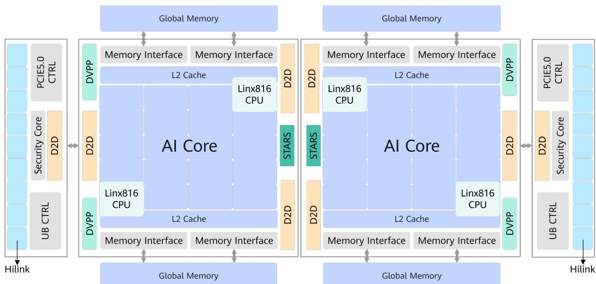
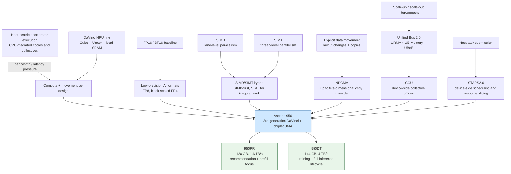
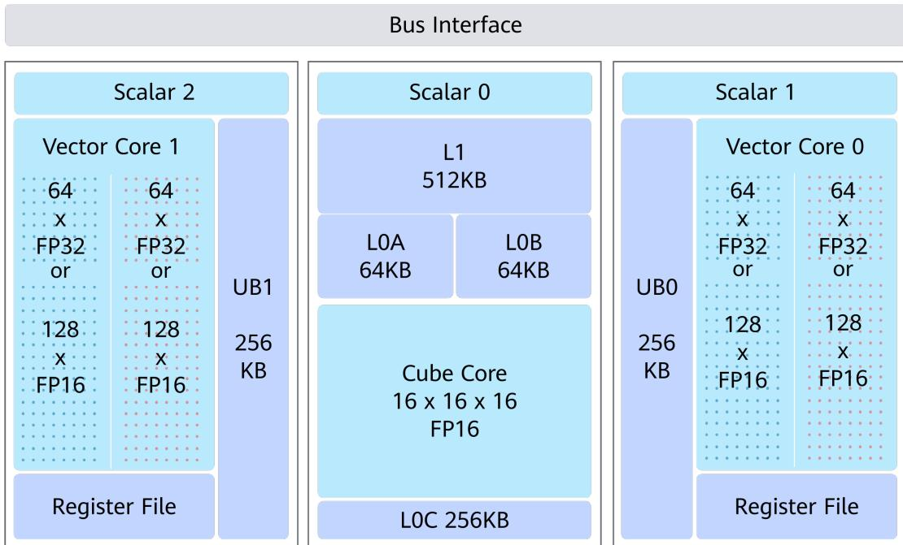
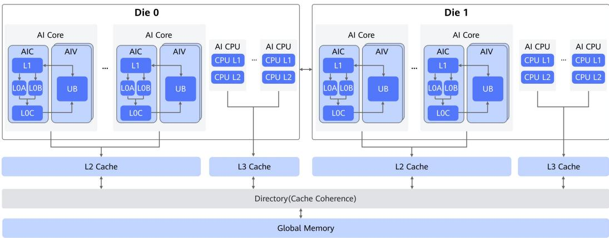
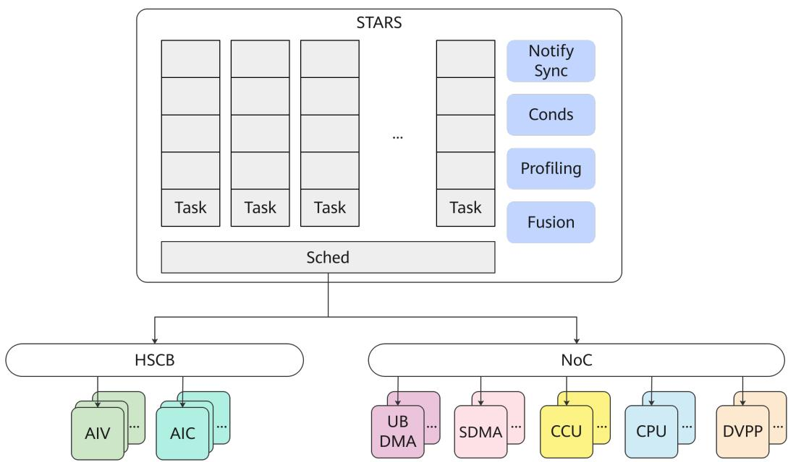
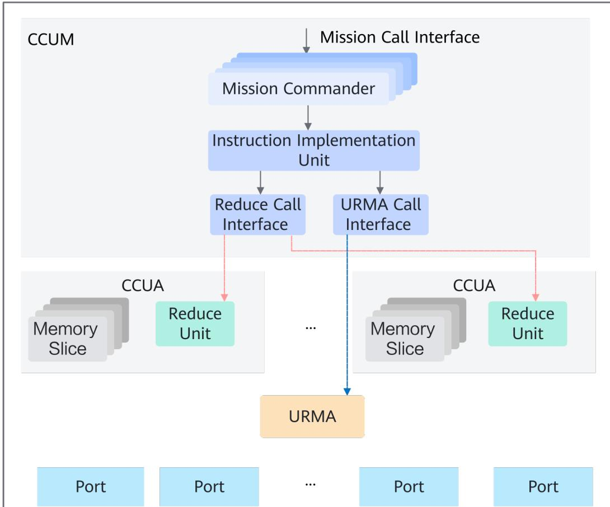
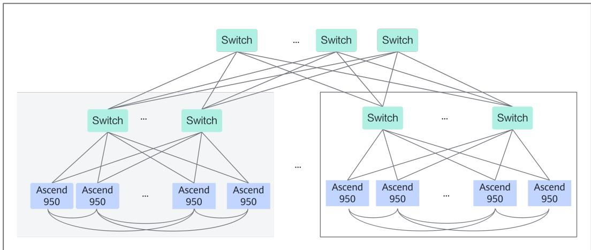

# Ascend 950 NPU Architecture: Compute, Memory, and Unified Bus

**Paper:** [昇腾 950 NPU 架构白皮书](../../../../raw/hardware/ascend-950-npu-architecture-white-paper--paper.pdf)
**Authors:** Huawei Technologies Co., Ltd.
**arXiv:** Not applicable — Huawei vendor white paper, copyright 2026

**Related pages:** [Ascend NPU](../index.md) · [Triton Ascend Operator Mechanisms](../../../frameworks/triton-ascend/operator-mechanisms.md) · [vLLM-Ascend Architecture](../../../frameworks/vllm-ascend/architecture.md) · [Microscaling (MX) Formats](../../quantization/microscaling-mx-formats/index.md) · [NVIDIA GPU Evolution](../../nvidia/index.md)

> **Evidence:** This page is a static synthesis of the white paper and its precise Chinese-language MinerU extraction. The specifications and speedups are Huawei-reported capabilities; the source does not provide an independent benchmark harness or enough workload detail to reproduce the headline numbers.

## TL;DR

**What:** Ascend 950 is a two-product NPU family that treats Transformer performance as a system problem spanning low-precision arithmetic, data movement, memory locality, scheduling, and cluster interconnect.

**How:** Third-generation DaVinci combines Cube and Vector cores, direct Cube–Vector paths, native [FP8](../../../terms/fp8.md)/[HiF8](../../../terms/hif8.md)/[microscaled MXFP4 and MXFP8](../../../terms/microscaling.md), [chiplet](../../../terms/chiplet.md) UMA memory, [STARS2.0](../../../terms/stars-scheduler.md) scheduling, and [Unified Bus (UB)](../../../terms/unified-bus.md) 2.0 semantics for remote memory and [CCU](../../../terms/ccu.md) collectives over [URMA](../../../terms/urma.md).

**The number:** The paper reports up to 36 AI subsystems, 128 MB L2 cache, 128 GB at 1.6 TB/s for 950PR, 144 GB at 4 TB/s for 950DT, 2 TB/s bidirectional UB IO, and an 8,192-card supernode capability.

## The Big Picture

*Source: Figure 3-1 in the [Ascend 950 white paper](../../../../raw/hardware/ascend-950-npu-architecture-white-paper--paper.pdf). ① Two AI dies hold the main AI Core and local L2/memory-interface complex. ② IO dies expose HiLink, Unified Bus, PCIe, security, and die-to-die paths. ③ Global memory attaches to both compute dies, making the package one UMA address space rather than isolated accelerator islands.*

The picture answers the most important architectural question: **where does a model's work go after it leaves the matrix unit?** Compute, cache, memory, scheduling, media, and interconnect are all first-class blocks. The white paper's claim is therefore broader than a peak-TFLOPS claim: the chip is designed to keep data flowing between those blocks and then extend the same semantics across many chips.

## Why This Exists

Consider one long-context AI-agent request that contains images, a large prompt, and many decode steps. The request first needs image decode and resize, then repeated matrix products and elementwise attention work, while its growing [KV Cache](../../../terms/kv-cache.md) competes for memory with weights and intermediate tensors. At cluster scale, training and serving also exchange large [All-to-All](../../../terms/all-to-all.md) payloads. If each boundary is handled by a host round trip or a separate global-memory write, the arithmetic units can be fast while the end-to-end request remains slow.

The paper addresses that failure at the boundary where it occurs: DVPP handles media, Cube handles dense matrix work, Vector handles flexible functions, NDDMA handles layout-aware movement, L2 hints preserve useful reuse, STARS keeps task submission on the device, and UB/CCU move or reduce data without making the host orchestrate every transfer. **The pain is not one slow unit; it is the bubbles between units.**

## The Landscape

The white paper is a product architecture document, not a survey of accelerator history. The tree below is a knowledge-base synthesis: older accelerator patterns supply the pressures, while DaVinci, low-precision formats, mixed vector programming, device-side scheduling, and collective-aware interconnects converge in Ascend 950.

*Synthesized landscape from the white paper's architecture and motivation. The arrows show converging design pressures and architectural branches, not a claim that every feature was first introduced in Ascend 950.*

[Editable Mermaid source](./assets/ascend-950-landscape.mmd)

## The Core Idea

**Ascend 950 makes dataflow a hardware contract.** It uses specialized compute for matrix and vector work, keeps intermediate data close through a unified memory hierarchy, converts layouts and precisions while data is already moving, schedules many engines from the device side, and exposes the same memory/collective ideas across chips. The result is an accelerator whose useful performance depends on how well a model maps onto the complete path, not on a single peak number.

## Symbol Map

The paper reuses `UB` for two different things: Unified Buffer inside a Vector Core and Unified Bus between chips. `AIC`/`AIV` mean AI Cube/Vector Core, while `PR` and `DT` distinguish two memory-oriented product targets. `L0A/L0B/L0C`, `L1`, `UB`, `L2`, and global memory describe progressively broader storage scopes.

| Symbol or name | Human name | Scope | Plain meaning |
|---|---|---|---|
| `950PR` / `950DT` | Ascend 950 product variants | Chip | PR emphasizes recommendation and prefill; DT targets training plus decode and prefill. |
| `AIC` / `AIV` | AI Cube Core / AI Vector Core | AI subsystem | Matrix-oriented and vector-oriented execution units. |
| `AI Die` / `IO Die` | Compute die / communication die | Package | AI Dies contain the main compute complexes; IO Dies expose external and die-to-die connectivity. |
| `L0A/L0B/L0C` | Cube operand/output buffers | Per AI Core | Small Cube-local buffers for operands and accumulation. |
| `UB` (Unified Buffer) | Vector-local buffer | Per Vector Core | On-chip storage used by Vector operations; distinct from Unified Bus. |
| `L2 Cache` | Shared AI cache | Chip / two-die UMA | Up to 128 MB, hardware-coherent across the two AI dies. |
| `HiF8` | Huawei 8-bit floating-point format | Cube data type | Variable-prefix exponent encoding intended to provide wider range than FP8 E4M3 without an extra MX scale byte. |
| `MXFP4` / `MXFP8` | Microscaled FP4 / FP8 | Cube data type | Low-precision formats that use block-level scaling and native tensor support. |
| `NDDMA` | N-dimensional Direct Memory Access | AI Core movement | Copies and rearranges up to five dimensions while loading data into Unified Buffer. |
| `STARS2.0` | System Task and Resource Scheduler | Whole chip | Device-side task, resource, synchronization, and profiling coordinator. |
| `URMA` | UB Remote Memory Access | Interconnect semantic | Asynchronous remote copy, message, and atomic operations through Jetty queues. |
| `CCU` | Collective Communication Unit | Interconnect accelerator | Hardware engine that combines remote movement and reductions for collective algorithms. |

## Deep Dive

### 1. Two products share a chiplet UMA

**What it does:** Builds 950PR and 950DT from a common multi-die architecture, then changes the high-speed on-chip memory to target different workload mixes.

**Why it matters:** A long-context request needs capacity and bandwidth at the same time, but recommendation/prefill and full-lifecycle training/decode do not stress those resources in exactly the same way.

**How it works:**

1. The package combines two AI Dies, two IO Dies, and eight high-speed memory modules for 950PR or four for 950DT, connected through die-to-die links and memory interfaces.
2. The full architecture contains up to 36 AI subsystems; each has one Cube Core and two Vector Cores. It also includes four Linx816 AI CPU clusters, four DVPP subsystems, 128 MB of L2 cache, and STARS2.0.
3. Hardware maintains the address-space and L2-coherence relationship across the two AI Dies, so software does not have to manually manage a separate cache domain for each die.
4. The product variants expose different high-speed-memory envelopes:

| Variant | Source-reported memory envelope | Intended emphasis |
|---|---:|---|
| 950PR | Up to 128 GB and 1.6 TB/s | High-performance recommendation, multimodal inference, and Transformer prefill |
| 950DT | Up to 144 GB and 4 TB/s | Pretraining, post-training, and full inference including decode and prefill |

**The intuition:** The two products share the same engine room but tune the size and speed of the nearby fuel tank.

**A concrete example:** For the long-context agent request, the same Cube/Vector path can run on either product, but the paper positions PR around the prompt-heavy prefill phase and DT around workloads that must hold more state and sustain higher memory bandwidth across training and decode.

**Remember:** Never compare a PR number with a DT number without checking whether it is a core-count variant, a memory limit, or a bandwidth limit.

### 2. Cube makes low precision a first-class tensor path

**What it does:** Adds native support for HiF8, MXFP8, MXFP4, and FP8 alongside TF32, FP16, BF16, and INT8, with hardware paths for tensor computation and format conversion.

**Why it matters:** Transformer arithmetic is often limited by bytes moved as much as by multiplies performed. Narrower operands can reduce traffic and raise peak tensor throughput, but only when the format, scaling, layout, and accumulation path are all supported.

**How it works:**

1. The third-generation Cube Core supports FP16/BF16 as the comparison baseline and reports two times that tensor throughput for HiF8/MXFP8/FP8 and four times for MXFP4 at the same frequency.
2. The paper describes HiF8 as an 8-bit format with a variable-length prefix that indicates exponent width and denormal state. Its combined exponent range is reported as `[-22, 15]`, or 38 powers of two, close to the paper's FP16 comparison.
3. Unlike MXFP8, HiF8 does not require an additional 8-bit microscale alongside each value. MXFP4 and MXFP8 instead belong to the [microscaling](../../../terms/microscaling.md) family, where a block-level scale is part of the representation.
4. Cube can quantize and change layout while writing results from L0C to Unified Buffer, including FP32 to BF16/FP16/FP8 and NZ to ND/DN conversions.

| Source claim | What it tells us | What it does not tell us |
|---|---|---|
| MXFP4 provides 4× FP16 tensor TFLOPS at equal frequency | The datapath has a high-throughput native low-precision mode | A complete model will run 4× faster or preserve accuracy automatically |
| HiF8 exposes 38 powers of two | The format trades bit-level simplicity for a wider range than FP8 E4M3 | How every model's calibration and error compare with FP8 or BF16 |
| L0C-to-UB supports on-the-fly conversion | Epilogues can reduce stored bytes and layout-conversion kernels | That every conversion is free or fused in every software stack |

**The intuition:** The hardware is not merely willing to consume small numbers; it gives their scales, conversions, and output layouts a place in the datapath.

**A concrete example:** In the agent request's attention projection, a supported low-precision GEMM can use narrow operands, accumulate in the documented higher-precision path, and write a format/layout that the next Vector operation can consume without a separate full-size conversion round trip.

**Remember:** A peak-format claim is conditional on the model and kernel using that native format end to end.

### 3. Vector, SIMD/SIMT, and CV fusion close the non-matrix gap

**What it does:** Strengthens Vector Core execution and lets regular vector work and irregular thread work share one programming model, while direct Cube–Vector links fuse matrix and non-matrix stages.

**Why it matters:** Operations around a Transformer [GEMM](../../../terms/gemm.md)—Softmax, GELU, masking, reductions, gathers, and format conversion—can become the bottleneck if the Cube finishes before Vector work or if intermediate data must visit global memory.

**How it works:**

1. Vector Core doubles FP16 and FP32 single-core throughput versus the previous generation, adds native BF16 and conversion instructions, and optimizes functions such as Softmax and GELU.
2. The [SIMD/SIMT hybrid programming](../../../terms/simd-simt-hybrid-programming.md) model uses SIMD as the main high-throughput path for regular elementwise work and SIMT for irregular addresses or branches such as gather/scatter and hash insertion.
3. A register file between Unified Buffer and Vector ALU supplies temporary values with more bandwidth and reuse than repeatedly returning to the buffer.
4. CV fusion provides a direct Cube L1 Buffer to Vector Unified Buffer path and supports in-flight precision and layout conversion, avoiding an otherwise expensive L2 or global-memory handoff.

*Source: Figure 4-1 in the [Ascend 950 white paper](../../../../raw/hardware/ascend-950-npu-architecture-white-paper--paper.pdf). The diagram shows the local storage and the separation between Cube and Vector execution that CV fusion is designed to bridge.*

**The intuition:** Cube is the fast matrix engine, Vector is the flexible finishing crew, and CV fusion removes the loading dock between them.

**A concrete example:** For attention, Cube can produce matrix products while Vector performs Softmax and other elementwise work; the fused path keeps the intermediate result on chip instead of writing a full tensor out and reading it back.

**Remember:** High Cube utilization alone does not prove a fast fused operator; the Vector side and their handoff must stay balanced.

### 4. NDDMA and BufferID make data movement part of the kernel

**What it does:** Moves and rearranges multi-dimensional data in hardware, then provides a buffer-ownership synchronization model that makes pipeline lifetimes explicit.

**Why it matters:** A kernel often loses time not because its arithmetic is difficult, but because it must express strided layout conversion and coordinate several producer/consumer buffers with too many instructions or fragile flags.

**How it works:**

1. [NDDMA](../../../terms/nddma.md) can read [global memory](../../../terms/global-memory.md) data, apply up to five dimensions of reordering, and place the result in Vector Unified Buffer. It combines copy and layout conversion rather than requiring a separate software loop for every stride.
2. Its address-generation logic and internal cache can turn fine-grained reads into larger 128-byte reads when locality allows, reducing redundant memory requests.
3. The new BufferID synchronization resembles `get_buf()`/`rel_buf()`: a consumer acquires a buffer, uses it, and releases it, rather than coordinating every stage through globally named flag pairs.
4. This is especially useful for pipelines that alternate movement, Cube/Vector work, and reuse of on-chip buffers; it does not remove the need to choose valid alignment, layout, and tile sizes.

**The intuition:** NDDMA is a hardware iterator for awkward tensor shapes, while BufferID is a lease on the scratch space that iterator fills.

**A concrete example:** If the agent request's image or activation tensor arrives in NCHW but the next Vector stage wants NHWC, NDDMA can perform the multidimensional read/reorder while the pipeline uses BufferID to prevent the next stage from consuming a buffer before the conversion completes.

**Remember:** Fewer movement instructions lower programming overhead; they do not make an unaligned or poorly tiled transfer efficient automatically.

### 5. The memory hierarchy turns reuse into an explicit policy

**What it does:** Places AI-local SRAM, a coherent 128 MB L2 cache, and large variant-specific on-chip memory behind one address-space model, with software hints for what should remain useful.

**Why it matters:** The long-context agent request mixes weights, activations, attention state, and image data. If short-lived outputs evict data needed by the next task, higher bandwidth cannot compensate for the lost locality.

*Source: Figure 4-9 in the [Ascend 950 white paper](../../../../raw/hardware/ascend-950-npu-architecture-white-paper--paper.pdf). AI Core local buffers feed the AI path, CPU clusters have their own cache hierarchy, and the two paths share coherent global memory through the chip-level fabric.*

**How it works:**

1. AI Core local storage includes L1, L0A, L0B, L0C, and Unified Buffer; the paper lists 512 KB L1 and Unified Buffer per AI Core, 64 KB each for L0A/L0B, and 256 KB for L0C.
2. A 512-byte cache line is divided into four 128-byte sectors. The multi-bank L2 can serve concurrent accesses, and the two AI Dies maintain coherence in hardware.
3. L2 Hint lets software mark whether a result should allocate into cache. In the paper's example, a result needed by the next task stays useful, while a dead result is written without replacing useful cache data.
4. SDMA-driven cache maintenance operations—prefetch, writeback, invalidation, and flush—give the movement path explicit control over residency.

The repository's [Global Memory](../../../terms/global-memory.md) and [Memory Banking](../../../terms/memory-banking.md) pages provide the broader tile-and-SRAM context. Ascend 950's distinctive point is the combination of a large coherent L2, sector granularity, and software-visible hints rather than a cache that is entirely opaque to the kernel author.

**The intuition:** L2 Hint is a keep-or-bypass decision that protects the next task's working set from the current task's disposable output.

**A concrete example:** If attention's intermediate `data B` feeds the next fused stage but `data A` will not be reused soon, allocating B and bypassing A prevents a large but useless write from evicting the value the next stage needs.

**Remember:** 128 MB of L2 improves reuse; it does not make all model state fit on chip, especially a growing KV Cache.

### 6. STARS2.0 moves orchestration onto the device

**What it does:** Schedules compute, movement, media, synchronization, and communication resources from the NPU instead of requiring the host to issue every small task transition.

**Why it matters:** Host-driven dispatch adds latency and makes it difficult to overlap a Transformer pipeline whose stages run on different engines.

**How it works:**

1. The host can sink up to 2,048 task streams to the Device. STARS prefetches and dispatches tasks, then reports completion while the host prepares later work.
2. It coordinates AIC, AIV, AI CPU, DVPP, SDMA, UB Jetty, and CCU resources, including concurrent AI CPU, host CPU, communication, and SDMA work.
3. A dedicated High Speed Control Bus (HSCB) connects STARS to AIC/AIV; the paper reports nanosecond-scale scheduling overhead and broadcast capability for this control path.
4. Software can group AI Core resources into up to eight groups for die affinity and L2 locality, and can split AIC/AIV/SDMA into up to 16 resource pools for isolation.

*Source: Figure 4-11 in the [Ascend 950 white paper](../../../../raw/hardware/ascend-950-npu-architecture-white-paper--paper.pdf). The source presents STARS as the whole-chip task and resource coordinator; the detailed limits in this section come from the accompanying text.*

**The intuition:** STARS is the traffic controller that knows which engine owns the next step and can launch it without sending every car back to city hall.

**A concrete example:** While Vector finishes one attention tile, STARS can schedule the next NDDMA/SDMA movement and a pending CCU operation, subject to their dependencies, so the host does not become the serialized control plane.

**Remember:** Device-side scheduling reduces orchestration overhead, but software still has to provide task dependencies, resource partitions, and useful locality hints.

### 7. AI CPU and DVPP keep general and visual work off the AI Core

**What it does:** Adds general-purpose Linx816 CPU clusters and a dedicated image path so control, scalar, encoding, decoding, and visual preprocessing do not consume the main AI compute pipeline.

**Why it matters:** A multimodal workload can be bottlenecked before its first GEMM if JPEG decode, resize, color conversion, or control logic occupies the same resources as model computation.

**How it works:**

1. Four AI CPU clusters provide Linx816 ARMv8-A cores with physical dual-thread support, private L1/L2 cache, and a cluster-level 4 MB L3 cache. They run device-side OS/control work and CPU-like operators.
2. DVPP includes four VPC cores, four JPEG encoder cores, and eight JPEG decoder cores. The paper lists resize, crop, padding, color conversion, affine/perspective transforms, and high-resolution baseline JPEG support.
3. STARS can schedule the media accelerators directly, allowing data preparation and AI Core work to overlap when the buffers and dependencies permit.

**The intuition:** The AI Core should not spend matrix-engine time pretending to be an image codec or a control CPU.

**A concrete example:** The request's JPEG images can be decoded and resized by JPEGD/VPC, handed to the AI path in a model-ready format, and then encoded by JPEGE for an output path without serializing those steps through Vector code.

**Remember:** DVPP accelerates supported image/video operations; it is not a general replacement for arbitrary preprocessing code.

### 8. Unified Bus exposes three ways to cross a chip boundary

**What it does:** Uses Unified Bus 2.0 to combine asynchronous remote memory access, synchronous load/store access, and Ethernet attachment under one interconnect family.

**Why it matters:** Large-model parallelism needs both bulk movement and fine-grained synchronization. A single message-only interface forces every operation through the same latency and programming model.

*Source: Figure 4-14 in the [Ascend 950 white paper](../../../../raw/hardware/ascend-950-npu-architecture-white-paper--paper.pdf). ① CCU Management receives a programmed mission. ② The instruction implementation chooses reduction or [URMA](../../../terms/urma.md) movement. ③ CCU Agents combine local Memory Slices and Reduce Units with the external ports.*

**How it works:**

| Semantic | Paper's mechanism | Best mental model |
|---|---|---|
| Async movement and messages | [URMA](../../../terms/urma.md) Jetty queues, Doorbells, VA-to-PA translation, and permissions | Submit work and complete it later |
| Sync remote memory | UB Memory Load/Store/Atomic operations through the memory decoder and UMMU | Treat remote memory as an addressable shared target |
| Ethernet scale-out | UBoE runs UB scale-out traffic over existing Ethernet switches | Extend UB into an Ethernet fabric |

The chip exposes 18 x4 UB ports from 72 HiLink SerDes lanes, with a source-reported 2,016 GB/s bidirectional UB bandwidth. Two 400G UBoE links and PCIe 5.0 x16 reuse parts of the port budget, so enabling one external protocol can reduce the ports available to another.

**The intuition:** UB is a family of verbs—submit a remote copy, load/store remote memory, or attach to Ethernet—rather than one fixed packet API.

**A concrete example:** During distributed model execution, a bulk activation exchange can use URMA, a synchronization flag can use an atomic remote operation, and scale-out traffic can leave the rack through UBoE without translating every operation into a host-side protocol.

**Remember:** “Shared memory” describes the programming semantics; it does not erase remote-link latency, permissions, port sharing, or topology effects.

### 9. CCU offloads collective movement and reduction

**What it does:** Executes collective communication missions in hardware, combining remote data movement with reductions so AI Core cycles and system-bus bandwidth are not consumed by every collective step.

**Why it matters:** The paper identifies large-model [All-Reduce](../../../terms/all-reduce.md), [All-Gather](../../../terms/all-gather.md), and all-to-all exchanges as a primary scaling pressure. Replaying those operations through general compute creates a second bottleneck after the model's GEMMs.

**How it works:**

1. Software programs a Mission through CCU Management. The instruction implementation decides whether a command is a reduction or an URMA movement.
2. CCU Agents provide Memory Slices for local data and Reduce Units for arithmetic, while URMA handles remote transfers.
3. The paper lists Broadcast, Reduce Scatter, All Gather, All Reduce, All2All, and All2Allv as supported patterns.
4. After the mission's small tasks complete, CCU reports status through the same programming boundary; the host does not need to micromanage every fragment.

**The intuition:** CCU turns a distributed collective into a device-resident program with both a conveyor belt and an adder built in.

**A concrete example:** For a cross-chip all-reduce of a layer output, CCU can receive the mission, move remote chunks through URMA, reduce them in Reduce Units, and report completion while AI Core remains available for independent work.

**Remember:** CCU accelerates the collective algorithm selected and programmed by software; it is not a promise that every topology or message size reaches peak bandwidth.

### 10. On-chip forwarding and supernodes extend the same dataflow

**What it does:** Lets IO Dies forward traffic between ports without entering the compute Die, then composes chips into supernodes, memory pools, storage pools, and Ethernet-connected clusters.

**Why it matters:** Scale-out traffic should not consume compute-die bandwidth or DRAM capacity merely because an intermediate switch path crosses a chip package.

*Source: Figure 4-17 in the [Ascend 950 white paper](../../../../raw/hardware/ascend-950-npu-architecture-white-paper--paper.pdf). The multi-stage switch fabric illustrates how UB can build a K-scale supernode rather than stopping at one package.*

**How it works:**

1. An IO Die can forward traffic among nine x4 ports after a route lookup. Forwarded traffic stays on the IO-side path, bypassing the compute Die and not consuming DRAM bandwidth.
2. UB supports Full Mesh, Clos, nD-Mesh, and hybrid topologies; UB Switches can combine these into supernodes.
3. The paper reports up to 8,192 cards in a supernode and more than 128K cards in an overall cluster, plus direct UB access to large CPU memory and storage pools.
4. UB Switch conversion and UBoE allow the UB world to interoperate with existing Ethernet networks, but port reuse and switch topology still determine the actual usable path.

**The intuition:** The package is both a compute node and a forwarding point, so not every packet has to detour through the model's memory system.

**A concrete example:** If the agent request needs a remote memory-pool read, the request can traverse UB to the pool; if the packet is only passing through the rack, the IO Die can forward it without touching the AI Die's DRAM path.

**Remember:** A maximum card count is a topology envelope, not an end-to-end training or inference throughput result.

## Putting It Together

The following trace follows one long-context multimodal agent request. It is a hardware-level synthesis of the paper's blocks, not a claim about a specific CANN API call sequence.

| Step | Actor | Input state | Action | Output state |
|---:|---|---|---|---|
| 1 | JPEGD/VPC | Compressed image plus request metadata | Decode, resize, crop, and convert supported image data | Model-ready image tensors without using AI Core cycles for codec work |
| 2 | STARS2.0 | Host-submitted task streams | Prefetch and schedule media, movement, AI, and communication tasks on the Device | Work is resident in device-side queues with dependency ordering |
| 3 | NDDMA / SDMA | Strided or layout-mismatched tensor in global memory | Copy and reorder tiles into UB/L1/L0-compatible layouts | Aligned local tiles ready for Vector or Cube execution |
| 4 | Cube Core | Low-precision-compatible matrix tiles | Run projection/GEMM work using FP8, HiF8, MXFP8, MXFP4, BF16, or another supported format | Matrix products, optionally converted and laid out for the next stage |
| 5 | Vector Core | Cube output plus masks and elementwise state | Run Softmax, GELU, reductions, conversions, and irregular operations through the SIMD/SIMT model | Fused attention or MLP intermediates remain on chip when CV paths apply |
| 6 | L2 / on-chip memory | Reusable activations, weights, and growing KV Cache | Apply cache hints, sector accesses, and movement policies | Useful working-set data is more likely to survive the next task; capacity remains finite |
| 7 | URMA / UB Memory / CCU | Cross-chip activations, synchronization, or collective mission | Choose async copy, sync remote access, or device-side collective movement/reduction | Remote state arrives or reduces without host-micromanaged transfers |
| 8 | UB Switch / supernode | Traffic destined for another chip, memory pool, storage pool, or Ethernet fabric | Route locally, forward on the IO Die, or translate through UBoE | The request can scale beyond one package while preserving the UB programming family |

## What This Buys You

### The headline claim

The paper's strongest claim is **balanced system throughput**: native low precision raises arithmetic density, local paths reduce intermediate traffic, STARS hides control overhead, and UB/CCU make communication part of the accelerator rather than a host-side afterthought.

### How we know: vendor-reported architecture and peak specifications

| Evidence | Scope | How to read it |
|---|---|---|
| 36 AI subsystems, one Cube plus two Vector Cores each | Complete 950 architecture; product variants may disable resources | Compute density and Cube/Vector balance are both intentional design targets |
| 950PR: up to 128 GB / 1.6 TB/s; 950DT: up to 144 GB / 4 TB/s | Product-specific high-speed memory | PR and DT trade workload focus; these are not interchangeable SKU numbers |
| 128 MB L2, 512-byte lines with 128-byte sectors | Shared two-die AI cache | Reuse can improve, especially with hints, but capacity and locality still matter |
| HiF8/MXFP8/FP8 at 2× FP16 tensor TFLOPS; MXFP4 at 4× | Same-frequency format comparison in the white paper | This is a peak datapath comparison, not a model-level speedup |
| FlashAttention single-core performance 1.5–2× over the prior generation | Source-reported operator claim | The paper does not specify enough workload, kernel, or measurement detail for independent reproduction |
| 18 x4 HiLink ports, 2,016 GB/s bidirectional UB, up to 8,192-card supernode | IO and topology capability | Aggregate link and topology ceilings do not equal application throughput |

### The mechanism behind the numbers

The reported gains line up with where modern Transformer systems lose time. Low-precision formats reduce operand bytes and increase tensor-unit issue density. CV fusion and NDDMA avoid materializing or manually rearranging intermediate data. L2 hints and sector access improve the chance that a producer's output is still useful to its consumer. STARS and CCU target the less visible costs—task launch, synchronization, collective movement, and reduction—so a high arithmetic peak is less likely to be stranded behind control or communication bubbles.

### ⚠️ How to read these numbers

Treat the table as an architecture contract, not a benchmark leaderboard. The paper gives peak formats, capacities, bandwidths, and topology limits, but it does not publish model accuracy under HiF8/MX formats, end-to-end training throughput, latency distributions, power-normalized results, or a reproducible software configuration. **The white paper supports “what the hardware exposes,” not “what every workload will achieve.”**

## Where It Breaks

| Failure mode | When it happens | Impact |
|---|---|---|
| Peak low-precision throughput is unreachable | The model uses unsupported layouts/scales, requires frequent re-quantization, or spends most time in non-Cube operations | MXFP4/HiF8/FP8 peak numbers do not translate into end-to-end speedup |
| PR/DT comparison is misleading | A table value from a 28/32/36-core variant is compared with a different memory configuration | Capacity, bandwidth, and compute claims appear contradictory when they describe different SKUs |
| The cache working set still overflows | Weights, activations, and long-context KV Cache exceed the on-chip memory and useful L2 locality is low | The path falls back to higher-latency global-memory traffic; hints cannot create capacity |
| SIMD/SIMT choice adds overhead | A regular, contiguous kernel is implemented with irregular SIMT control, or a tiny workload cannot fill Vector resources | Thread flexibility costs throughput or launch overhead dominates |
| NDDMA cannot absorb the layout problem | The transfer violates alignment/shape assumptions or has poor locality for its configured dimensions | The kernel still pays fragmented movement and may need extra staging |
| Device scheduling cannot hide a dependency | The next task waits on an unresolved buffer, communication result, or resource partition | STARS has queues to schedule but no legal work to overlap |
| CTP reliability is insufficient | URMA uses CTP mode where end-to-end retransmission is required | Software must provide a higher-level reliability plan; CTP is not equivalent to RTP |
| UB port reuse reduces the desired path | UBoE or PCIe consumes ports also needed for UB links | Ethernet/host attachment can reduce scale-up bandwidth or port count |
| Topology capability is mistaken for application performance | A supernode reaches the stated card count but workload traffic is imbalanced or contention-heavy | The cluster may not sustain the advertised aggregate throughput |
| Vendor claim lacks reproduction detail | A result has no public kernel, model, input shape, or measurement protocol | It is evidence of product positioning, not an independently verifiable benchmark |

## One Thing to Remember

**Ascend 950 is a dataflow system, not just a tensor engine.** Its central bet is that Transformer performance improves when precision, Cube/Vector handoffs, local memory, task scheduling, collective communication, and scale-up topology are designed as one path; the practical result will therefore be determined by how completely the software keeps that path full.

## Go Deeper

- **Read:** [昇腾 950 NPU 架构白皮书](../../../../raw/hardware/ascend-950-npu-architecture-white-paper--paper.pdf)
- **Build on:** [Microscaling (MX) Formats](../../quantization/microscaling-mx-formats/index.md), [HiFloat4 (HiF4)](../../quantization/hif4/index.md), and [FP8](../../../terms/fp8.md)
- **Understand the context:** [Ascend NPU](../index.md), [Triton Ascend Operator Mechanisms](../../../frameworks/triton-ascend/operator-mechanisms.md), [vLLM-Ascend Architecture](../../../frameworks/vllm-ascend/architecture.md), and [NVIDIA GPU Evolution](../../nvidia/index.md)
- **Reproduce:** Not available at time of writing; the source is a vendor architecture white paper without a public benchmark harness. The editable [Landscape Mermaid source](./assets/ascend-950-landscape.mmd) and preserved source figures are available for reuse.
