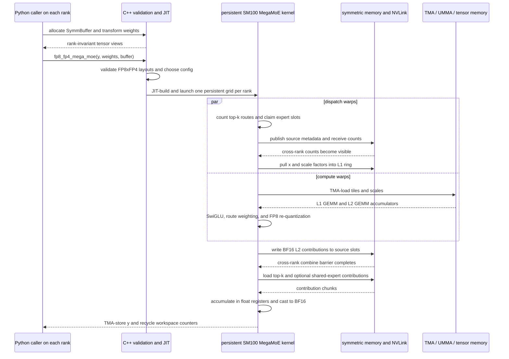

# DeepGEMM MegaMoE: Fused Communication and Expert Compute

**Repository:** [deepseek-ai/DeepGEMM](https://github.com/deepseek-ai/DeepGEMM) @ `559d79fb6994a58b8a15b4b93bf13ccc16edf247` (`main`, clean checkout, inspected 2026-08-26)

**Related pages:** [Mixture of Experts](../../terms/mixture-of-experts.md), [General Matrix Multiply (GEMM)](../../terms/gemm.md), [FP8](../../terms/fp8.md), [vLLM Kimi K3 Code Reading Map](../../frameworks/vllm/vllm-kimi-k3-code-reading.md), and [Kimi K3](../../training/kimi/kimi-k3/index.md).

> **Evidence:** This is a static reading of the pinned checkout. The source defines GPU tests and benchmarks, but this workspace did not have the NVIDIA GPU, CUDA build, or multi-process environment needed to execute them. Claims below about runtime behavior are code-derived; claims about measured performance are intentionally omitted.

## TL;DR

DeepGEMM's **MegaMoE** is a communication-compute co-designed [Mixture of Experts](../../terms/mixture-of-experts.md) kernel. It assumes that a router has already produced each token's top-k expert IDs and weights. The kernel then fuses the expensive movement and computation around the expert MLP:

1. Expert-parallel dispatch discovers where each top-k route belongs and pulls token data from remote ranks through symmetric memory.
2. Persistent CUDA warps stream those tokens through a bounded ring buffer instead of materializing an unbounded all-to-all tensor.
3. Tensor-core warps run linear 1, apply SwiGLU, and run linear 2. In the main path, activations are FP8, weights are FP4, and the final expert result is BF16.
4. Epilogue warps write each weighted expert result back to the originating rank; combine warps sum the top-k contributions into the output.

The key idea is simple:

> **MegaMoE is not a new routing algorithm. It is a persistent, shape-specialized execution schedule that overlaps expert-parallel communication with the two GEMMs and their epilogues.**

The public interface describes this fused boundary as EP dispatch, linear 1, SwiGLU, linear 2, and EP combine in one kernel. The code-level contract is visible in the repository's <a class="code-link" href="../../../external-repos/DeepGEMM/README.md#L114" data-code-repo="deepgemm-559d79fb6994" data-code-path="README.md" data-code-line="114"><code>Mega MoE interface</code></a>.

[Editable Mermaid sequence diagram](assets/mega-moe-flow.mmd)

## 1. First Remove the Word “Mega”

An ordinary sparse MoE layer has four conceptual pieces: a router chooses experts, dispatch moves token rows to the owning expert, each expert applies a two-layer feed-forward network, and combine restores token order. DeepGEMM does not own the router. Its inputs are already-routed token rows, top-k expert indices, top-k weights, and local expert weights.

The <a class="code-link" href="../../../external-repos/DeepGEMM/deep_gemm/mega/__init__.py#L18" data-code-repo="deepgemm-559d79fb6994" data-code-path="deep_gemm/mega/__init__.py" data-code-line="18"><code>MegaMoE Python wrapper</code></a> exposes two variants:

| Variant | Inputs | Expert compute | Output |
|---|---|---|---|
| <a class="code-link" href="../../../external-repos/DeepGEMM/deep_gemm/mega/__init__.py#L153" data-code-repo="deepgemm-559d79fb6994" data-code-path="deep_gemm/mega/__init__.py" data-code-line="153"><code>fp8_fp4_mega_moe</code></a> | FP8 activations plus FP4 weights and scale factors | Block-scaled SM100 matrix multiply, SwiGLU, then another block-scaled matrix multiply | BF16 per-token output |
| `bf16_mega_moe` | BF16 activations and BF16 weights | BF16 SM100 matrix multiply, SwiGLU, then BF16 matrix multiply | BF16 per-token output |

The second path is useful as a reference and fallback within this kernel family, but the rest of this page follows the FP8xFP4 path because that is the path highlighted by the repository's MegaMoE API and tests.

## 2. The Data Model: Four Identities for One Routed Token

The hardest part to learn is that a token has several simultaneous identities. Keeping them separate explains both the ring buffer and the final combine.

| Identity | Meaning | Why it exists |
|---|---|---|
| Source token | The original row `src_token_idx` on one rank | Needed to write the result back in the caller's token order. |
| Top-k slot | Which router choice selected this expert, `src_topk_idx` | Needed to preserve that route's weight and write into the correct combine slot. |
| Global expert | The router's expert ID | Determines the destination rank and local expert index. |
| Pool/ring token | The temporary position used by the local kernel | Lets dispatch, GEMM, epilogue, and combine use compact, reusable storage. |

The device code stores the first three fields together as `TokenSrcMetadata`: rank, token, and top-k slot. The corresponding <a class="code-link" href="../../../external-repos/DeepGEMM/deep_gemm/include/deep_gemm/layout/mega_moe.cuh#L178" data-code-repo="deepgemm-559d79fb6994" data-code-path="deep_gemm/include/deep_gemm/layout/mega_moe.cuh" data-code-line="178"><code>workspace metadata accessors</code></a> let the epilogue reverse the temporary pool position later.

The contiguous symmetric allocation is laid out as:

1. control counters and expert counts;
2. each rank's input tokens, input scale factors, top-k IDs, and top-k weights;
3. optional shared-expert activations;
4. routed-expert L1 ring activations and scales;
5. routed-expert L2 ring activations and scales;
6. BF16 combine slots, one slot per top-k choice plus one optional shared-expert slot.

The <a class="code-link" href="../../../external-repos/DeepGEMM/deep_gemm/include/deep_gemm/layout/mega_moe.cuh#L331" data-code-repo="deepgemm-559d79fb6994" data-code-path="deep_gemm/include/deep_gemm/layout/mega_moe.cuh" data-code-line="331"><code>MegaMoE buffer layout</code></a> makes this ordering explicit. It also aliases shared-expert L1 input to the original input buffer, because a shared expert is evaluated on every local token rather than on a routed subset.

## 3. What Happens Before the Kernel Runs

### 3.1 Allocate one rank-invariant symmetric workspace

The caller invokes `get_symm_buffer_for_mega_moe`. <a class="code-link" href="../../../external-repos/DeepGEMM/deep_gemm/mega/__init__.py#L18" data-code-repo="deepgemm-559d79fb6994" data-code-path="deep_gemm/mega/__init__.py" data-code-line="18"><code>SymmBuffer</code></a> asks the C++ layer for the required byte count, allocates a CUDA byte buffer, and uses PyTorch symmetric-memory rendezvous when the process group has more than one rank. It then zeros the buffer, synchronizes the group, and exposes tensor views for inputs and temporary stages.

The byte-count calculation is deliberately conservative. <a class="code-link" href="../../../external-repos/DeepGEMM/csrc/apis/mega.hpp#L37" data-code-repo="deepgemm-559d79fb6994" data-code-path="csrc/apis/mega.hpp" data-code-line="37"><code>get_symm_buffer_size_for_mega_moe</code></a> estimates the maximum live routed-token pool across every candidate `BLOCK_M` shape, aligns the result, and allocates scale-factor space separately for the FP8xFP4 path. This lets a later JIT specialization choose a different block size without changing the cross-rank allocation.

That is why the workspace is not sized only to the current number of tokens. It must be safe for the largest live ring frontier that any supported specialization may create.

### 3.2 Transform weights for the epilogue's access pattern

The <a class="code-link" href="../../../external-repos/DeepGEMM/deep_gemm/mega/__init__.py#L131" data-code-repo="deepgemm-559d79fb6994" data-code-path="deep_gemm/mega/__init__.py" data-code-line="131"><code>weight transformation</code></a> is an execution-layout transformation, not a model-parameter transformation:

- FP8/FP4 L1 weights interleave small groups of gate and up rows so that the epilogue can consume gate/up pairs efficiently for SwiGLU.
- FP8/FP4 scale factors are transposed into the layout expected by the tensor-core scale-transfer path.
- L2 FP8/FP4 weights keep their values but receive the corresponding scale-factor layout transformation.
- BF16 L1 weights are interleaved; BF16 L2 weights are unchanged.

The caller must perform this once before repeated launches. Input casting and copying into the symmetric buffer remain caller responsibilities.

### 3.3 Validate and JIT-specialize the launch

The <a class="code-link" href="../../../external-repos/DeepGEMM/csrc/apis/mega.hpp#L157" data-code-repo="deepgemm-559d79fb6994" data-code-path="csrc/apis/mega.hpp" data-code-line="157"><code>FP8xFP4 C++ entry point</code></a> checks the fixed recipe `(1, 1, 32)`, SwiGLU activation, expert-shape consistency, packed FP4 weights, contiguous storage, scale-factor layout, and buffer size. It then dispatches to the SM100 implementation. The same file exposes `bf16_mega_moe`, but both MegaMoE variants reject unsupported architectures in this revision.

The <a class="code-link" href="../../../external-repos/DeepGEMM/csrc/jit_kernels/heuristics/mega_moe.hpp#L76" data-code-repo="deepgemm-559d79fb6994" data-code-path="csrc/jit_kernels/heuristics/mega_moe.hpp" data-code-line="76"><code>shape heuristic</code></a> estimates tokens per expert:

$$
\text{expected tokens per expert}
= \frac{\text{local tokens} \times \text{number of ranks} \times \text{top-k}}{\text{number of global experts}}.
$$

Small expected expert loads select smaller `BLOCK_M` values and, for the smallest case, a larger `BLOCK_K` to reduce synchronization. Larger loads use bigger M tiles. A second <a class="code-link" href="../../../external-repos/DeepGEMM/csrc/jit_kernels/heuristics/mega_moe.hpp#L115" data-code-repo="deepgemm-559d79fb6994" data-code-path="csrc/jit_kernels/heuristics/mega_moe.hpp" data-code-line="115"><code>pipeline heuristic</code></a> subtracts fixed dispatch, epilogue, barrier, task, and tensor-memory storage from SM100 shared memory, then chooses the maximum number of staging steps that fit.

The <a class="code-link" href="../../../external-repos/DeepGEMM/csrc/jit_kernels/impls/sm100_fp8_fp4_mega_moe.hpp#L131" data-code-repo="deepgemm-559d79fb6994" data-code-path="csrc/jit_kernels/impls/sm100_fp8_fp4_mega_moe.hpp" data-code-line="131"><code>SM100 JIT launcher</code></a> converts those decisions into TMA descriptors for routed and optional shared-expert tensors, packs them into template arguments, builds the generated CUDA translation unit, and launches the persistent kernel. In other words, the runtime shape selects a new compiled kernel rather than making the inner loop fully dynamic.

## 4. Worked Trace: One Token Through FP8xFP4 MegaMoE

Assume one input token on rank 0 has top-k choices `(expert 17, expert 302, ...)`, and expert 17 is owned by rank 1. The token's route weight is `w`. The trace below follows the state changes; it does not claim that these operations happen serially—the point of the design is that different warps and blocks overlap them.

### 1. The caller publishes input state

The test's <a class="code-link" href="../../../external-repos/DeepGEMM/tests/test_mega_moe.py#L181" data-code-repo="deepgemm-559d79fb6994" data-code-path="tests/test_mega_moe.py" data-code-line="181"><code>fused-call setup</code></a> copies the activation, scale factors, top-k IDs, and top-k weights into the symmetric input views, then calls `fp8_fp4_mega_moe`. The kernel receives `y` as an output tensor and receives the rank-pointer list through the symmetric buffer handle.

### 2. Dispatch converts routing choices into remote work

The <a class="code-link" href="../../../external-repos/DeepGEMM/deep_gemm/include/deep_gemm/impls/sm100_fp8_fp4_mega_moe.cuh#L333" data-code-repo="deepgemm-559d79fb6994" data-code-path="deep_gemm/include/deep_gemm/impls/sm100_fp8_fp4_mega_moe.cuh" data-code-line="333"><code>dispatch warps</code></a> read each non-negative top-k expert ID, count how many tokens target every global expert, and reserve destination slots. They publish source token-top-k indices into the owning rank's workspace, then use a grid synchronization and an NVLink barrier so every rank can see the resulting receive counts.

This is where global expert ID becomes `(destination rank, local expert ID)`. The token is still represented by its source rank and top-k slot; it has not yet lost its original identity.

### 3. Dispatch pulls the token into a local ring slot

After counts become visible, the <a class="code-link" href="../../../external-repos/DeepGEMM/deep_gemm/include/deep_gemm/impls/sm100_fp8_fp4_mega_moe.cuh#L414" data-code-repo="deepgemm-559d79fb6994" data-code-path="deep_gemm/include/deep_gemm/impls/sm100_fp8_fp4_mega_moe.cuh" data-code-line="414"><code>remote-pull stage</code></a> chooses a source rank for the next token assigned to local expert 17. It uses TMA loads through the symmetric pointer map to pull the activation, transfers its scale factors into the local scale-factor ring, stores `w`, and records `(source rank, source token, source top-k slot)` metadata. The resulting row now sits in a local `pool_token_idx` / `ring_block_idx` that the GEMM stages understand.

The pull is chunked when the hidden dimension is larger than the configured pull size. The code can issue the next remote load while storing the previous chunk into the ring, which is the first communication/computation-friendly pipeline inside the kernel.

### 4. The scheduler turns counts into dependent tile tasks

The <a class="code-link" href="../../../external-repos/DeepGEMM/deep_gemm/include/deep_gemm/scheduler/mega_moe.cuh#L249" data-code-repo="deepgemm-559d79fb6994" data-code-path="deep_gemm/include/deep_gemm/scheduler/mega_moe.cuh" data-code-line="249"><code>receive-count cache</code></a> waits until all ranks have contributed their receive counts and caches the local expert token totals. The <a class="code-link" href="../../../external-repos/DeepGEMM/deep_gemm/include/deep_gemm/scheduler/mega_moe.cuh#L316" data-code-repo="deepgemm-559d79fb6994" data-code-path="deep_gemm/include/deep_gemm/scheduler/mega_moe.cuh" data-code-line="316"><code>routed task generator</code></a> then maps expert token counts into M blocks and N clusters.

Each `TaskInfo` carries the phase (`Linear1`, `Linear2`, or shared-expert phase), local expert, M block, N cluster, pool block, valid row count, and matrix shape. The <a class="code-link" href="../../../external-repos/DeepGEMM/deep_gemm/include/deep_gemm/scheduler/mega_moe.cuh#L383" data-code-repo="deepgemm-559d79fb6994" data-code-path="deep_gemm/include/deep_gemm/scheduler/mega_moe.cuh" data-code-line="383"><code>scheduler mainloop</code></a> publishes these tasks through a two-entry asynchronous task-information pipeline.

The schedule intentionally issues enough L1 work before allowing the first dependent L2 work. That warmup is a deadlock-avoidance rule: L2 must not consume an L1 ring block before all of the L1 N tiles that produce it have been issued.

### 5. L1 loads and tensor cores compute gate/up

The <a class="code-link" href="../../../external-repos/DeepGEMM/deep_gemm/include/deep_gemm/impls/sm100_fp8_fp4_mega_moe.cuh#L675" data-code-repo="deepgemm-559d79fb6994" data-code-path="deep_gemm/include/deep_gemm/impls/sm100_fp8_fp4_mega_moe.cuh" data-code-line="675"><code>tensor-core staging path</code></a> assigns separate warps to TMA-load activation tiles, TMA-load expert weight tiles, issue tensor-core instructions, and publish tasks. Full/empty barriers protect each shared-memory stage.

For FP8xFP4, the device implementation uses FP8 E4M3 activations, packed FP4 E2M1 weights, and UE8M0 scale factors. The SM100 MMA path transfers the scale tiles into tensor memory and issues block-scaled 2-CTA matrix-multiply instructions into a tensor-memory accumulator.

### 6. The L1 epilogue applies SwiGLU and route weighting

The <a class="code-link" href="../../../external-repos/DeepGEMM/deep_gemm/include/deep_gemm/impls/sm100_fp8_fp4_mega_moe.cuh#L962" data-code-repo="deepgemm-559d79fb6994" data-code-path="deep_gemm/include/deep_gemm/impls/sm100_fp8_fp4_mega_moe.cuh" data-code-line="962"><code>GEMM epilogue</code></a> reads the L1 accumulator, retrieves the route weight `w`, pairs the interleaved gate and up values, and computes:

$$
\text{L1 output} = w \times \operatorname{SiLU}(\text{gate}) \times \text{up}.
$$

For the FP8xFP4 path it reduces amax values across warp pairs, derives scale factors, casts the activation to FP8, and writes the result plus scales into the L2 ring buffer. For an optional shared expert, the same phase uses a separate task shape and a dedicated shared-expert input/output region.

### 7. L2 writes back to the source rank and combine reconstructs `y`

The <a class="code-link" href="../../../external-repos/DeepGEMM/deep_gemm/include/deep_gemm/impls/sm100_fp8_fp4_mega_moe.cuh#L1205" data-code-repo="deepgemm-559d79fb6994" data-code-path="deep_gemm/include/deep_gemm/impls/sm100_fp8_fp4_mega_moe.cuh" data-code-line="1205"><code>BF16 L2 epilogue</code></a> writes the expert's BF16 result into the source rank's combine slot. It uses the metadata recorded during dispatch, so a temporary pool row can return to the original token and top-k slot even when tokens arrived from different ranks.

After the <a class="code-link" href="../../../external-repos/DeepGEMM/deep_gemm/include/deep_gemm/impls/sm100_fp8_fp4_mega_moe.cuh#L1313" data-code-repo="deepgemm-559d79fb6994" data-code-path="deep_gemm/include/deep_gemm/impls/sm100_fp8_fp4_mega_moe.cuh" data-code-line="1313"><code>pre-combine NVLink barrier</code></a>, combine warps load the routed top-k slots, plus the optional shared-expert slot, through two alternating TMA load buffers. They accumulate the contributions in float registers, cast the sum to BF16, and TMA-store the final row into `y`.

The route weight is therefore applied before the cross-rank reduction, while the final top-k sum is performed after all ranks have written their contributions.

## 5. Why the Ring Buffer and Barriers Matter

### Bounded memory instead of full materialization

The workspace has reusable L1 and L2 ring buffers. A producer waits for an `empty` counter before reusing a physical ring block; a consumer increments the corresponding `empty` counter after it has finished reading. The <a class="code-link" href="../../../external-repos/DeepGEMM/deep_gemm/include/deep_gemm/layout/mega_moe.cuh#L46" data-code-repo="deepgemm-559d79fb6994" data-code-path="deep_gemm/include/deep_gemm/layout/mega_moe.cuh" data-code-line="46"><code>workspace layout</code></a> stores these counters beside expert counts, task counters, and source metadata.

The host-side <a class="code-link" href="../../../external-repos/DeepGEMM/deep_gemm/include/deep_gemm/scheduler/mega_moe.cuh#L47" data-code-repo="deepgemm-559d79fb6994" data-code-path="deep_gemm/include/deep_gemm/scheduler/mega_moe.cuh" data-code-line="47"><code>ring-capacity helper</code></a> computes a conservative live-pool bound from the number of SMs, expert shapes, and the possible L1/L2 tile frontier. This is a memory bound and a scheduling bound at the same time: too little ring space would make a producer overwrite data that a later GEMM still needs.

### Barriers are part of the algorithm

There are three different synchronization scopes:

- cluster barriers coordinate the two CTAs that share an SM100 tensor-core operation;
- grid counters make all SMs in one rank agree before cross-rank signaling;
- the <a class="code-link" href="../../../external-repos/DeepGEMM/deep_gemm/include/deep_gemm/comm/barrier.cuh#L40" data-code-repo="deepgemm-559d79fb6994" data-code-path="deep_gemm/include/deep_gemm/comm/barrier.cuh" data-code-line="40"><code>NVLink barrier</code></a> sends cross-rank signals through mapped symmetric-memory counters and then performs a second grid synchronization.

The device code uses these scopes around dispatch-count publication, combine visibility, and <a class="code-link" href="../../../external-repos/DeepGEMM/deep_gemm/include/deep_gemm/impls/sm100_fp8_fp4_mega_moe.cuh#L601" data-code-repo="deepgemm-559d79fb6994" data-code-path="deep_gemm/include/deep_gemm/impls/sm100_fp8_fp4_mega_moe.cuh" data-code-line="601"><code>workspace cleanup</code></a>. This is why the kernel can overlap work without treating the entire MoE layer as one blocking collective.

## 6. Optional Shared Experts

`num_shared_experts > 0` adds an always-local MLP contribution. It does not use routed expert IDs, but it shares the same persistent kernel and final output:

1. shared L1 tasks can begin without waiting for expert-parallel dispatch;
2. shared L2 tasks wait for shared L1 completion;
3. shared output is written to the extra combine slot `num_topk`;
4. the combine warp sums that slot with the routed top-k slots.

This is a useful design detail: shared experts are not bolted on as a separate kernel launch. They reuse the same task pipeline and combine protocol, while the layout gives them separate activation and weight descriptors.

## 7. Platform and Configuration Boundaries

The general library README advertises SM90 and SM100 support, but the MegaMoE implementation in this revision is specifically SM100. The host dispatcher selects `arch_major == 10`, and the device implementation has an unsupported-architecture assertion outside the SM100 guard. This distinction matters when reading DeepGEMM's other GEMM kernels: “DeepGEMM supports SM90” does not imply “this MegaMoE kernel runs on SM90.”

The important runtime constraints are:

- expert count must divide evenly across ranks;
- the FP8xFP4 path requires hidden and intermediate dimensions compatible with the 128-element scale-transfer alignment;
- the kernel supports SwiGLU and the `(1, 1, 32)` scale recipe in this snapshot;
- `top-k` plus one optional shared-expert slot must fit within one warp's combine mask;
- multi-rank execution requires symmetric memory and a coordinated multi-process launch;
- the selected shape must fit SM100 shared memory, tensor memory, registers, and the TMA alignment rules.

The <a class="code-link" href="../../../external-repos/DeepGEMM/deep_gemm/include/deep_gemm/impls/sm100_fp8_fp4_mega_moe.cuh#L55" data-code-repo="deepgemm-559d79fb6994" data-code-path="deep_gemm/include/deep_gemm/impls/sm100_fp8_fp4_mega_moe.cuh" data-code-line="55"><code>kernel entry template</code></a> makes many of these constraints compile-time parameters rather than runtime branches.

## 8. Verification, Performance, and Failure Surfaces

### What the repository test would verify

The <a class="code-link" href="../../../external-repos/DeepGEMM/tests/test_mega_moe.py#L75" data-code-repo="deepgemm-559d79fb6994" data-code-path="tests/test_mega_moe.py" data-code-line="75"><code>MegaMoE test</code></a> creates random BF16 inputs, random expert weights, top-k routing, optional masked routes, and optional shared experts. It casts the routed path to FP8/FP4 and transforms the weights before the fused call.

When optional legacy dependencies are available, the test builds a deliberately non-overlapped reference: EP dispatch, grouped L1 GEMM, SwiGLU, grouped L2 GEMM, and EP combine. The <a class="code-link" href="../../../external-repos/DeepGEMM/tests/test_mega_moe.py#L223" data-code-repo="deepgemm-559d79fb6994" data-code-path="tests/test_mega_moe.py" data-code-line="223"><code>reference and correctness block</code></a> compares expert receive statistics exactly and compares output values either exactly or with a small difference threshold when shared experts are present.

### What is measured, and what is not

The <a class="code-link" href="../../../external-repos/DeepGEMM/tests/test_mega_moe.py#L339" data-code-repo="deepgemm-559d79fb6994" data-code-path="tests/test_mega_moe.py" data-code-line="339"><code>benchmark path</code></a> times the fused call with `bench_kineto`, then computes accounting estimates for routed/shared FLOPs, HBM bytes, NVLink bytes, and serial combine-reduction time. Those formulas explain the performance vocabulary—TFLOPS, HBM GB/s, NVLink GB/s, overlap factor—but this ingest did not execute them. Treat README performance statements and the test's formulas as source claims, not as measurements reproduced here.

### Likely failure surfaces

- If ranks disagree about expert count, capacity, scale layout, or symmetric-buffer size, the host assertions fail or the distributed kernel can wait forever.
- If a ring `full`/`empty` counter is not advanced at the expected stage, a TMA producer or GEMM consumer spins on a stale counter.
- If a source metadata entry is wrong, the computation can be numerically correct for the temporary pool row but be written into the wrong token or top-k slot.
- If `DG_COMM_KERNEL_DEBUG=1` is enabled, the C++ wrapper zeros the symmetric buffer after each call; callers must recopy inputs before the next launch.
- Barrier helpers have timeout diagnostics for grid and NVLink waits, but those diagnostics are device-side safeguards, not a proof that every shape is deadlock-free.

## 9. Recommended Reading Path

Read the code in this order:

1. Start with the repository's <a class="code-link" href="../../../external-repos/DeepGEMM/README.md#L114" data-code-repo="deepgemm-559d79fb6994" data-code-path="README.md" data-code-line="114"><code>Mega MoE interface</code></a> to fix the vocabulary and input contract.
2. Read <a class="code-link" href="../../../external-repos/DeepGEMM/deep_gemm/mega/__init__.py#L18" data-code-repo="deepgemm-559d79fb6994" data-code-path="deep_gemm/mega/__init__.py" data-code-line="18"><code>SymmBuffer</code></a> and <a class="code-link" href="../../../external-repos/DeepGEMM/deep_gemm/mega/__init__.py#L131" data-code-repo="deepgemm-559d79fb6994" data-code-path="deep_gemm/mega/__init__.py" data-code-line="131"><code>transform_weights_for_mega_moe</code></a> to understand what the caller prepares.
3. Follow <a class="code-link" href="../../../external-repos/DeepGEMM/csrc/apis/mega.hpp#L37" data-code-repo="deepgemm-559d79fb6994" data-code-path="csrc/apis/mega.hpp" data-code-line="37"><code>get_symm_buffer_size_for_mega_moe</code></a> and the <a class="code-link" href="../../../external-repos/DeepGEMM/csrc/apis/mega.hpp#L157" data-code-repo="deepgemm-559d79fb6994" data-code-path="csrc/apis/mega.hpp" data-code-line="157"><code>C++ launch entry</code></a> for validation and architecture dispatch.
4. Study the <a class="code-link" href="../../../external-repos/DeepGEMM/csrc/jit_kernels/heuristics/mega_moe.hpp#L76" data-code-repo="deepgemm-559d79fb6994" data-code-path="csrc/jit_kernels/heuristics/mega_moe.hpp" data-code-line="76"><code>shape and pipeline heuristics</code></a> before reading device code; they explain why the kernel has so many template parameters.
5. Read <a class="code-link" href="../../../external-repos/DeepGEMM/deep_gemm/include/deep_gemm/layout/mega_moe.cuh#L331" data-code-repo="deepgemm-559d79fb6994" data-code-path="deep_gemm/include/deep_gemm/layout/mega_moe.cuh" data-code-line="331"><code>MegaMoEBuffer</code></a>, then <a class="code-link" href="../../../external-repos/DeepGEMM/deep_gemm/include/deep_gemm/scheduler/mega_moe.cuh#L316" data-code-repo="deepgemm-559d79fb6994" data-code-path="deep_gemm/include/deep_gemm/scheduler/mega_moe.cuh" data-code-line="316"><code>MegaMoEScheduler</code></a>.
6. Finally trace the device implementation from <a class="code-link" href="../../../external-repos/DeepGEMM/deep_gemm/include/deep_gemm/impls/sm100_fp8_fp4_mega_moe.cuh#L333" data-code-repo="deepgemm-559d79fb6994" data-code-path="deep_gemm/include/deep_gemm/impls/sm100_fp8_fp4_mega_moe.cuh" data-code-line="333"><code>dispatch</code></a> through <a class="code-link" href="../../../external-repos/DeepGEMM/deep_gemm/include/deep_gemm/impls/sm100_fp8_fp4_mega_moe.cuh#L675" data-code-repo="deepgemm-559d79fb6994" data-code-path="deep_gemm/include/deep_gemm/impls/sm100_fp8_fp4_mega_moe.cuh" data-code-line="675"><code>tensor-core staging</code></a>, <a class="code-link" href="../../../external-repos/DeepGEMM/deep_gemm/include/deep_gemm/impls/sm100_fp8_fp4_mega_moe.cuh#L962" data-code-repo="deepgemm-559d79fb6994" data-code-path="deep_gemm/include/deep_gemm/impls/sm100_fp8_fp4_mega_moe.cuh" data-code-line="962"><code>SwiGLU epilogue</code></a>, and <a class="code-link" href="../../../external-repos/DeepGEMM/deep_gemm/include/deep_gemm/impls/sm100_fp8_fp4_mega_moe.cuh#L1313" data-code-repo="deepgemm-559d79fb6994" data-code-path="deep_gemm/include/deep_gemm/impls/sm100_fp8_fp4_mega_moe.cuh" data-code-line="1313"><code>combine</code></a>.

The most productive next exercise is to draw one token's four identities—source token, top-k slot, global expert, and pool/ring token—on paper while reading the dispatch metadata writes and the L2 combine writes. Once that mapping is clear, the barriers and ring counters stop looking like unrelated CUDA machinery: they are the bookkeeping that makes one temporary row return to the right output row while other rows are still in flight.
