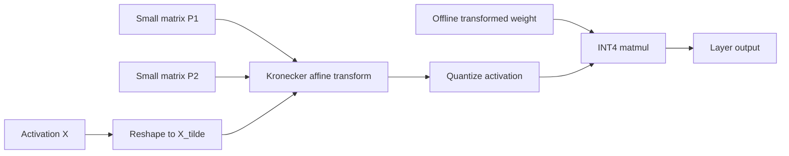

# FlatQuant: Fast Learnable Affine Quantization

**Paper:** FlatQuant: Flatness Matters for LLM Quantization
**Authors:** Yuxuan Sun, Ruikang Liu, Haoli Bai, Han Bao, Kang Zhao, Yuening Li, Jiaxin Hu, Xianzhi Yu, Lu Hou, Chun Yuan, Xin Jiang, Wulong Liu, Jun Yao
**arXiv:** 2410.09426v4 - 10 Aug 2025

**Related pages:** [NVFP4: Blackwell 4-Bit Floating Point](nvfp4.md), [vLLM: PagedAttention Serving Framework](../frameworks/vllm-framework.md)

## TL;DR

**What:** FlatQuant is a post-training quantization method that learns affine transformations to flatten weight and activation distributions before low-bit quantization.
**How:** It factorizes large affine matrices via Kronecker decomposition for efficiency, adds learnable clipping parameters, and provides fused CUDA kernels for low-bit inference.
**The number:** W4A4 quantization with less than 1% accuracy drop on LLaMA-3-70B, up to 2.3× prefill speedup and 1.7× decoding speedup versus FP16.

## The Core Idea

Standard quantization assumes weights and activations are naturally uniform — but in practice, outliers create uneven distributions that degrade low-bit accuracy. FlatQuant learns per-channel affine transformations that "flatten" these distributions before quantization, making 4-bit representations viable without retraining.

## Why This Exists

Uniform low-bit quantization uses equally spaced quantization points. If a tensor has sharp outliers, the scale must cover those outliers, wasting many quantization levels on rarely used ranges and increasing error for normal values.

The paper highlights two flatness targets:

- **Flat weights and activations:** channel magnitudes should be more uniform, with fewer extreme channels.
- **Flat quantization-error landscape:** quantization error should not spike at pivot tokens or accumulate strongly across layers.

Per-channel scaling can smooth activations but often makes weights steeper. Hadamard rotation redistributes outliers across channels, but uses a fixed transformation that does not adapt to each linear layer. FlatQuant tries to learn a layer-specific transform without paying the cost of a full dense matrix at runtime.

## Core Method

For a linear layer:

```text
Y = X W^T
```

FlatQuant searches for an invertible affine transformation `P` such that quantizing the transformed activation and transformed weight has low reconstruction error:

```text
Y ~= Q(X P) Q(P^-1 W^T)
```

The transformed weight term can be precomputed offline, while `X P` must run online during inference. A full `P` matrix would be too expensive, so FlatQuant factorizes it with a Kronecker product:

```text
P = P1 kron P2
```

If the hidden dimension is `n = n1 * n2`, the input can be reshaped and transformed with two small matrices instead of one full `n x n` matrix:

```text
X P  ->  P1^T x1 X_tilde x2 P2
```

The paper chooses `n1` and `n2` to minimize `n1 + n2` subject to `n1 * n2 = n`, preferring near-square factors when possible. For example, hidden size 8192 uses `(64, 128)`.



## Additional Learned Parameters

FlatQuant also learns:

| Component | Role |
|---|---|
| Learnable transformation `P` | Redistributes outliers and flattens weights/activations |
| Per-channel scaling `diag(c)` | Balances outliers between weights and activations |
| Learnable clipping thresholds | Clips residual outliers after transformation |

The training objective is block-wise post-training calibration. For each Transformer block, FlatQuant minimizes the mean squared error between the original block output and the quantized block output on a small calibration set.

Default calibration details from the paper:

- 128 WikiText-2 sentences;
- 2048 tokens per sample;
- 15 epochs;
- batch size 4;
- AdamW with cosine decay;
- about 0.9 hours and 26 GB GPU memory for LLaMA-3-8B on one GPU.

The paper uses SVD plus automatic mixed precision for stable and faster inversion of `P`.

## Transformer Integration

FlatQuant keeps LayerNorm, RoPE, attention scores, and pre-quantization transformations in FP16. Low-bit matrix multiplication is applied to linear layers.

For an LLaMA-like block, FlatQuant uses five online transformations:

| Transformation | Location |
|---|---|
| `Pa` | Input to query/key/value projections |
| `Po` | Input to output projection |
| `Ph` | Key cache, head by head |
| `Pv` | Value cache, head by head |
| `Pug` | Feed-forward up/gate input |
| `Pd` | Feed-forward down projection input |

The paper decomposes the large hidden-size transformations such as `Pa`, `Po`, `Pug`, and `Pd`. It leaves per-head KV-cache transforms in their original shape because head dimensions are much smaller.

The paper also notes that `Po` and `Pv` can be fused, and that the per-channel scaling for `Pd` can be merged into the up-projection weights, reducing runtime overhead.

## Kernel Design

The online affine transformation and quantization are memory-bound. FlatQuant fuses them into a single Triton kernel:

1. Load `P1`, `P2`, and an activation tile into SRAM.
2. Compute the Kronecker-factorized affine transformation inside the kernel.
3. Quantize the transformed activation on the fly.
4. Write only the quantized result to global memory.
5. Use a CUTLASS INT4 matmul kernel for the quantized activation and weight.

This avoids writing intermediate transformed activations to HBM and reduces kernel launch overhead. For KV-cache quantization, the paper uses FlashInfer.

The appendix reports that the online transformations account for about 2.61% of FP16 model FLOPs for LLaMA-2-7B at sequence length 2048, and add about 3.41 MB of inference parameters for LLaMA-2-7B.

## Results

### Language Modeling

For W4A4 quantization on LLaMA models, FlatQuant improves perplexity versus SmoothQuant, OmniQuant, AffineQuant, QuaRot, and SpinQuant.

Selected WikiText-2 perplexity results with RTN weight quantization:

| Model | FP16 | SpinQuant | FlatQuant |
|---|---:|---:|---:|
| LLaMA-2-7B | 5.47 | 6.14 | 5.79 |
| LLaMA-2-70B | 3.32 | 3.82 | 3.55 |
| LLaMA-3-8B | 6.14 | 7.96 | 6.98 |
| LLaMA-3-70B | 2.86 | 7.58 | 3.78 |

The paper emphasizes that FlatQuant with simple round-to-nearest is often close to FlatQuant with GPTQ, reducing deployment calibration cost.

### Zero-Shot QA

On six zero-shot QA tasks, FlatQuant narrows the gap to FP16. Selected average scores:

| Model | FP16 | SpinQuant RTN | FlatQuant RTN |
|---|---:|---:|---:|
| LLaMA-2-7B | 69.79 | 63.52 | 67.96 |
| LLaMA-2-70B | 77.05 | 75.09 | 76.62 |
| LLaMA-3-8B | 73.23 | 66.98 | 71.23 |
| LLaMA-3-70B | 79.95 | 65.66 | 79.01 |

The LLaMA-3-70B result is the source of the paper's less-than-1% accuracy-drop claim for W4A4.

### Latency

Latency experiments are reported on RTX 3090, comparing against FP16 and QuaRot-style INT4 inference.

For LLaMA-2-7B with sequence length 2048:

| Stage | FlatQuant result |
|---|---:|
| Prefill, batch size 64 | Up to 2.30x faster than FP16 |
| Decoding, batch size 64 | Up to 1.76x faster than FP16 |
| Online transformation overhead | About 0.07x speedup loss versus vanilla INT4 |

For LLaMA-3-8B, the appendix reports FlatQuant prefill speedups from 2.12x at length 2048 to 1.80x at length 16384, and decoding speedups from 1.24x to 1.76x as KV-cache length increases from 256 to 2048 at batch size 64.

### Other Model Families and Settings

The appendix extends FlatQuant beyond dense LLaMA pretraining checkpoints:

- LLaMA-3.1-8B-Instruct: FlatQuant outperforms QuaRot in perplexity and QA averages.
- Qwen-2.5-Instruct 7B/32B: FlatQuant remains close to FP16 and ahead of QuaRot on the 32B model.
- DeepSeek-V3-Base and DeepSeek-R1: FlatQuant W4A4 is evaluated on 671B-parameter MoE models.
- Weight-only quantization: FlatQuant is competitive with or better than RTN, GPTQ, AWQ, and QuIP in tested settings.
- KV-cache-only quantization: FlatQuant improves low-bit KV results, especially at 2-3 bits.

## Ablations

The main ablation on LLaMA-3-8B shows the learnable transformation is the dominant component:

| Setting | WikiText-2 PPL | C4 PPL | QA average |
|---|---:|---:|---:|
| RTN baseline | 1266.60 | 936.41 | 30.99 |
| Learnable transformation | 8.50 | 13.51 | 66.82 |
| Learnable transformation + per-channel scaling | 7.95 | 12.74 | 67.08 |
| Learnable transformation + learnable clipping | 7.11 | 11.47 | 70.72 |
| Full FlatQuant | 6.98 | 11.13 | 71.23 |

The paper also shows calibration is stable across WikiText-2, C4, and Pile calibration samples, with similar perplexity and QA results.

## Practical Takeaways

- Flatness is the central design target: flatter transformed weights and activations reduce quantization error.
- The Kronecker factorization is the key systems trick that makes learned affine transforms practical at inference time.
- The fused kernel matters because both transformation and quantization are memory-bound.
- FlatQuant's RTN results are strong enough that GPTQ is not always necessary.
- The method is useful across W4A4, weight-only, KV-cache, and mixed-precision settings.
- Batch size matters for latency: decoding speedups are weak at very small batch sizes because quantization overhead can dominate.

## Where It Breaks

| Failure mode | When it happens | Impact |
|---|---|---|
| Calibration set sensitivity | Distribution mismatch between calibration and deployment data | Learned transforms may not generalize; paper finds standard datasets stable but exploration is limited |
| INT4 focus | FP4-style formats (MXFP4, NVFP4) not evaluated | Results don't directly transfer to emerging hardware-native FP4 formats |
| Extreme low-bit degradation | W3A3KV3 settings | Quality drops substantially versus W4A4 |
| Kernel dependency | Without fused INT4 matmul kernels | Deployment value unrealized; latency benefits require custom kernel support |
| Small batch decoding | Batch size = 1 inference | Quantization overhead can dominate; speedups only at larger batches |

## One Thing to Remember

FlatQuant's key insight is that **learnable affine transformations can "flatten" outlier-heavy distributions before quantization** — Kronecker factorization makes this practical by reducing the transformation's parameter count from $O(d^2)$ to $O(d)$.

## Go Deeper

- **Read:** [FlatQuant paper (arXiv:2410.09426)](https://arxiv.org/abs/2410.09426)
- **Build on:** [NVFP4: Blackwell 4-Bit Floating Point](nvfp4.md)
- **Understand the context:** [FlashAttention](../algorithms/flashattention.md)
- **Reproduce:** Check paper for code repository
