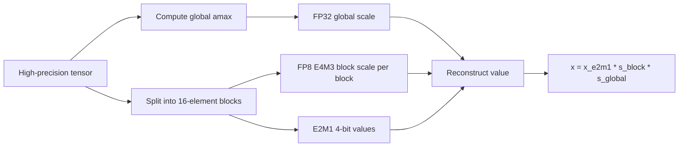

# NVFP4: Blackwell 4-Bit Floating Point

NVFP4 is NVIDIA's Blackwell-generation 4-bit floating-point format for low-precision inference and training workflows. It keeps the compact E2M1 FP4 value format but improves accuracy through finer and higher-precision scaling: every local block gets an FP8 E4M3 scale, and the full tensor gets a second FP32 scale.

The important distinction is that NVFP4 is not just "FP4 values." It is FP4 plus a hierarchical scaling scheme designed to reduce quantization error while keeping memory and bandwidth close to 4-bit operation.

## Format

| Component | NVFP4 detail |
|---|---|
| Element encoding | E2M1: 1 sign bit, 2 exponent bits, 1 mantissa bit |
| Raw value range | Approximately -6 to +6 |
| Local scale | FP8 E4M3 scale shared by a 16-element block |
| Global scale | FP32 scale applied once per tensor |
| Transformer Engine reconstruction | `x = x_e2m1 * s_block * s_global` |

Transformer Engine computes the global scale from the tensor maximum absolute value:

```text
s_global = global_amax / (fp8_max * fp4_max)
```

where `fp8_max = 448.0` for FP8 E4M3 and `fp4_max = 6.0` for NVFP4 E2M1.

The local block scale is then:

```text
s_block = (block_amax / fp4_max) / s_global
```

`s_block` is stored in FP8 E4M3. This gives NVFP4 fractional local scaling rather than only power-of-two scaling.



## Why It Improves on MXFP4

MXFP4 and NVFP4 both use grouped FP4 values with shared scales, but the scale structure is different.

| Format | Block scale | Block size | Accuracy implication |
|---|---|---:|---|
| FP4 E2M1 with software scale | Software-managed scale | Varies | Simple, but not hardware-scaled in the same way |
| MXFP4 | Power-of-two E8M0 scale | 32 values | Lower overhead, but coarser scale choices |
| NVFP4 | Fractional FP8 E4M3 scale plus FP32 tensor scale | 16 values | Finer local dynamic-range matching |

NVFP4 reduces two sources of error:

- It cuts the local block from 32 values to 16 values, so each scale covers a narrower data distribution.
- It stores the block scale in FP8 E4M3, so the scale can be fractional instead of snapping to powers of two.

## Memory and Inference Positioning

NVIDIA describes NVFP4 storage as one 4-bit value plus one FP8 scale per 16 values, which is about 4.5 bits per value, plus one FP32 scale per tensor. NVIDIA reports approximate model-memory reductions of:

| Baseline | Reported model memory reduction |
|---|---:|
| FP16 | About 3.5x smaller |
| FP8 | About 1.8x smaller |

The public NVIDIA inference blog positions NVFP4 as a way to reduce model memory and bandwidth while preserving model quality. In its DeepSeek-R1-0528 example, NVIDIA reports 1 percentage point or less degradation versus FP8 on several cited evaluations after post-training quantization, with AIME 2024 improving by 2 percentage points.

## Transformer Engine Training Recipe

Transformer Engine treats NVFP4 as a full recipe rather than just a data type. The recipe adds training-stability mechanisms for quantization:

| Feature | Transformer Engine behavior |
|---|---|
| 1D scaling | Each 16 consecutive elements share a scale |
| 2D weight scaling | Enabled for weights by default; each 16x16 weight block shares a scale |
| Activations and gradients | Always use 1D scaling |
| Stochastic rounding | Applied when casting scaled values to NVFP4; enabled only for gradients |
| Random Hadamard Transform | Enabled by default to smooth outliers for selected wgrad operands |
| PyTorch/JAX recipe | `NVFP4BlockScaling` |

The default recipe enables 2D weight quantization and Random Hadamard Transform (RHT). 2D weight quantization can be disabled with `disable_2d_quantization=True`, and RHT can be disabled with `disable_rht=True`.

Stochastic rounding can be disabled with `disable_stochastic_rounding=True`. In JAX, Transformer Engine examples also require an `sr_rng` random key for stochastic rounding.

## Random Hadamard Transform

RHT applies an orthogonal rotation before quantization. Its purpose is to smooth outliers so tensors are easier to represent in NVFP4. Transformer Engine applies RHT to columnwise quantization of inputs and gradients that feed the weight-gradient GEMM, which is sensitive to quantization error.

Important constraints:

- RHT supports BF16 inputs and gradients only.
- Transformer Engine uses a tiled implementation with tile size `d = 16`.
- The RHT matrix is computed once at initialization and cached.

## GEMM Layout and Distributed Training

Transformer Engine requires both rowwise and columnwise quantized tensors for different GEMM operands. NVFP4 GEMM supports the TN layout only. Columnwise data and scaling factors are stored in transposed layout.

For distributed training:

- Block scales are local to their 16-element blocks and do not need synchronization across nodes.
- The global tensor scale requires synchronized global amax for gathered tensors.
- NVFP4 all-gather is supported.

## Supported Hardware

Transformer Engine lists support as:

| Use | Supported devices |
|---|---|
| Training | SM 10.0 and SM 10.3 |
| Inference | SM 10.0+ |

The NVIDIA blog frames NVFP4 as part of Blackwell Tensor Core support for ultra-low precision inference. In practice, assume Blackwell-class hardware is required unless a specific framework or deployment stack documents broader support.

## Practical Takeaways

- Use NVFP4 when Blackwell hardware is available and memory bandwidth or model footprint is a bottleneck.
- Prefer NVFP4 over MXFP4 when accuracy sensitivity makes fractional scaling and smaller blocks worth the added scale structure.
- Treat Transformer Engine NVFP4 as a recipe with scaling, stochastic rounding, RHT, layout, and distributed-training behavior, not merely an E2M1 storage type.
- For inference deployment, NVIDIA points to TensorRT Model Optimizer, LLM Compressor, TensorRT-LLM, vLLM early support, and prequantized Hugging Face checkpoints as the surrounding ecosystem.
