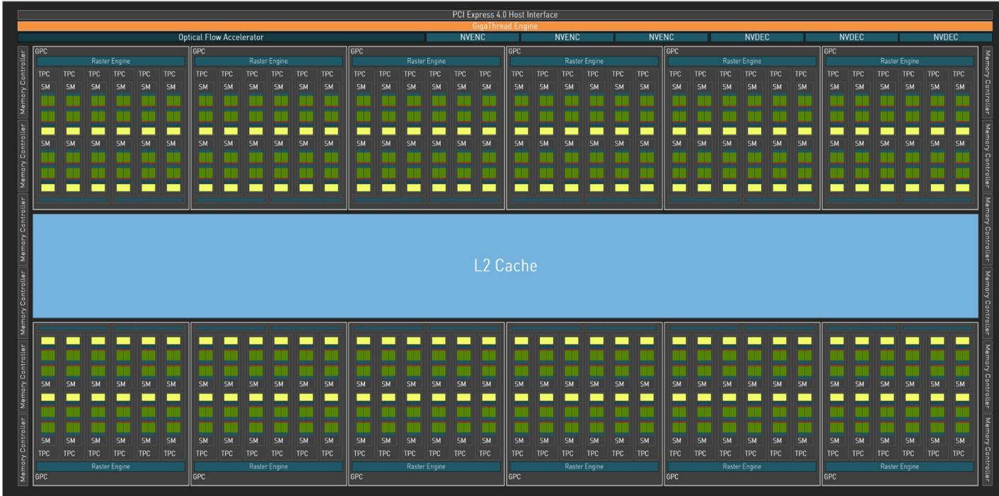
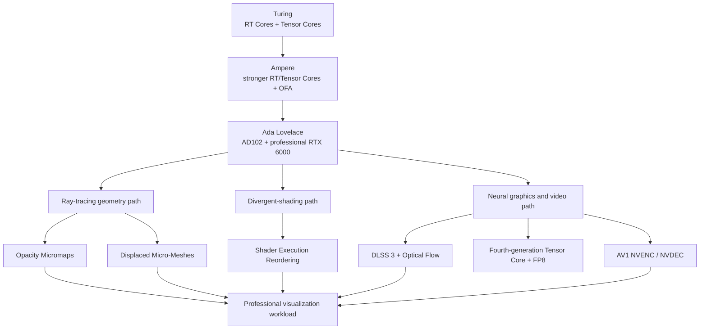
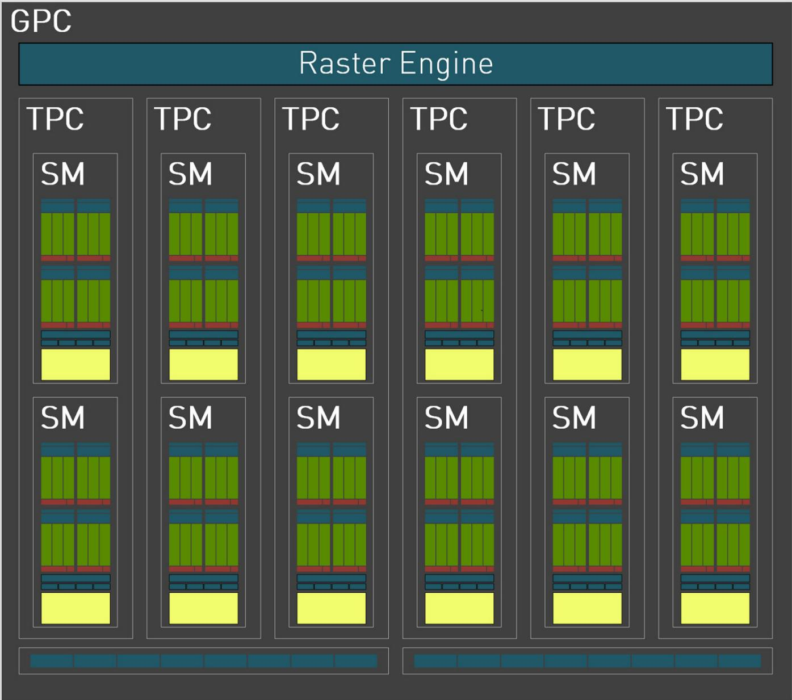
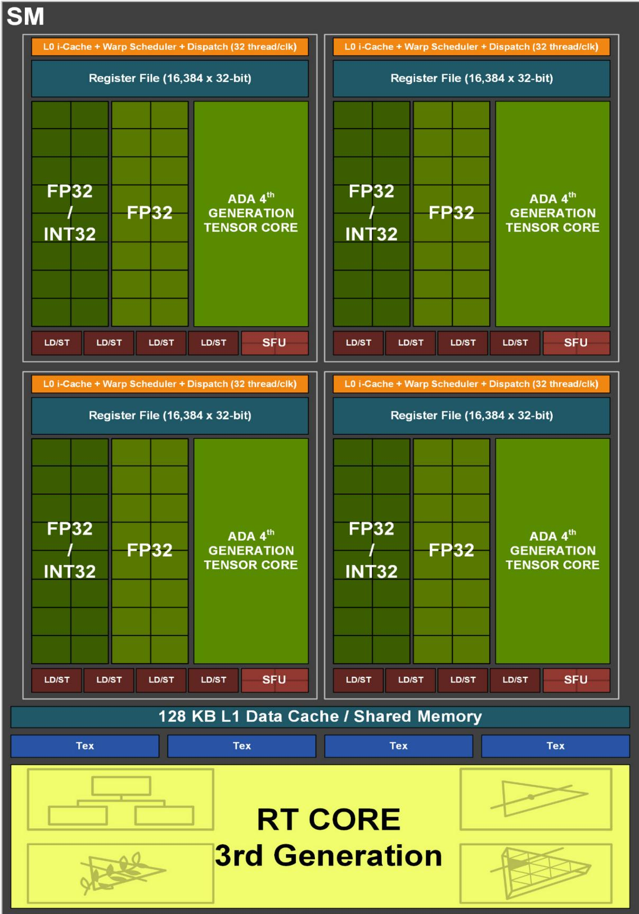
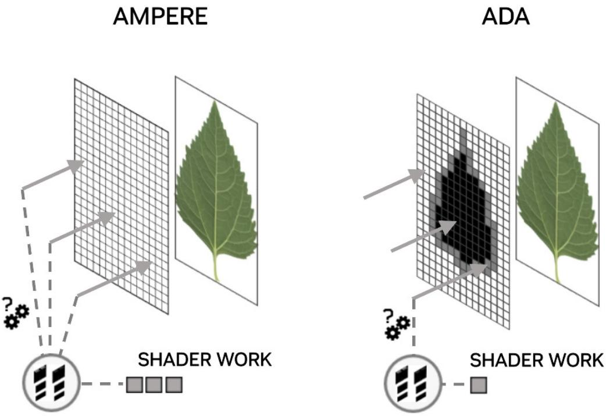
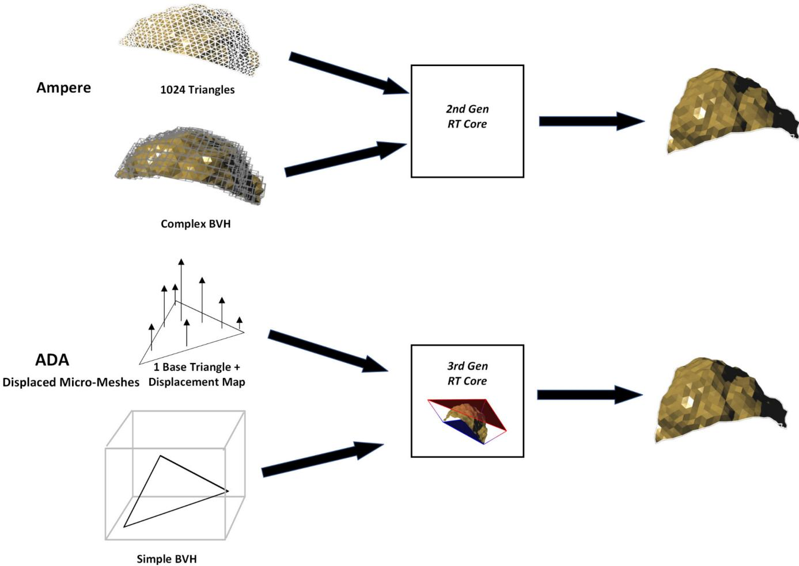
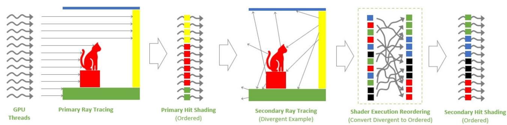
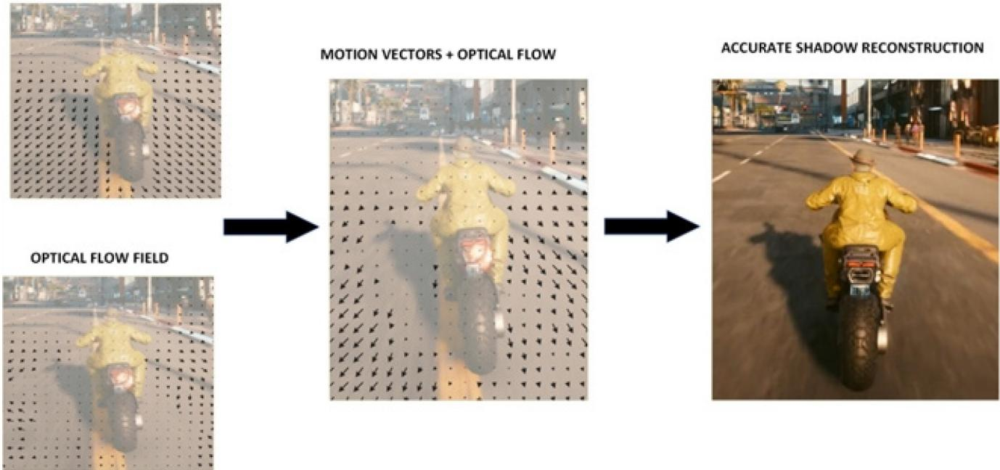
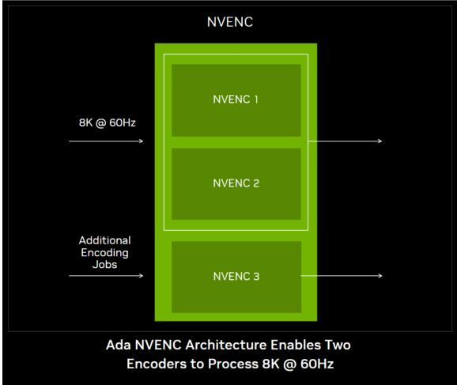

# NVIDIA Ada Lovelace Professional GPU Architecture

**Paper:** NVIDIA Ada Lovelace Professional GPU Architecture
**Authors:** NVIDIA
**arXiv:** Not applicable; NVIDIA whitepaper, version 1.1 (copyright 2023)

**Related pages:** [NVIDIA GPU Evolution](../index.md) · [NVIDIA GPU Evolution: From Graphics to Accelerated Computing](../gpu-evolution-path.md) · [Hardware and Numerics](../../index.md) · [CUDA Programming Model](../../../frameworks/cuda/index.md) · [FP8](../../../terms/fp8.md)

## TL;DR

**What:** Ada Lovelace is a professional graphics architecture that combines a larger AD102 compute hierarchy with specialized hardware for ray tracing, neural graphics, AI inference, and video.
**How:** It increases on-chip capacity and clock headroom, then moves expensive work into a third-generation RT Core, Shader Execution Reordering, an Optical Flow Accelerator, fourth-generation Tensor Cores, and dedicated AV1 video engines.
**The number:** The full AD102 design is reported as 18,432 CUDA cores, 144 SMs, 76.3 billion transistors, 98,304 KB of L2 cache, and a 2.52 GHz boost clock; the RTX 6000 Ada product table reports 18,176 CUDA cores, 142 SMs, 48 GB GDDR6, 960 GB/s bandwidth, and a 300 W TGP.

## The Big Picture

*Source: [NVIDIA whitepaper, Figure 1](../../../../raw/hardware/nvidia-ada-lovelace-professional-gpu-architecture--nvidia.pdf). 1. Twelve GPCs contain the parallel graphics and compute hierarchy. 2. The large shared L2 cache sits between the GPCs and memory controllers. 3. RT, Tensor, optical-flow, encode, and decode engines surround the CUDA execution path so a professional frame can mix specialized work.*

## Why This Exists

Consider a professional renderer showing a photogrammetry scene: the environment contains millions or billions of triangles, foliage is represented by alpha-tested textures, secondary rays bounce through different materials, and the final image is streamed to a workstation or video pipeline. Without Ada's additions, the renderer pays in several different places at once: explicit geometry makes the BVH expensive to build and store, alpha tests return more work to shaders, secondary rays make warps diverge, and a higher frame rate requires rendering every output frame.

Ada attacks those costs at their owning boundaries. The RT Core can resolve many opacity states without invoking a shader and can reconstruct displaced micro-triangles from a compact representation. SER regroups divergent secondary shading. The Optical Flow Accelerator and Tensor Cores can construct intermediate frames, while NVENC can encode several high-resolution streams. The result is not just a faster general-purpose core; it is a pipeline in which representation, scheduling, inference, and I/O are all hardware-aware.

## The Landscape

Ada inherits the RT and Tensor Core direction established by Turing and expanded by Ampere, then branches into three related paths: richer ray-traced geometry, better scheduling for divergent shading, and a full-stack neural/video path. The source's own comparison is generation-to-generation; the tree below is a knowledge-base synthesis that makes those parent-child relationships explicit.

*Synthesized landscape from the Turing, Ampere, and Ada progression described by the paper and the related [NVIDIA GPU evolution page](../gpu-evolution-path.md). The arrows express architectural lineage and workload branches, not a claim that every feature was introduced only in the generation where it appears.*

The editable source is [ada-lovelace-landscape.mmd](./assets/ada-lovelace-landscape.mmd).

## The Core Idea

Ada's central idea is **specialize the whole graphics pipeline, not only the arithmetic core**. More CUDA cores and higher clocks raise the baseline, but the large gains come when geometry is stored in a form the RT Core understands, divergent shading is regrouped before it wastes execution slots, motion is estimated by a dedicated engine, and Tensor or video units produce the next stage. Ada therefore co-designs representation, execution, reconstruction, and output around the professional frame.

## Symbol Map

The paper uses a hardware hierarchy and several short names. `AD102` is the full-chip codename; `GPC`, `TPC`, and `SM` name nested execution blocks. `RT`, `OFA`, `DMM`, `OMM`, and `SER` identify specialized ray-tracing or scheduling features. `L1` and `L2` are cache levels, while `TGP` is the board power target. The first meaningful [FP8](../../../terms/fp8.md) occurrence is linked because it is both a numeric format and a hardware capability in Ada.

| Symbol | Human name | Shape / scope | Plain meaning |
|---|---|---|---|
| `AD102` | Ada flagship GPU | Full chip | The die used as the paper's architectural case study. |
| `GPC` | Graphics Processing Cluster | 12 on full AD102 | High-level block containing raster, texture, and SM resources. |
| `TPC` | Texture Processing Cluster | 72 on full AD102 | Block containing two SMs and one PolyMorph Engine. |
| `SM` | Streaming Multiprocessor | 144 on full AD102; 142 in the RTX 6000 table | CUDA execution block with registers, schedulers, CUDA cores, Tensor Cores, and load/store units. |
| `RT Core` | Ray-tracing accelerator | One per SM in the full-chip description | Traverses BVHs and accelerates ray-box and ray-triangle intersection work. |
| `OMM` | Opacity Micromap | Per alpha-tested triangle | A compact micro-triangle opacity state used to resolve opaque, transparent, or unknown intersections. |
| `DMM` | Displaced Micro-Mesh | Per base triangle plus displacement map | A structured geometry representation from which the RT Core generates detail on demand. |
| `SER` | Shader Execution Reordering | Ray-tracing scheduling stage | Regroups shading work to improve execution and data locality when secondary rays diverge. |
| `OFA` | Optical Flow Accelerator | GPU engine | Estimates pixel motion for DLSS 3 frame generation and other vision/video workloads. |
| `L1` / `L2` | Level-one / level-two cache | Per SM / shared GPU | Fast storage that reduces repeated trips to device memory; Ada enlarges L2 substantially. |
| `TGP` | Total Graphics Power | Board-level target | The product power envelope used in the RTX 6000 comparison. |
| `FP8` | Eight-bit floating point | Tensor computation | Lower-width numeric input that reduces storage and can raise Tensor Core throughput when the software and workload support it. |
| `NVENC` / `NVDEC` | Video encoder / decoder | Dedicated media engines | Hardware paths for AV1 and other video codecs rather than general CUDA kernels. |

### Full chip versus shipping product

The paper alternates between the full AD102 design and the RTX 6000 Ada Generation product. The product disables a small number of blocks, so its table must not be read as a contradiction of the full-chip block diagram.

| Scope | GPCs | TPCs | SMs | CUDA cores | RT Cores | Tensor Cores | Memory / power |
|---|---:|---:|---:|---:|---:|---:|---|
| Full AD102 design | 12 | 72 | 144 | 18,432 | 144 | 576 | 384-bit interface; 12 x 32-bit controllers |
| RTX 6000 Ada Generation table | 12 | 71 | 142 | 18,176 | 142 | 568 | 48 GB GDDR6; 300 W TGP |

## Deep Dive

### 1. AD102 scales a specialized hierarchy

**What it does:** Places graphics, CUDA, ray tracing, Tensor, texture, cache, and memory resources into a hierarchy that can feed different parts of a professional workload.

**Why it matters:** A detailed frame is not one homogeneous kernel. Rasterization, BVH traversal, matrix inference, texture access, and memory traffic compete for different resources, so the hierarchy determines whether the specialized units stay fed.

**How it works:**

1. The full AD102 contains 12 GPCs, 72 TPCs, 144 SMs, a 384-bit memory interface, and 12 memory controllers.
2. Each GPC contains a raster engine, six TPCs, and two ROP partitions with eight ROP units per partition.
3. Each TPC contains a PolyMorph Engine and two SMs. Each SM has 128 CUDA cores, one third-generation RT Core, four fourth-generation Tensor Cores, four texture units, a 256 KB register file, and 128 KB of configurable L1/shared memory.
4. The full chip's L2 cache is reported as 98,304 KB, compared with 6,144 KB in GA102. The paper highlights this larger shared locality pool for complex ray tracing.

*Source: [NVIDIA whitepaper, Figure 2](../../../../raw/hardware/nvidia-ada-lovelace-professional-gpu-architecture--nvidia.pdf). The GPC is the repeated high-level unit that contains raster and SM-facing work.*

*Source: [NVIDIA whitepaper, Figure 5](../../../../raw/hardware/nvidia-ada-lovelace-professional-gpu-architecture--nvidia.pdf). Four processing partitions share the SM's register file, L1/shared memory, and texture units while exposing separate FP32/INT32 and Tensor paths.*

**The intuition:** Ada is a stack of increasingly local work queues: GPU-wide cache and memory feed GPCs, GPCs feed TPCs and SMs, and each SM delegates the right operation to the right unit.

**A concrete example:** In the photogrammetry scene, the raster engine handles conventional visibility, the RT Core handles intersections, the Tensor Cores handle neural reconstruction, and the enlarged L2 can retain shared data that would otherwise be fetched repeatedly from GDDR6.

**Remember:** Count the hierarchy before interpreting a peak number; full AD102 resources and RTX 6000 shipping resources are different scopes.

### 2. Opacity Micromaps move alpha decisions into the RT Core

**What it does:** Resolves many alpha-tested intersections as opaque or transparent micro-triangles without sending every decision back to an any-hit shader.

**Why it matters:** Leaves, fences, flames, and smoke can be represented by a few triangles plus an alpha texture, but rays hitting them do not all take the same path. Shader callbacks leave some threads active while others finish, creating warp inefficiency.

**How it works:**

1. The developer builds an opacity mask as a virtual triangular mesh in the barycentric coordinate system used for ray-triangle intersections.
2. Each micro-triangle records an opaque, transparent, or unknown state using one or two bits.
3. The Opacity Micromap Engine uses the intersection's barycentric coordinates to address that state. Opaque records return a hit, transparent records continue traversal, and unknown records return to the SM for shader resolution.
4. In the paper's maple-leaf example, 30 micro-triangles are transparent, 41 are opaque, and 57 are unknown. More than half of the example is therefore resolved without shader code.

*Source: [NVIDIA whitepaper, Figure 4](../../../../raw/hardware/nvidia-ada-lovelace-professional-gpu-architecture--nvidia.pdf). The Ada RT Core keeps the existing box and triangle intersection path and adds dedicated units for opacity and displaced geometry.*

*Source: [NVIDIA whitepaper, Figure 8](../../../../raw/hardware/nvidia-ada-lovelace-professional-gpu-architecture--nvidia.pdf). Ampere returns alpha-test decisions to shader work; Ada directly resolves the known part of the opacity mask in the RT Core.*

**The intuition:** Replace repeated shader questions such as "did this ray hit the leaf?" with a tiny lookup table attached to the triangle.

**A concrete example:** Revisit the leaf in the scene. A ray through empty space is rejected as transparent, a ray through the leaf interior is accepted as opaque, and only a boundary or mixed-opacity micro-triangle invokes the shader.

**Remember:** OMM accelerates traversal for known opacity states; it does not eliminate shader work for every unknown or material-dependent case.

### 3. Displaced Micro-Meshes compress geometric detail

**What it does:** Represents detailed geometry as a base triangle plus a displacement map, then generates micro-triangles on demand inside the RT Core.

**Why it matters:** A hundredfold increase in source geometry can make BVH construction take roughly a hundredfold more time and memory even when traversal time grows much more slowly. Storing every detail as ordinary triangles makes asset storage, transmission, and build time expensive.

**How it works:**

1. A watertight base mesh supplies the coarse triangle layout.
2. Each base triangle carries a displacement map whose samples lie on a power-of-two barycentric grid.
3. The Displaced Micro-Mesh Engine reconstructs the required micro-triangles when a ray reaches the primitive, while the BVH tracks the simpler base representation.
4. The same structured representation exposes intrinsic level of detail for rasterization through mesh or compute shaders and supports lightweight deformation.

*Source: [NVIDIA whitepaper, Figure 10](../../../../raw/hardware/nvidia-ada-lovelace-professional-gpu-architecture--nvidia.pdf). Ada stores a base triangle and displacement map in a simpler BVH, then reconstructs the detailed surface when needed.*

| Asset in the paper | Micro-mesh ratio | Micro-triangles | Reported BVH build result | Reported BVH storage result |
|---|---:|---:|---:|---:|
| Jewel Box | 11:1 | 11 million | 8.5x faster | 6.5x smaller |
| Ewer | 28:1 | 57 million | More than 15x faster | 20x smaller |
| Reef Crab | 14:1 | 1.6 million | 7.6x faster | 8.1x smaller |

**The intuition:** Keep the coarse address structure and store fine shape as a compact recipe instead of expanding every detail into the BVH.

**A concrete example:** The reef crab can preserve a high-detail shell for a close camera view while the BVH remains closer to the base-triangle representation. The RT Core materializes detail at the point where a ray needs it.

**Remember:** DMM reduces representation and BVH construction cost; it does not make the detailed intersection arithmetic free.

### 4. Shader Execution Reordering repairs secondary-ray divergence

**What it does:** Reorders ray-tracing shader work on the fly so threads with similar shaders and memory behavior execute together.

**Why it matters:** Primary rays are often ordered because neighboring pixels hit similar surfaces. Secondary rays for reflections, indirect lighting, translucency, and path tracing spread across different objects and materials, producing both control-flow and data divergence.

**How it works:**

1. Primary rays traverse the scene and produce ordered primary-hit shading.
2. Each hit launches secondary rays in different directions, leaving a mixed set of shader programs and memory accesses.
3. SER inserts a scheduling stage that groups the secondary-hit work into a more coherent order before the SM executes it.
4. The application controls where to invoke SER through a small API; the paper describes NVIDIA-specific NVAPI extensions and profiling support.

*Source: [NVIDIA whitepaper, Figure 12](../../../../raw/hardware/nvidia-ada-lovelace-professional-gpu-architecture--nvidia.pdf). The pipeline shows ordered primary hits, divergent secondary rays, reordering, and more ordered secondary-hit shading.*

**The intuition:** SER is a queue for rays that have already discovered which shader and data they need.

**A concrete example:** The scene's glossy floor sends secondary rays toward walls, foliage, and metal. Instead of forcing one warp to alternate among all those material programs, SER groups the compatible hits so the same SM cycles do more useful work.

**Remember:** SER targets divergence; if rays are already coherent or the reordering overhead dominates, the scheduling stage has little to buy.

### 5. DLSS 3 combines motion evidence with neural frame generation

**What it does:** Uses traditional 3D motion vectors, Ada's Optical Flow Accelerator, and a neural network to synthesize intermediate frames.

**Why it matters:** Rendering every frame at full resolution can make the GPU or CPU the frame-rate bottleneck. Super resolution reduces the cost of an existing frame, but it does not by itself create a new frame when the CPU limits draw submission.

**How it works:**

1. The graphics pipeline produces motion vectors from scene geometry and a rendered frame.
2. The OFA estimates pixel motion between frames; the paper reports 300 TOPS and more than twice the optical-flow throughput of Ampere.
3. DLSS 3 combines the two motion signals and feeds them to a Tensor Core-backed network that generates an intermediate frame rather than only increasing the resolution of an existing one.
4. NVIDIA reports up to 2x frame-rate improvement over DLSS 2 for the frame-generation method and up to 4x over prior GPUs when the other Ada improvements are included.

*Source: [NVIDIA whitepaper, Figure 13](../../../../raw/hardware/nvidia-ada-lovelace-professional-gpu-architecture--nvidia.pdf). The diagram combines 3D engine motion vectors with the OFA field before neural frame generation and shadow reconstruction.*

**The intuition:** The rendered frames provide what moved, the optical-flow engine provides what the pixels appear to have done, and the network fills the temporal gap.

**A concrete example:** If the renderer produces frames 10 and 12 while the camera moves, DLSS 3 estimates frame 11 from both the scene's motion vectors and observed pixel motion. The display receives more frames, but frame 11 is synthesized and must be evaluated for artifacts and latency.

**Remember:** DLSS 3 is a hardware-software pipeline whose benefit depends on motion quality, CPU/GPU bottlenecks, image artifacts, and latency policy.

### 6. Tensor Cores and video engines complete the professional pipeline

**What it does:** Extends Ada's specialization beyond ray tracing into low-precision AI inference and high-throughput video I/O.

**Why it matters:** Professional visualization increasingly includes denoising, reconstruction, broadcast, collaborative review, and multiple simultaneous streams. A general CUDA kernel can implement these tasks, but dedicated matrix and codec engines preserve more GPU capacity for the scene itself.

**How it works:**

1. Fourth-generation Tensor Cores support FP16, BF16, TF32, INT8, INT4, and the new FP8 tensor format. The paper describes FP8 as halving storage versus FP16 while doubling throughput in the relevant Tensor path.
2. Ada's eighth-generation NVENC adds AV1 encoding; the paper reports 40% better efficiency than the prior Turing H.264 encoder and three NVENC engines on professional GPUs with at least 12 GB of memory.
3. Two encoders can cooperate on an 8K/60 stream while another handles additional 4K or 1080p outputs. NVDEC supplies hardware decoding for AV1 and other formats, including 8K/60 decoding.

*Source: [NVIDIA whitepaper, video figure](../../../../raw/hardware/nvidia-ada-lovelace-professional-gpu-architecture--nvidia.pdf). The source figure shows how separate NVENC blocks divide an 8K stream and additional encoding jobs.*

**The intuition:** Once the frame is rendered, Ada keeps expensive matrix and codec work off the general SM path so the GPU can serve the next frame or the next user.

**A concrete example:** After the scene's Tensor Core denoiser and DLSS path finish, two NVENC blocks can encode the 8K workstation feed while a third produces a lower-resolution collaboration stream. The scene renderer does not have to implement those codec stages as CUDA work.

**Remember:** Dedicated engines widen the pipeline, but the software stack and the chosen codec, precision, and stream mix still determine the realized throughput.

## Putting It Together

Trace one photogrammetry frame from asset representation to encoded output:

| Step | Actor | Input state | Action | Output state |
|---:|---|---|---|---|
| 1 | Asset pipeline | Detailed foliage and a high-resolution scanned shell | Stores alpha masks and base-triangle displacement maps rather than only expanded triangles | Compact OMM/DMM-ready scene representation |
| 2 | GPCs and SMs | Camera rays and the scene BVH | Launches raster and ray-tracing work across the AD102 hierarchy; L2 serves shared data when it is resident | Primary visibility and RT intersection work in flight |
| 3 | Ada RT Core | Ray hits on foliage and displaced surfaces | Resolves known OMM states and reconstructs DMM micro-triangles when a ray needs geometric detail | Alpha-tested and detailed intersections with less shader/BVH overhead |
| 4 | SER scheduler | Divergent secondary hits from reflections and indirect light | Groups compatible shader and data work before SM execution | More coherent secondary-hit shading |
| 5 | OFA and Tensor Cores | Consecutive rendered frames, motion vectors, and optical-flow field | Estimates motion and generates an intermediate DLSS 3 frame | Higher displayed frame rate with a synthesized frame to validate |
| 6 | NVENC | Rendered and generated output frames | Encodes AV1 across the available encoder blocks, possibly splitting 8K and additional streams | Encoded professional visualization or broadcast outputs |

The handoff matters: DMM and OMM change what the RT Core receives, SER changes the order in which the SM receives shader work, DLSS changes how many frames the display receives, and NVENC changes how many outputs the system can deliver. Ada's gain is the composition of those state changes.

## What This Buys You

### The headline claim

The paper's claim is that Ada makes highly detailed, ray-traced professional scenes practical within a familiar workstation power envelope by combining more compute and cache with specialized representation, scheduling, neural, and video engines.

### How we know: source-reported architecture and workload claims

| Evidence | Reported result | What it supports |
|---|---:|---|
| Full AD102 hierarchy | 18,432 CUDA cores, 144 SMs, 576 Tensor Cores, 144 RT Cores | More parallel and specialized resources in the full design |
| Full AD102 cache | 98,304 KB L2 versus 6,144 KB in GA102 | A larger shared locality pool for workloads such as ray tracing |
| Ray-triangle intersection | 2x Ampere; 4x Turing | Faster core intersection throughput |
| Opacity Micromap Engine | 2x alpha traversal in the cited applications | Less shader work for alpha-tested geometry |
| Displaced Micro-Mesh Engine | 10x BVH build and 20x less BVH space in the paper's headline claim | Cheaper representation of complex geometry |
| Shader Execution Reordering | Up to 2x for highly divergent RT shaders; conclusion also says 2-3x for some workloads | Better utilization when secondary shading is irregular |
| DLSS 3 / OFA | Up to 4x overall versus prior GPUs; OFA at 300 TOPS | More displayed frames when motion and neural reconstruction cooperate |
| RTX 6000 Ada product | 91.1 FP32 TFLOPS, 960 GB/s, 48 GB GDDR6, 300 W TGP | The professional product envelope used by the paper's comparison |

The DMM examples add a useful nuance: Jewel Box reports 8.5x faster BVH build and 6.5x smaller storage, Ewer reports more than 15x and 20x, and Reef Crab reports 7.6x and 8.1x. The benefit changes with geometry, micro-mesh ratio, and bits per micro-triangle; the headline is not a universal multiplier.

### The mechanism behind the numbers

The numbers line up with the bottlenecks in the opening scenario. Core counts and clocks improve the baseline, L2 reduces repeated memory traffic, OMM removes predictable alpha decisions from shader execution, DMM prevents every geometric detail from becoming a BVH node, SER repairs the execution order after secondary rays diverge, and DLSS 3 increases displayed output without rendering every frame conventionally. The architecture is valuable because each number corresponds to a different part of the frame pipeline.

### How to read these numbers

> **Warning:** These are NVIDIA's whitepaper claims, usually measured for selected workloads, boost clocks, product configurations, or sparsity modes. They are evidence for the intended hardware contract, not an independent benchmark of every renderer. In particular, compare full AD102 counts with full-chip counts and RTX 6000 counts with RTX 6000 product results; do not mix the two scopes.

## Where It Breaks

| Failure mode | When it happens | Impact |
|---|---|---|
| Full-chip and product counts are mixed | A calculation uses 144 SMs or 18,432 CUDA cores to model the RTX 6000 product table | Capacity and peak-rate estimates are overstated; the product table reports 142 SMs and 18,176 CUDA cores |
| Vendor "up to" numbers are generalized | The workload lacks high ray divergence, alpha-tested geometry, DMM-compatible assets, or favorable motion | The observed speedup can be much smaller than the headline |
| OMM states are unknown | Opacity depends on a material or texture behavior that the mask cannot classify | The intersection returns to shader code, so alpha traversal is not fully fixed-function |
| DMM preprocessing is unavailable | The asset pipeline cannot build displacement maps, watertight base meshes, or supported runtime structures | Geometry stays in the more expensive ordinary-triangle representation |
| SER overhead exceeds its benefit | Rays are already coherent, the API boundaries are poorly chosen, or the reordering work is too large | Scheduling adds cost without improving SM utilization |
| Generated frames are treated as rendered frames | The application measures only FPS and ignores motion artifacts, input latency, or CPU/GPU synchronization | A higher display rate can hide quality or interaction regressions |
| Peak Tensor rates are read as general application throughput | The comparison mixes FP8, sparsity, accumulation mode, boost clock, or Tensor and non-Tensor paths | Real inference or rendering performance cannot be reproduced from the peak figure alone |
| Video capacity is assumed unconditionally | Codec, resolution, software support, encoder sharing, or memory capacity differs from the paper's scenario | Concurrent stream count and quality differ from the cited 8K/60 example |
| Extraction formatting is treated as specification truth | The derived Markdown contains duplicated conclusion text and inconsistent presentations such as 96 MB versus 98,304 KB of L2 | Use the local PDF as the authority for exact wording and units when a detail matters |

## One Thing to Remember

**Ada Lovelace wins by specializing the whole frame pipeline.** The memorable pattern is not simply "more CUDA cores": compact geometry feeds new RT Core units, SER repairs the order of divergent shading, Tensor and optical-flow hardware construct useful frames, and NVENC/NVDEC move video through dedicated paths. Read every headline speedup as the result of matching one of those mechanisms to the workload that created the bottleneck.

## Go Deeper

- **Read:** [Local NVIDIA Ada Lovelace Professional GPU Architecture whitepaper](../../../../raw/hardware/nvidia-ada-lovelace-professional-gpu-architecture--nvidia.pdf) · [NVIDIA Ada Lovelace for Professional Visualization](https://www.nvidia.com/en-us/technologies/ada-architecture/)
- **Understand the context:** [NVIDIA GPU Evolution](../index.md) · [NVIDIA GPU Evolution: From Graphics to Accelerated Computing](../gpu-evolution-path.md) · [CUDA Programming Model](../../../frameworks/cuda/index.md) · [FP8](../../../terms/fp8.md)
- **Build on related generations:** [NVIDIA Turing Architecture In-Depth](https://developer.nvidia.com/blog/nvidia-turing-architecture-in-depth/) · [NVIDIA Ampere Architecture](https://www.nvidia.com/en-us/data-center/ampere-architecture/)
- **Reproduce:** No independent benchmark harness is included with this whitepaper; reproduce claims with a fixed scene, asset representation, API path, clock/power policy, precision mode, codec, and image-quality or latency measurement.
- **Reuse the editable landscape source:** [ada-lovelace-landscape.mmd](./assets/ada-lovelace-landscape.mmd)
