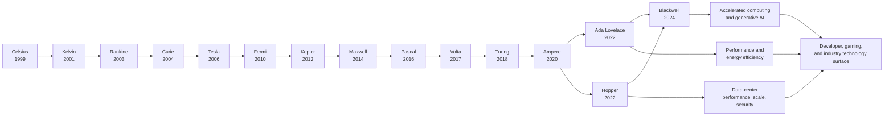
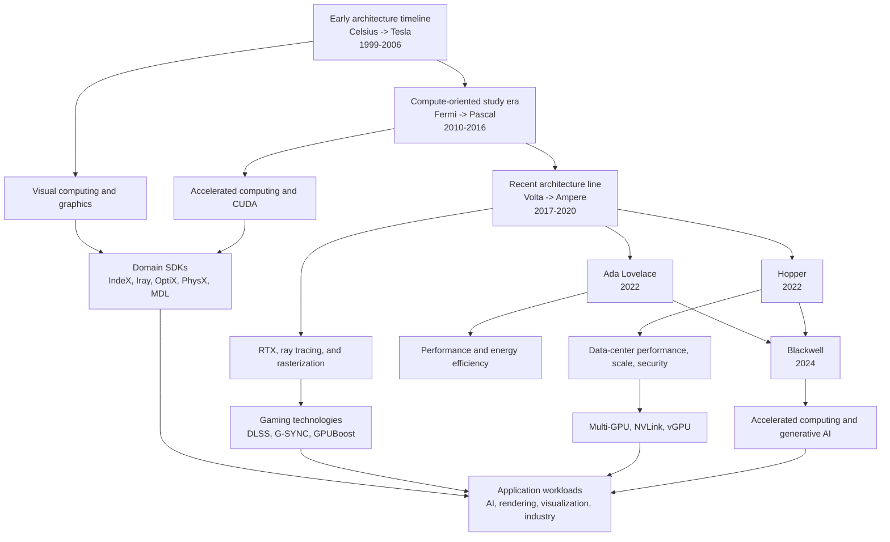

# NVIDIA GPU Evolution: From Graphics to Accelerated Computing

**Sources:** [NVIDIA Technologies & Architectures](https://www.nvidia.com/en-us/technologies/), [Volta architecture](https://www.nvidia.com/en-us/data-center/volta-gpu-architecture/), [Turing Architecture In-Depth](https://developer.nvidia.com/blog/nvidia-turing-architecture-in-depth/), [Ampere architecture](https://www.nvidia.com/en-us/data-center/ampere-architecture/), [Hopper Architecture In-Depth](https://developer.nvidia.com/blog/nvidia-hopper-architecture-in-depth/), [Ada Lovelace architecture](https://www.nvidia.com/en-us/technologies/ada-architecture/), and [Blackwell architecture](https://www.nvidia.com/en-us/data-center/technologies/blackwell-architecture/), captured on 2026-08-22.

**Related pages:** [NVIDIA GPU Evolution](index.md), [Hardware and Numerics](../index.md), [CUDA Programming Model](../../frameworks/cuda/index.md), [CUDA Tile IR](../../frameworks/cuda/tile-ir/index.md), [Triton](../../frameworks/triton/index.md), [FlashAttention-4](../../algorithms/flashattention/flashattention-4.md), [NVFP4](../quantization/nvfp4.md)

> **Evidence boundary:** The category page directly provides the architecture timeline and short descriptions for Blackwell, Hopper, and Ada Lovelace. The linked Volta, Ampere, Ada Lovelace, and Blackwell pages provide generation-specific details; the category's Hopper link redirects to NVIDIA's About page and its Turing link redirects to the RTX PRO platform, so the detailed Hopper and Turing sections use NVIDIA's official architecture-in-depth articles. The capability arc and cross-generation interpretation remain a learning synthesis.

## TL;DR

**What:** NVIDIA's public catalog shows a GPU architecture sequence from Celsius (1999) through Blackwell (2024), alongside an expanding set of compute, graphics, AI, scaling, and developer technologies.

**How:** Learn the evolution in two dimensions: follow the dated architecture line, then track how the usable capability surface widens from visual computing to general CUDA computation, domain SDKs, multi-GPU systems, AI, and modern accelerated computing.

**The number:** The category page names 15 architecture milestones and six linked modern architecture entries; the linked sources expose six distinct transitions from Volta Tensor Cores through Blackwell's multi-die, low-precision, and rack-scale AI design.

## The Big Picture

The reader question is: **how did NVIDIA's GPU story expand across generations and workloads?**

*Synthesized evolution map from the captured [NVIDIA Technologies & Architectures](https://www.nvidia.com/en-us/technologies/) page. 1. Read the architecture names and dates as the historical spine. 2. Treat Ada, Hopper, and Blackwell's short descriptions as current study anchors. 3. Follow the technology catalog into compute, developer, gaming, and industry capabilities. The branch connections are an explanatory synthesis, not a complete NVIDIA architecture diagram.*

The editable source is [evolution-path.mmd](assets/evolution-path.mmd).

## Why This Exists

It is easy to memorize Celsius, Tesla, Fermi, Volta, Turing, Ampere, Ada, Hopper, and Blackwell as a sequence of names and still not understand what evolved. A name list does not explain why a developer might study CUDA, why a rendering engineer might follow RTX and OptiX, why a data-center system might care about NVLink and vGPU, or why modern descriptions emphasize AI, scale, and efficiency.

Use one concrete object to make the evolution visible: an interactive 3D scene containing a large volume, physically based materials, ray-traced effects, and an optional neural reconstruction pass. The catalog gives different entry points for that object: IndeX for massive volumetric visualization, MDL for materials, OptiX and RTX for ray tracing, CUDA for general computation, Multi-GPU and NVLink for scale, and gaming or industry technologies for the final experience. The architecture timeline tells you when to ask the question; the technology catalog tells you which capability family to study next.

## The Landscape

The source presents a time-ordered architecture family and a set of capability branches. This landscape treats the dated family as the trunk and the technology categories as branches that increasingly connect the GPU to general computation, specialized domains, system scale, and AI. The editable source is [landscape.mmd](assets/landscape.mmd).

*Synthesized landscape from the architecture timeline and technology groupings in the captured NVIDIA page. The source supports the named milestones, categories, and short descriptions; the era labels and branch relationships are a study scaffold, not a claim that every capability began in the era where it appears.*

## The Core Idea

**GPU evolution is the widening of a capability contract.** The architecture line supplies successive hardware targets, while the software and system catalog shows what developers can ask those targets to do: render and visualize, run general parallel computation, accelerate specialized domains, connect many devices, and support AI-driven experiences. The exact internal change from one generation to the next requires deeper architecture sources; the durable learning frame is to compare every generation across workload, compute, memory, scale, software, and user-visible behavior.

## Capability Map

The current page is a catalog, so read each section as one dimension of evolution rather than as a single chronological claim.

| Evolution dimension | Examples named by NVIDIA | What to study |
|---|---|---|
| Architecture line | Celsius, Kelvin, Rankine, Curie, Tesla, Fermi, Kepler, Maxwell, Pascal, Volta, Turing, Ampere, Ada Lovelace, Hopper, Blackwell | What changed in the hardware contract, execution resources, memory system, precision, and system role? |
| General compute | Accelerated computing and CUDA | How does the GPU expose parallel mathematical computation beyond graphics? |
| Visual and domain work | Iray, IndeX, MDL, OptiX, PhysX, RTX | Which parts of rendering, materials, ray tracing, physics, or volume visualization receive a specialized abstraction? |
| System scale | Multi-GPU, NVLink, NVAPI, SLI, and vGPU | How do multiple devices, host links, drivers, and virtualized users change the system model? |
| Gaming experience | DLSS, G-SYNC, GPUBoost, Optimus, BatteryBoost, GameWorks | How do image quality, frame time, display synchronization, clocks, and power become product constraints? |
| AI and industry | AI computing, deep learning, machine learning, USD, virtual reality, visual computing | Which workloads and data formats turn GPU capability into an industry workflow? |

## Detailed Architecture Evolution

The six architecture links from the category page become useful when read as answers to different bottlenecks. The table is a compact map; the subsections explain the mechanism and the consequence for developers.

| Generation | Source-backed architectural emphasis | Evolutionary meaning |
|---|---|---|
| [Volta (2017)](https://www.nvidia.com/en-us/data-center/volta-gpu-architecture/) | Tensor Cores, mixed-precision CUDA libraries, and faster NVLink | Matrix acceleration becomes a first-class AI architecture target. |
| [Turing (2018)](https://developer.nvidia.com/blog/nvidia-turing-architecture-in-depth/) | RT Cores, Tensor Core inference, concurrent FP/INT execution, unified L1/shared-memory path, and GDDR6 | Graphics becomes a hybrid of rasterization, ray tracing, and AI. |
| [Ampere (2020)](https://www.nvidia.com/en-us/data-center/ampere-architecture/) | TF32 and FP64 Tensor Core modes, MIG, structural sparsity, larger memory/cache, and stronger NVLink | One architecture serves elastic data-center AI, HPC, inference, and graphics workloads. |
| [Hopper (2022)](https://developer.nvidia.com/blog/nvidia-hopper-architecture-in-depth/) | FP8 Transformer Engine, TMA, thread block clusters, distributed shared memory, DPX, HBM3, and NVLink Network | The programming and communication hierarchy expands to feed large AI/HPC systems asynchronously. |
| [Ada Lovelace (2022)](https://www.nvidia.com/en-us/technologies/ada-architecture/) | Third-generation RT Cores with SER, FP8 Tensor Cores, AV1 acceleration, OFA, and DLSS 3 | Graphics, AI inference, video, and professional visualization are co-designed as a full stack. |
| [Blackwell (2024)](https://www.nvidia.com/en-us/data-center/technologies/blackwell-architecture/) | Two-die package, micro-tensor scaling for FP4, confidential computing, decompression, RAS, and rack-scale NVLink | The unit of design grows from a GPU chip to a secure, connected AI system. |

### Source status for the category links

Two links in the category page no longer resolve to architecture-specific pages. Keeping this distinction visible prevents a current redirect from being mistaken for historical evidence.

| Category-page entry | Current capture result | How this insight uses it |
|---|---|---|
| Hopper Architecture | The link redirects to NVIDIA's [About Us](https://www.nvidia.com/en-us/about-nvidia/) page. | The category's data-center positioning is retained, while technical Hopper details come from NVIDIA's [Hopper Architecture In-Depth](https://developer.nvidia.com/blog/nvidia-hopper-architecture-in-depth/) article. |
| Turing Architecture | The link redirects to NVIDIA's [RTX PRO Platform](https://www.nvidia.com/en-us/products/workstations/) page. | The category's RTX description is retained, while technical Turing details come from NVIDIA's [Turing Architecture In-Depth](https://developer.nvidia.com/blog/nvidia-turing-architecture-in-depth/) article. |

### Volta (2017): Tensor Cores make AI a first-class architecture target

**What changed:** Volta introduced the Tensor Core architecture as a dedicated matrix-math path and paired it with CUDA and deep-learning libraries.

**Why it matters:** General CUDA cores can execute matrix arithmetic, but a dedicated matrix unit changes the throughput and precision trade-off for neural-network training and inference.

**How it works:**

1. The NVIDIA Volta page describes a GPU with 640 Tensor Cores, more than 21 billion transistors, and more than 125 TFLOPS of deep-learning performance; these are NVIDIA's reported product figures.
2. Tensor Cores handle the matrix operations central to deep learning while CUDA cores remain available for general computation and orchestration.
3. Volta-optimized CUDA, cuDNN, NCCL, TensorRT, and mixed-precision support give frameworks a software path to use the new hardware.
4. Next-generation NVLink doubles the throughput of the previous generation, extending the design from one accelerator toward model- and data-parallel systems.

**The intuition:** Volta adds a specialized matrix engine and then teaches the software stack how to use it.

**A concrete example:** In the interactive scene, a neural reconstruction or denoising stage can become a GPU workload alongside rendering. Volta's architectural lesson is that a graphics product can gain a second, AI-oriented compute path without abandoning the general CUDA path.

**Remember:** Volta is the point in this source set where Tensor Core AI acceleration becomes the central architectural story.

### Turing (2018): Hybrid rendering joins rasterization, ray tracing, and AI

**What changed:** Turing added RT Cores for ray tracing, enhanced Tensor Cores for inference, a new SM execution path, and GDDR6 memory while keeping programmable shading and CUDA compatibility.

**Why it matters:** Real-time ray tracing was too expensive to perform entirely through general shader instructions. The architecture needed dedicated traversal and intersection hardware while preserving the existing graphics pipeline.

**How it works:**

1. Turing's RT Core accelerates bounding-volume-hierarchy traversal and ray-triangle intersection, returning visibility work to the SM instead of making shaders perform every traversal step.
2. Turing's SM has separate FP32 and INT32 execution paths, allowing address and integer work to overlap with floating-point work; its shared memory, L1 cache, and texture cache use a unified memory path.
3. Turing Tensor Cores add INT8 and INT4 modes for inference and power neural graphics features such as DLSS; the source also describes RTX APIs and hybrid rendering.
4. GDDR6 raises the memory data rate to 14 Gbps in the source's comparison, while improved compression and a larger L2 cache target the bandwidth pressure created by richer graphics.
5. Mesh shading, variable-rate shading, texture-space shading, and multi-view rendering expose more ways for applications to spend or avoid shading work.

**The intuition:** Turing does not merely make rasterization faster; it adds new specialized paths so the renderer can choose the right kind of work for each part of a scene.

**A concrete example:** The scene can rasterize primary visibility, use RT Cores for selected reflections or shadows, and use a Tensor Core path for image reconstruction. The product becomes a hybrid pipeline rather than an all-or-nothing ray-tracing rewrite.

**Remember:** Turing's defining evolution is the hardware-software contract for real-time ray tracing plus AI-assisted graphics.

### Ampere (2020): Elastic data-center compute and partitioned GPUs

**What changed:** Ampere broadened the accelerator's numerical modes, partitioned one GPU into isolated instances, increased memory and interconnect capacity, and targeted AI, HPC, graphics, and elastic data-center deployment together.

**Why it matters:** A data center needs more than peak throughput. It must run different workloads, share hardware safely, keep compute fed by memory, and scale communication across GPUs.

**How it works:**

1. The Ampere page reports 54 billion transistors on a 7 nm process and identifies third-generation Tensor Cores with TF32, FP64, BF16, INT8, and INT4 support.
2. TF32 offers an AI path that preserves the programming model of FP32 while using Tensor Core acceleration; FP64 Tensor Core support extends the same machinery toward HPC.
3. Multi-Instance GPU (MIG) partitions supported GPUs into isolated instances with dedicated high-bandwidth memory, cache, and compute resources, providing a right-sized service boundary.
4. Third-generation NVLink raises direct GPU-to-GPU bandwidth to 600 GB/s in the source's A100 comparison, and NVSwitch lets GPUs in a server communicate at NVLink speed.
5. A100's reported 2 TB/s memory bandwidth and 40 MB L2 cache address the data path needed to keep larger compute engines busy, while structural sparsity increases throughput when the model and software can use it.

**The intuition:** Ampere turns raw acceleration into a shared data-center resource with more numerical choices, memory, and isolation.

**A concrete example:** If the scene is deployed for many users, MIG can change the question from "does one full GPU render it?" to "what isolated GPU slice meets each user's latency and memory target?" If the scene is distributed across GPUs, NVLink and NVSwitch become part of the rendering and data-management design.

**Remember:** Ampere's major step is elasticity: more ways to compute, partition, connect, and serve workloads.

### Hopper (2022): Asynchrony and locality expand beyond one SM

**What changed:** Hopper added FP8-aware Transformer Engine execution, asynchronous tensor movement, a thread-block-cluster level, distributed shared memory, DPX instructions, HBM3, and larger-scale NVLink networking.

**Why it matters:** Once AI and HPC workloads span many SMs and GPUs, a single thread block and a synchronous global-memory path are too small and too slow as the only coordination model.

**How it works:**

1. NVIDIA's H100 article reports 80 billion transistors on a customized 4N process; the H100 SXM5 configuration has 132 SMs, 80 GB HBM3, and 3 TB/s of memory bandwidth, while the full GH100 has 144 SMs.
2. Fourth-generation Tensor Cores add FP8 inputs and the Transformer Engine dynamically chooses and rescales FP8 or 16-bit computation by layer statistics.
3. Thread block clusters create a new programming hierarchy above blocks. Cluster blocks are concurrently scheduled across nearby SMs and can cooperate through distributed shared memory.
4. The Tensor Memory Accelerator moves multidimensional blocks between global and shared memory from a descriptor, allowing fewer threads to spend time generating addresses and enabling overlap with computation.
5. Asynchronous transaction barriers let producers report both arrival and transferred-byte counts, so consumers can wait for data movement without relying on a fully synchronous path.
6. Fourth-generation NVLink provides 900 GB/s of total bandwidth in the H100 source, while NVLink Network extends communication to up to 256 GPUs across nodes; DPX adds specialized support for dynamic-programming inner loops.

**The intuition:** Hopper makes locality, data movement, and synchronization explicit resources that can operate concurrently with arithmetic.

**A concrete example:** A long-context attention kernel can stage tensor tiles with TMA, overlap movement with Tensor Core work, and use a cluster when neighboring blocks need to share data. Its performance depends on the pipeline and communication hierarchy, not only on matrix throughput.

**Remember:** Hopper's signature is an asynchronous programming hierarchy designed to feed large AI and HPC systems.

### Ada Lovelace (2022): Graphics, AI inference, video, and efficiency converge

**What changed:** Ada advanced ray tracing, AI inference, video processing, and virtualization as one professional and consumer graphics platform.

**Why it matters:** Modern graphics workloads are no longer just shader arithmetic. They combine ray traversal, neural reconstruction, video encode/decode, display behavior, and power constraints.

**How it works:**

1. Third-generation RT Cores and Shader Execution Reordering (SER) target inefficient ray-tracing and shader workloads; the Ada page reports up to 2x ray-tracing performance over the previous generation.
2. Fourth-generation Tensor Cores add structured sparsity and FP8 support; the page reports up to 4x higher inference performance over the previous generation.
3. Ada CUDA cores double-speed FP32 processing in the page's comparison, supporting both graphics work and desktop simulation.
4. The video path adds an AV1 stack, up to twice as many encoders and decoders, and a source-reported capacity of up to three times more concurrent video streams than the previous generation.
5. DLSS 3 combines Tensor Cores and a new Optical Flow Accelerator with software to form a full-stack rendering feature; the source explicitly describes it as hardware-software co-design.
6. Professional data-center variants add vGPU improvements, secure boot, and higher memory/user-density claims for virtual workstations and virtual PCs.

**The intuition:** Ada treats the frame as a pipeline of specialized hardware and learned software stages, not just a sequence of CUDA shader instructions.

**A concrete example:** The scene can use RT Cores for selected rays, Tensor Cores and optical flow for neural frame construction, and the video engines for streaming. The acceptance test must measure image quality, latency, stream capacity, and power together.

**Remember:** Ada's evolution is full-stack graphics acceleration with AI, ray tracing, video, and virtualization tied together.

### Blackwell (2024): The GPU becomes a multi-die, secure, rack-scale AI platform

**What changed:** Blackwell pushes the architecture boundary outward: the GPU is a two-die package, low-precision AI is built around micro-tensor scaling, security and resilience are hardware concerns, and NVLink connects rack-scale systems.

**Why it matters:** Trillion-parameter and agentic AI workloads stress packaging, memory, precision, communication, security, and operations at the same time. A faster isolated GPU is not enough if the model does not fit or the cluster cannot move data efficiently.

**How it works:**

1. The Blackwell page reports 208 billion transistors, a customized TSMC 4NP process, two reticle-limited dies, and a 10 TB/s chip-to-chip interconnect presenting them as one GPU.
2. The second-generation Transformer Engine combines Blackwell Tensor Cores with software and adds micro-tensor scaling for 4-bit floating-point AI; the source connects this to FP4 accuracy and model capacity.
3. Confidential Computing adds hardware protection for sensitive data and models, including TEE-I/O and protection over NVLink; the page claims nearly identical throughput to unencrypted modes, which requires workload-specific verification.
4. Fifth-generation NVLink can connect up to 576 GPUs in the source's description. The NVLink Switch Chip provides 130 TB/s of GPU bandwidth in a 72-GPU NVL72 domain and supports collective-operation acceleration.
5. A decompression engine moves database decompression work toward the accelerator, while the RAS Engine monitors hardware and software signals for fault diagnosis and predictive maintenance.
6. Products such as GB200 NVL72 make the rack a meaningful unit of deployment: Grace CPUs, Blackwell GPUs, NVLink, cooling, and software operate as one AI infrastructure design.

**The intuition:** Blackwell evolves the unit of optimization from a single GPU to a secure, memory-efficient, operationally resilient AI factory.

**A concrete example:** A long-context reconstruction service may need FP4 to fit the model, NVLink to share work across GPUs, confidential computing to protect data, and RAS to keep a large deployment available. The architecture question is now a system question.

**Remember:** Blackwell's defining step is deep co-design across package, precision, security, communication, and operations.

### The continuity: three architectural arcs

The generations are not isolated inventions. Three arcs connect the detailed sources:

| Arc | Evolution across the captured sources | Why it matters |
|---|---|---|
| Specialized compute | Volta Tensor Cores -> Turing inference modes -> Ampere TF32/FP64 and sparsity -> Hopper FP8 Transformer Engine -> Ada FP8 inference -> Blackwell FP4 micro-scaling | The useful question changes from "how many CUDA cores?" to "which precision and specialized unit matches this workload?" |
| Data movement and locality | Volta/Turing NVLink -> Ampere 600 GB/s NVLink and larger cache -> Hopper HBM3, TMA, clusters, DSMEM, and NVLink Network -> Blackwell multi-die and rack-scale NVLink | Arithmetic only helps when memory, synchronization, and communication can feed it. |
| Workload contract | AI enters the architecture through Volta -> Turing fuses AI with ray-traced graphics -> Ampere serves elastic AI/HPC -> Hopper targets transformer and large-scale HPC -> Ada integrates graphics/video/AI -> Blackwell targets generative and agentic AI factories | Each generation expands what the software stack can express and what system operators must validate. |

The strongest historical lesson is therefore not that every generation is simply faster. It is that the bottleneck and the unit of design keep moving: from matrix operations, to hybrid graphics, to shared data-center resources, to asynchronous clusters, to full-stack graphics, and finally to connected AI systems.

## Deep Dive

### 1. Use the architecture timeline as the historical spine

**What it does:** Gives the learner a stable chronological order for comparing NVIDIA GPU generations.

**Why it matters:** Without a timeline, architecture concepts become disconnected feature names. With one, each technical question can be asked against a specific generation and date.

**How it works:**

1. Start with the 15 milestones named on the page: Celsius, Kelvin, Rankine, Curie, Tesla, Fermi, Kepler, Maxwell, Pascal, Volta, Turing, Ampere, Ada Lovelace, Hopper, and Blackwell.
2. Record the two 2022 entries separately: Ada Lovelace and Hopper are parallel branches in the catalog, not one simple replacement chain.
3. Treat Blackwell (March 2024), Hopper (March 2022), and Ada Lovelace (September 2022) as the three generations for which the captured page gives short positioning statements.
4. For earlier generations, use the names and dates as anchors and consult generation-specific technical material before assigning a feature transition.
5. For every comparison, write down the workload, architecture contract, memory, precision, interconnect, software, and product behavior being compared.

**The intuition:** The timeline is the table of contents; the architecture documents are the chapters.

**A concrete example:** When studying the interactive 3D scene, first place the question on the timeline: is this a legacy graphics-era question, a CUDA compute question, an RTX/ray-tracing question, or a current Blackwell/Hopper/Ada question? The answer determines which detailed source to read next.

**Remember:** A generation name tells you where to look, not what every circuit can do.

### 2. Read the early generations as a foundation, not a feature checklist

**What it does:** Establishes the long historical trunk from Celsius (1999) through Tesla (2006) without inventing undocumented details from the catalog.

**Why it matters:** Early names are important context, but the captured page gives mostly dates and labels for these milestones. Overconfident summaries would turn sparse evidence into false history.

**How it works:**

1. Learn the ordering Celsius -> Kelvin -> Rankine -> Curie -> Tesla.
2. Associate this portion of the timeline with the source's visual-computing and graphics-related technology surface as a broad historical study question, not a source-proven one-to-one mapping.
3. Ask which workload the hardware was expected to accelerate, what the programmer could control, and what memory or display constraints dominated.
4. Find architecture-specific references for the exact execution model, supported APIs, and product scope.
5. Compare the old contract with the modern CUDA and developer contract rather than comparing product names alone.

**The intuition:** The early trunk tells you where the story starts; it does not answer every historical why.

**A concrete example:** For the 3D scene, ask how much of the pipeline is fixed graphics, how much is programmable, and where a developer would have placed volume data or materials. Those questions make the evolution concrete while leaving unsupported implementation claims open for further reading.

**Remember:** Use sparse historical entries to frame questions, not to manufacture specifications.

### 3. Follow the expansion from graphics into general computation

**What it does:** Uses CUDA and accelerated computing to study the GPU as a platform for general-purpose parallel mathematical work.

**Why it matters:** The most important evolutionary shift for many developers is not a new product name; it is being able to express non-graphics workloads through a stable programming model.

**How it works:**

1. Read the NVIDIA page's description of CUDA as a parallel computing platform and enabling hardware/software technology.
2. Connect that description to the [CUDA Programming Model](../../frameworks/cuda/index.md): host code launches device work, grids contain blocks, warps execute threads, and memory placement shapes cost.
3. Study how tiled or compiler-managed abstractions such as [CUDA Tile IR](../../frameworks/cuda/tile-ir/index.md) and [Triton](../../frameworks/triton/index.md) change the programmer's responsibility without removing the underlying hardware constraints.
4. Compare the same workload as a graphics operation, a CUDA kernel, and a higher-level tiled program.
5. Verify the actual generation-specific support in the linked architecture and programming documentation.

**The intuition:** General-purpose GPU evolution is the move from asking the hardware to draw a result to asking it to compute a wider class of parallel results.

**A concrete example:** The scene pipeline can use CUDA to preprocess a large volume or generate a neural reconstruction tensor before the rendering path consumes it. The scene is still visual, but the developer now has a general computation layer that is not itself a graphics API.

**Remember:** CUDA is the software contract that makes the GPU useful beyond a fixed graphics path.

### 4. Track specialization through domain SDKs and RTX

**What it does:** Shows how general GPU capability is packaged into specialized developer abstractions for rendering, materials, physics, ray tracing, and volumetric data.

**Why it matters:** Developers rarely want to rebuild every hardware-specific primitive. Domain SDKs turn architecture capability into reusable workflows with narrower responsibilities.

**How it works:**

1. Use IndeX for the source's example of massive 3D volumetric visualization and GPU-cluster computing.
2. Use OptiX when the central problem is a GPU ray-tracing pipeline.
3. Use MDL when physically based materials and portable appearance across supporting applications matter.
4. Use PhysX when the application needs a scalable physics solution across supported devices.
5. Study RTX as a combined visual surface: the source describes ray tracing, deep learning, and rasterization together under the Turing GPU architecture context.
6. Keep CUDA underneath for custom preprocessing or operations that the domain SDK does not own.

**The intuition:** Specialization is not the opposite of general compute; it is a reusable vocabulary built on top of it.

**A concrete example:** The scene can load its volume through IndeX, compute a custom preprocessing step in CUDA, trace rays through OptiX or RTX, and define material behavior with MDL. The evolution lesson is the emergence of distinct software contracts for distinct parts of one workload.

**Remember:** A domain SDK reduces the amount of architecture detail every application team must carry.

### 5. Learn system evolution through Multi-GPU, NVLink, and vGPU

**What it does:** Extends the unit of reasoning from one GPU to a connected or shared system.

**Why it matters:** A workload that fits on one device may become a different architecture problem when data is partitioned across GPUs, transferred over an interconnect, or exposed to multiple virtual machines.

**How it works:**

1. Start with the source's Multi-GPU entry and ask how the application partitions data and work.
2. Study NVLink as the cataloged high-speed path for GPU-GPU or GPU-CPU data sharing; treat the source's "up to 12X" wording as a vendor claim requiring topology and workload conditions.
3. Study NVAPI as a driver-facing integration surface for direct GPU and display access on Windows.
4. Treat vGPU as a virtualization and placement question, not as another name for physical Multi-GPU execution.
5. Keep SLI separate from NVLink and vGPU because the catalog lists them as different technology surfaces.
6. Measure transfer, synchronization, capacity, and contention instead of assuming that more GPUs produce proportional speedup.

**The intuition:** The architecture evolves again when the question changes from "what can one GPU compute?" to "where does the data live, and who owns the devices?"

**A concrete example:** The scene's volume may outgrow one GPU. IndeX and Multi-GPU become relevant, NVLink may affect the transfer path, and vGPU may change the deployment model for remote users. The rendering algorithm is only one part of the new system design.

**Remember:** Multi-GPU evolution is about communication and ownership as much as arithmetic throughput.

### 6. Read Ada, Hopper, and Blackwell as parallel modern study anchors

**What it does:** Uses the short current-generation descriptions on the page to organize focused reading without pretending they are complete specifications.

**Why it matters:** Ada Lovelace and Hopper share a catalog year but point toward different emphasis, while Blackwell is described as a later platform for accelerated computing and generative AI.

**How it works:**

| Catalog anchor | Description on the captured page | Questions to investigate next |
|---|---|---|
| Ada Lovelace (September 2022) | Performance and energy efficiency | Which workloads, precision modes, memory paths, and product targets create that trade-off? |
| Hopper (March 2022) | Performance, scalability, and security for data centers | Which compute, interconnect, virtualization, and deployment mechanisms support data-center scale? |
| Blackwell (March 2024) | Accelerated computing and generative AI with performance, efficiency, and scale | Which architecture and software changes make generative-AI workloads efficient and scalable? |

The page also names earlier generations such as Ampere, Turing, and Volta. Use their dates as comparison anchors, then follow dedicated references for detailed features.

**The intuition:** Modern GPU evolution is a set of paths optimized for different system pressures, not one straight line of universally better behavior.

**A concrete example:** The scene may favor an energy-efficient workstation path, a data-center visualization path, or a generative-AI reconstruction path. Ada, Hopper, and Blackwell are useful study anchors for those different questions, but the catalog descriptions alone cannot choose the target.

**Remember:** Compare modern architectures by workload and system role, not by year alone.

### 7. Connect architecture changes to the user-visible product

**What it does:** Links internal capability evolution to image quality, frame time, display behavior, power, and industry workflow outcomes.

**Why it matters:** A GPU generation is valuable only when the user sees a better result, a faster interaction, a larger problem, a lower energy cost, or a more capable workflow.

**How it works:**

1. For gaming, study DLSS, G-SYNC, GPUBoost, Optimus, BatteryBoost, and GameWorks as separate product behaviors.
2. For rendering, study RTX, ray tracing, rasterization, Iray, MDL, and OptiX.
3. For industry, study AI computing, deep learning, machine learning, USD, virtual reality, and visual computing.
4. Map every feature claim to a measurable outcome: frame time, image quality, latency, throughput, capacity, power, or workflow coverage.
5. Keep the architecture question and the product question separate: a feature can be supported yet still fail the user's workload or quality target.

**The intuition:** Hardware evolution becomes meaningful when a user can feel or measure the difference.

**A concrete example:** The scene is not successful merely because it renders. It must meet an interactive response target, preserve material and ray-tracing quality, fit the data, and behave acceptably on the chosen display or remote deployment.

**Remember:** The final unit of progress is user-visible behavior, not a feature name.

## Putting It Together

Follow one interactive 3D scene through the evolution map. This is a learning trace built from the categories named on the NVIDIA page; it is not a historical claim that every stage began with one specific architecture.

| Step | Study object | Question | Evidence or next source | Result |
|---:|---|---|---|---|
| 1 | Architecture timeline | Which generation and date are we studying? | NVIDIA's 15 named architecture milestones | A fixed historical anchor rather than an unqualified "GPU" label. |
| 2 | Scene workload | Is the dominant need graphics, general computation, visualization, AI, or a mixture? | NVIDIA's Gaming, Enterprise & Developer, and Industry Technologies sections | A workload category and a measurable user goal. |
| 3 | Compute path | Which work is general parallel math? | CUDA catalog entry and [CUDA Programming Model](../../frameworks/cuda/index.md) | A host/device and kernel-level model for custom work. |
| 4 | Domain path | Which work deserves a specialized abstraction? | IndeX, OptiX, MDL, PhysX, Iray, and RTX entries | Clear ownership for volume data, rays, materials, physics, and rendering. |
| 5 | System path | Does the scene need one GPU, several GPUs, a link, or a virtualized device? | Multi-GPU, NVLink, NVAPI, SLI, and vGPU entries | A topology and placement hypothesis to test. |
| 6 | Modern target | Which current architecture emphasis matches the scene's role? | Ada, Hopper, and Blackwell descriptions plus their linked pages | A target generation and a list of capabilities that still need verification. |
| 7 | Product check | Did the user-visible experience improve? | Workload measurements and the relevant gaming or industry behavior | Evidence for quality, latency, capacity, power, and compatibility. |
| 8 | Historical comparison | What changed across the selected generations? | Generation-specific architecture and developer references | A defensible evolution note rather than a list of marketing labels. |

> **Important:** The public catalog supplies the timeline and technology map. The detailed comparison in step 8 requires additional architecture specifications, programming guides, benchmark conditions, and product documentation.

## What This Buys You

### The headline claim

The most useful way to learn NVIDIA GPU evolution is to combine the **dated architecture trunk** with the **widening capability branches** instead of treating each generation as an isolated faster product.

### How we know: source coverage

| Source section | Direct evidence supplied | Evolution question it helps answer |
|---|---|---|
| Architectures | 15 names and dates; short positioning for Blackwell, Hopper, and Ada Lovelace | What is the historical order and which current study anchors are emphasized? |
| Volta architecture page | Tensor Cores, mixed-precision software, NVLink, and reported transistor/performance figures | How did matrix acceleration become an explicit AI architecture target? |
| Turing architecture article | RT Cores, Tensor Core inference, concurrent FP/INT execution, GDDR6, and hybrid rendering | How did graphics combine rasterization, ray tracing, and AI? |
| Ampere architecture page | TF32/FP64 Tensor Core modes, MIG, structural sparsity, memory/cache, and NVLink | How did the GPU become an elastic AI/HPC data-center resource? |
| Hopper architecture article | FP8 Transformer Engine, TMA, clusters, distributed shared memory, DPX, HBM3, and NVLink Network | How did locality, asynchrony, and scale expand beyond one SM? |
| Ada Lovelace architecture page | RT/SER, FP8 Tensor Cores, AV1, Optical Flow Accelerator, DLSS 3, and vGPU | How did graphics, video, AI inference, and professional deployment converge? |
| Blackwell architecture page | Two-die packaging, FP4 micro-scaling, confidential computing, decompression, RAS, and rack-scale NVLink | How did the unit of design grow from a GPU to a connected AI platform? |
| Enterprise & Developer | Accelerated computing, CUDA, domain SDKs, Multi-GPU, NVAPI, NVLink, and vGPU | How does the GPU become a programmable and scalable system? |
| Gaming | DLSS, G-SYNC, GPUBoost, Optimus, BatteryBoost, and GameWorks | How do architecture capabilities become frame-time, display, and power behavior? |
| Industry Technologies | AI computing, deep learning, machine learning, USD, VR, and visual computing | Which non-gaming workflows depend on GPU evolution? |

### The mechanism behind the value

The timeline gives retrieval order; the category branches give comparison dimensions. For each generation, ask the same questions about workload, compute, memory, precision, interconnect, software, and user behavior. That repeated frame makes it possible to distinguish a hardware-generation change from a software abstraction, a system-topology feature, or a product-level optimization.

### How to read these claims

The linked architecture pages do report selected transistor counts, process nodes, SM/cache details, memory figures, and vendor performance comparisons. Those figures are useful evidence for the evolution story, but they are not one controlled benchmark: products use different form factors, clocks, workloads, precision modes, sparsity assumptions, and release dates. The category page's positioning and "up to 12X" NVLink language remain vendor claims whose topology, baseline, and workload conditions must be checked. The early-generation timeline is reliable as a list of names and dates but still insufficient for a complete technical history.

## Where It Breaks

| Failure mode | When it happens | Impact |
|---|---|---|
| Name memorization | The learner knows the generation order but cannot explain the workload or contract that changed. | Historical recall does not become architecture understanding. |
| Linear-history assumption | Ada and Hopper are treated as one simple successor path even though the catalog lists them as parallel 2022 anchors with different emphasis. | Distinct graphics, efficiency, data-center, and security questions are collapsed together. |
| Unsupported feature dating | A capability is assigned to an early generation because it appears near that generation in a synthesized diagram. | The learning note turns an inference into false technical history. |
| Catalog as specification | Short positioning text is used as an ISA, memory, compatibility, or benchmark guarantee. | Implementation and purchasing decisions rely on missing evidence. |
| Non-comparable metrics | Figures from different products, form factors, precision modes, or preliminary estimates are compared as if they were one benchmark. | A real architectural trend is obscured by an invalid numerical comparison. |
| API and architecture conflation | CUDA, OptiX, RTX, NVLink, and vGPU are treated as interchangeable layers. | Software, hardware, topology, and virtualization responsibilities become confused. |
| More GPUs means linear speedup | Multi-GPU is added without measuring communication, synchronization, or data placement. | Capacity may grow while latency or efficiency gets worse. |
| Marketing number generalized | The source's "up to 12X" NVLink wording is applied without topology, baseline, or workload conditions. | Planning estimates cannot be reproduced. |
| User behavior ignored | Correct computation or higher peak throughput is accepted without testing image quality, frame time, power, or workflow usability. | The product fails its actual target despite a technically capable GPU. |

## One Thing to Remember

**NVIDIA GPU evolution is best learned as a dated architecture trunk plus an expanding capability tree.** Follow Celsius through Blackwell for historical order, then trace how CUDA, rendering and domain SDKs, Multi-GPU links, AI, gaming, and industry technologies change what the GPU can be asked to do. When a claim becomes specific, leave the catalog and read the generation's architecture or developer documentation.

## Go Deeper

- **Start with the timeline:** [NVIDIA Technologies & Architectures](https://www.nvidia.com/en-us/technologies/), [Blackwell Architecture](https://www.nvidia.com/en-us/data-center/technologies/blackwell-architecture/), [Hopper](https://www.nvidia.com/en-us/about-nvidia/ai-computing/), and [Ada Lovelace Architecture](https://www.nvidia.com/en-us/technologies/ada-architecture/).
- **Read the detailed generation sources:** [Volta](https://www.nvidia.com/en-us/data-center/volta-gpu-architecture/), [Turing Architecture In-Depth](https://developer.nvidia.com/blog/nvidia-turing-architecture-in-depth/), [Ampere](https://www.nvidia.com/en-us/data-center/ampere-architecture/), and [Hopper Architecture In-Depth](https://developer.nvidia.com/blog/nvidia-hopper-architecture-in-depth/).
- **Learn the compute contract:** [CUDA Programming Model](../../frameworks/cuda/index.md), [CUDA Tile IR](../../frameworks/cuda/tile-ir/index.md), and [Triton](../../frameworks/triton/index.md).
- **Study modern hardware-aware workloads:** [FlashAttention-4: Blackwell Attention Kernel Co-Design](../../algorithms/flashattention/flashattention-4.md) and [NVFP4: Blackwell 4-Bit Floating Point](../quantization/nvfp4.md).
- **Use a fixed comparison exercise:** For each generation, record the workload target, software contract, memory path, precision, scale, user-visible goal, and evidence source; mark every field as reported or still to verify.
- **Reuse the editable visuals:** [evolution-path.mmd](assets/evolution-path.mmd) and [landscape.mmd](assets/landscape.mmd).
